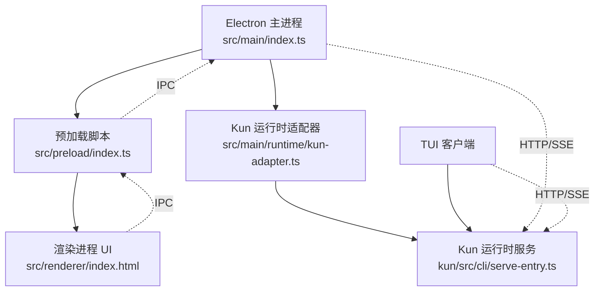
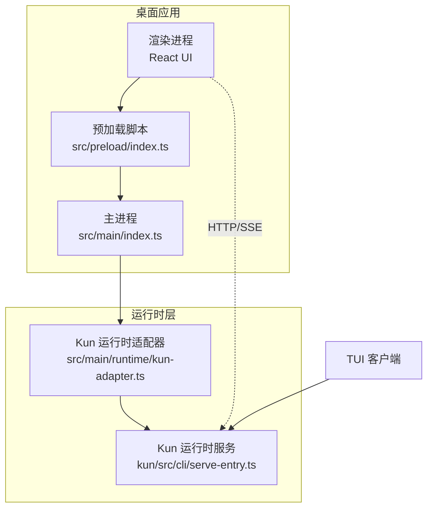
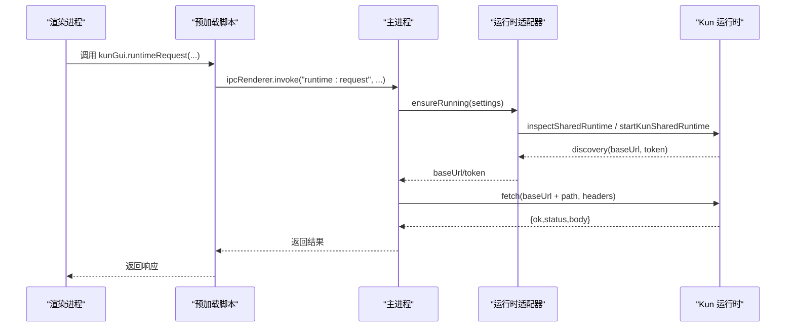
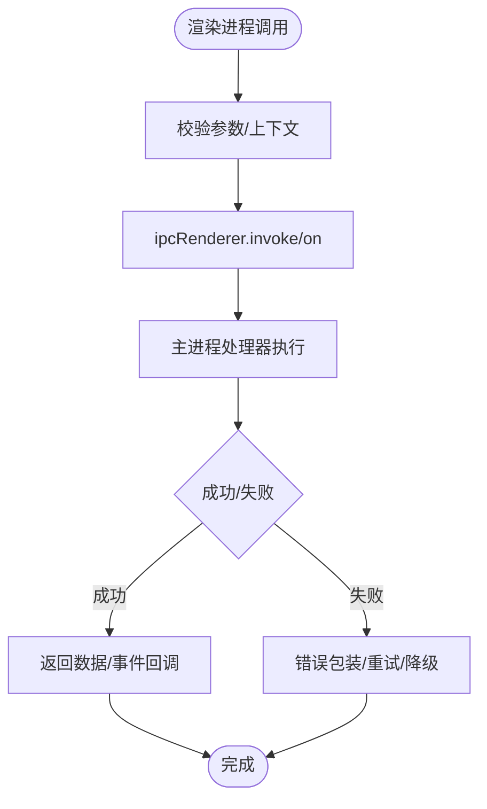
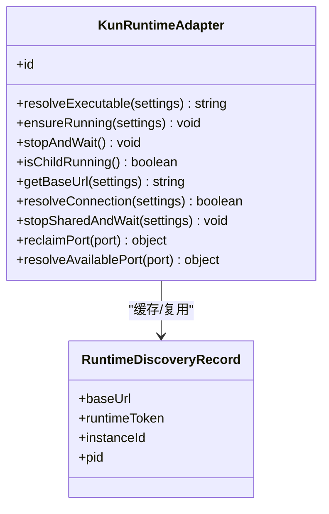
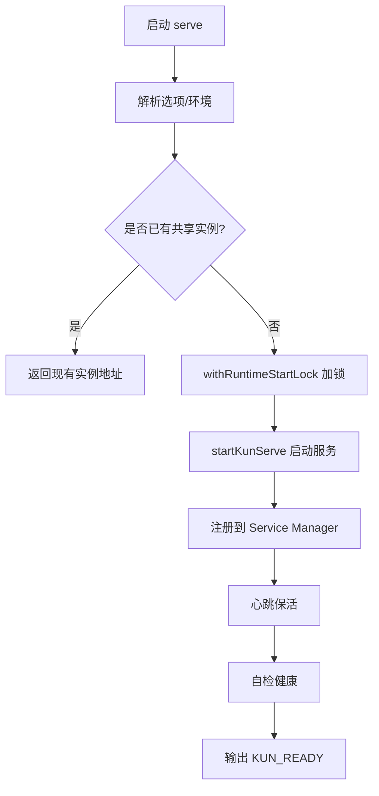
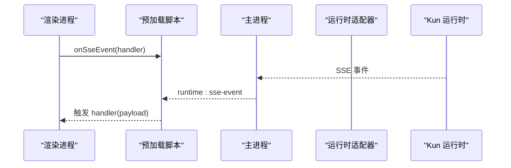
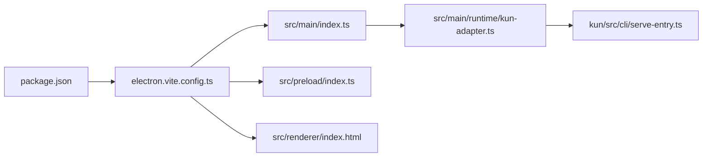

# 整体架构模式

<cite>
**本文引用的文件**
- [src/main/index.ts](file://src/main/index.ts)
- [src/preload/index.ts](file://src/preload/index.ts)
- [src/shared/kun-gui-api.ts](file://src/shared/kun-gui-api.ts)
- [src/main/runtime/kun-adapter.ts](file://src/main/runtime/kun-adapter.ts)
- [kun/src/cli/serve-entry.ts](file://kun/src/cli/serve-entry.ts)
- [electron.vite.config.ts](file://electron.vite.config.ts)
- [package.json](file://package.json)
- [README.md](file://README.md)
</cite>

## 目录
1. [简介](#简介)
2. [项目结构](#项目结构)
3. [核心组件](#核心组件)
4. [架构总览](#架构总览)
5. [详细组件分析](#详细组件分析)
6. [依赖关系分析](#依赖关系分析)
7. [性能与可维护性考量](#性能与可维护性考量)
8. [故障排查指南](#故障排查指南)
9. [结论](#结论)
10. [附录](#附录)

## 简介
本文件为 DeepSeek-GUI（Kun）的整体架构模式文档，聚焦基于 Electron 的桌面应用架构：主进程、渲染进程与预加载脚本的职责划分；GUI 与 TUI 如何共享同一个 Kun 运行时实例；事件驱动与服务导向设计的应用；系统边界、组件交互和数据流向；以及单实例锁、进程间通信协议和生命周期管理。同时说明本地优先策略、跨平台兼容性与性能优化方案的技术权衡。

## 项目结构
- 构建与入口
  - 主进程入口：src/main/index.ts
  - 预加载脚本：src/preload/index.ts
  - 渲染进程入口：由 electron-vite 配置指定 index.html
  - 构建配置：electron.vite.config.ts
  - 包元数据：package.json（定义 main、scripts、依赖等）
- 运行时
  - GUI 通过 HTTP/SSE 与本地 kun serve 运行时通信
  - TUI 通过同一 CLI 启动并连接同一运行时实例
- 共享类型与 API
  - src/shared/kun-gui-api.ts 定义渲染进程可调用的 IPC API 类型契约
  - src/shared/app-settings.ts 聚合应用设置相关类型与工具

图表来源
- [src/main/index.ts:1-200](file://src/main/index.ts#L1-L200)
- [src/preload/index.ts:1-120](file://src/preload/index.ts#L1-L120)
- [src/main/runtime/kun-adapter.ts:1-120](file://src/main/runtime/kun-adapter.ts#L1-L120)
- [kun/src/cli/serve-entry.ts:1-120](file://kun/src/cli/serve-entry.ts#L1-L120)
- [electron.vite.config.ts:5-55](file://electron.vite.config.ts#L5-L55)

章节来源
- [electron.vite.config.ts:5-55](file://electron.vite.config.ts#L5-L55)
- [package.json:1-120](file://package.json#L1-L120)

## 核心组件
- 主进程（Main）
  - 负责应用生命周期、窗口管理、托盘、单实例锁、数据迁移、扩展与插件、权限与对话框、运行时协调、SSE/IPC 桥接、资源清理等
  - 通过 kun-adapter 发现/启动/停止共享 Kun 运行时，并通过 HTTP/SSE 与其通信
- 预加载脚本（Preload）
  - 在沙箱环境中暴露最小化、安全的 kunGui API 给渲染进程
  - 将渲染进程的调用转发到主进程 IPC，并处理事件订阅与去抖
- 渲染进程（Renderer）
  - 使用 React/Vite 构建的 UI，仅通过 kunGui 与主进程交互，不直接访问 Node 能力
- Kun 运行时（Serve）
  - 提供 HTTP/SSE 接口，承载 Agent、计划、审批、模型连接、任务记录等核心能力
  - 支持共享模式，GUI 与 TUI 可同时连接同一实例，共享线程与状态

章节来源
- [src/main/index.ts:1-200](file://src/main/index.ts#L1-L200)
- [src/preload/index.ts:1-120](file://src/preload/index.ts#L1-L120)
- [src/shared/kun-gui-api.ts:580-700](file://src/shared/kun-gui-api.ts#L580-L700)
- [src/main/runtime/kun-adapter.ts:1-120](file://src/main/runtime/kun-adapter.ts#L1-L120)
- [kun/src/cli/serve-entry.ts:1-120](file://kun/src/cli/serve-entry.ts#L1-L120)

## 架构总览
下图展示 GUI/TUI 共享 Kun 运行时的整体架构：主进程作为安全边界与编排中心，预加载脚本作为受限 API 门面，渲染进程专注 UI；运行时以独立进程提供服务，GUI/TUI 通过 HTTP/SSE 访问。

图表来源
- [src/main/index.ts:1-200](file://src/main/index.ts#L1-L200)
- [src/preload/index.ts:1-120](file://src/preload/index.ts#L1-L120)
- [src/main/runtime/kun-adapter.ts:1-120](file://src/main/runtime/kun-adapter.ts#L1-L120)
- [kun/src/cli/serve-entry.ts:1-120](file://kun/src/cli/serve-entry.ts#L1-L120)

## 详细组件分析

### 主进程职责与关键流程
- 应用身份与环境初始化、单实例锁、旧数据迁移、日志与诊断
- 窗口与托盘管理、通知、电源管理、终端 PTY、工作区预览协议
- 运行时协调：发现/启动/停止共享 Kun 运行时，健康检查与恢复
- IPC 注册：集中注册所有渲染进程调用的处理器，进行参数校验与安全控制
- 扩展与插件：安装、启用、禁用、卸载、视图会话、外部浏览器控制
- 资源清理：退出时有序关闭各子运行时、释放句柄、停止后台任务

图表来源
- [src/preload/index.ts:170-180](file://src/preload/index.ts#L170-L180)
- [src/main/runtime/kun-adapter.ts:120-160](file://src/main/runtime/kun-adapter.ts#L120-L160)
- [kun/src/cli/serve-entry.ts:120-160](file://kun/src/cli/serve-entry.ts#L120-L160)

章节来源
- [src/main/index.ts:1-200](file://src/main/index.ts#L1-L200)
- [src/main/runtime/kun-adapter.ts:120-160](file://src/main/runtime/kun-adapter.ts#L120-L160)

### 预加载脚本的安全门面
- 在沙箱中暴露 kunGui API，限制对 Node/Browser 能力的访问
- 统一封装 IPC 调用与事件监听，提供进度回调、取消与防抖
- 传递应用环境信息（flavor、appName、profilePath 等），确保渲染侧行为一致

图表来源
- [src/preload/index.ts:1-120](file://src/preload/index.ts#L1-L120)
- [src/shared/kun-gui-api.ts:580-700](file://src/shared/kun-gui-api.ts#L580-L700)

章节来源
- [src/preload/index.ts:1-120](file://src/preload/index.ts#L1-L120)
- [src/shared/kun-gui-api.ts:580-700](file://src/shared/kun-gui-api.ts#L580-L700)

### 运行时适配器与共享实例
- 发现已运行的共享 Kun 运行时，若不存在则启动
- 缓存 discovery 记录（baseUrl、token、instanceId），用于后续请求
- 提供超时控制、错误分类、自动重试与租约机制，保证授权一致性
- 支持停止共享运行时（更新或存储迁移场景）

图表来源
- [src/main/runtime/kun-adapter.ts:1-120](file://src/main/runtime/kun-adapter.ts#L1-L120)
- [src/main/runtime/kun-adapter.ts:200-310](file://src/main/runtime/kun-adapter.ts#L200-L310)

章节来源
- [src/main/runtime/kun-adapter.ts:1-120](file://src/main/runtime/kun-adapter.ts#L1-L120)
- [src/main/runtime/kun-adapter.ts:200-310](file://src/main/runtime/kun-adapter.ts#L200-L310)

### 运行时服务（Serve）与单实例锁
- 解析命令与选项，确定 launchMode（shared/foreground）
- 通过 withRuntimeStartLock 防止重复启动同一 dataDir 的运行时
- 注册到 Service Manager，心跳保活，异常时尝试恢复或让出所有权
- 自检健康后输出 KUN_READY，供 GUI/TUI 发现与连接

图表来源
- [kun/src/cli/serve-entry.ts:40-120](file://kun/src/cli/serve-entry.ts#L40-L120)
- [kun/src/cli/serve-entry.ts:120-200](file://kun/src/cli/serve-entry.ts#L120-L200)
- [kun/src/cli/serve-entry.ts:200-300](file://kun/src/cli/serve-entry.ts#L200-L300)

章节来源
- [kun/src/cli/serve-entry.ts:40-120](file://kun/src/cli/serve-entry.ts#L40-L120)
- [kun/src/cli/serve-entry.ts:120-200](file://kun/src/cli/serve-entry.ts#L120-L200)
- [kun/src/cli/serve-entry.ts:200-300](file://kun/src/cli/serve-entry.ts#L200-L300)

### 事件驱动与服务导向设计
- 事件驱动
  - SSE 事件流：主进程向渲染进程推送 runtime:sse-event、runtime:sse-end、runtime:sse-error
  - 托盘/通道活动：claw:channel-activity、tray:action
  - 进度与状态：data-migration:progress、speech:local-whisper:progress、gui:update-state
- 服务导向
  - 主进程按领域拆分服务：workspace、git、workflow、daemon、schedule、claw、extension、provider 等
  - 每个服务暴露稳定的 IPC 接口，便于测试与替换实现

章节来源
- [src/preload/index.ts:430-460](file://src/preload/index.ts#L430-L460)
- [src/preload/index.ts:460-560](file://src/preload/index.ts#L460-L560)
- [src/main/index.ts:1-200](file://src/main/index.ts#L1-L200)

### 系统边界与数据流向
- 安全边界
  - 渲染进程不可直接访问 Node/Browser 敏感能力，必须通过预加载脚本
  - 主进程对所有 IPC 进行参数校验（Zod schema）与发送者信任校验
- 数据流向
  - 渲染进程 -> 预加载脚本 -> 主进程 -> 运行时适配器 -> Kun 运行时（HTTP/SSE）
  - 反向：运行时事件 -> 主进程 -> 预加载脚本 -> 渲染进程

图表来源
- [src/preload/index.ts:430-460](file://src/preload/index.ts#L430-L460)
- [src/main/runtime/kun-adapter.ts:240-310](file://src/main/runtime/kun-adapter.ts#L240-L310)

章节来源
- [src/preload/index.ts:430-460](file://src/preload/index.ts#L430-L460)
- [src/main/runtime/kun-adapter.ts:240-310](file://src/main/runtime/kun-adapter.ts#L240-L310)

## 依赖关系分析
- 构建与打包
  - electron-vite 分别构建 main、preload、renderer，preload 输出 cjs
  - package.json 定义 dev/build/dist 脚本，支持多平台打包
- 运行时依赖
  - GUI 通过 HTTP/SSE 与 kun serve 通信
  - TUI 通过同一 CLI 启动并连接同一实例，共享线程与状态
- 模块耦合
  - 主进程高度内聚于业务服务，通过 IPC 解耦渲染进程
  - 预加载脚本仅暴露必要 API，降低渲染进程耦合度

图表来源
- [package.json:1-120](file://package.json#L1-L120)
- [electron.vite.config.ts:5-55](file://electron.vite.config.ts#L5-L55)
- [src/main/index.ts:1-200](file://src/main/index.ts#L1-L200)
- [src/main/runtime/kun-adapter.ts:1-120](file://src/main/runtime/kun-adapter.ts#L1-L120)
- [kun/src/cli/serve-entry.ts:1-120](file://kun/src/cli/serve-entry.ts#L1-L120)

章节来源
- [package.json:1-120](file://package.json#L1-L120)
- [electron.vite.config.ts:5-55](file://electron.vite.config.ts#L5-L55)

## 性能与可维护性考量
- 本地优先策略
  - 默认本地保存会话、偏好、日志与运行时数据；云端 Provider 仅在用户选择时发送上下文
  - 共享运行时减少重复启动开销，提升并发体验
- 跨平台兼容性
  - 通过 Electron 抽象系统差异；托盘图标、路径、权限在不同平台适配
  - 构建脚本覆盖 macOS/Windows/Linux，支持签名与 notarize
- 性能优化
  - 运行时适配器缓存 discovery 记录，避免重复探测
  - SSE 事件批量推送与 ack 机制，降低 IPC 压力
  - 超时与重试策略，区分 GET/POST 与长连接等待
- 可维护性
  - IPC 参数使用 Zod 严格校验，错误信息明确
  - 服务按领域拆分，便于单元测试与替换实现
  - 预加载脚本最小化暴露面，降低安全风险与维护成本

章节来源
- [README.md:150-200](file://README.md#L150-L200)
- [src/main/runtime/kun-adapter.ts:216-241](file://src/main/runtime/kun-adapter.ts#L216-L241)
- [src/preload/index.ts:430-460](file://src/preload/index.ts#L430-L460)

## 故障排查指南
- 运行时无法连接
  - 检查共享运行时是否存活，适配器会检测 PID 有效性并清理缓存
  - 查看健康自检与心跳，必要时重启共享运行时
- IPC 调用失败
  - 确认预加载脚本暴露的 API 名称与主进程处理器一致
  - 检查参数是否符合 Zod schema，错误信息包含字段路径
- 事件未到达渲染进程
  - 确认事件订阅是否正确注册与注销，避免内存泄漏
  - 检查主进程是否发送对应 channel，如 runtime:sse-event
- 单实例冲突
  - 确认 app.requestSingleInstanceLock 是否获取成功
  - 对于特殊模式（如 schedule mcp server）可能跳过单实例锁

章节来源
- [src/main/runtime/kun-adapter.ts:70-100](file://src/main/runtime/kun-adapter.ts#L70-L100)
- [src/main/index.ts:710-740](file://src/main/index.ts#L710-L740)
- [src/preload/index.ts:430-460](file://src/preload/index.ts#L430-L460)

## 结论
DeepSeek-GUI 采用基于 Electron 的主进程/预加载/渲染三层架构，结合事件驱动与服务导向设计，实现了 GUI 与 TUI 共享同一 Kun 运行时的本地优先工作台。通过严格的 IPC 安全边界、健壮的运行时管理与清晰的组件职责，系统在跨平台、性能与可维护性之间取得良好平衡。未来可继续优化事件吞吐、扩展热重载与调试体验。

## 附录
- 开发命令参考
  - npm run dev：构建运行时并启动 Electron 开发环境
  - npm run dev:tui：构建运行时并启动终端 TUI
  - npm run build：生产构建
  - npm run dist：打包安装包
- 文档链接
  - 完整用户文档：kun-agent.com/docs
  - TUI 文档：docs/kun-tui.md
  - 架构与设计：docs/extensions/architecture.md、docs/DESIGN_MODE.md

章节来源
- [README.md:200-260](file://README.md#L200-L260)
- [package.json:14-88](file://package.json#L14-L88)