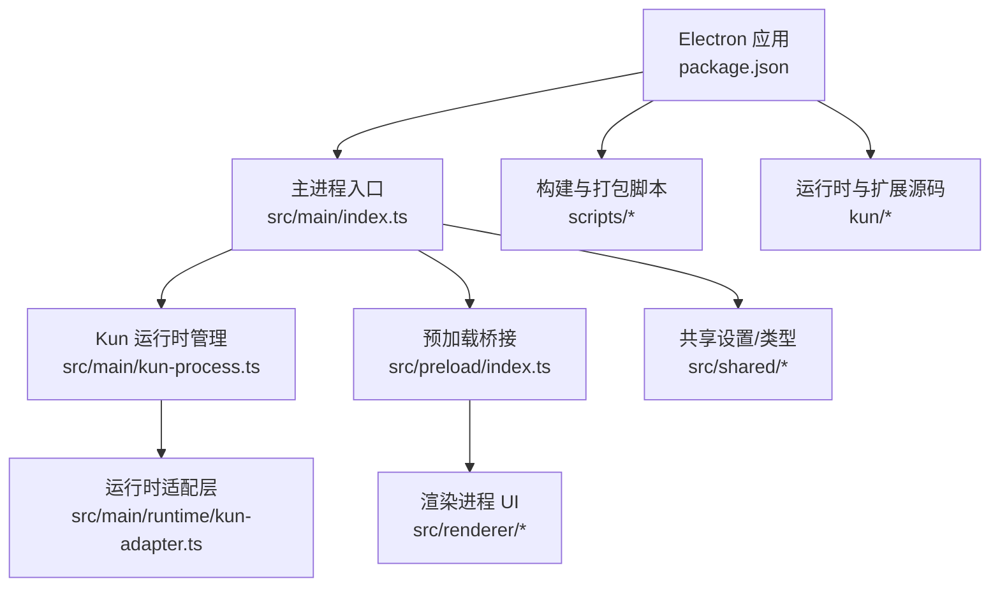
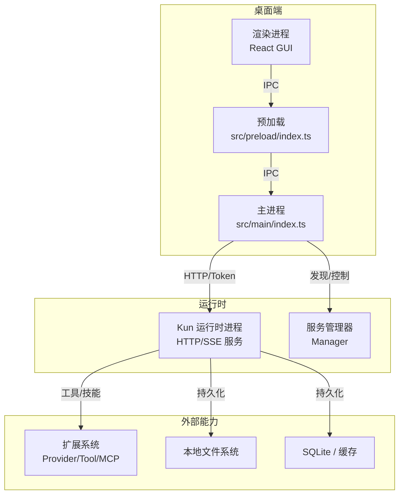
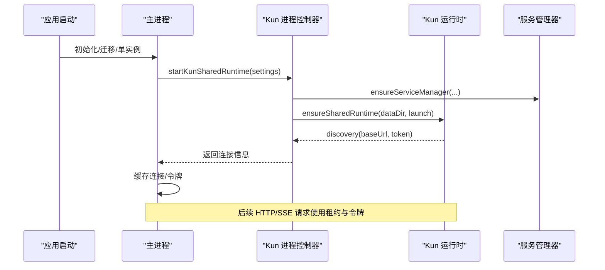
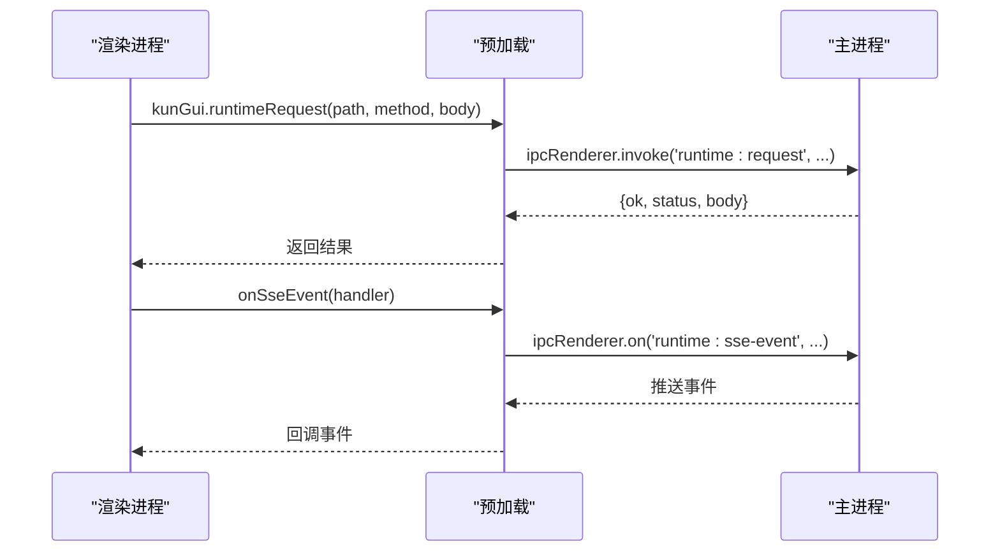
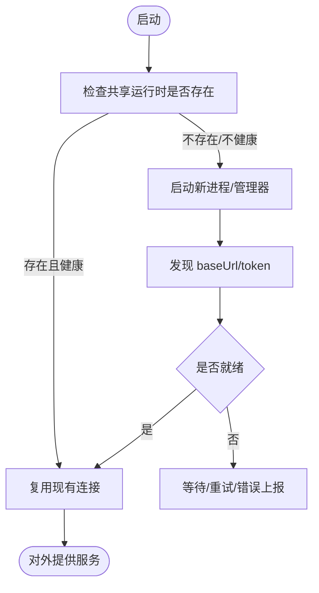
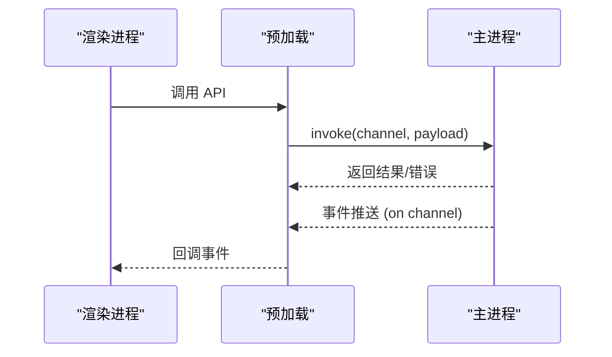
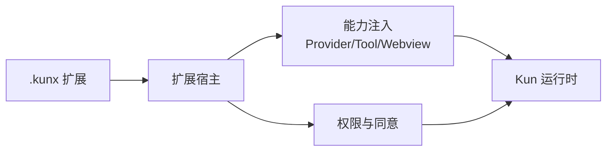
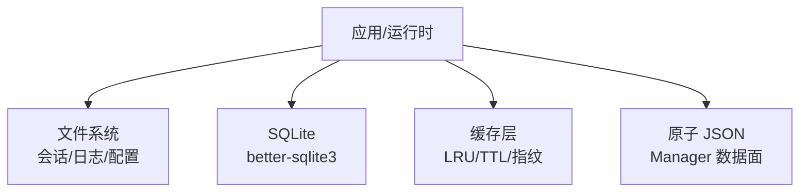
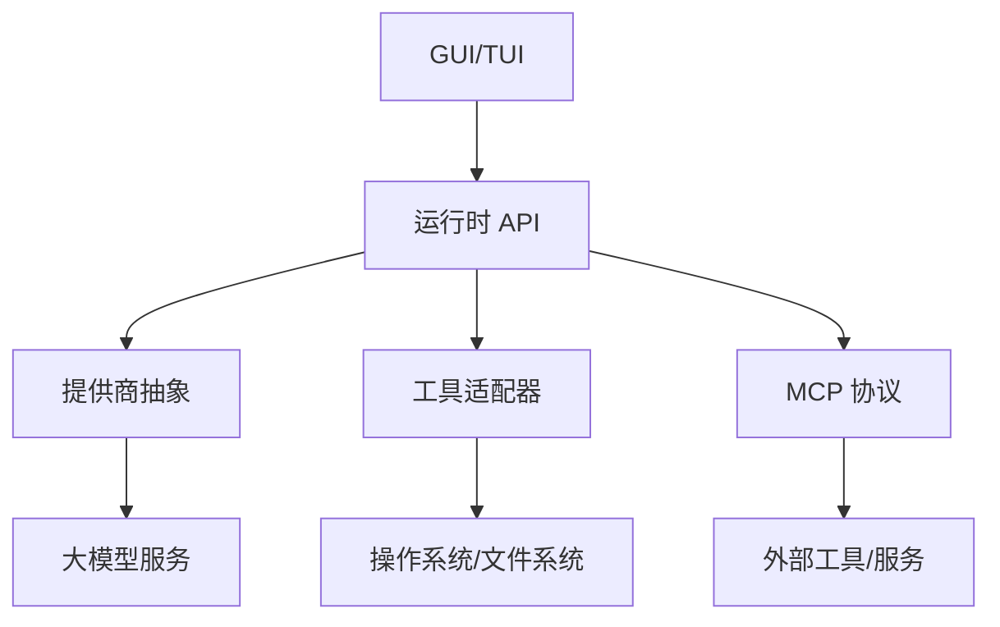
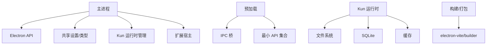

# 架构设计

<cite>
**本文引用的文件**   
- [package.json](file://package.json)
- [README.md](file://README.md)
- [src/main/index.ts](file://src/main/index.ts)
- [src/main/kun-process.ts](file://src/main/kun-process.ts)
- [src/main/runtime/kun-adapter.ts](file://src/main/runtime/kun-adapter.ts)
- [src/preload/index.ts](file://src/preload/index.ts)
</cite>

## 目录
1. [简介](#简介)
2. [项目结构](#项目结构)
3. [核心组件](#核心组件)
4. [架构总览](#架构总览)
5. [详细组件分析](#详细组件分析)
6. [依赖关系分析](#依赖关系分析)
7. [性能考虑](#性能考虑)
8. [故障排查指南](#故障排查指南)
9. [结论](#结论)
10. [附录](#附录)

## 简介
本架构文档面向 DeepSeek-GUI（Kun 桌面版），系统性阐述基于 Electron 的桌面应用架构，包括主进程、渲染进程与预加载脚本的职责划分；说明 Kun 运行时的独立进程架构，以及 GUI 与 TUI 如何共享同一运行时实例；解释 IPC 通信机制、事件驱动与服务导向设计模式；描述扩展系统的插件架构、权限模型与安全沙箱；说明数据存储层（本地文件系统、SQLite 与缓存策略）；阐述 AI 集成分层架构（模型提供商抽象、工具适配器与 MCP 协议支持）；并给出系统边界图、组件交互图与关键数据流图。同时总结技术决策权衡：本地优先策略、跨平台兼容性与性能优化方案。

## 项目结构
仓库采用多模块组织：
- 根工程提供 Electron 桌面应用（GUI）、构建脚本与打包配置。
- kun/ 子工程实现 Kun 运行时、CLI、HTTP/SSE API、扩展与工具生态。
- src/ 下分 main、preload、renderer、shared 等目录，分别对应 Electron 主进程、预加载、渲染界面与共享类型/逻辑。
- docs/ 包含用户与技术文档，extensions/ 示例展示扩展开发方式。

图表来源
- [package.json:1-20](file://package.json#L1-L20)
- [src/main/index.ts:1-120](file://src/main/index.ts#L1-L120)

章节来源
- [package.json:1-20](file://package.json#L1-L20)
- [README.md:33-50](file://README.md#L33-L50)

## 核心组件
- 主进程（Main）：负责应用生命周期、窗口管理、托盘、扩展宿主、安全策略、运行时启动与协调、IPC 注册、服务管理器等。
- 预加载（Preload）：在隔离沙箱中暴露最小化 API 给渲染进程，封装所有 IPC 调用，保证安全边界。
- 渲染进程（Renderer）：React 驱动的 GUI，通过预加载 API 与主进程交互，发起运行时请求、订阅 SSE 事件、管理工作区等。
- Kun 运行时：独立 Node 进程，提供 HTTP/SSE API，承载 Agent、工具、MCP、会话、计划、审批、任务执行等核心能力。
- 扩展系统：以 .kunx 包形式安装或侧载，提供 Provider、Tool、Webview、命令、账户等扩展点，受权限与同意流程约束。
- 数据存储：本地文件系统（会话、日志、配置）、SQLite（如 better-sqlite3）、内存/LRU 缓存、原子 JSON（Manager 数据面）。

章节来源
- [src/main/index.ts:479-506](file://src/main/index.ts#L479-L506)
- [src/preload/index.ts:49-685](file://src/preload/index.ts#L49-L685)
- [src/main/kun-process.ts:436-498](file://src/main/kun-process.ts#L436-L498)
- [src/main/runtime/kun-adapter.ts:41-105](file://src/main/runtime/kun-adapter.ts#L41-L105)

## 架构总览
下图展示了 GUI/TUI 共享 Kun 运行时的整体架构与关键交互路径。

图表来源
- [src/main/index.ts:1-120](file://src/main/index.ts#L1-L120)
- [src/main/kun-process.ts:436-498](file://src/main/kun-process.ts#L436-L498)
- [src/main/runtime/kun-adapter.ts:127-159](file://src/main/runtime/kun-adapter.ts#L127-L159)
- [src/preload/index.ts:172-183](file://src/preload/index.ts#L172-L183)

## 详细组件分析

### 主进程职责与控制流
主进程承担以下职责：
- 应用身份与环境初始化、单实例锁、迁移与恢复。
- 窗口与托盘管理、通知、电源策略。
- 启动与管理 Kun 运行时（独立进程或共享守护），处理端口分配、健康检查、异常退出与重启。
- 注册 IPC 处理器，统一暴露给渲染进程。
- 管理扩展宿主、Webview 安全守卫、外部浏览器控制。
- 协调后台服务（Claw、Schedule、Workflow、Daemon、Weixin Bridge、Whisper 等）。

图表来源
- [src/main/kun-process.ts:436-498](file://src/main/kun-process.ts#L436-L498)
- [src/main/kun-process.ts:215-247](file://src/main/kun-process.ts#L215-L247)
- [src/main/runtime/kun-adapter.ts:127-159](file://src/main/runtime/kun-adapter.ts#L127-L159)

章节来源
- [src/main/index.ts:479-624](file://src/main/index.ts#L479-L624)
- [src/main/kun-process.ts:436-498](file://src/main/kun-process.ts#L436-L498)

### 预加载与渲染进程的安全边界
预加载脚本在沙箱中运行，仅暴露最小 API 集合，所有对主进程的访问均通过 IPC。渲染进程通过 window.kunGui 调用这些方法，完成：
- 设置读写、运行时请求、SSE 流式事件订阅。
- 工作区文件操作、Git 分支与工作树、编辑器集成。
- 扩展安装/启用/撤销、账户与 Provider 管理。
- 终端 PTY 创建与数据流、消息通道。
- 通知、更新、日志、诊断等系统能力。

图表来源
- [src/preload/index.ts:172-183](file://src/preload/index.ts#L172-L183)
- [src/preload/index.ts:432-451](file://src/preload/index.ts#L432-L451)

章节来源
- [src/preload/index.ts:49-685](file://src/preload/index.ts#L49-L685)

### Kun 运行时独立进程与共享机制
- 独立进程：Kun 作为独立 Node 进程运行，提供 HTTP/SSE 接口，承载 Agent、工具、MCP、会话、计划、审批、任务执行等。
- 共享守护：通过服务管理器与数据目录锁定，确保同一数据目录下只有一个“写者”，GUI 与 TUI 可同时连接并共享线程、计划、用量与后台任务。
- 健康与恢复：主进程检测就绪状态、处理意外退出、端口冲突回收与自动重试。

图表来源
- [src/main/kun-process.ts:436-498](file://src/main/kun-process.ts#L436-L498)
- [src/main/runtime/kun-adapter.ts:127-159](file://src/main/runtime/kun-adapter.ts#L127-L159)

章节来源
- [src/main/kun-process.ts:436-498](file://src/main/kun-process.ts#L436-L498)
- [src/main/runtime/kun-adapter.ts:127-159](file://src/main/runtime/kun-adapter.ts#L127-L159)

### IPC 通信机制与事件驱动
- 请求-响应：渲染进程通过预加载调用 ipcRenderer.invoke，主进程注册对应 handler 处理业务。
- 事件推送：主进程通过 ipcRenderer.on 向渲染进程推送 SSE 事件、状态变更、通知等。
- 安全限制：预加载沙箱禁止直接访问 Node 内置模块，敏感能力需经主进程授权。
- 幂等与超时：运行时请求带超时与信号控制，避免阻塞 UI。

图表来源
- [src/preload/index.ts:172-183](file://src/preload/index.ts#L172-L183)
- [src/preload/index.ts:432-451](file://src/preload/index.ts#L432-L451)

章节来源
- [src/preload/index.ts:49-685](file://src/preload/index.ts#L49-L685)

### 服务导向设计与扩展系统
- 服务导向：主进程将各子系统（Claw、Schedule、Workflow、Daemon、Weixin Bridge、Whisper 等）封装为可启停的服务，集中生命周期管理。
- 扩展插件：以 .kunx 包形式提供 Provider、Tool、Webview、命令、账户、配置等扩展点，通过扩展宿主加载与隔离。
- 权限模型：扩展需要显式申请权限，敏感操作触发同意流程；Webview 安全守卫限制导航与资源访问。
- 安全沙箱：预加载沙箱、扩展 Webview 隔离、协议白名单、资源白名单、签名校验与审计。

图表来源
- [src/main/index.ts:233-258](file://src/main/index.ts#L233-L258)
- [src/preload/index.ts:565-661](file://src/preload/index.ts#L565-L661)

章节来源
- [src/main/index.ts:233-258](file://src/main/index.ts#L233-L258)
- [src/preload/index.ts:565-661](file://src/preload/index.ts#L565-L661)

### 数据存储层设计
- 本地文件系统：会话、日志、配置、工作区、检查点等均以文件形式持久化，支持迁移与恢复。
- SQLite：通过 better-sqlite3 提供结构化存储（例如测试与内部组件使用）。
- 缓存策略：内存 LRU、TTL LRU、前缀波动性分析、工具目录指纹等用于提升性能与稳定性。
- 原子 JSON：通过 Manager 数据面保障并发写入一致性。

图表来源
- [package.json:96-122](file://package.json#L96-L122)
- [src/main/kun-process.ts:215-247](file://src/main/kun-process.ts#L215-L247)

章节来源
- [package.json:96-122](file://package.json#L96-L122)
- [src/main/kun-process.ts:215-247](file://src/main/kun-process.ts#L215-L247)

### AI 集成分层架构
- 模型提供商抽象：统一接入多种 Provider（订阅、API、兼容服务、自托管），按线程/Agent/任务选择模型。
- 工具适配器：文件、计算机使用、浏览器使用、媒体生成、Skills、MCP 等工具以适配器形式接入。
- MCP 协议支持：通过 MCP 服务器与工具发现，扩展运行时能力。
- 审批与沙箱：高权限操作需审批，工具输出限制与路径白名单确保安全。

图表来源
- [src/main/kun-process.ts:540-644](file://src/main/kun-process.ts#L540-L644)
- [src/main/runtime/kun-adapter.ts:243-300](file://src/main/runtime/kun-adapter.ts#L243-L300)

章节来源
- [src/main/kun-process.ts:540-644](file://src/main/kun-process.ts#L540-L644)
- [src/main/runtime/kun-adapter.ts:243-300](file://src/main/runtime/kun-adapter.ts#L243-L300)

## 依赖关系分析
- 主进程依赖：Electron API、Node 标准库、共享设置、运行时管理、扩展宿主、服务管理器、安全守卫。
- 预加载依赖：contextBridge、ipcRenderer、webFrame/webUtils，暴露最小 API。
- 运行时依赖：Node.js、HTTP/SSE、文件系统、SQLite、缓存、工具与 MCP。
- 构建与打包：electron-vite、electron-builder、脚本工具链。

图表来源
- [package.json:14-88](file://package.json#L14-L88)
- [src/main/index.ts:1-120](file://src/main/index.ts#L1-L120)
- [src/preload/index.ts:1-7](file://src/preload/index.ts#L1-L7)

章节来源
- [package.json:14-88](file://package.json#L14-L88)
- [src/main/index.ts:1-120](file://src/main/index.ts#L1-L120)
- [src/preload/index.ts:1-7](file://src/preload/index.ts#L1-L7)

## 性能考虑
- 本地优先：默认本地保存会话、偏好、日志与运行时数据，减少网络开销与隐私风险。
- 共享运行时：GUI 与 TUI 共用同一运行时实例，避免重复启动与上下文割裂，提高吞吐与一致性。
- 健康与重试：运行时请求带超时与信号控制，连接失败时进行有限重试与恢复，避免雪崩。
- 缓存策略：LRU/TTL 缓存与工具目录指纹降低重复计算与 IO 压力。
- 跨平台兼容：通过 electron-vite/electron-builder 与脚本适配 macOS/Windows/Linux，原生依赖按需准备。

[本节为通用指导，无需具体文件引用]

## 故障排查指南
- 运行时未就绪：检查端口占用、服务管理器状态、构建产物是否存在；查看主进程日志与运行时 stderr 尾部。
- 连接失败：确认 baseUrl/token 是否正确，网络与代理设置；观察 fetch 错误分类与重试策略。
- 扩展问题：检查扩展安装/启用状态、权限与同意流程、Webview 安全守卫拒绝原因。
- 数据迁移：关注迁移锁、回滚与恢复流程，确保数据目录所有权一致。
- 日志定位：通过主进程日志、运行时日志、扩展诊断报告定位问题。

章节来源
- [src/main/kun-process.ts:646-711](file://src/main/kun-process.ts#L646-L711)
- [src/main/runtime/kun-adapter.ts:311-361](file://src/main/runtime/kun-adapter.ts#L311-L361)

## 结论
DeepSeek-GUI 采用 Electron 主进程 + 预加载 + 渲染进程的分层架构，结合独立的 Kun 运行时进程，实现了 GUI 与 TUI 共享同一运行时的本地优先策略。通过严格的 IPC 安全边界、事件驱动与服务导向设计，系统在可扩展性、安全性与性能之间取得平衡。扩展系统与权限模型保障了第三方能力的可控接入，数据存储层兼顾灵活性与一致性。未来可继续优化缓存策略、健康恢复与跨平台原生依赖管理，进一步提升用户体验与稳定性。

## 附录
- 快速开始：参考 README 中的下载与运行说明，GUI 与 TUI 共享同一运行时。
- 文档索引：包含 TUI、Graph Mode、Design Mode、Loop、MCP、Extensions 等技术文档。
- 贡献与许可证：遵循贡献指南与许可证要求，非商业用途需遵守相应条款。

章节来源
- [README.md:51-76](file://README.md#L51-L76)
- [README.md:244-259](file://README.md#L244-L259)