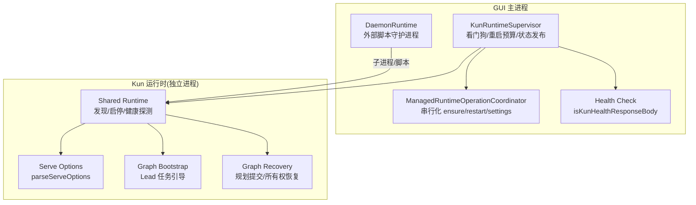
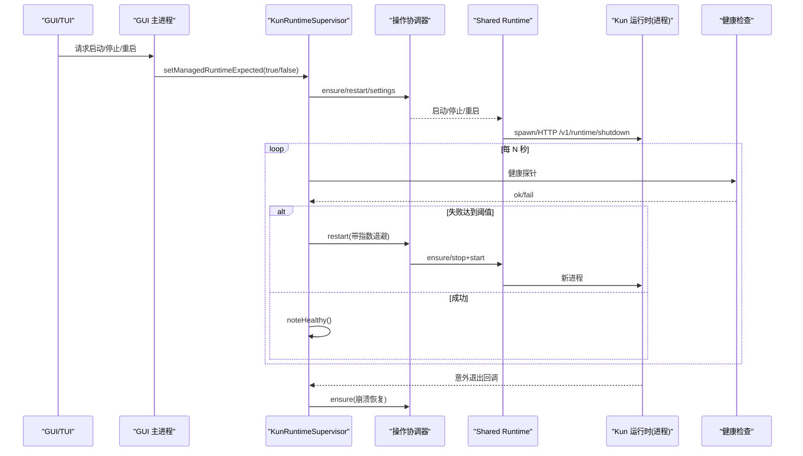
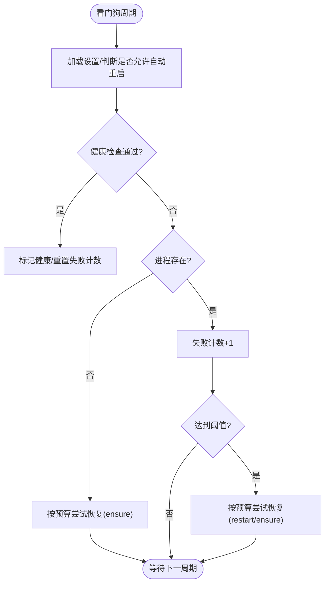
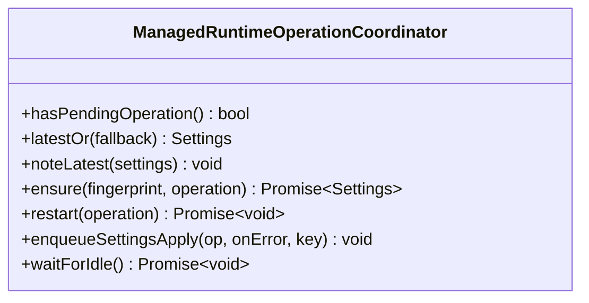
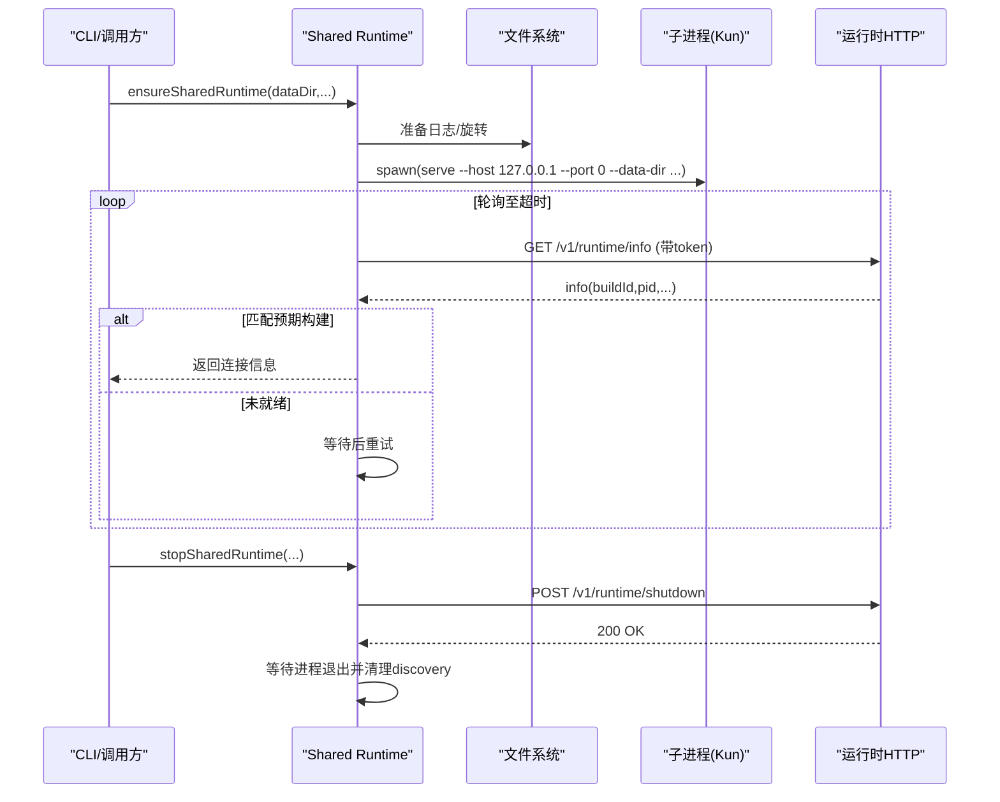
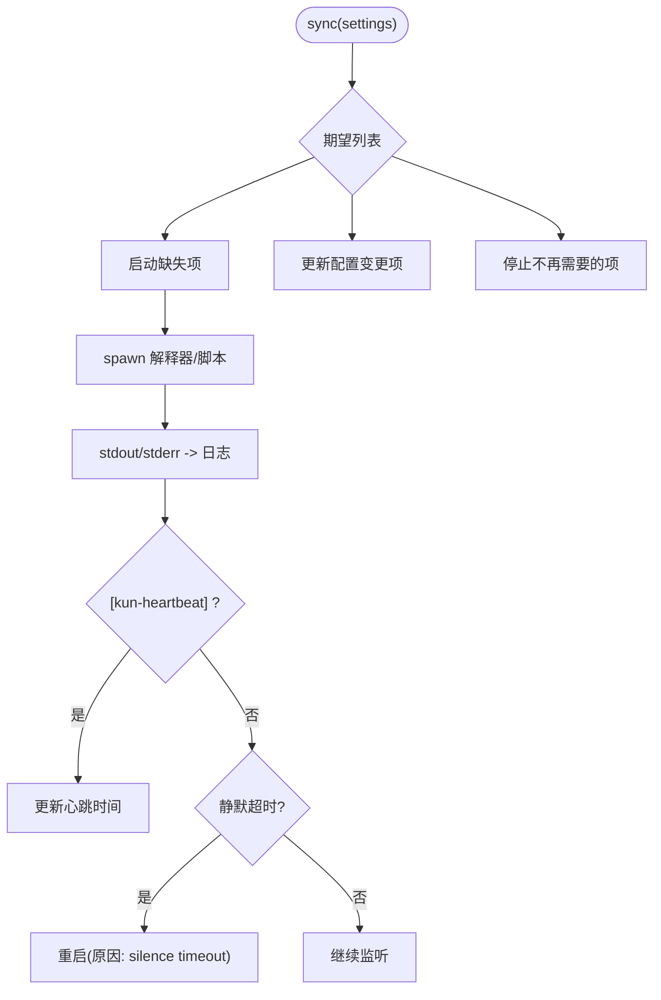
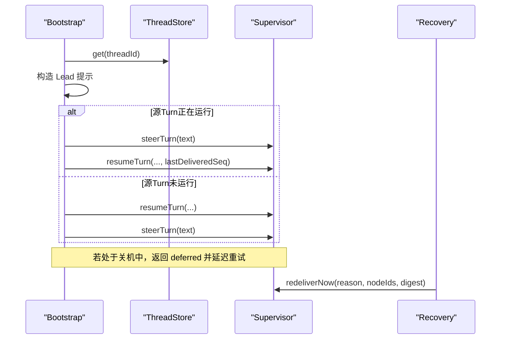
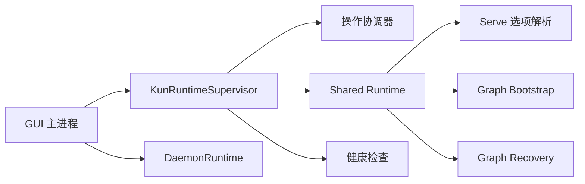

# 运行时管理

<cite>
**本文引用的文件**
- [kun-runtime-supervisor.ts](file://src/main/kun-runtime-supervisor.ts)
- [managed-runtime-operation-coordinator.ts](file://src/main/runtime/managed-runtime-operation-coordinator.ts)
- [shared-runtime.ts](file://kun/src/cli/shared-runtime.ts)
- [serve.ts](file://kun/src/cli/serve.ts)
- [daemon-runtime.ts](file://src/main/daemon-runtime.ts)
- [graph-runtime-bootstrap.ts](file://kun/src/server/graph-runtime-bootstrap.ts)
- [graph-runtime-recovery.ts](file://kun/src/server/graph-runtime-recovery.ts)
- [kun-health.ts](file://src/main/kun-health.ts)
</cite>

## 目录
1. [简介](#简介)
2. [项目结构](#项目结构)
3. [核心组件](#核心组件)
4. [架构总览](#架构总览)
5. [详细组件分析](#详细组件分析)
6. [依赖关系分析](#依赖关系分析)
7. [性能考虑](#性能考虑)
8. [故障排查指南](#故障排查指南)
9. [结论](#结论)
10. [附录](#附录)

## 简介
本文件面向 DeepSeek-GUI 的“Kun 运行时”提供一份完整的运行时管理文档。重点说明：
- 独立进程架构：GUI/TUI 与 Kun 运行时通过共享数据目录与本地 HTTP 接口协作，由主进程统一调度。
- 生命周期管理：启动、停止、监控、恢复（含自动重启与退避）策略。
- 健康检查与自愈：基于心跳/健康端点检测、看门狗轮询、失败阈值与熔断预算。
- 配置与日志：运行时参数解析、能力默认注入、日志轮转与持久化。
- 可观测性：遥测导出、事件记录与运行态指标。
- 调优与排障：常见问题定位、诊断步骤与优化建议。

## 项目结构
围绕运行时管理的代码主要分布在以下位置：
- GUI 主进程侧：运行时监督器、操作协调器、守护进程运行时、健康检查。
- Kun 运行时侧：共享运行时发现与启停、服务选项解析、图工作流引导与恢复。

图示来源
- [kun-runtime-supervisor.ts:108-195](file://src/main/kun-runtime-supervisor.ts#L108-L195)
- [managed-runtime-operation-coordinator.ts:45-123](file://src/main/runtime/managed-runtime-operation-coordinator.ts#L45-L123)
- [shared-runtime.ts:246-381](file://kun/src/cli/shared-runtime.ts#L246-L381)
- [serve.ts:29-243](file://kun/src/cli/serve.ts#L29-L243)
- [graph-runtime-bootstrap.ts:27-259](file://kun/src/server/graph-runtime-bootstrap.ts#L27-L259)
- [graph-runtime-recovery.ts:36-220](file://kun/src/server/graph-runtime-recovery.ts#L36-L220)
- [daemon-runtime.ts:75-150](file://src/main/daemon-runtime.ts#L75-L150)
- [kun-health.ts:1-12](file://src/main/kun-health.ts#L1-L12)

章节来源
- [kun-runtime-supervisor.ts:108-195](file://src/main/kun-runtime-supervisor.ts#L108-L195)
- [managed-runtime-operation-coordinator.ts:45-123](file://src/main/runtime/managed-runtime-operation-coordinator.ts#L45-L123)
- [shared-runtime.ts:246-381](file://kun/src/cli/shared-runtime.ts#L246-L381)
- [serve.ts:29-243](file://kun/src/cli/serve.ts#L29-L243)
- [daemon-runtime.ts:75-150](file://src/main/daemon-runtime.ts#L75-L150)
- [graph-runtime-bootstrap.ts:27-259](file://kun/src/server/graph-runtime-bootstrap.ts#L27-L259)
- [graph-runtime-recovery.ts:36-220](file://kun/src/server/graph-runtime-recovery.ts#L36-L220)
- [kun-health.ts:1-12](file://src/main/kun-health.ts#L1-L12)

## 核心组件
- KunRuntimeSupervisor：负责看门狗健康检查、崩溃恢复、重启预算控制、状态发布与期望管理。
- ManagedRuntimeOperationCoordinator：对 ensure/start/restart/settings 等关键操作进行串行化与合并，避免竞态。
- Shared Runtime（CLI）：负责跨进程发现、启动、停止、重启与构建版本一致性校验。
- Serve 选项解析：集中处理命令行与环境变量到运行时配置的映射。
- DaemonRuntime：管理外部脚本/守护进程的启动、日志、静默超时、推送与电源管理。
- Graph Runtime Bootstrap/Recovery：在运行时中编排 Lead 任务、恢复中断的规划与所有权。
- Health Check：验证健康响应体，用于快速判定服务可用。

章节来源
- [kun-runtime-supervisor.ts:108-195](file://src/main/kun-runtime-supervisor.ts#L108-L195)
- [managed-runtime-operation-coordinator.ts:45-123](file://src/main/runtime/managed-runtime-operation-coordinator.ts#L45-L123)
- [shared-runtime.ts:246-381](file://kun/src/cli/shared-runtime.ts#L246-L381)
- [serve.ts:29-243](file://kun/src/cli/serve.ts#L29-L243)
- [daemon-runtime.ts:75-150](file://src/main/daemon-runtime.ts#L75-L150)
- [graph-runtime-bootstrap.ts:27-259](file://kun/src/server/graph-runtime-bootstrap.ts#L27-L259)
- [graph-runtime-recovery.ts:36-220](file://kun/src/server/graph-runtime-recovery.ts#L36-L220)
- [kun-health.ts:1-12](file://src/main/kun-health.ts#L1-L12)

## 架构总览
下图展示了 GUI/TUI 如何通过主进程与独立的 Kun 运行时交互，以及看门狗如何保障可用性。

图示来源
- [kun-runtime-supervisor.ts:220-364](file://src/main/kun-runtime-supervisor.ts#L220-L364)
- [managed-runtime-operation-coordinator.ts:63-123](file://src/main/runtime/managed-runtime-operation-coordinator.ts#L63-L123)
- [shared-runtime.ts:246-381](file://kun/src/cli/shared-runtime.ts#L246-L381)
- [shared-runtime.ts:503-562](file://kun/src/cli/shared-runtime.ts#L503-L562)
- [kun-health.ts:1-12](file://src/main/kun-health.ts#L1-L12)

## 详细组件分析

### 运行时监督器（KunRuntimeSupervisor）
职责
- 维护“期望运行”状态，开启/关闭看门狗定时器。
- 周期性健康检查：若进程缺失或无响应，进入恢复流程。
- 崩溃恢复：收到意外退出时，按重启预算进行指数退避重启。
- 状态发布：向 GUI/TUI 广播运行态（running/restarting/crashed/failed/stopped）。

关键机制
- 重启预算（RestartBudget）：滑动窗口内限制最大重启次数，超过则熔断。
- 看门狗失败阈值：连续失败多次才触发恢复，避免误判。
- 操作串行化：通过协调器确保 ensure/restart/settings 不并发冲突。

图示来源
- [kun-runtime-supervisor.ts:220-364](file://src/main/kun-runtime-supervisor.ts#L220-L364)
- [kun-runtime-supervisor.ts:366-433](file://src/main/kun-runtime-supervisor.ts#L366-L433)

章节来源
- [kun-runtime-supervisor.ts:108-195](file://src/main/kun-runtime-supervisor.ts#L108-L195)
- [kun-runtime-supervisor.ts:220-364](file://src/main/kun-runtime-supervisor.ts#L220-L364)
- [kun-runtime-supervisor.ts:366-433](file://src/main/kun-runtime-supervisor.ts#L366-L433)

### 操作协调器（ManagedRuntimeOperationCoordinator）
职责
- 将 ensure/start/restart/settings 等操作放入队列串行执行。
- 支持相邻相同指纹的 ensure 合并，减少重复启动。
- settings 应用支持同键合并，避免高频保存风暴。

设计要点
- 单飞保证：restart 相邻合并；ensure 仅允许相邻且同指纹合并。
- 错误隔离：settings 应用错误不影响其他操作。

图示来源
- [managed-runtime-operation-coordinator.ts:45-123](file://src/main/runtime/managed-runtime-operation-coordinator.ts#L45-L123)
- [managed-runtime-operation-coordinator.ts:125-197](file://src/main/runtime/managed-runtime-operation-coordinator.ts#L125-L197)

章节来源
- [managed-runtime-operation-coordinator.ts:45-123](file://src/main/runtime/managed-runtime-operation-coordinator.ts#L45-L123)
- [managed-runtime-operation-coordinator.ts:125-197](file://src/main/runtime/managed-runtime-operation-coordinator.ts#L125-L197)

### 共享运行时（Shared Runtime）
职责
- 跨进程发现：读取 discovery 记录并探测 HTTP 健康。
- 启动流程：准备日志、写入能力默认值、生成 token、spawn 子进程、轮询就绪。
- 停止流程：发送 shutdown 请求，等待进程退出并清理 discovery。
- 构建一致性：比较 buildId，避免替换正在运行的 turn。

关键点
- 安全 URL 校验：仅允许回环地址与正确端口。
- 管理器集成：当存在 Service Manager 时，优先从管理器查询注册信息。
- 日志轮转：超过阈值时归档旧日志。

图示来源
- [shared-runtime.ts:246-381](file://kun/src/cli/shared-runtime.ts#L246-L381)
- [shared-runtime.ts:503-562](file://kun/src/cli/shared-runtime.ts#L503-L562)
- [shared-runtime.ts:654-697](file://kun/src/cli/shared-runtime.ts#L654-L697)

章节来源
- [shared-runtime.ts:246-381](file://kun/src/cli/shared-runtime.ts#L246-L381)
- [shared-runtime.ts:503-562](file://kun/src/cli/shared-runtime.ts#L503-L562)
- [shared-runtime.ts:654-697](file://kun/src/cli/shared-runtime.ts#L654-L697)

### 服务选项解析（Serve Options）
职责
- 将命令行参数与环境变量合并为最终运行时配置。
- 支持遥测导出、存储后端、权限策略、模型路由等丰富选项。
- 提供安全校验与默认值填充。

要点
- 优先级：命令行 > 环境变量 > 配置文件 > 默认值。
- 安全：默认仅绑定回环地址，需显式启用不安全模式。

章节来源
- [serve.ts:29-243](file://kun/src/cli/serve.ts#L29-L243)
- [serve.ts:264-336](file://kun/src/cli/serve.ts#L264-L336)

### 守护进程运行时（DaemonRuntime）
职责
- 根据设置同步外部脚本/守护进程的生命周期。
- 输出捕获、日志轮转、静默超时检测、推送限流。
- 电源管理：有活跃守护进程时阻止系统休眠。

关键点
- 优雅停止：先 SIGTERM，超时后 SIGKILL 并清理子树。
- 健康复位：持续输出一段时间后重置失败重启计数。
- 推送节流：每分钟最多固定次数，超限丢弃。

图示来源
- [daemon-runtime.ts:91-150](file://src/main/daemon-runtime.ts#L91-L150)
- [daemon-runtime.ts:203-335](file://src/main/daemon-runtime.ts#L203-L335)
- [daemon-runtime.ts:348-428](file://src/main/daemon-runtime.ts#L348-L428)

章节来源
- [daemon-runtime.ts:75-150](file://src/main/daemon-runtime.ts#L75-L150)
- [daemon-runtime.ts:203-335](file://src/main/daemon-runtime.ts#L203-L335)
- [daemon-runtime.ts:348-428](file://src/main/daemon-runtime.ts#L348-L428)

### 图工作流引导与恢复（Graph Runtime）
职责
- 引导 Lead 任务：将计划/信号注入源 Turn，必要时 steering 并 resume。
- 恢复：重启后扫描待恢复的规划提交与 Lead 所有权，重投递监督信号。

要点
- 幂等与顺序：使用 lastDeliveredSeq 避免重复投递。
- 终止态处理：对已完成/失败/取消的运行进行 reconcile。

图示来源
- [graph-runtime-bootstrap.ts:27-259](file://kun/src/server/graph-runtime-bootstrap.ts#L27-L259)
- [graph-runtime-recovery.ts:112-220](file://kun/src/server/graph-runtime-recovery.ts#L112-L220)

章节来源
- [graph-runtime-bootstrap.ts:27-259](file://kun/src/server/graph-runtime-bootstrap.ts#L27-L259)
- [graph-runtime-recovery.ts:36-220](file://kun/src/server/graph-runtime-recovery.ts#L36-L220)

## 依赖关系分析
- GUI 主进程依赖 KunRuntimeSupervisor 进行健康与恢复决策，并通过操作协调器串行化关键路径。
- Shared Runtime 作为跨进程边界，封装了发现、启动、停止与版本一致性校验。
- Serve 选项解析为运行时提供一致的初始化参数。
- DaemonRuntime 与外部脚本解耦，通过标准输入输出与约定协议通信。
- Graph 相关模块在运行时内部协作，确保长任务的可恢复性与一致性。

图示来源
- [kun-runtime-supervisor.ts:108-195](file://src/main/kun-runtime-supervisor.ts#L108-L195)
- [managed-runtime-operation-coordinator.ts:45-123](file://src/main/runtime/managed-runtime-operation-coordinator.ts#L45-L123)
- [shared-runtime.ts:246-381](file://kun/src/cli/shared-runtime.ts#L246-L381)
- [serve.ts:29-243](file://kun/src/cli/serve.ts#L29-L243)
- [daemon-runtime.ts:75-150](file://src/main/daemon-runtime.ts#L75-L150)
- [graph-runtime-bootstrap.ts:27-259](file://kun/src/server/graph-runtime-bootstrap.ts#L27-L259)
- [graph-runtime-recovery.ts:36-220](file://kun/src/server/graph-runtime-recovery.ts#L36-L220)

章节来源
- [kun-runtime-supervisor.ts:108-195](file://src/main/kun-runtime-supervisor.ts#L108-L195)
- [managed-runtime-operation-coordinator.ts:45-123](file://src/main/runtime/managed-runtime-operation-coordinator.ts#L45-L123)
- [shared-runtime.ts:246-381](file://kun/src/cli/shared-runtime.ts#L246-L381)
- [serve.ts:29-243](file://kun/src/cli/serve.ts#L29-L243)
- [daemon-runtime.ts:75-150](file://src/main/daemon-runtime.ts#L75-L150)
- [graph-runtime-bootstrap.ts:27-259](file://kun/src/server/graph-runtime-bootstrap.ts#L27-L259)
- [graph-runtime-recovery.ts:36-220](file://kun/src/server/graph-runtime-recovery.ts#L36-L220)

## 性能考虑
- 健康检查间隔与失败阈值：合理设置以避免频繁重启与 CPU 抖动。
- 重启预算：滑动窗口与指数退避防止崩溃循环。
- 操作串行化：避免并发 ensure/restart 导致资源竞争。
- 日志大小控制：守护进程与运行时均实现日志轮转，避免磁盘占用过高。
- 遥测导出：按需启用 JSONL 或 OTLP 导出，降低开销。

## 故障排查指南
常见问题与定位步骤
- 运行时无法启动
  - 检查 shared runtime 启动日志路径与权限。
  - 确认端口绑定与回环地址限制。
  - 查看构建版本是否一致，避免替换进行中任务。
- 运行时频繁重启
  - 查看重启预算与失败阈值，确认是否存在崩溃循环。
  - 检查健康探针失败原因（进程缺失/无响应）。
- 守护进程无输出
  - 检查静默超时配置与输出格式。
  - 查看日志轮转是否生效，确认最新日志文件。
- 图任务中断
  - 检查规划草稿与 Lead 所有权恢复逻辑。
  - 确认 lastDeliveredSeq 是否正确递增，避免重复或丢失。

定位工具与入口
- 健康检查：验证健康响应体字段。
- 共享运行时 CLI：status/stop/restart 命令。
- 守护进程日志：按 daemon id 读取分页日志。
- 图恢复：扫描待恢复的规划提交与监督信号。

章节来源
- [kun-health.ts:1-12](file://src/main/kun-health.ts#L1-L12)
- [shared-runtime.ts:66-166](file://kun/src/cli/shared-runtime.ts#L66-L166)
- [daemon-runtime.ts:161-182](file://src/main/daemon-runtime.ts#L161-L182)
- [graph-runtime-recovery.ts:36-220](file://kun/src/server/graph-runtime-recovery.ts#L36-L220)

## 结论
DeepSeek-GUI 的运行时管理采用“主进程监督 + 独立进程运行时”的架构，通过共享数据目录与本地 HTTP 接口实现松耦合协作。监督器结合看门狗与重启预算提供高可用的自愈能力；操作协调器确保关键路径的串行与幂等；共享运行时负责跨进程生命周期管理与版本一致性；守护进程运行时扩展了对任意脚本的托管能力；图工作流模块保障了长任务的恢复与一致性。整体设计兼顾稳定性、可观测性与可维护性。

## 附录
- 配置优先级：命令行 > 环境变量 > 配置文件 > 默认值。
- 安全默认：仅回环绑定，需显式开启不安全模式。
- 日志路径：运行时与守护进程分别落盘，支持轮转与分页读取。
- 遥测：支持 JSONL 与 OTLP 导出，可按需启用。