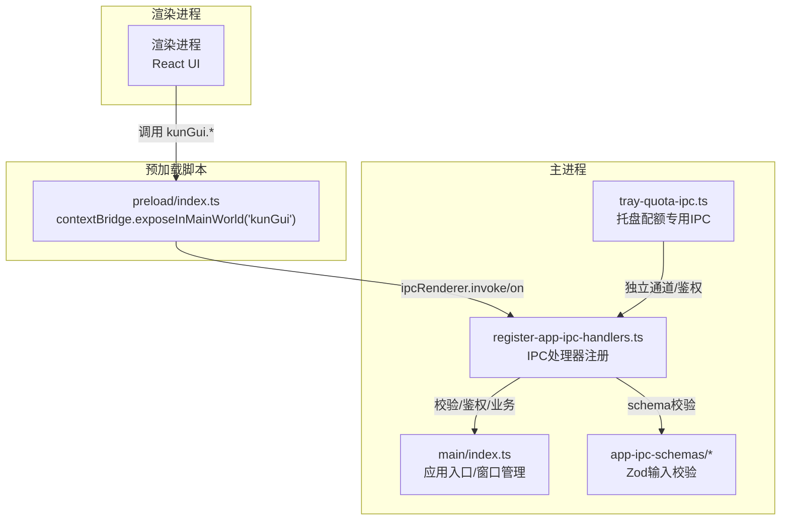
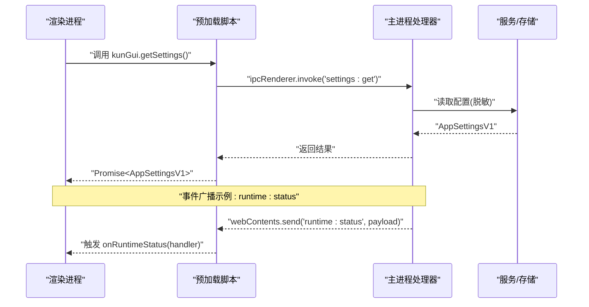
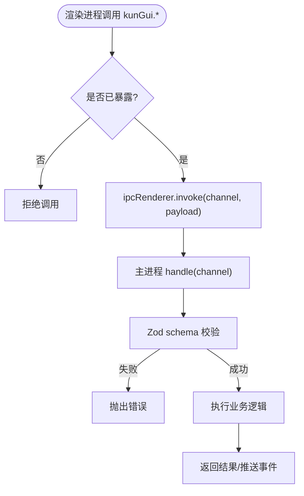
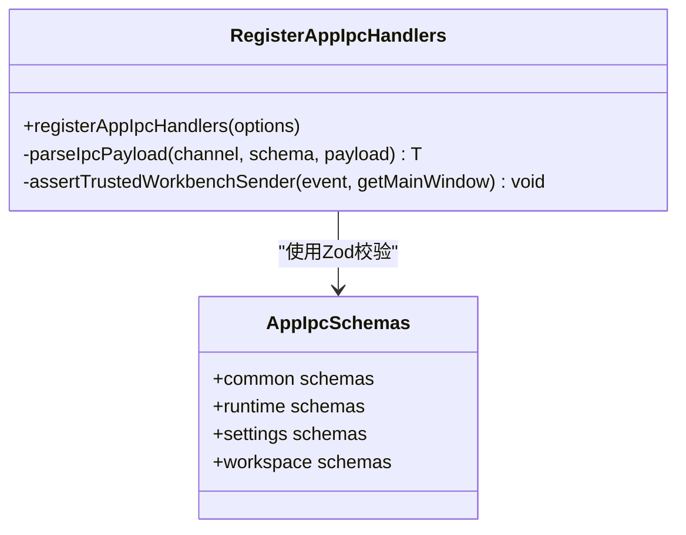
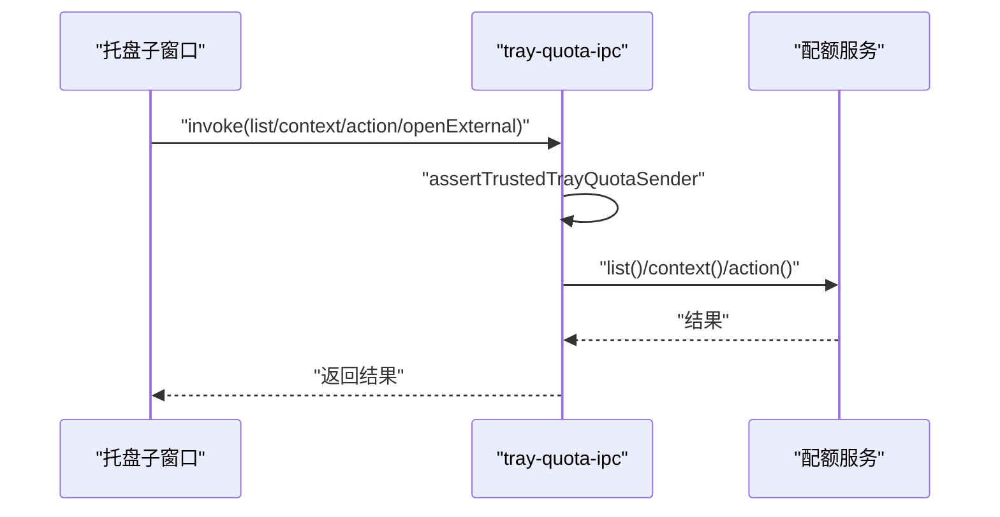
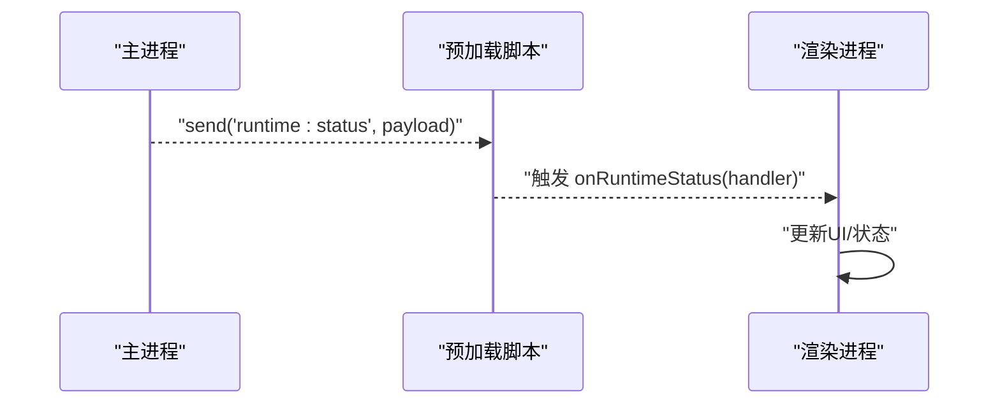
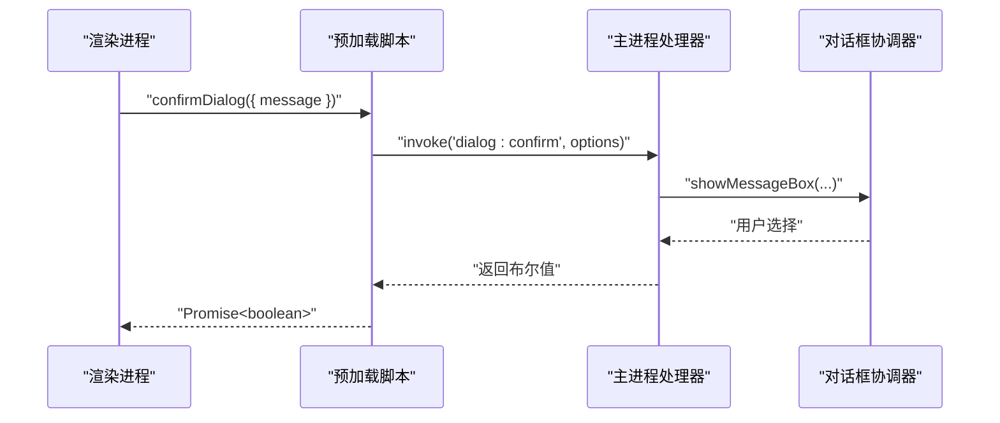
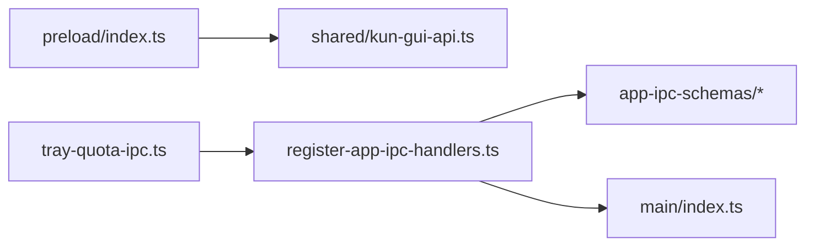

# 进程间通信

<cite>
**本文引用的文件**
- [src/main/index.ts](file://src/main/index.ts)
- [src/preload/index.ts](file://src/preload/index.ts)
- [src/shared/kun-gui-api.ts](file://src/shared/kun-gui-api.ts)
- [src/main/ipc/register-app-ipc-handlers.ts](file://src/main/ipc/register-app-ipc-handlers.ts)
- [src/main/ipc/app-ipc-schemas.ts](file://src/main/ipc/app-ipc-schemas.ts)
- [src/main/ipc/app-ipc-schemas/common.ts](file://src/main/ipc/app-ipc-schemas/common.ts)
- [src/main/tray-quota-ipc.ts](file://src/main/tray-quota-ipc.ts)
</cite>

## 目录
1. [简介](#简介)
2. [项目结构](#项目结构)
3. [核心组件](#核心组件)
4. [架构总览](#架构总览)
5. [详细组件分析](#详细组件分析)
6. [依赖关系分析](#依赖关系分析)
7. [性能考量](#性能考量)
8. [故障排查指南](#故障排查指南)
9. [结论](#结论)
10. [附录](#附录)

## 简介
本文件面向DeepSeek-GUI的Electron应用，系统性说明主进程与渲染进程之间的IPC通信机制。内容涵盖：
- 同步与异步通信模式（基于Electron的invoke/handle与事件通道）
- 预加载脚本的安全隔离与API暴露策略
- 自定义IPC通道的注册、消息路由与错误处理
- IPC流程图、消息格式规范与最佳实践
- 安全考虑：权限验证、输入校验、异常处理
- 常见通信场景：状态同步、事件广播、请求-响应

## 项目结构
DeepSeek-GUI采用“预加载桥接 + 主进程集中处理器”的IPC架构：
- 渲染进程通过预加载脚本暴露的受限API调用IPC
- 预加载脚本使用contextBridge将方法映射到ipcRenderer.invoke/on
- 主进程在register-app-ipc-handlers中统一注册handle处理器，并集中进行参数校验、权限检查与业务编排
- 共享类型定义位于shared层，保证两端契约一致

图表来源
- [src/preload/index.ts:1-685](file://src/preload/index.ts#L1-L685)
- [src/main/ipc/register-app-ipc-handlers.ts:686-1200](file://src/main/ipc/register-app-ipc-handlers.ts#L686-L1200)
- [src/main/ipc/app-ipc-schemas.ts:1-8](file://src/main/ipc/app-ipc-schemas.ts#L1-L8)
- [src/main/tray-quota-ipc.ts:24-58](file://src/main/tray-quota-ipc.ts#L24-L58)

章节来源
- [src/main/index.ts:1-277](file://src/main/index.ts#L1-L277)
- [src/preload/index.ts:1-685](file://src/preload/index.ts#L1-L685)
- [src/main/ipc/register-app-ipc-handlers.ts:686-1200](file://src/main/ipc/register-app-ipc-handlers.ts#L686-L1200)

## 核心组件
- 预加载脚本（安全边界）
  - 通过contextBridge仅暴露最小必要API集合，避免直接暴露Node/Electron API
  - 所有方法内部封装为ipcRenderer.invoke或ipcRenderer.on，屏蔽底层通道细节
  - 对高频事件提供onXxx订阅与返回取消函数，便于生命周期管理
- 主进程IPC处理器
  - 使用ipcMain.handle集中注册通道，统一解析payload、执行权限校验、调用服务层
  - 使用Zod schema严格校验入参，失败时抛出结构化错误
  - 对敏感操作（如设置变更、凭据读取、审批）强制信任工作区帧校验与原生对话框确认
- 共享类型契约
  - shared/kun-gui-api.ts定义渲染端可访问的API类型，确保前后端类型一致
  - app-ipc-schemas/*定义各通道入参/出参的Zod校验规则，作为运行时契约

章节来源
- [src/preload/index.ts:49-685](file://src/preload/index.ts#L49-L685)
- [src/shared/kun-gui-api.ts:581-800](file://src/shared/kun-gui-api.ts#L581-L800)
- [src/main/ipc/register-app-ipc-handlers.ts:443-454](file://src/main/ipc/register-app-ipc-handlers.ts#L443-L454)
- [src/main/ipc/app-ipc-schemas.ts:1-8](file://src/main/ipc/app-ipc-schemas.ts#L1-L8)

## 架构总览
下图展示一次典型请求-响应流程（以settings:get为例），以及事件广播（如runtime:status）的流向。

图表来源
- [src/preload/index.ts:131-131](file://src/preload/index.ts#L131-L131)
- [src/main/ipc/register-app-ipc-handlers.ts:932-934](file://src/main/ipc/register-app-ipc-handlers.ts#L932-L934)
- [src/main/index.ts:476-483](file://src/main/index.ts#L476-L483)

## 详细组件分析

### 预加载脚本：安全隔离与API暴露
- 安全隔离
  - 运行在sandboxed上下文，无法直接require Node内置模块；关键路径信息通过命令行参数传入
  - 仅通过contextBridge暴露白名单API，避免直接暴露ipcRenderer/webFrame等危险能力
- 暴露策略
  - 每个功能域一组方法（如storageRelocation、dataMigration、runtime等）
  - 事件订阅统一封装为onXxx(handler)，返回取消监听函数，防止内存泄漏
  - invoke调用均对应主进程的handle处理器，形成“声明式API -> 受控通道”的映射

图表来源
- [src/preload/index.ts:1-685](file://src/preload/index.ts#L1-L685)
- [src/main/ipc/register-app-ipc-handlers.ts:443-454](file://src/main/ipc/register-app-ipc-handlers.ts#L443-L454)

章节来源
- [src/preload/index.ts:1-685](file://src/preload/index.ts#L1-L685)

### 主进程IPC处理器：注册、路由与校验
- 通道注册
  - 使用ipcMain.handle集中注册，按功能域划分（settings、runtime、workspace、extension等）
  - 托盘配额相关通道独立注册于tray-quota-ipc.ts，具备独立的信任发送者校验
- 路由与校验
  - 所有payload先经parseIpcPayload进行Zod校验，失败即抛错，错误信息包含字段路径
  - 敏感操作需通过trustedWorkbenchSenderIsCurrent校验，确保来自可信主框架
  - 需要用户确认的操作通过NativeDialogCoordinator弹出原生对话框
- 错误处理
  - 统一捕获并记录错误，必要时降级返回结构化错误对象
  - 对资源释放（如文件监听）做防御性清理，避免泄漏

图表来源
- [src/main/ipc/register-app-ipc-handlers.ts:443-454](file://src/main/ipc/register-app-ipc-handlers.ts#L443-L454)
- [src/main/ipc/register-app-ipc-handlers.ts:470-496](file://src/main/ipc/register-app-ipc-handlers.ts#L470-L496)
- [src/main/ipc/app-ipc-schemas.ts:1-8](file://src/main/ipc/app-ipc-schemas.ts#L1-L8)

章节来源
- [src/main/ipc/register-app-ipc-handlers.ts:686-1200](file://src/main/ipc/register-app-ipc-handlers.ts#L686-L1200)
- [src/main/ipc/app-ipc-schemas/common.ts:1-66](file://src/main/ipc/app-ipc-schemas/common.ts#L1-L66)

### 托盘配额IPC：独立通道与强校验
- 独立通道
  - 使用TRAY_PROVIDER_QUOTA_CHANNELS常量定义通道名，避免与通用IPC混用
- 强校验
  - 每个handle前调用assertTrustedTrayQuotaSender，限制仅主窗口主框架可调用
  - URL开放必须为HTTPS，且长度受限
- 资源释放
  - 返回注销函数，移除所有注册的handler，避免重复注册

图表来源
- [src/main/tray-quota-ipc.ts:24-58](file://src/main/tray-quota-ipc.ts#L24-L58)
- [src/main/tray-quota-ipc.ts:60-92](file://src/main/tray-quota-ipc.ts#L60-L92)

章节来源
- [src/main/tray-quota-ipc.ts:1-100](file://src/main/tray-quota-ipc.ts#L1-L100)

### 事件广播：状态同步与进度推送
- 主进程通过webContents.send向渲染进程推送事件
- 预加载脚本提供onXxx封装，渲染进程订阅后获得回调，并在不再需要时取消监听
- 典型事件包括：
  - 运行时状态：runtime:status
  - SSE事件流：runtime:sse-event / runtime:sse-end / runtime:sse-error
  - 文件变更：file:workspace-changed
  - 下载进度：claude-subscription:sdk-progress / gemini-subscription:cli-progress

图表来源
- [src/preload/index.ts:476-483](file://src/preload/index.ts#L476-L483)
- [src/preload/index.ts:432-459](file://src/preload/index.ts#L432-L459)
- [src/main/ipc/register-app-ipc-handlers.ts:730-732](file://src/main/ipc/register-app-ipc-handlers.ts#L730-L732)

章节来源
- [src/preload/index.ts:432-483](file://src/preload/index.ts#L432-L483)
- [src/main/ipc/register-app-ipc-handlers.ts:730-732](file://src/main/ipc/register-app-ipc-handlers.ts#L730-L732)

### 请求-响应模式：设置与凭据
- 设置读写
  - settings:get返回脱敏后的配置
  - settings:set/save-silent写入配置，涉及执行策略变更时会弹出原生对话框确认
- 凭据读取
  - model-provider:credential:reveal仅在可信工作区帧下允许，返回指定provider的密钥
  - credentials:reset-unreadable需用户确认，用于恢复不可解密凭据

图表来源
- [src/preload/index.ts:232-235](file://src/preload/index.ts#L232-L235)
- [src/main/ipc/register-app-ipc-handlers.ts:932-979](file://src/main/ipc/register-app-ipc-handlers.ts#L932-L979)

章节来源
- [src/preload/index.ts:232-235](file://src/preload/index.ts#L232-L235)
- [src/main/ipc/register-app-ipc-handlers.ts:932-979](file://src/main/ipc/register-app-ipc-handlers.ts#L932-L979)

## 依赖关系分析
- 预加载脚本依赖shared类型定义，确保API契约一致
- 主进程处理器依赖Zod schema进行输入校验，降低非法数据风险
- 托盘配额IPC独立于通用IPC，具备更强的发送者校验
- 主进程入口负责窗口管理与全局事件分发，与IPC处理器解耦

图表来源
- [src/preload/index.ts:1-685](file://src/preload/index.ts#L1-L685)
- [src/shared/kun-gui-api.ts:581-800](file://src/shared/kun-gui-api.ts#L581-L800)
- [src/main/ipc/register-app-ipc-handlers.ts:686-1200](file://src/main/ipc/register-app-ipc-handlers.ts#L686-L1200)
- [src/main/ipc/app-ipc-schemas.ts:1-8](file://src/main/ipc/app-ipc-schemas.ts#L1-L8)
- [src/main/tray-quota-ipc.ts:24-58](file://src/main/tray-quota-ipc.ts#L24-L58)

章节来源
- [src/main/index.ts:1-277](file://src/main/index.ts#L1-L277)
- [src/main/ipc/register-app-ipc-handlers.ts:686-1200](file://src/main/ipc/register-app-ipc-handlers.ts#L686-L1200)

## 性能考量
- 批量与节流
  - 数据迁移进度事件在预加载侧进行节流合并，减少频繁UI刷新
- 资源管理
  - 文件监听按sender维度维护，销毁时统一清理，避免内存泄漏
- 网络与I/O
  - 长连接（如SSE）通过streamId区分，支持ack与错误上报，避免阻塞主线程

[本节为通用指导，不直接分析具体文件]

## 故障排查指南
- 常见错误来源
  - 参数校验失败：Zod校验抛出错误，包含字段路径与原因
  - 发送者不可信：非主窗口主框架调用被拒绝
  - 原生对话框失败：父窗口已销毁或不可见
- 定位建议
  - 查看主进程日志中的approval、ui-plugin-cdp等分类日志
  - 检查预加载侧事件订阅是否正确取消
  - 核对shared类型与schema是否匹配最新接口

章节来源
- [src/main/ipc/register-app-ipc-handlers.ts:443-454](file://src/main/ipc/register-app-ipc-handlers.ts#L443-L454)
- [src/main/ipc/register-app-ipc-handlers.ts:470-496](file://src/main/ipc/register-app-ipc-handlers.ts#L470-L496)
- [src/main/ipc/register-app-ipc-handlers.ts:730-732](file://src/main/ipc/register-app-ipc-handlers.ts#L730-L732)

## 结论
DeepSeek-GUI通过“预加载脚本白名单API + 主进程集中处理器 + 共享类型与Zod校验”的三层设计，实现了安全、可控、可扩展的IPC通信。该方案：
- 明确职责边界：渲染进程只关心业务，主进程负责安全与持久化
- 强化安全：严格的发送者校验、输入校验与用户确认
- 提升可维护性：通道与schema分离，易于扩展与测试

[本节为总结性内容，不直接分析具体文件]

## 附录

### IPC通道与消息格式规范（节选）
- 设置类
  - settings:get -> 返回脱敏后的AppSettingsV1
  - settings:set/save-silent -> 入参AppSettingsPatch，可能触发原生确认
- 凭据类
  - model-provider:credential:reveal -> 返回{ providerId, credential }
  - credentials:reset-unreadable -> 返回重置结果
- 运行时类
  - runtime:request -> 入参{ path, method, body }，返回{ ok, status, body }
  - runtime:attachment:upload-image -> 图片附件上传
- 事件类
  - runtime:status -> 运行时状态
  - file:workspace-changed -> 工作区文件变更
  - claude-subscription:sdk-progress / gemini-subscription:cli-progress -> 下载进度

章节来源
- [src/preload/index.ts:131-181](file://src/preload/index.ts#L131-L181)
- [src/shared/kun-gui-api.ts:187-206](file://src/shared/kun-gui-api.ts#L187-L206)
- [src/main/ipc/register-app-ipc-handlers.ts:932-1127](file://src/main/ipc/register-app-ipc-handlers.ts#L932-L1127)

### 最佳实践示例
- 状态同步
  - 渲染进程订阅onRuntimeStatus，主进程在状态变化时push新状态
- 事件广播
  - 预加载侧封装onXxx，返回取消函数；主进程统一send事件
- 请求-响应
  - 使用invoke/handle，入参经Zod校验，返回结构化结果；敏感操作弹出原生对话框

[本节为通用指导，不直接分析具体文件]