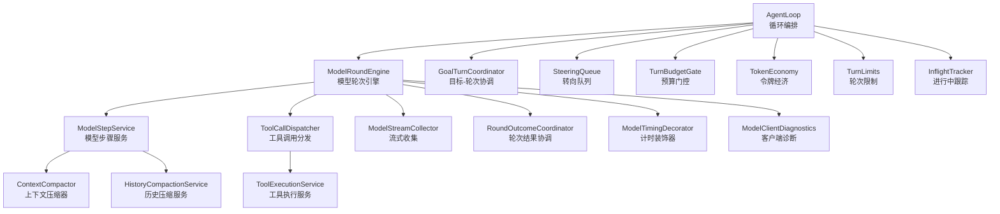
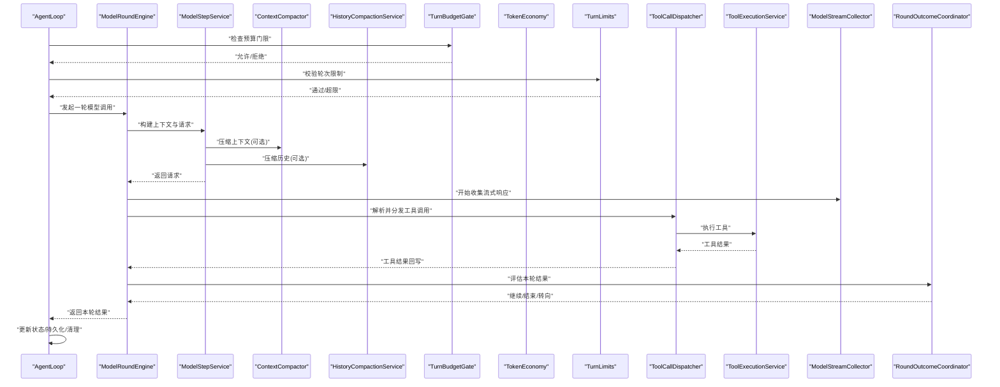
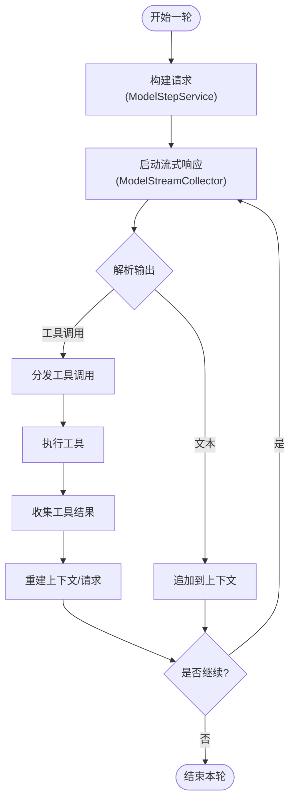
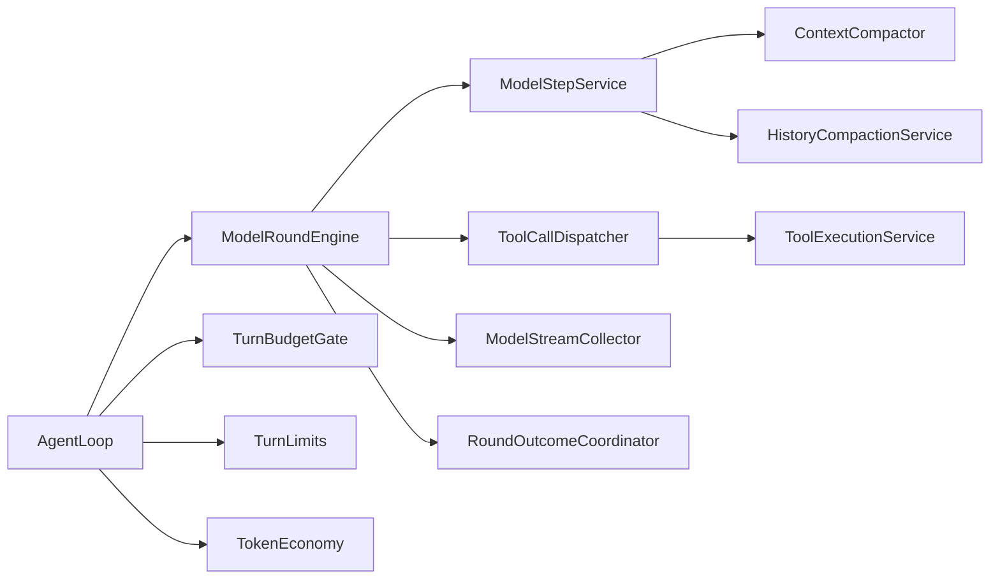

# Agent循环核心

<cite>
**本文引用的文件**
- [agent-loop.ts](file://kun/src/loop/agent-loop.ts)
- [model-round-engine.ts](file://kun/src/loop/model-round-engine.ts)
- [model-step-service.ts](file://kun/src/loop/model-step-service.ts)
- [context-compactor.ts](file://kun/src/loop/context-compactor.ts)
- [history-compaction-service.ts](file://kun/src/loop/history-compaction-service.ts)
- [turn-budget-gate.ts](file://kun/src/loop/turn-budget-gate.ts)
- [tool-call-dispatcher.ts](file://kun/src/loop/tool-call-dispatcher.ts)
- [tool-execution-service.ts](file://kun/src/loop/tool-execution-service.ts)
- [model-request-composer.ts](file://kun/src/loop/model-request-composer.ts)
- [model-stream-collector.ts](file://kun/src/loop/model-stream-collector.ts)
- [round-outcome-coordinator.ts](file://kun/src/loop/round-outcome-coordinator.ts)
- [goal-turn-coordinator.ts](file://kun/src/loop/goal-turn-coordinator.ts)
- [goal-resume-coordinator.ts](file://kun/src/loop/goal-resume-coordinator.ts)
- [token-economy.ts](file://kun/src/loop/token-economy.ts)
- [turn-limits.ts](file://kun/src/loop/turn-limits.ts)
- [steering-queue.ts](file://kun/src/loop/steering-queue.ts)
- [inflight-tracker.ts](file://kun/src/loop/inflight-tracker.ts)
- [model-timing-decorator.ts](file://kun/src/loop/model-timing-decorator.ts)
- [model-client-diagnostics.ts](file://kun/src/loop/model-client-diagnostics.ts)
- [compaction-marker.ts](file://kun/src/loop/compaction-marker.ts)
- [compaction-summary.ts](file://kun/src/loop/compaction-summary.ts)
- [index.ts](file://kun/src/loop/index.ts)
</cite>

## 目录
1. [简介](#简介)
2. [项目结构](#项目结构)
3. [核心组件](#核心组件)
4. [架构总览](#架构总览)
5. [详细组件分析](#详细组件分析)
6. [依赖关系分析](#依赖关系分析)
7. [性能考量](#性能考量)
8. [故障排查指南](#故障排查指南)
9. [结论](#结论)
10. [附录](#附录)

## 简介
本文件聚焦DeepSeek-GUI的Agent循环核心，系统性说明AgentLoop类的工作原理、ModelRoundEngine对LLM请求与流式响应的处理、ModelStepService在上下文构建与提示词组装中的职责，以及循环中关键组件（上下文压缩器、历史压缩服务、预算门控等）的协作方式。文档同时覆盖错误处理、超时控制、资源清理、配置选项、性能调优参数与调试方法，帮助读者从高层到代码级全面理解Agent循环的运行机制。

## 项目结构
Agent循环相关代码集中在 kun/src/loop 目录，围绕“轮次”和“步骤”两个抽象组织：
- 顶层编排：AgentLoop 负责整体生命周期、状态机推进、目标协调与退出条件判断。
- 模型轮次引擎：ModelRoundEngine 封装一次LLM调用（含工具调用闭环）、流式响应收集与结果收敛。
- 模型步骤服务：ModelStepService 负责上下文构建、提示词组装、请求构造与响应后处理。
- 辅助能力：上下文压缩、历史压缩、预算门控、工具调度执行、流式数据收集、诊断与计时装饰器等。

图表来源
- [agent-loop.ts:1-200](file://kun/src/loop/agent-loop.ts#L1-L200)
- [model-round-engine.ts:1-200](file://kun/src/loop/model-round-engine.ts#L1-L200)
- [model-step-service.ts:1-200](file://kun/src/loop/model-step-service.ts#L1-L200)
- [tool-call-dispatcher.ts:1-200](file://kun/src/loop/tool-call-dispatcher.ts#L1-L200)
- [tool-execution-service.ts:1-200](file://kun/src/loop/tool-execution-service.ts#L1-L200)
- [model-stream-collector.ts:1-200](file://kun/src/loop/model-stream-collector.ts#L1-L200)
- [round-outcome-coordinator.ts:1-200](file://kun/src/loop/round-outcome-coordinator.ts#L1-L200)
- [context-compactor.ts:1-200](file://kun/src/loop/context-compactor.ts#L1-L200)
- [history-compaction-service.ts:1-200](file://kun/src/loop/history-compaction-service.ts#L1-L200)
- [turn-budget-gate.ts:1-200](file://kun/src/loop/turn-budget-gate.ts#L1-L200)
- [token-economy.ts:1-200](file://kun/src/loop/token-economy.ts#L1-L200)
- [turn-limits.ts:1-200](file://kun/src/loop/turn-limits.ts#L1-L200)
- [steering-queue.ts:1-200](file://kun/src/loop/steering-queue.ts#L1-L200)
- [inflight-tracker.ts:1-200](file://kun/src/loop/inflight-tracker.ts#L1-L200)
- [model-timing-decorator.ts:1-200](file://kun/src/loop/model-timing-decorator.ts#L1-L200)
- [model-client-diagnostics.ts:1-200](file://kun/src/loop/model-client-diagnostics.ts#L1-L200)

章节来源
- [index.ts:1-200](file://kun/src/loop/index.ts#L1-L200)

## 核心组件
- AgentLoop：循环入口，管理会话生命周期、目标推进、轮次调度、预算与限制检查、错误恢复与资源释放。
- ModelRoundEngine：封装一次“模型调用+工具调用”的完整轮次，驱动请求构建、流式输出消费、工具调用闭环与结果收敛。
- ModelStepService：将当前上下文、历史、工具清单、策略等组装为模型可理解的请求；解析并后处理响应。
- 上下文压缩器/历史压缩服务：在上下文或历史过长时进行摘要/裁剪，保证不超出模型窗口。
- 预算门控/令牌经济/轮次限制：防止过度消耗，保障系统稳定性。
- 工具调用分发与执行：将模型输出的工具调用指令安全地分派给具体工具并收集结果。
- 流式收集：聚合流式增量输出，支持实时展示与中间态处理。
- 轮次结果协调：判定本轮是否结束、是否需要继续或转向。
- 计时与诊断：记录耗时、采样指标、异常信息，便于定位问题。

章节来源
- [agent-loop.ts:1-200](file://kun/src/loop/agent-loop.ts#L1-L200)
- [model-round-engine.ts:1-200](file://kun/src/loop/model-round-engine.ts#L1-L200)
- [model-step-service.ts:1-200](file://kun/src/loop/model-step-service.ts#L1-L200)
- [context-compactor.ts:1-200](file://kun/src/loop/context-compactor.ts#L1-L200)
- [history-compaction-service.ts:1-200](file://kun/src/loop/history-compaction-service.ts#L1-L200)
- [turn-budget-gate.ts:1-200](file://kun/src/loop/turn-budget-gate.ts#L1-L200)
- [token-economy.ts:1-200](file://kun/src/loop/token-economy.ts#L1-L200)
- [turn-limits.ts:1-200](file://kun/src/loop/turn-limits.ts#L1-L200)
- [tool-call-dispatcher.ts:1-200](file://kun/src/loop/tool-call-dispatcher.ts#L1-L200)
- [tool-execution-service.ts:1-200](file://kun/src/loop/tool-execution-service.ts#L1-L200)
- [model-stream-collector.ts:1-200](file://kun/src/loop/model-stream-collector.ts#L1-L200)
- [round-outcome-coordinator.ts:1-200](file://kun/src/loop/round-outcome-coordinator.ts#L1-L200)
- [model-timing-decorator.ts:1-200](file://kun/src/loop/model-timing-decorator.ts#L1-L200)
- [model-client-diagnostics.ts:1-200](file://kun/src/loop/model-client-diagnostics.ts#L1-L200)

## 架构总览
下图展示了AgentLoop在一次runTurn中的主流程，以及与ModelRoundEngine、ModelStepService、工具链、压缩与预算控制的交互顺序。

图表来源
- [agent-loop.ts:1-200](file://kun/src/loop/agent-loop.ts#L1-L200)
- [model-round-engine.ts:1-200](file://kun/src/loop/model-round-engine.ts#L1-L200)
- [model-step-service.ts:1-200](file://kun/src/loop/model-step-service.ts#L1-L200)
- [context-compactor.ts:1-200](file://kun/src/loop/context-compactor.ts#L1-L200)
- [history-compaction-service.ts:1-200](file://kun/src/loop/history-compaction-service.ts#L1-L200)
- [turn-budget-gate.ts:1-200](file://kun/src/loop/turn-budget-gate.ts#L1-L200)
- [token-economy.ts:1-200](file://kun/src/loop/token-economy.ts#L1-L200)
- [turn-limits.ts:1-200](file://kun/src/loop/turn-limits.ts#L1-L200)
- [tool-call-dispatcher.ts:1-200](file://kun/src/loop/tool-call-dispatcher.ts#L1-L200)
- [tool-execution-service.ts:1-200](file://kun/src/loop/tool-execution-service.ts#L1-L200)
- [model-stream-collector.ts:1-200](file://kun/src/loop/model-stream-collector.ts#L1-L200)
- [round-outcome-coordinator.ts:1-200](file://kun/src/loop/round-outcome-coordinator.ts#L1-L200)

## 详细组件分析

### AgentLoop：循环编排与生命周期
- 职责
  - 维护会话状态机（初始化、运行中、暂停、完成、失败）。
  - 驱动runTurn：进入前做预算与限制检查，进入后委托ModelRoundEngine执行一轮，结束后更新状态、持久化、触发回调。
  - 协调目标推进（GoalTurnCoordinator/GoalResumeCoordinator），支持中断与恢复。
  - 管理转向队列（SteeringQueue），在需要时插入新任务或调整优先级。
  - 统一错误处理、超时控制、资源清理（如取消流、释放锁、关闭连接）。
- runTurn执行流程要点
  - 前置校验：预算门控、轮次限制、并发进行中跟踪。
  - 委托执行：调用ModelRoundEngine.run()获取本轮结果。
  - 后置处理：根据结果决定继续/结束/转向；更新令牌经济、写入历史、触发事件。
  - 清理：无论成功失败均确保资源释放与状态复位。
- 状态管理与生命周期
  - 典型状态：idle -> running -> paused/completed/failed。
  - 通过事件与钩子暴露外部可观测点，便于监控与调试。

章节来源
- [agent-loop.ts:1-200](file://kun/src/loop/agent-loop.ts#L1-L200)
- [goal-turn-coordinator.ts:1-200](file://kun/src/loop/goal-turn-coordinator.ts#L1-L200)
- [goal-resume-coordinator.ts:1-200](file://kun/src/loop/goal-resume-coordinator.ts#L1-L200)
- [steering-queue.ts:1-200](file://kun/src/loop/steering-queue.ts#L1-L200)
- [inflight-tracker.ts:1-200](file://kun/src/loop/inflight-tracker.ts#L1-L200)

### ModelRoundEngine：模型轮次引擎
- 职责
  - 封装一次完整的“模型调用+工具调用”循环。
  - 驱动ModelStepService构建请求，订阅流式响应，解析工具调用并执行，直至满足收敛条件。
  - 使用计时装饰器与诊断工具记录性能与异常。
- 关键流程
  - 请求构建：调用ModelStepService生成消息与参数。
  - 流式消费：通过ModelStreamCollector聚合增量文本与元数据。
  - 工具调用：解析模型输出中的工具调用，交由ToolCallDispatcher分发执行，并将结果回填上下文。
  - 收敛判断：由RoundOutcomeCoordinator评估是否结束或继续。
- 错误与超时
  - 捕获网络/模型错误，支持重试策略（按配置）。
  - 超时控制：对单次请求与工具执行设置超时，避免阻塞。
  - 资源清理：确保流关闭、临时对象释放。

图表来源
- [model-round-engine.ts:1-200](file://kun/src/loop/model-round-engine.ts#L1-L200)
- [model-step-service.ts:1-200](file://kun/src/loop/model-step-service.ts#L1-L200)
- [model-stream-collector.ts:1-200](file://kun/src/loop/model-stream-collector.ts#L1-L200)
- [tool-call-dispatcher.ts:1-200](file://kun/src/loop/tool-call-dispatcher.ts#L1-L200)
- [tool-execution-service.ts:1-200](file://kun/src/loop/tool-execution-service.ts#L1-L200)
- [round-outcome-coordinator.ts:1-200](file://kun/src/loop/round-outcome-coordinator.ts#L1-L200)

章节来源
- [model-round-engine.ts:1-200](file://kun/src/loop/model-round-engine.ts#L1-L200)
- [model-stream-collector.ts:1-200](file://kun/src/loop/model-stream-collector.ts#L1-L200)
- [round-outcome-coordinator.ts:1-200](file://kun/src/loop/round-outcome-coordinator.ts#L1-L200)

### ModelStepService：上下文构建与提示词组装
- 职责
  - 基于当前会话上下文、历史、工具清单、策略与用户输入，组装模型请求。
  - 调用上下文压缩器与历史压缩服务，确保上下文长度在模型窗口内。
  - 解析模型响应，提取文本、工具调用、元数据，并准备下一轮输入。
- 关键逻辑
  - 上下文构建：合并系统提示、工具描述、记忆片段、检索结果等。
  - 提示词组装：按模型格式组织消息序列，保留必要上下文标记。
  - 响应处理：区分纯文本与工具调用分支，必要时触发工具执行。
- 优化点
  - 增量构建与缓存，减少重复计算。
  - 选择性压缩：优先压缩低价值历史，保留关键信息。

章节来源
- [model-step-service.ts:1-200](file://kun/src/loop/model-step-service.ts#L1-L200)
- [model-request-composer.ts:1-200](file://kun/src/loop/model-request-composer.ts#L1-L200)
- [context-compactor.ts:1-200](file://kun/src/loop/context-compactor.ts#L1-L200)
- [history-compaction-service.ts:1-200](file://kun/src/loop/history-compaction-service.ts#L1-L200)

### 上下文压缩器与历史压缩服务
- 上下文压缩器
  - 作用：在单轮上下文过大时进行摘要或裁剪，保持关键语义。
  - 策略：按时间衰减、重要性评分、去重合并等。
- 历史压缩服务
  - 作用：跨轮次历史过长时进行归档或摘要，降低后续请求成本。
  - 产物：压缩标记与摘要，用于回溯与审计。
- 与ModelStepService的关系
  - 在构建请求前按需触发，确保最终请求长度可控。

章节来源
- [context-compactor.ts:1-200](file://kun/src/loop/context-compactor.ts#L1-L200)
- [history-compaction-service.ts:1-200](file://kun/src/loop/history-compaction-service.ts#L1-L200)
- [compaction-marker.ts:1-200](file://kun/src/loop/compaction-marker.ts#L1-L200)
- [compaction-summary.ts:1-200](file://kun/src/loop/compaction-summary.ts#L1-L200)

### 预算门控、令牌经济与轮次限制
- 预算门控（TurnBudgetGate）
  - 在每轮开始前检查预算余量，决定是否允许继续。
  - 支持按成本、次数、时长等多维阈值。
- 令牌经济（TokenEconomy）
  - 统计与预测令牌消耗，结合预算门控进行动态调控。
- 轮次限制（TurnLimits）
  - 限制最大轮次、最大工具调用次数、最大输出长度等，防止无限循环。

章节来源
- [turn-budget-gate.ts:1-200](file://kun/src/loop/turn-budget-gate.ts#L1-L200)
- [token-economy.ts:1-200](file://kun/src/loop/token-economy.ts#L1-L200)
- [turn-limits.ts:1-200](file://kun/src/loop/turn-limits.ts#L1-L200)

### 工具调用分发与执行
- ToolCallDispatcher
  - 解析模型输出的工具调用指令，路由到对应工具实现。
  - 支持并发控制、取消、重试与结果聚合。
- ToolExecutionService
  - 实际执行工具，封装错误处理、超时、日志与度量。
  - 将工具结果结构化回写至上下文，供下一轮使用。

章节来源
- [tool-call-dispatcher.ts:1-200](file://kun/src/loop/tool-call-dispatcher.ts#L1-L200)
- [tool-execution-service.ts:1-200](file://kun/src/loop/tool-execution-service.ts#L1-L200)

### 流式响应收集与轮次结果协调
- ModelStreamCollector
  - 聚合流式增量，提供进度回调与中间结果访问。
  - 支持截断、过滤与缓冲策略，避免内存膨胀。
- RoundOutcomeCoordinator
  - 依据模型输出、工具调用结果与策略，判定本轮是否结束或继续。
  - 支持提前终止（如达到目标、触发预算限制）。

章节来源
- [model-stream-collector.ts:1-200](file://kun/src/loop/model-stream-collector.ts#L1-L200)
- [round-outcome-coordinator.ts:1-200](file://kun/src/loop/round-outcome-coordinator.ts#L1-L200)

### 计时与诊断
- ModelTimingDecorator
  - 对关键操作打点，记录耗时分布与P95/P99。
- ModelClientDiagnostics
  - 采集错误类型、重试次数、网络状态等诊断信息，便于问题定位。

章节来源
- [model-timing-decorator.ts:1-200](file://kun/src/loop/model-timing-decorator.ts#L1-L200)
- [model-client-diagnostics.ts:1-200](file://kun/src/loop/model-client-diagnostics.ts#L1-L200)

## 依赖关系分析
- 松耦合设计
  - AgentLoop仅依赖接口与协调器，不直接感知底层模型细节。
  - ModelRoundEngine通过ModelStepService屏蔽请求构建差异。
- 关键依赖链
  - AgentLoop → ModelRoundEngine → ModelStepService → 压缩服务/预算/限制
  - ModelRoundEngine → ToolCallDispatcher → ToolExecutionService
  - ModelRoundEngine → ModelStreamCollector → RoundOutcomeCoordinator
- 潜在风险
  - 若压缩策略不当可能导致信息丢失。
  - 工具执行失败需有完善的重试与降级路径。
  - 流式数据未正确关闭可能引发资源泄漏。

图表来源
- [agent-loop.ts:1-200](file://kun/src/loop/agent-loop.ts#L1-L200)
- [model-round-engine.ts:1-200](file://kun/src/loop/model-round-engine.ts#L1-L200)
- [model-step-service.ts:1-200](file://kun/src/loop/model-step-service.ts#L1-L200)
- [context-compactor.ts:1-200](file://kun/src/loop/context-compactor.ts#L1-L200)
- [history-compaction-service.ts:1-200](file://kun/src/loop/history-compaction-service.ts#L1-L200)
- [turn-budget-gate.ts:1-200](file://kun/src/loop/turn-budget-gate.ts#L1-L200)
- [token-economy.ts:1-200](file://kun/src/loop/token-economy.ts#L1-L200)
- [turn-limits.ts:1-200](file://kun/src/loop/turn-limits.ts#L1-L200)
- [tool-call-dispatcher.ts:1-200](file://kun/src/loop/tool-call-dispatcher.ts#L1-L200)
- [tool-execution-service.ts:1-200](file://kun/src/loop/tool-execution-service.ts#L1-L200)
- [model-stream-collector.ts:1-200](file://kun/src/loop/model-stream-collector.ts#L1-L200)
- [round-outcome-coordinator.ts:1-200](file://kun/src/loop/round-outcome-coordinator.ts#L1-L200)

章节来源
- [agent-loop.ts:1-200](file://kun/src/loop/agent-loop.ts#L1-L200)
- [model-round-engine.ts:1-200](file://kun/src/loop/model-round-engine.ts#L1-L200)

## 性能考量
- 流式处理
  - 使用ModelStreamCollector增量消费，降低首字延迟与峰值内存。
- 上下文与历史压缩
  - 合理设置压缩阈值与策略，平衡信息完整性与成本。
- 并发与限流
  - 通过InflightTracker控制并发，避免资源争用。
  - 结合TurnLimits与TurnBudgetGate限制工具调用与轮次。
- 计时与诊断
  - 利用ModelTimingDecorator与ModelClientDiagnostics定位瓶颈与异常。
- 建议
  - 针对长对话场景启用历史压缩与上下文摘要。
  - 对高成本工具调用增加重试上限与退避策略。
  - 监控令牌经济，动态调整推理深度或工具调用频率。

[本节为通用性能指导，不直接引用具体文件]

## 故障排查指南
- 常见问题
  - 模型请求超时：检查网络、模型端负载与超时配置；查看计时与诊断日志。
  - 工具执行失败：确认工具可用性、权限与输入参数；查看执行服务日志与重试情况。
  - 上下文溢出：调整压缩阈值或历史归档策略；检查压缩标记与摘要是否正确写入。
  - 预算耗尽：检查预算门控阈值与令牌经济统计；适当放宽或拆分任务。
- 调试方法
  - 开启计时与诊断，关注P95/P99耗时与错误堆栈。
  - 使用流式收集器的中间结果观察模型输出变化。
  - 通过轮次结果协调器日志了解收敛决策依据。
- 资源清理
  - 确保流关闭、锁释放、临时文件删除；在finally块中执行清理逻辑。

章节来源
- [model-timing-decorator.ts:1-200](file://kun/src/loop/model-timing-decorator.ts#L1-L200)
- [model-client-diagnostics.ts:1-200](file://kun/src/loop/model-client-diagnostics.ts#L1-L200)
- [model-stream-collector.ts:1-200](file://kun/src/loop/model-stream-collector.ts#L1-L200)
- [round-outcome-coordinator.ts:1-200](file://kun/src/loop/round-outcome-coordinator.ts#L1-L200)
- [tool-execution-service.ts:1-200](file://kun/src/loop/tool-execution-service.ts#L1-L200)
- [context-compactor.ts:1-200](file://kun/src/loop/context-compactor.ts#L1-L200)
- [history-compaction-service.ts:1-200](file://kun/src/loop/history-compaction-service.ts#L1-L200)
- [turn-budget-gate.ts:1-200](file://kun/src/loop/turn-budget-gate.ts#L1-L200)
- [token-economy.ts:1-200](file://kun/src/loop/token-economy.ts#L1-L200)

## 结论
AgentLoop作为循环核心，通过清晰的职责划分与松耦合设计，实现了稳定的多轮对话与工具调用闭环。ModelRoundEngine与ModelStepService分别承担轮次编排与请求构建，配合压缩、预算与限制机制，确保系统在长对话与复杂任务下的可用性与经济性。借助流式收集、计时与诊断能力，开发者可有效优化性能并快速定位问题。

[本节为总结性内容，不直接引用具体文件]

## 附录
- 配置与调优建议
  - 上下文压缩阈值：根据模型窗口与任务复杂度调整。
  - 历史归档策略：按时间衰减或重要性评分归档。
  - 预算门控阈值：结合成本与体验设定，避免过早终止。
  - 轮次与工具调用限制：防止无限循环与资源耗尽。
  - 超时与重试：为网络与工具调用设置合理超时与退避。
- 调试开关
  - 启用计时与诊断日志，关注关键路径耗时与错误。
  - 使用流式收集器中间结果验证模型行为。
  - 通过轮次结果协调器日志理解收敛决策。

[本节为补充信息，不直接引用具体文件]