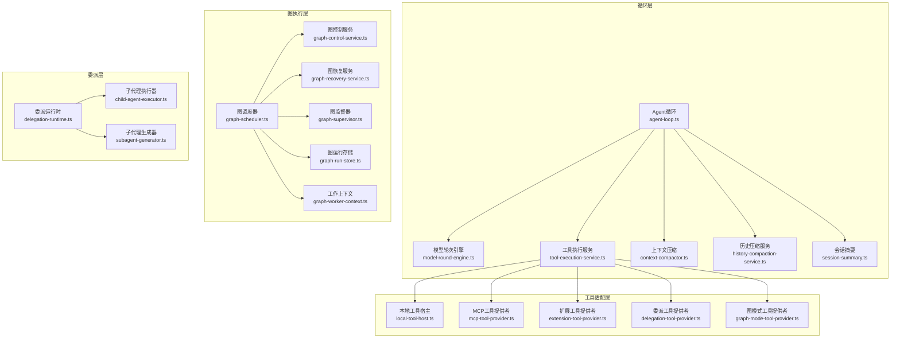
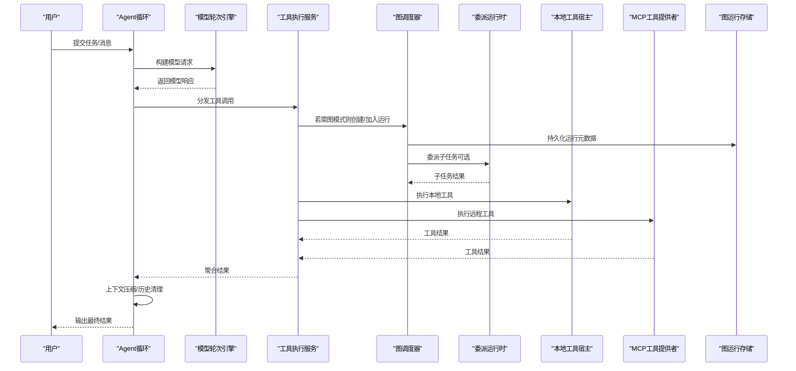
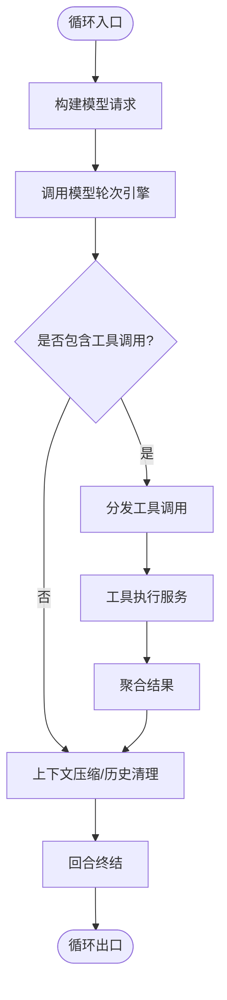
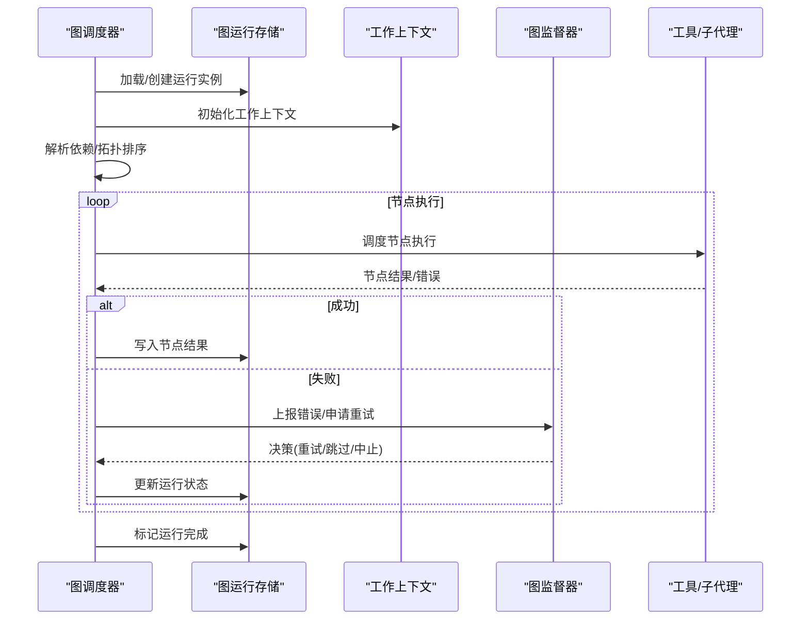
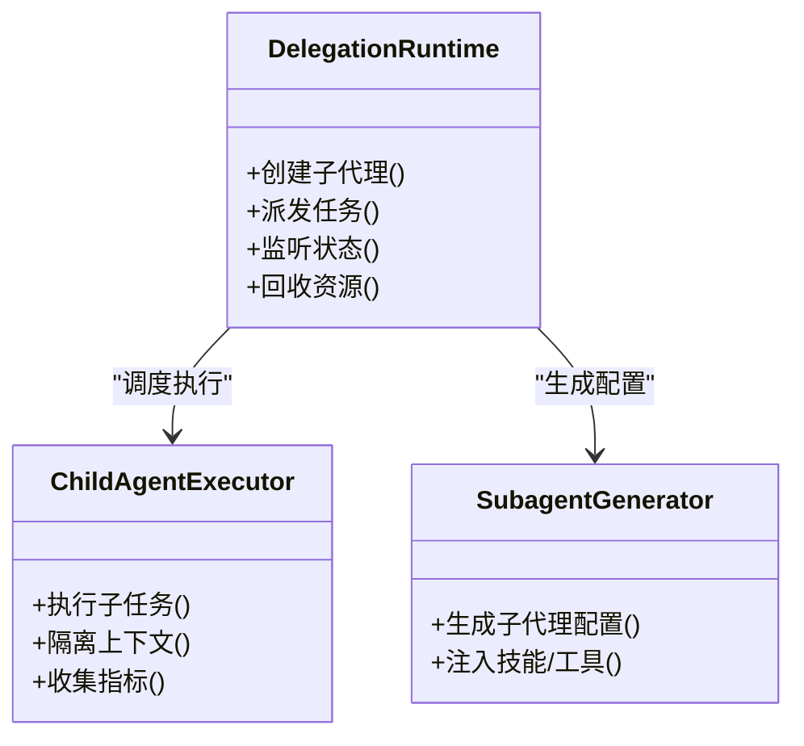
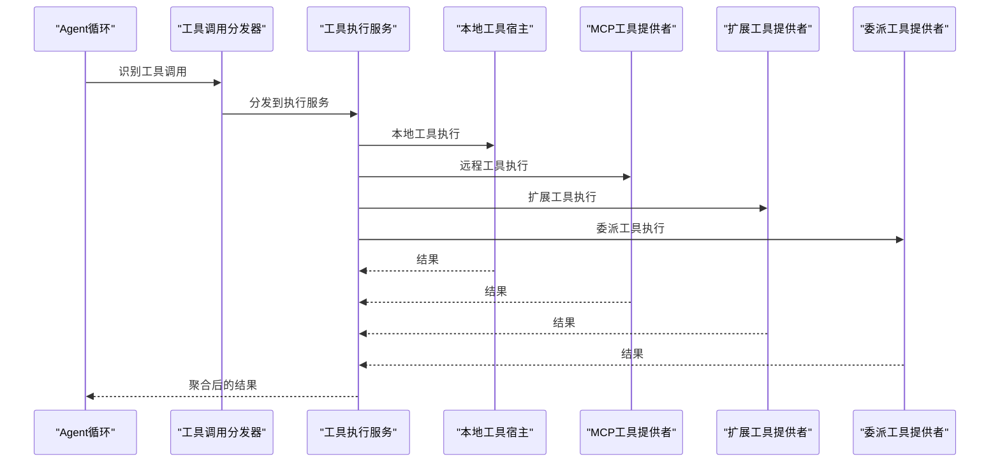
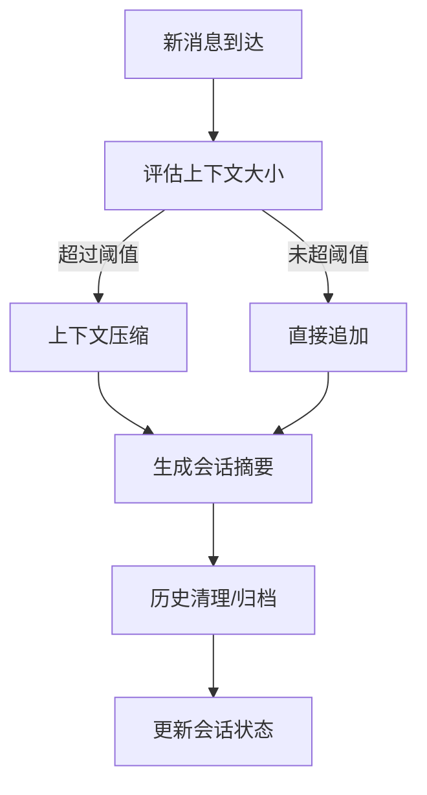
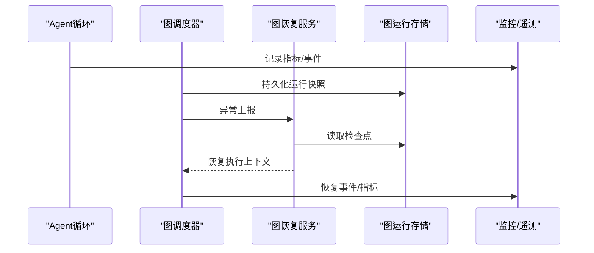
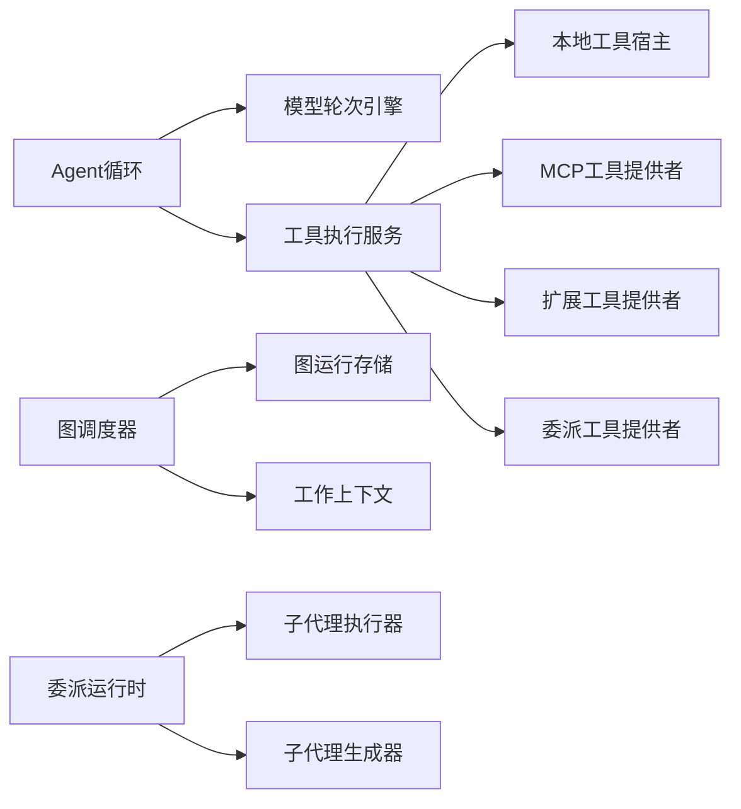

# Agent执行引擎

<cite>
**本文引用的文件**
- [agent-loop.ts](file://kun/src/loop/agent-loop.ts)
- [tool-execution-service.ts](file://kun/src/loop/tool-execution-service.ts)
- [tool-call-dispatcher.ts](file://kun/src/loop/tool-call-dispatcher.ts)
- [interactive-tool-bridge.ts](file://kun/src/loop/interactive-tool-bridge.ts)
- [context-compactor.ts](file://kun/src/loop/context-compactor.ts)
- [history-compaction-service.ts](file://kun/src/loop/history-compaction-service.ts)
- [session-summary.ts](file://kun/src/loop/session-summary.ts)
- [model-round-engine.ts](file://kun/src/loop/model-round-engine.ts)
- [turn-finalizer.ts](file://kun/src/loop/turn-finalizer.ts)
- [goal-resume-coordinator.ts](file://kun/src/loop/goal-resume-coordinator.ts)
- [graph-scheduler.ts](file://kun/src/graph/graph-scheduler.ts)
- [graph-control-service.ts](file://kun/src/graph/graph-control-service.ts)
- [graph-recovery-service.ts](file://kun/src/graph/graph-recovery-service.ts)
- [graph-supervisor.ts](file://kun/src/graph/graph-supervisor.ts)
- [graph-run-store.ts](file://kun/src/graph/graph-run-store.ts)
- [graph-worker-context.ts](file://kun/src/graph/graph-worker-context.ts)
- [delegation-runtime.ts](file://kun/src/delegation/delegation-runtime.ts)
- [child-agent-executor.ts](file://kun/src/delegation/child-agent-executor.ts)
- [subagent-generator.ts](file://kun/src/delegation/subagent-generator.ts)
- [local-tool-host.ts](file://kun/src/adapters/tool/local-tool-host.ts)
- [mcp-tool-provider.ts](file://kun/src/adapters/tool/mcp-tool-provider.ts)
- [extension-tool-provider.ts](file://kun/src/adapters/tool/extension-tool-provider.ts)
- [delegation-tool-provider.ts](file://kun/src/adapters/tool/delegation-tool-provider.ts)
- [graph-mode-tool-provider.ts](file://kun/src/adapters/tool/graph-mode-tool-provider.ts)
</cite>

## 目录
1. [简介](#简介)
2. [项目结构](#项目结构)
3. [核心组件](#核心组件)
4. [架构总览](#架构总览)
5. [详细组件分析](#详细组件分析)
6. [依赖关系分析](#依赖关系分析)
7. [性能考量](#性能考量)
8. [故障排查指南](#故障排查指南)
9. [结论](#结论)
10. [附录](#附录)

## 简介
本文件面向DeepSeek-GUI的Agent执行引擎，系统性说明Agent循环、图模式任务执行、子代理委派、工具调用框架、会话状态管理、监控与恢复机制，以及配置、调试与最佳实践。目标是帮助读者在不深入源码的情况下理解系统如何调度任务、维护状态、处理错误并优化资源使用。

## 项目结构
Agent执行引擎由“循环层”“图执行层”“委派层”“工具适配层”构成：
- 循环层负责单轮对话/任务的编排、模型交互、工具调用、上下文压缩与回合终结。
- 图执行层负责有向无环图的节点调度、依赖解析、重试与恢复、监督与审核。
- 委派层负责主代理与子代理之间的通信协议、任务分配策略与资源隔离。
- 工具适配层提供统一工具发现、参数校验、执行上下文与结果处理，支持MCP、扩展、本地脚本等。

图表来源
- [agent-loop.ts:1-200](file://kun/src/loop/agent-loop.ts#L1-L200)
- [graph-scheduler.ts:1-200](file://kun/src/graph/graph-scheduler.ts#L1-L200)
- [delegation-runtime.ts:1-200](file://kun/src/delegation/delegation-runtime.ts#L1-L200)
- [local-tool-host.ts:1-200](file://kun/src/adapters/tool/local-tool-host.ts#L1-L200)

章节来源
- [agent-loop.ts:1-200](file://kun/src/loop/agent-loop.ts#L1-L200)
- [graph-scheduler.ts:1-200](file://kun/src/graph/graph-scheduler.ts#L1-L200)
- [delegation-runtime.ts:1-200](file://kun/src/delegation/delegation-runtime.ts#L1-L200)
- [local-tool-host.ts:1-200](file://kun/src/adapters/tool/local-tool-host.ts#L1-L200)

## 核心组件
- Agent循环：驱动一轮或多轮对话，协调模型请求、工具调用、上下文压缩与回合终结。
- 图调度器：将图任务分解为节点，解析依赖，按策略并发执行，处理失败与恢复。
- 委派运行时：定义主/子代理通信协议，负责任务拆分、路由、资源隔离与生命周期管理。
- 工具执行服务：统一工具发现、参数验证、执行上下文注入、结果聚合与限制。
- 会话状态管理：上下文压缩、历史清理、摘要生成，保障长对话内存稳定。
- 监控与恢复：指标收集、可观测性事件、崩溃恢复与检查点。

章节来源
- [agent-loop.ts:1-200](file://kun/src/loop/agent-loop.ts#L1-L200)
- [graph-scheduler.ts:1-200](file://kun/src/graph/graph-scheduler.ts#L1-L200)
- [delegation-runtime.ts:1-200](file://kun/src/delegation/delegation-runtime.ts#L1-L200)
- [tool-execution-service.ts:1-200](file://kun/src/loop/tool-execution-service.ts#L1-L200)
- [context-compactor.ts:1-200](file://kun/src/loop/context-compactor.ts#L1-L200)
- [history-compaction-service.ts:1-200](file://kun/src/loop/history-compaction-service.ts#L1-L200)
- [session-summary.ts:1-200](file://kun/src/loop/session-summary.ts#L1-L200)

## 架构总览
下图展示从用户输入到图任务完成的全链路流程，包括循环层、图执行层、委派层与工具层的协作。

图表来源
- [agent-loop.ts:1-200](file://kun/src/loop/agent-loop.ts#L1-L200)
- [model-round-engine.ts:1-200](file://kun/src/loop/model-round-engine.ts#L1-L200)
- [tool-execution-service.ts:1-200](file://kun/src/loop/tool-execution-service.ts#L1-L200)
- [graph-scheduler.ts:1-200](file://kun/src/graph/graph-scheduler.ts#L1-L200)
- [delegation-runtime.ts:1-200](file://kun/src/delegation/delegation-runtime.ts#L1-L200)
- [local-tool-host.ts:1-200](file://kun/src/adapters/tool/local-tool-host.ts#L1-L200)
- [mcp-tool-provider.ts:1-200](file://kun/src/adapters/tool/mcp-tool-provider.ts#L1-L200)
- [graph-run-store.ts:1-200](file://kun/src/graph/graph-run-store.ts#L1-L200)

## 详细组件分析

### Agent循环：任务调度、状态管理与生命周期控制
- 任务调度：接收外部输入，构造模型请求；根据响应决定是否需要工具调用或进入图模式。
- 状态管理：维护当前回合、线程、会话上下文；在每轮结束后进行上下文压缩与历史清理。
- 生命周期控制：启动时初始化上下文与工具目录；终止时触发收尾、保存状态与释放资源。
- 关键能力：
  - 模型轮次编排：封装请求构建、流式收集、错误重试与超时控制。
  - 工具分发：识别工具调用，交由工具执行服务处理。
  - 回合终结：汇总结果、更新会话摘要、记录遥测指标。

图表来源
- [agent-loop.ts:1-200](file://kun/src/loop/agent-loop.ts#L1-L200)
- [model-round-engine.ts:1-200](file://kun/src/loop/model-round-engine.ts#L1-L200)
- [tool-execution-service.ts:1-200](file://kun/src/loop/tool-execution-service.ts#L1-L200)
- [context-compactor.ts:1-200](file://kun/src/loop/context-compactor.ts#L1-L200)
- [history-compaction-service.ts:1-200](file://kun/src/loop/history-compaction-service.ts#L1-L200)
- [turn-finalizer.ts:1-200](file://kun/src/loop/turn-finalizer.ts#L1-L200)

章节来源
- [agent-loop.ts:1-200](file://kun/src/loop/agent-loop.ts#L1-L200)
- [model-round-engine.ts:1-200](file://kun/src/loop/model-round-engine.ts#L1-L200)
- [tool-execution-service.ts:1-200](file://kun/src/loop/tool-execution-service.ts#L1-L200)
- [context-compactor.ts:1-200](file://kun/src/loop/context-compactor.ts#L1-L200)
- [history-compaction-service.ts:1-200](file://kun/src/loop/history-compaction-service.ts#L1-L200)
- [turn-finalizer.ts:1-200](file://kun/src/loop/turn-finalizer.ts#L1-L200)

### 图模式下的任务执行流程：节点调度、依赖解析与错误处理
- 节点调度：将图转换为可执行节点集合，依据依赖关系与并发策略调度。
- 依赖解析：计算入度、拓扑排序，确保前置节点完成后才执行后续节点。
- 错误处理：捕获节点异常，按策略重试、回滚或上报监督；记录运行快照以便恢复。
- 监督与审核：对高风险节点启用人工审核或自动校验，保证安全性与质量。

图表来源
- [graph-scheduler.ts:1-200](file://kun/src/graph/graph-scheduler.ts#L1-L200)
- [graph-run-store.ts:1-200](file://kun/src/graph/graph-run-store.ts#L1-L200)
- [graph-worker-context.ts:1-200](file://kun/src/graph/graph-worker-context.ts#L1-L200)
- [graph-supervisor.ts:1-200](file://kun/src/graph/graph-supervisor.ts#L1-L200)

章节来源
- [graph-scheduler.ts:1-200](file://kun/src/graph/graph-scheduler.ts#L1-L200)
- [graph-run-store.ts:1-200](file://kun/src/graph/graph-run-store.ts#L1-L200)
- [graph-worker-context.ts:1-200](file://kun/src/graph/graph-worker-context.ts#L1-L200)
- [graph-supervisor.ts:1-200](file://kun/src/graph/graph-supervisor.ts#L1-L200)

### 子代理委派机制：通信协议、任务分配与资源隔离
- 通信协议：主代理通过委派运行时向子代理发送结构化任务描述，子代理返回标准化结果与状态。
- 任务分配：基于能力画像、负载与策略选择合适子代理；支持并行委派与结果合并。
- 资源隔离：每个子代理拥有独立上下文、沙箱与工作目录，避免相互干扰。
- 生命周期：创建、执行、监控、回收；支持中断与恢复。

图表来源
- [delegation-runtime.ts:1-200](file://kun/src/delegation/delegation-runtime.ts#L1-L200)
- [child-agent-executor.ts:1-200](file://kun/src/delegation/child-agent-executor.ts#L1-L200)
- [subagent-generator.ts:1-200](file://kun/src/delegation/subagent-generator.ts#L1-L200)

章节来源
- [delegation-runtime.ts:1-200](file://kun/src/delegation/delegation-runtime.ts#L1-L200)
- [child-agent-executor.ts:1-200](file://kun/src/delegation/child-agent-executor.ts#L1-L200)
- [subagent-generator.ts:1-200](file://kun/src/delegation/subagent-generator.ts#L1-L200)

### 工具调用框架：工具发现、参数验证、执行上下文与结果处理
- 工具发现：从本地、MCP、扩展与委派提供者注册工具目录，动态暴露可用工具。
- 参数验证：对输入进行类型与范围校验，拒绝非法参数，防止越权访问。
- 执行上下文：注入线程ID、回合ID、工作区路径、审批策略、沙箱模式等。
- 结果处理：统一包装成功/失败、限制输出大小、追踪来源与审计日志。

图表来源
- [tool-call-dispatcher.ts:1-200](file://kun/src/loop/tool-call-dispatcher.ts#L1-L200)
- [tool-execution-service.ts:1-200](file://kun/src/loop/tool-execution-service.ts#L1-L200)
- [local-tool-host.ts:1-200](file://kun/src/adapters/tool/local-tool-host.ts#L1-L200)
- [mcp-tool-provider.ts:1-200](file://kun/src/adapters/tool/mcp-tool-provider.ts#L1-L200)
- [extension-tool-provider.ts:1-200](file://kun/src/adapters/tool/extension-tool-provider.ts#L1-L200)
- [delegation-tool-provider.ts:1-200](file://kun/src/adapters/tool/delegation-tool-provider.ts#L1-L200)

章节来源
- [tool-call-dispatcher.ts:1-200](file://kun/src/loop/tool-call-dispatcher.ts#L1-L200)
- [tool-execution-service.ts:1-200](file://kun/src/loop/tool-execution-service.ts#L1-L200)
- [local-tool-host.ts:1-200](file://kun/src/adapters/tool/local-tool-host.ts#L1-L200)
- [mcp-tool-provider.ts:1-200](file://kun/src/adapters/tool/mcp-tool-provider.ts#L1-L200)
- [extension-tool-provider.ts:1-200](file://kun/src/adapters/tool/extension-tool-provider.ts#L1-L200)
- [delegation-tool-provider.ts:1-200](file://kun/src/adapters/tool/delegation-tool-provider.ts#L1-L200)

### 会话状态管理：上下文压缩、历史清理与内存优化
- 上下文压缩：按重要性/时间衰减策略压缩历史消息，保留关键信息。
- 历史清理：定期归档或移除过期条目，控制内存占用。
- 会话摘要：生成高层摘要用于快速恢复上下文，减少重复推理成本。
- 指标与诊断：记录压缩前后大小、命中率与耗时，辅助调优。

图表来源
- [context-compactor.ts:1-200](file://kun/src/loop/context-compactor.ts#L1-L200)
- [history-compaction-service.ts:1-200](file://kun/src/loop/history-compaction-service.ts#L1-L200)
- [session-summary.ts:1-200](file://kun/src/loop/session-summary.ts#L1-L200)

章节来源
- [context-compactor.ts:1-200](file://kun/src/loop/context-compactor.ts#L1-L200)
- [history-compaction-service.ts:1-200](file://kun/src/loop/history-compaction-service.ts#L1-L200)
- [session-summary.ts:1-200](file://kun/src/loop/session-summary.ts#L1-L200)

### 执行监控、性能指标与故障恢复
- 监控与指标：记录模型调用耗时、工具调用次数、图节点执行时长、错误率与资源使用。
- 可观测性：事件总线输出关键阶段事件，便于集成外部监控系统。
- 故障恢复：图运行持久化，崩溃后从最近检查点恢复；支持重试与降级策略。
- 健康检查：周期性探测关键服务可用性，及时告警。

图表来源
- [graph-recovery-service.ts:1-200](file://kun/src/graph/graph-recovery-service.ts#L1-L200)
- [graph-run-store.ts:1-200](file://kun/src/graph/graph-run-store.ts#L1-L200)
- [graph-scheduler.ts:1-200](file://kun/src/graph/graph-scheduler.ts#L1-L200)
- [agent-loop.ts:1-200](file://kun/src/loop/agent-loop.ts#L1-L200)

章节来源
- [graph-recovery-service.ts:1-200](file://kun/src/graph/graph-recovery-service.ts#L1-L200)
- [graph-run-store.ts:1-200](file://kun/src/graph/graph-run-store.ts#L1-L200)
- [graph-scheduler.ts:1-200](file://kun/src/graph/graph-scheduler.ts#L1-L200)
- [agent-loop.ts:1-200](file://kun/src/loop/agent-loop.ts#L1-L200)

## 依赖关系分析
- 松耦合设计：各层通过接口与事件通信，降低耦合度。
- 关键依赖：
  - 循环层依赖模型轮次引擎与工具执行服务。
  - 图执行层依赖运行存储与工作上下文。
  - 委派层依赖子代理执行器与生成器。
  - 工具适配层依赖本地宿主、MCP与扩展提供者。
- 潜在风险：循环与图调度之间需避免死锁；工具执行需限制并发与资源使用。

图表来源
- [agent-loop.ts:1-200](file://kun/src/loop/agent-loop.ts#L1-L200)
- [tool-execution-service.ts:1-200](file://kun/src/loop/tool-execution-service.ts#L1-L200)
- [graph-scheduler.ts:1-200](file://kun/src/graph/graph-scheduler.ts#L1-L200)
- [delegation-runtime.ts:1-200](file://kun/src/delegation/delegation-runtime.ts#L1-L200)

章节来源
- [agent-loop.ts:1-200](file://kun/src/loop/agent-loop.ts#L1-L200)
- [tool-execution-service.ts:1-200](file://kun/src/loop/tool-execution-service.ts#L1-L200)
- [graph-scheduler.ts:1-200](file://kun/src/graph/graph-scheduler.ts#L1-L200)
- [delegation-runtime.ts:1-200](file://kun/src/delegation/delegation-runtime.ts#L1-L200)

## 性能考量
- 并发控制：图节点与工具调用采用限流与队列，避免资源争用。
- 上下文压缩：按策略压缩历史，减少模型输入长度，降低延迟与成本。
- 缓存与复用：工具结果与模型响应适当缓存，提升重复任务效率。
- 资源隔离：子代理与工具执行使用独立上下文与沙箱，防止相互影响。
- 监控反馈：基于指标调整并发度、压缩阈值与重试策略。

[本节为通用指导，不直接分析具体文件]

## 故障排查指南
- 常见问题定位：
  - 工具调用失败：检查参数验证、权限与沙箱模式；查看工具执行服务的错误日志。
  - 图节点卡住：确认依赖是否满足、是否有死锁；查看图调度器的并发策略与超时设置。
  - 子代理异常：检查委派运行时状态、子代理上下文隔离与资源配额。
  - 内存增长：关注上下文压缩与历史清理策略；调整压缩阈值与归档频率。
- 恢复步骤：
  - 利用图运行存储的检查点恢复执行。
  - 重启相关服务并重新加载配置。
  - 通过监控事件回溯问题发生时的调用链。

章节来源
- [tool-execution-service.ts:1-200](file://kun/src/loop/tool-execution-service.ts#L1-L200)
- [graph-scheduler.ts:1-200](file://kun/src/graph/graph-scheduler.ts#L1-L200)
- [delegation-runtime.ts:1-200](file://kun/src/delegation/delegation-runtime.ts#L1-L200)
- [context-compactor.ts:1-200](file://kun/src/loop/context-compactor.ts#L1-L200)
- [graph-recovery-service.ts:1-200](file://kun/src/graph/graph-recovery-service.ts#L1-L200)

## 结论
DeepSeek-GUI的Agent执行引擎通过分层架构实现了高内聚、低耦合的任务编排与执行。循环层负责对话与工具调度，图执行层提供复杂任务的结构化执行与恢复，委派层实现主/子代理的灵活协作，工具适配层统一了多源工具的接入与管理。配合会话状态管理与监控恢复机制，系统在可扩展性、稳定性与性能方面具备良好基础。

[本节为总结性内容，不直接分析具体文件]

## 附录
- 配置选项建议：
  - 并发度：根据资源与下游服务限制合理设置图节点与工具并发。
  - 压缩阈值：结合会话长度与模型上下文窗口调整上下文压缩策略。
  - 重试策略：为易错工具与网络调用设置退避与最大重试次数。
- 调试接口：
  - 启用详细日志与事件输出，便于定位问题。
  - 使用图运行存储查看节点执行轨迹与结果。
  - 通过委派运行时观察子代理生命周期与资源使用。
- 最佳实践：
  - 明确工具职责与边界，避免过度耦合。
  - 对高风险操作启用审批与审核。
  - 持续监控指标，定期优化压缩与并发策略。

[本节为通用指导，不直接分析具体文件]