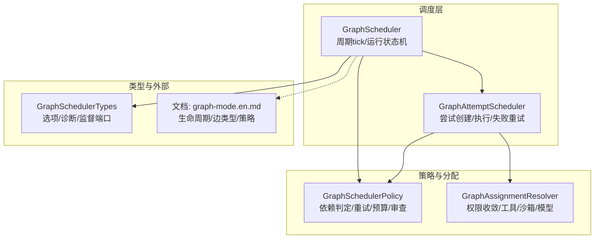
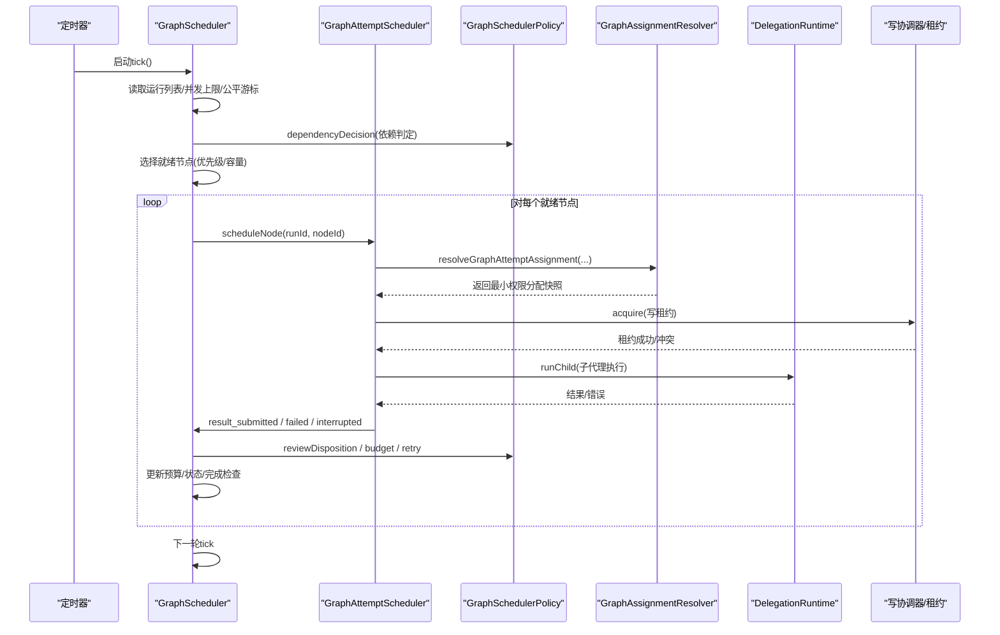
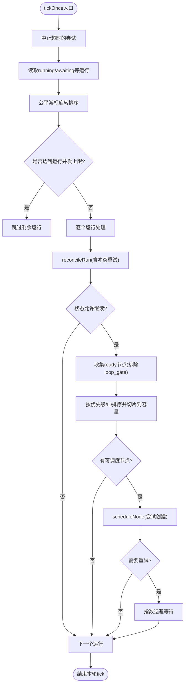
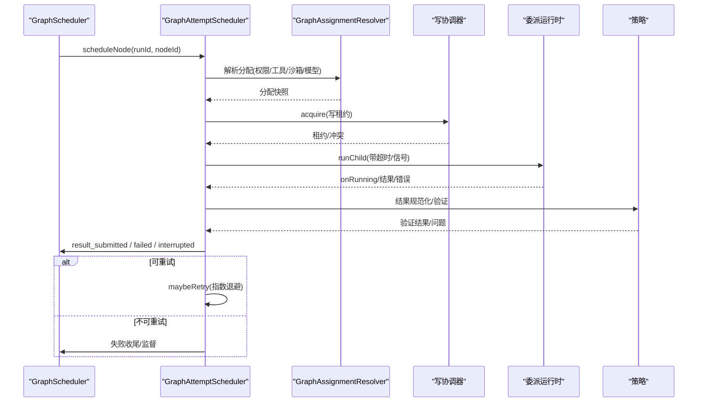
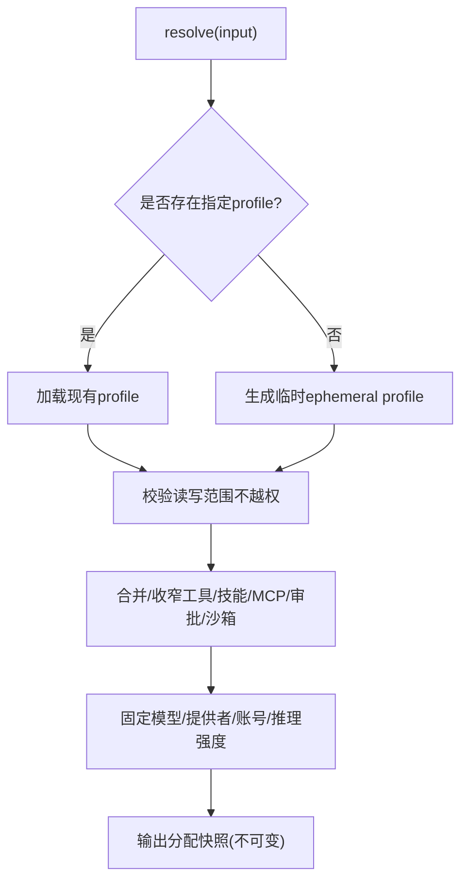
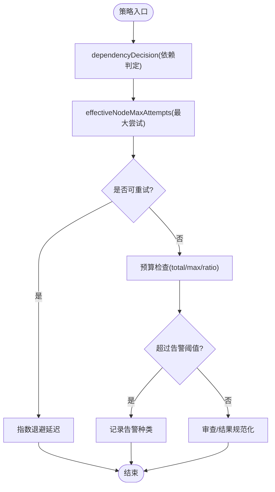
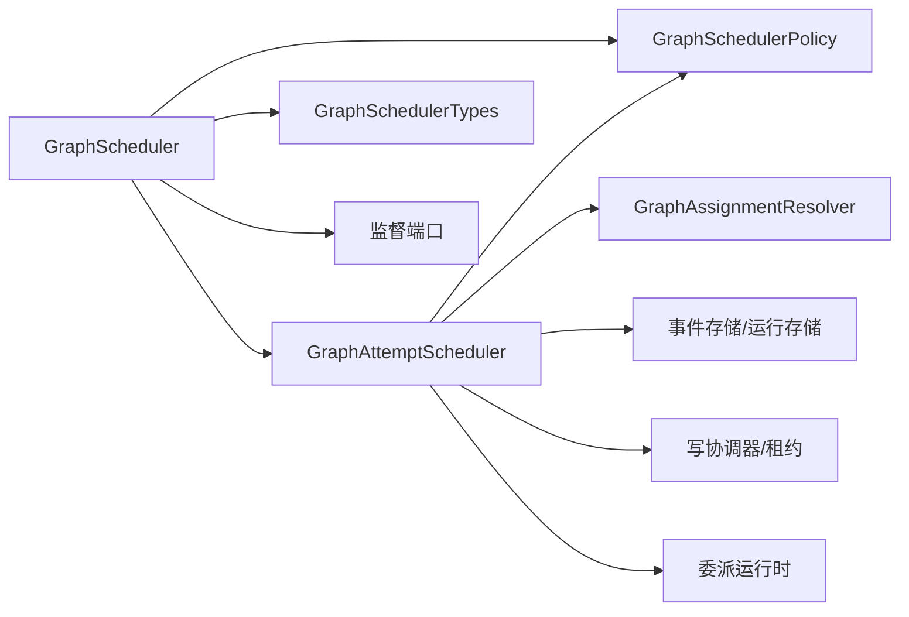

# 图调度器

<cite>
**本文引用的文件**
- [graph-scheduler.ts](file://kun/src/graph/graph-scheduler.ts)
- [graph-attempt-scheduler.ts](file://kun/src/graph/graph-attempt-scheduler.ts)
- [graph-scheduler-policy.ts](file://kun/src/graph/graph-scheduler-policy.ts)
- [graph-assignment.ts](file://kun/src/graph/graph-assignment.ts)
- [graph-scheduler-types.ts](file://kun/src/graph/graph-scheduler-types.ts)
- [graph-mode.en.md](file://docs/graph-mode.en.md)
</cite>

## 目录
1. [简介](#简介)
2. [项目结构](#项目结构)
3. [核心组件](#核心组件)
4. [架构总览](#架构总览)
5. [详细组件分析](#详细组件分析)
6. [依赖关系分析](#依赖关系分析)
7. [性能与并发特性](#性能与并发特性)
8. [故障排查指南](#故障排查指南)
9. [结论](#结论)
10. [附录：配置与最佳实践](#附录配置与最佳实践)

## 简介
本文件面向 DeepSeek-GUI 的“图模式”调度子系统，系统性说明 GraphScheduler 如何管理复杂任务的图执行，包括节点调度、依赖解析、执行顺序控制；任务分配策略（GraphAssignment）的负载均衡、优先级与资源分配；调度策略（GraphSchedulerPolicy）的配置项，如并发控制、重试机制与故障恢复；图的构建过程、节点类型支持与边缘关系处理；以及监控指标、调试接口与常见问题解决方案。文档以代码级实现为依据，辅以流程图与时序图帮助理解。

## 项目结构
图调度相关代码集中在 kun/src/graph 目录，围绕“调度主循环 + 尝试级调度 + 策略/分配 + 类型契约”分层组织：
- 调度主循环与运行生命周期：GraphScheduler
- 尝试级调度与执行编排：GraphAttemptScheduler
- 调度策略与校验：GraphSchedulerPolicy
- 任务分配与权限收敛：GraphAssignmentResolver
- 调度选项与外部端口：GraphSchedulerTypes
- 高层行为与边界说明：docs/graph-mode.en.md

图表来源
- [graph-scheduler.ts:40-117](file://kun/src/graph/graph-scheduler.ts#L40-L117)
- [graph-attempt-scheduler.ts:42-257](file://kun/src/graph/graph-attempt-scheduler.ts#L42-L257)
- [graph-scheduler-policy.ts:39-141](file://kun/src/graph/graph-scheduler-policy.ts#L39-L141)
- [graph-assignment.ts:54-182](file://kun/src/graph/graph-assignment.ts#L54-L182)
- [graph-scheduler-types.ts:20-78](file://kun/src/graph/graph-scheduler-types.ts#L20-L78)
- [graph-mode.en.md:109-132](file://docs/graph-mode.en.md#L109-L132)

章节来源
- [graph-scheduler.ts:40-117](file://kun/src/graph/graph-scheduler.ts#L40-L117)
- [graph-attempt-scheduler.ts:42-257](file://kun/src/graph/graph-attempt-scheduler.ts#L42-L257)
- [graph-scheduler-policy.ts:39-141](file://kun/src/graph/graph-scheduler-policy.ts#L39-L141)
- [graph-assignment.ts:54-182](file://kun/src/graph/graph-assignment.ts#L54-L182)
- [graph-scheduler-types.ts:20-78](file://kun/src/graph/graph-scheduler-types.ts#L20-L78)
- [graph-mode.en.md:109-132](file://docs/graph-mode.en.md#L109-L132)

## 核心组件
- GraphScheduler：周期性 tick 驱动，负责运行级准入、就绪节点选择、依赖与环门评估、预算与完成检查、监督信号派发、失败收尾与清理。
- GraphAttemptScheduler：抽象出“尝试”的生命周期，包含尝试创建、写租约获取、子代理执行、结果集成、失败分类与指数退避重试。
- GraphSchedulerPolicy：提供依赖判定、终止条件、最大尝试次数、预算告警/超限、审查策略与结果规范化等通用策略。
- GraphAssignmentResolver：基于父授权、节点范围与配置文件，生成最小权限的任务分配快照，约束工具、技能、MCP、沙箱与网络访问。
- GraphSchedulerTypes：定义调度选项、诊断输出、监督端口与外部能力注入点。

章节来源
- [graph-scheduler.ts:40-117](file://kun/src/graph/graph-scheduler.ts#L40-L117)
- [graph-attempt-scheduler.ts:91-257](file://kun/src/graph/graph-attempt-scheduler.ts#L91-L257)
- [graph-scheduler-policy.ts:39-141](file://kun/src/graph/graph-scheduler-policy.ts#L39-L141)
- [graph-assignment.ts:54-182](file://kun/src/graph/graph-assignment.ts#L54-L182)
- [graph-scheduler-types.ts:20-78](file://kun/src/graph/graph-scheduler-types.ts#L20-L78)

## 架构总览
下图展示一次调度周期的关键交互：定时器触发 tick -> 读取运行列表 -> 按公平游标排序并限制并发 -> 计算就绪节点 -> 为每个节点创建尝试 -> 通过委派运行时执行子代理 -> 结果提交后进入审查与集成 -> 更新预算并推进完成或继续下一轮。

图表来源
- [graph-scheduler.ts:106-162](file://kun/src/graph/graph-scheduler.ts#L106-L162)
- [graph-attempt-scheduler.ts:91-257](file://kun/src/graph/graph-attempt-scheduler.ts#L91-L257)
- [graph-scheduler-policy.ts:39-141](file://kun/src/graph/graph-scheduler-policy.ts#L39-L141)
- [graph-assignment.ts:54-182](file://kun/src/graph/graph-assignment.ts#L54-L182)

章节来源
- [graph-scheduler.ts:106-162](file://kun/src/graph/graph-scheduler.ts#L106-L162)
- [graph-attempt-scheduler.ts:91-257](file://kun/src/graph/graph-attempt-scheduler.ts#L91-L257)
- [graph-scheduler-policy.ts:39-141](file://kun/src/graph/graph-scheduler-policy.ts#L39-L141)
- [graph-assignment.ts:54-182](file://kun/src/graph/graph-assignment.ts#L54-L182)

## 详细组件分析

### GraphScheduler：运行级调度与状态机
- 周期调度：start 启动定时器，tickOnce 内做超时尝试中止、读取运行、公平旋转、按全局/运行/节点并发上限筛选、按优先级排序就绪节点并调度。
- 运行重入与冲突：reconcileRunWithConflictRetry 对存储冲突进行有限重试；withRunQueue 保证同一运行的串行化操作。
- 依赖与环门：调用依赖判定与 LoopGate 评估，必要时推进迭代或重置节点集合。
- 预算与完成：enforceBudgets 检查时间与资源限额；tryComplete/finishCompletion 推进完成流程。
- 监督与失败：当必需节点耗尽自动尝试或出现冲突/预算问题时，请求监督并可能转入 awaiting_supervision；失败时中止活跃尝试并记录清理。

图表来源
- [graph-scheduler.ts:106-162](file://kun/src/graph/graph-scheduler.ts#L106-L162)
- [graph-scheduler.ts:163-172](file://kun/src/graph/graph-scheduler.ts#L163-L172)
- [graph-scheduler.ts:183-248](file://kun/src/graph/graph-scheduler.ts#L183-L248)
- [graph-attempt-scheduler.ts:600-625](file://kun/src/graph/graph-attempt-scheduler.ts#L600-L625)

章节来源
- [graph-scheduler.ts:106-162](file://kun/src/graph/graph-scheduler.ts#L106-L162)
- [graph-scheduler.ts:163-172](file://kun/src/graph/graph-scheduler.ts#L163-L172)
- [graph-scheduler.ts:183-248](file://kun/src/graph/graph-scheduler.ts#L183-L248)
- [graph-attempt-scheduler.ts:600-625](file://kun/src/graph/graph-attempt-scheduler.ts#L600-L625)

### GraphAttemptScheduler：尝试级调度与执行
- 尝试创建：在 withRunQueue 中校验节点状态、最大尝试次数、总尝试预算，解析分配并获取写租约，持久化 attempt_created。
- 执行与超时：设置 AbortController 与 wall-time 超时，调用委派运行时执行子代理；绑定 worker session 并在 running 回调中推进状态。
- 结果集成：finalizeGraphWorkerResult 规范化结果与验证，提交 result_submitted，更新预算，触发监督与可能的引导。
- 失败与重试：区分中断/超时/失败，标记尝试与节点状态；若未达最大尝试则进入指数退避重试；释放写租约。

图表来源
- [graph-attempt-scheduler.ts:91-257](file://kun/src/graph/graph-attempt-scheduler.ts#L91-L257)
- [graph-attempt-scheduler.ts:292-402](file://kun/src/graph/graph-attempt-scheduler.ts#L292-L402)
- [graph-attempt-scheduler.ts:404-520](file://kun/src/graph/graph-attempt-scheduler.ts#L404-L520)
- [graph-attempt-scheduler.ts:522-579](file://kun/src/graph/graph-attempt-scheduler.ts#L522-L579)
- [graph-scheduler-policy.ts:386-426](file://kun/src/graph/graph-scheduler-policy.ts#L386-L426)

章节来源
- [graph-attempt-scheduler.ts:91-257](file://kun/src/graph/graph-attempt-scheduler.ts#L91-L257)
- [graph-attempt-scheduler.ts:292-402](file://kun/src/graph/graph-attempt-scheduler.ts#L292-L402)
- [graph-attempt-scheduler.ts:404-520](file://kun/src/graph/graph-attempt-scheduler.ts#L404-L520)
- [graph-attempt-scheduler.ts:522-579](file://kun/src/graph/graph-attempt-scheduler.ts#L522-L579)
- [graph-scheduler-policy.ts:386-426](file://kun/src/graph/graph-scheduler-policy.ts#L386-L426)

### GraphAssignmentResolver：任务分配与权限收敛
- 输入：项目ID、节点、引用、父授权、最大墙时。
- 逻辑：优先使用已存在配置，缺失时生成临时最小权限配置；校验读写范围不越权；合并/收窄工具、技能、MCP、审批策略与沙箱；固定模型/提供者/账号；输出不可变分配快照。
- 安全：禁止扩展父授权；严格交集/并集规则；拒绝不兼容工具。

图表来源
- [graph-assignment.ts:54-182](file://kun/src/graph/graph-assignment.ts#L54-L182)
- [graph-assignment.ts:193-310](file://kun/src/graph/graph-assignment.ts#L193-L310)

章节来源
- [graph-assignment.ts:54-182](file://kun/src/graph/graph-assignment.ts#L54-L182)
- [graph-assignment.ts:193-310](file://kun/src/graph/graph-assignment.ts#L193-L310)

### GraphSchedulerPolicy：依赖、重试与预算
- 依赖决策：根据边类型与源节点状态判定 ready/blocked/unsatisfiable。
- 重试与尝试计数：effectiveNodeMaxAttempts 取节点/运行/配置的最小值；currentIterationAttemptCount 统计当前迭代有效尝试；maybeRetry 指数退避。
- 预算与告警：totalAttemptLimit、maxBudgetRatio、budgetWarningKinds 用于检测时间/尝试/消息/循环/工件等预算接近或超限。
- 审查与结果：deterministicReview、reviewDisposition、validateWorkerResult、normalizeWorkerResult 确保结果可审计且安全。

图表来源
- [graph-scheduler-policy.ts:39-141](file://kun/src/graph/graph-scheduler-policy.ts#L39-L141)
- [graph-scheduler-policy.ts:583-611](file://kun/src/graph/graph-scheduler-policy.ts#L583-L611)
- [graph-scheduler-policy.ts:175-208](file://kun/src/graph/graph-scheduler-policy.ts#L175-L208)
- [graph-scheduler-policy.ts:210-343](file://kun/src/graph/graph-scheduler-policy.ts#L210-L343)

章节来源
- [graph-scheduler-policy.ts:39-141](file://kun/src/graph/graph-scheduler-policy.ts#L39-L141)
- [graph-scheduler-policy.ts:583-611](file://kun/src/graph/graph-scheduler-policy.ts#L583-L611)
- [graph-scheduler-policy.ts:175-208](file://kun/src/graph/graph-scheduler-policy.ts#L175-L208)
- [graph-scheduler-policy.ts:210-343](file://kun/src/graph/graph-scheduler-policy.ts#L210-L343)

### 图的构建、节点类型与边关系
- 计划与拓扑：由 Lead 将意图编译为 GraphPlan，包含节点、边、策略与预算；支持 fanout_join、pipeline、bounded_loop、state_machine、hybrid 等执行策略。
- 节点类型：普通工作节点、LoopGate（控制流）、完成节点等；LoopGate 作为调度器拥有的控制节点，正常终态可为 skipped。
- 边类型：control（结果门控）、data（数据包传递）、message（遗留）。
- 就绪推进：依赖满足且无阻塞时节点变为 ready；接受后下游依赖逐步解锁。

章节来源
- [graph-mode.en.md:109-132](file://docs/graph-mode.en.md#L109-L132)
- [graph-mode.en.md:134-155](file://docs/graph-mode.en.md#L134-L155)
- [graph-mode.en.md:156-186](file://docs/graph-mode.en.md#L156-L186)
- [graph-scheduler-policy.ts:63-80](file://kun/src/graph/graph-scheduler-policy.ts#L63-L80)

## 依赖关系分析
- 耦合关系：
  - GraphScheduler 强依赖 GraphAttemptScheduler 的尝试编排与状态迁移。
  - 两者共同依赖 GraphSchedulerPolicy 的通用策略函数。
  - 尝试执行依赖 GraphAssignmentResolver 生成的最小权限分配。
  - 外部通过 GraphSchedulerTypes 暴露监督、诊断、写入与验证钩子。
- 潜在循环：通过 withRunQueue 串行化单运行操作，避免并发下的状态竞争；监督信号异步派发，避免持有锁时死锁。
- 外部依赖：委派运行时、写协调器、事件存储、监督端口、工件存储等。

图表来源
- [graph-scheduler.ts:40-117](file://kun/src/graph/graph-scheduler.ts#L40-L117)
- [graph-attempt-scheduler.ts:42-257](file://kun/src/graph/graph-attempt-scheduler.ts#L42-L257)
- [graph-scheduler-policy.ts:39-141](file://kun/src/graph/graph-scheduler-policy.ts#L39-L141)
- [graph-assignment.ts:54-182](file://kun/src/graph/graph-assignment.ts#L54-L182)
- [graph-scheduler-types.ts:20-78](file://kun/src/graph/graph-scheduler-types.ts#L20-L78)

章节来源
- [graph-scheduler.ts:40-117](file://kun/src/graph/graph-scheduler.ts#L40-L117)
- [graph-attempt-scheduler.ts:42-257](file://kun/src/graph/graph-attempt-scheduler.ts#L42-L257)
- [graph-scheduler-policy.ts:39-141](file://kun/src/graph/graph-scheduler-policy.ts#L39-L141)
- [graph-assignment.ts:54-182](file://kun/src/graph/graph-assignment.ts#L54-L182)
- [graph-scheduler-types.ts:20-78](file://kun/src/graph/graph-scheduler-types.ts#L20-L78)

## 性能与并发特性
- 并发控制：
  - 运行级并发：maxConcurrentRuns
  - 全局节点并发：maxConcurrentNodes
  - 每运行节点并发：maxConcurrentNodesPerRun 与运行预算 limits.maxConcurrentNodes 的较小值
- 公平调度：fairCursor 旋转运行列表，避免饥饿。
- 重试与退避：指数退避，避免风暴；非消耗性中断不计入尝试计数。
- 预算保护：时间、尝试、消息、循环、工件字节等维度限制与告警。
- 写隔离：写租约与工作树策略防止不安全重叠，冲突时请求监督。

章节来源
- [graph-scheduler.ts:124-157](file://kun/src/graph/graph-scheduler.ts#L124-L157)
- [graph-scheduler-policy.ts:82-99](file://kun/src/graph/graph-scheduler-policy.ts#L82-L99)
- [graph-scheduler-policy.ts:583-611](file://kun/src/graph/graph-scheduler-policy.ts#L583-L611)
- [graph-mode.en.md:156-186](file://docs/graph-mode.en.md#L156-L186)

## 故障排查指南
- 常见症状与定位：
  - 节点一直 blocked：检查上游 control/data 依赖是否满足、前置节点是否已通过 source Lead 审查、LoopGate 是否推进。
  - 节点无法停止：cancel 并检查 worker/lease/worktree 清理状态。
  - 写冲突：保留 worktree，通过审查/人工合并解决。
  - 日志损坏：保留目录并恢复可信快照+后缀；不要截断唯一副本。
  - 重启孤儿：让恢复流程持久化 orphan/retry/supervision 后再手动重试。
  - 运行后源 Lead 仍活跃：生命周期恢复会重投递未见监督或终端信号，并用相同 durable turn 身份恢复中断的延续。
- 监控与诊断：
  - 使用 diagnostics 接口获取活动尝试、公平游标等聚合信息。
  - 通过监督端口接收 submitted/failure/stall/conflict/budget/help/recovery/completion/user_steering/worker_report/scheduler_error 等信号。
- 恢复与重试：
  - 自动重试受最大尝试与迭代限制；必要节点耗尽会转入 awaiting_supervision。
  - 预算超限时可能中止活跃尝试并请求监督。

章节来源
- [graph-mode.en.md:422-445](file://docs/graph-mode.en.md#L422-L445)
- [graph-scheduler-types.ts:37-53](file://kun/src/graph/graph-scheduler-types.ts#L37-L53)
- [graph-scheduler.ts:173-182](file://kun/src/graph/graph-scheduler.ts#L173-L182)
- [graph-scheduler.ts:487-518](file://kun/src/graph/graph-scheduler.ts#L487-L518)

## 结论
GraphScheduler 以“运行级周期调度 + 尝试级执行编排 + 策略化依赖/预算/审查 + 最小权限分配”为核心，实现了高可靠、可观测、可恢复的图执行。其设计强调：
- 严格的并发与预算保护，避免资源滥用与雪崩。
- 明确的依赖与环门语义，保证执行顺序正确性与可回退性。
- 可插拔的监督与审查机制，确保结果质量与合规。
- 幂等与冲突重试，提升鲁棒性。
在生产环境中，建议结合监控与诊断接口，合理配置并发与预算阈值，并通过监督闭环快速定位与修复异常。

## 附录：配置与最佳实践
- 关键配置项（来自运行时配置与调度策略）：
  - scheduler.maxConcurrentRuns：最大并发运行数
  - scheduler.maxConcurrentNodes：全局最大并发节点数
  - scheduler.maxConcurrentNodesPerRun：每运行最大并发节点数
  - scheduler.maxAttemptsPerNode：每节点最大尝试次数
  - budget.limits.*：时间、尝试、消息、循环、工件字节等上限
  - supervision.requireHumanForCriticalRisk：关键风险是否需要人工审查
- 最佳实践：
  - 明确节点 required 与 completion 目标，减少不必要的数据边。
  - 合理使用 LoopGate 表达有界循环，避免无限重试。
  - 为高风险节点开启更严格的审查与人工介入。
  - 监控预算告警，及时调整并发与上限。
  - 利用监督信号进行短等待与再检查，避免盲目重试。
  - 保持写作用域最小化，降低冲突概率。

章节来源
- [graph-mode.en.md:156-186](file://docs/graph-mode.en.md#L156-L186)
- [graph-scheduler-policy.ts:82-99](file://kun/src/graph/graph-scheduler-policy.ts#L82-L99)
- [graph-scheduler-policy.ts:583-611](file://kun/src/graph/graph-scheduler-policy.ts#L583-L611)
- [graph-scheduler-types.ts:55-78](file://kun/src/graph/graph-scheduler-types.ts#L55-L78)