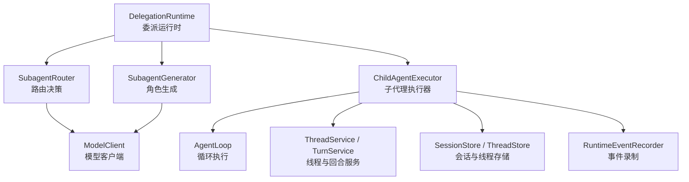
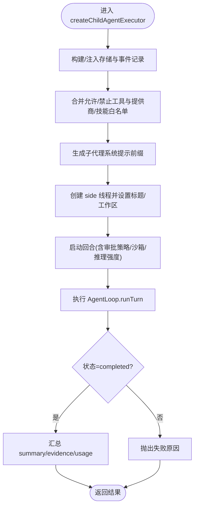
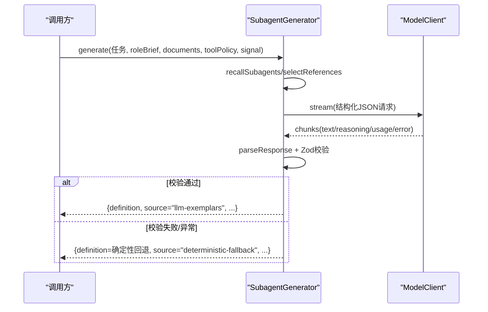
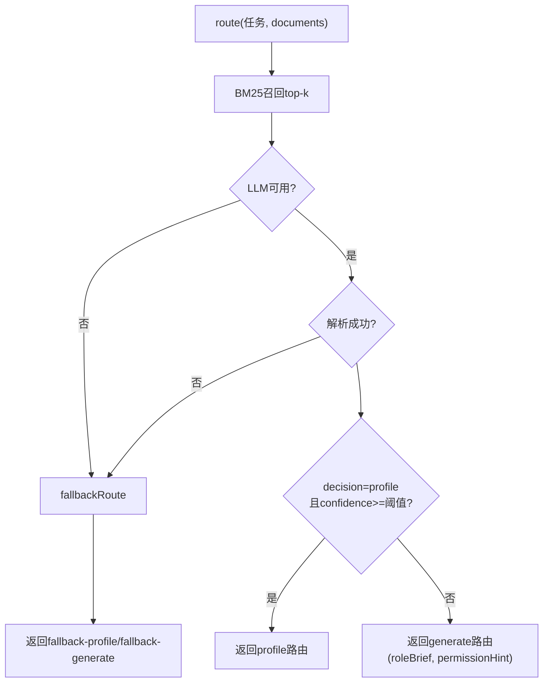
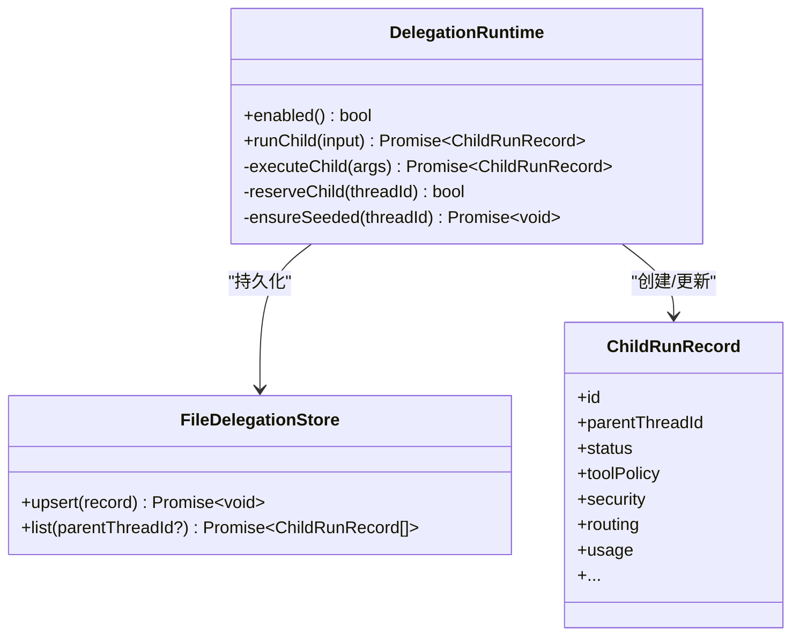
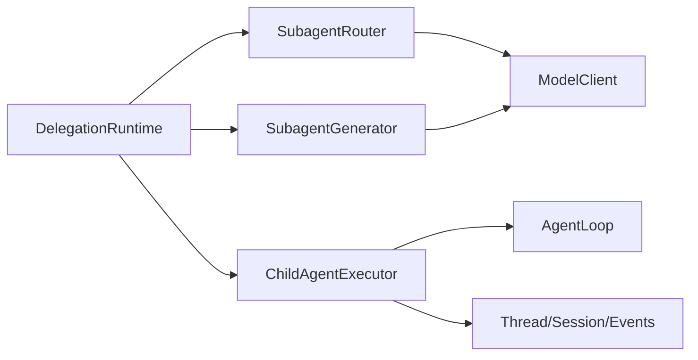

# 子代理委派

<cite>
**本文引用的文件**
- [child-agent-executor.ts](file://kun/src/delegation/child-agent-executor.ts)
- [subagent-generator.ts](file://kun/src/delegation/subagent-generator.ts)
- [subagent-router.ts](file://kun/src/delegation/subagent-router.ts)
- [delegation-runtime.ts](file://kun/src/delegation/delegation-runtime.ts)
- [index.ts](file://kun/src/delegation/index.ts)
- [child-agent-executor.test.ts](file://kun/src/delegation/child-agent-executor.test.ts)
</cite>

## 目录
1. [简介](#简介)
2. [项目结构](#项目结构)
3. [核心组件](#核心组件)
4. [架构总览](#架构总览)
5. [详细组件分析](#详细组件分析)
6. [依赖关系分析](#依赖关系分析)
7. [性能考量](#性能考量)
8. [故障排查指南](#故障排查指南)
9. [结论](#结论)
10. [附录：开发指南与调试技巧](#附录：开发指南与调试技巧)

## 简介
本文件系统性说明 DeepSeek-GUI 的子代理委派机制，覆盖以下关键主题：
- ChildAgentExecutor 如何创建与管理子代理实例（进程隔离、资源限制、生命周期管理）
- SubagentGenerator 的任务分解、配置生成与环境准备流程
- SubagentRouter 的路由策略（任务分发、负载均衡、故障转移）
- 主代理与子代理之间的通信协议、数据同步与状态协调
- 委派安全模型、权限继承与资源隔离机制
- 子代理开发指南与调试技巧

## 项目结构
委派子系统位于 kun/src/delegation，主要模块职责如下：
- delegation-runtime：委派运行时，负责路由、调度、并发控制、持久化、生命周期回调、前台/后台执行等
- subagent-router：基于 BM25 + LLM 的候选召回与路由决策
- subagent-generator：基于 LLM 或确定性回退生成一次性角色定义
- child-agent-executor：子代理执行器，封装 AgentLoop 并注入安全边界、工具策略、审批策略、事件记录等
- index：统一导出



图表来源
- [delegation-runtime.ts:333-780](file://kun/src/delegation/delegation-runtime.ts#L333-L780)
- [subagent-router.ts:140-232](file://kun/src/delegation/subagent-router.ts#L140-L232)
- [subagent-generator.ts:42-130](file://kun/src/delegation/subagent-generator.ts#L42-L130)
- [child-agent-executor.ts:111-408](file://kun/src/delegation/child-agent-executor.ts#L111-L408)

章节来源
- [index.ts:1-4](file://kun/src/delegation/index.ts#L1-L4)

## 核心组件
- DelegationRuntime：委派入口，负责 profile 解析、安全边界校验、并发配额、前台/后台运行、持久化与事件通知。
- SubagentRouter：BM25 召回 + LLM 决策，输出“选择已有 profile”或“生成临时角色”。
- SubagentGenerator：将任务拆解为一次性角色定义，包含系统提示、工具策略、受限工具集等。
- ChildAgentExecutor：构造独立的 AgentLoop 执行上下文，注入安全策略、审批门控、事件与存储，完成子代理生命周期。

章节来源
- [delegation-runtime.ts:333-780](file://kun/src/delegation/delegation-runtime.ts#L333-L780)
- [subagent-router.ts:140-232](file://kun/src/delegation/subagent-router.ts#L140-L232)
- [subagent-generator.ts:42-130](file://kun/src/delegation/subagent-generator.ts#L42-L130)
- [child-agent-executor.ts:111-408](file://kun/src/delegation/child-agent-executor.ts#L111-L408)

## 架构总览
委派流程从父代理发起 delegate_task 开始，经过路由与可选的角色生成，最终通过执行器启动子代理并返回结果。

```mermaid
sequenceDiagram
participant Parent as "父代理"
participant Runtime as "DelegationRuntime"
participant Router as "SubagentRouter"
participant Gen as "SubagentGenerator"
participant Exec as "ChildAgentExecutor"
participant Loop as "AgentLoop"
participant Store as "Thread/Session/Events"
Parent->>Runtime : runChild(任务, 安全边界, 策略)
Runtime->>Runtime : 解析profile/安全/模型选择
alt 需要路由
Runtime->>Router : route(任务, documents)
Router-->>Runtime : {选择profile|生成}
end
opt 生成临时角色
Runtime->>Gen : generate(任务, roleBrief, toolPolicy)
Gen-->>Runtime : {definition, reason}
end
Runtime->>Exec : 创建执行器(注入安全/策略/存储)
Exec->>Loop : runTurn(子线程/回合)
Loop->>Store : 写入事件/会话/线程
Loop-->>Exec : 完成/失败/中止
Exec-->>Runtime : {summary, usage, evidence}
Runtime-->>Parent : 返回记录与结果
```

图表来源
- [delegation-runtime.ts:390-780](file://kun/src/delegation/delegation-runtime.ts#L390-L780)
- [subagent-router.ts:153-232](file://kun/src/delegation/subagent-router.ts#L153-L232)
- [subagent-generator.ts:55-130](file://kun/src/delegation/subagent-generator.ts#L55-L130)
- [child-agent-executor.ts:111-408](file://kun/src/delegation/child-agent-executor.ts#L111-L408)

## 详细组件分析

### ChildAgentExecutor：子代理实例的创建与管理
- 进程与上下文隔离
  - 使用独立 ThreadService/TurnService/SessionStore/ThreadStore，默认以内存实现；当提供外部存储时，子代理作为 side 分支线程与主事件总线共享，但通过 threadId/turnId 与 seq 分配避免事件泄漏。
  - 通过 createDelegatedRuntime 钩子支持宿主侧 provider-native 子代理组合，传入已缩窄的能力边界。
- 资源限制与安全策略
  - 强制允许工具列表：readOnly 模式叠加 SUBAGENT_READ_ONLY_TOOL_NAMES，并与父级 allow-list 取交集，确保子代理能力只减不增。
  - 黑名单：blockedTools/blockedProviderIds/blockedSkills 合并后生效。
  - 工作区与路径：sandboxRoot 作为不可变父工作区边界；读写路径受 allowedReadPaths/allowedWritePaths 约束。
  - 记忆与技能：memoryEnabled/skillsEnabled 可关闭；禁止递归委托（blockedTools 包含 delegate_task/generate_subagent/load_skill）。
- 生命周期管理
  - 创建子线程并标记 relation='side'，标题包含 childId/label/profile。
  - 绑定父信号到子代理中断：父 abort 会调用 turns.interruptTurn 终止子代理回合。
  - 错误处理：仅 fatal 错误导致失败；可恢复的工具拒绝等记录为 warning 不影响完成。
  - 结果汇总：summary/evidence/usage/toolInvocations/prefixReused/inheritedHistoryItems。



图表来源
- [child-agent-executor.ts:111-408](file://kun/src/delegation/child-agent-executor.ts#L111-L408)

章节来源
- [child-agent-executor.ts:111-408](file://kun/src/delegation/child-agent-executor.ts#L111-L408)

### SubagentGenerator：任务分解与角色生成
- 输入与目标
  - 接收任务文本、可选角色摘要、路由文档、参考代理 ID、工具策略、模型选择与超时/中止信号。
- 工作流程
  - 召回候选：recallSubagents 获取 top-k 候选。
  - 选择参考：selectReferences 选取内置/指定示例用于提示。
  - 构建请求：使用固定系统提示与结构化 JSON 响应格式，要求生成 name/description/systemPrompt/toolPolicy/blockedTools/reason。
  - 收集响应：流式收集文本/推理/用量，超时或中止则回退。
  - 解析与校验：Zod 严格校验；若包含不允许的技能引用或非法内容，则回退到确定性专家角色。
  - 回退策略：当模型不可用/超时/解析失败时，返回安全的“任务专用专家”角色，toolPolicy 默认 readOnly。
- 输出
  - definition/source/reason/referenceAgentIds/candidates/usage。



图表来源
- [subagent-generator.ts:55-130](file://kun/src/delegation/subagent-generator.ts#L55-L130)
- [subagent-generator.ts:191-240](file://kun/src/delegation/subagent-generator.ts#L191-L240)
- [subagent-generator.ts:242-270](file://kun/src/delegation/subagent-generator.ts#L242-L270)

章节来源
- [subagent-generator.ts:55-130](file://kun/src/delegation/subagent-generator.ts#L55-L130)
- [subagent-generator.ts:191-240](file://kun/src/delegation/subagent-generator.ts#L191-L240)
- [subagent-generator.ts:242-270](file://kun/src/delegation/subagent-generator.ts#L242-L270)

### SubagentRouter：路由策略（分发、负载、故障转移）
- 召回阶段
  - 对 profile 文档进行索引与分词，计算 BM25 分数，结合策略兼容性加分（readOnly 适合审查/诊断；inherit 适合实现/变更），过滤最低阈值并排序。
- 决策阶段
  - 将 top-k 候选与任务提交给 LLM，要求返回 decision/targetId/confidence/reason/roleBrief/permissionHint。
  - 若 decision=profile 且 confidence >= 阈值，则选择该 profile；否则进入 generate 分支。
- 故障转移
  - 模型不可用/超时/解析失败时，回退到 fallbackRoute：优先选择最高 BM25 候选（若任务明确提及），否则生成临时角色。
- 负载均衡
  - 通过 BM25 多候选与 LLM 置信度评估，避免单点偏差；同时结合 policy 兼容性与显式关键词匹配提升稳定性。



图表来源
- [subagent-router.ts:153-232](file://kun/src/delegation/subagent-router.ts#L153-L232)
- [subagent-router.ts:234-289](file://kun/src/delegation/subagent-router.ts#L234-L289)
- [subagent-router.ts:421-442](file://kun/src/delegation/subagent-router.ts#L421-L442)

章节来源
- [subagent-router.ts:153-232](file://kun/src/delegation/subagent-router.ts#L153-L232)
- [subagent-router.ts:234-289](file://kun/src/delegation/subagent-router.ts#L234-L289)
- [subagent-router.ts:421-442](file://kun/src/delegation/subagent-router.ts#L421-L442)

### DelegationRuntime：调度、并发、持久化与生命周期
- 配置与解析
  - 解析 inlineProfile/configured/workspace 覆盖，校验 surface 可用性，确定 toolPolicy 与 blockedTools。
  - 模型选择：ephemeral agent（custom/generated）继承会话默认模型/提供商/推理强度；可显式覆盖。
- 安全边界
  - 校验 resolvedProviderId/resolvedModel 不得扩大父级权限；sandboxRoot 作为不可变工作区根。
- 并发与配额
  - 维护 per-thread 子代理计数与 FIFO 等待队列；在持久化前预留槽位，超限抛错。
- 前台/后台执行
  - detach=false：同步等待完成；detach=true：立即返回 queued 记录，后台继续执行，支持用户取消。
  - 前台子代理与父信号联动，支持动态“后台化”（unlinkParent）。
- 持久化与事件
  - 使用 FileDelegationStore 原子写入 ChildRunRecord；通过 RuntimeEventRecorder 记录子代理事件，供 UI 订阅。



图表来源
- [delegation-runtime.ts:271-307](file://kun/src/delegation/delegation-runtime.ts#L271-L307)
- [delegation-runtime.ts:333-780](file://kun/src/delegation/delegation-runtime.ts#L333-L780)
- [delegation-runtime.ts:126-192](file://kun/src/delegation/delegation-runtime.ts#L126-L192)

章节来源
- [delegation-runtime.ts:390-780](file://kun/src/delegation/delegation-runtime.ts#L390-L780)
- [delegation-runtime.ts:271-307](file://kun/src/delegation/delegation-runtime.ts#L271-L307)
- [delegation-runtime.ts:126-192](file://kun/src/delegation/delegation-runtime.ts#L126-L192)

## 依赖关系分析
- 组件耦合
  - DelegationRuntime 依赖 Router/Generator/Executor，并通过接口解耦模型与存储。
  - Executor 依赖 AgentLoop、ThreadService/TurnService、存储与事件记录，形成“执行上下文”闭环。
  - Router/Generator 均依赖 ModelClient，并通过 AbortSignal 与超时控制保障鲁棒性。
- 外部依赖
  - ModelClient：统一模型访问抽象，支持流式响应与用量统计。
  - 存储与事件：InMemory* 适配器用于测试；生产环境使用持久化存储与事件总线。
- 潜在环路与风险
  - 无直接循环依赖；Router/Generator 不反向依赖 Executor/Runtime，保持单向依赖链。



图表来源
- [delegation-runtime.ts:333-780](file://kun/src/delegation/delegation-runtime.ts#L333-L780)
- [subagent-router.ts:140-232](file://kun/src/delegation/subagent-router.ts#L140-L232)
- [subagent-generator.ts:42-130](file://kun/src/delegation/subagent-generator.ts#L42-L130)
- [child-agent-executor.ts:111-408](file://kun/src/delegation/child-agent-executor.ts#L111-L408)

章节来源
- [delegation-runtime.ts:333-780](file://kun/src/delegation/delegation-runtime.ts#L333-L780)
- [subagent-router.ts:140-232](file://kun/src/delegation/subagent-router.ts#L140-L232)
- [subagent-generator.ts:42-130](file://kun/src/delegation/subagent-generator.ts#L42-L130)
- [child-agent-executor.ts:111-408](file://kun/src/delegation/child-agent-executor.ts#L111-L408)

## 性能考量
- 路由与生成
  - BM25 召回与 LLM 决策均设超时与中止信号，避免阻塞父流程。
  - 生成器限制最大 token 与温度，降低延迟与成本。
- 执行器
  - 禁用墙钟时限（disableWallTimeLimit），由父信号与审批门控控制生命周期，避免误杀长任务。
  - 上下文压缩（ContextCompactor）与 TokenEconomy 配置可调节以减少上下文膨胀。
- 并发与配额
  - 每线程子代理上限与 FIFO 队列防止过载；detached 模式支持长时间任务与用户取消。
- 存储与事件
  - 原子写入与按 threadId 分配序列号，避免竞争与串扰。

[本节为通用指导，无需特定文件来源]

## 故障排查指南
- 常见错误与定位
  - 路由失败：检查 LLM 是否可用、超时、JSON 解析失败；查看 fallback 行为与候选质量。
  - 生成失败：确认模型返回是否符合 schema；若包含不允许的技能引用，将回退到确定性角色。
  - 执行失败：关注 sessionStore 中的 error 事件 severity；warning/info 不视为致命。
  - 中断问题：父信号 abort 应触发子代理 interruptTurn；测试中验证了 abort 传播。
- 审批门控
  - 当 approvalPolicy=always 时，子代理工具调用需经 ApprovalGate；父中止会使待审批项过期。
- 建议步骤
  - 启用 RuntimeEventRecorder 并订阅事件，观察 turn 状态变化。
  - 打印 ChildRunRecord 的 routing/generation/usage 字段，辅助定位路由与生成路径。
  - 使用最小化工具集与 readOnly 策略复现问题，逐步放开权限。

章节来源
- [child-agent-executor.test.ts:64-188](file://kun/src/delegation/child-agent-executor.test.ts#L64-L188)
- [child-agent-executor.ts:354-396](file://kun/src/delegation/child-agent-executor.ts#L354-L396)
- [subagent-router.ts:153-232](file://kun/src/delegation/subagent-router.ts#L153-L232)
- [subagent-generator.ts:55-130](file://kun/src/delegation/subagent-generator.ts#L55-L130)

## 结论
DeepSeek-GUI 的子代理委派机制通过“路由—生成—执行”三段式架构，实现了高内聚、低耦合的可扩展委派能力。DelegationRuntime 提供统一的并发、安全与持久化保障；SubagentRouter 与 SubagentGenerator 协同完成智能路由与角色定制；ChildAgentExecutor 确保子代理在严格的权限边界内可靠执行。整体设计兼顾性能、可观测性与安全性，适用于复杂任务的分解与并行执行。

[本节为总结，无需特定文件来源]

## 附录：开发指南与调试技巧
- 开发要点
  - 自定义 profile：确保 surfaces 与 agentSurface 匹配；toolPolicy 遵循“只减不增”原则。
  - 安全边界：始终传入 security.sandboxRoot；按需限制 allowedReadPaths/allowedWritePaths。
  - 审批策略：根据场景选择 auto/always；必要时接入 ApprovalGate。
  - 模型选择：ephemeral agent 继承会话默认；reusable profile 保持可信配置优先级。
- 调试技巧
  - 使用 InMemory 存储快速验证逻辑；生产切换为持久化存储与事件总线。
  - 通过 ChildRunRecord 的 routing/generation/usage 字段追踪决策路径与成本。
  - 利用测试用例中的 abort 与 approval 场景，验证中断与审批链路。
- 最佳实践
  - 优先使用 readOnly 策略，仅在确需变更时使用 inherit。
  - 为高风险任务设置更低的并发与更短的超时。
  - 在 GUI 中展示子代理活动标签与证据摘要，提升可观测性。

[本节为通用指导，无需特定文件来源]