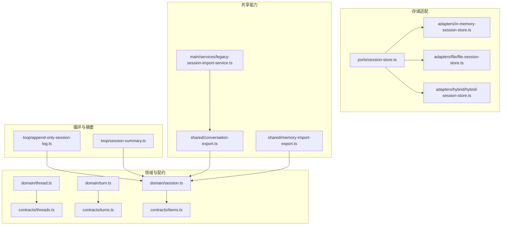
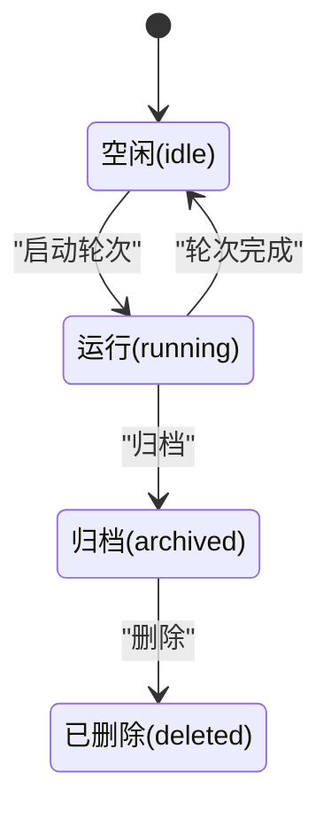
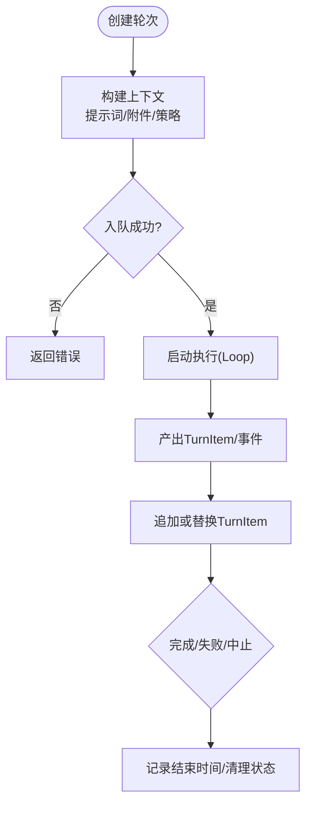
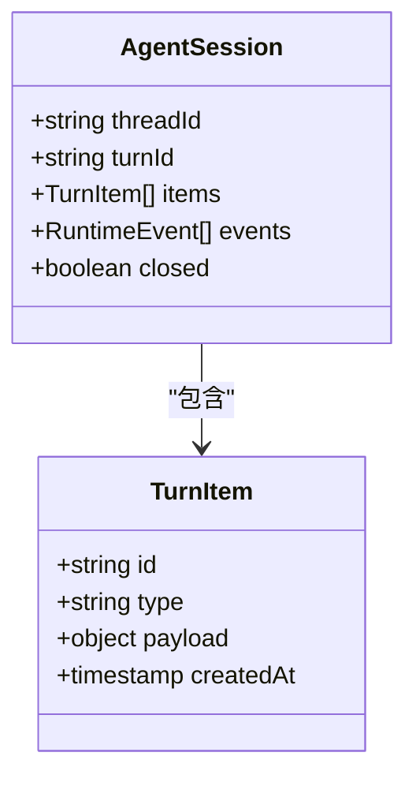
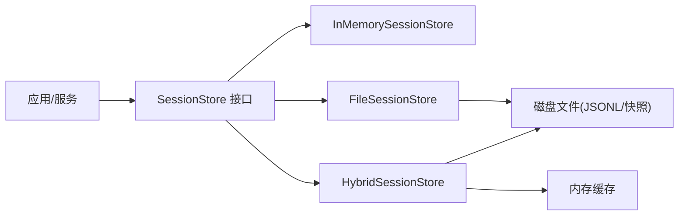
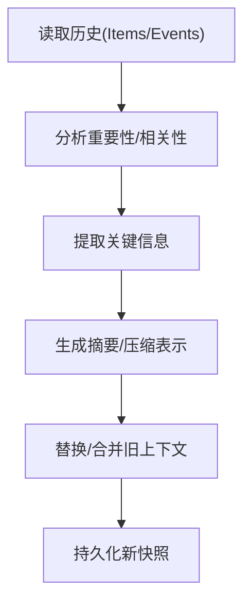
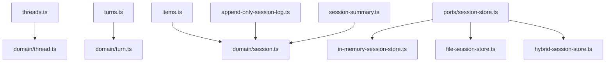

# 会话管理

<cite>
**本文引用的文件**
- [kun/src/domain/session.ts](file://kun/src/domain/session.ts)
- [kun/src/domain/thread.ts](file://kun/src/domain/thread.ts)
- [kun/src/domain/turn.ts](file://kun/src/domain/turn.ts)
- [kun/src/contracts/threads.ts](file://kun/src/contracts/threads.ts)
- [kun/src/contracts/turns.ts](file://kun/src/contracts/turns.ts)
- [kun/src/contracts/items.ts](file://kun/src/contracts/items.ts)
- [kun/src/ports/session-store.ts](file://kun/src/ports/session-store.ts)
- [kun/src/adapters/file/file-session-store.ts](file://kun/src/adapters/file/file-session-store.ts)
- [kun/src/adapters/hybrid/hybrid-session-store.ts](file://kun/src/adapters/hybrid/hybrid-session-store.ts)
- [kun/src/adapters/in-memory-session-store.ts](file://kun/src/adapters/in-memory-session-store.ts)
- [kun/src/loop/append-only-session-log.ts](file://kun/src/loop/append-only-session-log.ts)
- [kun/src/loop/session-summary.ts](file://kun/src/loop/session-summary.ts)
- [src/shared/conversation-export.ts](file://src/shared/conversation-export.ts)
- [src/shared/memory-import-export.ts](file://src/shared/memory-import-export.ts)
- [src/main/services/legacy-session-import-service.ts](file://src/main/services/legacy-session-import-service.ts)
</cite>

## 目录
1. [简介](#简介)
2. [项目结构](#项目结构)
3. [核心组件](#核心组件)
4. [架构总览](#架构总览)
5. [详细组件分析](#详细组件分析)
6. [依赖关系分析](#依赖关系分析)
7. [性能考虑](#性能考虑)
8. [故障排查指南](#故障排查指南)
9. [结论](#结论)
10. [附录](#附录)

## 简介
本文件为 DeepSeek-GUI 的“会话管理系统”提供系统化文档，覆盖线程（Thread）生命周期、消息（Message/TurnItem）结构、对话轮次（Turn）管理机制、会话持久化存储（含 SQLite/文件与迁移策略）、上下文压缩算法、导入导出、多用户支持与数据同步机制，以及会话 API 接口、查询方法与性能优化建议。目标读者包括后端/前端开发者、集成方与运维人员。

## 项目结构
会话管理相关代码主要分布在以下模块：
- 领域模型：线程、轮次、会话等类型与工厂方法
- 契约与校验：Zod Schema 定义线程/轮次/条目等数据结构
- 存储适配层：内存、文件、混合存储实现
- 循环与摘要：追加式会话日志、会话摘要与压缩
- 共享能力：会话导入导出、历史迁移



图表来源
- [kun/src/domain/thread.ts:1-187](file://kun/src/domain/thread.ts#L1-L187)
- [kun/src/domain/turn.ts:1-158](file://kun/src/domain/turn.ts#L1-L158)
- [kun/src/domain/session.ts:1-89](file://kun/src/domain/session.ts#L1-L89)
- [kun/src/contracts/threads.ts:1-471](file://kun/src/contracts/threads.ts#L1-L471)
- [kun/src/contracts/turns.ts:1-200](file://kun/src/contracts/turns.ts#L1-L200)
- [kun/src/contracts/items.ts:1-200](file://kun/src/contracts/items.ts#L1-L200)
- [kun/src/ports/session-store.ts:1-200](file://kun/src/ports/session-store.ts#L1-L200)
- [kun/src/adapters/in-memory-session-store.ts:1-200](file://kun/src/adapters/in-memory-session-store.ts#L1-L200)
- [kun/src/adapters/file/file-session-store.ts:1-200](file://kun/src/adapters/file/file-session-store.ts#L1-L200)
- [kun/src/adapters/hybrid/hybrid-session-store.ts:1-200](file://kun/src/adapters/hybrid/hybrid-session-store.ts#L1-L200)
- [kun/src/loop/append-only-session-log.ts:1-200](file://kun/src/loop/append-only-session-log.ts#L1-L200)
- [kun/src/loop/session-summary.ts:1-200](file://kun/src/loop/session-summary.ts#L1-L200)
- [src/shared/conversation-export.ts:1-200](file://src/shared/conversation-export.ts#L1-L200)
- [src/shared/memory-import-export.ts:1-200](file://src/shared/memory-import-export.ts#L1-L200)
- [src/main/services/legacy-session-import-service.ts:1-200](file://src/main/services/legacy-session-import-service.ts#L1-L200)

章节来源
- [kun/src/domain/thread.ts:1-187](file://kun/src/domain/thread.ts#L1-L187)
- [kun/src/contracts/threads.ts:1-471](file://kun/src/contracts/threads.ts#L1-L471)

## 核心组件
- 线程（Thread）：会话容器，承载工作区、模型、状态、目标、待办、扩展元数据等。支持主线程、分叉、侧聊等关系。
- 轮次（Turn）：一次交互的最小执行单元，包含提示词、附件、工具调用、状态流转等。
- 会话（AgentSession）：对循环（Loop）的可回放投影，由 TurnItem 与 RuntimeEvent 组成，追加写入。
- 存储适配：统一 SessionStore 接口，提供内存、文件、混合三种实现。
- 循环与摘要：追加式日志与摘要压缩，保障长对话的内存与性能。
- 导入导出：跨版本/跨平台的数据迁移与备份恢复。

章节来源
- [kun/src/domain/thread.ts:1-187](file://kun/src/domain/thread.ts#L1-L187)
- [kun/src/domain/turn.ts:1-158](file://kun/src/domain/turn.ts#L1-L158)
- [kun/src/domain/session.ts:1-89](file://kun/src/domain/session.ts#L1-L89)
- [kun/src/ports/session-store.ts:1-200](file://kun/src/ports/session-store.ts#L1-L200)

## 架构总览
下图展示从创建线程到发起轮次、生成会话项、持久化与摘要压缩的整体流程。

```mermaid
sequenceDiagram
participant UI as "界面/客户端"
participant ThreadSvc as "线程服务"
participant TurnSvc as "轮次服务"
participant Loop as "循环(Loop)"
participant Store as "会话存储(SessionStore)"
participant Log as "追加式会话日志"
participant Summ as "会话摘要"
UI->>ThreadSvc : 创建线程(标题/模型/工作区)
ThreadSvc-->>UI : 返回线程ID
UI->>TurnSvc : 提交提示词/附件
TurnSvc->>Loop : 启动轮次(构建上下文/工具/预算)
Loop-->>TurnSvc : 产出TurnItem/事件
TurnSvc->>Log : 追加TurnItem/RuntimeEvent
Log->>Store : 持久化(文件/混合/内存)
Store-->>Log : 确认写入
Loop-->>Summ : 触发摘要/压缩
Summ-->>Store : 更新摘要/快照
TurnSvc-->>UI : 返回轮次结果/状态
```

图表来源
- [kun/src/domain/thread.ts:1-187](file://kun/src/domain/thread.ts#L1-L187)
- [kun/src/domain/turn.ts:1-158](file://kun/src/domain/turn.ts#L1-L158)
- [kun/src/domain/session.ts:1-89](file://kun/src/domain/session.ts#L1-L89)
- [kun/src/ports/session-store.ts:1-200](file://kun/src/ports/session-store.ts#L1-L200)
- [kun/src/loop/append-only-session-log.ts:1-200](file://kun/src/loop/append-only-session-log.ts#L1-L200)
- [kun/src/loop/session-summary.ts:1-200](file://kun/src/loop/session-summary.ts#L1-L200)

## 详细组件分析

### 线程（Thread）概念与生命周期
- 创建：通过 CreateThreadRequest 构造线程记录，默认模式为 agent，状态 idle，并初始化时间戳与空轮次列表。
- 激活：当第一个轮次开始，线程状态可进入 running；运行中持续接收事件与轮次推进。
- 暂停/归档：可通过更新请求将状态置为 archived；删除则标记 deleted。
- 销毁：逻辑删除后清理关联资源（如临时文件、索引），保留审计所需元数据。



图表来源
- [kun/src/contracts/threads.ts:12-40](file://kun/src/contracts/threads.ts#L12-L40)
- [kun/src/domain/thread.ts:30-111](file://kun/src/domain/thread.ts#L30-L111)

章节来源
- [kun/src/contracts/threads.ts:12-40](file://kun/src/contracts/threads.ts#L12-L40)
- [kun/src/domain/thread.ts:30-111](file://kun/src/domain/thread.ts#L30-L111)

### 轮次（Turn）管理机制
- 请求构建：createTurnRecord 封装提示词、模型、提供者、账户、沙箱/审批策略、附件、GUI 上下文、工作区检查点等。
- 状态流转：queued → running → completed/failed/aborted；finishTurn 会清空 steering 并记录结束时间。
- 上下文注入：支持注入记忆、指令源、预算基线、图规划生命周期等。
- 结果聚合：appendTurnItem/replaceTurnItem 用于增量更新轮次内的 TurnItem。



图表来源
- [kun/src/domain/turn.ts:23-109](file://kun/src/domain/turn.ts#L23-L109)
- [kun/src/domain/turn.ts:115-158](file://kun/src/domain/turn.ts#L115-L158)

章节来源
- [kun/src/domain/turn.ts:23-109](file://kun/src/domain/turn.ts#L23-L109)
- [kun/src/domain/turn.ts:115-158](file://kun/src/domain/turn.ts#L115-L158)

### 消息（Message/TurnItem）结构与处理
- 消息载体：TurnItem 作为轮次内最小可见单元，承载文本、图片、文件、工具输出等。
- 多类型处理：通过 items.ts 定义的条目类型区分不同媒体与工具输出；渲染层按类型选择展示策略。
- 幂等追加：appendSessionItem/appendTurnItem 基于 id 去重，避免重复写入。
- 更新策略：updateSessionItem/replaceTurnItem 支持局部补丁更新，保持不可变语义。



图表来源
- [kun/src/domain/session.ts:12-89](file://kun/src/domain/session.ts#L12-L89)
- [kun/src/contracts/items.ts:1-200](file://kun/src/contracts/items.ts#L1-L200)

章节来源
- [kun/src/domain/session.ts:12-89](file://kun/src/domain/session.ts#L12-L89)
- [kun/src/contracts/items.ts:1-200](file://kun/src/contracts/items.ts#L1-L200)

### 会话持久化存储（SQLite/文件/迁移）
- 存储抽象：SessionStore 定义统一的读写接口，屏蔽底层差异。
- 内存实现：InMemorySessionStore 适用于测试与短时缓存。
- 文件实现：FileSessionStore 以 JSONL/文件形式持久化，支持用量事件压缩配置。
- 混合实现：HybridSessionStore 组合内存与文件，兼顾性能与持久性。
- 追加式日志：AppendOnlySessionLog 保证顺序追加与可回放，便于重建对话。
- 迁移策略：通过 shared 层的导入导出与 main 层的旧版导入服务，实现跨版本兼容与数据迁移。



图表来源
- [kun/src/ports/session-store.ts:1-200](file://kun/src/ports/session-store.ts#L1-L200)
- [kun/src/adapters/in-memory-session-store.ts:1-200](file://kun/src/adapters/in-memory-session-store.ts#L1-L200)
- [kun/src/adapters/file/file-session-store.ts:1-200](file://kun/src/adapters/file/file-session-store.ts#L1-L200)
- [kun/src/adapters/hybrid/hybrid-session-store.ts:1-200](file://kun/src/adapters/hybrid/hybrid-session-store.ts#L1-L200)
- [kun/src/loop/append-only-session-log.ts:1-200](file://kun/src/loop/append-only-session-log.ts#L1-L200)

章节来源
- [kun/src/ports/session-store.ts:1-200](file://kun/src/ports/session-store.ts#L1-L200)
- [kun/src/adapters/file/file-session-store.ts:1-200](file://kun/src/adapters/file/file-session-store.ts#L1-L200)
- [kun/src/adapters/hybrid/hybrid-session-store.ts:1-200](file://kun/src/adapters/hybrid/hybrid-session-store.ts#L1-L200)
- [kun/src/adapters/in-memory-session-store.ts:1-200](file://kun/src/adapters/in-memory-session-store.ts#L1-L200)
- [kun/src/loop/append-only-session-log.ts:1-200](file://kun/src/loop/append-only-session-log.ts#L1-L200)

### 上下文压缩算法（历史摘要/关键信息提取/内存优化）
- 摘要生成：session-summary 在合适时机对历史进行摘要，降低后续上下文体积。
- 关键信息提取：依据 TurnItem 与事件序列，抽取关键事实、决策与产物引用。
- 内存优化：结合追加式日志与定期快照，减少全量加载成本；混合存储将热数据留在内存。



图表来源
- [kun/src/loop/session-summary.ts:1-200](file://kun/src/loop/session-summary.ts#L1-L200)
- [kun/src/loop/append-only-session-log.ts:1-200](file://kun/src/loop/append-only-session-log.ts#L1-L200)

章节来源
- [kun/src/loop/session-summary.ts:1-200](file://kun/src/loop/session-summary.ts#L1-L200)
- [kun/src/loop/append-only-session-log.ts:1-200](file://kun/src/loop/append-only-session-log.ts#L1-L200)

### 会话导入导出、多用户支持与数据同步
- 导出：conversation-export 提供会话导出能力，便于备份与分享。
- 导入：memory-import-export 与 legacy-session-import-service 负责新旧格式兼容与迁移。
- 多用户：Thread 支持 accountId、ownerExtensionId、extensionVisibility 等字段，隔离不同用户/扩展上下文。
- 同步：通过统一存储接口与追加式日志，可在多进程/多实例间保持一致性与可回放性。

章节来源
- [src/shared/conversation-export.ts:1-200](file://src/shared/conversation-export.ts#L1-L200)
- [src/shared/memory-import-export.ts:1-200](file://src/shared/memory-import-export.ts#L1-L200)
- [src/main/services/legacy-session-import-service.ts:1-200](file://src/main/services/legacy-session-import-service.ts#L1-L200)
- [kun/src/contracts/threads.ts:220-228](file://kun/src/contracts/threads.ts#L220-L228)

### 会话 API 接口与查询方法
- 创建线程：POST /v1/threads，使用 CreateThreadRequest。
- 更新线程：PATCH /v1/threads/{id}，使用 UpdateThreadRequest。
- 分叉线程：POST /v1/threads/{id}/fork，使用 ForkThreadRequest。
- 目标与待办：SetThreadGoal/SetThreadTodos 及其响应。
- 列表与删除：ListThreadsResponse/DeleteThreadResponse。
- 运行时状态：ThreadRuntimeStateSchema 提供轻量级状态查询。

章节来源
- [kun/src/contracts/threads.ts:310-471](file://kun/src/contracts/threads.ts#L310-L471)
- [kun/src/contracts/threads.ts:15-31](file://kun/src/contracts/threads.ts#L15-L31)

## 依赖关系分析
- 低耦合：领域模型与存储解耦，通过 SessionStore 接口切换实现。
- 强一致性：追加式日志确保事件顺序，便于回放与修复。
- 可扩展：扩展元数据与工具目录快照使线程具备可移植性与审计能力。
- 潜在风险：大会话频繁摘要可能带来 CPU 开销；需结合阈值与异步策略。



图表来源
- [kun/src/contracts/threads.ts:1-471](file://kun/src/contracts/threads.ts#L1-L471)
- [kun/src/domain/thread.ts:1-187](file://kun/src/domain/thread.ts#L1-L187)
- [kun/src/contracts/turns.ts:1-200](file://kun/src/contracts/turns.ts#L1-L200)
- [kun/src/domain/turn.ts:1-158](file://kun/src/domain/turn.ts#L1-L158)
- [kun/src/contracts/items.ts:1-200](file://kun/src/contracts/items.ts#L1-L200)
- [kun/src/domain/session.ts:1-89](file://kun/src/domain/session.ts#L1-L89)
- [kun/src/ports/session-store.ts:1-200](file://kun/src/ports/session-store.ts#L1-L200)
- [kun/src/adapters/in-memory-session-store.ts:1-200](file://kun/src/adapters/in-memory-session-store.ts#L1-L200)
- [kun/src/adapters/file/file-session-store.ts:1-200](file://kun/src/adapters/file/file-session-store.ts#L1-L200)
- [kun/src/adapters/hybrid/hybrid-session-store.ts:1-200](file://kun/src/adapters/hybrid/hybrid-session-store.ts#L1-L200)
- [kun/src/loop/append-only-session-log.ts:1-200](file://kun/src/loop/append-only-session-log.ts#L1-L200)
- [kun/src/loop/session-summary.ts:1-200](file://kun/src/loop/session-summary.ts#L1-L200)

## 性能考虑
- 追加式写入：避免随机写，提升吞吐；配合批量落盘与 WAL。
- 摘要频率：根据会话长度与 token 预算动态调整摘要触发点。
- 混合存储：热路径走内存，冷数据落盘；合理设置缓存淘汰策略。
- 查询优化：仅拉取必要字段（如 ThreadRuntimeState），减少网络与序列化开销。
- 并发控制：限制并发轮次与工具调用，防止资源争用。

## 故障排查指南
- 无法回放：检查追加式日志是否完整、事件序列号是否连续。
- 存储异常：验证文件权限、磁盘空间、混合存储的缓存一致性。
- 摘要失败：检查输入大小、模型配额与超时配置。
- 导入失败：核对版本兼容性、字段缺失与格式校验。
- 线程状态不一致：通过 ThreadRuntimeState 与最新轮次状态交叉验证。

章节来源
- [kun/src/loop/append-only-session-log.ts:1-200](file://kun/src/loop/append-only-session-log.ts#L1-L200)
- [kun/src/loop/session-summary.ts:1-200](file://kun/src/loop/session-summary.ts#L1-L200)
- [src/shared/memory-import-export.ts:1-200](file://src/shared/memory-import-export.ts#L1-L200)
- [src/main/services/legacy-session-import-service.ts:1-200](file://src/main/services/legacy-session-import-service.ts#L1-L200)

## 结论
DeepSeek-GUI 的会话管理以“线程-轮次-会话”三层模型为核心，通过追加式日志与统一存储接口实现高可靠、可回放与高性能。结合摘要压缩、导入导出与多用户隔离，满足复杂场景下的稳定性与可维护性需求。建议在大规模部署中关注摘要策略、存储介质与并发控制，以获得最佳性能与成本平衡。

## 附录
- 术语表
  - 线程（Thread）：会话容器，承载上下文与状态。
  - 轮次（Turn）：一次交互的执行单元。
  - 会话（AgentSession）：对循环的可回放投影。
  - 追加式日志：顺序写入的事件流，支持重建与回放。
- 参考路径
  - 线程契约与请求：[kun/src/contracts/threads.ts](file://kun/src/contracts/threads.ts)
  - 轮次契约与工厂：[kun/src/contracts/turns.ts](file://kun/src/contracts/turns.ts), [kun/src/domain/turn.ts](file://kun/src/domain/turn.ts)
  - 会话模型与操作：[kun/src/domain/session.ts](file://kun/src/domain/session.ts)
  - 存储接口与实现：[kun/src/ports/session-store.ts](file://kun/src/ports/session-store.ts), [kun/src/adapters/*](file://kun/src/adapters/)
  - 循环与摘要：[kun/src/loop/append-only-session-log.ts](file://kun/src/loop/append-only-session-log.ts), [kun/src/loop/session-summary.ts](file://kun/src/loop/session-summary.ts)
  - 导入导出与迁移：[src/shared/conversation-export.ts](file://src/shared/conversation-export.ts), [src/shared/memory-import-export.ts](file://src/shared/memory-import-export.ts), [src/main/services/legacy-session-import-service.ts](file://src/main/services/legacy-session-import-service.ts)