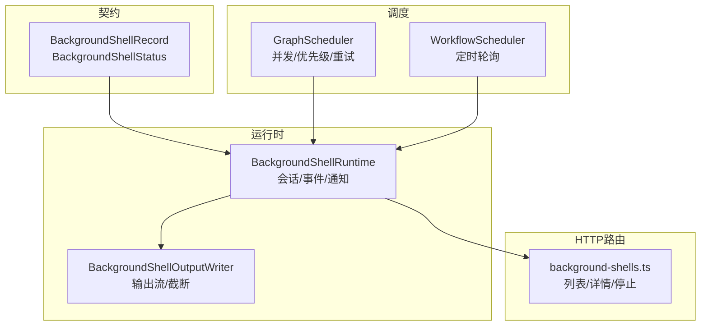
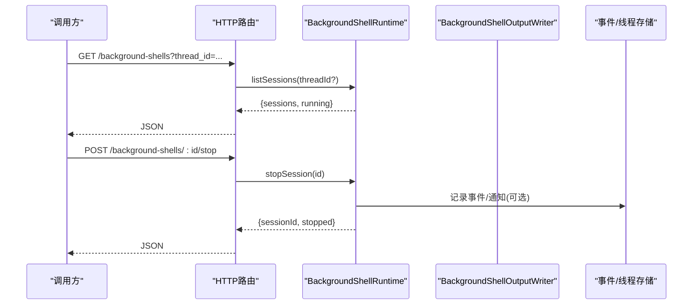
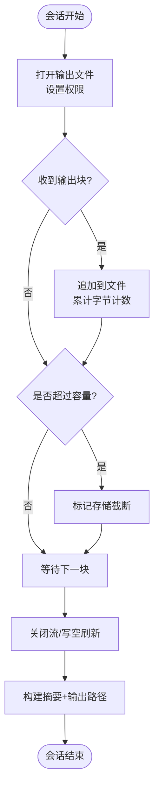
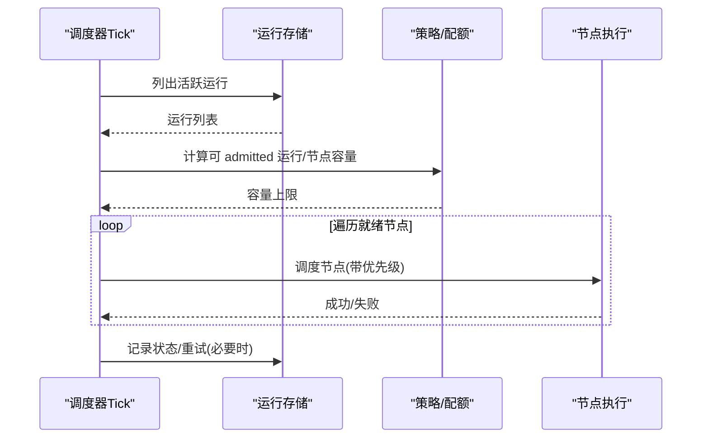
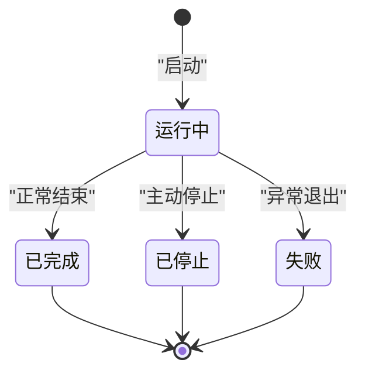
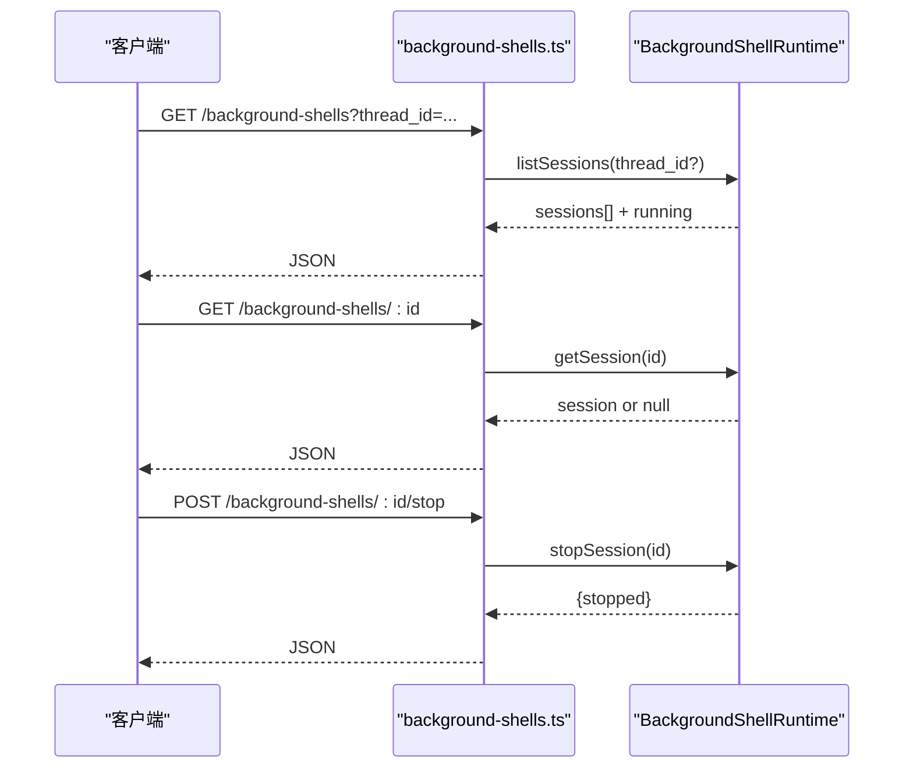
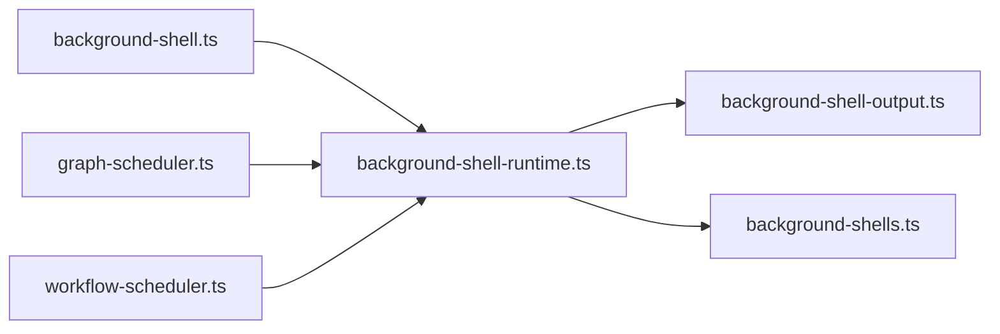

# 后台任务管理

<cite>
**本文引用的文件**
- [background-shell.ts](file://kun/src/contracts/background-shell.ts)
- [background-shell-runtime.ts](file://kun/src/services/background-shell-runtime.ts)
- [background-shell-output.ts](file://kun/src/services/background-shell-output.ts)
- [background-shells.ts](file://kun/src/server/routes/background-shells.ts)
- [graph-scheduler.ts](file://kun/src/graph/graph-scheduler.ts)
- [workflow-scheduler.ts](file://src/main/workflow-scheduler.ts)
</cite>

## 目录
1. [简介](#简介)
2. [项目结构](#项目结构)
3. [核心组件](#核心组件)
4. [架构总览](#架构总览)
5. [详细组件分析](#详细组件分析)
6. [依赖关系分析](#依赖关系分析)
7. [性能考量](#性能考量)
8. [故障排除指南](#故障排除指南)
9. [结论](#结论)
10. [附录](#附录)

## 简介
本文件面向DeepSeek-GUI的后台任务管理系统，聚焦以下能力：
- Shell任务执行机制：命令启动、输出捕获、进度跟踪与结果处理。
- 作业调度系统：任务队列、优先级管理与并发控制。
- 资源监控：事件循环健康与运行时健康指标（CPU/内存/磁盘I/O）。
- 任务生命周期：启动、暂停、恢复与终止。
- 错误处理、重试机制与日志记录。
- 任务API接口、监控面板与故障排除。

## 项目结构
围绕后台任务管理的代码主要分布在以下模块：
- 契约定义：统一的数据结构与状态枚举。
- 运行时服务：会话管理、事件上报、通知与自动唤醒。
- 输出持久化：按线程隔离的输出目录、流式写入与截断策略。
- HTTP路由：对外暴露的查询与停止接口。
- 图调度器：节点级并发、运行级容量与公平调度。
- 工作流调度器：通用定时器驱动的任务轮询。

**图表来源**
- [background-shell.ts:1-36](file://kun/src/contracts/background-shell.ts#L1-L36)
- [background-shell-runtime.ts:1-269](file://kun/src/services/background-shell-runtime.ts#L1-L269)
- [background-shell-output.ts:1-172](file://kun/src/services/background-shell-output.ts#L1-L172)
- [background-shells.ts:1-43](file://kun/src/server/routes/background-shells.ts#L1-L43)
- [graph-scheduler.ts:1-200](file://kun/src/graph/graph-scheduler.ts#L1-L200)
- [workflow-scheduler.ts:1-29](file://src/main/workflow-scheduler.ts#L1-L29)

**章节来源**
- [background-shell.ts:1-36](file://kun/src/contracts/background-shell.ts#L1-L36)
- [background-shell-runtime.ts:1-269](file://kun/src/services/background-shell-runtime.ts#L1-L269)
- [background-shell-output.ts:1-172](file://kun/src/services/background-shell-output.ts#L1-L172)
- [background-shells.ts:1-43](file://kun/src/server/routes/background-shells.ts#L1-L43)
- [graph-scheduler.ts:1-200](file://kun/src/graph/graph-scheduler.ts#L1-L200)
- [workflow-scheduler.ts:1-29](file://src/main/workflow-scheduler.ts#L1-L29)

## 核心组件
- 契约层：定义后台Shell会话的状态、记录字段与响应结构，确保跨进程/模块一致。
- 运行时服务：维护会话集合、事件录制、完成通知与自动唤醒；支持按线程停止与全局关闭。
- 输出子系统：为每个会话创建独立输出文件，流式追加、容量限制与摘要读取。
- HTTP路由：提供会话列表、会话详情与停止会话的REST风格接口。
- 图调度器：按运行和节点维度进行并发控制、优先级排序与冲突重试。
- 工作流调度器：基于间隔定时器的轻量调度外壳，封装启停与状态查询。

**章节来源**
- [background-shell.ts:1-36](file://kun/src/contracts/background-shell.ts#L1-L36)
- [background-shell-runtime.ts:1-269](file://kun/src/services/background-shell-runtime.ts#L1-L269)
- [background-shell-output.ts:1-172](file://kun/src/services/background-shell-output.ts#L1-L172)
- [background-shells.ts:1-43](file://kun/src/server/routes/background-shells.ts#L1-L43)
- [graph-scheduler.ts:1-200](file://kun/src/graph/graph-scheduler.ts#L1-L200)
- [workflow-scheduler.ts:1-29](file://src/main/workflow-scheduler.ts#L1-L29)

## 架构总览
后台任务管理由“契约—运行时—输出—路由—调度”五层构成。Shell任务通过适配器触发，运行时负责会话生命周期与事件上报；输出子系统将长输出落盘并支持摘要；路由层暴露查询与控制接口；调度器在图与工作流层面驱动任务推进与并发控制。

**图表来源**
- [background-shells.ts:1-43](file://kun/src/server/routes/background-shells.ts#L1-L43)
- [background-shell-runtime.ts:1-269](file://kun/src/services/background-shell-runtime.ts#L1-L269)
- [background-shell-output.ts:1-172](file://kun/src/services/background-shell-output.ts#L1-L172)

## 详细组件分析

### Shell任务执行机制
- 命令启动与会话创建：适配器通过钩子回调向运行时提交会话记录，包含命令、工作目录、shell类型、时间戳等。
- 输出捕获：使用输出写入器以追加模式写入独立文件，限制最大字节数并在达到上限时标记截断；同时提供摘要读取与完整路径返回。
- 进度跟踪：会话状态变更（开始/更新/完成）均被记录为事件，包含退出码、错误信息、是否分离等。
- 结果处理：完成时若为分离会话且非运行中，则自动生成提示消息并尝试唤醒或引导当前运行中的回合继续处理。

**图表来源**
- [background-shell-output.ts:1-172](file://kun/src/services/background-shell-output.ts#L1-L172)

**章节来源**
- [background-shell-runtime.ts:1-269](file://kun/src/services/background-shell-runtime.ts#L1-L269)
- [background-shell-output.ts:1-172](file://kun/src/services/background-shell-output.ts#L1-L172)

### 作业调度系统（图与工作流）
- 任务队列：图调度器从存储中拉取处于运行、等待监督/人类、完成中的运行；工作流调度器通过定时器周期性触发tick。
- 优先级管理：就绪节点按优先级降序、ID升序排序，优先执行高优先级节点。
- 并发控制：
  - 运行级并发：受配置的最大并发运行数限制。
  - 节点级并发：受全局与每运行上限双重约束，避免过载。
- 重试与冲突：对运行再平衡过程中的冲突进行有限次重试，失败后记录诊断信息。

**图表来源**
- [graph-scheduler.ts:1-200](file://kun/src/graph/graph-scheduler.ts#L1-L200)
- [workflow-scheduler.ts:1-29](file://src/main/workflow-scheduler.ts#L1-L29)

**章节来源**
- [graph-scheduler.ts:1-200](file://kun/src/graph/graph-scheduler.ts#L1-L200)
- [workflow-scheduler.ts:1-29](file://src/main/workflow-scheduler.ts#L1-L29)

### 资源监控功能
- 事件循环健康：服务端提供事件循环监控模块，用于检测主循环阻塞与卡顿。
- 运行时健康：主进程侧提供运行时健康监控，结合系统指标评估整体健康度。
- 说明：具体CPU使用率、内存占用与磁盘I/O统计的实现细节位于对应监控模块中，可通过其API获取指标并进行告警或限流。

**章节来源**
- [event-loop-monitor.ts](file://kun/src/server/event-loop-monitor.ts)
- [kun-runtime-health-monitor.ts](file://src/main/runtime/kun-runtime-health-monitor.ts)

### 任务生命周期管理
- 启动：会话创建时记录开始时间与初始状态，并写入事件。
- 暂停/恢复：通过运行/节点级别的调度控制实现暂停与恢复；图调度器支持恢复运行。
- 终止：支持单会话停止、按线程批量停止与全局关闭；停止时会清理活动句柄并记录事件。
- 分离会话：分离会话完成后仍会通知上层，以便继续后续处理。

**图表来源**
- [background-shell-runtime.ts:1-269](file://kun/src/services/background-shell-runtime.ts#L1-L269)
- [background-shell.ts:1-36](file://kun/src/contracts/background-shell.ts#L1-L36)

**章节来源**
- [background-shell-runtime.ts:1-269](file://kun/src/services/background-shell-runtime.ts#L1-L269)
- [background-shell.ts:1-36](file://kun/src/contracts/background-shell.ts#L1-L36)

### 错误处理、重试机制与日志记录
- 错误处理：会话更新/完成事件携带错误字段；路由层对缺失参数与不可用运行时返回标准化错误。
- 重试机制：图调度器对运行再平衡冲突进行有限次数重试，避免瞬时竞争导致失败。
- 日志记录：所有会话事件通过事件记录器持久化；输出文件作为长任务的完整日志载体，并提供摘要便于快速定位问题。

**章节来源**
- [background-shells.ts:1-43](file://kun/src/server/routes/background-shells.ts#L1-L43)
- [graph-scheduler.ts:1-200](file://kun/src/graph/graph-scheduler.ts#L1-L200)
- [background-shell-output.ts:1-172](file://kun/src/services/background-shell-output.ts#L1-L172)

### 任务API接口
- 列表会话：支持按线程过滤，返回会话数组与运行中数量。
- 获取会话：根据会话ID返回详细信息。
- 停止会话：对指定会话发起停止请求，返回是否成功停止。

**图表来源**
- [background-shells.ts:1-43](file://kun/src/server/routes/background-shells.ts#L1-L43)
- [background-shell-runtime.ts:1-269](file://kun/src/services/background-shell-runtime.ts#L1-L269)

**章节来源**
- [background-shells.ts:1-43](file://kun/src/server/routes/background-shells.ts#L1-L43)

### 监控面板与可视化
- 会话面板：展示会话列表、状态、命令、工作目录、开始/结束时间、退出码与输出摘要。
- 运行面板：展示图调度的活跃运行、节点并发、优先级与配额使用情况。
- 健康面板：展示事件循环健康与运行时健康指标，辅助发现瓶颈与异常。

[本节为概念性说明，不直接分析具体文件]

## 依赖关系分析
- 契约依赖：运行时与路由均依赖统一的会话记录与状态定义，保证数据一致性。
- 运行时依赖：事件记录器、线程存储与回合服务，用于事件上报与自动唤醒。
- 输出依赖：文件系统操作与路径解析，确保输出隔离与安全权限。
- 调度依赖：存储、策略与邮件箱（过期处理），保障调度正确性与幂等性。

**图表来源**
- [background-shell.ts:1-36](file://kun/src/contracts/background-shell.ts#L1-L36)
- [background-shell-runtime.ts:1-269](file://kun/src/services/background-shell-runtime.ts#L1-L269)
- [background-shell-output.ts:1-172](file://kun/src/services/background-shell-output.ts#L1-L172)
- [background-shells.ts:1-43](file://kun/src/server/routes/background-shells.ts#L1-L43)
- [graph-scheduler.ts:1-200](file://kun/src/graph/graph-scheduler.ts#L1-L200)
- [workflow-scheduler.ts:1-29](file://src/main/workflow-scheduler.ts#L1-L29)

**章节来源**
- [background-shell.ts:1-36](file://kun/src/contracts/background-shell.ts#L1-L36)
- [background-shell-runtime.ts:1-269](file://kun/src/services/background-shell-runtime.ts#L1-L269)
- [background-shell-output.ts:1-172](file://kun/src/services/background-shell-output.ts#L1-L172)
- [background-shells.ts:1-43](file://kun/src/server/routes/background-shells.ts#L1-L43)
- [graph-scheduler.ts:1-200](file://kun/src/graph/graph-scheduler.ts#L1-L200)
- [workflow-scheduler.ts:1-29](file://src/main/workflow-scheduler.ts#L1-L29)

## 性能考量
- 输出写入采用流式追加与容量限制，避免大输出导致内存膨胀；提供摘要读取以减少前端渲染压力。
- 会话集合维护有上限，超出时将清理已完成会话，防止内存泄漏。
- 调度器通过运行级与节点级并发上限控制吞吐，避免资源争用。
- 定时器驱动的工作流调度使用unref，降低对进程退出的影响。

**章节来源**
- [background-shell-output.ts:1-172](file://kun/src/services/background-shell-output.ts#L1-L172)
- [background-shell-runtime.ts:1-269](file://kun/src/services/background-shell-runtime.ts#L1-L269)
- [graph-scheduler.ts:1-200](file://kun/src/graph/graph-scheduler.ts#L1-L200)
- [workflow-scheduler.ts:1-29](file://src/main/workflow-scheduler.ts#L1-L29)

## 故障排除指南
- 无法列出会话：检查运行时是否可用；若不可用，路由返回空列表与running=0。
- 会话不存在：确认传入的sessionId有效；否则返回未找到错误。
- 停止无效：确认会话存在且仍在运行；停止处理器未绑定或会话已结束会导致返回false。
- 输出为空或截断：检查输出文件大小与截断标志；必要时读取完整输出文件。
- 调度无进展：查看运行状态是否为运行/等待监督/等待人类；检查并发上限与节点优先级。
- 事件循环卡顿：通过事件循环监控定位阻塞点；结合运行时健康指标排查。

**章节来源**
- [background-shells.ts:1-43](file://kun/src/server/routes/background-shells.ts#L1-L43)
- [background-shell-runtime.ts:1-269](file://kun/src/services/background-shell-runtime.ts#L1-L269)
- [background-shell-output.ts:1-172](file://kun/src/services/background-shell-output.ts#L1-L172)
- [graph-scheduler.ts:1-200](file://kun/src/graph/graph-scheduler.ts#L1-L200)

## 结论
本系统通过清晰的契约定义、健壮的运行时管理、可靠的输出持久化、灵活的调度策略与完善的监控能力，实现了后台任务的全生命周期管理。Shell任务具备完整的启动、输出捕获、进度跟踪与结果处理能力；调度系统提供优先级与并发控制；监控与故障排除工具帮助快速定位问题。建议在生产环境中结合健康监控与限流策略，确保系统稳定与高效。

## 附录
- 术语
  - 分离会话：脱离对话生命周期的后台任务，完成后仍需通知上层。
  - 运行：一次图执行的上下文，包含多个节点。
  - 节点：图中的最小执行单元，具有优先级与状态。
- 最佳实践
  - 合理设置输出大小上限与摘要长度，避免前端渲染压力。
  - 根据业务负载调整调度并发上限，避免资源争用。
  - 对关键任务启用健康监控与告警，及时发现问题。

[本节为补充说明，不直接分析具体文件]