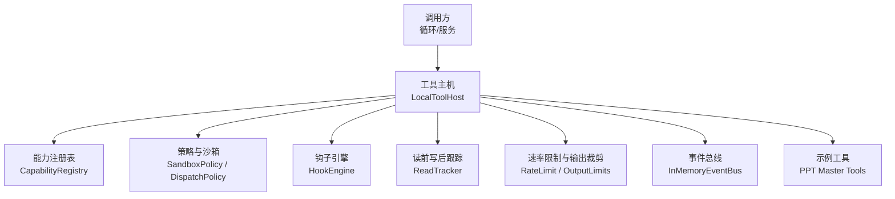
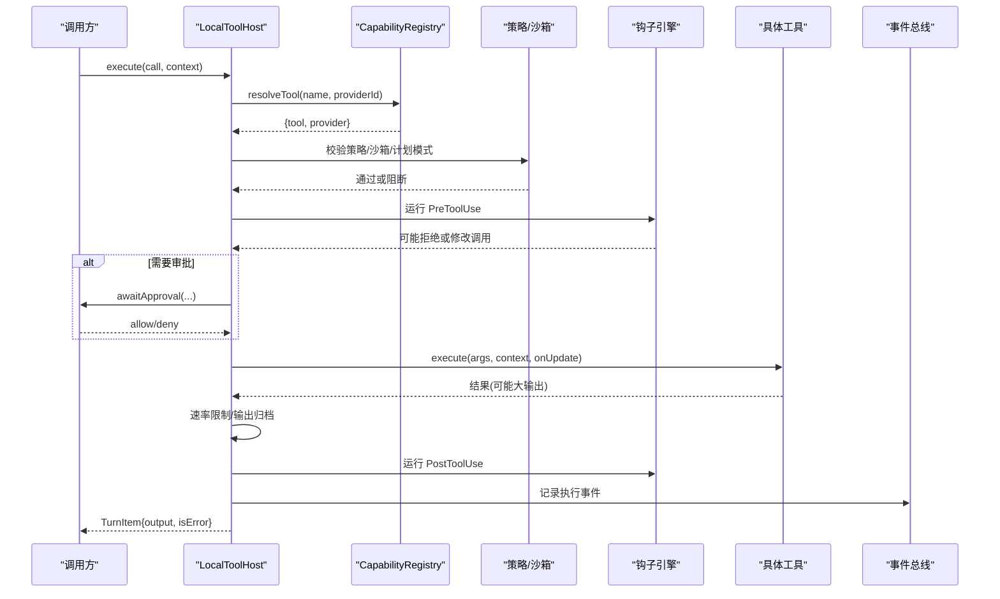
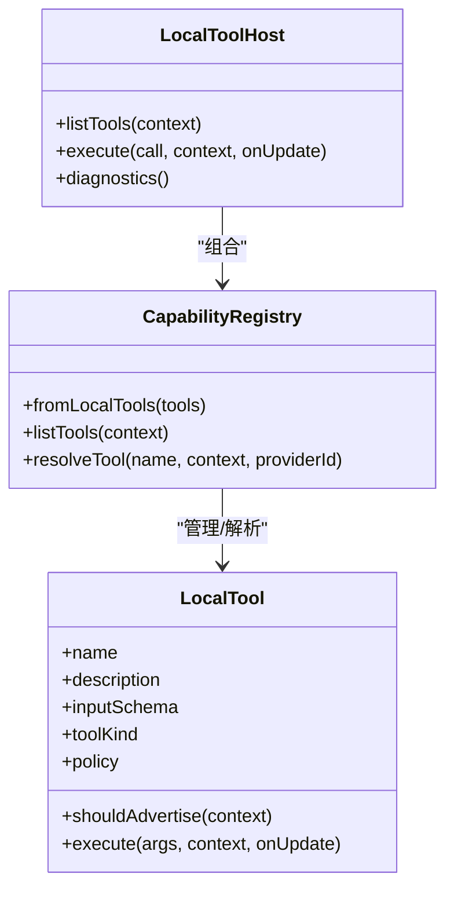
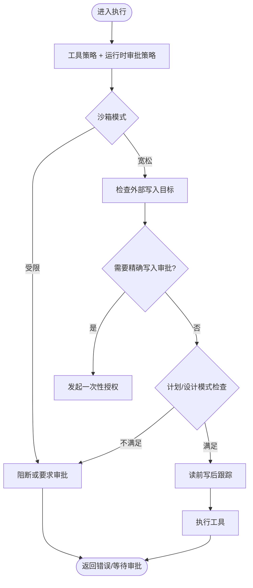
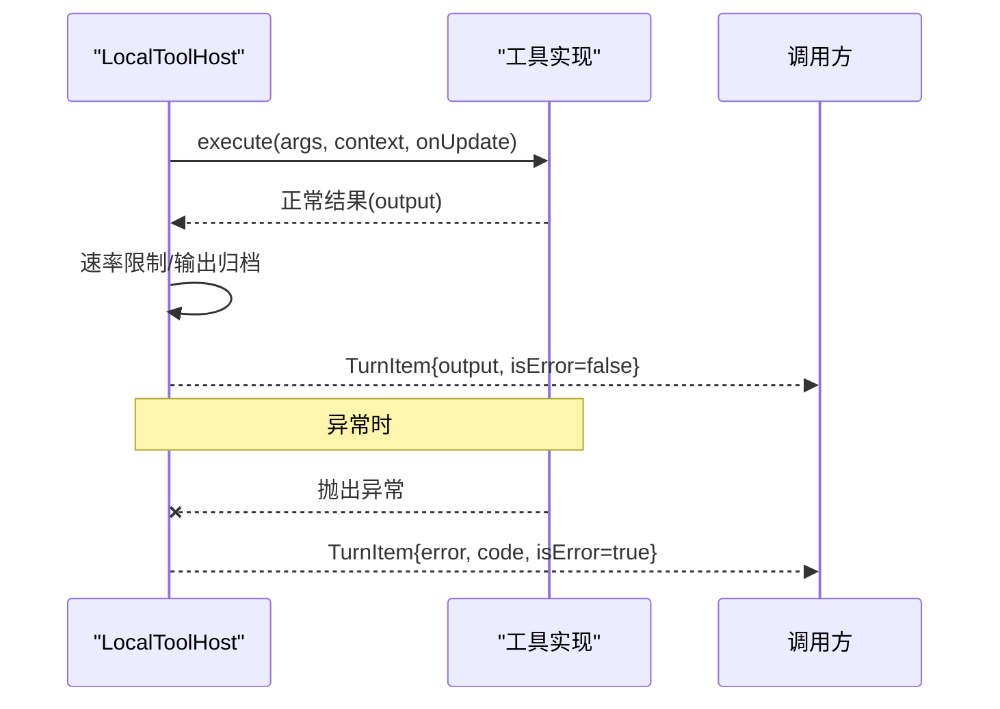
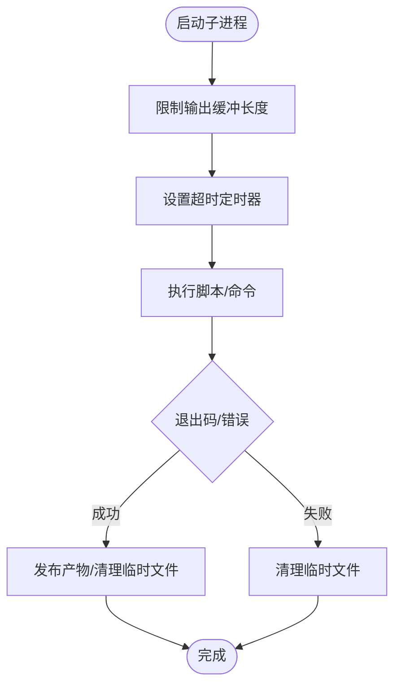
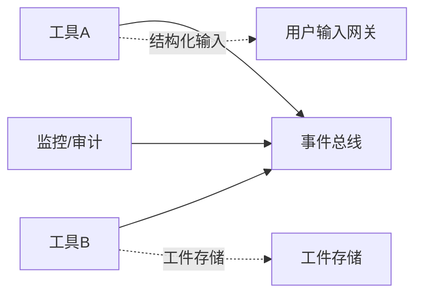
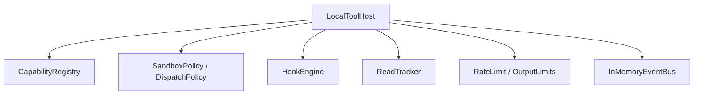

# 工具执行框架

<cite>
**本文引用的文件**
- [local-tool-host.ts](file://kun/src/adapters/tool/local-tool-host.ts)
- [tool-host.ts](file://kun/src/ports/tool-host.ts)
- [ppt-master-tool.ts](file://kun/src/adapters/tool/ppt-master-tool.ts)
- [tool-dispatch-policy.ts](file://kun/src/loop/tool-dispatch-policy.ts)
- [tool-call-dispatcher.ts](file://kun/src/loop/tool-call-dispatcher.ts)
- [tool-cancellation-registry.ts](file://kun/src/loop/tool-cancellation-registry.ts)
- [tool-context-factory.ts](file://kun/src/loop/tool-context-factory.ts)
- [tool-output-limits.ts](file://kun/src/contracts/tool-output-limits.ts)
- [in-memory-event-bus.ts](file://kun/src/adapters/in-memory-event-bus.ts)
- [capability-registry.ts](file://kun/src/adapters/tool/capability-registry.ts)
- [sandbox-policy.ts](file://kun/src/adapters/tool/sandbox-policy.ts)
- [builtin-tools.ts](file://kun/src/adapters/tool/builtin-tools.ts)
- [tool-rate-limit.ts](file://kun/src/adapters/tool/tool-rate-limit.ts)
- [read-tracker.ts](file://kun/src/adapters/tool/read-tracker.ts)
- [hook-engine.ts](file://kun/src/hooks/hook-engine.ts)
</cite>

## 目录
1. [简介](#简介)
2. [项目结构](#项目结构)
3. [核心组件](#核心组件)
4. [架构总览](#架构总览)
5. [详细组件分析](#详细组件分析)
6. [依赖关系分析](#依赖关系分析)
7. [性能与资源管理](#性能与资源管理)
8. [故障诊断与排错](#故障诊断与排错)
9. [结论](#结论)
10. [附录：开发指南、API 参考与最佳实践](#附录开发指南api-参考与最佳实践)

## 简介
本文件面向 DeepSeek-GUI 的工具执行框架，系统性说明工具的注册与发现、权限控制与沙箱隔离、调用协议（参数序列化、返回值处理、异常传播）、执行环境管理（进程隔离、内存限制、超时控制）、工具间通信（事件总线、消息传递、状态共享），以及监控、性能分析与故障诊断能力。文档同时提供工具开发指南、API 参考与最佳实践示例，帮助开发者安全、可靠地扩展与集成新工具。

## 项目结构
工具执行框架位于 kun 子工程中，围绕“本地工具主机”“工具注册表”“策略与沙箱”“调度与生命周期”“事件与审计”等模块组织。关键路径如下：
- 工具主机与执行管线：local-tool-host.ts、tool-host.ts
- 工具注册与能力发现：capability-registry.ts、builtin-tools.ts
- 策略与沙箱：sandbox-policy.ts、tool-dispatch-policy.ts
- 调度与上下文：tool-call-dispatcher.ts、tool-context-factory.ts、tool-cancellation-registry.ts
- 输出与限流：tool-output-limits.ts、tool-rate-limit.ts、read-tracker.ts
- 事件与审计：in-memory-event-bus.ts、hook-engine.ts
- 示例工具实现：ppt-master-tool.ts

**图表来源**
- [local-tool-host.ts:143-557](file://kun/src/adapters/tool/local-tool-host.ts#L143-L557)
- [tool-host.ts:238-261](file://kun/src/ports/tool-host.ts#L238-L261)
- [capability-registry.ts](file://kun/src/adapters/tool/capability-registry.ts)
- [sandbox-policy.ts](file://kun/src/adapters/tool/sandbox-policy.ts)
- [tool-dispatch-policy.ts](file://kun/src/loop/tool-dispatch-policy.ts)
- [hook-engine.ts](file://kun/src/hooks/hook-engine.ts)
- [read-tracker.ts](file://kun/src/adapters/tool/read-tracker.ts)
- [tool-rate-limit.ts](file://kun/src/adapters/tool/tool-rate-limit.ts)
- [in-memory-event-bus.ts](file://kun/src/adapters/in-memory-event-bus.ts)
- [ppt-master-tool.ts:60-68](file://kun/src/adapters/tool/ppt-master-tool.ts#L60-L68)

**章节来源**
- [local-tool-host.ts:143-557](file://kun/src/adapters/tool/local-tool-host.ts#L143-L557)
- [tool-host.ts:238-261](file://kun/src/ports/tool-host.ts#L238-L261)

## 核心组件
- 工具主机 LocalToolHost：统一入口，负责工具解析、策略判定、审批边界、执行编排、结果封装与回放去重。
- 工具接口与上下文：定义工具描述、输入模式、副作用分类、执行签名；上下文承载线程/工作区/审批策略/沙箱模式/取消信号等。
- 能力注册表：集中维护工具清单、提供者信息与可见性过滤。
- 策略与沙箱：基于工具声明与运行时上下文决定是否允许执行、是否需要审批、是否阻断。
- 调度与上下文工厂：将高层调用转换为可执行的工具调用，并注入上下文、取消与重试语义。
- 输出与限流：对大输出进行归档、截断与速率限制，避免上下文膨胀。
- 事件与钩子：在工具执行前后注入审计、遥测与自定义逻辑。
- 示例工具：以 PPT Master 为例展示受控脚本执行、路径白名单、用户确认与产物发布流程。

**章节来源**
- [local-tool-host.ts:52-127](file://kun/src/adapters/tool/local-tool-host.ts#L52-L127)
- [tool-host.ts:20-212](file://kun/src/ports/tool-host.ts#L20-L212)
- [capability-registry.ts](file://kun/src/adapters/tool/capability-registry.ts)
- [sandbox-policy.ts](file://kun/src/adapters/tool/sandbox-policy.ts)
- [tool-dispatch-policy.ts](file://kun/src/loop/tool-dispatch-policy.ts)
- [tool-call-dispatcher.ts](file://kun/src/loop/tool-call-dispatcher.ts)
- [tool-context-factory.ts](file://kun/src/loop/tool-context-factory.ts)
- [tool-cancellation-registry.ts](file://kun/src/loop/tool-cancellation-registry.ts)
- [tool-output-limits.ts](file://kun/src/contracts/tool-output-limits.ts)
- [tool-rate-limit.ts](file://kun/src/adapters/tool/tool-rate-limit.ts)
- [read-tracker.ts](file://kun/src/adapters/tool/read-tracker.ts)
- [hook-engine.ts](file://kun/src/hooks/hook-engine.ts)
- [ppt-master-tool.ts:60-68](file://kun/src/adapters/tool/ppt-master-tool.ts#L60-L68)

## 架构总览
下图展示了从调用到执行再到结果的完整链路，包括审批、沙箱、钩子、输出归档与事件记录。

**图表来源**
- [local-tool-host.ts:196-557](file://kun/src/adapters/tool/local-tool-host.ts#L196-L557)
- [tool-host.ts:238-261](file://kun/src/ports/tool-host.ts#L238-L261)
- [hook-engine.ts](file://kun/src/hooks/hook-engine.ts)
- [tool-rate-limit.ts](file://kun/src/adapters/tool/tool-rate-limit.ts)
- [in-memory-event-bus.ts](file://kun/src/adapters/in-memory-event-bus.ts)

## 详细组件分析

### 工具注册与发现机制
- 内置工具：由内置工具集注册到能力注册表，默认可用并可被策略过滤。
- 扩展工具：通过外部提供者（MCP/Web/Skill/Extension 等）动态加入注册表，支持按上下文可见性过滤。
- 自定义工具：使用 defineTool 构造器创建，声明名称、描述、输入模式、副作用分类、策略与执行函数，再交由注册表管理。
- 可见性与广告：工具可声明 shouldAdvertise 以根据上下文决定是否列出与执行（例如仅在计划模式或特定技能激活时）。

**图表来源**
- [local-tool-host.ts:143-190](file://kun/src/adapters/tool/local-tool-host.ts#L143-L190)
- [capability-registry.ts](file://kun/src/adapters/tool/capability-registry.ts)
- [local-tool-host.ts:690-717](file://kun/src/adapters/tool/local-tool-host.ts#L690-L717)

**章节来源**
- [local-tool-host.ts:143-190](file://kun/src/adapters/tool/local-tool-host.ts#L143-L190)
- [local-tool-host.ts:690-717](file://kun/src/adapters/tool/local-tool-host.ts#L690-L717)
- [capability-registry.ts](file://kun/src/adapters/tool/capability-registry.ts)

### 工具权限控制与沙箱隔离
- 策略矩阵：工具策略（auto/on-request/suggest/never/untrusted）与运行时审批策略（always/auto/on-request/suggest/untrusted）共同决定是否需要审批。
- 沙箱模式：workspace-write 与 danger-full-access 等模式影响命令执行与外部写入的放行范围。
- 外部写入审批：针对精确文件写入目标，可在一次调用内发放临时授权，防止越权。
- 计划模式保护：某些工具仅在计划/设计模式下可用，普通代理模式会被阻断。
- 读取-写入一致性：读前写后跟踪确保编辑前已读取最新数据，避免竞态。

**图表来源**
- [local-tool-host.ts:211-336](file://kun/src/adapters/tool/local-tool-host.ts#L211-L336)
- [sandbox-policy.ts](file://kun/src/adapters/tool/sandbox-policy.ts)
- [tool-dispatch-policy.ts](file://kun/src/loop/tool-dispatch-policy.ts)
- [read-tracker.ts](file://kun/src/adapters/tool/read-tracker.ts)

**章节来源**
- [local-tool-host.ts:211-336](file://kun/src/adapters/tool/local-tool-host.ts#L211-L336)
- [sandbox-policy.ts](file://kun/src/adapters/tool/sandbox-policy.ts)
- [tool-dispatch-policy.ts](file://kun/src/loop/tool-dispatch-policy.ts)
- [read-tracker.ts](file://kun/src/adapters/tool/read-tracker.ts)

### 工具调用协议：参数、返回值与异常
- 参数序列化：工具通过 inputSchema 声明参数类型与约束；主机在执行前进行基本校验与规范化。
- 返回值处理：成功返回 output，失败设置 isError；大输出自动归档为 artifact，返回引用信息以减少上下文压力。
- 异常传播：工具抛出的异常被捕获并转为错误项；若为未知副作用场景，标记为 unknown 以避免自动重试。
- 进度更新：onUpdate 回调可推送中间结果，便于 UI 实时反馈。

**图表来源**
- [local-tool-host.ts:494-557](file://kun/src/adapters/tool/local-tool-host.ts#L494-L557)
- [tool-host.ts:214-231](file://kun/src/ports/tool-host.ts#L214-L231)
- [tool-rate-limit.ts](file://kun/src/adapters/tool/tool-rate-limit.ts)

**章节来源**
- [local-tool-host.ts:494-557](file://kun/src/adapters/tool/local-tool-host.ts#L494-L557)
- [tool-host.ts:214-231](file://kun/src/ports/tool-host.ts#L214-L231)
- [tool-rate-limit.ts](file://kun/src/adapters/tool/tool-rate-limit.ts)

### 执行环境管理：进程隔离、内存限制与超时
- 进程隔离：示例工具通过子进程执行受控脚本，限定工作目录与可执行白名单，避免任意命令注入。
- 内存限制：输出流累计上限与引导文档读取大小限制，防止内存溢出。
- 超时控制：子进程启动后设置超时定时器，超时则终止并返回错误。
- 取消支持：通过 AbortSignal 在审批等待与执行期间均可取消。

**图表来源**
- [ppt-master-tool.ts:635-687](file://kun/src/adapters/tool/ppt-master-tool.ts#L635-L687)
- [ppt-master-tool.ts:16-22](file://kun/src/adapters/tool/ppt-master-tool.ts#L16-L22)
- [ppt-master-tool.ts:581-606](file://kun/src/adapters/tool/ppt-master-tool.ts#L581-L606)

**章节来源**
- [ppt-master-tool.ts:635-687](file://kun/src/adapters/tool/ppt-master-tool.ts#L635-L687)
- [ppt-master-tool.ts:16-22](file://kun/src/adapters/tool/ppt-master-tool.ts#L16-L22)
- [ppt-master-tool.ts:581-606](file://kun/src/adapters/tool/ppt-master-tool.ts#L581-L606)

### 工具间通信：事件总线、消息传递与状态共享
- 事件总线：通过内存事件总线在各组件间广播执行事件，便于监控与审计。
- 消息传递：工具可通过宿主上下文提供的交互通道（如结构化用户输入）与上层交互。
- 状态共享：通过上下文中的 thread/turn 标识与工件存储，跨工具共享必要状态与大对象。

**图表来源**
- [in-memory-event-bus.ts](file://kun/src/adapters/in-memory-event-bus.ts)
- [tool-host.ts:205-211](file://kun/src/ports/tool-host.ts#L205-L211)
- [local-tool-host.ts:726-751](file://kun/src/adapters/tool/local-tool-host.ts#L726-L751)

**章节来源**
- [in-memory-event-bus.ts](file://kun/src/adapters/in-memory-event-bus.ts)
- [tool-host.ts:205-211](file://kun/src/ports/tool-host.ts#L205-L211)
- [local-tool-host.ts:726-751](file://kun/src/adapters/tool/local-tool-host.ts#L726-L751)

### 监控、性能分析与故障诊断
- 操作日志与回放：同一操作的幂等键用于去重与回放，避免重复副作用。
- 钩子与审计：Pre/Post 钩子可用于埋点、指标收集与合规审计。
- 速率限制与输出裁剪：防止模型上下文过载，提升稳定性。
- 诊断接口：提供诊断方法查看注册表状态与工具可用性。

**章节来源**
- [local-tool-host.ts:439-478](file://kun/src/adapters/tool/local-tool-host.ts#L439-L478)
- [hook-engine.ts](file://kun/src/hooks/hook-engine.ts)
- [tool-rate-limit.ts](file://kun/src/adapters/tool/tool-rate-limit.ts)
- [local-tool-host.ts:192-194](file://kun/src/adapters/tool/local-tool-host.ts#L192-L194)

## 依赖关系分析
- LocalToolHost 依赖 CapabilityRegistry 获取工具清单与提供者信息。
- 策略层（SandboxPolicy/DispatchPolicy）在主机执行前进行阻断或放行决策。
- 钩子引擎在工具执行前后注入行为，不影响主执行流但可改变结果或拦截调用。
- 读前写后跟踪保障并发下的数据一致性。
- 速率限制与输出归档降低上下文压力。
- 事件总线解耦监控与审计。

**图表来源**
- [local-tool-host.ts:143-557](file://kun/src/adapters/tool/local-tool-host.ts#L143-L557)
- [sandbox-policy.ts](file://kun/src/adapters/tool/sandbox-policy.ts)
- [tool-dispatch-policy.ts](file://kun/src/loop/tool-dispatch-policy.ts)
- [hook-engine.ts](file://kun/src/hooks/hook-engine.ts)
- [read-tracker.ts](file://kun/src/adapters/tool/read-tracker.ts)
- [tool-rate-limit.ts](file://kun/src/adapters/tool/tool-rate-limit.ts)
- [in-memory-event-bus.ts](file://kun/src/adapters/in-memory-event-bus.ts)

**章节来源**
- [local-tool-host.ts:143-557](file://kun/src/adapters/tool/local-tool-host.ts#L143-L557)

## 性能与资源管理
- 大输出归档：超过阈值的工具输出将被转存为工件，返回摘要与预览，减少上下文占用。
- 速率限制：对高频工具调用进行节流，避免系统过载。
- 进程级限制：子进程输出缓冲上限、引导文档大小上限与超时控制，防止资源耗尽。
- 取消与超时：AbortSignal 与定时器保证长时间任务可被及时中断。

**章节来源**
- [local-tool-host.ts:726-751](file://kun/src/adapters/tool/local-tool-host.ts#L726-L751)
- [tool-rate-limit.ts](file://kun/src/adapters/tool/tool-rate-limit.ts)
- [ppt-master-tool.ts:635-687](file://kun/src/adapters/tool/ppt-master-tool.ts#L635-L687)
- [ppt-master-tool.ts:16-22](file://kun/src/adapters/tool/ppt-master-tool.ts#L16-L22)

## 故障诊断与排错
- 常见错误码：
  - approval_denied：审批被拒绝。
  - hook_failed：钩子执行失败。
  - tool_execution_failed：工具执行异常。
  - read_before_edit_required：编辑前未读取最新数据。
  - tool_outcome_unknown：副作用结果未知，避免自动重试。
  - sandbox_write_blocked：沙箱写入被阻断。
- 排查建议：
  - 检查工具策略与运行时审批策略是否匹配。
  - 确认沙箱模式与外部写入目标是否在允许范围内。
  - 查看钩子是否抛出异常或返回拒绝。
  - 关注输出大小与速率限制是否触发。
  - 对于子进程工具，检查退出码、输出与临时文件清理情况。

**章节来源**
- [local-tool-host.ts:211-336](file://kun/src/adapters/tool/local-tool-host.ts#L211-L336)
- [local-tool-host.ts:494-557](file://kun/src/adapters/tool/local-tool-host.ts#L494-L557)
- [ppt-master-tool.ts:262-355](file://kun/src/adapters/tool/ppt-master-tool.ts#L262-L355)

## 结论
DeepSeek-GUI 的工具执行框架以 LocalToolHost 为核心，结合能力注册、策略与沙箱、钩子与事件总线，提供了安全可控、可扩展且可观测的工具执行环境。通过严格的参数校验、输出归档、速率限制与进程级资源控制，框架在保证稳定性的同时，为内置、扩展与自定义工具提供了统一的接入与治理方式。

## 附录：开发指南、API 参考与最佳实践

### 工具开发指南
- 使用 defineTool 构造工具，声明 name、description、inputSchema、toolKind、policy 与 execute。
- 如需在特定上下文可见，实现 shouldAdvertise。
- 对副作用明确的工具，标注 sideEffect 与 effects，以便策略层正确评估。
- 对外部写入敏感的工具，使用 externalWritePathArguments 声明精确写入参数，配合沙箱审批。
- 对长耗时或资源密集的任务，遵循输出限制与速率限制约定，必要时分片返回。

**章节来源**
- [local-tool-host.ts:690-717](file://kun/src/adapters/tool/local-tool-host.ts#L690-L717)
- [local-tool-host.ts:52-127](file://kun/src/adapters/tool/local-tool-host.ts#L52-L127)

### API 参考要点
- ToolHost.listTools：列出当前上下文可用的工具及其 schema。
- ToolHost.execute：执行工具调用，返回 TurnItem。
- ToolHostContext：携带线程、工作区、审批策略、沙箱模式、取消信号、工件存储等。
- LocalTool：工具定义，包含策略、副作用、可见性与执行函数。

**章节来源**
- [tool-host.ts:238-261](file://kun/src/ports/tool-host.ts#L238-L261)
- [tool-host.ts:107-212](file://kun/src/ports/tool-host.ts#L107-L212)
- [local-tool-host.ts:52-127](file://kun/src/adapters/tool/local-tool-host.ts#L52-L127)

### 最佳实践示例
- 受控脚本执行：仅允许固定脚本与参数形状，严格校验路径与工作目录。
- 用户确认边界：在生成重要产物前弹出结构化确认卡片，通过后发放短期令牌。
- 产物发布：先写入临时文件，验证成功后再发布为目标路径，失败则清理。
- 输出限制：对引导文档与子进程输出设置上限，避免内存与上下文压力。
- 事件与审计：在钩子中记录关键步骤，便于追踪与复盘。

**章节来源**
- [ppt-master-tool.ts:60-68](file://kun/src/adapters/tool/ppt-master-tool.ts#L60-L68)
- [ppt-master-tool.ts:75-149](file://kun/src/adapters/tool/ppt-master-tool.ts#L75-L149)
- [ppt-master-tool.ts:210-355](file://kun/src/adapters/tool/ppt-master-tool.ts#L210-L355)
- [ppt-master-tool.ts:635-687](file://kun/src/adapters/tool/ppt-master-tool.ts#L635-L687)