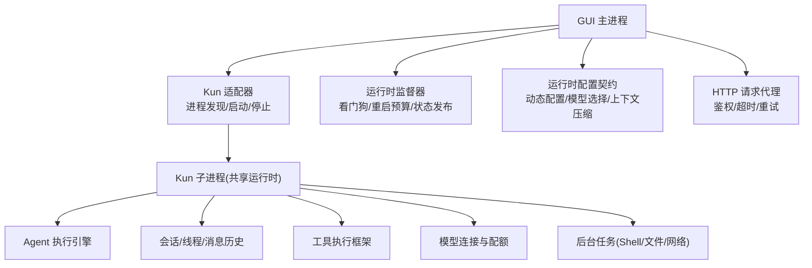
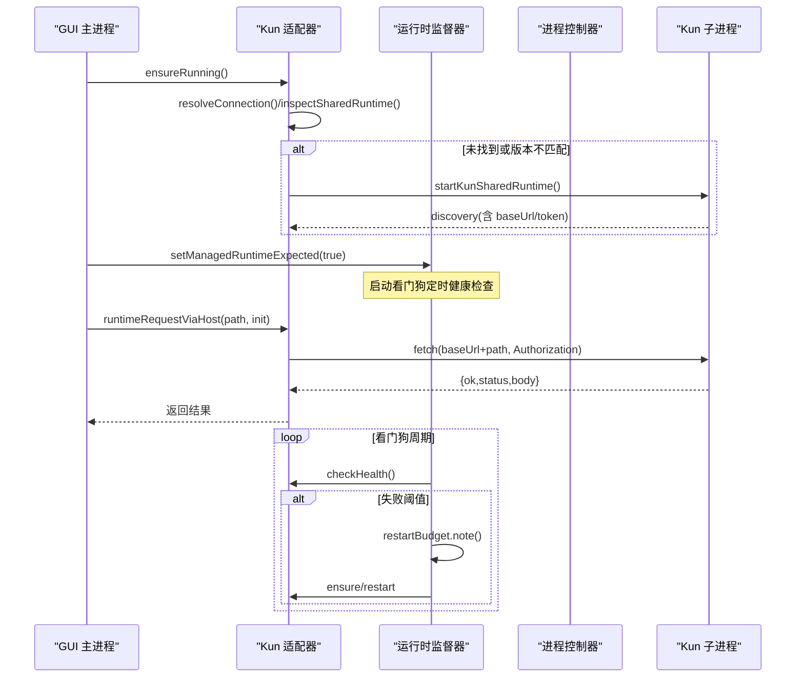
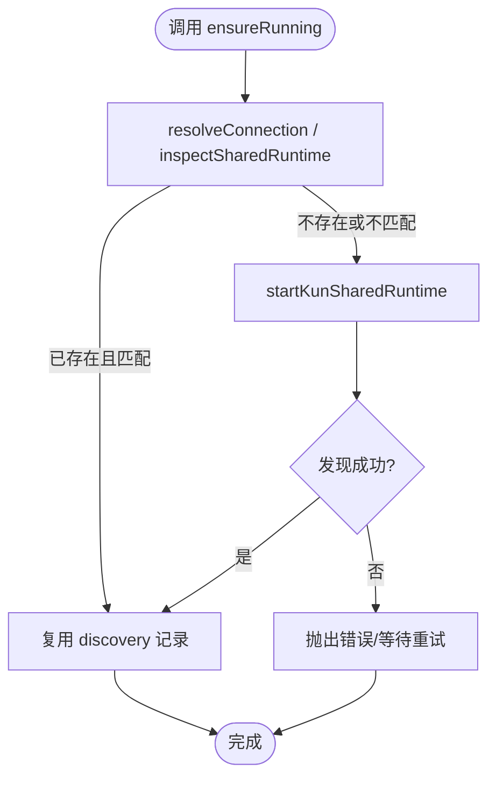
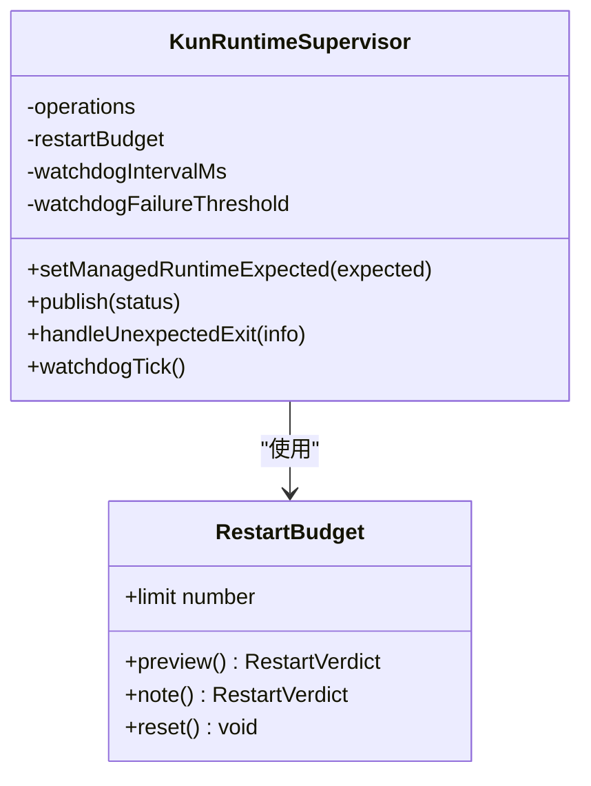
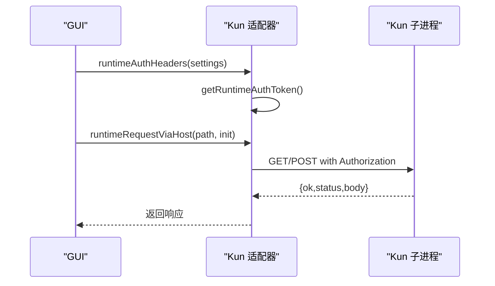
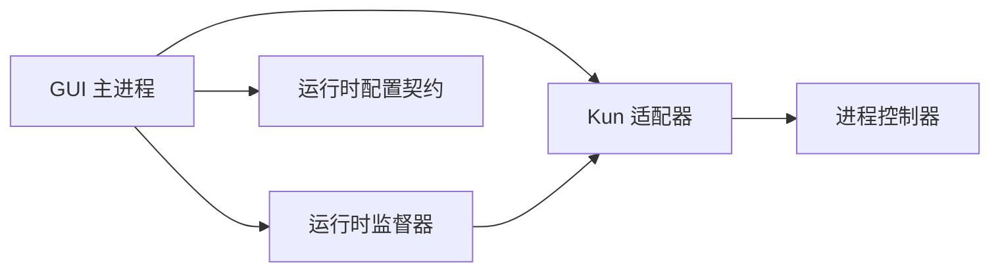

# 核心运行时

<cite>
**本文引用的文件**
- [claw-runtime.ts](file://src/main/claw-runtime.ts)
- [kun-runtime-supervisor.ts](file://src/main/kun-runtime-supervisor.ts)
- [kun-adapter.ts](file://src/main/runtime/kun-adapter.ts)
- [kun-process-controller.ts](file://src/main/runtime/kun-process-controller.ts)
- [runtime-config.ts](file://kun/src/contracts/runtime-config.ts)
</cite>

## 目录
1. [简介](#简介)
2. [项目结构](#项目结构)
3. [核心组件](#核心组件)
4. [架构总览](#架构总览)
5. [详细组件分析](#详细组件分析)
6. [依赖关系分析](#依赖关系分析)
7. [性能考虑](#性能考虑)
8. [故障排查指南](#故障排查指南)
9. [结论](#结论)
10. [附录](#附录)

## 简介
本文件面向 DeepSeek-GUI 的核心运行时，聚焦以下主题：Kun 运行时的启动流程、生命周期管理与进程监控；Agent 执行引擎的任务调度、工具调用与状态管理；会话管理的线程创建、消息历史、上下文压缩与持久化；模型连接管理（Provider 注册、认证处理、请求路由与配额控制）；工具执行框架（内置/自定义工具与权限控制）；后台任务管理（Shell、文件操作、网络请求）；运行时配置选项、环境变量与调试接口；以及常见使用场景与最佳实践。

## 项目结构
围绕“GUI 主进程 + Kun 子进程”的双进程架构：
- GUI 主进程负责：进程发现与启动、健康检查、崩溃恢复、运行时配置下发、HTTP 请求代理与鉴权、IM/工作流等上层能力编排。
- Kun 子进程提供：Agent 执行引擎、会话与线程、工具执行、模型连接与配额、后台任务等运行时能力。

图表来源
- [kun-adapter.ts:41-105](file://src/main/runtime/kun-adapter.ts#L41-L105)
- [kun-runtime-supervisor.ts:108-195](file://src/main/kun-runtime-supervisor.ts#L108-L195)
- [runtime-config.ts:33-58](file://kun/src/contracts/runtime-config.ts#L33-L58)

章节来源
- [kun-adapter.ts:41-105](file://src/main/runtime/kun-adapter.ts#L41-L105)
- [kun-runtime-supervisor.ts:108-195](file://src/main/kun-runtime-supervisor.ts#L108-L195)
- [runtime-config.ts:33-58](file://kun/src/contracts/runtime-config.ts#L33-L58)

## 核心组件
- 运行时适配器（kun-adapter）：负责解析可执行文件、发现/启动/停止共享运行时、构建鉴权头、统一 HTTP 请求代理与超时控制。
- 运行时监督器（kun-runtime-supervisor）：实现看门狗、崩溃恢复、重启预算与状态发布，确保运行时高可用。
- 进程控制器（kun-process-controller）：封装单例子进程的生命周期状态、意外退出上报与启动幂等。
- 运行时配置契约（runtime-config）：定义运行时动态配置项（服务、模型选择、上下文压缩、角色、能力、钩子、质量、实验室开关等）。

章节来源
- [kun-adapter.ts:41-105](file://src/main/runtime/kun-adapter.ts#L41-L105)
- [kun-runtime-supervisor.ts:108-195](file://src/main/kun-runtime-supervisor.ts#L108-L195)
- [kun-process-controller.ts:16-79](file://src/main/runtime/kun-process-controller.ts#L16-L79)
- [runtime-config.ts:33-58](file://kun/src/contracts/runtime-config.ts#L33-L58)

## 架构总览
下图展示从 GUI 到 Kun 的启动、请求与恢复路径，以及配置下发的关键节点。

图表来源
- [kun-adapter.ts:127-159](file://src/main/runtime/kun-adapter.ts#L127-L159)
- [kun-adapter.ts:243-300](file://src/main/runtime/kun-adapter.ts#L243-L300)
- [kun-runtime-supervisor.ts:220-276](file://src/main/kun-runtime-supervisor.ts#L220-L276)
- [kun-runtime-supervisor.ts:366-433](file://src/main/kun-runtime-supervisor.ts#L366-L433)

## 详细组件分析

### Kun 运行时启动流程与生命周期管理
- 启动入口：ensureRunning -> resolveConnection -> inspectSharedRuntime -> 必要时 startKunSharedRuntime。
- 连接快照：成功发现后缓存 discovery 记录（baseUrl、token、instanceId），后续请求通过 lease 固定身份。
- 停止与清理：stopAndWait 仅释放 GUI 本地状态；stopSharedAndWait 会停止共享运行时并清理端口。
- 进程控制器：统一管理子进程实例、意外退出上报、启动幂等与就绪标记。

图表来源
- [kun-adapter.ts:127-159](file://src/main/runtime/kun-adapter.ts#L127-L159)
- [kun-adapter.ts:60-105](file://src/main/runtime/kun-adapter.ts#L60-L105)
- [kun-process-controller.ts:16-79](file://src/main/runtime/kun-process-controller.ts#L16-L79)

章节来源
- [kun-adapter.ts:41-105](file://src/main/runtime/kun-adapter.ts#L41-L105)
- [kun-adapter.ts:127-159](file://src/main/runtime/kun-adapter.ts#L127-L159)
- [kun-process-controller.ts:16-79](file://src/main/runtime/kun-process-controller.ts#L16-L79)

### 进程监控与自动恢复（看门狗与重启预算）
- 看门狗：周期性健康探测，连续失败达到阈值触发恢复。
- 崩溃恢复：捕获意外退出，按重启预算指数退避尝试重启，失败则进入熔断暂停。
- 状态发布：将 running/restarting/crashed/failed 等状态推送给 GUI。

图表来源
- [kun-runtime-supervisor.ts:38-90](file://src/main/kun-runtime-supervisor.ts#L38-L90)
- [kun-runtime-supervisor.ts:108-195](file://src/main/kun-runtime-supervisor.ts#L108-L195)
- [kun-runtime-supervisor.ts:220-276](file://src/main/kun-runtime-supervisor.ts#L220-L276)
- [kun-runtime-supervisor.ts:366-433](file://src/main/kun-runtime-supervisor.ts#L366-L433)

章节来源
- [kun-runtime-supervisor.ts:38-90](file://src/main/kun-runtime-supervisor.ts#L38-L90)
- [kun-runtime-supervisor.ts:108-195](file://src/main/kun-runtime-supervisor.ts#L108-L195)
- [kun-runtime-supervisor.ts:220-276](file://src/main/kun-runtime-supervisor.ts#L220-L276)
- [kun-runtime-supervisor.ts:366-433](file://src/main/kun-runtime-supervisor.ts#L366-L433)

### Agent 执行引擎（任务调度、工具调用、状态管理）
- 任务调度：由 Kun 子进程内部调度器驱动，GUI 通过 HTTP 接口提交任务、轮询/订阅事件。
- 工具调用：Agent 在运行中按需调用工具（内置/自定义），工具执行结果回写至会话上下文。
- 状态管理：会话/线程状态、目标（goal）、Token 用量、缓存命中/未命中等指标对外暴露，供 IM/CLI 查询。

说明：上述能力由 Kun 子进程实现，GUI 通过适配器进行访问与转发。

章节来源
- [claw-runtime.ts:399-501](file://src/main/claw-runtime.ts#L399-L501)
- [claw-runtime.ts:657-702](file://src/main/claw-runtime.ts#L657-L702)

### 会话管理（线程创建、消息历史、上下文压缩、持久化）
- 线程创建：首次消息或显式命令触发新线程/话题。
- 消息历史：以线程为单位维护消息序列，支持列表最近会话与切换。
- 上下文压缩：运行时支持上下文压缩配置，减少长对话成本。
- 持久化存储：线程与消息落盘，保障重启后可恢复。

章节来源
- [claw-runtime.ts:657-702](file://src/main/claw-runtime.ts#L657-L702)
- [runtime-config.ts:33-58](file://kun/src/contracts/runtime-config.ts#L33-L58)

### 模型连接管理（Provider 注册、认证处理、请求路由、配额控制）
- Provider 注册：通过设置中的模型供应商与模型列表，GUI 侧解析可用文本模型。
- 认证处理：运行时令牌（runtimeToken）注入 Authorization 头，保证请求安全。
- 请求路由：适配器根据 discovery 记录的 baseUrl 路由到当前活跃实例。
- 配额控制：Token 经济、用量统计与费用估算可在运行时配置与查询。

图表来源
- [kun-adapter.ts:111-125](file://src/main/runtime/kun-adapter.ts#L111-L125)
- [kun-adapter.ts:243-300](file://src/main/runtime/kun-adapter.ts#L243-L300)

章节来源
- [kun-adapter.ts:111-125](file://src/main/runtime/kun-adapter.ts#L111-L125)
- [kun-adapter.ts:243-300](file://src/main/runtime/kun-adapter.ts#L243-L300)
- [runtime-config.ts:33-58](file://kun/src/contracts/runtime-config.ts#L33-L58)

### 工具执行框架（内置工具、自定义工具、权限控制）
- 内置工具：由 Kun 子进程提供，如文件、浏览器、计算机使用等。
- 自定义工具：通过扩展机制注册，GUI 侧可通过能力清单与搜索发现。
- 权限控制：工具调用受策略与审批门控约束，避免越权执行。

章节来源
- [claw-runtime.ts:399-501](file://src/main/claw-runtime.ts#L399-L501)

### 后台任务管理（Shell 执行、文件操作、网络请求）
- Shell 执行：异步执行命令，输出流式回传，支持超时与中断。
- 文件操作：读写工作区文件，配合沙箱与权限校验。
- 网络请求：受限出站访问，结合代理与白名单策略。

章节来源
- [claw-runtime.ts:399-501](file://src/main/claw-runtime.ts#L399-L501)

### 运行时配置与环境变量
- 动态配置：通过运行时配置接口下发 serve、models、modelSelection、contextCompaction、roles、capabilities、hooks、quality、lab 等。
- 环境变量：用于决定运行时风味（flavor）、数据目录、端口、令牌等。
- 调试接口：健康检查、事件订阅、日志与诊断端点便于排障。

章节来源
- [runtime-config.ts:33-58](file://kun/src/contracts/runtime-config.ts#L33-L58)

## 依赖关系分析
- GUI 主进程依赖 Kun 适配器进行进程与 HTTP 层抽象。
- 监督器依赖适配器提供的健康检查与重启能力。
- 进程控制器为单一子进程的状态容器，避免全局竞态。
- 运行时配置契约作为 GUI 与 Kun 之间的稳定边界。

图表来源
- [kun-adapter.ts:41-105](file://src/main/runtime/kun-adapter.ts#L41-L105)
- [kun-runtime-supervisor.ts:108-195](file://src/main/kun-runtime-supervisor.ts#L108-L195)
- [kun-process-controller.ts:16-79](file://src/main/runtime/kun-process-controller.ts#L16-L79)
- [runtime-config.ts:33-58](file://kun/src/contracts/runtime-config.ts#L33-L58)

章节来源
- [kun-adapter.ts:41-105](file://src/main/runtime/kun-adapter.ts#L41-L105)
- [kun-runtime-supervisor.ts:108-195](file://src/main/kun-runtime-supervisor.ts#L108-L195)
- [kun-process-controller.ts:16-79](file://src/main/runtime/kun-process-controller.ts#L16-L79)
- [runtime-config.ts:33-58](file://kun/src/contracts/runtime-config.ts#L33-L58)

## 性能考虑
- 请求超时与重试：GET/POST 默认超时不同，事件监听类请求延长等待上限，避免误判导致频繁重启。
- 健康检查节流：看门狗失败阈值与指数退避降低抖动影响。
- 连接快照：lease 固定 baseUrl/token，避免并发重启导致的鉴权漂移。
- 上下文压缩：长对话启用压缩以降低 Token 消耗与延迟。

[本节为通用指导，不直接分析具体文件]

## 故障排查指南
- 无法连接：检查 discover 记录是否有效、端口是否被占用、令牌是否正确。
- 频繁重启：查看看门狗失败次数与重启预算，确认是否存在持续崩溃。
- 请求超时：区分网络问题与运行时慢响应，必要时调整超时或扩容资源。
- 配置不生效：确认配置下发是否要求重启，或是否为热更新范围。

章节来源
- [kun-runtime-supervisor.ts:220-276](file://src/main/kun-runtime-supervisor.ts#L220-L276)
- [kun-runtime-supervisor.ts:366-433](file://src/main/kun-runtime-supervisor.ts#L366-L433)
- [kun-adapter.ts:243-300](file://src/main/runtime/kun-adapter.ts#L243-L300)

## 结论
DeepSeek-GUI 的核心运行时通过“GUI 主进程 + Kun 子进程”的解耦设计，实现了健壮的启动、监控与恢复机制；借助统一的适配器与配置契约，GUI 能够稳定地调度 Agent、管理会话与模型连接，并提供丰富的工具与后台任务能力。在生产环境中，建议合理配置看门狗与重启预算、启用上下文压缩与 Token 经济，并结合健康检查与日志进行持续观测。

[本节为总结性内容，不直接分析具体文件]

## 附录
- 常见使用场景
  - 启动并发送第一条消息：调用 ensureRunning 后发起 HTTP 请求创建线程与首轮对话。
  - 切换模型/供应商：通过运行时配置下发 modelSelection，或在上层设置中切换。
  - 查询会话用量：读取线程用量与缓存命中率，评估成本与性能。
  - 停止任务：向当前线程发送停止指令，中断正在运行的任务。
- 最佳实践
  - 始终使用 lease 发起非幂等请求，避免鉴权漂移。
  - 对长耗时任务设置合适的超时与取消信号。
  - 开启上下文压缩与 Token 经济，控制成本。
  - 定期观察看门狗与健康检查指标，及时定位异常。

[本节为概念性内容，不直接分析具体文件]