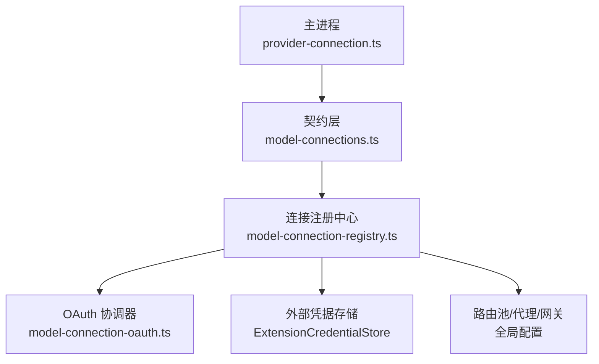
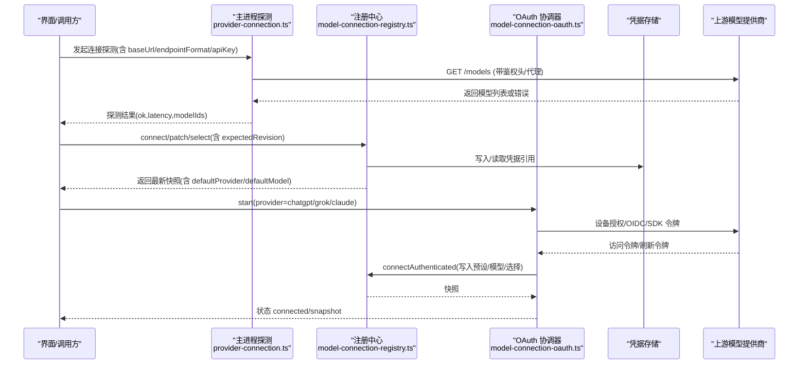
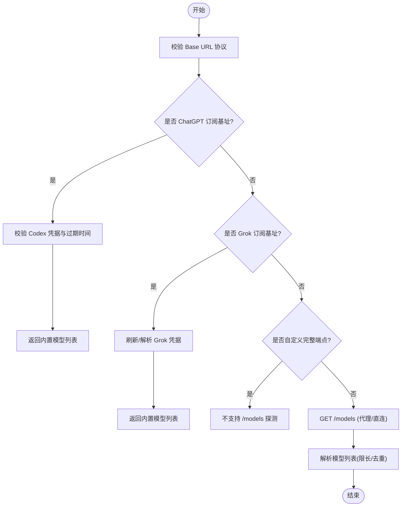
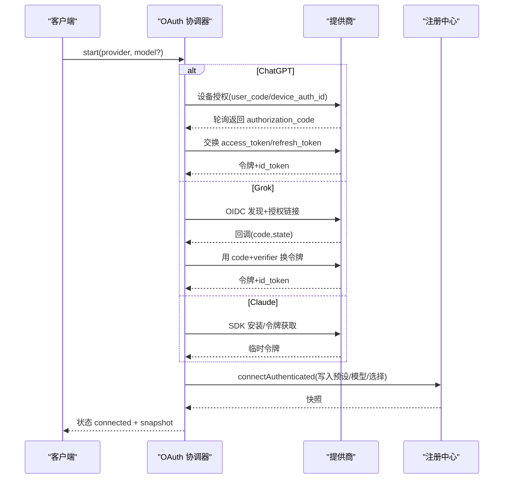
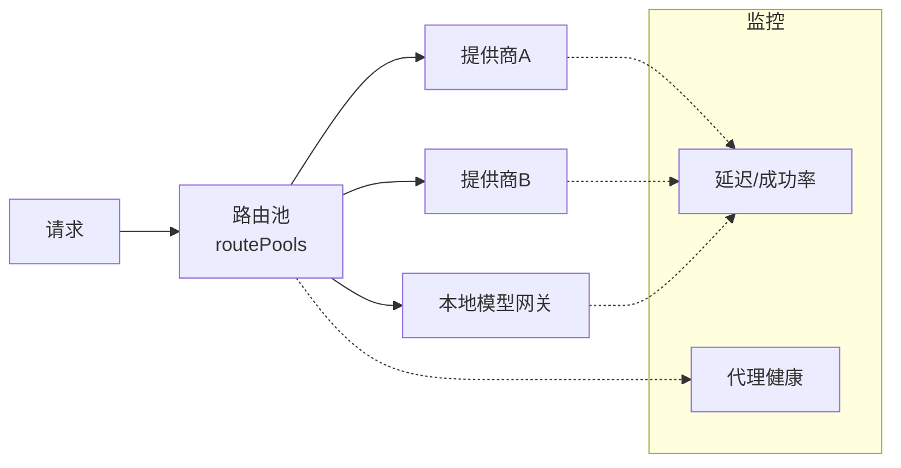
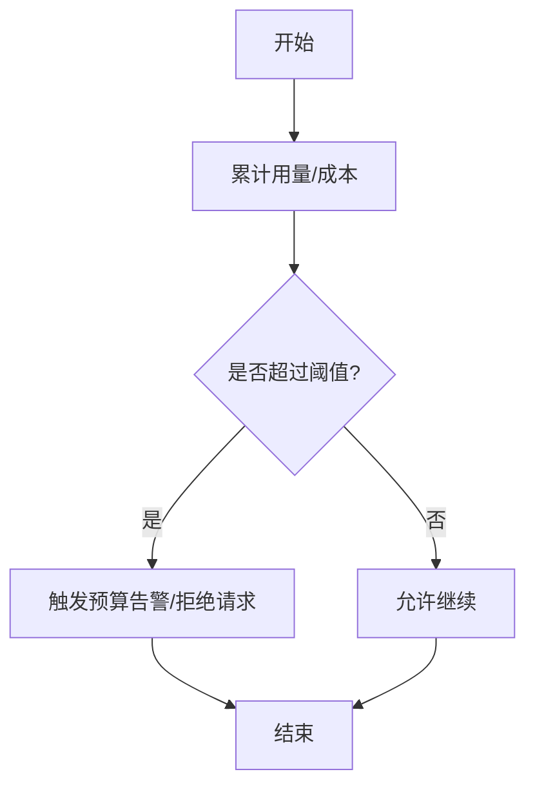
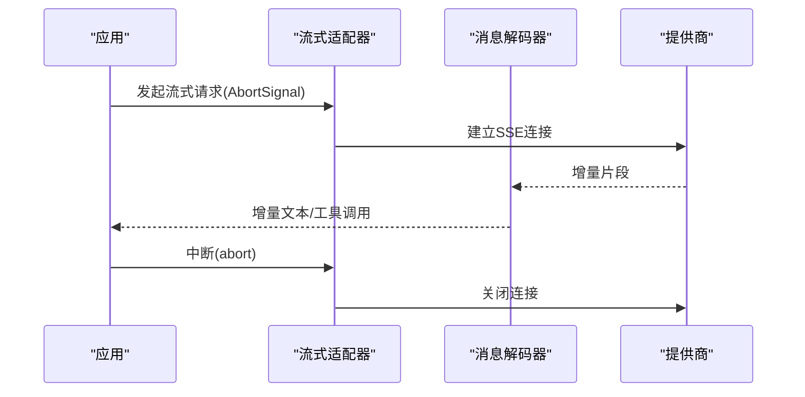
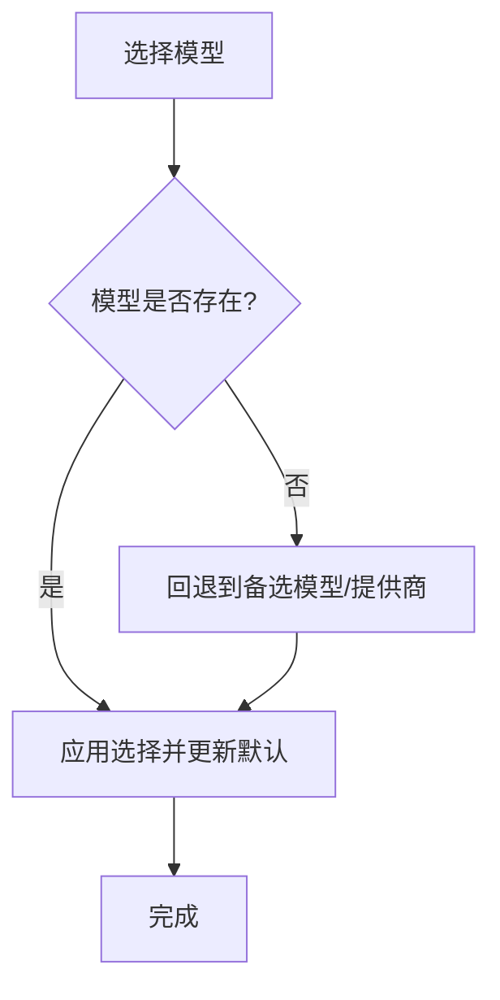
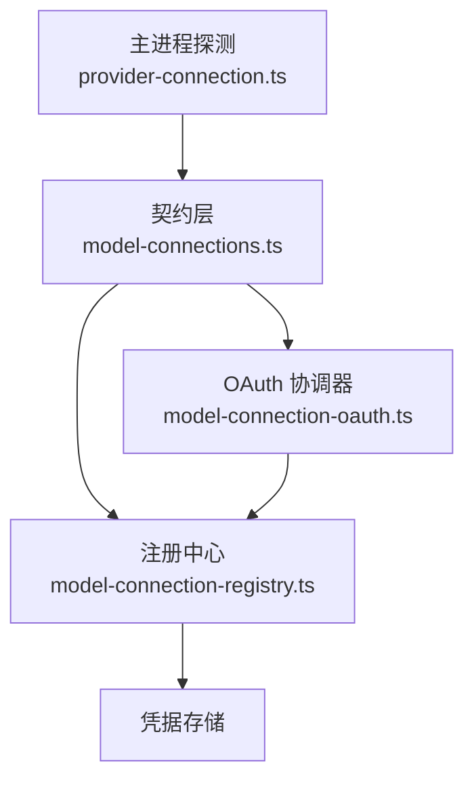

# 模型连接管理

<cite>
**本文引用的文件**
- [provider-connection.ts](file://src/main/provider-connection.ts)
- [model-connections.ts](file://kun/src/contracts/model-connections.ts)
- [model-connection-registry.ts](file://kun/src/services/model-connection-registry.ts)
- [model-connection-oauth.ts](file://kun/src/services/model-connection-oauth.ts)
</cite>

## 目录
1. [简介](#简介)
2. [项目结构](#项目结构)
3. [核心组件](#核心组件)
4. [架构总览](#架构总览)
5. [详细组件分析](#详细组件分析)
6. [依赖关系分析](#依赖关系分析)
7. [性能考虑](#性能考虑)
8. [故障排查指南](#故障排查指南)
9. [结论](#结论)
10. [附录](#附录)

## 简介
本文件面向 DeepSeek-GUI 的“模型连接管理系统”，聚焦以下能力：
- 模型提供商注册与发现：支持 HTTP、SDK、CLI 等多种接入方式，提供能力检测与版本兼容校验。
- 认证处理：涵盖 API Key、OAuth（ChatGPT/Grok/Claude）及令牌刷新流程。
- 请求路由策略：负载均衡、故障转移与可观测性监控（通过路由池与全局配置）。
- 配额控制：使用限制、成本计算与预算告警（通过配额服务与订阅配额）。
- 流式响应：SSE 连接、增量输出与中断处理（通过适配器与解码器）。
- 模型切换、降级与错误恢复：选择模型、回退策略与事务化凭据提交。
- 配置选项、监控接口与调试工具：快照、订阅变更、重试与诊断。

## 项目结构
围绕模型连接管理的核心代码分布在以下位置：
- 主进程探测与鉴权头构造：用于连通性探测与代理诊断。
- 契约定义：连接档案、快照、OAuth 会话等数据结构的强类型约束。
- 连接注册中心：原子化持久化、事务化凭据提交、默认选择与变更通知。
- OAuth 协调器：设备授权、回调交换、本地服务器与令牌生命周期管理。

**图表来源**
- [provider-connection.ts:52-153](file://src/main/provider-connection.ts#L52-L153)
- [model-connections.ts:25-167](file://kun/src/contracts/model-connections.ts#L25-L167)
- [model-connection-registry.ts:150-283](file://kun/src/services/model-connection-registry.ts#L150-L283)
- [model-connection-oauth.ts:56-120](file://kun/src/services/model-connection-oauth.ts#L56-L120)

**章节来源**
- [provider-connection.ts:52-153](file://src/main/provider-connection.ts#L52-L153)
- [model-connections.ts:25-167](file://kun/src/contracts/model-connections.ts#L25-L167)
- [model-connection-registry.ts:150-283](file://kun/src/services/model-connection-registry.ts#L150-L283)
- [model-connection-oauth.ts:56-120](file://kun/src/services/model-connection-oauth.ts#L56-L120)

## 核心组件
- 连接探测与鉴权头：负责为不同端点格式生成请求头（如 Anthropic version、Bearer），并执行 /models 探测，支持代理失败时的直连诊断。
- 契约与快照：以 Zod 严格校验连接档案、快照、OAuth 状态、CLI 认证等，保证跨进程通信的数据一致性。
- 连接注册中心：实现连接的创建、更新、删除、选择、凭据事务提交、默认提供者回退、变更订阅与版本冲突检测。
- OAuth 协调器：封装 ChatGPT 设备授权、Grok OIDC 回调、Claude SDK 令牌获取，并在成功后写入注册中心。

**章节来源**
- [provider-connection.ts:52-153](file://src/main/provider-connection.ts#L52-L153)
- [model-connections.ts:25-167](file://kun/src/contracts/model-connections.ts#L25-L167)
- [model-connection-registry.ts:150-283](file://kun/src/services/model-connection-registry.ts#L150-L283)
- [model-connection-oauth.ts:56-120](file://kun/src/services/model-connection-oauth.ts#L56-L120)

## 架构总览
系统采用“契约 + 注册中心 + 协调器”的分层设计：
- 契约层定义所有输入/输出的严格模式，避免运行时类型错误。
- 注册中心作为权威源，维护连接档案、默认选择、代理与路由池配置，并提供原子化更新与变更事件。
- OAuth 协调器在运行时完成第三方登录流程，并将结果安全地注入注册中心。
- 主进程探测模块负责连通性验证与代理诊断，确保连接可用后再暴露给上层。

**图表来源**
- [provider-connection.ts:71-153](file://src/main/provider-connection.ts#L71-L153)
- [model-connection-registry.ts:334-704](file://kun/src/services/model-connection-registry.ts#L334-L704)
- [model-connection-oauth.ts:66-120](file://kun/src/services/model-connection-oauth.ts#L66-L120)
- [model-connection-oauth.ts:137-284](file://kun/src/services/model-connection-oauth.ts#L137-L284)

## 详细组件分析

### 提供商注册与发现（能力检测与版本兼容）
- 端点格式与鉴权头：根据 endpointFormat 设置 Anthropic version 或 Bearer Token；对自定义完整端点模式禁用 /models 探测。
- 探测流程：优先通过配置的代理请求 /models，若失败则尝试直连判断是否可达，给出明确诊断信息。
- 模型解析：对 OpenAI 风格列表进行容错解析，限制响应大小与模型数量，过滤非法 ID。
- 特殊订阅：对 ChatGPT 与 Grok 订阅基地址进行识别，直接返回内置模型集合，跳过网络探测。

**图表来源**
- [provider-connection.ts:22-48](file://src/main/provider-connection.ts#L22-L48)
- [provider-connection.ts:71-153](file://src/main/provider-connection.ts#L71-L153)
- [provider-connection.ts:181-207](file://src/main/provider-connection.ts#L181-L207)

**章节来源**
- [provider-connection.ts:52-153](file://src/main/provider-connection.ts#L52-L153)
- [provider-connection.ts:181-207](file://src/main/provider-connection.ts#L181-L207)

### 认证处理流程（API Key、OAuth、令牌刷新）
- API Key：通过 providerProbeHeaders 注入 Authorization 或 x-api-key，随探测与后续请求发送。
- OAuth 流程：
  - ChatGPT：设备授权码流程，轮询换取授权码后交换令牌，提取账户标识与邮箱。
  - Grok：OIDC 发现，启动本地回调服务器接收 code，使用 PKCE 交换令牌。
  - Claude：通过本地 SDK 安装与 token 获取，完成后写入注册中心。
- 令牌刷新：OAuth 协调器在 status 轮询中检查凭据有效性，必要时刷新并 commit。
- 凭据安全：凭据不穿越 HTTP 边界，仅在运行时内存与受控存储间流转。

**图表来源**
- [model-connection-oauth.ts:66-120](file://kun/src/services/model-connection-oauth.ts#L66-L120)
- [model-connection-oauth.ts:137-284](file://kun/src/services/model-connection-oauth.ts#L137-L284)
- [model-connection-registry.ts:343-524](file://kun/src/services/model-connection-registry.ts#L343-L524)

**章节来源**
- [model-connection-oauth.ts:66-120](file://kun/src/services/model-connection-oauth.ts#L66-L120)
- [model-connection-oauth.ts:137-284](file://kun/src/services/model-connection-oauth.ts#L137-L284)
- [model-connection-registry.ts:343-524](file://kun/src/services/model-connection-registry.ts#L343-L524)

### 请求路由策略（负载均衡、故障转移、性能监控）
- 路由池与代理：注册中心快照包含 routePools 与 proxy 配置，供上层调度器按策略分发请求。
- 故障转移：当某提供商不可用时，注册中心可在 patch 时自动回退到下一个可用的默认提供者。
- 性能监控：探测阶段记录 latencyMs，结合路由池权重与超时策略，实现动态调优。
- 本地模型网关：可通过 localModelGateway 将本地推理服务纳入统一路由。

**图表来源**
- [model-connections.ts:49-59](file://kun/src/contracts/model-connections.ts#L49-L59)
- [model-connection-registry.ts:193-283](file://kun/src/services/model-connection-registry.ts#L193-L283)

**章节来源**
- [model-connections.ts:49-59](file://kun/src/contracts/model-connections.ts#L49-L59)
- [model-connection-registry.ts:193-283](file://kun/src/services/model-connection-registry.ts#L193-L283)

### 配额控制机制（使用限制、成本计算、预算告警）
- 配额服务：通过 provider-quota-service 与 subscription quota 跟踪用量与成本。
- 预算告警：当接近阈值时触发告警，阻止超支请求。
- 集成点：注册中心快照中的 selectedModel 与 provider 信息用于配额统计维度。

[本节为概念性说明，未直接分析具体文件]

### 流式响应处理（SSE、增量输出、中断）
- 适配器与解码器：通过 chat-completions-stream-decoder 与 anthropic-messages-stream-decoder 解析流式片段。
- SSE 连接：保持长连接，增量推送文本与工具调用。
- 中断处理：基于 AbortSignal 取消流读取与资源释放。

[本节为概念性说明，未直接分析具体文件]

### 模型切换逻辑、降级策略与错误恢复
- 模型切换：select 接口更新 selectedModel，注册中心校验模型存在性并更新默认值。
- 降级策略：当所选模型不可用时，自动回退到同一提供商的其他可用模型或切换到其他提供商。
- 错误恢复：凭据事务采用 fence/prepare/commit 三阶段，失败时清理中间态并回滚。

**图表来源**
- [model-connection-registry.ts:706-775](file://kun/src/services/model-connection-registry.ts#L706-L775)

**章节来源**
- [model-connection-registry.ts:706-775](file://kun/src/services/model-connection-registry.ts#L706-L775)

### 配置选项、监控接口与调试工具
- 配置项：
  - 代理：enabled/url
  - 路由池：数组形式的策略配置
  - 本地模型网关：enabled
  - 默认提供者/账号/模型：defaultProviderId/defaultAccountId/defaultModel
- 监控接口：
  - snapshot：获取当前连接快照
  - subscribe/waitForRevision：监听变更与等待特定版本
- 调试工具：
  - 探测诊断：区分代理失败与直连可达
  - 凭据事务：fence/prepare/commit 状态追踪

**章节来源**
- [model-connections.ts:49-59](file://kun/src/contracts/model-connections.ts#L49-L59)
- [model-connection-registry.ts:285-332](file://kun/src/services/model-connection-registry.ts#L285-L332)
- [provider-connection.ts:155-179](file://src/main/provider-connection.ts#L155-L179)

## 依赖关系分析
- 契约层被注册中心与 OAuth 协调器共同依赖，确保数据结构一致。
- 注册中心依赖凭据存储与可选的模型能力查询函数，用于构建 ServeProviderConfig。
- OAuth 协调器依赖注册中心的 connectAuthenticated 写入预设与模型。
- 主进程探测模块依赖共享设置与代理解析，提供连通性反馈。

**图表来源**
- [model-connections.ts:25-167](file://kun/src/contracts/model-connections.ts#L25-L167)
- [model-connection-registry.ts:150-283](file://kun/src/services/model-connection-registry.ts#L150-L283)
- [model-connection-oauth.ts:56-120](file://kun/src/services/model-connection-oauth.ts#L56-L120)
- [provider-connection.ts:52-153](file://src/main/provider-connection.ts#L52-L153)

**章节来源**
- [model-connections.ts:25-167](file://kun/src/contracts/model-connections.ts#L25-L167)
- [model-connection-registry.ts:150-283](file://kun/src/services/model-connection-registry.ts#L150-L283)
- [model-connection-oauth.ts:56-120](file://kun/src/services/model-connection-oauth.ts#L56-L120)
- [provider-connection.ts:52-153](file://src/main/provider-connection.ts#L52-L153)

## 性能考虑
- 探测限流与超时：/models 响应体限制与超时保护，避免大响应阻塞。
- 代理诊断优化：代理失败后仅进行短超时直连探测，快速定位问题。
- 路由池权重：按提供商健康度动态调整流量分配。
- 流式缓冲：解码器按需消费，减少内存占用。

[本节为通用指导，未直接分析具体文件]

## 故障排查指南
- 连接不可达：查看探测返回的 message，确认是否为代理失败或直连可达。
- OAuth 失败：检查 session 状态与错误信息，确认回调端口绑定与 state 匹配。
- 凭据事务冲突：遇到 ModelConnectionConflictError 时，重新获取 expectedRevision 并重试。
- 模型选择无效：确保 selectedModel 存在于 models 列表中，否则会被拒绝。

**章节来源**
- [provider-connection.ts:155-179](file://src/main/provider-connection.ts#L155-L179)
- [model-connection-oauth.ts:75-105](file://kun/src/services/model-connection-oauth.ts#L75-L105)
- [model-connection-registry.ts:135-140](file://kun/src/services/model-connection-registry.ts#L135-L140)
- [model-connection-registry.ts:534-541](file://kun/src/services/model-connection-registry.ts#L534-L541)

## 结论
DeepSeek-GUI 的模型连接管理系统通过严格的契约定义、原子化的注册中心与健壮的 OAuth 协调器，实现了多提供商的统一接入、安全认证与高可用路由。配合探测诊断、配额控制与流式适配，能够满足复杂场景下的稳定性与性能需求。

[本节为总结性内容，未直接分析具体文件]

## 附录
- 关键数据类型：
  - 连接档案：kind/authType/baseUrl/endpointFormat/models/selectedModel
  - 快照：providers/proxy/routePools/localModelGateway/default*
  - OAuth 状态：sessionId/provider/status/url/userCode/interval/expiresAt/message/snapshot
- 常用操作：
  - connect/patch/select：创建/修改/选择连接
  - fence/prepare/commit：凭据事务三阶段
  - start/status/submit/cancel：OAuth 会话管理

**章节来源**
- [model-connections.ts:25-167](file://kun/src/contracts/model-connections.ts#L25-L167)
- [model-connection-registry.ts:777-800](file://kun/src/services/model-connection-registry.ts#L777-L800)
- [model-connection-oauth.ts:66-120](file://kun/src/services/model-connection-oauth.ts#L66-L120)