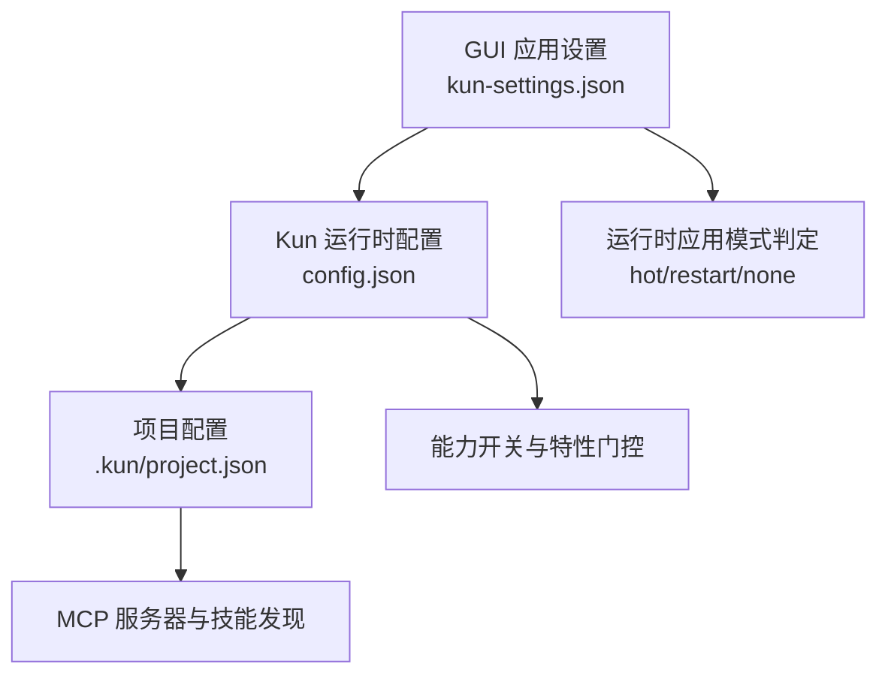
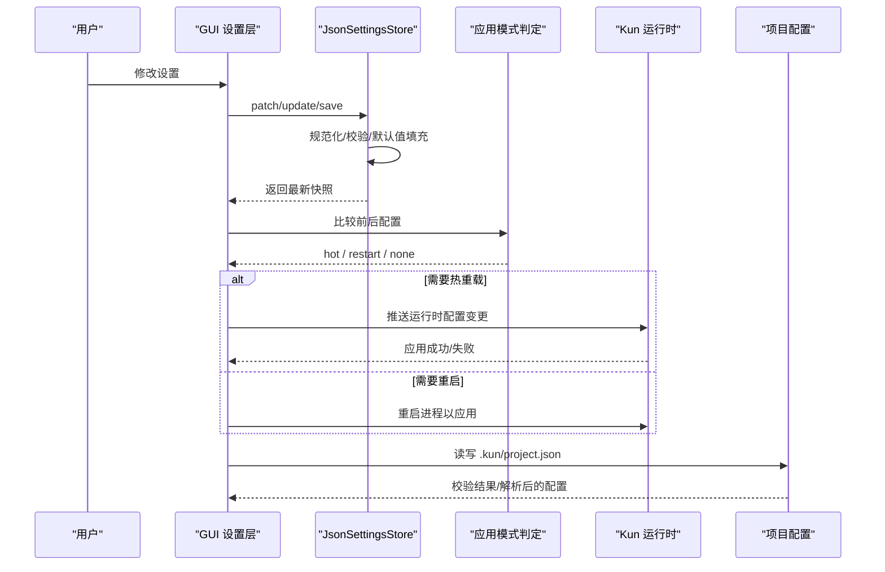
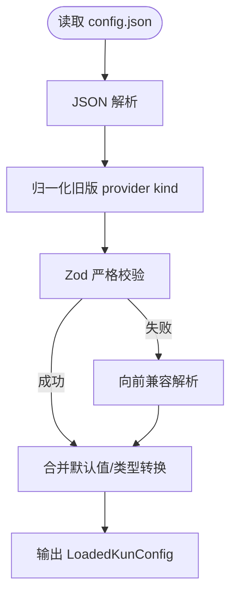
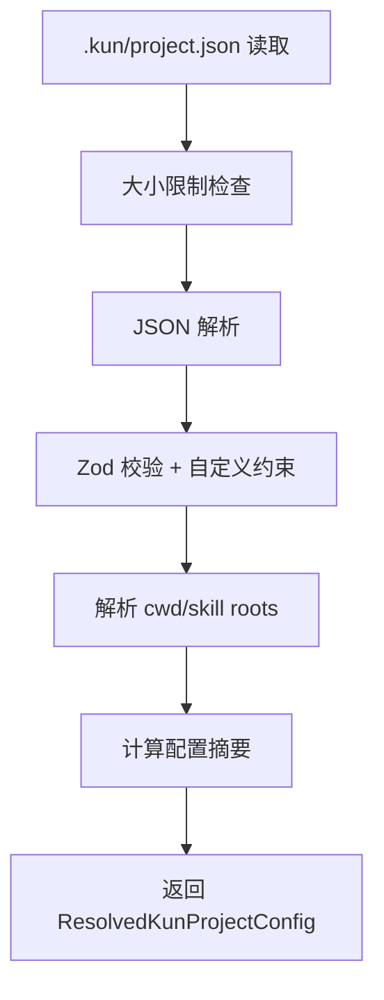
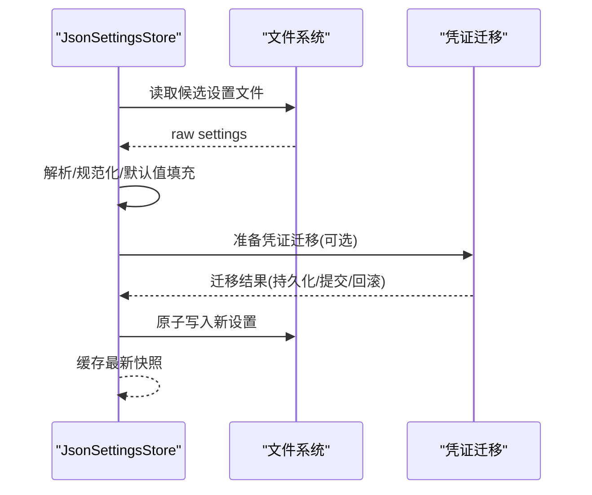
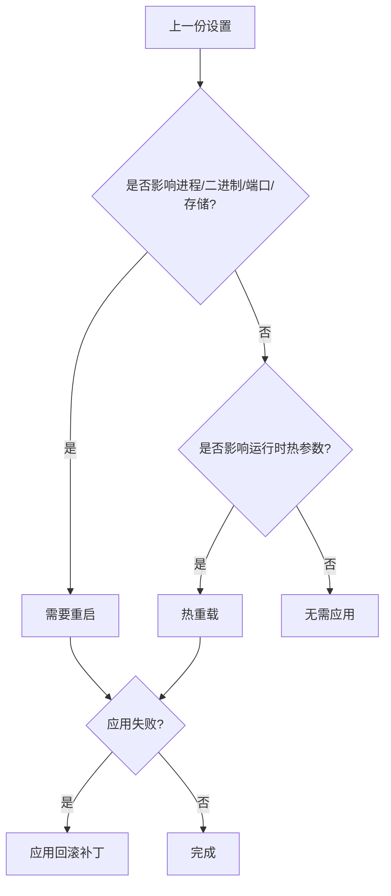
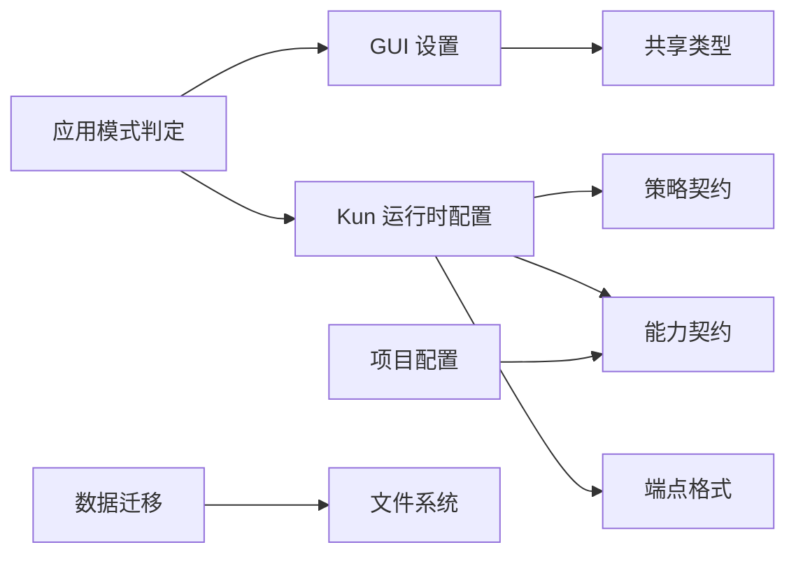

# 运行时配置

<cite>
**本文引用的文件**
- [kun-config.ts](file://kun/src/config/kun-config.ts)
- [project-config.ts](file://kun/src/config/project-config.ts)
- [config.example.json](file://kun/config.example.json)
- [settings-store.ts](file://src/main/settings-store.ts)
- [settings-file-paths.ts](file://src/main/settings-file-paths.ts)
- [runtime-settings-apply-mode.ts](file://src/main/runtime-settings-apply-mode.ts)
- [legacy-data-migration.ts](file://src/main/legacy-data-migration.ts)
- [app-settings-types.ts](file://src/shared/app-settings-types.ts)
</cite>

## 目录
1. [简介](#简介)
2. [项目结构](#项目结构)
3. [核心组件](#核心组件)
4. [架构总览](#架构总览)
5. [详细组件分析](#详细组件分析)
6. [依赖关系分析](#依赖关系分析)
7. [性能考量](#性能考量)
8. [故障排查指南](#故障排查指南)
9. [结论](#结论)
10. [附录](#附录)

## 简介
本文件面向 DeepSeek-GUI 的“运行时配置系统”，系统性说明配置的层次结构与优先级、校验与默认值填充机制、动态更新（热重载/重启）策略、安全敏感配置处理、能力开关与灰度发布、以及配置迁移与版本兼容。文档同时提供模板、示例与最佳实践，帮助开发者与运维人员正确配置并维护运行时的稳定性与安全性。

## 项目结构
运行时配置由三层组成：
- 全局运行时配置（Kun 运行时）：位于用户数据目录中的配置文件，定义服务端口、模型、能力、存储等。
- 项目级配置：位于工作区 .kun/project.json，声明 MCP 服务器、技能根目录等与项目相关的运行时行为。
- GUI 应用设置：位于用户数据目录的 kun-settings.json，管理 UI、代理、调度、工作区路径等。

图表来源
- [settings-store.ts:470-782](file://src/main/settings-store.ts#L470-L782)
- [kun-config.ts:677-690](file://kun/src/config/kun-config.ts#L677-L690)
- [project-config.ts:98-129](file://kun/src/config/project-config.ts#L98-L129)
- [runtime-settings-apply-mode.ts:154-158](file://src/main/runtime-settings-apply-mode.ts#L154-L158)

章节来源
- [settings-store.ts:470-782](file://src/main/settings-store.ts#L470-L782)
- [kun-config.ts:677-690](file://kun/src/config/kun-config.ts#L677-L690)
- [project-config.ts:98-129](file://kun/src/config/project-config.ts#L98-L129)
- [runtime-settings-apply-mode.ts:154-158](file://src/main/runtime-settings-apply-mode.ts#L154-L158)

## 核心组件
- Kun 运行时配置加载与校验：使用 Zod Schema 对 config.json 进行严格校验、类型转换、默认值填充与向前兼容解析。
- 项目配置加载与校验：对 .kun/project.json 进行大小限制、相对路径约束、MCP 服务器 URL/命令校验与安全边界检查。
- GUI 应用设置持久化：原子写入、兼容性读取、旧版迁移、凭证保护与回滚。
- 运行时应用模式判定：根据配置变更决定热重载或进程重启。
- 历史数据迁移：将旧版数据目录迁移至新命名并保持可回滚。

章节来源
- [kun-config.ts:709-731](file://kun/src/config/kun-config.ts#L709-L731)
- [project-config.ts:178-219](file://kun/src/config/project-config.ts#L178-L219)
- [settings-store.ts:470-782](file://src/main/settings-store.ts#L470-L782)
- [runtime-settings-apply-mode.ts:154-158](file://src/main/runtime-settings-apply-mode.ts#L154-L158)
- [legacy-data-migration.ts:150-200](file://src/main/legacy-data-migration.ts#L150-L200)

## 架构总览
下图展示了从 GUI 设置到 Kun 运行时再到项目配置的完整链路，包括校验、默认值填充、动态应用模式判定与迁移流程。

图表来源
- [settings-store.ts:470-782](file://src/main/settings-store.ts#L470-L782)
- [runtime-settings-apply-mode.ts:154-158](file://src/main/runtime-settings-apply-mode.ts#L154-L158)
- [kun-config.ts:709-731](file://kun/src/config/kun-config.ts#L709-L731)
- [project-config.ts:178-219](file://kun/src/config/project-config.ts#L178-L219)

## 详细组件分析

### 全局运行时配置（Kun 运行时）
- 配置文件位置与名称：用户数据目录下的 config.json。
- 加载与校验：
  - 读取 JSON 后通过 KunConfigSchema 进行严格校验，支持字段白名单与自定义约束。
  - 对已知旧版 provider kind 做归一化迁移，保证向后兼容。
  - 对未知能力片段采用“向前兼容”策略：仅保留能解析的部分，其余回退到默认。
- 默认值与类型转换：
  - 大量字段具备默认值（如 storage.backend、graph.enabled、roles、lab 等）。
  - 使用预处理函数进行类型转换（如 endpointFormat 标准化）。
- 关键子模块：
  - serve：主机、端口、数据目录、认证、重试策略、存储后端、可观测性、多提供者路由。
  - models：模型别名、上下文窗口、模态、工具调用支持、推理能力。
  - contextCompaction：摘要阈值、模式、超时、输入限制。
  - runtime：流空闲超时、工具风暴防护、turn 限制、调试捕获、参数修复。
  - graph：图模式开关、策略、回滚阶段、调度器、邮箱、监督、写隔离、路由、学习、保留策略。
  - roles：小模型、标题、摘要、代码审查等角色模型与推理深度。
  - capabilities：MCP、Web、Skills、Subagents、Attachments、Memory、ComputerUse 等能力开关与参数。
  - lab：实验性功能（如 exploreAgent）开关与模型覆盖。
  - hooks、quality：钩子与质量检查器配置。

图表来源
- [kun-config.ts:709-731](file://kun/src/config/kun-config.ts#L709-L731)
- [kun-config.ts:739-757](file://kun/src/config/kun-config.ts#L739-L757)
- [kun-config.ts:789-800](file://kun/src/config/kun-config.ts#L789-L800)

章节来源
- [kun-config.ts:709-731](file://kun/src/config/kun-config.ts#L709-L731)
- [kun-config.ts:739-757](file://kun/src/config/kun-config.ts#L739-L757)
- [kun-config.ts:789-800](file://kun/src/config/kun-config.ts#L789-L800)
- [config.example.json:1-124](file://kun/config.example.json#L1-L124)

### 项目配置（.kun/project.json）
- 位置与版本：工作区根目录下 .kun/project.json，固定版本号用于兼容性控制。
- 校验与约束：
  - 文件大小上限、相对路径约束、MCP 服务器 transport/url/command 互斥校验。
  - URL 必须为 http/https，cwd 仅限 stdio 传输。
  - 技能根目录必须在工作区内且存在。
- 解析与产物：
  - 解析出 mcp.servers（含 cwd）、skills（启用状态、包含约定目录、根目录列表、禁用 ID）。
  - 生成 digest 用于变更检测。
- 写入安全：
  - 原子写入临时文件后重命名，避免部分写入导致损坏。
  - 禁止符号链接与越界路径。

图表来源
- [project-config.ts:178-219](file://kun/src/config/project-config.ts#L178-L219)
- [project-config.ts:319-349](file://kun/src/config/project-config.ts#L319-L349)

章节来源
- [project-config.ts:98-129](file://kun/src/config/project-config.ts#L98-L129)
- [project-config.ts:178-219](file://kun/src/config/project-config.ts#L178-L219)
- [project-config.ts:319-349](file://kun/src/config/project-config.ts#L319-L349)

### GUI 应用设置（kun-settings.json）
- 文件定位与兼容读取：
  - 当前文件名 kun-settings.json，兼容 deepseek-gui-settings.json。
  - 按顺序尝试多个候选路径，确保跨版本迁移平滑。
- 加载与规范化：
  - 解析 JSON，若无效则备份并恢复默认设置。
  - 规范化路径（~ 展开）、工作区根、对话工作区、Write 工作区、Claw 通道工作区。
  - 自动创建受管工作区目录与欢迎文件。
- 凭证迁移与保护：
  - 检测到明文凭证时，创建预迁移备份，执行迁移并提交标记。
  - 在不可用情况下拒绝写入明文凭证，保障安全。
- 原子写入与并发安全：
  - 使用原子写入与修订号冲突重试，避免并发写入破坏。
- 补丁合并：
  - 针对 agents.kun、provider、log、checkpointCleanup、notifications、appBehavior、keyboardShortcuts、write、claw、schedule、workflow、design、terminal、guiUpdate 等分区进行增量合并。

图表来源
- [settings-store.ts:470-782](file://src/main/settings-store.ts#L470-L782)
- [settings-file-paths.ts:1-27](file://src/main/settings-file-paths.ts#L1-L27)

章节来源
- [settings-store.ts:470-782](file://src/main/settings-store.ts#L470-L782)
- [settings-file-paths.ts:1-27](file://src/main/settings-file-paths.ts#L1-L27)

### 动态配置更新（热重载与重启）
- 应用模式判定：
  - 如果影响二进制路径、端口、自动启动、数据目录、存储后端、不安全模式、浏览器/计算机使用等，则需重启。
  - 如果只是运行时可调参数（如代理、路由池、本地网关、MCP 设置），则走热重载。
  - 否则无需应用。
- 回滚机制：
  - 当新配置应用失败时，构造回滚补丁恢复到上一个可用快照。
  - 根据最终状态生成诊断信息，便于定位问题。

图表来源
- [runtime-settings-apply-mode.ts:154-158](file://src/main/runtime-settings-apply-mode.ts#L154-L158)
- [runtime-settings-apply-mode.ts:160-183](file://src/main/runtime-settings-apply-mode.ts#L160-L183)
- [runtime-settings-apply-mode.ts:15-40](file://src/main/runtime-settings-apply-mode.ts#L15-L40)

章节来源
- [runtime-settings-apply-mode.ts:154-158](file://src/main/runtime-settings-apply-mode.ts#L154-L158)
- [runtime-settings-apply-mode.ts:160-183](file://src/main/runtime-settings-apply-mode.ts#L160-L183)
- [runtime-settings-apply-mode.ts:15-40](file://src/main/runtime-settings-apply-mode.ts#L15-L40)

### 安全敏感配置
- 密钥管理：
  - 支持 API Key、OAuth、订阅等多种认证方式；可通过 providerId 选择不同提供者。
  - 支持 headers 注入，适配需要额外头部的提供商。
- 加密存储与访问控制：
  - GUI 设置层在检测到明文凭证时触发迁移，将敏感信息移至受保护存储。
  - 若受保护存储不可用，拒绝写入明文凭证，防止泄露。
- 最小权限与沙箱：
  - 运行时支持 sandboxMode、approvalPolicy、approvalReviewer，限制工具调用范围与审批策略。
  - 项目配置中 MCP server 的 cwd 与 URL 受到严格校验，防止越权访问。

章节来源
- [kun-config.ts:564-607](file://kun/src/config/kun-config.ts#L564-L607)
- [settings-store.ts:548-596](file://src/main/settings-store.ts#L548-L596)
- [project-config.ts:55-95](file://kun/src/config/project-config.ts#L55-L95)

### 能力开关与灰度发布
- 能力开关：
  - capabilities.mcp/web/skills/subagents/attachments/memory/computerUse 等均可独立启用/禁用，并附带细粒度参数。
- 灰度发布：
  - graph.rolloutStage 支持 experimental/alpha/beta/learning-preview/stable，逐步放开图模式能力。
  - lab.exploreAgent 作为实验功能开关，可覆盖子模型与推理强度。
- 模型与服务分级：
  - 模型 profile 支持 serviceTiers（priority/flex），结合 provider 能力实现差异化路由。

章节来源
- [kun-config.ts:249-342](file://kun/src/config/kun-config.ts#L249-L342)
- [kun-config.ts:646-675](file://kun/src/config/kun-config.ts#L646-L675)
- [config.example.json:67-121](file://kun/config.example.json#L67-L121)

### 配置迁移工具、版本兼容性与回滚
- 历史数据迁移：
  - 将旧版 userData 目录名迁移为新命名，并在旧路径创建符号链接以保持兼容。
  - 家目录数据按映射表迁移，保留用户手工放置内容，仅在安全时可重写设置中的路径。
- 设置文件兼容：
  - 支持读取 legacy 文件名与兼容目录，确保升级过程不中断。
  - 对无效设置进行备份并恢复默认，避免启动失败。
- 回滚机制：
  - 凭证迁移提供 rollback 与 commit 接口，失败时回滚到之前状态。
  - 运行时应用失败时，构造回滚补丁恢复上一个可用快照。

章节来源
- [legacy-data-migration.ts:150-200](file://src/main/legacy-data-migration.ts#L150-L200)
- [settings-store.ts:343-397](file://src/main/settings-store.ts#L343-L397)
- [settings-store.ts:548-596](file://src/main/settings-store.ts#L548-L596)
- [runtime-settings-apply-mode.ts:15-40](file://src/main/runtime-settings-apply-mode.ts#L15-L40)

## 依赖关系分析
- 配置层依赖：
  - Kun 运行时配置依赖 contracts/policy、capabilities、model-endpoint-format、tool-output-limits、hooks 等契约与能力定义。
  - 项目配置依赖 capabilities 中的 MCP OAuth 与传输类型。
  - GUI 设置依赖 shared 类型定义与默认值合并逻辑。
- 运行时依赖：
  - 应用模式判定依赖 GUI 设置与 Kun 运行时设置的差异比较。
  - 迁移依赖文件系统操作与 Electron 用户数据目录结构。

图表来源
- [kun-config.ts:677-690](file://kun/src/config/kun-config.ts#L677-L690)
- [project-config.ts:98-129](file://kun/src/config/project-config.ts#L98-L129)
- [runtime-settings-apply-mode.ts:154-158](file://src/main/runtime-settings-apply-mode.ts#L154-L158)
- [legacy-data-migration.ts:150-200](file://src/main/legacy-data-migration.ts#L150-L200)

章节来源
- [kun-config.ts:677-690](file://kun/src/config/kun-config.ts#L677-L690)
- [project-config.ts:98-129](file://kun/src/config/project-config.ts#L98-L129)
- [runtime-settings-apply-mode.ts:154-158](file://src/main/runtime-settings-apply-mode.ts#L154-L158)
- [legacy-data-migration.ts:150-200](file://src/main/legacy-data-migration.ts#L150-L200)

## 性能考量
- 配置加载与校验：
  - 使用 Zod 严格模式减少运行时错误，提升启动稳定性。
  - 项目配置限制文件大小与条目数量，避免过大配置影响解析性能。
- 原子写入与并发：
  - GUI 设置使用原子写入与修订号冲突重试，降低并发写入导致的竞争条件。
- 热重载 vs 重启：
  - 尽可能通过热重载减少进程重启开销；必要时重启以保证一致性。
- 迁移与回滚：
  - 迁移过程尽量轻量，失败时快速回退，避免长时间阻塞启动。

[本节为通用指导，不直接分析具体文件]

## 故障排查指南
- 配置解析失败：
  - 检查 config.json 与 project.json 的 JSON 语法与字段类型。
  - 查看日志中关于“无效配置”的详细信息，定位具体路径与问题。
- 凭证迁移失败：
  - 确认受保护存储可用；若不可用，避免写入明文凭证。
  - 检查预迁移备份是否存在，必要时手动恢复。
- 热重载未生效：
  - 确认变更是否属于热重载范围；若涉及二进制/端口/存储等，需重启。
  - 查看应用模式判定结果，确认是否为 hot/restart/none。
- 项目配置越权：
  - 检查 MCP server 的 transport/url/command 是否符合约束。
  - 确保 cwd 与工作区路径在同一目录内。

章节来源
- [settings-store.ts:514-528](file://src/main/settings-store.ts#L514-L528)
- [settings-store.ts:548-596](file://src/main/settings-store.ts#L548-L596)
- [runtime-settings-apply-mode.ts:154-158](file://src/main/runtime-settings-apply-mode.ts#L154-L158)
- [project-config.ts:55-95](file://kun/src/config/project-config.ts#L55-L95)

## 结论
DeepSeek-GUI 的运行时配置系统通过严格的 Schema 校验、默认值填充、类型转换与向前兼容策略，确保了配置的正确性与稳定性。GUI 设置层提供了安全的凭证迁移与原子写入机制，项目配置层保障了 MCP 与技能的边界安全。动态更新机制区分热重载与重启，兼顾灵活性与一致性。能力开关与灰度发布支持渐进式特性开放。整体架构清晰、可扩展、可回滚，适合生产环境使用。

[本节为总结，不直接分析具体文件]

## 附录

### 配置模板与示例
- 全局运行时配置示例：参考 config.example.json，包含 serve、contextCompaction、models、capabilities、hooks 等典型配置项。
- 项目配置示例：参考 examples/extensions/*/kun-extension.json 或 docs/examples/kun-project.json（如有），展示 MCP 服务器与技能根目录的配置方式。

章节来源
- [config.example.json:1-124](file://kun/config.example.json#L1-L124)

### 最佳实践建议
- 使用最小权限原则：合理设置 approvalPolicy、sandboxMode，限制工具调用范围。
- 分阶段开启能力：通过 capabilities 与 rolloutStage 逐步放开新功能。
- 保持配置简洁：避免过大的项目配置与过多 MCP 服务器。
- 定期审计凭证：确保敏感信息存储在受保护区域，避免明文留存。
- 监控与可观测性：启用 observability 输出，结合日志与指标排查问题。

[本节为通用指导，不直接分析具体文件]