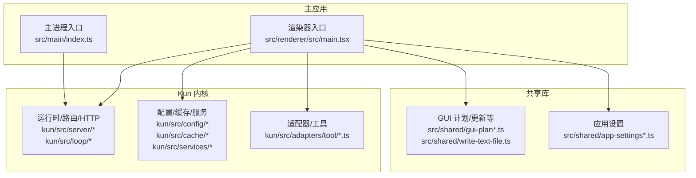
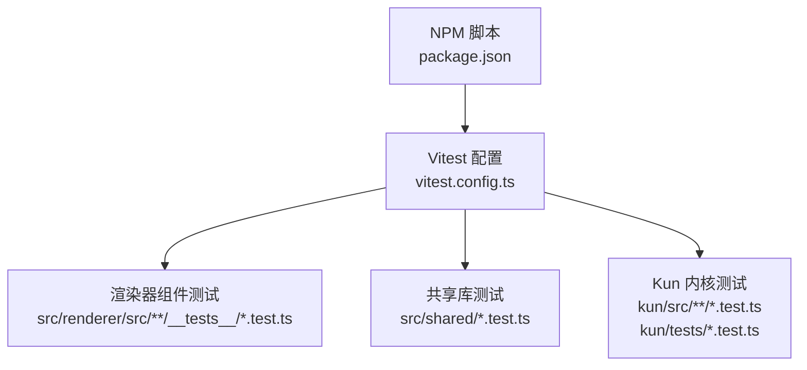
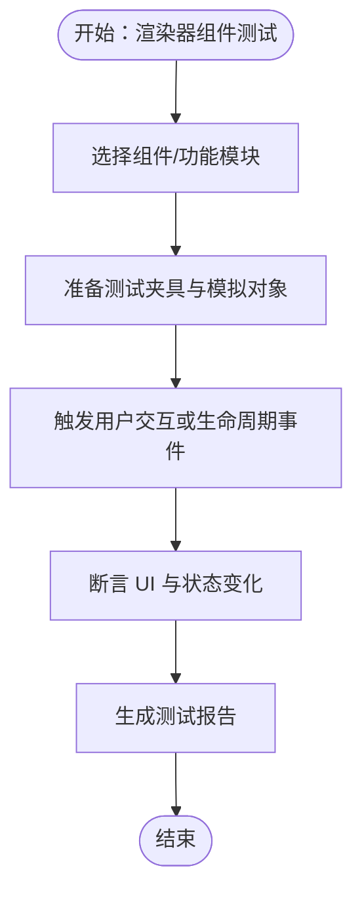
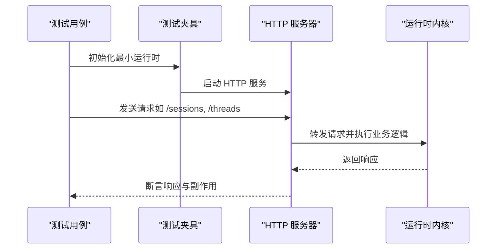
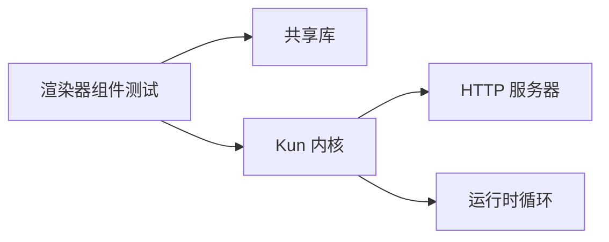

# 测试指南

<cite>
**本文引用的文件**
- [vitest.config.ts](file://vitest.config.ts)
- [package.json](file://package.json)
- [builtin-tool-utils.test.ts](file://kun/src/adapters/tool/builtin-tool-utils.test.ts)
- [kun-config.test.ts](file://kun/src/config/kun-config.test.ts)
- [atomic-write.test.ts](file://kun/tests/atomic-write.test.ts)
- [attachment-store.test.ts](file://kun/tests/attachment-store.test.ts)
- [auto-model-router.test.ts](file://kun/tests/auto-model-router.test.ts)
- [builtin-tools.test.ts](file://kun/tests/builtin-tools.test.ts)
- [cache.test.ts](file://kun/tests/cache.test.ts)
- [capability-registry.test.ts](file://kun/tests/capability-registry.test.ts)
- [child-agent-executor.test.ts](file://kun/tests/child-agent-executor.test.ts)
- [cli-agent.test.ts](file://kun/tests/cli-agent.test.ts)
- [contracts.test.ts](file://kun/tests/contracts.test.ts)
- [create-plan-tool.test.ts](file://kun/tests/create-plan-tool.test.ts)
- [delegation-runtime.test.ts](file://kun/tests/delegation-runtime.test.ts)
- [domain.test.ts](file://kun/tests/domain.test.ts)
- [file-session-store.test.ts](file://kun/tests/file-session-store.test.ts)
- [goal-tools.test.ts](file://kun/tests/goal-tools.test.ts)
- [http-server.test.ts](file://kun/tests/http-server.test.ts)
- [hybrid-store.test.ts](file://kun/tests/hybrid-store.test.ts)
- [loop.test.ts](file://kun/tests/loop.test.ts)
- [mcp-config.test.ts](file://kun/tests/mcp-config.test.ts)
- [mcp-tool-provider.test.ts](file://kun/tests/mcp-tool-provider.test.ts)
- [memory-store.test.ts](file://kun/tests/memory-store.test.ts)
- [model-client.test.ts](file://kun/tests/model-client.test.ts)
- [model-history-repair.test.ts](file://kun/tests/model-history-repair.test.ts)
- [output-accumulator.test.ts](file://kun/tests/output-accumulator.test.ts)
- [ports.test.ts](file://kun/tests/ports.test.ts)
- [read-json-body.test.ts](file://kun/tests/read-json-body.test.ts)
- [request-history-hygiene.test.ts](file://kun/tests/request-history-hygiene.test.ts)
- [review.test.ts](file://kun/tests/review.test.ts)
- [runtime-event-reducer.test.ts](file://kun/tests/runtime-event-reducer.test.ts)
- [runtime-factory.test.ts](file://kun/tests/runtime-factory.test.ts)
- [skill-runtime.test.ts](file://kun/tests/skill-runtime.test.ts)
- [thread-service.test.ts](file://kun/tests/thread-service.test.ts)
- [todo-tools.test.ts](file://kun/tests/todo-tools.test.ts)
- [token-economy.test.ts](file://kun/tests/token-economy.test.ts)
- [tool-call-repair.test.ts](file://kun/tests/tool-call-repair.test.ts)
- [tool-storm-breaker.test.ts](file://kun/tests/tool-storm-breaker.test.ts)
- [usage-service.test.ts](file://kun/tests/usage-service.test.ts)
- [web-tool-provider.test.ts](file://kun/tests/web-tool-provider.test.ts)
- [http-server-test-harness.ts](file://kun/tests/http-server-test-harness.ts)
- [loop-test-harness.ts](file://kun/tests/loop-test-harness.ts)
- [AppShell.test.ts](file://src/renderer/src/AppShell.test.ts)
- [WorkspaceModeTabs.test.ts](file://src/renderer/src/components/chat/__tests__/WorkspaceModeTabs.test.ts)
- [AnimatedWorkLogo.test.ts](file://src/renderer/src/components/chat/AnimatedWorkLogo.test.ts)
- [ConnectPhoneView.test.ts](file://src/renderer/src/components/chat/ConnectPhoneView.test.ts)
- [FloatingComposer.test.ts](file://src/renderer/src/components/chat/FloatingComposer.test.ts)
- [InitialSessionUsageHeatmap.test.ts](file://src/renderer/src/components/chat/InitialSessionUsageHeatmap.test.ts)
- [MessageTimeline.tool-summary.test.ts](file://src/renderer/src/components/chat/MessageTimeline.tool-summary.test.ts)
- [SidebarClawDialogHelpers.test.ts](file://src/renderer/src/components/chat/SidebarClawDialogHelpers.test.ts)
- [SidebarProjectsSection.test.ts](file://src/renderer/src/components/chat/SidebarProjectsSection.test.ts)
- [StreamdownAssistant.test.ts](file://src/renderer/src/components/chat/StreamdownAssistant.test.ts)
- [StreamdownCode.test.ts](file://src/renderer/src/components/chat/StreamdownCode.test.ts)
- [derive-turn-sections.test.ts](file://src/renderer/src/components/chat/derive-turn-sections.test.ts)
- [ScheduleTasksView.test.ts](file://src/renderer/src/components/schedule/ScheduleTasksView.test.ts)
- [DevBrowserPanel.test.ts](file://src/renderer/src/components/DevBrowserPanel.test.ts)
- [PluginMarketplaceView.test.ts](file://src/renderer/src/components/PluginMarketplaceView.test.ts)
- [WindowsTitleBar.test.ts](file://src/renderer/src/components/WindowsTitleBar.test.ts)
- [workbench-plan-controller.test.ts](file://src/renderer/src/components/workbench-plan-controller.test.ts)
- [use-daily-usage.test.ts](file://src/renderer/src/hooks/use-daily-usage.test.ts)
- [use-model-usage.test.ts](file://src/renderer/src/hooks/use-model-usage.test.ts)
- [use-thread-usage.test.ts](file://src/renderer/src/hooks/use-thread-usage.test.ts)
- [attachment-upload-availability.test.ts](file://src/renderer/src/lib/attachment-upload-availability.test.ts)
- [browser-storage.test.ts](file://src/renderer/src/lib/browser-storage.test.ts)
- [code-highlighting.test.ts](file://src/renderer/src/lib/code-highlighting.test.ts)
- [dev-preview-detection.test.ts](file://src/renderer/src/lib/dev-preview-detection.test.ts)
- [file-reference-validation.test.ts](file://src/renderer/src/lib/file-reference-validation.test.ts)
- [image-attachment-upload.test.ts](file://src/renderer/src/lib/image-attachment-upload.test.ts)
- [load-kun-diagnostics.test.ts](file://src/renderer/src/lib/load-kun-diagnostics.test.ts)
- [open-workspace-path.test.ts](file://src/renderer/src/lib/open-workspace-path.test.ts)
- [thread-fork-registry.test.ts](file://src/renderer/src/lib/thread-fork-registry.test.ts)
- [thread-sidebar-visibility.test.ts](file://src/renderer/src/lib/thread-sidebar-visibility.test.ts)
- [plugin-marketplace-runtime.test.ts](file://src/renderer/src/lib/plugin-marketplace-runtime.test.ts)
- [plan-command.test.ts](file://src/renderer/src/plan/plan-command.test.ts)
- [plan-path.test.ts](file://src/renderer/src/plan/plan-path.test.ts)
- [plan-prompts.test.ts](file://src/renderer/src/plan/plan-prompts.test.ts)
- [plan-request.test.ts](file://src/renderer/src/plan/plan-request.test.ts)
- [plan-store.test.ts](file://src/renderer/src/plan/plan-store.test.ts)
- [plan-tool.test.ts](file://src/renderer/src/plan/plan-tool.test.ts)
- [sdd-assistant-prompt.test.ts](file://src/renderer/src/sdd/sdd-assistant-prompt.test.ts)
- [sdd-draft-images.test.ts](file://src/renderer/src/sdd/sdd-draft-images.test.ts)
- [sdd-draft-store.test.ts](file://src/renderer/src/sdd/sdd-draft-store.test.ts)
- [sdd-plan-prompt.test.ts](file://src/renderer/src/sdd/sdd-plan-prompt.test.ts)
- [sdd-thread-registry.test.ts](file://src/renderer/src/sdd/sdd-thread-registry.test.ts)
- [chat-store-runtime.test.ts](file://src/renderer/src/store/chat-store-runtime.test.ts)
- [chat-store-helpers.test.ts](file://src/renderer/src/store/chat-store-helpers.test.ts)
- [chat-store-side-actions.test.ts](file://src/renderer/src/store/chat-store-side-actions.test.ts)
- [chat-store-maintenance-actions.test.ts](file://src/renderer/src/store/chat-store-maintenance-actions.test.ts)
- [chat-store-claw-actions.test.ts](file://src/renderer/src/store/chat-store-claw-actions.test.ts)
- [chat-store-navigation-actions.test.ts](file://src/renderer/src/store/chat-store-navigation-actions.test.ts)
- [chat-store-runtime-helpers.test.ts](file://src/renderer/src/store/chat-store-runtime-helpers.test.ts)
- [write-workspace-store.test.ts](file://src/renderer/src/write/write-workspace-store.test.ts)
- [inline-completion.test.ts](file://src/renderer/src/write/inline-completion/test.ts)
- [inline-edit.test.ts](file://src/renderer/src/write/inline-edit.test.ts)
- [markdown-live-preview.test.ts](file://src/renderer/src/write/markdown-live-preview.test.ts)
- [quoted-selection.test.ts](file://src/renderer/src/write/quoted-selection.test.ts)
- [recent-edits.test.ts](file://src/renderer/src/write/recent-edits.test.ts)
- [term-propagation.test.ts](file://src/renderer/src/write/term-propagation.test.ts)
- [write-file-watch.test.ts](file://src/renderer/src/write/write-file-watch.test.ts)
- [write-render-safety.test.ts](file://src/renderer/src/write/write-render-safety.test.ts)
- [write-thread-registry.test.ts](file://src/renderer/src/write/write-thread-registry.test.ts)
- [write-workspace-file-actions.test.ts](file://src/renderer/src/write/write-workspace-file-actions.test.ts)
- [write-workspace-settings-actions.test.ts](file://src/renderer/src/write/write-workspace-settings-actions.test.ts)
- [app-settings-provider.test.ts](file://src/shared/app-settings-provider.test.ts)
- [app-settings.test.ts](file://src/shared/app-settings.test.ts)
- [gui-plan.test.ts](file://src/shared/gui-plan.test.ts)
- [gui-update-schedule.test.ts](file://src/shared/gui-update-schedule.test.ts)
- [sdd.test.ts](file://src/shared/sdd.test.ts)
- [write-text-file.test.ts](file://src/shared/write-text-file.test.ts)
</cite>

## 目录
1. 引言
2. 项目结构
3. 核心组件
4. 架构总览
5. 详细组件分析
6. 依赖分析
7. 性能考虑
8. 故障排查指南
9. 结论
10. 附录

## 引言
本测试指南面向 DeepSeek GUI 开发者，系统化介绍项目的测试策略与工具使用方法，覆盖单元测试、集成测试与端到端测试的组织方式、编写规范、覆盖率目标、测试数据准备、测试环境搭建、Vitest 配置、测试辅助函数与模拟对象创建、最佳实践与调试技巧，并给出持续集成建议。文档同时提供可视化图示，帮助不同技术背景的读者快速上手。

## 项目结构
项目采用多模块分层架构：主应用（Electron 主进程与渲染器）、共享库（shared）、Kun 运行时内核（kun）。测试主要分布在以下位置：
- 渲染器组件与功能测试：src/renderer/src 下各组件、hooks、lib、store、plan、sdd、write 等目录的 __tests__ 或 .test.ts 文件
- 共享库测试：src/shared 下的各类 .test.ts
- Kun 内核测试：kun/src 与 kun/tests 下的单元与集成测试

**章节来源**
- [package.json:1-93](file://package.json#L1-L93)

## 核心组件
- 测试框架与脚本
  - 使用 Vitest 作为测试运行器，通过 npm 脚本触发测试执行与监听模式
  - Vitest 配置包含路径别名与测试文件匹配规则
- 测试类型分布
  - 单元测试：覆盖核心逻辑、工具函数、数据结构与算法
  - 集成测试：覆盖组件间交互、服务调用、HTTP 接口与运行时流程
  - 端到端测试：通过测试夹具启动完整服务链路，验证真实场景

**章节来源**
- [vitest.config.ts:1-16](file://vitest.config.ts#L1-L16)
- [package.json:7-34](file://package.json#L7-L34)

## 架构总览
下图展示测试在系统中的定位与关系：渲染器组件测试、共享库测试与内核测试分别对应不同抽象层级，通过统一的 Vitest 配置与 npm 脚本协同工作。

**图表来源**
- [vitest.config.ts:1-16](file://vitest.config.ts#L1-L16)
- [package.json:7-34](file://package.json#L7-L34)

## 详细组件分析

### 测试工具与配置
- Vitest 配置要点
  - 路径别名：为渲染器与共享库提供便捷导入
  - 环境：Node 环境，适合纯 JS/TS 测试
  - 包含模式：按约定匹配所有 src/**/*.test.ts
- NPM 脚本
  - test：运行所有测试
  - test:watch：监听模式，便于 TDD
- 建议
  - 在 CI 中增加覆盖率统计与报告输出参数
  - 对渲染器测试可考虑引入 jsdom 或虚拟 DOM 环境以支持浏览器 API

**章节来源**
- [vitest.config.ts:4-15](file://vitest.config.ts#L4-L15)
- [package.json:12-13](file://package.json#L12-L13)

### 单元测试编写规范
- 文件命名与组织
  - 统一使用 .test.ts 后缀，置于被测模块同级或 __tests__ 子目录
  - 按功能域划分：components、hooks、lib、store、plan、sdd、write、shared
- 断言风格
  - 使用明确的断言语义，避免模糊描述
  - 对异步逻辑使用超时与重试策略
- 模拟与桩
  - 使用 Vitest 提供的 mock/spy/stub 工具
  - 对外部依赖（HTTP、文件系统、数据库）进行隔离
- 可读性与维护性
  - 测试名称清晰表达“在给定输入下期望的行为”
  - 使用 describe/test 分层组织，减少重复 setup/teardown

**章节来源**
- [builtin-tool-utils.test.ts](file://kun/src/adapters/tool/builtin-tool-utils.test.ts)
- [builtin-tools.test.ts](file://kun/tests/builtin-tools.test.ts)
- [cache.test.ts](file://kun/tests/cache.test.ts)

### 测试覆盖率要求
- 目标
  - 语句覆盖率、分支覆盖率、函数覆盖率、行覆盖率均达到中高水位（建议不低于 80%）
- 实施
  - 在 Vitest 中启用覆盖率统计与阈值控制
  - 对关键路径（错误处理、边界条件、并发场景）重点保障
- 报告
  - 生成 HTML/Coverage JSON 报告，结合 CI 展示趋势

**章节来源**
- [vitest.config.ts:11-14](file://vitest.config.ts#L11-L14)

### 测试数据准备
- 固定数据集
  - 使用小而精的 fixtures，确保可复现性
- 动态数据
  - 使用工厂函数生成随机但合法的数据
- 外部依赖
  - 使用内存存储或临时文件，避免污染真实环境
- 真实数据模拟
  - 对 HTTP/WS 接口使用 Mock 服务器或拦截器

**章节来源**
- [http-server-test-harness.ts](file://kun/tests/http-server-test-harness.ts)
- [loop-test-harness.ts](file://kun/tests/loop-test-harness.ts)

### 集成测试设计思路
- 关注点
  - 组件间通信（props、事件、状态）
  - 服务层协作（HTTP 路由、运行时事件、工具调用）
  - 数据流与副作用（异步加载、缓存命中、错误传播）
- 示例领域
  - 渲染器 store 与 runtime 的交互
  - 写作工作区与线程注册表的联动
  - 计划面板与计划存储的同步
- 夹具与上下文
  - 使用测试夹具初始化最小可用运行时
  - 对 HTTP 服务进行端到端验证

**章节来源**
- [http-server.test.ts](file://kun/tests/http-server.test.ts)
- [loop.test.ts](file://kun/tests/loop.test.ts)
- [runtime-factory.test.ts](file://kun/tests/runtime-factory.test.ts)

### 端到端测试实现方法
- 场景
  - 完整启动流程：主进程、渲染器、Kun 服务
  - 用户操作链路：打开工作区、发起会话、查看结果
- 方法
  - 使用测试夹具启动 HTTP 服务与 SSE
  - 模拟用户输入与交互，断言 UI 与状态一致性
- 注意事项
  - 端口冲突与资源清理
  - 并发与竞态条件的规避

**章节来源**
- [http-server-test-harness.ts](file://kun/tests/http-server-test-harness.ts)
- [AppShell.test.ts](file://src/renderer/src/AppShell.test.ts)

### 测试环境搭建
- 本地
  - 安装依赖后直接运行 npm run test 或 npm run test:watch
- CI
  - 使用 Node LTS 镜像
  - 缓存依赖与构建产物
  - 执行测试并上传覆盖率报告

**章节来源**
- [package.json:7-34](file://package.json#L7-L34)

### 测试辅助函数与模拟对象
- 辅助函数
  - 创建最小化运行时实例
  - 注入 mock 的工具宿主、事件总线、会话存储
- 模拟对象
  - 使用 Vitest 的 mock 函数与类
  - 对外部接口（HTTP、文件、模型客户端）进行行为模拟

**章节来源**
- [http-server-test-harness.ts](file://kun/tests/http-server-test-harness.ts)
- [loop-test-harness.ts](file://kun/tests/loop-test-harness.ts)
- [model-client.test.ts](file://kun/tests/model-client.test.ts)

### 典型测试用例分析

#### 渲染器组件测试
- 覆盖范围
  - 交互组件：聊天面板、侧边栏、写作工作区、计划面板、SDD 面板
  - Hooks：每日用量、模型用量、线程用量
  - 工具库：附件上传、代码高亮、预览检测、线程分叉等
- 示例
  - WorkspaceModeTabs、FloatingComposer、DevBrowserPanel、PluginMarketplaceView、WindowsTitleBar、workbench-plan-controller 等组件的交互与状态断言
  - hooks 与 lib 的行为验证
  - store 的状态变更与副作用

**章节来源**
- [WorkspaceModeTabs.test.ts](file://src/renderer/src/components/chat/__tests__/WorkspaceModeTabs.test.ts)
- [FloatingComposer.test.ts](file://src/renderer/src/components/chat/FloatingComposer.test.ts)
- [DevBrowserPanel.test.ts](file://src/renderer/src/components/DevBrowserPanel.test.ts)
- [PluginMarketplaceView.test.ts](file://src/renderer/src/components/PluginMarketplaceView.test.ts)
- [WindowsTitleBar.test.ts](file://src/renderer/src/components/WindowsTitleBar.test.ts)
- [workbench-plan-controller.test.ts](file://src/renderer/src/components/workbench-plan-controller.test.ts)
- [use-daily-usage.test.ts](file://src/renderer/src/hooks/use-daily-usage.test.ts)
- [use-model-usage.test.ts](file://src/renderer/src/hooks/use-model-usage.test.ts)
- [use-thread-usage.test.ts](file://src/renderer/src/hooks/use-thread-usage.test.ts)
- [attachment-upload-availability.test.ts](file://src/renderer/src/lib/attachment-upload-availability.test.ts)
- [code-highlighting.test.ts](file://src/renderer/src/lib/code-highlighting.test.ts)
- [dev-preview-detection.test.ts](file://src/renderer/src/lib/dev-preview-detection.test.ts)
- [thread-fork-registry.test.ts](file://src/renderer/src/lib/thread-fork-registry.test.ts)
- [write-workspace-store.test.ts](file://src/renderer/src/write/write-workspace-store.test.ts)

#### 共享库测试
- 应用设置与 GUI 更新：对设置解析、归一化、提示词与更新调度进行验证
- 写作文本文件：对文本写入、导出、格式化等进行断言

**章节来源**
- [app-settings-provider.test.ts](file://src/shared/app-settings-provider.test.ts)
- [app-settings.test.ts](file://src/shared/app-settings.test.ts)
- [gui-update-schedule.test.ts](file://src/shared/gui-update-schedule.test.ts)
- [write-text-file.test.ts](file://src/shared/write-text-file.test.ts)

#### Kun 内核测试
- 工具与适配器：内置工具、工具修复、能力注册、MCP 工具提供
- 配置与缓存：配置加载、缓存策略、LRU/TTL
- 服务与运行时：线程服务、使用量服务、评审服务、事件记录
- 运行时循环：自动模型路由、上下文压缩、令牌经济、工具风暴防护
- HTTP 与路由：健康检查、事件、会话、线程、使用量、工作区等接口

**图表来源**
- [http-server-test-harness.ts](file://kun/tests/http-server-test-harness.ts)
- [http-server.test.ts](file://kun/tests/http-server.test.ts)

**章节来源**
- [builtin-tools.test.ts](file://kun/tests/builtin-tools.test.ts)
- [builtin-tool-utils.test.ts](file://kun/src/adapters/tool/builtin-tool-utils.test.ts)
- [capability-registry.test.ts](file://kun/tests/capability-registry.test.ts)
- [mcp-tool-provider.test.ts](file://kun/tests/mcp-tool-provider.test.ts)
- [cache.test.ts](file://kun/tests/cache.test.ts)
- [lru-cache.ts](file://kun/src/cache/lru-cache.ts)
- [ttl-lru-cache.ts](file://kun/src/cache/ttl-lru-cache.ts)
- [thread-service.test.ts](file://kun/tests/thread-service.test.ts)
- [usage-service.test.ts](file://kun/tests/usage-service.test.ts)
- [review.test.ts](file://kun/tests/review.test.ts)
- [runtime-event-reducer.test.ts](file://kun/tests/runtime-event-reducer.test.ts)
- [auto-model-router.test.ts](file://kun/tests/auto-model-router.test.ts)
- [context-compactor.ts](file://kun/src/loop/context-compactor.ts)
- [token-economy.test.ts](file://kun/tests/token-economy.test.ts)
- [tool-storm-breaker.test.ts](file://kun/tests/tool-storm-breaker.test.ts)

## 依赖分析
- 测试耦合
  - 渲染器组件测试依赖共享库与内核模块
  - 内核集成测试依赖 HTTP 服务器与运行时工厂
- 外部依赖
  - HTTP 客户端、文件系统、模型客户端、事件总线等需通过 mock 解耦
- 循环依赖风险
  - 通过夹具与注入式依赖降低模块间耦合

**图表来源**
- [http-server-test-harness.ts](file://kun/tests/http-server-test-harness.ts)
- [runtime-factory.test.ts](file://kun/tests/runtime-factory.test.ts)

**章节来源**
- [http-server-test-harness.ts](file://kun/tests/http-server-test-harness.ts)
- [runtime-factory.test.ts](file://kun/tests/runtime-factory.test.ts)

## 性能考虑
- 测试执行性能
  - 使用并行度与缓存，减少冷启动时间
  - 将耗时测试拆分为独立任务
- 覆盖率收集
  - 控制采样粒度，避免过度开销
- 资源管理
  - 及时释放端口、文件句柄、定时器

## 故障排查指南
- 常见问题
  - 测试找不到模块：检查 Vitest 别名与 tsconfig 映射
  - 环境变量缺失：确保 CI 中正确注入
  - 端口冲突：在测试夹具中动态分配端口
- 调试技巧
  - 使用 Vitest 的日志与断点
  - 将复杂断言拆分为多个小断言，逐步缩小范围
  - 对异步逻辑添加超时与重试
- 回归测试
  - 对已知缺陷建立回归用例，防止再次出现

**章节来源**
- [vitest.config.ts:5-10](file://vitest.config.ts#L5-L10)
- [http-server-test-harness.ts](file://kun/tests/http-server-test-harness.ts)

## 结论
本指南提供了 DeepSeek GUI 的测试策略与工具使用方法，涵盖从单元测试到集成与端到端测试的全链路实践。建议团队在日常开发中坚持 TDD 思想，完善测试夹具与模拟对象，持续提升覆盖率与稳定性，并在 CI 中固化质量门禁，确保产品迭代的可靠性与可维护性。

## 附录

### 测试清单（按模块）
- 渲染器组件
  - 聊天面板、侧边栏、写作工作区、计划面板、SDD 面板、Hooks、Lib、Store、Write 子模块
- 共享库
  - 应用设置、GUI 计划/更新、写作文本文件
- Kun 内核
  - 工具与适配器、配置与缓存、服务与运行时、HTTP 与路由、运行时循环

### 持续集成建议
- 触发策略
  - PR 与主干分支均执行测试与覆盖率检查
- 步骤建议
  - 安装依赖 → 类型检查 → 单元测试（带覆盖率） → 集成测试 → 构建产物校验
- 报告
  - 上传覆盖率与测试报告至 CI 平台