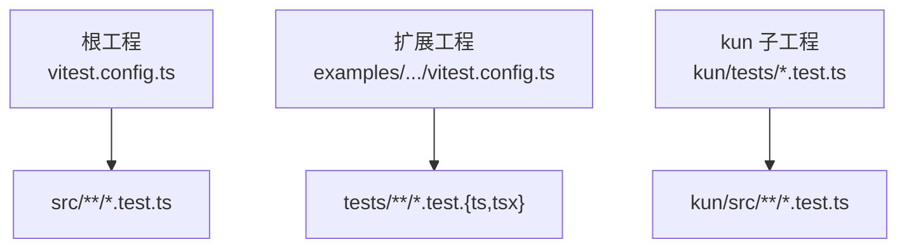
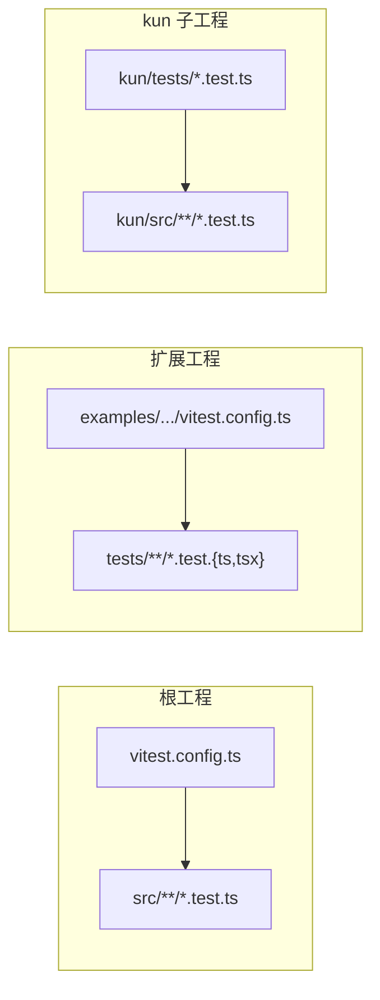
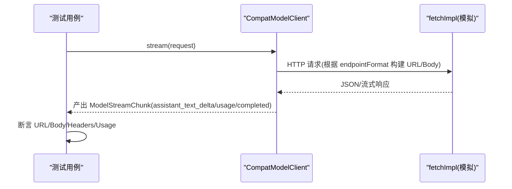
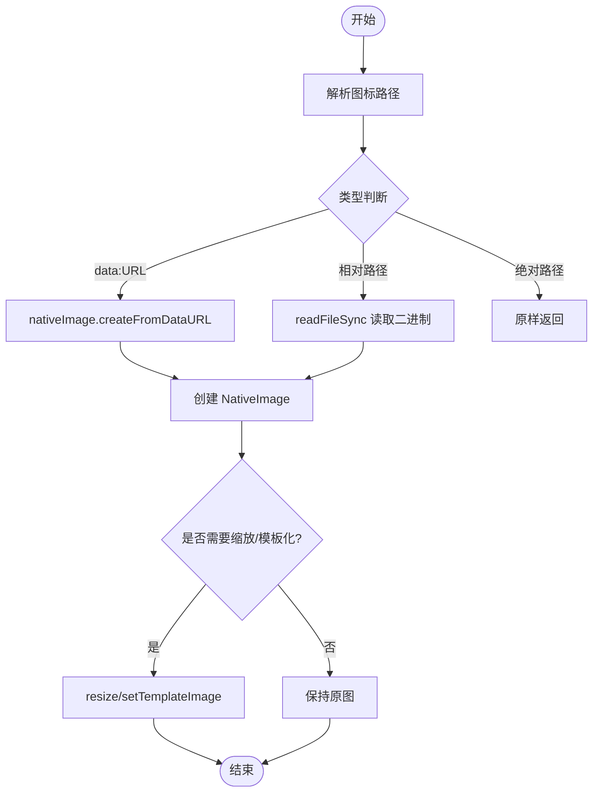
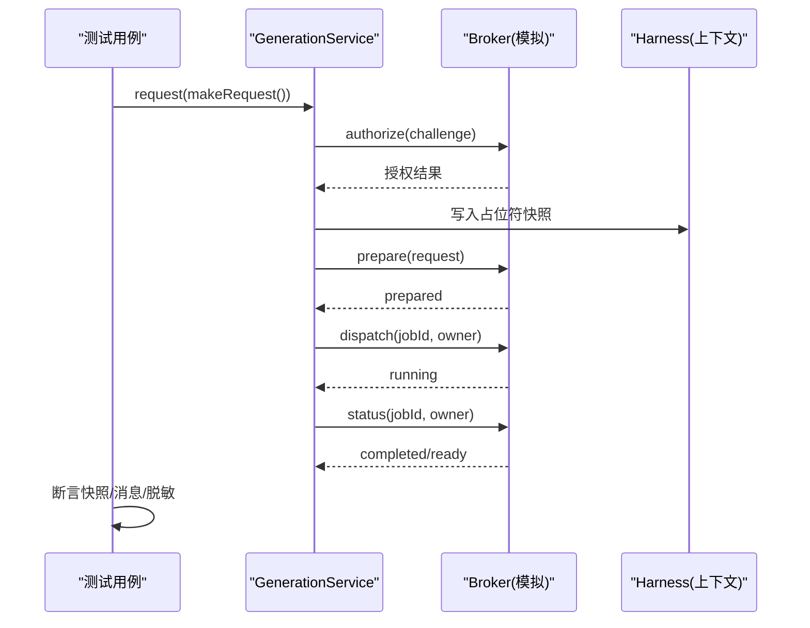
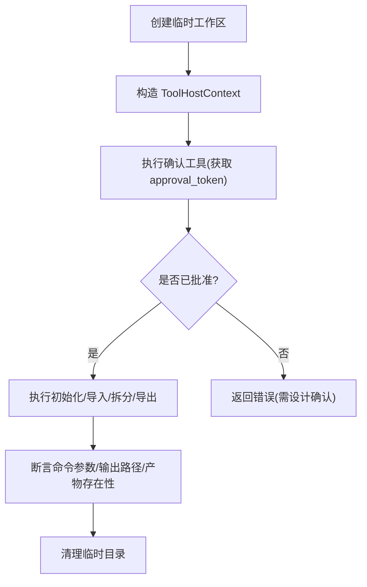
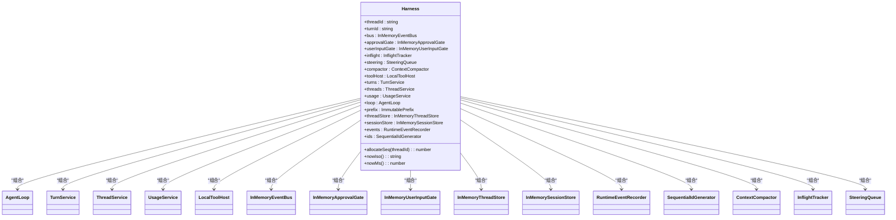
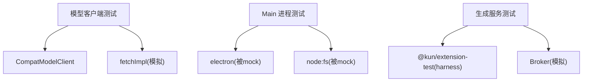

# 单元测试

<cite>
**本文引用的文件**
- [vitest.config.ts](file://vitest.config.ts)
- [package.json](file://package.json)
- [examples/extensions/kun-video-editor/vitest.config.ts](file://examples/extensions/kun-video-editor/vitest.config.ts)
- [kun/tests/model-client.test.ts](file://kun/tests/model-client.test.ts)
- [src/main/index.test.ts](file://src/main/index.test.ts)
- [examples/extensions/kun-video-editor/tests/generation-host.test.ts](file://examples/extensions/kun-video-editor/tests/generation-host.test.ts)
- [kun/src/adapters/tool/ppt-master-tool.test.ts](file://kun/src/adapters/tool/ppt-master-tool.test.ts)
- [kun/tests/loop-test-harness.ts](file://kun/tests/loop-test-harness.ts)
</cite>

## 目录
1. [简介](#简介)
2. [项目结构](#项目结构)
3. [核心组件](#核心组件)
4. [架构总览](#架构总览)
5. [详细组件分析](#详细组件分析)
6. [依赖关系分析](#依赖关系分析)
7. [性能考虑](#性能考虑)
8. [故障排查指南](#故障排查指南)
9. [结论](#结论)
10. [附录](#附录)

## 简介
本文件面向 DeepSeek-GUI 的单元测试，系统性说明基于 Vitest 的测试框架配置、用例组织与隔离策略、Mock/Stub 使用模式（外部依赖模拟、异步处理、状态管理）、核心功能测试示例（模型客户端、调度器、服务层）、覆盖率与断言库实践、数据管理、性能优化技巧以及调试与常见问题解决方案。文档同时提供可追溯的代码级图示，帮助读者快速理解并落地高质量测试。

## 项目结构
DeepSeek-GUI 采用根级统一 Vitest 配置，并在扩展子工程中保留独立配置以适配其特性（如 JSX）。测试文件遵循“就近放置”和“命名约定”：
- 根工程：测试文件位于 src/**/*.test.ts，由根 vitest.config.ts 统一收集。
- 扩展工程（例如 kun-video-editor）：测试文件位于 tests/**/*.test.{ts,tsx}，由其自身 vitest.config.ts 收集。
- 子模块 kun：测试文件集中在 kun/tests 与 kun/src/** 下的 .test.ts。

**图表来源**
- [vitest.config.ts:1-20](file://vitest.config.ts#L1-L20)
- [examples/extensions/kun-video-editor/vitest.config.ts:1-10](file://examples/extensions/kun-video-editor/vitest.config.ts#L1-L10)

**章节来源**
- [vitest.config.ts:1-20](file://vitest.config.ts#L1-L20)
- [examples/extensions/kun-video-editor/vitest.config.ts:1-10](file://examples/extensions/kun-video-editor/vitest.config.ts#L1-L10)
- [package.json:14-62](file://package.json#L14-L62)

## 核心组件
- 测试运行器与环境
  - 使用 Vitest 作为测试框架，Node 环境执行，支持别名解析与平台差异化并行度/超时设置。
  - 通过环境变量禁用操作系统凭据存储，避免测试期间访问系统安全存储。
- 脚本入口
  - npm scripts 聚合了扩展测试、kun 子工程测试与根工程测试，便于 CI 与本地一键执行。
- 扩展工程独立配置
  - 启用 esbuild JSX 自动注入，按 tests 目录收集测试用例。

**章节来源**
- [vitest.config.ts:1-20](file://vitest.config.ts#L1-L20)
- [package.json:14-62](file://package.json#L14-L62)
- [examples/extensions/kun-video-editor/vitest.config.ts:1-10](file://examples/extensions/kun-video-editor/vitest.config.ts#L1-L10)

## 架构总览
下图展示测试在根工程与扩展工程中的组织方式，以及与源码的对应关系。

**图表来源**
- [vitest.config.ts:1-20](file://vitest.config.ts#L1-L20)
- [examples/extensions/kun-video-editor/vitest.config.ts:1-10](file://examples/extensions/kun-video-editor/vitest.config.ts#L1-L10)

## 详细组件分析

### 模型客户端测试（CompatModelClient）
- 目标：验证不同端点格式（chat completions、responses、messages）的请求构建、URL 拼接、流式响应解析、缓存统计、能力探测与工具调用注入等。
- 关键模式：
  - 使用 vi.fn() 构造 fetchImpl 拦截网络请求，断言 URL、请求体与头部。
  - 构造 ReadableStream 模拟 SSE 流，驱动 for-await 消费流式输出。
  - 针对多模型能力（vision/text-only）分支行为进行覆盖。
  - 断言 usage 指标映射（含缓存命中/未命中计算）。

**图表来源**
- [kun/tests/model-client.test.ts:101-241](file://kun/tests/model-client.test.ts#L101-L241)
- [kun/tests/model-client.test.ts:568-629](file://kun/tests/model-client.test.ts#L568-L629)

**章节来源**
- [kun/tests/model-client.test.ts:1-800](file://kun/tests/model-client.test.ts#L1-L800)

### Electron Main 进程图标加载测试
- 目标：验证图标路径解析、data URL 解码、文件读取与回退逻辑、多分辨率图标合成、通知图标平台差异、托盘图标选择与缩放。
- 关键模式：
  - 使用 vi.mock('electron') 与 vi.mock('node:fs') 对原生模块进行 Stub。
  - 通过 vi.hoisted 提升 mock 引用，确保工厂函数内可复用同一 mock 实例。
  - 使用 beforeEach 重置模块与 mock 状态，保证用例隔离。

**图表来源**
- [src/main/index.test.ts:1-133](file://src/main/index.test.ts#L1-L133)
- [src/main/index.test.ts:135-311](file://src/main/index.test.ts#L135-L311)

**章节来源**
- [src/main/index.test.ts:1-312](file://src/main/index.test.ts#L1-L312)

### 生成服务编排测试（GenerationService）
- 目标：验证无 Broker 时的不可用能力、占位符持久化与去重、恢复运行任务、失败信息脱敏、授权校验、重启后恢复 prepare/bind/dispatch/state 各阶段。
- 关键模式：
  - 使用 @kun/extension-test 提供的 createExtensionTestHarness 构造隔离上下文（storage/webview/messages）。
  - 通过 vi.fn() 构造 GenerationExecutionBroker 的 catalog/authorize/prepare/recover/dispatch/status/cancel/verifyOutputs。
  - 断言持久化快照、消息序列号顺序、敏感信息脱敏。

**图表来源**
- [examples/extensions/kun-video-editor/tests/generation-host.test.ts:23-92](file://examples/extensions/kun-video-editor/tests/generation-host.test.ts#L23-L92)
- [examples/extensions/kun-video-editor/tests/generation-host.test.ts:94-158](file://examples/extensions/kun-video-editor/tests/generation-host.test.ts#L94-L158)
- [examples/extensions/kun-video-editor/tests/generation-host.test.ts:186-200](file://examples/extensions/kun-video-editor/tests/generation-host.test.ts#L186-L200)

**章节来源**
- [examples/extensions/kun-video-editor/tests/generation-host.test.ts:1-200](file://examples/extensions/kun-video-editor/tests/generation-host.test.ts#L1-L200)

### PPT Master 工具测试
- 目标：验证工作区隔离、命令参数组装、导出产物校验、路径白名单限制、设计确认流程、读取引导文档边界控制。
- 关键模式：
  - 使用临时目录与文件系统 API 构造真实工作区，afterEach 清理。
  - 通过 context() 构造 ToolHostContext，注入 awaitUserInput 回调模拟审批交互。
  - 将 run 方法替换为自定义实现，捕获并断言实际执行的脚本参数。

**图表来源**
- [kun/src/adapters/tool/ppt-master-tool.test.ts:12-59](file://kun/src/adapters/tool/ppt-master-tool.test.ts#L12-L59)
- [kun/src/adapters/tool/ppt-master-tool.test.ts:61-154](file://kun/src/adapters/tool/ppt-master-tool.test.ts#L61-L154)
- [kun/src/adapters/tool/ppt-master-tool.test.ts:156-200](file://kun/src/adapters/tool/ppt-master-tool.test.ts#L156-L200)
- [kun/src/adapters/tool/ppt-master-tool.test.ts:202-329](file://kun/src/adapters/tool/ppt-master-tool.test.ts#L202-L329)

**章节来源**
- [kun/src/adapters/tool/ppt-master-tool.test.ts:1-329](file://kun/src/adapters/tool/ppt-master-tool.test.ts#L1-L329)

### Agent Loop 测试夹具（Harness）
- 目标：为复杂循环场景提供最小化装配，包含事件总线、审批门、用户输入门、线程/会话存储、工具宿主、用量服务、运行时事件记录、ID 生成器等。
- 关键模式：
  - makeFakeModel/makeSilentModel 提供可控的模型流式输出。
  - makeHarness 集中装配所有依赖，暴露 loop/turns/threads/events 等供测试操作。
  - bootstrapThread 与 resolveNextUserInput 简化启动轮次与等待用户输入的常见流程。

**图表来源**
- [kun/tests/loop-test-harness.ts:31-53](file://kun/tests/loop-test-harness.ts#L31-L53)
- [kun/tests/loop-test-harness.ts:75-188](file://kun/tests/loop-test-harness.ts#L75-L188)

**章节来源**
- [kun/tests/loop-test-harness.ts:1-221](file://kun/tests/loop-test-harness.ts#L1-L221)

## 依赖关系分析
- 测试与源码耦合
  - 模型客户端测试直接依赖适配器实现，通过注入 fetchImpl 解耦网络。
  - Main 进程测试通过 vi.mock 隔离 electron 与 node:fs，避免真实 I/O。
  - 扩展服务测试通过 harness 隔离 storage/webview/messages，避免跨进程依赖。
- 外部依赖模拟
  - 网络：vi.fn() 替代 fetch；SSE 流通过 ReadableStream 构造。
  - 文件系统：vi.mock('node:fs') 配合临时目录与 afterAll/afterEach 清理。
  - 原生模块：vi.mock('electron') 仅 stub 所需方法。
- 模块隔离策略
  - beforeEach 中 vi.resetModules() 重置模块缓存，避免跨用例污染。
  - 每个测试聚焦单一职责，使用夹具或辅助函数减少重复装配。

**图表来源**
- [kun/tests/model-client.test.ts:101-241](file://kun/tests/model-client.test.ts#L101-L241)
- [src/main/index.test.ts:1-133](file://src/main/index.test.ts#L1-L133)
- [examples/extensions/kun-video-editor/tests/generation-host.test.ts:23-92](file://examples/extensions/kun-video-editor/tests/generation-host.test.ts#L23-L92)

**章节来源**
- [package.json:14-62](file://package.json#L14-L62)
- [vitest.config.ts:1-20](file://vitest.config.ts#L1-L20)

## 性能考虑
- 并行执行
  - 根配置在非 Windows 平台使用默认 worker 数；Windows 平台显式限制 maxWorkers 为 2，避免资源争用。
- 超时与稳定性
  - Windows 平台 testTimeout 设置为 15000ms，降低因 I/O 导致的偶发超时。
- 内存与 I/O
  - 使用临时目录与严格清理（afterEach/afterAll），避免磁盘占用增长。
  - 通过夹具集中装配依赖，减少重复对象创建。
- 建议
  - 对重型测试拆分到独立套件，按需启用并行。
  - 对网络/IO 密集的用例增加重试与超时保护。
  - 使用快照对比时注意脱敏与稳定键名，避免无关变更导致快照抖动。

[本节为通用指导，不直接分析具体文件]

## 故障排查指南
- 常见问题
  - 模块污染：确保在 beforeEach 中调用 vi.resetModules()，并对 mock 进行 reset。
  - 路径问题：Windows 路径分隔符差异，建议使用 toMatch 或规范化路径比较。
  - 权限/文件缺失：使用临时目录并确保 afterEach 清理；对不存在文件的路径断言应覆盖回退逻辑。
  - 网络超时：为长耗时请求设置合理超时，必要时使用 AbortController 中断。
- 调试技巧
  - 使用 expect.stringContaining/toMatchObject 缩小断言范围，便于定位差异。
  - 打印中间态（如 sentUrls/sentBodies）辅助定位请求构建问题。
  - 对异步流程使用 Promise 链或 async/await 明确错误栈。

**章节来源**
- [src/main/index.test.ts:1-133](file://src/main/index.test.ts#L1-L133)
- [kun/tests/model-client.test.ts:101-241](file://kun/tests/model-client.test.ts#L101-L241)
- [examples/extensions/kun-video-editor/tests/generation-host.test.ts:134-158](file://examples/extensions/kun-video-editor/tests/generation-host.test.ts#L134-L158)

## 结论
本项目采用统一的 Vitest 配置与清晰的测试组织，结合丰富的 Mock/Stub 模式与夹具，覆盖了从模型客户端、主进程到扩展服务的核心路径。通过合理的并行与超时策略、严格的资源清理与断言实践，保证了测试的稳定性和可维护性。建议在新增功能时沿用现有模式，优先使用夹具与局部 Mock，保持用例小而快、职责单一。

## 附录
- 测试脚本
  - 根工程：npm test 会依次执行扩展测试、kun 测试与根工程测试。
  - 扩展工程：各自 package.json 中定义 test 脚本，由根脚本聚合。
- 覆盖率
  - 当前仓库未内置覆盖率配置；如需开启，可在 vitest.config.ts 中添加 coverage 相关选项，并在脚本中加入覆盖率报告步骤。
- 断言库
  - 使用 Vitest 内置 expect 及其匹配器（toBe/toEqual/toMatchObject/stringContaining 等）。
- 测试数据管理
  - 使用临时目录与固定 fixture（如 PNG 头常量、JSON 样例）保障可重复性；在 afterAll/afterEach 中清理。

**章节来源**
- [package.json:14-62](file://package.json#L14-L62)
- [vitest.config.ts:1-20](file://vitest.config.ts#L1-L20)