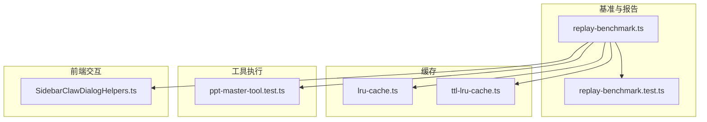
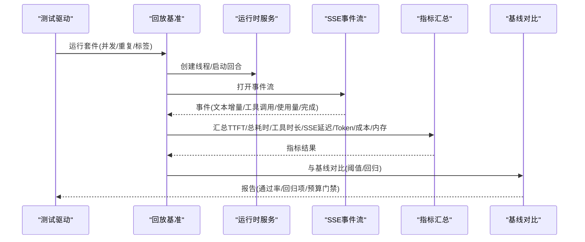
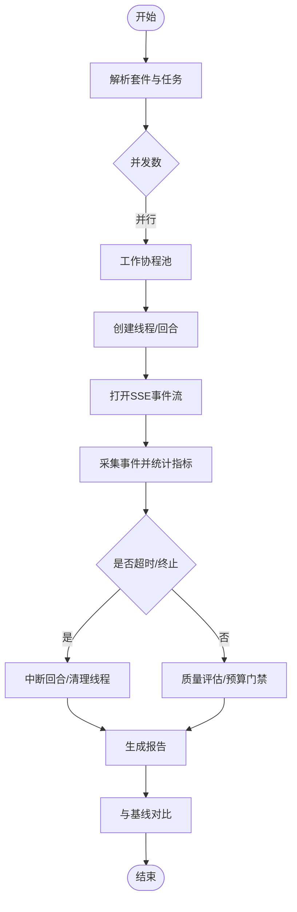
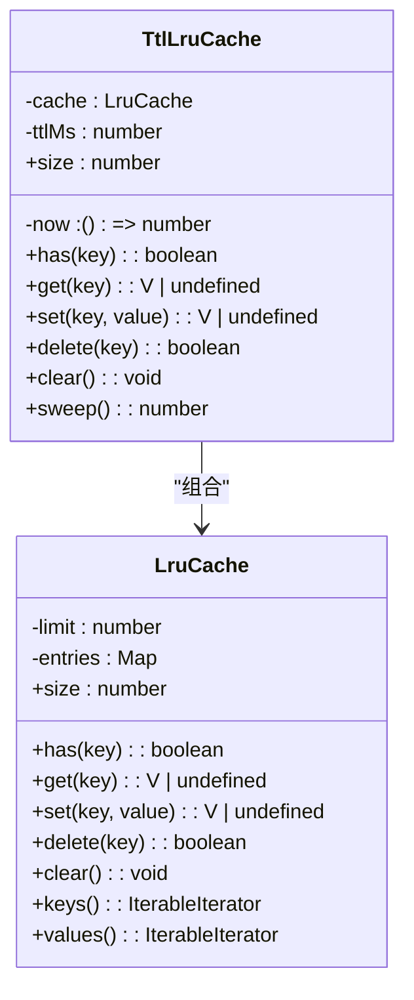
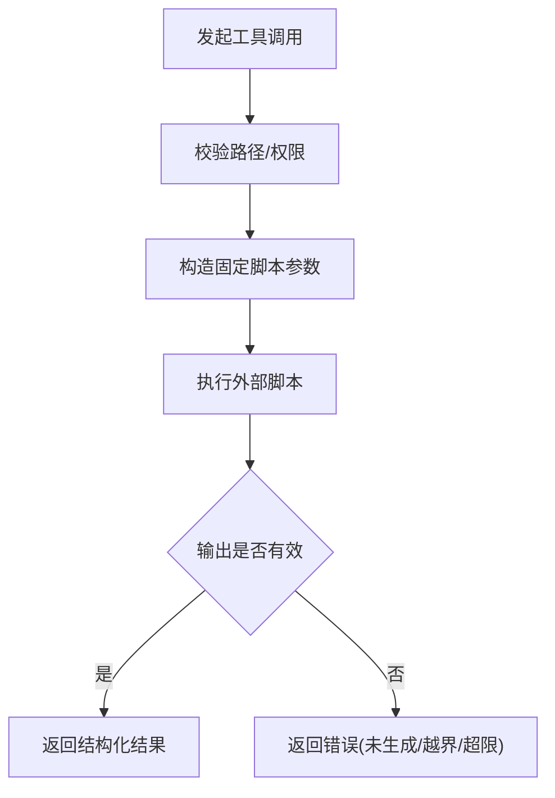
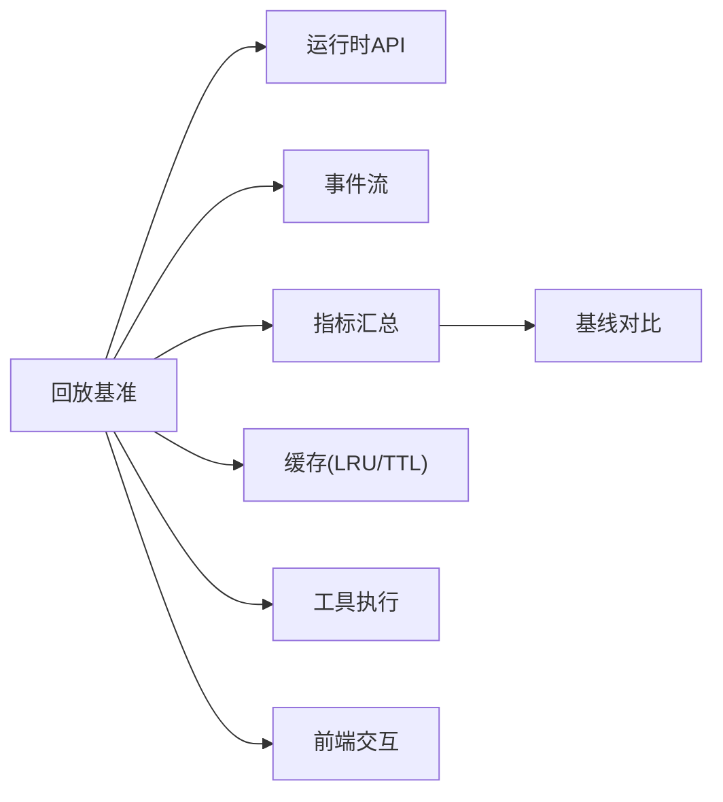

# 性能测试

<cite>
**本文引用的文件**
- [replay-benchmark.ts](file://kun/src/benchmark/replay-benchmark.ts)
- [replay-benchmark.test.ts](file://kun/src/benchmark/replay-benchmark.test.ts)
- [lru-cache.ts](file://kun/src/cache/lru-cache.ts)
- [ttl-lru-cache.ts](file://kun/src/cache/ttl-lru-cache.ts)
- [ppt-master-tool.test.ts](file://kun/src/adapters/tool/ppt-master-tool.test.ts)
- [SidebarClawDialogHelpers.ts](file://src/renderer/src/components/chat/SidebarClawDialogHelpers.ts)
</cite>

## 目录
1. [简介](#简介)
2. [项目结构](#项目结构)
3. [核心组件](#核心组件)
4. [架构总览](#架构总览)
5. [详细组件分析](#详细组件分析)
6. [依赖关系分析](#依赖关系分析)
7. [性能考量](#性能考量)
8. [故障排查指南](#故障排查指南)
9. [结论](#结论)
10. [附录](#附录)

## 简介
本文件为 DeepSeek-GUI 的性能测试提供系统化文档，覆盖整体策略、关键指标定义、基准测试框架与工具链、典型性能场景设计、用例示例、监控与数据分析方法、优化建议以及自动化集成与回归检测机制。内容基于仓库中已有的回放基准（Replay Benchmark）、缓存实现、工具执行路径与前端交互模块进行梳理与扩展说明，确保读者可据此建立可重复、可比较、可回归的性能验证体系。

## 项目结构
DeepSeek-GUI 在性能测试方面主要围绕以下位置展开：
- 回放基准与报告：位于 kun/src/benchmark，提供任务编排、并发执行、SSE 事件采集、指标汇总、基线对比与预算门禁。
- 缓存子系统：位于 kun/src/cache，提供 LRU 与 TTL-LRU 两种内存缓存实现，用于降低重复计算与网络/IO 开销。
- 工具执行路径：位于 kun/src/adapters/tool，包含本地脚本调用与资源限制等能力，可用于文件处理与 CPU 密集型操作的压测。
- 前端交互：位于 src/renderer，包含 IM 接入相关 UI 逻辑，可作为网络请求与渲染压力的观测面之一。

**图表来源**
- [replay-benchmark.ts:300-365](file://kun/src/benchmark/replay-benchmark.ts#L300-L365)
- [replay-benchmark.test.ts:42-64](file://kun/src/benchmark/replay-benchmark.test.ts#L42-L64)
- [lru-cache.ts:1-67](file://kun/src/cache/lru-cache.ts#L1-L67)
- [ttl-lru-cache.ts:1-73](file://kun/src/cache/ttl-lru-cache.ts#L1-L73)
- [ppt-master-tool.test.ts:61-154](file://kun/src/adapters/tool/ppt-master-tool.test.ts#L61-L154)
- [SidebarClawDialogHelpers.ts:59-79](file://src/renderer/src/components/chat/SidebarClawDialogHelpers.ts#L59-L79)

**章节来源**
- [replay-benchmark.ts:300-365](file://kun/src/benchmark/replay-benchmark.ts#L300-L365)
- [replay-benchmark.test.ts:42-64](file://kun/src/benchmark/replay-benchmark.test.ts#L42-L64)
- [lru-cache.ts:1-67](file://kun/src/cache/lru-cache.ts#L1-L67)
- [ttl-lru-cache.ts:1-73](file://kun/src/cache/ttl-lru-cache.ts#L1-L73)
- [ppt-master-tool.test.ts:61-154](file://kun/src/adapters/tool/ppt-master-tool.test.ts#L61-L154)
- [SidebarClawDialogHelpers.ts:59-79](file://src/renderer/src/components/chat/SidebarClawDialogHelpers.ts#L59-L79)

## 核心组件
- 回放基准套件（Replay Suite）：定义任务集、默认参数、期望约束与超时；支持按标签筛选、重复执行与并发控制。
- 事件采集与指标汇总：通过 SSE 流收集运行时事件，计算首字延迟（TTFT）、总耗时、工具调用时长、SSE 延迟分位、Token 用量、成本与峰值内存等。
- 基线与回归对比：将当前报告与基线报告逐项对比，输出相对/绝对阈值判定与回归清单。
- 预算门禁（Budget Gate）：对成功率、延迟分位、缓存命中率、成本、内存等设定上限或下限，作为质量门禁。
- 缓存组件：LRU 与 TTL-LRU 提供可控容量与过期策略，支撑高吞吐下的低延迟与稳定资源占用。
- 工具执行路径：封装本地脚本调用与输入/输出限制，便于对大文件处理、CPU 密集操作进行压测与稳定性验证。
- 前端交互面：IM 接入流程中的错误提示与状态流转，可作为网络异常与连接恢复的观测点。

**章节来源**
- [replay-benchmark.ts:9-55](file://kun/src/benchmark/replay-benchmark.ts#L9-L55)
- [replay-benchmark.ts:519-621](file://kun/src/benchmark/replay-benchmark.ts#L519-L621)
- [replay-benchmark.ts:627-761](file://kun/src/benchmark/replay-benchmark.ts#L627-L761)
- [lru-cache.ts:1-67](file://kun/src/cache/lru-cache.ts#L1-L67)
- [ttl-lru-cache.ts:1-73](file://kun/src/cache/ttl-lru-cache.ts#L1-L73)
- [ppt-master-tool.test.ts:61-154](file://kun/src/adapters/tool/ppt-master-tool.test.ts#L61-L154)
- [SidebarClawDialogHelpers.ts:59-79](file://src/renderer/src/components/chat/SidebarClawDialogHelpers.ts#L59-L79)

## 架构总览
回放基准的执行流程如下：解析套件与任务 → 创建线程与回合 → 开启 SSE 事件流 → 采集事件并统计指标 → 评估质量与预算 → 生成报告并与基线对比。

**图表来源**
- [replay-benchmark.ts:300-365](file://kun/src/benchmark/replay-benchmark.ts#L300-L365)
- [replay-benchmark.ts:367-456](file://kun/src/benchmark/replay-benchmark.ts#L367-L456)
- [replay-benchmark.ts:458-517](file://kun/src/benchmark/replay-benchmark.ts#L458-L517)
- [replay-benchmark.ts:519-621](file://kun/src/benchmark/replay-benchmark.ts#L519-L621)
- [replay-benchmark.ts:627-761](file://kun/src/benchmark/replay-benchmark.ts#L627-L761)

## 详细组件分析

### 回放基准套件与执行器
- 套件定义：校验任务 ID 唯一性、默认模型/提供者/推理强度/超时；支持最多 100 个任务。
- 执行器：按并发度调度任务，创建线程与回合，订阅 SSE 事件，超时中断并清理资源。
- 指标汇总：从事件流中提取 TTFT、工具调用时长、SSE 延迟分位、Token 用量、成本、峰值内存等。
- 报告聚合：汇总通过率、失败/超时/错误计数、各分位延迟、缓存命中率、成本与内存。
- 基线对比：按模型分组对比，支持全局与模型级阈值配置，输出回归项。

**图表来源**
- [replay-benchmark.ts:300-365](file://kun/src/benchmark/replay-benchmark.ts#L300-L365)
- [replay-benchmark.ts:367-456](file://kun/src/benchmark/replay-benchmark.ts#L367-L456)
- [replay-benchmark.ts:458-517](file://kun/src/benchmark/replay-benchmark.ts#L458-L517)
- [replay-benchmark.ts:519-621](file://kun/src/benchmark/replay-benchmark.ts#L519-L621)
- [replay-benchmark.ts:627-761](file://kun/src/benchmark/replay-benchmark.ts#L627-L761)

**章节来源**
- [replay-benchmark.ts:9-55](file://kun/src/benchmark/replay-benchmark.ts#L9-L55)
- [replay-benchmark.ts:300-365](file://kun/src/benchmark/replay-benchmark.ts#L300-L365)
- [replay-benchmark.ts:367-456](file://kun/src/benchmark/replay-benchmark.ts#L367-L456)
- [replay-benchmark.ts:458-517](file://kun/src/benchmark/replay-benchmark.ts#L458-L517)
- [replay-benchmark.ts:519-621](file://kun/src/benchmark/replay-benchmark.ts#L519-L621)
- [replay-benchmark.ts:627-761](file://kun/src/benchmark/replay-benchmark.ts#L627-L761)
- [replay-benchmark.test.ts:42-64](file://kun/src/benchmark/replay-benchmark.test.ts#L42-L64)
- [replay-benchmark.test.ts:161-175](file://kun/src/benchmark/replay-benchmark.test.ts#L161-L175)
- [replay-benchmark.test.ts:398-443](file://kun/src/benchmark/replay-benchmark.test.ts#L398-L443)

### 缓存组件（LRU 与 TTL-LRU）
- LRU：固定容量、最近最少使用淘汰，get/set 均维护访问顺序，永不抛出异常。
- TTL-LRU：在 LRU 基础上增加过期时间，支持主动清扫过期条目，避免长期驻留导致内存膨胀。
- 性能意义：在高并发下减少重复计算与 IO，提升缓存命中率，降低延迟与成本。

**图表来源**
- [lru-cache.ts:1-67](file://kun/src/cache/lru-cache.ts#L1-L67)
- [ttl-lru-cache.ts:1-73](file://kun/src/cache/ttl-lru-cache.ts#L1-L73)

**章节来源**
- [lru-cache.ts:1-67](file://kun/src/cache/lru-cache.ts#L1-L67)
- [ttl-lru-cache.ts:1-73](file://kun/src/cache/ttl-lru-cache.ts#L1-L73)

### 工具执行路径（大文件/CPU密集）
- 本地脚本调用：通过固定脚本与受控参数执行，输出被限制在安全目录内。
- 资源限制：读取文档时限制行数，防止超大输出；导出时校验新文件生成，拒绝陈旧产物。
- 适用场景：大文件处理、复杂转换、CPU 密集型任务的压测与稳定性验证。

**图表来源**
- [ppt-master-tool.test.ts:61-154](file://kun/src/adapters/tool/ppt-master-tool.test.ts#L61-L154)
- [ppt-master-tool.test.ts:156-200](file://kun/src/adapters/tool/ppt-master-tool.test.ts#L156-L200)
- [ppt-master-tool.test.ts:220-260](file://kun/src/adapters/tool/ppt-master-tool.test.ts#L220-L260)
- [ppt-master-tool.test.ts:304-329](file://kun/src/adapters/tool/ppt-master-tool.test.ts#L304-L329)

**章节来源**
- [ppt-master-tool.test.ts:61-154](file://kun/src/adapters/tool/ppt-master-tool.test.ts#L61-L154)
- [ppt-master-tool.test.ts:156-200](file://kun/src/adapters/tool/ppt-master-tool.test.ts#L156-L200)
- [ppt-master-tool.test.ts:220-260](file://kun/src/adapters/tool/ppt-master-tool.test.ts#L220-L260)
- [ppt-master-tool.test.ts:304-329](file://kun/src/adapters/tool/ppt-master-tool.test.ts#L304-L329)

### 前端交互面（网络请求/渲染压力）
- 错误归一化：针对网关不可用、连接失败、HTTP 错误等进行统一提示，便于定位网络问题。
- 状态流转：安装/绑定流程的状态机，有助于观察长连接与轮询的性能表现。
- 适用场景：IM 接入的网络请求压力、错误恢复与用户体验的观测。

**章节来源**
- [SidebarClawDialogHelpers.ts:59-79](file://src/renderer/src/components/chat/SidebarClawDialogHelpers.ts#L59-L79)
- [SidebarClawDialogHelpers.ts:120-178](file://src/renderer/src/components/chat/SidebarClawDialogHelpers.ts#L120-L178)

## 依赖关系分析
- 回放基准依赖运行时服务接口（创建线程、启动回合、事件流、中断、删除）。
- 指标汇总依赖事件类型与使用量快照，结合时间戳计算延迟分位。
- 缓存组件独立于基准，但可通过上层服务注入以提升性能。
- 工具执行路径通过外部脚本与文件系统交互，需关注 I/O 与进程生命周期。
- 前端交互面通过 HTTP/SSE 与后端通信，影响端到端延迟与稳定性。

**图表来源**
- [replay-benchmark.ts:300-365](file://kun/src/benchmark/replay-benchmark.ts#L300-L365)
- [replay-benchmark.ts:519-621](file://kun/src/benchmark/replay-benchmark.ts#L519-L621)
- [replay-benchmark.ts:627-761](file://kun/src/benchmark/replay-benchmark.ts#L627-L761)
- [lru-cache.ts:1-67](file://kun/src/cache/lru-cache.ts#L1-L67)
- [ttl-lru-cache.ts:1-73](file://kun/src/cache/ttl-lru-cache.ts#L1-L73)
- [ppt-master-tool.test.ts:61-154](file://kun/src/adapters/tool/ppt-master-tool.test.ts#L61-L154)
- [SidebarClawDialogHelpers.ts:59-79](file://src/renderer/src/components/chat/SidebarClawDialogHelpers.ts#L59-L79)

**章节来源**
- [replay-benchmark.ts:300-365](file://kun/src/benchmark/replay-benchmark.ts#L300-L365)
- [replay-benchmark.ts:519-621](file://kun/src/benchmark/replay-benchmark.ts#L519-L621)
- [replay-benchmark.ts:627-761](file://kun/src/benchmark/replay-benchmark.ts#L627-L761)
- [lru-cache.ts:1-67](file://kun/src/cache/lru-cache.ts#L1-L67)
- [ttl-lru-cache.ts:1-73](file://kun/src/cache/ttl-lru-cache.ts#L1-L73)
- [ppt-master-tool.test.ts:61-154](file://kun/src/adapters/tool/ppt-master-tool.test.ts#L61-L154)
- [SidebarClawDialogHelpers.ts:59-79](file://src/renderer/src/components/chat/SidebarClawDialogHelpers.ts#L59-L79)

## 性能考量
- 响应时间：以 TTFT 与总耗时为主，辅以工具调用时长与 SSE 延迟分位，反映端到端体验。
- 吞吐量：通过并发度与重复次数调节负载，观察成功率与延迟变化。
- 资源利用率：关注峰值内存（RSS），结合缓存命中与 Token 用量评估资源效率。
- 内存使用：利用 TTL-LRU 定期清扫过期条目，避免内存泄漏与增长。
- 稳定性：超时中断与资源清理保障长时间运行的健壮性。
- 成本：Token 与美元成本纳入预算门禁，防止隐性成本上升。

[本节为通用指导，不直接分析具体文件]

## 故障排查指南
- 超时与中断：当 SSE 流未产生终止事件时，触发超时并中断回合，随后清理线程，避免资源泄露。
- 事件解码：SSE 消息可能跨任意分片到达，需正确拼接与解析，确保指标统计准确。
- 工具执行错误：路径越界、输出未生成、超长输出将被拒绝，需检查参数与限制。
- 前端网络错误：网关不可用、连接失败、HTTP 错误会统一提示，便于快速定位。

**章节来源**
- [replay-benchmark.ts:458-517](file://kun/src/benchmark/replay-benchmark.ts#L458-L517)
- [replay-benchmark.test.ts:42-64](file://kun/src/benchmark/replay-benchmark.test.ts#L42-L64)
- [ppt-master-tool.test.ts:156-200](file://kun/src/adapters/tool/ppt-master-tool.test.ts#L156-L200)
- [ppt-master-tool.test.ts:220-260](file://kun/src/adapters/tool/ppt-master-tool.test.ts#L220-L260)
- [ppt-master-tool.test.ts:304-329](file://kun/src/adapters/tool/ppt-master-tool.test.ts#L304-L329)
- [SidebarClawDialogHelpers.ts:59-79](file://src/renderer/src/components/chat/SidebarClawDialogHelpers.ts#L59-L79)

## 结论
DeepSeek-GUI 的性能测试以回放基准为核心，结合缓存、工具执行与前端交互面，形成覆盖响应时间、吞吐量、资源利用率与内存使用的完整验证体系。通过基线对比与预算门禁，可实现持续的性能回归检测与趋势分析。建议在 CI 中集成回放套件，定期产出报告并对比基线，及时识别瓶颈与回归。

[本节为总结性内容，不直接分析具体文件]

## 附录

### 关键指标定义
- 首字延迟（TTFT）：首次助手文本出现的时间，衡量感知响应速度。
- 总耗时：回合从启动到结束的总时间。
- 工具调用时长：工具调用的累计与分位时长，反映外部依赖性能。
- SSE 延迟：服务端事件时间与接收时间的差值，衡量网络与传输效率。
- Token 用量与成本：输入/输出 Token 与美元成本，评估经济性与效率。
- 峰值内存（RSS）：进程最大内存占用，用于内存泄漏与资源管理评估。

**章节来源**
- [replay-benchmark.ts:519-621](file://kun/src/benchmark/replay-benchmark.ts#L519-L621)
- [replay-benchmark.ts:627-761](file://kun/src/benchmark/replay-benchmark.ts#L627-L761)

### 性能测试用例示例
- AI 模型调用：使用回放套件发送不同 prompt，记录 TTFT、总耗时、Token 与成本，设置预算门禁。
- 文件操作：通过工具执行路径导入/导出大文件，验证路径限制、输出校验与资源释放。
- 网络请求：在前端 IM 接入流程中模拟连接失败与恢复，观察错误提示与重试行为。

**章节来源**
- [replay-benchmark.test.ts:541-598](file://kun/src/benchmark/replay-benchmark.test.ts#L541-L598)
- [ppt-master-tool.test.ts:61-154](file://kun/src/adapters/tool/ppt-master-tool.test.ts#L61-L154)
- [SidebarClawDialogHelpers.ts:59-79](file://src/renderer/src/components/chat/SidebarClawDialogHelpers.ts#L59-L79)

### 监控与数据分析
- 基线建立：保存历史报告，固定套件定义哈希，确保可比性。
- 趋势分析：按模型分组对比，输出相对/绝对阈值变化与回归项。
- 瓶颈识别：关注 TTFT、工具时长、SSE 延迟与峰值内存，定位热点路径。

**章节来源**
- [replay-benchmark.ts:627-761](file://kun/src/benchmark/replay-benchmark.ts#L627-L761)
- [replay-benchmark.test.ts:161-175](file://kun/src/benchmark/replay-benchmark.test.ts#L161-L175)

### 优化建议
- 缓存策略：启用 TTL-LRU，合理设置容量与过期时间，提升命中率并控制内存。
- 连接池配置：复用 SSE 连接与 HTTP 连接，减少握手开销。
- 资源管理：严格限制工具输出大小与路径范围，及时中断与清理资源。

**章节来源**
- [ttl-lru-cache.ts:1-73](file://kun/src/cache/ttl-lru-cache.ts#L1-L73)
- [replay-benchmark.ts:458-517](file://kun/src/benchmark/replay-benchmark.ts#L458-L517)
- [ppt-master-tool.test.ts:304-329](file://kun/src/adapters/tool/ppt-master-tool.test.ts#L304-L329)

### 自动化集成与回归检测
- 在 CI 中运行回放套件，指定并发与重复次数，生成报告。
- 与基线对比，若超过阈值则标记回归并阻断合并。
- 输出 Markdown 报告，包含预算门禁结果与回归项，便于审查。

**章节来源**
- [replay-benchmark.test.ts:398-443](file://kun/src/benchmark/replay-benchmark.test.ts#L398-L443)
- [replay-benchmark.ts:627-761](file://kun/src/benchmark/replay-benchmark.ts#L627-L761)