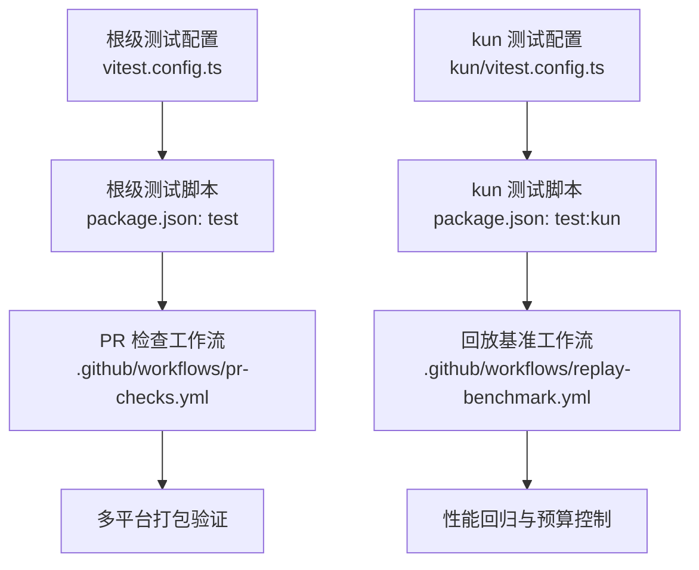
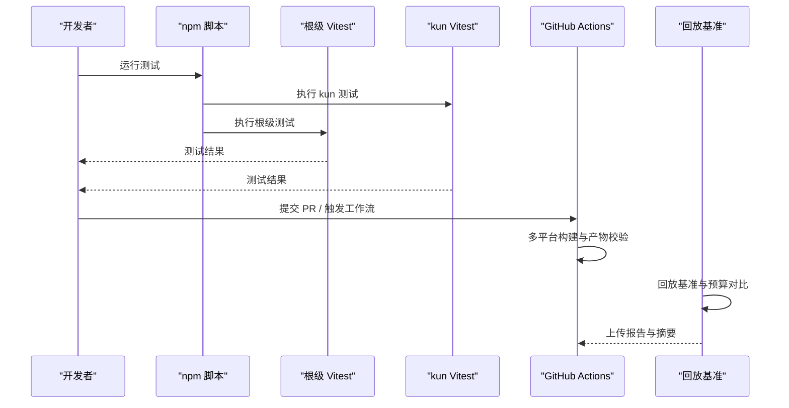
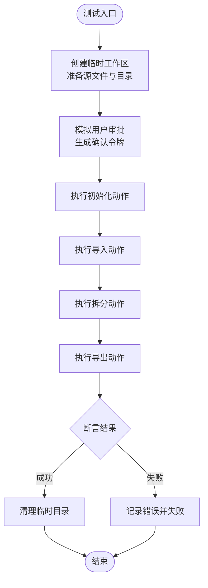
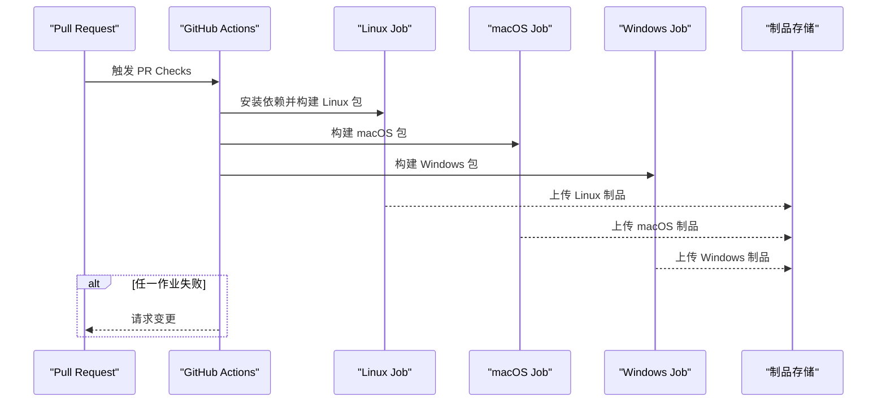
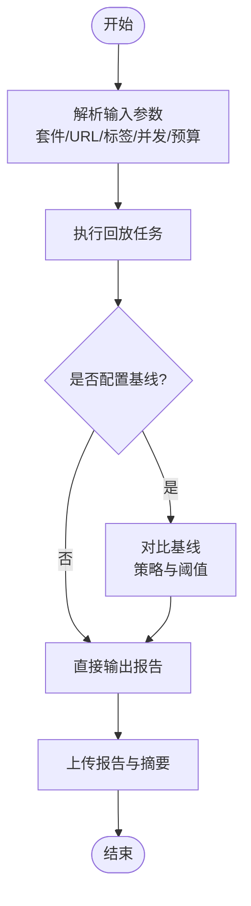
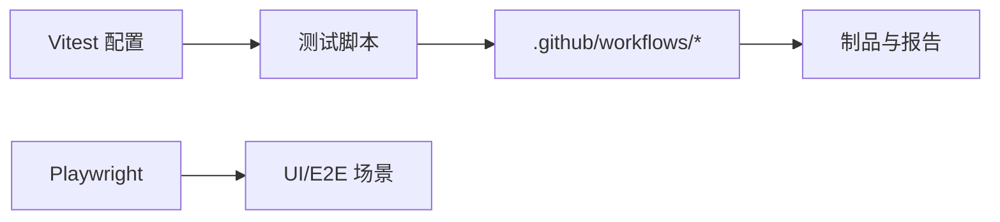

# 测试策略

<cite>
**本文引用的文件**
- [vitest.config.ts](file://vitest.config.ts)
- [package.json](file://package.json)
- [kun/vitest.config.ts](file://kun/vitest.config.ts)
- [.github/workflows/pr-checks.yml](file://.github/workflows/pr-checks.yml)
- [.github/workflows/replay-benchmark.yml](file://.github/workflows/replay-benchmark.yml)
- [ppt-master-tool.test.ts](file://kun/src/adapters/tool/ppt-master-tool.test.ts)
</cite>

## 目录
1. [简介](#简介)
2. [项目结构](#项目结构)
3. [核心组件](#核心组件)
4. [架构总览](#架构总览)
5. [详细组件分析](#详细组件分析)
6. [依赖关系分析](#依赖关系分析)
7. [性能考量](#性能考量)
8. [故障排除指南](#故障排除指南)
9. [结论](#结论)
10. [附录](#附录)

## 简介
本文件为 DeepSeek-GUI（Kun）的测试策略文档，覆盖多层次测试架构（单元测试、集成测试、端到端/冒烟测试）、测试框架选型与配置（Vitest、Playwright、Mock 策略）、用例设计原则（覆盖率、边界条件、异常场景）、模拟与存根策略（外部依赖、网络请求、文件系统）、性能测试方法（基准测试、内存泄漏检测、负载测试）、自动化流程（持续集成、测试报告、回归检测），以及测试编写指南与环境搭建、故障排除。

## 项目结构
- 根级 Vitest 配置用于主工程测试，包含别名与 Node 环境设置，并针对 Windows 平台调整并发与超时。
- kun 子工程拥有独立的 Vitest 配置，启用更严格的 include/globals 设置，并对 Windows 平台提供更长的超时与单工作进程。
- package.json 提供统一测试入口：先运行扩展包测试，再运行 kun 测试，最后执行根级 vitest run；并提供 watch 模式与图形平台测试脚本。
- GitHub Actions 定义了 PR 检查（构建产物）与回放基准测试工作流，作为端到端/冒烟与性能回归的一部分。

**图表来源**
- [vitest.config.ts:1-20](file://vitest.config.ts#L1-L20)
- [package.json:14-63](file://package.json#L14-L63)
- [kun/vitest.config.ts:1-26](file://kun/vitest.config.ts#L1-L26)
- [.github/workflows/pr-checks.yml:1-204](file://.github/workflows/pr-checks.yml#L1-L204)
- [.github/workflows/replay-benchmark.yml:1-133](file://.github/workflows/replay-benchmark.yml#L1-L133)

**章节来源**
- [vitest.config.ts:1-20](file://vitest.config.ts#L1-L20)
- [package.json:14-63](file://package.json#L14-L63)
- [kun/vitest.config.ts:1-26](file://kun/vitest.config.ts#L1-L26)
- [.github/workflows/pr-checks.yml:1-204](file://.github/workflows/pr-checks.yml#L1-L204)
- [.github/workflows/replay-benchmark.yml:1-133](file://.github/workflows/replay-benchmark.yml#L1-L133)

## 核心组件
- 测试框架与运行时
  - Vitest：根级与 kun 子工程均使用，Node 环境运行，支持别名与跨平台超时调整。
  - Playwright：作为 devDependencies 引入，可用于 UI/浏览器相关测试或端到端场景。
  - Mock：通过注入宿主上下文与函数式回调实现工具调用与用户交互的模拟。
- 测试组织
  - 单元测试：以 .test.ts 形式与源码就近放置，聚焦工具与逻辑单元。
  - 集成测试：通过构造真实临时工作区与文件操作，验证工具链与沙箱约束。
  - 端到端/冒烟：通过 CI 构建产物并在多平台执行，结合回放基准工作流进行性能回归。
- 脚本与命令
  - npm test：串联扩展包、kun 与根级测试。
  - npm run test:watch：本地开发快速迭代。
  - npm run test:graph:platform：图形平台专项测试。

**章节来源**
- [vitest.config.ts:1-20](file://vitest.config.ts#L1-L20)
- [kun/vitest.config.ts:1-26](file://kun/vitest.config.ts#L1-L26)
- [package.json:14-63](file://package.json#L14-L63)

## 架构总览
下图展示从代码到测试执行的层次化架构：单元测试在 Node 环境中运行，集成测试通过临时文件系统与宿主上下文模拟外部依赖，端到端/冒烟由 CI 触发多平台构建与验证，回放基准工作流负责性能回归。

**图表来源**
- [package.json:14-63](file://package.json#L14-L63)
- [.github/workflows/pr-checks.yml:1-204](file://.github/workflows/pr-checks.yml#L1-L204)
- [.github/workflows/replay-benchmark.yml:1-133](file://.github/workflows/replay-benchmark.yml#L1-L133)

## 详细组件分析

### 单元测试：工具与业务逻辑
- 目标：验证工具行为、参数校验、路径限制、输出结构与错误信息。
- 示例：PPT Master 工具的测试覆盖了初始化、导入、拆分、导出、路径白名单、旧文件拒绝、同轮确认令牌等场景。
- 关键实践
  - 使用临时目录与清理钩子隔离测试副作用。
  - 通过注入宿主上下文与回调模拟用户审批与输入。
  - 对子进程/脚本调用进行拦截与断言，确保固定脚本与参数组合正确。
  - 断言输出结构、MIME 类型、文件大小与相对路径。

**图表来源**
- [ppt-master-tool.test.ts:1-329](file://kun/src/adapters/tool/ppt-master-tool.test.ts#L1-L329)

**章节来源**
- [ppt-master-tool.test.ts:1-329](file://kun/src/adapters/tool/ppt-master-tool.test.ts#L1-L329)

### 集成测试：文件系统与沙箱约束
- 目标：验证工具对文件系统的安全访问、路径白名单、输出位置约束与资源限制。
- 关键点
  - 仅允许写入受控目录（如 presentations）。
  - 拒绝越界路径与不受支持的源格式。
  - 拒绝过期或重复生成的产物，保证幂等与安全。
  - 读取受保护文档时限制大小与行数，防止资源滥用。

**章节来源**
- [ppt-master-tool.test.ts:156-200](file://kun/src/adapters/tool/ppt-master-tool.test.ts#L156-L200)
- [ppt-master-tool.test.ts:240-260](file://kun/src/adapters/tool/ppt-master-tool.test.ts#L240-L260)
- [ppt-master-tool.test.ts:304-329](file://kun/src/adapters/tool/ppt-master-tool.test.ts#L304-L329)

### 端到端/冒烟测试：CI 构建与产物验证
- 目标：在多平台上构建应用并验证产物完整性与可用性。
- 要点
  - Linux：安装打包依赖，构建 AppImage/Deb，上传制品。
  - macOS：构建 ad-hoc 签名包，产出 dmg/zip/yml。
  - Windows：构建 NSIS 安装包，产出 exe/blockmap/yml。
  - 失败时自动在 PR 上请求变更。

**图表来源**
- [.github/workflows/pr-checks.yml:1-204](file://.github/workflows/pr-checks.yml#L1-L204)

**章节来源**
- [.github/workflows/pr-checks.yml:1-204](file://.github/workflows/pr-checks.yml#L1-L204)

### 性能测试：回放基准与预算控制
- 目标：通过回放基准套件评估性能回归与预算超支。
- 能力
  - 指定套件路径、运行时 URL、标签过滤、重复次数与并发度。
  - 可选基线对比与比较策略，支持按模型维度比较。
  - 预算阈值与失败策略，便于在 CI 中阻断回归。
  - 输出 JSON 报告与 Markdown 摘要，便于归档与审查。

**图表来源**
- [.github/workflows/replay-benchmark.yml:1-133](file://.github/workflows/replay-benchmark.yml#L1-L133)

**章节来源**
- [.github/workflows/replay-benchmark.yml:1-133](file://.github/workflows/replay-benchmark.yml#L1-L133)

## 依赖关系分析
- 测试框架依赖
  - Vitest：根级与 kun 子工程分别配置，Node 环境，别名映射与全局开关。
  - Playwright：作为 UI/浏览器测试能力引入。
- 脚本依赖
  - npm test：串联扩展包、kun 与根级测试。
  - npm run test:graph:platform：图形平台测试入口。
- CI 依赖
  - PR Checks：多平台构建与制品上传。
  - Replay Benchmark：性能回归与预算控制。

**图表来源**
- [vitest.config.ts:1-20](file://vitest.config.ts#L1-L20)
- [kun/vitest.config.ts:1-26](file://kun/vitest.config.ts#L1-L26)
- [package.json:14-63](file://package.json#L14-L63)
- [.github/workflows/pr-checks.yml:1-204](file://.github/workflows/pr-checks.yml#L1-L204)
- [.github/workflows/replay-benchmark.yml:1-133](file://.github/workflows/replay-benchmark.yml#L1-L133)

**章节来源**
- [vitest.config.ts:1-20](file://vitest.config.ts#L1-L20)
- [kun/vitest.config.ts:1-26](file://kun/vitest.config.ts#L1-L26)
- [package.json:14-63](file://package.json#L14-L63)
- [.github/workflows/pr-checks.yml:1-204](file://.github/workflows/pr-checks.yml#L1-L204)
- [.github/workflows/replay-benchmark.yml:1-133](file://.github/workflows/replay-benchmark.yml#L1-L133)

## 性能考量
- 基准测试
  - 使用回放基准工作流，支持并发与重复执行，输出结构化报告与摘要。
  - 可配置基线与比较策略，按模型维度评估差异。
- 内存泄漏检测
  - 建议在长时间运行的回放任务中监控进程内存曲线，结合系统工具与日志定位增长点。
- 负载测试
  - 通过并发参数提升回放任务并行度，观察吞吐与延迟变化，识别瓶颈。
- 优化建议
  - 合理设置并发与超时，避免 CI 资源争用。
  - 将重型任务拆分为独立作业，减少相互影响。
  - 缓存依赖与构建产物，缩短流水线时间。

[本节为通用指导，不直接分析具体文件]

## 故障排除指南
- 测试环境搭建
  - Node.js 版本：遵循引擎要求，CI 使用 Node 22。
  - 依赖安装：使用 npm ci 确保锁定依赖一致性。
  - 平台特定依赖：Linux 需安装打包依赖（libarchive-tools、rpm、dpkg、build-essential、python3）。
- 常见问题
  - 超时失败：Windows 平台已提高超时与工作进程数；必要时在本地调整 Vitest 超时。
  - 权限问题：确保临时目录可写，清理钩子正常执行。
  - 路径限制：工具仅允许写入受控目录，越界路径会报错。
  - 网络/服务不可用：回放基准需要可达的运行时 URL，否则任务失败。
- 调试技巧
  - 使用 --reporter=verbose 或 IDE 集成逐步调试。
  - 在 CI 中下载制品与报告，结合日志定位失败点。
  - 对工具调用进行最小化复现，优先断言关键参数与输出结构。

**章节来源**
- [.github/workflows/pr-checks.yml:39-48](file://.github/workflows/pr-checks.yml#L39-L48)
- [vitest.config.ts:11-18](file://vitest.config.ts#L11-L18)
- [kun/vitest.config.ts:10-24](file://kun/vitest.config.ts#L10-L24)
- [replay-benchmark.yml:64-122](file://.github/workflows/replay-benchmark.yml#L64-L122)

## 结论
DeepSeek-GUI 的测试体系以 Vitest 为核心，辅以 Playwright 的 UI/E2E 能力，并通过 GitHub Actions 实现跨平台构建与性能回归。单元测试与集成测试聚焦工具安全与行为正确性，端到端/冒烟保障交付质量，回放基准确保性能稳定。建议持续完善覆盖率指标、强化边界与异常场景、优化并发与超时配置，并将性能报告纳入发布门禁。

[本节为总结性内容，不直接分析具体文件]

## 附录
- 测试编写指南
  - 命名约定：测试文件以 .test.ts 结尾，描述被测模块；用例名清晰表达预期行为。
  - 最佳实践：
    - 使用临时目录与清理钩子隔离副作用。
    - 通过注入上下文与回调模拟外部依赖与用户交互。
    - 断言结构化输出、错误信息与约束条件。
    - 保持用例独立、可重复、可并行。
  - 调试技巧：
    - 使用断点与日志定位失败路径。
    - 最小化复现实例，优先验证关键分支。
    - 在 CI 中下载报告与制品辅助排查。
- 覆盖率要求
  - 建议对关键工具与路径限制设置高覆盖率目标，结合增量覆盖率报告驱动改进。
- 回归检测
  - 将回放基准与预算阈值纳入 PR 检查，阻止性能退化合并。

[本节为通用指导，不直接分析具体文件]