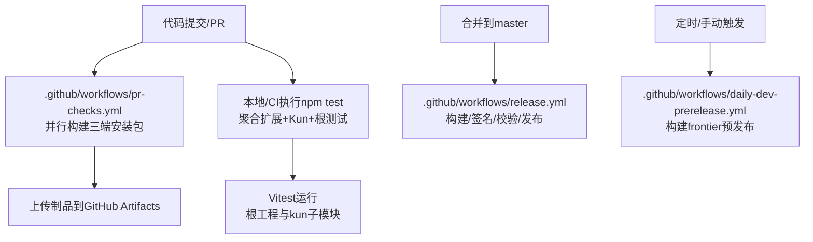
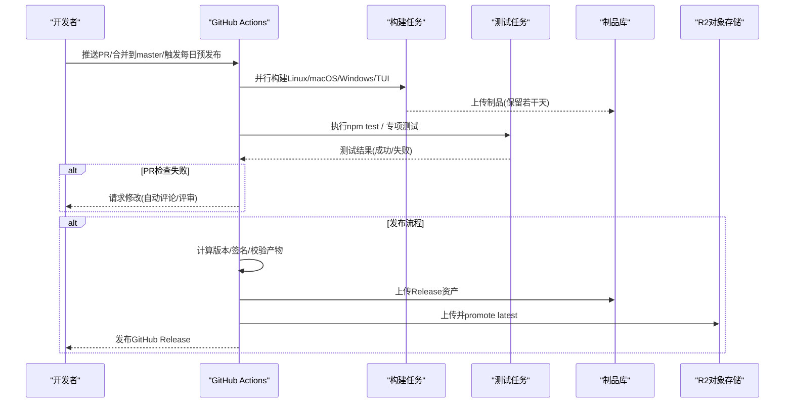
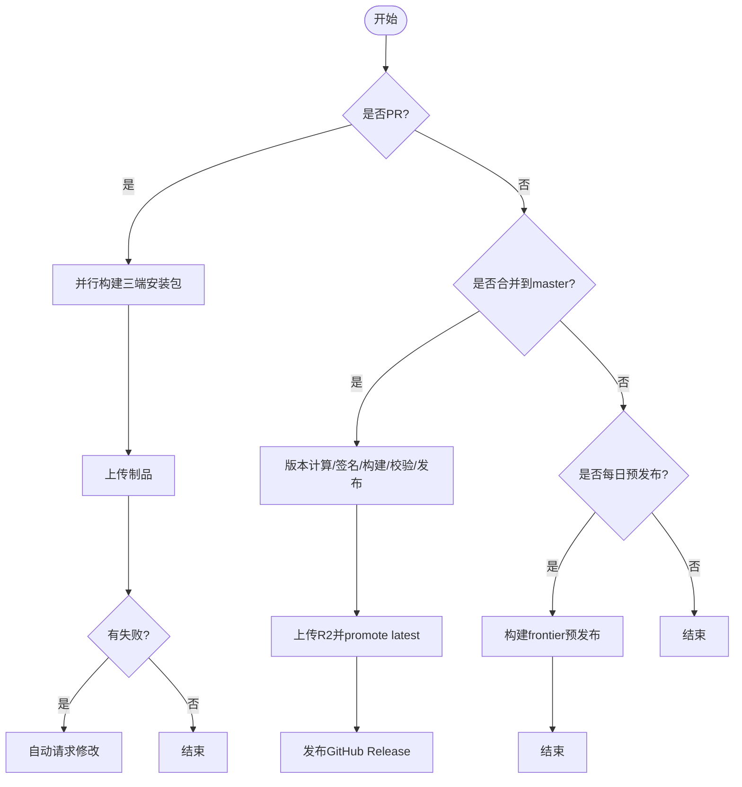
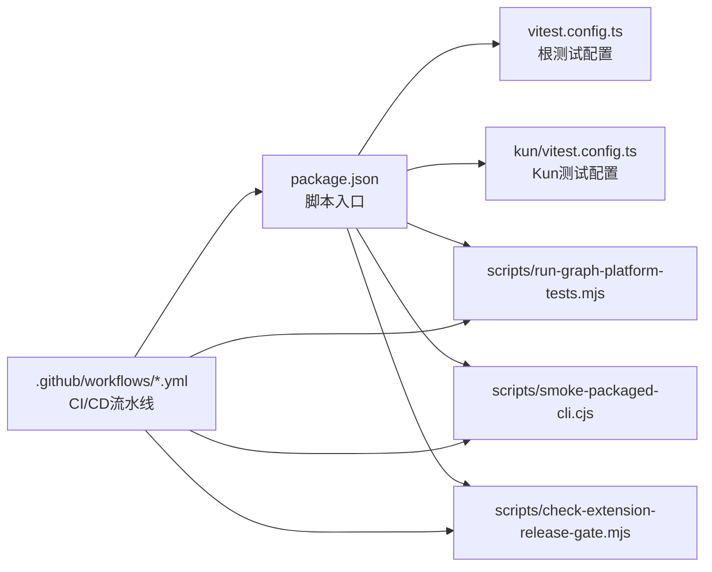

# 测试自动化

<cite>
**本文引用的文件**
- [package.json](file://package.json)
- [vitest.config.ts](file://vitest.config.ts)
- [kun/vitest.config.ts](file://kun/vitest.config.ts)
- [.github/workflows/pr-checks.yml](file://.github/workflows/pr-checks.yml)
- [.github/workflows/release.yml](file://.github/workflows/release.yml)
- [.github/workflows/daily-dev-prerelease.yml](file://.github/workflows/daily-dev-prerelease.yml)
- [scripts/run-graph-platform-tests.mjs](file://scripts/run-graph-platform-tests.mjs)
- [scripts/smoke-packaged-cli.cjs](file://scripts/smoke-packaged-cli.cjs)
- [scripts/check-extension-release-gate.mjs](file://scripts/check-extension-release-gate.mjs)
</cite>

## 目录
1. [简介](#简介)
2. [项目结构](#项目结构)
3. [核心组件](#核心组件)
4. [架构总览](#架构总览)
5. [详细组件分析](#详细组件分析)
6. [依赖关系分析](#依赖关系分析)
7. [性能考虑](#性能考虑)
8. [故障排查指南](#故障排查指南)
9. [结论](#结论)
10. [附录](#附录)

## 简介
本文件面向DeepSeek-GUI的测试自动化，系统性说明CI/CD流水线设计、任务编排、环境准备与依赖管理、多环境测试策略、质量与安全门禁、兼容性验证、部署验证、报告与通知机制、测试数据与日志收集、以及性能优化技巧。内容基于仓库中现有的GitHub Actions工作流、Vitest配置、脚本工具与包脚本进行梳理与归纳。

## 项目结构
- 根级测试入口与脚本：通过package.json暴露统一的测试命令，聚合扩展包测试、Kun子模块测试与主工程单元测试。
- 测试框架与配置：使用Vitest作为统一测试运行器，分别定义根工程与kun子模块的配置（别名、环境变量、并行度、超时等）。
- CI/CD流水线：
  - PR检查：在Pull Request时并行构建Linux/macOS/Windows安装包并上传制品。
  - 发布流水线：合并到master后触发稳定版构建、签名、产物校验、发布至GitHub Release与R2。
  - 每日预发布：定时或手动触发，构建frontier通道版本并归档。
- 专项测试脚本：提供图平台测试集合、打包CLI冒烟测试、扩展发布门禁校验等。

**图表来源**
- [.github/workflows/pr-checks.yml:1-204](file://.github/workflows/pr-checks.yml#L1-L204)
- [.github/workflows/release.yml:1-500](file://.github/workflows/release.yml#L1-L500)
- [.github/workflows/daily-dev-prerelease.yml:1-459](file://.github/workflows/daily-dev-prerelease.yml#L1-L459)
- [package.json:14-89](file://package.json#L14-L89)

**章节来源**
- [package.json:14-89](file://package.json#L14-L89)
- [.github/workflows/pr-checks.yml:1-204](file://.github/workflows/pr-checks.yml#L1-L204)
- [.github/workflows/release.yml:1-500](file://.github/workflows/release.yml#L1-L500)
- [.github/workflows/daily-dev-prerelease.yml:1-459](file://.github/workflows/daily-dev-prerelease.yml#L1-L459)

## 核心组件
- 测试编排与入口
  - npm test：聚合扩展包测试、Kun子模块测试与根工程单元测试。
  - test:tui-release：针对TUI打包相关脚本的测试集合。
  - test:graph:platform：调用脚本执行图平台相关测试集。
- 测试运行器与配置
  - Vitest根配置：设置Node环境、禁用系统凭据存储、路径别名、包含规则、Windows下限制并发与超时。
  - Kun子模块Vitest配置：限定测试范围、关闭全局API、Windows下更严格的并发与超时。
- CI任务
  - PR Checks：并行构建Linux/macOS/Windows安装包，缓存npm依赖，上传制品。
  - Release：计算版本、构建并签名macOS、构建Windows/Linux、构建独立TUI、校验产物、生成Release Notes、创建并发布GitHub Release、上传至R2并promote latest。
  - Daily Dev Prerelease：定时/手动触发，构建frontier通道预发布产物并归档。
- 专项脚本
  - run-graph-platform-tests.mjs：串行执行Kun侧与渲染侧图平台测试。
  - smoke-packaged-cli.cjs：对打包后的CLI进行跨平台冒烟验证。
  - check-extension-release-gate.mjs：扩展发布门禁校验（文档、API兼容、资源清单、构建配置等）。

**章节来源**
- [package.json:14-89](file://package.json#L14-L89)
- [vitest.config.ts:1-20](file://vitest.config.ts#L1-L20)
- [kun/vitest.config.ts:1-26](file://kun/vitest.config.ts#L1-L26)
- [scripts/run-graph-platform-tests.mjs:1-80](file://scripts/run-graph-platform-tests.mjs#L1-L80)
- [scripts/smoke-packaged-cli.cjs:1-287](file://scripts/smoke-packaged-cli.cjs#L1-L287)
- [scripts/check-extension-release-gate.mjs:1-800](file://scripts/check-extension-release-gate.mjs#L1-L800)

## 架构总览
下图展示了从代码提交到测试执行、产物构建、发布与归档的整体流程，包括并行执行、缓存策略、产物校验与多渠道发布。

**图表来源**
- [.github/workflows/pr-checks.yml:1-204](file://.github/workflows/pr-checks.yml#L1-L204)
- [.github/workflows/release.yml:1-500](file://.github/workflows/release.yml#L1-L500)
- [.github/workflows/daily-dev-prerelease.yml:1-459](file://.github/workflows/daily-dev-prerelease.yml#L1-L459)

## 详细组件分析

### CI/CD流水线设计与并行执行
- PR检查流水线
  - 触发条件：PR打开、同步、重新打开、可评审。
  - 并行任务：Linux、macOS、Windows三个平台并行构建安装包；每个任务设置超时与缓存。
  - 失败处理：任一任务失败则自动在PR上请求修改，附带失败任务列表与运行链接。
- 发布流水线
  - 触发条件：PR合并到master且来自develop分支。
  - 关键步骤：版本计算、macOS签名与公证、Windows/Linux构建、独立TUI构建、产物校验、生成Release Notes、创建Draft Release、上传GitHub Release与R2、promote latest、发布Release。
- 每日预发布流水线
  - 触发条件：定时(cron)或手动触发。
  - 输出：frontier通道的预发布版本，包含GUI与TUI各平台产物，归档至GitHub与R2。

**图表来源**
- [.github/workflows/pr-checks.yml:1-204](file://.github/workflows/pr-checks.yml#L1-L204)
- [.github/workflows/release.yml:1-500](file://.github/workflows/release.yml#L1-L500)
- [.github/workflows/daily-dev-prerelease.yml:1-459](file://.github/workflows/daily-dev-prerelease.yml#L1-L459)

**章节来源**
- [.github/workflows/pr-checks.yml:1-204](file://.github/workflows/pr-checks.yml#L1-L204)
- [.github/workflows/release.yml:1-500](file://.github/workflows/release.yml#L1-L500)
- [.github/workflows/daily-dev-prerelease.yml:1-459](file://.github/workflows/daily-dev-prerelease.yml#L1-L459)

### 测试任务编排与环境准备
- 任务编排
  - 根工程：npm test聚合扩展包测试、Kun子模块测试与根工程单元测试。
  - 专项测试：run-graph-platform-tests.mjs串联Kun与渲染侧图平台测试；smoke-packaged-cli.cjs对打包产物进行跨平台冒烟。
- 环境准备
  - Node版本：统一为22（部分Windows任务使用特定版本以匹配原生依赖）。
  - 依赖缓存：npm ci + npm缓存，加速安装。
  - 平台依赖：Linux安装打包所需工具链；macOS安装Whisper构建工具；Windows启用PowerShell执行策略。
  - 环境变量：禁用系统凭据存储、设置更新通道、签名证书与密钥等。

**章节来源**
- [package.json:14-89](file://package.json#L14-L89)
- [vitest.config.ts:1-20](file://vitest.config.ts#L1-L20)
- [kun/vitest.config.ts:1-26](file://kun/vitest.config.ts#L1-L26)
- [.github/workflows/pr-checks.yml:1-204](file://.github/workflows/pr-checks.yml#L1-L204)
- [.github/workflows/release.yml:1-500](file://.github/workflows/release.yml#L1-L500)
- [.github/workflows/daily-dev-prerelease.yml:1-459](file://.github/workflows/daily-dev-prerelease.yml#L1-L459)

### 不同环境的测试策略
- 开发环境
  - 本地执行npm test快速反馈；使用Vitest watch模式；按需运行专项脚本。
  - 通过run-with-kun-flavor.cjs切换开发/生产风味，便于在不同模式下验证行为。
- 预发布环境（frontier）
  - 每日定时或手动触发daily-dev-prerelease，构建frontier通道版本，产出GUI与TUI各平台包，用于早期验证与回归。
- 生产环境（stable）
  - 合并到master后触发release流水线，执行严格签名与公证、产物校验、生成Release Notes并正式发布。

**章节来源**
- [package.json:14-89](file://package.json#L14-L89)
- [.github/workflows/daily-dev-prerelease.yml:1-459](file://.github/workflows/daily-dev-prerelease.yml#L1-L459)
- [.github/workflows/release.yml:1-500](file://.github/workflows/release.yml#L1-L500)

### 自动化流程示例
- 代码质量检查
  - 类型检查：typecheck命令聚合扩展、Kun与根工程类型检查。
  - 扩展文档与Schema校验：check:extension-docs与check:extension-schema。
  - 发布门禁：check-extension-release-gate.mjs校验文档、API兼容、资源清单、构建配置等。
- 安全扫描
  - 审计：audit:production执行生产依赖审计。
  - 签名与公证：verify:apple校验Apple签名与公证能力；macOS构建使用Developer ID签名与Notarization。
- 兼容性测试
  - 图平台测试：run-graph-platform-tests.mjs覆盖Kun与渲染侧图相关用例。
  - 扩展兼容性：check-extension-release-gate.mjs校验API版本协商、支持的主版本策略与fixture断言。
- 部署验证
  - 打包CLI冒烟：smoke-packaged-cli.cjs在打包产物中验证CLI入口、帮助信息与版本号。
  - 产物校验：release流水线中校验必需产物存在性、一致性，并生成Release Notes。

**章节来源**
- [package.json:14-89](file://package.json#L14-L89)
- [scripts/check-extension-release-gate.mjs:1-800](file://scripts/check-extension-release-gate.mjs#L1-L800)
- [scripts/smoke-packaged-cli.cjs:1-287](file://scripts/smoke-packaged-cli.cjs#L1-L287)
- [.github/workflows/release.yml:1-500](file://.github/workflows/release.yml#L1-L500)

### 测试报告生成与通知机制
- 测试报告
  - 当前配置未显式生成HTML/JUnit报告；可通过Vitest reporter参数扩展（例如dot、json、html），或在CI中集成第三方报告服务。
- 通知机制
  - GitHub Actions默认提供运行状态与日志；PR失败时自动请求修改并附带运行链接。
  - 邮件/Slack集成：可在Actions中通过Webhook或专用Action接入外部通知系统（当前仓库未内置）。

**章节来源**
- [.github/workflows/pr-checks.yml:1-204](file://.github/workflows/pr-checks.yml#L1-L204)
- [.github/workflows/release.yml:1-500](file://.github/workflows/release.yml#L1-L500)

### 测试数据管理与日志收集
- 测试数据
  - 临时目录：测试中使用系统临时目录隔离数据，避免污染工作区。
  - 固定夹具：扩展文档与外部项目夹具用于验证构建与发布流程。
- 日志收集
  - CI日志：GitHub Actions提供完整步骤日志；失败时可下载上下文与工件。
  - 自定义日志：脚本通过stdout/stderr输出关键信息，便于定位问题。

**章节来源**
- [scripts/smoke-packaged-cli.cjs:1-287](file://scripts/smoke-packaged-cli.cjs#L1-L287)
- [scripts/check-extension-release-gate.mjs:1-800](file://scripts/check-extension-release-gate.mjs#L1-L800)

### 性能优化技巧
- 并行执行
  - CI中Linux/macOS/Windows构建并行；Windows下限制maxWorkers以避免原生依赖竞争。
- 缓存策略
  - npm依赖缓存；Node版本固定；锁定包管理器与依赖版本，提升稳定性与速度。
- 资源复用
  - 共享Kun运行时构建；产物复用与校验减少重复工作；afterPack阶段验证打包资源完整性。

**章节来源**
- [vitest.config.ts:1-20](file://vitest.config.ts#L1-L20)
- [kun/vitest.config.ts:1-26](file://kun/vitest.config.ts#L1-L26)
- [.github/workflows/pr-checks.yml:1-204](file://.github/workflows/pr-checks.yml#L1-L204)
- [.github/workflows/release.yml:1-500](file://.github/workflows/release.yml#L1-L500)

## 依赖关系分析
- 测试与构建依赖
  - 根工程与kun子模块均使用Vitest；根工程通过alias映射renderer与shared路径。
  - CI依赖Node 22、平台工具链（Linux打包工具、macOS签名工具）、npm缓存。
- 脚本与工具
  - run-graph-platform-tests.mjs依赖Vitest与Kun测试；smoke-packaged-cli.cjs依赖打包产物结构与平台特性；check-extension-release-gate.mjs依赖扩展API与构建配置。

**图表来源**
- [package.json:14-89](file://package.json#L14-L89)
- [vitest.config.ts:1-20](file://vitest.config.ts#L1-L20)
- [kun/vitest.config.ts:1-26](file://kun/vitest.config.ts#L1-L26)
- [scripts/run-graph-platform-tests.mjs:1-80](file://scripts/run-graph-platform-tests.mjs#L1-L80)
- [scripts/smoke-packaged-cli.cjs:1-287](file://scripts/smoke-packaged-cli.cjs#L1-L287)
- [scripts/check-extension-release-gate.mjs:1-800](file://scripts/check-extension-release-gate.mjs#L1-L800)
- [.github/workflows/pr-checks.yml:1-204](file://.github/workflows/pr-checks.yml#L1-L204)
- [.github/workflows/release.yml:1-500](file://.github/workflows/release.yml#L1-L500)
- [.github/workflows/daily-dev-prerelease.yml:1-459](file://.github/workflows/daily-dev-prerelease.yml#L1-L459)

**章节来源**
- [package.json:14-89](file://package.json#L14-L89)
- [vitest.config.ts:1-20](file://vitest.config.ts#L1-L20)
- [kun/vitest.config.ts:1-26](file://kun/vitest.config.ts#L1-L26)
- [scripts/run-graph-platform-tests.mjs:1-80](file://scripts/run-graph-platform-tests.mjs#L1-L80)
- [scripts/smoke-packaged-cli.cjs:1-287](file://scripts/smoke-packaged-cli.cjs#L1-L287)
- [scripts/check-extension-release-gate.mjs:1-800](file://scripts/check-extension-release-gate.mjs#L1-L800)
- [.github/workflows/pr-checks.yml:1-204](file://.github/workflows/pr-checks.yml#L1-L204)
- [.github/workflows/release.yml:1-500](file://.github/workflows/release.yml#L1-L500)
- [.github/workflows/daily-dev-prerelease.yml:1-459](file://.github/workflows/daily-dev-prerelease.yml#L1-L459)

## 性能考虑
- 并行化：CI中多平台并行构建；Windows下限制Worker数量以避免原生依赖冲突。
- 缓存：npm依赖缓存、Node版本固定、锁定依赖版本，缩短冷启动时间。
- 资源复用：共享Kun运行时构建；afterPack阶段验证打包资源，避免重复打包与校验。
- 超时与重试：为长耗时任务设置超时；必要时引入重试机制以提升稳定性。

[本节为通用指导，不直接分析具体文件]

## 故障排查指南
- 常见失败点
  - 依赖安装失败：检查Node版本与缓存；确认平台依赖已安装。
  - 构建失败：查看对应平台日志；确认签名与公证配置正确。
  - 测试失败：定位具体用例；检查环境与Mock；必要时降低并发或增加超时。
- 诊断方法
  - 使用CI日志与工件；复现本地问题；逐步缩小范围。
  - 通过专项脚本验证特定功能（如CLI冒烟、扩展门禁）。

**章节来源**
- [.github/workflows/pr-checks.yml:1-204](file://.github/workflows/pr-checks.yml#L1-L204)
- [.github/workflows/release.yml:1-500](file://.github/workflows/release.yml#L1-L500)
- [scripts/smoke-packaged-cli.cjs:1-287](file://scripts/smoke-packaged-cli.cjs#L1-L287)
- [scripts/check-extension-release-gate.mjs:1-800](file://scripts/check-extension-release-gate.mjs#L1-L800)

## 结论
DeepSeek-GUI的测试自动化以Vitest为核心，结合GitHub Actions实现PR检查、稳定版发布与每日预发布。通过并行构建、缓存策略、产物校验与多渠道发布，确保代码质量与交付效率。建议根据需求扩展报告与通知机制，并持续优化测试性能与稳定性。

[本节为总结，不直接分析具体文件]

## 附录
- 常用命令
  - 本地测试：npm test
  - 专项测试：npm run test:graph:platform
  - TUI测试：npm run test:tui-release
- 关键配置
  - Vitest根配置与Kun配置：控制环境、别名、包含规则与并发。
  - CI工作流：定义触发条件、并行任务、缓存与制品上传。

**章节来源**
- [package.json:14-89](file://package.json#L14-L89)
- [vitest.config.ts:1-20](file://vitest.config.ts#L1-L20)
- [kun/vitest.config.ts:1-26](file://kun/vitest.config.ts#L1-L26)
- [.github/workflows/pr-checks.yml:1-204](file://.github/workflows/pr-checks.yml#L1-L204)
- [.github/workflows/release.yml:1-500](file://.github/workflows/release.yml#L1-L500)
- [.github/workflows/daily-dev-prerelease.yml:1-459](file://.github/workflows/daily-dev-prerelease.yml#L1-L459)