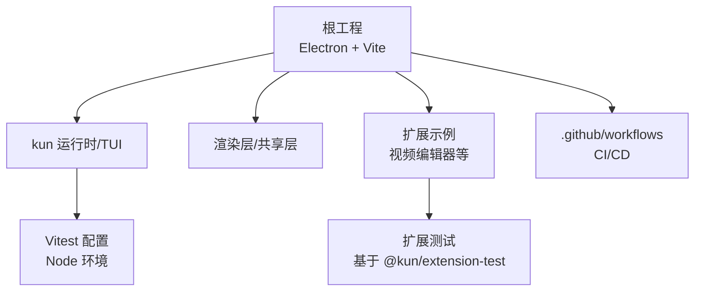
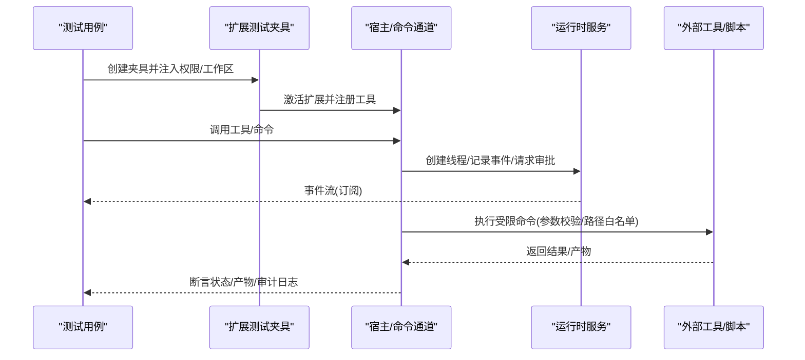
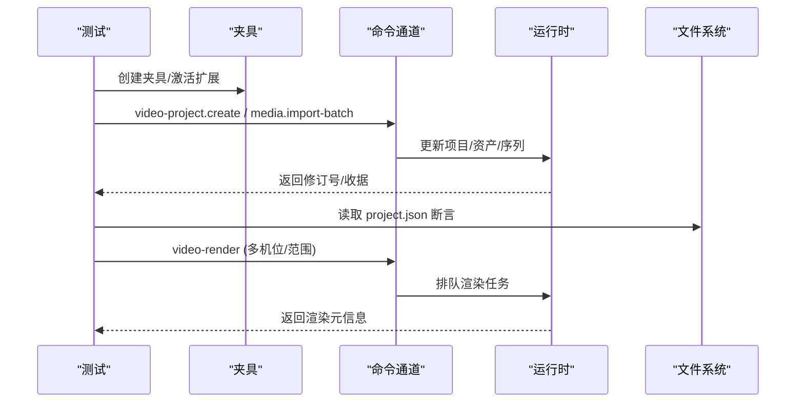
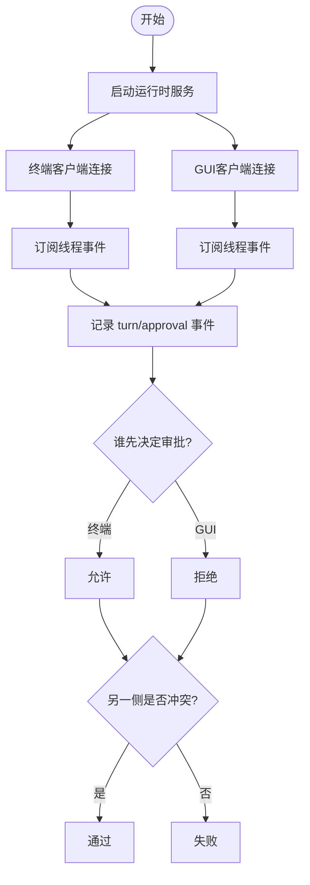
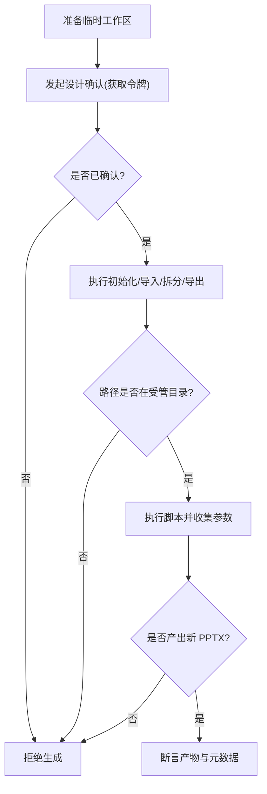
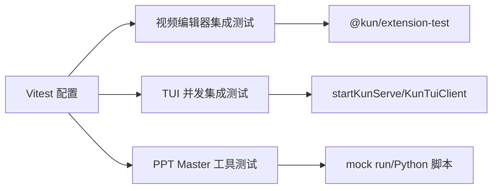

# 端到端测试

<cite>
**本文引用的文件**
- [根级 Vitest 配置](file://vitest.config.ts)
- [Kun 模块 Vitest 配置](file://kun/vitest.config.ts)
- [PR 检查工作流](file://.github/workflows/pr-checks.yml)
- [发布工作流](file://.github/workflows/release.yml)
- [视频编辑器集成测试](file://examples/extensions/kun-video-editor/tests/editing-host-integration.test.ts)
- [TUI 并发集成测试](file://kun/src/tui/concurrent-integration.test.ts)
- [PPT Master 工具测试](file://kun/src/adapters/tool/ppt-master-tool.test.ts)
- [侧边栏 IM 对话框辅助逻辑](file://src/renderer/src/components/chat/SidebarClawDialogHelpers.ts)
</cite>

## 目录
1. [简介](#简介)
2. [项目结构](#项目结构)
3. [核心组件](#核心组件)
4. [架构总览](#架构总览)
5. [详细组件分析](#详细组件分析)
6. [依赖关系分析](#依赖关系分析)
7. [性能考量](#性能考量)
8. [故障排查指南](#故障排查指南)
9. [结论](#结论)
10. [附录](#附录)

## 简介
本文件面向 DeepSeek-GUI 的端到端（E2E）测试，系统化说明整体架构与测试策略，覆盖用户流程模拟、界面交互验证与业务场景覆盖；阐述测试框架与技术选型（浏览器自动化、桌面应用测试、移动端适配思路）；给出用例设计原则（用户故事映射、边界条件、异常路径）；提供具体实现示例（GUI 操作、TUI 命令执行、扩展功能验证）；并说明测试环境管理（多平台支持、依赖安装、环境隔离）、测试数据管理、截图对比与视觉回归、持续集成配置、报告生成与失败分析方法。

## 项目结构
仓库采用分层与模块化组织：
- 根目录包含 Electron 主进程、渲染进程、共享层以及跨平台构建脚本与 CI 配置。
- kun 子工程为运行时与 CLI/TUI 能力，内部包含大量单元测试与集成测试。
- examples/extensions 下包含扩展示例及其测试，其中视频编辑器扩展提供了较完整的 E2E/集成测试样例。
- .github/workflows 定义 PR 检查与发布流水线，涵盖多平台打包与产物校验。

**章节来源**
- [根级 Vitest 配置:1-20](file://vitest.config.ts#L1-L20)
- [Kun 模块 Vitest 配置:1-26](file://kun/vitest.config.ts#L1-L26)
- [PR 检查工作流:1-204](file://.github/workflows/pr-checks.yml#L1-L204)
- [发布工作流:1-500](file://.github/workflows/release.yml#L1-L500)

## 核心组件
- 测试运行器与配置
  - 根级与 kun 子工程均使用 Vitest，统一在 Node 环境下运行，关闭全局 API，按平台调整并发与超时。
- 扩展测试夹具
  - 通过 @kun/extension-test 提供的 createExtensionTestHarness 启动扩展宿主，注入权限与工作区，驱动工具调用与命令执行。
- TUI/GUI 客户端共存
  - 通过 startKunServe 启动服务，使用 KunTuiClient 建立连接，验证事件流共享与审批决策一致性。
- 工具链与本地脚本
  - PPT Master 工具测试通过构造临时工作区与沙箱化 Python 脚本调用，验证输入校验、输出约束与安全边界。

**章节来源**
- [根级 Vitest 配置:1-20](file://vitest.config.ts#L1-L20)
- [Kun 模块 Vitest 配置:1-26](file://kun/vitest.config.ts#L1-L26)
- [视频编辑器集成测试:1-668](file://examples/extensions/kun-video-editor/tests/editing-host-integration.test.ts#L1-L668)
- [TUI 并发集成测试:1-180](file://kun/src/tui/concurrent-integration.test.ts#L1-L180)
- [PPT Master 工具测试:1-329](file://kun/src/adapters/tool/ppt-master-tool.test.ts#L1-L329)

## 架构总览
端到端测试围绕“宿主-扩展-运行时-外部工具”的闭环展开：
- 宿主（Electron/Renderer）暴露命令通道与工具注册点。
- 扩展通过测试夹具激活，注册工具与 UI 视图。
- 运行时（serve-mode）提供线程、事件流、审批门控与持久化。
- 外部工具（如 Python 脚本、FFmpeg）以受控方式被调用，输出受限于安全目录。

**图表来源**
- [视频编辑器集成测试:33-126](file://examples/extensions/kun-video-editor/tests/editing-host-integration.test.ts#L33-L126)
- [TUI 并发集成测试:21-134](file://kun/src/tui/concurrent-integration.test.ts#L21-L134)
- [PPT Master 工具测试:61-154](file://kun/src/adapters/tool/ppt-master-tool.test.ts#L61-L154)

## 详细组件分析

### 视频编辑器扩展集成测试（GUI/Agent 协作）
- 目标：验证时间线、序列、素材库、预览历史、多机位、渲染队列等端到端流程。
- 关键实践：
  - 使用 createExtensionTestHarness 创建隔离工作区，声明所需权限。
  - 通过 editor/harness.client.commands.executeCommand 驱动编辑动作。
  - 通过 invoke 调用工具，断言返回值、修订号、资源投影与持久化文件。
  - 对批量导入、分页、冲突检测、撤销保护进行覆盖。

**图表来源**
- [视频编辑器集成测试:33-126](file://examples/extensions/kun-video-editor/tests/editing-host-integration.test.ts#L33-L126)
- [视频编辑器集成测试:241-351](file://examples/extensions/kun-video-editor/tests/editing-host-integration.test.ts#L241-L351)
- [视频编辑器集成测试:456-573](file://examples/extensions/kun-video-editor/tests/editing-host-integration.test.ts#L456-L573)

**章节来源**
- [视频编辑器集成测试:1-668](file://examples/extensions/kun-video-editor/tests/editing-host-integration.test.ts#L1-L668)

### TUI/GUI 并发与事件共享（TUI 命令执行）
- 目标：验证终端与 GUI 客户端共享同一运行时事件流，审批决策互斥且一致。
- 关键实践：
  - 启动 serve 模式，分配随机端口与数据目录。
  - 两个 KunTuiClient 同时订阅同一线程事件，断言事件序列一致。
  - 一个客户端批准，另一个尝试重复决策应冲突。
  - 服务绑定失败时不发布发现信息。

**图表来源**
- [TUI 并发集成测试:21-134](file://kun/src/tui/concurrent-integration.test.ts#L21-L134)
- [TUI 并发集成测试:136-164](file://kun/src/tui/concurrent-integration.test.ts#L136-L164)

**章节来源**
- [TUI 并发集成测试:1-180](file://kun/src/tui/concurrent-integration.test.ts#L1-L180)

### PPT Master 工具测试（边界与异常路径）
- 目标：验证本地工具的安全边界、路径限制、确认令牌机制与输出约束。
- 关键实践：
  - 构造临时工作区与最小 Markdown 源，模拟完整生成流程。
  - 通过 mock run 捕获实际执行的脚本与参数，断言固定脚本与参数顺序。
  - 校验 projects_root、project_path、output_path 必须在受管目录内。
  - 未获设计确认前禁止生成；导出成功但无新 PPTX 视为错误；拒绝过期产物。
  - 文档读取限制行数与路径逃逸防护。

**图表来源**
- [PPT Master 工具测试:61-154](file://kun/src/adapters/tool/ppt-master-tool.test.ts#L61-L154)
- [PPT Master 工具测试:156-200](file://kun/src/adapters/tool/ppt-master-tool.test.ts#L156-L200)
- [PPT Master 工具测试:202-329](file://kun/src/adapters/tool/ppt-master-tool.test.ts#L202-L329)

**章节来源**
- [PPT Master 工具测试:1-329](file://kun/src/adapters/tool/ppt-master-tool.test.ts#L1-L329)

### 侧边栏 IM 对话框辅助逻辑（GUI 交互要点）
- 目标：保障 IM 渠道添加流程中的提示、二维码绑定、凭据字段与默认值正确性。
- 关注点：
  - 不同平台的连接模式与凭据提示键映射。
  - 错误消息归一化（桥缺失、网关不可用、网络错误）。
  - 工作区路径预览的规范化与脱敏。

**章节来源**
- [侧边栏 IM 对话框辅助逻辑:1-297](file://src/renderer/src/components/chat/SidebarClawDialogHelpers.ts#L1-L297)

## 依赖关系分析
- 测试运行器
  - 根级与 kun 子工程均使用 Vitest，Node 环境，禁用全局 API，按平台设置并发与超时。
- 扩展测试夹具
  - 视频编辑器测试依赖 @kun/extension-test 提供的夹具，用于激活扩展、注入权限与工作区。
- 运行时与服务
  - TUI 并发测试依赖 startKunServe 与 KunTuiClient，验证事件流与审批门控。
- 外部工具
  - PPT Master 测试通过 mock run 控制 Python 脚本执行，确保路径与输出安全。

**图表来源**
- [根级 Vitest 配置:1-20](file://vitest.config.ts#L1-L20)
- [Kun 模块 Vitest 配置:1-26](file://kun/vitest.config.ts#L1-L26)
- [视频编辑器集成测试:1-668](file://examples/extensions/kun-video-editor/tests/editing-host-integration.test.ts#L1-L668)
- [TUI 并发集成测试:1-180](file://kun/src/tui/concurrent-integration.test.ts#L1-L180)
- [PPT Master 工具测试:1-329](file://kun/src/adapters/tool/ppt-master-tool.test.ts#L1-L329)

**章节来源**
- [根级 Vitest 配置:1-20](file://vitest.config.ts#L1-L20)
- [Kun 模块 Vitest 配置:1-26](file://kun/vitest.config.ts#L1-L26)

## 性能考量
- 并发与超时
  - Windows 平台降低 maxWorkers 并提高 testTimeout/hookTimeout，避免资源竞争导致的抖动。
- 临时工作区
  - 所有测试使用 mkdtemp 创建隔离目录，afterEach 清理，避免污染与竞态。
- 事件订阅与并发
  - 并发测试中通过 AbortController 与 Promise.all 等待连接就绪，减少轮询开销。
- 外部工具执行
  - 通过 mock run 控制耗时与 IO，保证测试稳定与快速反馈。

[本节为通用指导，无需特定文件引用]

## 故障排查指南
- 常见失败定位
  - 事件不一致：检查两端订阅是否在同一线程上，确认事件序列号单调递增。
  - 审批冲突：确认只有一个客户端做出最终决策，另一侧应收到冲突错误。
  - 路径越界：校验 projects_root/project_path/output_path 是否落在受管目录。
  - 产物缺失：导出成功后需断言新文件存在且非旧版本。
- 调试建议
  - 打印/断言返回对象的关键字段（revision、receipt、outcome）。
  - 读取持久化文件（如 project.json）进行二次校验。
  - 捕获并记录外部工具的实际调用参数，便于复现问题。

**章节来源**
- [TUI 并发集成测试:21-134](file://kun/src/tui/concurrent-integration.test.ts#L21-L134)
- [PPT Master 工具测试:156-200](file://kun/src/adapters/tool/ppt-master-tool.test.ts#L156-L200)
- [视频编辑器集成测试:241-351](file://examples/extensions/kun-video-editor/tests/editing-host-integration.test.ts#L241-L351)

## 结论
DeepSeek-GUI 的端到端测试以 Vitest 为核心，结合扩展夹具与运行时服务，形成从 GUI 到 TUI、从宿主到外部工具的闭环验证。测试覆盖了用户流程、边界条件与异常路径，并通过 CI 在多平台上构建与校验产物，确保质量与可交付性。建议在后续迭代中继续强化：
- 更多跨端场景（移动端适配）的 E2E 用例。
- 视觉回归与截图对比（结合渲染快照）。
- 更细粒度的性能基准与稳定性指标。

[本节为总结性内容，无需特定文件引用]

## 附录

### 测试框架选择与技术选型
- 框架：Vitest（Node 环境），配合 @kun/extension-test 夹具。
- 浏览器自动化：当前仓库未见显式 Puppeteer/Playwright 用例；可通过夹具与命令通道间接验证 Webview/DOM 行为。
- 桌面应用测试：通过 Electron 宿主与命令通道驱动 GUI 操作。
- 移动端适配：可在未来引入移动端夹具或远程设备桥接，复用现有夹具与运行时接口。

**章节来源**
- [根级 Vitest 配置:1-20](file://vitest.config.ts#L1-L20)
- [Kun 模块 Vitest 配置:1-26](file://kun/vitest.config.ts#L1-L26)
- [视频编辑器集成测试:1-668](file://examples/extensions/kun-video-editor/tests/editing-host-integration.test.ts#L1-L668)

### 用例设计原则
- 用户故事映射：以典型工作流（创建项目、导入媒体、编辑时间线、渲染输出）为主线组织用例。
- 边界条件：大数量资产分页、嵌套序列、多机位同步、批量导入原子性。
- 异常路径：非法路径、未授权操作、冲突写入、外部工具失败、网络/服务绑定失败。

**章节来源**
- [视频编辑器集成测试:241-351](file://examples/extensions/kun-video-editor/tests/editing-host-integration.test.ts#L241-L351)
- [TUI 并发集成测试:136-164](file://kun/src/tui/concurrent-integration.test.ts#L136-L164)
- [PPT Master 工具测试:156-200](file://kun/src/adapters/tool/ppt-master-tool.test.ts#L156-L200)

### 测试环境管理
- 多平台支持：CI 在 Linux/macOS/Windows 分别构建与打包，确保产物可用。
- 依赖安装：Node 22，按需安装系统依赖（Linux 打包工具链、macOS 签名工具）。
- 环境隔离：每个测试使用独立临时目录，结束后清理；服务端口随机分配。

**章节来源**
- [PR 检查工作流:22-152](file://.github/workflows/pr-checks.yml#L22-L152)
- [发布工作流:52-309](file://.github/workflows/release.yml#L52-L309)

### 测试数据管理与视觉回归
- 测试数据：使用临时工作区与固定 fixture（媒体句柄、探针信息），避免真实文件依赖。
- 视觉回归：当前未见截图对比用例；可在渲染完成后截取画布/窗口并与基线比对，纳入 CI。

**章节来源**
- [视频编辑器集成测试:576-668](file://examples/extensions/kun-video-editor/tests/editing-host-integration.test.ts#L576-L668)

### 持续集成与报告
- CI 配置：PR 检查触发多平台打包；发布流程构建、签名、归档与发布。
- 报告生成：Vitest 默认输出测试结果；可在 CI 中聚合报告并上传至制品库。
- 失败分析：根据错误类型（事件冲突、路径越界、产物缺失）定位问题，必要时增加断言与日志。

**章节来源**
- [PR 检查工作流:1-204](file://.github/workflows/pr-checks.yml#L1-L204)
- [发布工作流:310-500](file://.github/workflows/release.yml#L310-L500)