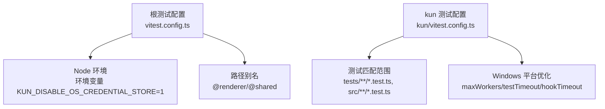
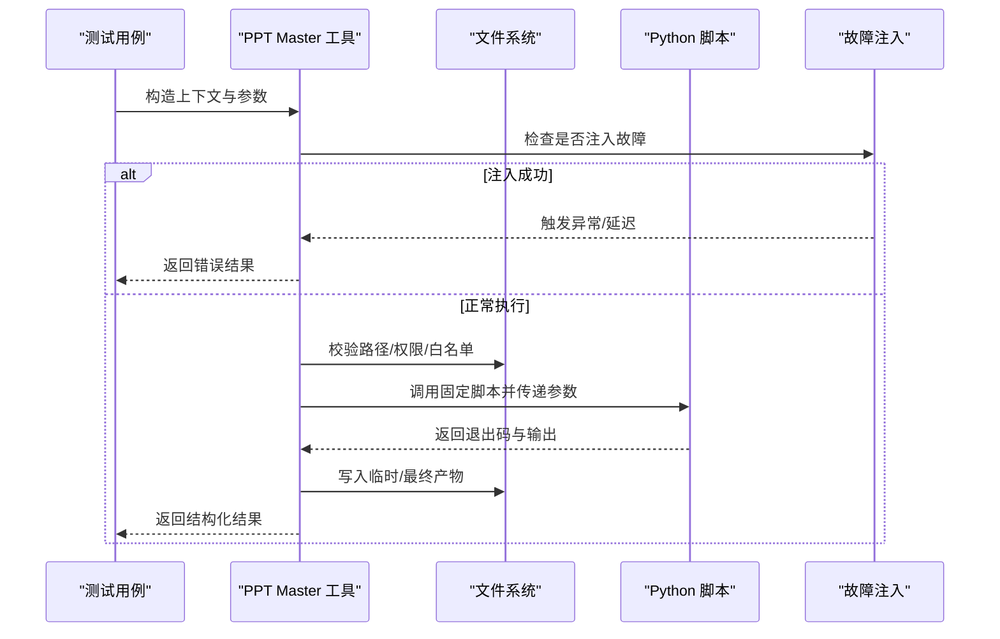
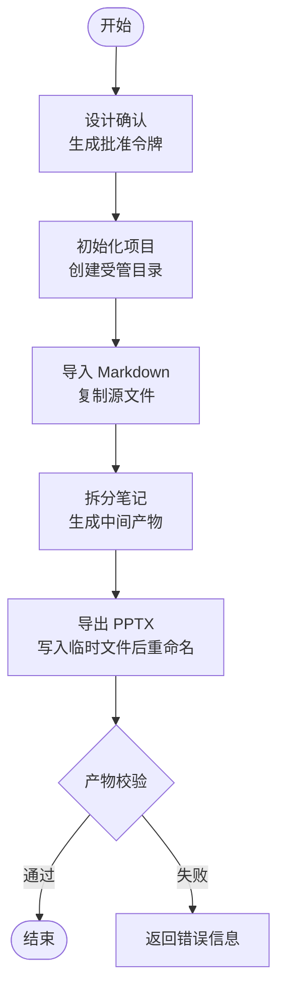
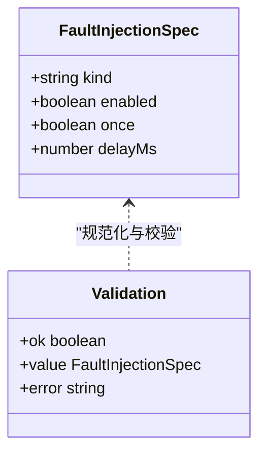
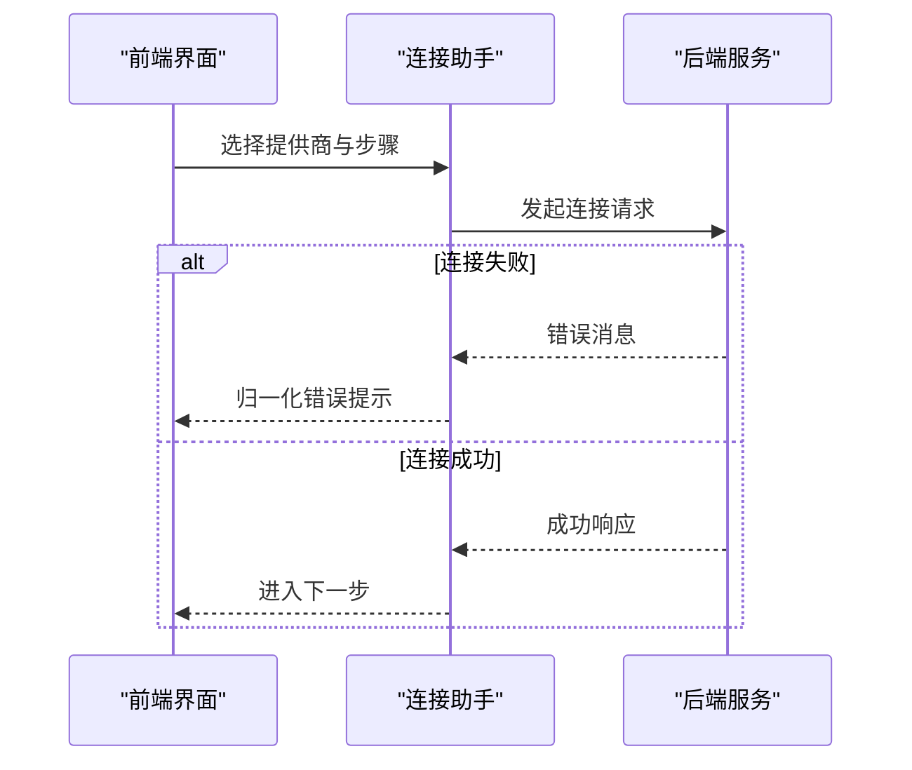
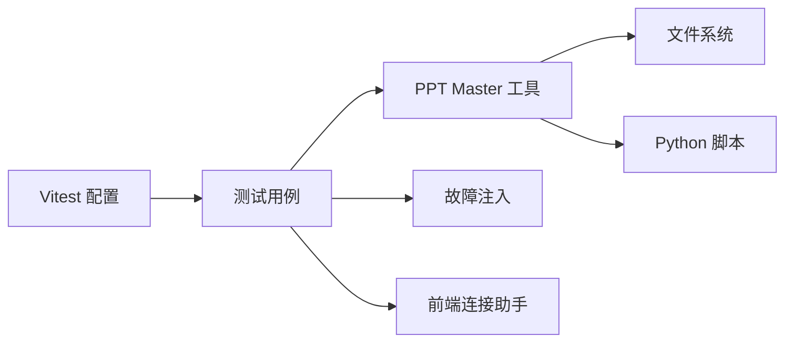

# 集成测试

<cite>
**本文引用的文件**
- [vitest.config.ts](file://vitest.config.ts)
- [kun/vitest.config.ts](file://kun/vitest.config.ts)
- [ppt-master-tool.test.ts](file://kun/src/adapters/tool/ppt-master-tool.test.ts)
- [fault-injection.ts](file://kun/src/contracts/fault-injection.ts)
- [SidebarClawDialogHelpers.ts](file://src/renderer/src/components/chat/SidebarClawDialogHelpers.ts)
</cite>

## 目录
1. [简介](#简介)
2. [项目结构](#项目结构)
3. [核心组件](#核心组件)
4. [架构总览](#架构总览)
5. [详细组件分析](#详细组件分析)
6. [依赖关系分析](#依赖关系分析)
7. [性能考量](#性能考量)
8. [故障排查指南](#故障排查指南)
9. [结论](#结论)
10. [附录](#附录)

## 简介
本文件面向 DeepSeek-GUI 的集成测试，聚焦于跨组件交互、服务通信与数据流验证。文档基于仓库中的测试配置与现有测试实现，系统化说明：
- 设计原则与测试范围
- 测试环境搭建（数据库初始化、外部服务模拟、配置管理）
- 关键集成场景策略（Kun 运行时启动、扩展加载、IPC 通信、文件系统操作）
- 具体用例示例（工作流执行、会话管理、工具调用）
- 异步处理、事务与回滚测试方法
- 测试数据准备与清理、并发测试
- 性能监控、错误注入与故障恢复测试

## 项目结构
本项目采用多包与分层组织方式，测试框架统一使用 Vitest，并在根与子模块分别提供配置：
- 根级 vitest 配置定义别名与环境变量，便于在 Node 环境下运行前端相关测试
- kun 子模块 vitest 配置限定测试匹配范围、关闭全局 API、并针对 Windows 平台调整并行度与超时

**图表来源**
- [vitest.config.ts:1-20](file://vitest.config.ts#L1-L20)
- [kun/vitest.config.ts:1-26](file://kun/vitest.config.ts#L1-L26)

**章节来源**
- [vitest.config.ts:1-20](file://vitest.config.ts#L1-L20)
- [kun/vitest.config.ts:1-26](file://kun/vitest.config.ts#L1-L26)

## 核心组件
围绕集成测试的关键能力包括：
- 测试环境与配置：通过 Vitest 配置统一运行环境与路径解析
- 工具链集成：以 PPT Master 本地工具为例，验证脚本调用、输入校验、输出约束与安全边界
- 错误注入：通过统一的故障注入规范，对磁盘、进程、网络、序列化等异常进行可控注入
- 前端集成辅助：IM 渠道连接与错误提示逻辑，用于端到端流程中的用户引导与错误归一化

**章节来源**
- [vitest.config.ts:1-20](file://vitest.config.ts#L1-L20)
- [kun/vitest.config.ts:1-26](file://kun/vitest.config.ts#L1-L26)
- [ppt-master-tool.test.ts:1-329](file://kun/src/adapters/tool/ppt-master-tool.test.ts#L1-L329)
- [fault-injection.ts:1-71](file://kun/src/contracts/fault-injection.ts#L1-L71)
- [SidebarClawDialogHelpers.ts:1-297](file://src/renderer/src/components/chat/SidebarClawDialogHelpers.ts#L1-L297)

## 架构总览
下图展示集成测试在“测试驱动 → 工具/服务 → 外部资源”的交互链路，涵盖工具调用、文件系统访问、结构化输入确认与错误注入点。

**图表来源**
- [ppt-master-tool.test.ts:61-154](file://kun/src/adapters/tool/ppt-master-tool.test.ts#L61-L154)
- [fault-injection.ts:38-61](file://kun/src/contracts/fault-injection.ts#L38-L61)

## 详细组件分析

### PPT Master 工具集成测试
该测试覆盖完整的工作流：设计确认、项目初始化、Markdown 导入、笔记拆分、导出与产物校验，同时验证安全边界（路径白名单、类型限制、输出位置约束）。

**图表来源**
- [ppt-master-tool.test.ts:31-59](file://kun/src/adapters/tool/ppt-master-tool.test.ts#L31-L59)
- [ppt-master-tool.test.ts:61-154](file://kun/src/adapters/tool/ppt-master-tool.test.ts#L61-L154)

要点：
- 设计确认：通过结构化输入发起同轮确认，返回批准令牌
- 路径白名单：严格限制项目根与输出目录，拒绝越界路径
- 脚本调用：固定脚本名与参数顺序，确保可重复性与可观测性
- 产物校验：要求新文件存在且非旧文件，避免幂等误判
- 输入限制：仅允许 Markdown 类型，防止不受控格式

**章节来源**
- [ppt-master-tool.test.ts:31-59](file://kun/src/adapters/tool/ppt-master-tool.test.ts#L31-L59)
- [ppt-master-tool.test.ts:61-154](file://kun/src/adapters/tool/ppt-master-tool.test.ts#L61-L154)
- [ppt-master-tool.test.ts:156-200](file://kun/src/adapters/tool/ppt-master-tool.test.ts#L156-L200)
- [ppt-master-tool.test.ts:202-260](file://kun/src/adapters/tool/ppt-master-tool.test.ts#L202-L260)
- [ppt-master-tool.test.ts:262-329](file://kun/src/adapters/tool/ppt-master-tool.test.ts#L262-L329)

### 错误注入与故障恢复测试
通过统一的故障注入规范，可在测试中注入磁盘满、权限拒绝、子进程崩溃、SSE 断开、HTTP 超时/限流、JSON 无效、SQLite 忙、凭据存储不可用等故障，验证系统健壮性与恢复路径。

**图表来源**
- [fault-injection.ts:1-71](file://kun/src/contracts/fault-injection.ts#L1-L71)

实践建议：
- 在关键路径（I/O、网络、序列化、进程调用）前插入故障判断
- 使用 once 控制单次触发，便于定位问题
- 通过 delayMs 模拟延迟，观察超时与重试行为
- 结合断言验证错误分类与降级策略

**章节来源**
- [fault-injection.ts:1-71](file://kun/src/contracts/fault-injection.ts#L1-L71)

### IM 渠道连接与错误归一化（前端集成）
前端侧提供 IM 渠道添加向导与错误归一化逻辑，便于端到端测试覆盖从 UI 到后端服务的连接流程。

**图表来源**
- [SidebarClawDialogHelpers.ts:59-79](file://src/renderer/src/components/chat/SidebarClawDialogHelpers.ts#L59-L79)
- [SidebarClawDialogHelpers.ts:81-118](file://src/renderer/src/components/chat/SidebarClawDialogHelpers.ts#L81-L118)

要点：
- 错误归一化：将多种底层错误映射为统一的用户提示键
- 步骤化向导：默认设置、提示词、连接三阶段
- 提供商差异：飞书/Lark、微信、Telegram 的配置与引导不同

**章节来源**
- [SidebarClawDialogHelpers.ts:59-79](file://src/renderer/src/components/chat/SidebarClawDialogHelpers.ts#L59-L79)
- [SidebarClawDialogHelpers.ts:81-118](file://src/renderer/src/components/chat/SidebarClawDialogHelpers.ts#L81-L118)
- [SidebarClawDialogHelpers.ts:120-178](file://src/renderer/src/components/chat/SidebarClawDialogHelpers.ts#L120-L178)

## 依赖关系分析
集成测试依赖以下关键要素：
- 测试框架：Vitest（Node 环境），路径别名与平台差异化配置
- 工具层：PPT Master 工具封装，固定脚本调用与参数校验
- 文件系统：临时目录创建、读写、清理
- 故障注入：统一规范与判定逻辑
- 前端集成：IM 连接助手与错误归一化

**图表来源**
- [vitest.config.ts:1-20](file://vitest.config.ts#L1-L20)
- [kun/vitest.config.ts:1-26](file://kun/vitest.config.ts#L1-L26)
- [ppt-master-tool.test.ts:61-154](file://kun/src/adapters/tool/ppt-master-tool.test.ts#L61-L154)
- [fault-injection.ts:38-61](file://kun/src/contracts/fault-injection.ts#L38-L61)
- [SidebarClawDialogHelpers.ts:59-79](file://src/renderer/src/components/chat/SidebarClawDialogHelpers.ts#L59-L79)

**章节来源**
- [vitest.config.ts:1-20](file://vitest.config.ts#L1-L20)
- [kun/vitest.config.ts:1-26](file://kun/vitest.config.ts#L1-L26)
- [ppt-master-tool.test.ts:61-154](file://kun/src/adapters/tool/ppt-master-tool.test.ts#L61-L154)
- [fault-injection.ts:38-61](file://kun/src/contracts/fault-injection.ts#L38-L61)
- [SidebarClawDialogHelpers.ts:59-79](file://src/renderer/src/components/chat/SidebarClawDialogHelpers.ts#L59-L79)

## 性能考量
- 并行度与超时：Windows 平台降低 worker 数并提高超时阈值，避免 CI 不稳定
- 临时文件与 I/O：使用临时目录隔离测试数据，减少磁盘竞争
- 脚本调用：固定脚本与参数，避免动态路径带来的不确定性
- 故障注入延迟：合理设置 delayMs，平衡稳定性与覆盖率

[本节为通用指导，不直接分析具体文件]

## 故障排查指南
常见问题与定位方法：
- 路径越界：检查项目根与输出目录白名单，确保路径在受管范围内
- 产物缺失：验证导出脚本是否生成新文件，避免旧文件干扰
- 输入类型：仅允许 Markdown，其他格式应被拒绝
- 错误归一化：前端错误提示需映射到统一键，便于用户理解
- 故障注入：确认注入条件与次数，避免误触发或漏触发

**章节来源**
- [ppt-master-tool.test.ts:156-200](file://kun/src/adapters/tool/ppt-master-tool.test.ts#L156-L200)
- [ppt-master-tool.test.ts:202-260](file://kun/src/adapters/tool/ppt-master-tool.test.ts#L202-L260)
- [SidebarClawDialogHelpers.ts:59-79](file://src/renderer/src/components/chat/SidebarClawDialogHelpers.ts#L59-L79)

## 结论
通过对测试配置、工具集成、错误注入与前端助手的系统化梳理，DeepSeek-GUI 的集成测试覆盖了关键交互路径与异常场景。建议在后续迭代中：
- 持续完善故障注入矩阵，覆盖更多边界条件
- 强化路径与权限校验的可观测性
- 在前端与后端之间建立更清晰的错误契约
- 在 CI 中引入性能基线与回归检测

[本节为总结，不直接分析具体文件]

## 附录
- 测试环境搭建要点
  - 使用 Vitest Node 环境，设置禁用系统凭据存储的环境变量
  - 在 kun 子模块中限定测试匹配范围，关闭全局 API
  - 根据平台调整并行度与超时
- 关键集成场景策略
  - Kun 运行时启动：通过工具封装与脚本调用模拟
  - 扩展加载：借助路径别名与模块解析
  - IPC 通信：通过前端助手与后端服务交互
  - 文件系统操作：使用临时目录与严格路径白名单
- 具体用例示例
  - 工作流执行：设计确认 → 初始化 → 导入 → 拆分 → 导出
  - 会话管理：通过上下文传递线程与回合标识
  - 工具调用：固定脚本与参数，验证输出结构与产物
- 异步处理、事务与回滚
  - 使用 AbortController 信号控制取消
  - 在关键步骤前后记录状态，支持回滚与修复
- 测试数据准备与清理
  - 每个测试创建独立临时目录
  - 使用 afterEach 清理所有工作区
- 并发测试处理
  - 限制 worker 数，避免资源竞争
  - 使用唯一标识隔离测试数据
- 性能监控、错误注入与故障恢复
  - 通过故障注入规范注入各类异常
  - 验证超时、重试与降级策略
  - 收集日志与指标，辅助定位问题

[本节为补充说明，不直接分析具体文件]