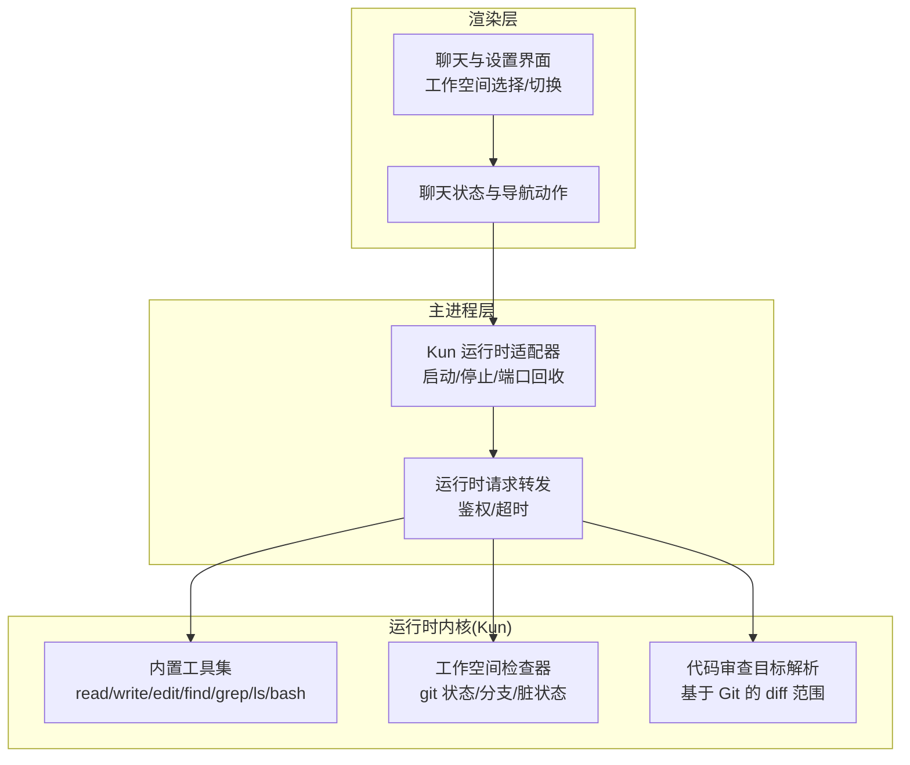
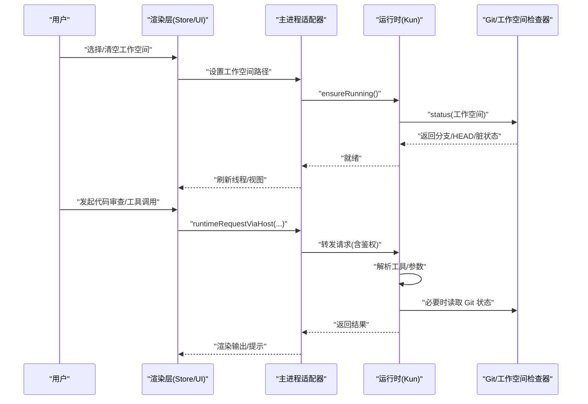
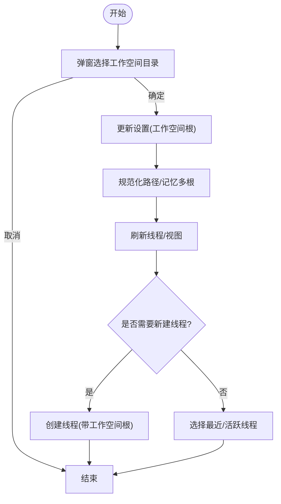
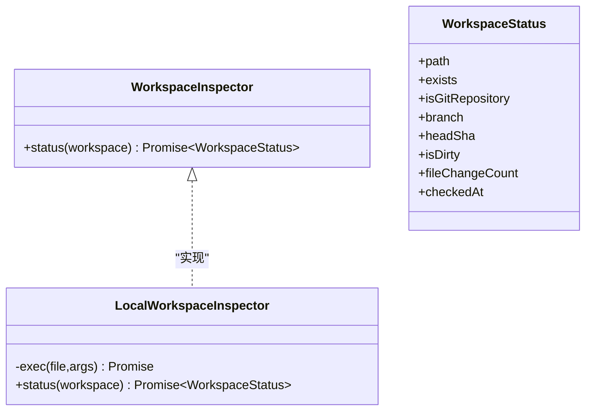
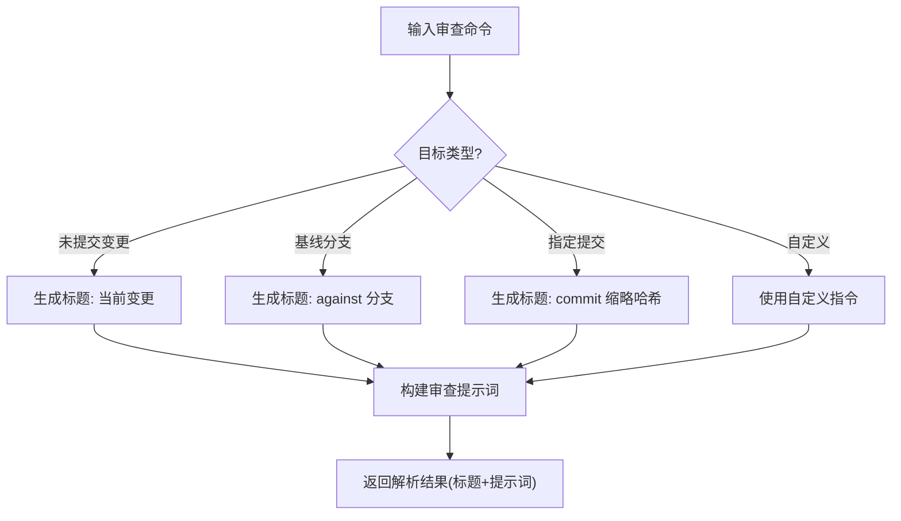
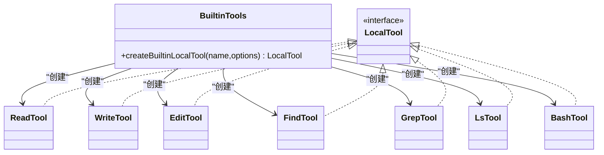
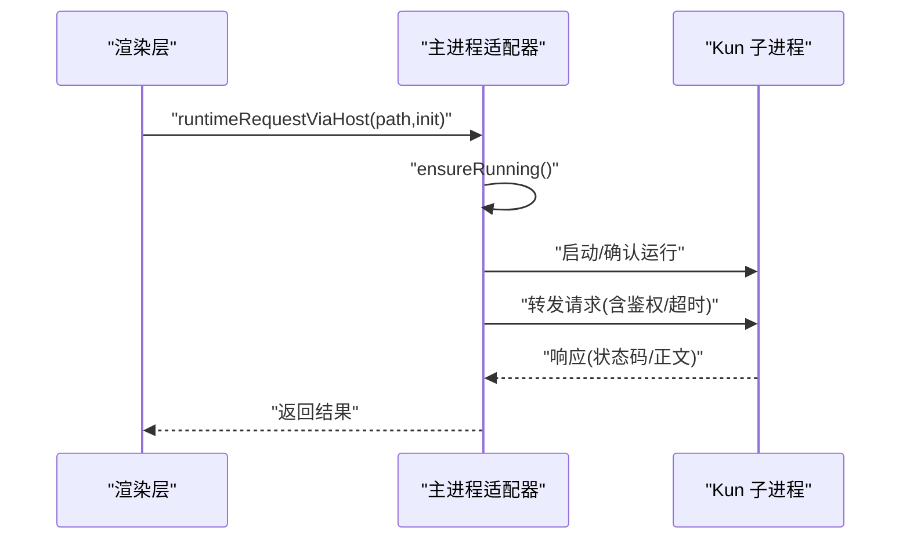
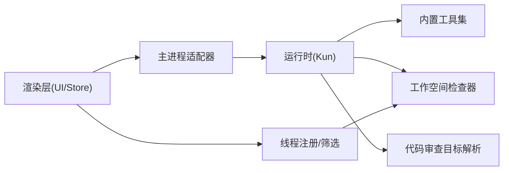

# Code 模式使用指南

<cite>
**本文引用的文件**
- [workspace-service.ts](file://src/main/services/workspace-service.ts)
- [chat-store-navigation-actions.ts](file://src/renderer/src/store/chat-store-navigation-actions.ts)
- [SettingsView.tsx](file://src/renderer/src/components/SettingsView.tsx)
- [local-workspace-inspector.ts](file://kun/src/adapters/workspace/local-workspace-inspector.ts)
- [workspace-inspector.ts](file://kun/src/ports/workspace-inspector.ts)
- [builtin-tools.ts](file://kun/src/adapters/tool/builtin-tools.ts)
- [builtin-tool-utils.ts](file://kun/src/adapters/tool/builtin-tool-utils.ts)
- [git-review-target.ts](file://kun/src/review/git-review-target.ts)
- [review.ts](file://kun/src/contracts/review.ts)
- [floating-composer-commands.ts](file://src/renderer/src/components/chat/floating-composer-commands.ts)
- [kun-adapter.ts](file://src/main/runtime/kun-adapter.ts)
- [DESIGN.md](file://DESIGN.md)
- [DESIGN.zh-CN.md](file://DESIGN.zh-CN.md)
- [write-thread-registry.ts](file://src/renderer/src/write/write-thread-registry.ts)
</cite>

## 目录
1. [简介](#简介)
2. [项目结构](#项目结构)
3. [核心组件](#核心组件)
4. [架构总览](#架构总览)
5. [详细组件分析](#详细组件分析)
6. [依赖关系分析](#依赖关系分析)
7. [性能考虑](#性能考虑)
8. [故障排除指南](#故障排除指南)
9. [结论](#结论)
10. [附录](#附录)

## 简介
本指南面向使用 Code 模式的开发者，系统讲解项目工作空间的设置与管理、文件变更监控机制、代码审查流程以及 Git 集成；同时说明智能体在项目中的工具调用、文件操作与代码补全能力，给出工作流最佳实践、常见问题解决方案与性能优化建议，并提供前端、后端、全栈三类开发场景的具体使用案例与操作步骤。

## 项目结构
Code 模式围绕“工作空间”展开，主要涉及以下层次：
- 渲染层：负责用户交互、工作空间选择、线程与视图管理
- 主进程层：负责运行时适配器、启动/停止子进程、请求转发
- 运行时内核（Kun）：提供工具集（读写/搜索/编辑/命令）、工作空间检查、代码审查目标解析
- Git 集成：通过本地工作区检查器与审查目标解析实现变更范围识别

图表来源
- [kun-adapter.ts:1-92](file://src/main/runtime/kun-adapter.ts#L1-L92)
- [DESIGN.md:970-992](file://DESIGN.md#L970-L992)
- [DESIGN.zh-CN.md:970-992](file://DESIGN.zh-CN.md#L970-L992)
- [local-workspace-inspector.ts:1-44](file://kun/src/adapters/workspace/local-workspace-inspector.ts#L1-L44)
- [git-review-target.ts:1-47](file://kun/src/review/git-review-target.ts#L1-L47)
- [builtin-tools.ts:1-41](file://kun/src/adapters/tool/builtin-tools.ts#L1-L41)

章节来源
- [workspace-service.ts:1-3](file://src/main/services/workspace-service.ts#L1-L3)
- [chat-store-navigation-actions.ts:418-468](file://src/renderer/src/store/chat-store-navigation-actions.ts#L418-L468)
- [SettingsView.tsx:606-647](file://src/renderer/src/components/SettingsView.tsx#L606-L647)

## 核心组件
- 工作空间选择与切换
  - 渲染层通过窗口桥接接口弹出工作空间选择对话框，更新设置并刷新线程列表
  - 支持清空工作空间，回到默认状态
- 工作空间检查器
  - 基于本地 git 命令查询仓库状态、分支、提交哈希与是否脏
- 内置工具集
  - 提供 read/write/edit/find/grep/ls/bash 等工具，统一入口创建本地工具实例
- 代码审查目标解析
  - 支持未提交变更、基线分支、指定提交或自定义指令，生成审查提示词与标题
- 运行时适配器
  - 解析可执行文件、确保运行、停止等待、端口回收、构建鉴权头、统一请求转发

章节来源
- [chat-store-navigation-actions.ts:418-468](file://src/renderer/src/store/chat-store-navigation-actions.ts#L418-L468)
- [SettingsView.tsx:606-647](file://src/renderer/src/components/SettingsView.tsx#L606-L647)
- [local-workspace-inspector.ts:16-44](file://kun/src/adapters/workspace/local-workspace-inspector.ts#L16-L44)
- [builtin-tools.ts:20-41](file://kun/src/adapters/tool/builtin-tools.ts#L20-L41)
- [git-review-target.ts:23-47](file://kun/src/review/git-review-target.ts#L23-L47)
- [kun-adapter.ts:29-92](file://src/main/runtime/kun-adapter.ts#L29-L92)

## 架构总览
下图展示从用户触发到运行时执行的关键路径，包括工作空间选择、运行时适配器、工具调用与 Git 审查目标解析。

图表来源
- [chat-store-navigation-actions.ts:418-468](file://src/renderer/src/store/chat-store-navigation-actions.ts#L418-L468)
- [kun-adapter.ts:86-92](file://src/main/runtime/kun-adapter.ts#L86-L92)
- [local-workspace-inspector.ts:30-44](file://kun/src/adapters/workspace/local-workspace-inspector.ts#L30-L44)
- [git-review-target.ts:23-47](file://kun/src/review/git-review-target.ts#L23-L47)

章节来源
- [DESIGN.md:970-992](file://DESIGN.md#L970-L992)
- [DESIGN.zh-CN.md:970-992](file://DESIGN.zh-CN.md#L970-L992)

## 详细组件分析

### 工作空间设置与管理
- 选择工作空间
  - 渲染层调用窗口桥接接口弹窗选择目录，成功后通过运行时客户端更新设置
  - 更新后规范化路径、记忆多个 Code 工作空间根，刷新线程并按需要打开写模式或选择最近线程
- 清空工作空间
  - 将设置中的工作空间路径清空，保持其他 Code 工作空间记录不变
- 设置页工作空间选择
  - 在设置页支持单独选择写模式默认工作空间，并维护去重的工作空间列表

图表来源
- [chat-store-navigation-actions.ts:418-468](file://src/renderer/src/store/chat-store-navigation-actions.ts#L418-L468)
- [SettingsView.tsx:606-647](file://src/renderer/src/components/SettingsView.tsx#L606-L647)

章节来源
- [chat-store-navigation-actions.ts:418-468](file://src/renderer/src/store/chat-store-navigation-actions.ts#L418-L468)
- [SettingsView.tsx:606-647](file://src/renderer/src/components/SettingsView.tsx#L606-L647)

### 文件变更监控机制
- 工作空间检查器
  - 若路径存在且为 Git 仓库，则返回分支、HEAD、是否脏、文件变更计数等信息
  - 若非 Git 仓库或不存在，返回空字段与存在性标记
- 使用场景
  - 在 Code 模式下，线程注册与视图联动会结合工作空间状态进行筛选与激活
  - 审查目标解析在需要时断言为 Git 工作区并计算差异范围

图表来源
- [workspace-inspector.ts:8-10](file://kun/src/ports/workspace-inspector.ts#L8-L10)
- [local-workspace-inspector.ts:16-44](file://kun/src/adapters/workspace/local-workspace-inspector.ts#L16-L44)

章节来源
- [local-workspace-inspector.ts:30-44](file://kun/src/adapters/workspace/local-workspace-inspector.ts#L30-L44)
- [write-thread-registry.ts:307-319](file://src/renderer/src/write/write-thread-registry.ts#L307-L319)

### 代码审查流程
- 审查目标类型
  - 未提交变更、基线分支、指定提交、自定义指令
- 命令解析
  - 浮动命令解析器支持多种别名与参数，自动识别目标类型
- 目标解析与提示词
  - 对 Git 工作区断言后，根据目标生成标题与提示词，限制差异大小以控制上下文

图表来源
- [floating-composer-commands.ts:90-124](file://src/renderer/src/components/chat/floating-composer-commands.ts#L90-L124)
- [git-review-target.ts:23-47](file://kun/src/review/git-review-target.ts#L23-L47)
- [review.ts:32-89](file://kun/src/contracts/review.ts#L32-L89)

章节来源
- [floating-composer-commands.ts:90-124](file://src/renderer/src/components/chat/floating-composer-commands.ts#L90-L124)
- [git-review-target.ts:23-47](file://kun/src/review/git-review-target.ts#L23-L47)
- [review.ts:32-89](file://kun/src/contracts/review.ts#L32-L89)

### Git 集成功能
- 本地工作区检查
  - 通过 shell 调用 git 获取分支、HEAD、脏状态等，不修改工作区
- 审查目标解析
  - 在解析审查目标时断言为 Git 工作区，限制差异字节数，避免过大上下文影响性能
- 命令别名与参数
  - 支持 base/branch/against/commit 等别名与参数组合，兼容自定义指令

章节来源
- [local-workspace-inspector.ts:16-44](file://kun/src/adapters/workspace/local-workspace-inspector.ts#L16-L44)
- [git-review-target.ts:23-47](file://kun/src/review/git-review-target.ts#L23-L47)
- [floating-composer-commands.ts:90-124](file://src/renderer/src/components/chat/floating-composer-commands.ts#L90-L124)

### 智能体工具调用与文件操作
- 工具注册与创建
  - 统一入口根据工具名称创建本地工具实例，覆盖读取、写入、编辑、查找、匹配、列出、命令执行等
- 边界与安全
  - 工具运行边界包装，捕获异常并标记错误输出，避免越界影响宿主
- 典型任务
  - 读取文件内容用于上下文注入
  - 搜索/匹配文件与文本，辅助定位
  - 执行 Bash 命令进行环境探测或脚本运行
  - 写入/编辑文件，配合差异生成与审查

图表来源
- [builtin-tools.ts:20-41](file://kun/src/adapters/tool/builtin-tools.ts#L20-L41)
- [builtin-tool-utils.ts:40-44](file://kun/src/adapters/tool/builtin-tool-utils.ts#L40-L44)

章节来源
- [builtin-tools.ts:20-41](file://kun/src/adapters/tool/builtin-tools.ts#L20-L41)
- [builtin-tool-utils.ts:40-44](file://kun/src/adapters/tool/builtin-tool-utils.ts#L40-L44)

### 运行时适配器与请求转发
- 可执行文件解析
  - 根据设置解析二进制或回退到 Node 脚本
- 生命周期管理
  - 启动/停止/端口回收，保证应用退出时资源释放
- 请求转发
  - 统一鉴权头(Bearer Token)、默认超时、JSON 响应头，作为单一入口转发请求

图表来源
- [kun-adapter.ts:86-92](file://src/main/runtime/kun-adapter.ts#L86-L92)
- [DESIGN.md:970-992](file://DESIGN.md#L970-L992)
- [DESIGN.zh-CN.md:970-992](file://DESIGN.zh-CN.md#L970-L992)

章节来源
- [kun-adapter.ts:29-92](file://src/main/runtime/kun-adapter.ts#L29-L92)

## 依赖关系分析
- 渲染层依赖主进程适配器进行运行时请求转发
- 主进程适配器依赖运行时内核（Kun），后者提供工具集与工作空间检查器
- 工具集与 Git 集成相互独立但可被审查流程复用
- 线程注册与工作空间状态联动，确保 Code 场景下的线程筛选与激活

图表来源
- [kun-adapter.ts:29-92](file://src/main/runtime/kun-adapter.ts#L29-L92)
- [builtin-tools.ts:20-41](file://kun/src/adapters/tool/builtin-tools.ts#L20-L41)
- [local-workspace-inspector.ts:16-44](file://kun/src/adapters/workspace/local-workspace-inspector.ts#L16-L44)
- [write-thread-registry.ts:307-319](file://src/renderer/src/write/write-thread-registry.ts#L307-L319)

章节来源
- [chat-store-navigation-actions.ts:418-468](file://src/renderer/src/store/chat-store-navigation-actions.ts#L418-L468)
- [write-thread-registry.ts:307-319](file://src/renderer/src/write/write-thread-registry.ts#L307-L319)

## 性能考虑
- 控制审查上下文大小
  - 审查目标解析对差异大小有限制，避免过大的 diff 影响模型上下文与响应时间
- 工具边界与超时
  - 工具运行边界包装减少异常扩散；运行时请求默认超时策略保障稳定性
- 端口回收与重启
  - 适配器提供端口回收能力，避免端口占用导致的阻塞
- 线程筛选与视图刷新
  - 仅对 Code 线程进行筛选与激活，减少无关线程带来的渲染压力

章节来源
- [git-review-target.ts:8-11](file://kun/src/review/git-review-target.ts#L8-L11)
- [builtin-tool-utils.ts:40-44](file://kun/src/adapters/tool/builtin-tool-utils.ts#L40-L44)
- [kun-adapter.ts:61-63](file://src/main/runtime/kun-adapter.ts#L61-L63)
- [chat-store-navigation-actions.ts:448-459](file://src/renderer/src/store/chat-store-navigation-actions.ts#L448-L459)

## 故障排除指南
- 无法选择工作空间
  - 现象：弹窗不可用或选择后无响应
  - 排查：确认窗口桥接接口可用；检查设置更新与线程刷新逻辑
- 清空工作空间无效
  - 现象：设置未清空或线程未刷新
  - 排查：确认清空流程调用运行时客户端更新设置并刷新线程
- 审查目标解析失败
  - 现象：提示非 Git 工作区或差异过大
  - 排查：确认工作区为 Git 仓库；检查差异大小限制；验证命令别名与参数
- 工具调用报错
  - 现象：工具执行异常或输出为空
  - 排查：查看工具边界包装的错误标记；确认路径与权限；检查 Bash 配置

章节来源
- [chat-store-navigation-actions.ts:421-423](file://src/renderer/src/store/chat-store-navigation-actions.ts#L421-L423)
- [chat-store-navigation-actions.ts:470-482](file://src/renderer/src/store/chat-store-navigation-actions.ts#L470-L482)
- [git-review-target.ts:45-47](file://kun/src/review/git-review-target.ts#L45-L47)
- [builtin-tool-utils.ts:40-44](file://kun/src/adapters/tool/builtin-tool-utils.ts#L40-L44)

## 结论
Code 模式通过清晰的工作空间管理、可靠的运行时适配器、完善的工具集与 Git 集成，为开发者提供了高效稳定的代码协作体验。遵循本文的最佳实践与排障建议，可在不同开发场景中获得一致且高性能的使用效果。

## 附录

### 工作流最佳实践
- 选择合适的工作空间根，确保为 Git 仓库以便启用审查与状态监控
- 在写模式下优先使用“最近线程”或“新建线程”，并绑定工作空间根
- 使用审查命令时明确目标类型，避免过大的差异上下文
- 利用工具集进行文件检索与上下文读取，减少手工定位成本

章节来源
- [chat-store-navigation-actions.ts:448-460](file://src/renderer/src/store/chat-store-navigation-actions.ts#L448-L460)
- [floating-composer-commands.ts:90-124](file://src/renderer/src/components/chat/floating-composer-commands.ts#L90-L124)

### 常见问题解决方案
- 无法弹出工作空间选择
  - 确认窗口桥接接口可用；若不可用，检查渲染层与主进程通信链路
- 审查目标解析报错
  - 确保工作区为 Git 仓库；必要时切换到基线分支或指定提交
- 工具执行失败
  - 检查路径是否存在、权限是否足够；调整 Bash 配置或改用其他工具

章节来源
- [chat-store-navigation-actions.ts:421-423](file://src/renderer/src/store/chat-store-navigation-actions.ts#L421-L423)
- [git-review-target.ts:45-47](file://kun/src/review/git-review-target.ts#L45-L47)
- [builtin-tool-utils.ts:40-44](file://kun/src/adapters/tool/builtin-tool-utils.ts#L40-L44)

### 性能优化建议
- 控制审查差异大小，避免超大 diff 导致上下文膨胀
- 合理使用工具边界包装，减少异常传播与重试开销
- 使用端口回收与优雅停机，避免资源泄漏
- 仅对 Code 线程进行筛选与激活，降低渲染与存储压力

章节来源
- [git-review-target.ts:8-11](file://kun/src/review/git-review-target.ts#L8-L11)
- [builtin-tool-utils.ts:40-44](file://kun/src/adapters/tool/builtin-tool-utils.ts#L40-L44)
- [kun-adapter.ts:61-63](file://src/main/runtime/kun-adapter.ts#L61-L63)
- [chat-store-navigation-actions.ts:448-459](file://src/renderer/src/store/chat-store-navigation-actions.ts#L448-L459)

### 开发场景使用案例

#### 前端开发
- 设置工作空间为前端项目根目录，确保 Git 仓库状态可监控
- 使用“查找/匹配”工具定位组件文件，结合“读取”工具注入上下文
- 发起审查命令对比未提交变更，聚焦样式与交互相关改动
- 使用 Bash 工具执行构建/测试脚本，观察输出并据此修复

章节来源
- [builtin-tools.ts:20-41](file://kun/src/adapters/tool/builtin-tools.ts#L20-L41)
- [git-review-target.ts:23-47](file://kun/src/review/git-review-target.ts#L23-L47)

#### 后端开发
- 设置工作空间为后端服务根目录，启用审查以对比分支差异
- 使用“编辑”工具批量修改配置或日志级别，结合“读取”工具校验上下文
- 使用 Bash 工具运行数据库迁移或服务启动脚本，观察状态
- 通过工作空间检查器确认 HEAD 与脏状态，避免误提交

章节来源
- [builtin-tools.ts:20-41](file://kun/src/adapters/tool/builtin-tools.ts#L20-L41)
- [local-workspace-inspector.ts:30-44](file://kun/src/adapters/workspace/local-workspace-inspector.ts#L30-L44)

#### 全栈开发
- 在根工作空间下分别创建前后端线程，绑定各自工作空间根
- 使用“列出”工具快速浏览目录结构，结合“匹配/查找”定位关键文件
- 审查命令对比基线分支，关注跨端接口变更与数据迁移
- 使用 Bash 工具统一执行集成测试脚本，汇总输出并修复问题

章节来源
- [builtin-tools.ts:20-41](file://kun/src/adapters/tool/builtin-tools.ts#L20-L41)
- [git-review-target.ts:23-47](file://kun/src/review/git-review-target.ts#L23-L47)
- [write-thread-registry.ts:307-319](file://src/renderer/src/write/write-thread-registry.ts#L307-L319)