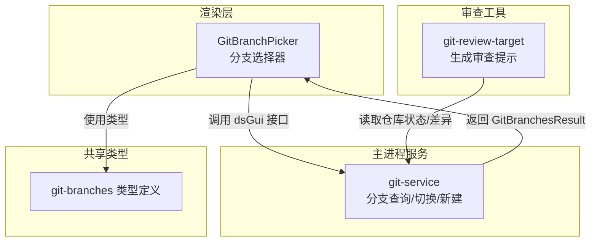
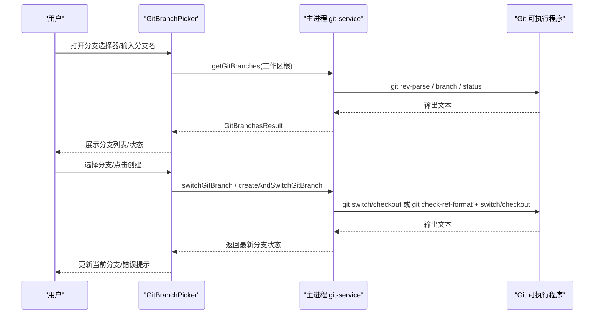
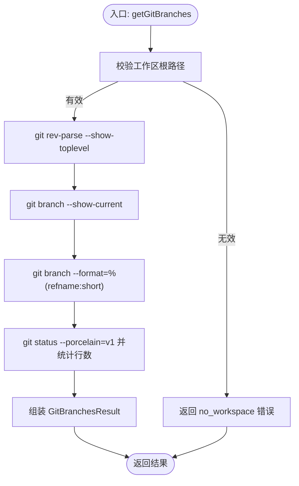
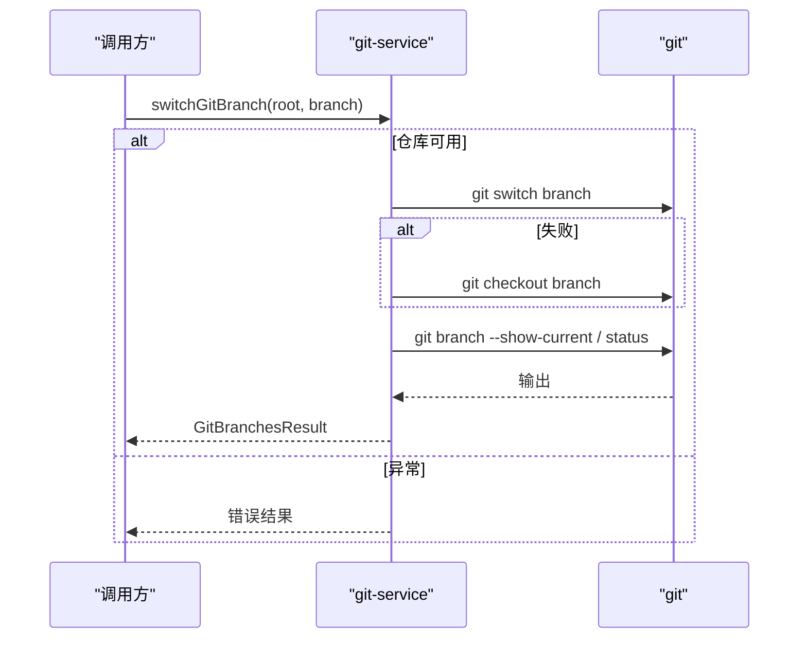
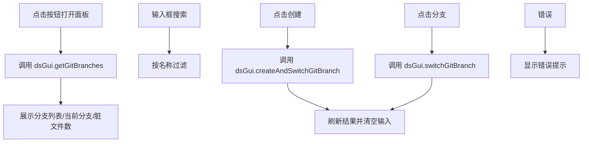
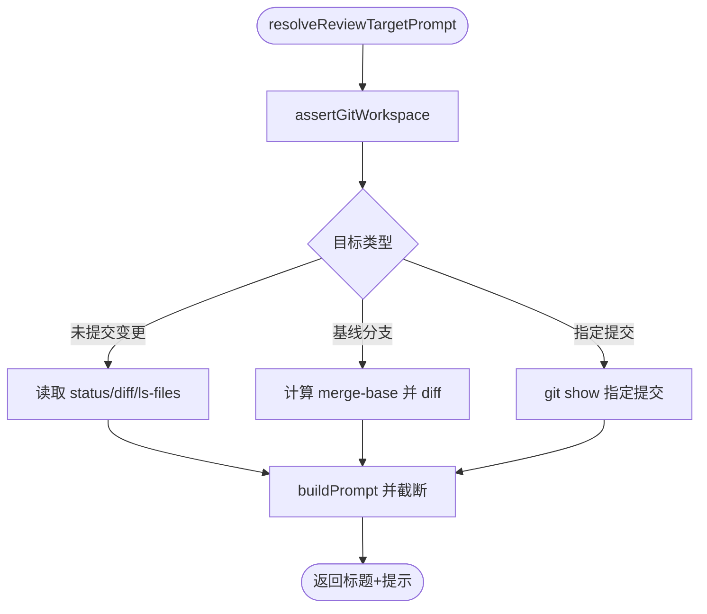
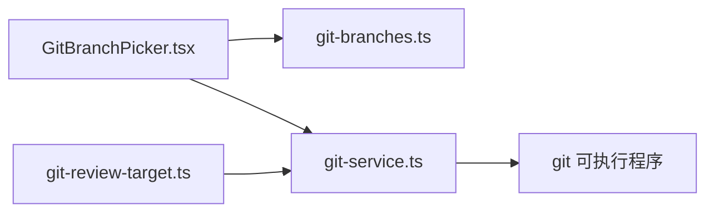

# Git 集成

<cite>
**本文引用的文件**
- [src/main/services/git-service.ts](file://src/main/services/git-service.ts)
- [src/shared/git-branches.ts](file://src/shared/git-branches.ts)
- [src/renderer/src/components/chat/GitBranchPicker.tsx](file://src/renderer/src/components/chat/GitBranchPicker.tsx)
- [kun/src/review/git-review-target.ts](file://kun/src/review/git-review-target.ts)
- [docs/DEVELOPMENT.md](file://docs/DEVELOPMENT.md)
- [docs/DEVELOPMENT.zh-CN.md](file://docs/DEVELOPMENT.zh-CN.md)
</cite>

## 目录
1. [简介](#简介)
2. [项目结构](#项目结构)
3. [核心组件](#核心组件)
4. [架构总览](#架构总览)
5. [组件详解](#组件详解)
6. [依赖关系分析](#依赖关系分析)
7. [性能考量](#性能考量)
8. [故障排查指南](#故障排查指南)
9. [结论](#结论)
10. [附录](#附录)

## 简介
本指南面向使用 DeepSeek-GUI 的开发者与团队，系统讲解智能体如何与 Git 仓库交互，覆盖分支管理、切换与新建、工作区状态检测、代码审查提示生成等能力，并结合项目内置的开发工作流文档，给出团队协作场景下的配置建议、安全最佳实践与常见问题解决方案。

## 项目结构
与 Git 集成相关的核心位置分布在主进程服务层、共享类型层、渲染层 UI 组件以及审查工具层：
- 主进程服务：封装底层 git 命令调用，提供分支查询、切换、新建等能力
- 共享类型：统一前后端交互的数据结构
- 渲染层组件：提供分支选择器 UI，支持搜索、创建、切换
- 审查工具：根据目标（未提交变更、基线分支、指定提交）生成可注入模型的审查提示

图表来源
- [src/renderer/src/components/chat/GitBranchPicker.tsx:10-124](file://src/renderer/src/components/chat/GitBranchPicker.tsx#L10-L124)
- [src/main/services/git-service.ts:31-98](file://src/main/services/git-service.ts#L31-L98)
- [src/shared/git-branches.ts:1-19](file://src/shared/git-branches.ts#L1-L19)
- [kun/src/review/git-review-target.ts:23-54](file://kun/src/review/git-review-target.ts#L23-L54)

章节来源
- [src/main/services/git-service.ts:1-99](file://src/main/services/git-service.ts#L1-L99)
- [src/shared/git-branches.ts:1-19](file://src/shared/git-branches.ts#L1-L19)
- [src/renderer/src/components/chat/GitBranchPicker.tsx:1-237](file://src/renderer/src/components/chat/GitBranchPicker.tsx#L1-L237)
- [kun/src/review/git-review-target.ts:1-222](file://kun/src/review/git-review-target.ts#L1-L222)

## 核心组件
- 分支查询与状态：主进程通过 git 子进程调用解析仓库根目录、当前分支、所有分支列表与工作区脏文件计数
- 分支切换与新建：支持 switch/checkout 两种路径，自动回退兼容；新建分支前进行分支名合法性校验
- 分支选择器 UI：提供搜索过滤、创建新分支、切换当前分支的交互入口
- 审查提示生成：根据目标类型（未提交变更、基线分支、指定提交）拼装差异与状态信息，限制提示长度

章节来源
- [src/main/services/git-service.ts:31-98](file://src/main/services/git-service.ts#L31-L98)
- [src/shared/git-branches.ts:1-19](file://src/shared/git-branches.ts#L1-L19)
- [src/renderer/src/components/chat/GitBranchPicker.tsx:78-120](file://src/renderer/src/components/chat/GitBranchPicker.tsx#L78-L120)
- [kun/src/review/git-review-target.ts:23-149](file://kun/src/review/git-review-target.ts#L23-L149)

## 架构总览
下图展示从 UI 到主进程再到 Git 命令的完整调用链路，以及审查工具对仓库状态的读取。

图表来源
- [src/renderer/src/components/chat/GitBranchPicker.tsx:22-120](file://src/renderer/src/components/chat/GitBranchPicker.tsx#L22-L120)
- [src/main/services/git-service.ts:31-98](file://src/main/services/git-service.ts#L31-L98)

## 组件详解

### 分支查询与状态（主进程）
- 功能要点
  - 解析仓库根目录、当前分支、所有分支集合
  - 计算工作区“脏”文件数量（含暂存与未暂存）
  - 错误分类：非 Git 仓库、找不到 git 可执行文件、其他异常
- 关键行为
  - 使用子进程执行 git 命令，设置超时与缓冲区上限
  - 对分支名进行去重与补全（若当前分支不在枚举列表中则补充）

图表来源
- [src/main/services/git-service.ts:31-57](file://src/main/services/git-service.ts#L31-L57)

章节来源
- [src/main/services/git-service.ts:31-57](file://src/main/services/git-service.ts#L31-L57)

### 分支切换与新建（主进程）
- 功能要点
  - 切换：优先尝试 switch，失败回退到 checkout
  - 新建：先校验分支名合法性，再尝试 switch -c，失败回退 checkout -b
  - 统一返回最新分支状态
- 错误处理
  - 对不可用的 git 可执行文件、非 Git 仓库等进行分类提示

图表来源
- [src/main/services/git-service.ts:59-77](file://src/main/services/git-service.ts#L59-L77)

章节来源
- [src/main/services/git-service.ts:59-98](file://src/main/services/git-service.ts#L59-L98)

### 分支选择器 UI（渲染层）
- 功能要点
  - 加载分支列表与当前分支标签
  - 支持搜索过滤分支名称
  - 创建新分支并自动切换
  - 显示工作区脏文件数量（当前分支）
  - 错误提示与加载态
- 用户交互
  - 点击按钮打开面板
  - 输入框支持回车创建
  - 点击分支触发切换
  - 点击外部区域关闭面板

图表来源
- [src/renderer/src/components/chat/GitBranchPicker.tsx:22-120](file://src/renderer/src/components/chat/GitBranchPicker.tsx#L22-L120)

章节来源
- [src/renderer/src/components/chat/GitBranchPicker.tsx:10-237](file://src/renderer/src/components/chat/GitBranchPicker.tsx#L10-L237)

### 审查提示生成（审查工具）
- 功能要点
  - 支持三种目标：未提交变更、基线分支、指定提交
  - 自动断言工作区为 Git 仓库
  - 并行读取状态、暂存/未暂存差异与未跟踪文件
  - 限制提示最大字节，超出则截断并提示使用只读工具查看上下文
- 数据来源
  - git status、diff、ls-files、merge-base、show 等命令输出

图表来源
- [kun/src/review/git-review-target.ts:23-149](file://kun/src/review/git-review-target.ts#L23-L149)

章节来源
- [kun/src/review/git-review-target.ts:23-222](file://kun/src/review/git-review-target.ts#L23-L222)

## 依赖关系分析
- 类型依赖
  - 渲染层组件依赖共享类型定义的 GitBranchesResult
- 运行时依赖
  - 渲染层通过 window.dsGui 调用主进程接口
  - 主进程直接调用系统 git 可执行文件
  - 审查工具同样直接调用 git，但封装在独立模块中

图表来源
- [src/renderer/src/components/chat/GitBranchPicker.tsx:1-10](file://src/renderer/src/components/chat/GitBranchPicker.tsx#L1-L10)
- [src/shared/git-branches.ts:1-19](file://src/shared/git-branches.ts#L1-L19)
- [src/main/services/git-service.ts:1-18](file://src/main/services/git-service.ts#L1-L18)
- [kun/src/review/git-review-target.ts:1-10](file://kun/src/review/git-review-target.ts#L1-L10)

章节来源
- [src/renderer/src/components/chat/GitBranchPicker.tsx:1-10](file://src/renderer/src/components/chat/GitBranchPicker.tsx#L1-L10)
- [src/shared/git-branches.ts:1-19](file://src/shared/git-branches.ts#L1-L19)
- [src/main/services/git-service.ts:1-18](file://src/main/services/git-service.ts#L1-L18)
- [kun/src/review/git-review-target.ts:1-10](file://kun/src/review/git-review-target.ts#L1-L10)

## 性能考量
- 命令执行与缓冲
  - 主进程与审查工具均对 git 命令设置超时与缓冲区上限，避免长时间阻塞
- 并行读取
  - 审查工具对状态、暂存/未暂存差异与未跟踪文件采用并行读取，缩短等待时间
- 结果截断
  - 审查提示按最大字节截断，防止提示过长导致模型处理压力

章节来源
- [src/main/services/git-service.ts:7-18](file://src/main/services/git-service.ts#L7-L18)
- [kun/src/review/git-review-target.ts:8-10](file://kun/src/review/git-review-target.ts#L8-L10)
- [kun/src/review/git-review-target.ts:155-178](file://kun/src/review/git-review-target.ts#L155-L178)
- [kun/src/review/git-review-target.ts:180-197](file://kun/src/review/git-review-target.ts#L180-L197)

## 故障排查指南
- 常见错误与原因
  - 非 Git 仓库：工作区根路径不是仓库根
  - Git 不可用：系统未安装或 PATH 未包含 git
  - 其他异常：权限不足、命令超时、子进程异常
- 定位步骤
  - 检查工作区根路径是否正确
  - 确认系统已安装 git 并可在命令行执行
  - 查看 UI 错误提示或日志中的具体错误消息
- 处理建议
  - 切换分支失败时，优先尝试重新加载分支列表
  - 新建分支前确保分支名符合 Git 规范
  - 审查提示过长时，使用只读工具进一步查看上下文

章节来源
- [src/main/services/git-service.ts:20-29](file://src/main/services/git-service.ts#L20-L29)
- [src/renderer/src/components/chat/GitBranchPicker.tsx:176-181](file://src/renderer/src/components/chat/GitBranchPicker.tsx#L176-L181)

## 结论
本项目通过主进程服务封装 Git 命令，配合渲染层 UI 与审查工具，实现了从分支管理到代码审查的闭环能力。结合开发工作流文档，团队可在统一的分支策略与 PR 流程下高效协作。建议在生产环境中关注 Git 可执行文件可用性、网络代理与权限配置，并遵循最小化提交、清晰分支命名与充分自测的实践。

## 附录

### 团队协作与工作流
- 默认分支与目标分支：以 develop 作为日常集成分支，master 用于稳定发布
- 推荐流程：从 develop 拉取最新 -> 创建短期功能分支 -> 本地实现与验证 -> 推送分支 -> 提交 PR 至 develop
- PR 前校验：类型检查、构建、测试；如影响运行时或 UI，建议本地启动验证

章节来源
- [docs/DEVELOPMENT.md:7-22](file://docs/DEVELOPMENT.md#L7-L22)
- [docs/DEVELOPMENT.zh-CN.md:7-22](file://docs/DEVELOPMENT.zh-CN.md#L7-L22)

### 安全最佳实践
- 本地凭据与远程访问
  - 使用 SSH 密钥或令牌访问私有仓库，避免明文密码
  - 在 CI/CD 环境中妥善管理机密变量
- 权限与隔离
  - 限制对 master 的直接推送，仅允许通过受审 PR 合并
  - 对关键分支启用保护规则（如必需审查、状态检查）

章节来源
- [docs/DEVELOPMENT.md:47-60](file://docs/DEVELOPMENT.md#L47-L60)
- [docs/DEVELOPMENT.zh-CN.md:47-60](file://docs/DEVELOPMENT.zh-CN.md#L47-L60)