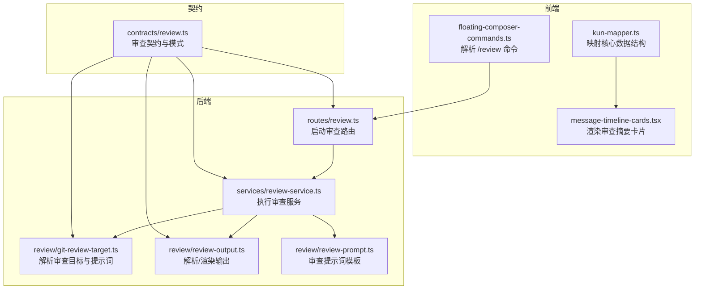
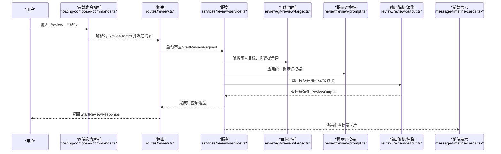
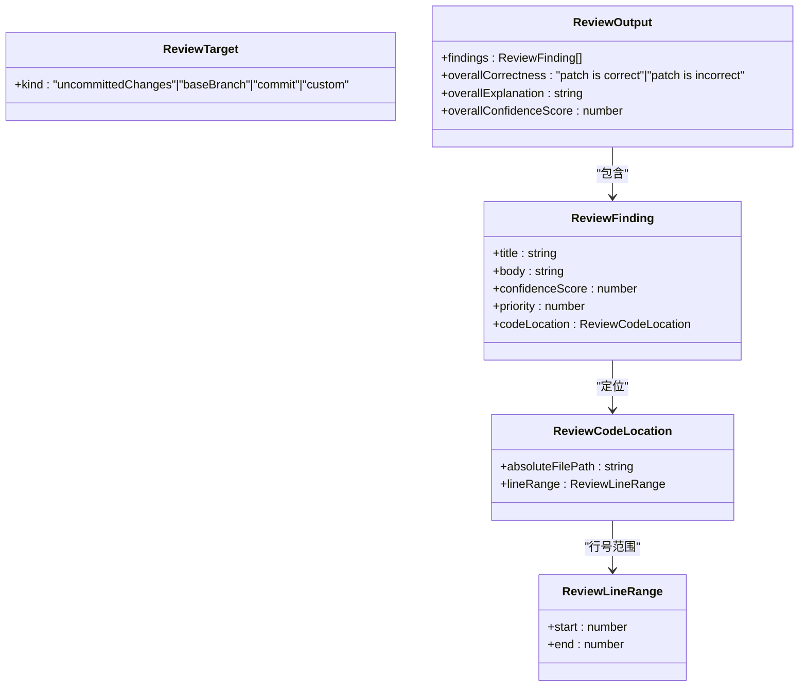
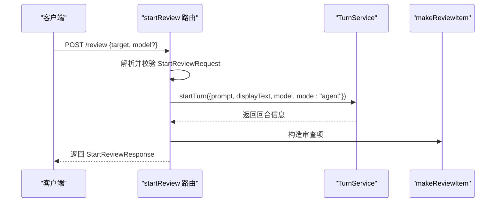
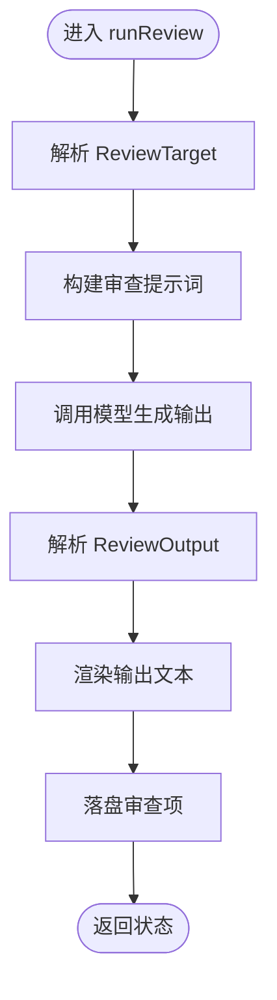
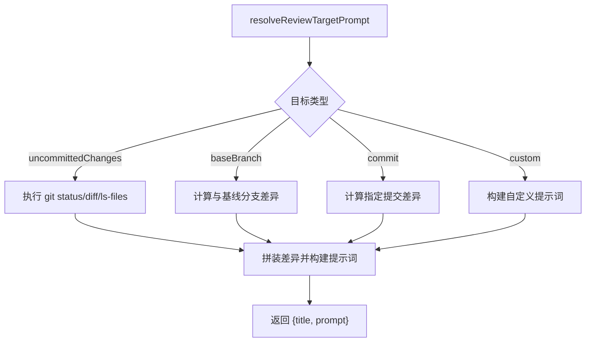
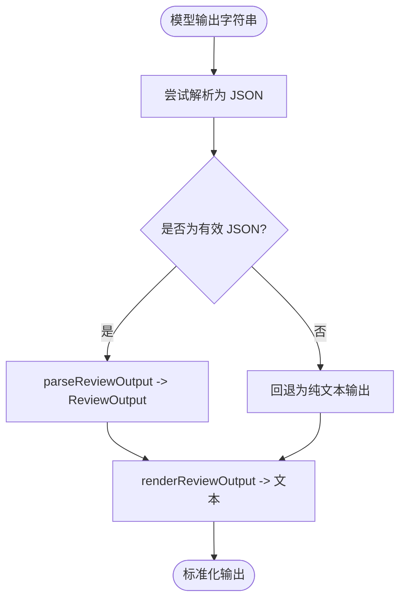
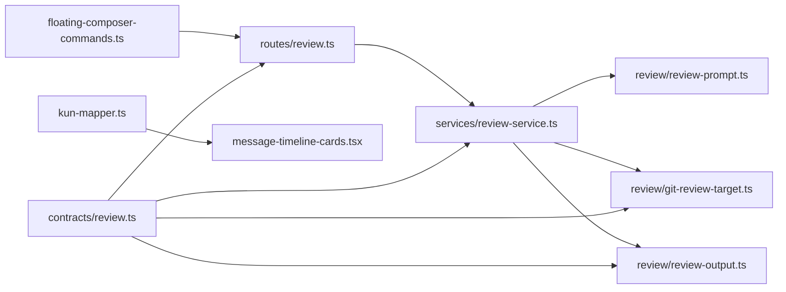

# 代码审查工作流

<cite>
**本文档引用的文件**
- [kun/src/contracts/review.ts](file://kun/src/contracts/review.ts)
- [kun/src/review/git-review-target.ts](file://kun/src/review/git-review-target.ts)
- [kun/src/review/review-output.ts](file://kun/src/review/review-output.ts)
- [kun/src/review/review-prompt.ts](file://kun/src/review/review-prompt.ts)
- [kun/src/services/review-service.ts](file://kun/src/services/review-service.ts)
- [kun/src/server/routes/review.ts](file://kun/src/server/routes/review.ts)
- [kun/tests/review.test.ts](file://kun/tests/review.test.ts)
- [src/renderer/src/components/chat/floating-composer-commands.ts](file://src/renderer/src/components/chat/floating-composer-commands.ts)
- [src/renderer/src/agent/kun-mapper.ts](file://src/renderer/src/agent/kun-mapper.ts)
- [src/renderer/src/components/chat/message-timeline-cards.tsx](file://src/renderer/src/components/chat/message-timeline-cards.tsx)
</cite>

## 目录
1. [引言](#引言)
2. [项目结构](#项目结构)
3. [核心组件](#核心组件)
4. [架构总览](#架构总览)
5. [详细组件分析](#详细组件分析)
6. [依赖关系分析](#依赖关系分析)
7. [性能考量](#性能考量)
8. [故障排查指南](#故障排查指南)
9. [结论](#结论)
10. [附录](#附录)

## 引言
本指南面向需要在 DeepSeek-GUI 代码库中落地“代码审查工作流”的工程师与技术管理者，系统阐述审查目标的确定、审查范围的设定、审查标准与规则配置、审查结果生成与展示、质量评估指标、不同编程语言的审查策略、报告解读与改进建议、最佳实践、自动化配置与人工复核流程。文档基于仓库中的审查契约、服务实现、路由处理、前端命令解析与渲染等模块进行深入分析，并提供可视化图示帮助理解端到端流程。

## 项目结构
审查能力由后端服务层、路由层、契约层与前端交互层协同完成：
- 契约层：定义审查目标类型、请求/响应结构、输出格式与标题/提示词生成逻辑
- 路由层：接收前端发起的审查启动请求，构造对话回合（turn）并落盘审查项
- 服务层：解析审查目标、构建审查提示词、调用模型生成审查结果、解析与渲染输出
- 前端层：解析用户输入的审查命令、展示审查卡片与状态、映射核心数据结构

图表来源
- [kun/src/server/routes/review.ts:1-41](file://kun/src/server/routes/review.ts#L1-L41)
- [kun/src/services/review-service.ts:19-57](file://kun/src/services/review-service.ts#L19-L57)
- [kun/src/review/git-review-target.ts:1-82](file://kun/src/review/git-review-target.ts#L1-L82)
- [kun/src/review/review-output.ts](file://kun/src/review/review-output.ts)
- [kun/src/review/review-prompt.ts](file://kun/src/review/review-prompt.ts)
- [kun/src/contracts/review.ts:1-89](file://kun/src/contracts/review.ts#L1-L89)
- [src/renderer/src/components/chat/floating-composer-commands.ts:90-121](file://src/renderer/src/components/chat/floating-composer-commands.ts#L90-L121)
- [src/renderer/src/agent/kun-mapper.ts:592-625](file://src/renderer/src/agent/kun-mapper.ts#L592-L625)
- [src/renderer/src/components/chat/message-timeline-cards.tsx:68-87](file://src/renderer/src/components/chat/message-timeline-cards.tsx#L68-L87)

章节来源
- [kun/src/contracts/review.ts:1-89](file://kun/src/contracts/review.ts#L1-L89)
- [kun/src/server/routes/review.ts:1-41](file://kun/src/server/routes/review.ts#L1-L41)
- [kun/src/services/review-service.ts:19-57](file://kun/src/services/review-service.ts#L19-L57)
- [kun/src/review/git-review-target.ts:1-82](file://kun/src/review/git-review-target.ts#L1-L82)
- [kun/src/review/review-output.ts](file://kun/src/review/review-output.ts)
- [kun/src/review/review-prompt.ts](file://kun/src/review/review-prompt.ts)
- [src/renderer/src/components/chat/floating-composer-commands.ts:90-121](file://src/renderer/src/components/chat/floating-composer-commands.ts#L90-L121)
- [src/renderer/src/agent/kun-mapper.ts:592-625](file://src/renderer/src/agent/kun-mapper.ts#L592-L625)
- [src/renderer/src/components/chat/message-timeline-cards.tsx:68-87](file://src/renderer/src/components/chat/message-timeline-cards.tsx#L68-L87)

## 核心组件
- 审查目标与契约
  - 支持四种目标：未提交变更、基于基线分支、指定提交、自定义指令
  - 定义审查请求、响应、输出结构与校验模式
- 审查路由
  - 解析请求体、校验契约、启动对话回合、落盘审查项
- 审查服务
  - 解析目标、构建提示词、调用模型、解析与渲染输出
- 提示词与输出
  - 统一的审查提示词模板与输出解析/渲染工具
- 前端命令与展示
  - 解析 /review 命令、映射核心数据、渲染审查摘要卡片

章节来源
- [kun/src/contracts/review.ts:32-89](file://kun/src/contracts/review.ts#L32-L89)
- [kun/src/server/routes/review.ts:13-41](file://kun/src/server/routes/review.ts#L13-L41)
- [kun/src/services/review-service.ts:51-57](file://kun/src/services/review-service.ts#L51-L57)
- [kun/src/review/git-review-target.ts:23-54](file://kun/src/review/git-review-target.ts#L23-L54)
- [kun/src/review/review-output.ts](file://kun/src/review/review-output.ts)
- [kun/src/review/review-prompt.ts](file://kun/src/review/review-prompt.ts)
- [src/renderer/src/components/chat/floating-composer-commands.ts:90-121](file://src/renderer/src/components/chat/floating-composer-commands.ts#L90-L121)
- [src/renderer/src/agent/kun-mapper.ts:592-625](file://src/renderer/src/agent/kun-mapper.ts#L592-L625)
- [src/renderer/src/components/chat/message-timeline-cards.tsx:68-87](file://src/renderer/src/components/chat/message-timeline-cards.tsx#L68-L87)

## 架构总览
审查工作流从用户输入的 /review 命令开始，经由路由层进入服务层，服务层根据目标类型解析出具体的审查提示词，调用模型生成审查结果，随后解析与渲染输出并在前端以卡片形式呈现。

图表来源
- [src/renderer/src/components/chat/floating-composer-commands.ts:90-121](file://src/renderer/src/components/chat/floating-composer-commands.ts#L90-L121)
- [kun/src/server/routes/review.ts:13-41](file://kun/src/server/routes/review.ts#L13-L41)
- [kun/src/services/review-service.ts:51-57](file://kun/src/services/review-service.ts#L51-L57)
- [kun/src/review/git-review-target.ts:23-54](file://kun/src/review/git-review-target.ts#L23-L54)
- [kun/src/review/review-prompt.ts](file://kun/src/review/review-prompt.ts)
- [kun/src/review/review-output.ts](file://kun/src/review/review-output.ts)
- [src/renderer/src/components/chat/message-timeline-cards.tsx:68-87](file://src/renderer/src/components/chat/message-timeline-cards.tsx#L68-L87)

## 详细组件分析

### 审查目标与契约
- 目标类型
  - 未提交变更：审查当前工作区的暂存、未暂存与未跟踪变更
  - 基于基线分支：对比指定分支的差异
  - 指定提交：审查特定提交的变更
  - 自定义指令：提供自由文本的审查要求
- 输出结构
  - 包含若干审查发现（标题、正文、置信度、优先级、代码位置），以及总体正确性、解释与置信度评分
- 标题与提示词
  - 不同目标对应不同的显示标题与内部提示词指令

图表来源
- [kun/src/contracts/review.ts:1-89](file://kun/src/contracts/review.ts#L1-L89)

章节来源
- [kun/src/contracts/review.ts:32-89](file://kun/src/contracts/review.ts#L32-L89)

### 审查路由与启动流程
- 路由层负责读取请求体、校验 StartReviewRequest、生成显示标题与提示词、启动对话回合并落盘审查项
- 返回 StartReviewResponse，包含线程、回合、用户消息与审查项 ID

图表来源
- [kun/src/server/routes/review.ts:13-41](file://kun/src/server/routes/review.ts#L13-L41)

章节来源
- [kun/src/server/routes/review.ts:13-41](file://kun/src/server/routes/review.ts#L13-L41)

### 审查服务与执行流程
- 服务层接收 threadId、turnId、reviewItemId、target 与可选 model
- 解析目标、构建提示词、调用模型、解析输出、渲染文本并落盘
- 返回执行状态（完成/失败/中止）

图表来源
- [kun/src/services/review-service.ts:51-57](file://kun/src/services/review-service.ts#L51-L57)
- [kun/src/review/git-review-target.ts:23-54](file://kun/src/review/git-review-target.ts#L23-L54)
- [kun/src/review/review-output.ts](file://kun/src/review/review-output.ts)

章节来源
- [kun/src/services/review-service.ts:51-57](file://kun/src/services/review-service.ts#L51-L57)

### 审查目标解析与提示词构建
- 支持自定义指令与 Git 工作区目标
- 对未提交变更、基线分支、指定提交分别执行相应的 Git 操作，拼装差异内容
- 使用统一模板构建最终提示词，限制差异大小以控制上下文成本

图表来源
- [kun/src/review/git-review-target.ts:23-82](file://kun/src/review/git-review-target.ts#L23-L82)

章节来源
- [kun/src/review/git-review-target.ts:23-82](file://kun/src/review/git-review-target.ts#L23-L82)

### 输出解析与渲染
- 支持 Codex 风格 snake_case JSON 与纯文本两种输出
- 解析为标准化 ReviewOutput 结构，渲染为可读文本（包含文件路径与行号范围）

图表来源
- [kun/src/review/review-output.ts](file://kun/src/review/review-output.ts)
- [kun/tests/review.test.ts:41-68](file://kun/tests/review.test.ts#L41-L68)

章节来源
- [kun/src/review/review-output.ts](file://kun/src/review/review-output.ts)
- [kun/tests/review.test.ts:41-68](file://kun/tests/review.test.ts#L41-L68)

### 前端命令解析与展示
- 命令解析
  - /review、/review base/branch/against、/review commit、/review 自定义指令
  - 将用户输入映射为 ReviewTarget
- 数据映射
  - 将核心数据结构映射为前端可用的 ReviewTarget 与 ReviewOutput
- 展示卡片
  - 根据状态（运行中/成功/失败）、总体正确性与发现数量渲染不同图标与文案

```mermaid
sequenceDiagram
participant U as "用户"
participant P as "命令解析<br/>floating-composer-commands.ts"
participant M as "数据映射<br/>kun-mapper.ts"
participant V as "卡片渲染<br/>message-timeline-cards.tsx"
U->>P : 输入 "/review ..." 命令
P-->>M : 生成 ReviewTarget
M-->>V : 映射 ReviewOutput
V-->>U : 渲染审查摘要卡片
```

图表来源
- [src/renderer/src/components/chat/floating-composer-commands.ts:90-121](file://src/renderer/src/components/chat/floating-composer-commands.ts#L90-L121)
- [src/renderer/src/agent/kun-mapper.ts:592-625](file://src/renderer/src/agent/kun-mapper.ts#L592-L625)
- [src/renderer/src/components/chat/message-timeline-cards.tsx:68-87](file://src/renderer/src/components/chat/message-timeline-cards.tsx#L68-L87)

章节来源
- [src/renderer/src/components/chat/floating-composer-commands.ts:90-121](file://src/renderer/src/components/chat/floating-composer-commands.ts#L90-L121)
- [src/renderer/src/agent/kun-mapper.ts:592-625](file://src/renderer/src/agent/kun-mapper.ts#L592-L625)
- [src/renderer/src/components/chat/message-timeline-cards.tsx:68-87](file://src/renderer/src/components/chat/message-timeline-cards.tsx#L68-L87)

## 依赖关系分析
- 路由依赖契约与 TurnService；服务依赖 Git 目标解析、提示词模板与输出解析；前端依赖命令解析与数据映射
- 关键耦合点：ReviewTarget 的解析与渲染、ReviewOutput 的标准化与渲染、Git 差异的收集与提示词拼装

图表来源
- [kun/src/contracts/review.ts:1-89](file://kun/src/contracts/review.ts#L1-L89)
- [kun/src/server/routes/review.ts:1-41](file://kun/src/server/routes/review.ts#L1-L41)
- [kun/src/services/review-service.ts:19-57](file://kun/src/services/review-service.ts#L19-L57)
- [kun/src/review/git-review-target.ts:1-82](file://kun/src/review/git-review-target.ts#L1-L82)
- [kun/src/review/review-output.ts](file://kun/src/review/review-output.ts)
- [kun/src/review/review-prompt.ts](file://kun/src/review/review-prompt.ts)
- [src/renderer/src/components/chat/floating-composer-commands.ts:90-121](file://src/renderer/src/components/chat/floating-composer-commands.ts#L90-L121)
- [src/renderer/src/agent/kun-mapper.ts:592-625](file://src/renderer/src/agent/kun-mapper.ts#L592-L625)
- [src/renderer/src/components/chat/message-timeline-cards.tsx:68-87](file://src/renderer/src/components/chat/message-timeline-cards.tsx#L68-L87)

章节来源
- [kun/src/contracts/review.ts:1-89](file://kun/src/contracts/review.ts#L1-L89)
- [kun/src/server/routes/review.ts:1-41](file://kun/src/server/routes/review.ts#L1-L41)
- [kun/src/services/review-service.ts:19-57](file://kun/src/services/review-service.ts#L19-L57)
- [kun/src/review/git-review-target.ts:1-82](file://kun/src/review/git-review-target.ts#L1-L82)
- [kun/src/review/review-output.ts](file://kun/src/review/review-output.ts)
- [kun/src/review/review-prompt.ts](file://kun/src/review/review-prompt.ts)
- [src/renderer/src/components/chat/floating-composer-commands.ts:90-121](file://src/renderer/src/components/chat/floating-composer-commands.ts#L90-L121)
- [src/renderer/src/agent/kun-mapper.ts:592-625](file://src/renderer/src/agent/kun-mapper.ts#L592-L625)
- [src/renderer/src/components/chat/message-timeline-cards.tsx:68-87](file://src/renderer/src/components/chat/message-timeline-cards.tsx#L68-L87)

## 性能考量
- 上下文控制
  - 默认差异大小上限与 Git 命令超时/缓冲限制，避免过大的差异导致上下文膨胀与内存压力
- Token 经济与上下文压缩
  - 通过运行时配置与上下文压缩策略控制成本（服务依赖中包含相关配置接口）
- 模型选择与能力探测
  - 可按模型能力动态调整审查策略与提示词复杂度

章节来源
- [kun/src/review/git-review-target.ts:8-10](file://kun/src/review/git-review-target.ts#L8-L10)
- [kun/src/services/review-service.ts:31-42](file://kun/src/services/review-service.ts#L31-L42)

## 故障排查指南
- 请求体校验失败
  - 现象：路由返回验证错误
  - 排查：确认请求体符合 StartReviewRequest 模式，target 字段合法
- Git 工作区异常
  - 现象：解析目标时报错或无差异输出
  - 排查：确保工作区为有效 Git 仓库，必要时切换到支持的工作区或使用自定义指令
- 输出解析失败
  - 现象：纯文本输出但未生成结构化发现
  - 排查：检查模型输出格式，确保遵循 ReviewOutputSchema 或提供清晰的自然语言描述
- 前端展示异常
  - 现象：卡片状态不正确或缺少图标
  - 排查：确认 ReviewOutput 字段完整，状态映射逻辑正常

章节来源
- [kun/src/server/routes/review.ts:21-24](file://kun/src/server/routes/review.ts#L21-L24)
- [kun/src/review/git-review-target.ts:45-53](file://kun/src/review/git-review-target.ts#L45-L53)
- [kun/src/review/review-output.ts](file://kun/src/review/review-output.ts)
- [src/renderer/src/components/chat/message-timeline-cards.tsx:68-87](file://src/renderer/src/components/chat/message-timeline-cards.tsx#L68-L87)

## 结论
该审查工作流以清晰的契约与分层设计实现了从命令解析、目标解析、提示词构建、模型调用、输出解析到前端展示的全链路闭环。通过统一的输出结构与渲染机制，能够稳定地支撑多语言、多场景的代码审查需求。建议结合实际团队规范完善审查标准与规则配置，并在 CI 中集成自动化审查与人工复核流程以提升质量与效率。

## 附录

### 审查目标与范围设定
- 未提交变更：适合本地快速预检与 PR 前自审
- 基于基线分支：适合对比主干/特性分支差异
- 指定提交：适合回归审查与热点问题追踪
- 自定义指令：适合专项审查与跨模块审计

章节来源
- [kun/src/contracts/review.ts:65-89](file://kun/src/contracts/review.ts#L65-L89)
- [kun/src/review/git-review-target.ts:46-53](file://kun/src/review/git-review-target.ts#L46-L53)

### 审查标准与规则配置
- 发现优先级与置信度
  - 优先级与置信度用于排序与筛选，建议结合团队经验设置阈值
- 总体正确性与解释
  - 总体判断应与发现汇总一致，解释需明确阻塞性问题与改进建议
- 代码位置
  - 文件路径与行号范围应准确，便于定位与修复

章节来源
- [kun/src/contracts/review.ts:15-30](file://kun/src/contracts/review.ts#L15-L30)

### 审查结果生成与展示
- 生成流程
  - 目标解析 → 提示词构建 → 模型调用 → 输出解析 → 渲染展示
- 展示要点
  - 运行中/成功/失败状态区分；有无发现与总体正确性直观呈现

章节来源
- [kun/src/services/review-service.ts:51-57](file://kun/src/services/review-service.ts#L51-L57)
- [kun/src/review/review-output.ts](file://kun/src/review/review-output.ts)
- [src/renderer/src/components/chat/message-timeline-cards.tsx:68-87](file://src/renderer/src/components/chat/message-timeline-cards.tsx#L68-L87)

### 不同编程语言的审查策略
- 通用策略
  - 保持提示词聚焦具体语言与框架风格，强调安全性、可维护性与一致性
- JavaScript/TypeScript
  - 关注类型安全、异步错误处理、依赖注入与模块边界
- 其他语言
  - 建议在提示词模板中加入语言特定规则与最佳实践

章节来源
- [kun/src/review/review-prompt.ts](file://kun/src/review/review-prompt.ts)

### 审查报告解读与改进建议
- 报告结构
  - 发现列表（标题、正文、置信度、优先级、定位）+ 总体正确性与解释
- 解读方法
  - 优先处理高置信度与高优先级发现；结合上下文理解影响范围
- 改进建议
  - 将常见问题纳入提示词模板；建立团队共识的修复优先级与验收标准

章节来源
- [kun/src/contracts/review.ts:15-30](file://kun/src/contracts/review.ts#L15-L30)
- [kun/tests/review.test.ts:41-68](file://kun/tests/review.test.ts#L41-L68)

### 最佳实践
- 自动化审查
  - 在 CI 中触发审查，结合覆盖率与阈值控制
- 人工复核
  - 对阻塞性与高风险发现必须人工复核；建立评审清单与签核流程
- 规范化配置
  - 团队共享审查提示词模板与规则配置，定期回顾与优化

章节来源
- [kun/src/server/routes/review.ts:13-41](file://kun/src/server/routes/review.ts#L13-L41)
- [kun/src/review/git-review-target.ts:23-54](file://kun/src/review/git-review-target.ts#L23-L54)