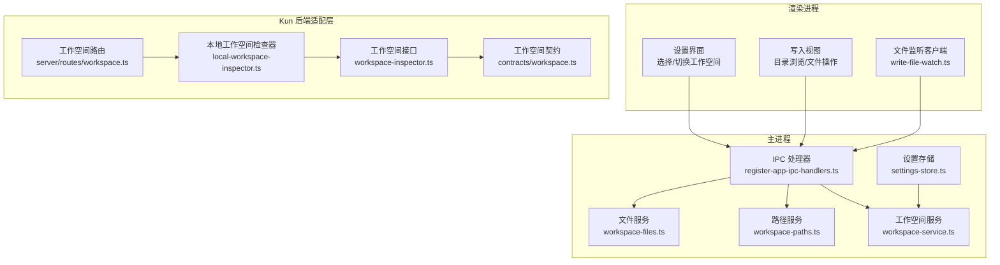
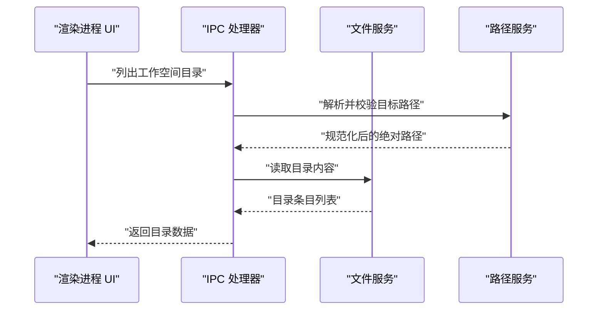
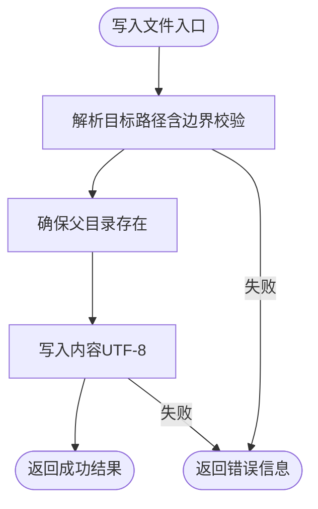
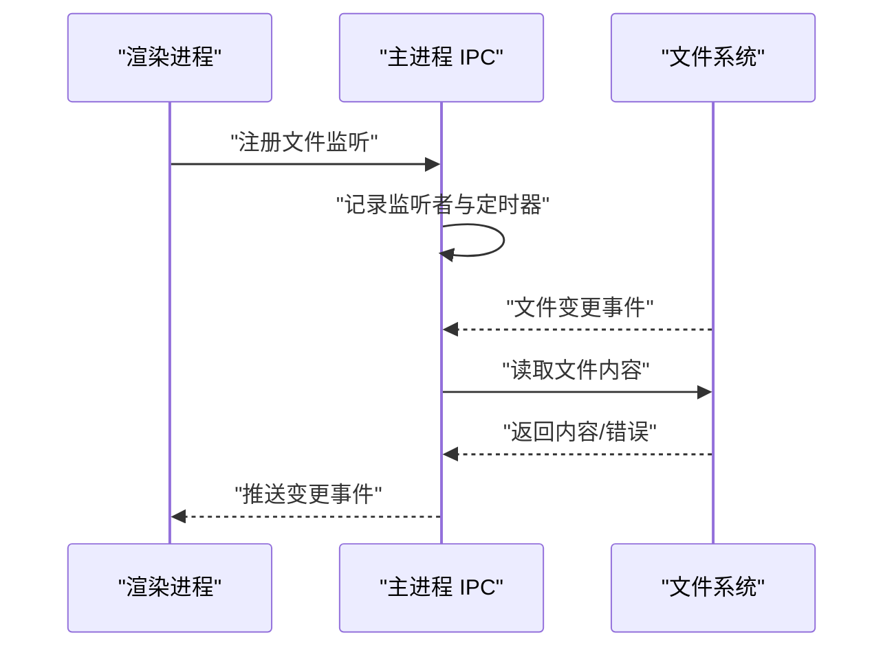
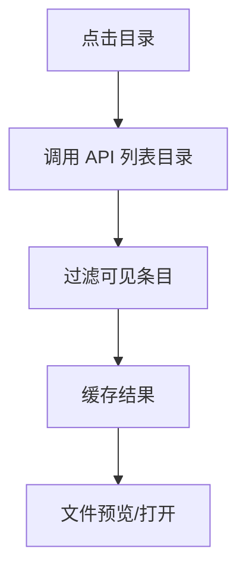

# 工作空间管理

<cite>
**本文引用的文件**
- [src/main/services/workspace-files.ts](file://src/main/services/workspace-files.ts)
- [src/main/services/workspace-paths.ts](file://src/main/services/workspace-paths.ts)
- [src/main/services/workspace-service.ts](file://src/main/services/workspace-service.ts)
- [src/main/ipc/register-app-ipc-handlers.ts](file://src/main/ipc/register-app-ipc-handlers.ts)
- [src/renderer/src/write/write-file-watch.ts](file://src/renderer/src/write/write-file-watch.ts)
- [src/renderer/src/components/chat/FloatingComposer.tsx](file://src/renderer/src/components/chat/FloatingComposer.tsx)
- [src/renderer/src/lib/open-workspace-path.ts](file://src/renderer/src/lib/open-workspace-path.ts)
- [src/renderer/src/lib/format-workspace-picker-error.ts](file://src/renderer/src/lib/format-workspace-picker-error.ts)
- [src/renderer/src/components/SettingsView.tsx](file://src/renderer/src/components/SettingsView.tsx)
- [src/main/settings-store.ts](file://src/main/settings-store.ts)
- [src/renderer/src/write/write-workspace-settings-actions.ts](file://src/renderer/src/write/write-workspace-settings-actions.ts)
- [src/renderer/src/write/write-workspace-file-actions.ts](file://src/renderer/src/write/write-workspace-file-actions.ts)
- [src/shared/workspace-file.ts](file://src/shared/workspace-file.ts)
- [kun/src/adapters/workspace/local-workspace-inspector.ts](file://kun/src/adapters/workspace/local-workspace-inspector.ts)
- [kun/src/ports/workspace-inspector.ts](file://kun/src/ports/workspace-inspector.ts)
- [kun/src/server/routes/workspace.ts](file://kun/src/server/routes/workspace.ts)
- [kun/src/contracts/workspace.ts](file://kun/src/contracts/workspace.ts)
</cite>

## 目录
1. [简介](#简介)
2. [项目结构](#项目结构)
3. [核心组件](#核心组件)
4. [架构总览](#架构总览)
5. [详细组件分析](#详细组件分析)
6. [依赖关系分析](#依赖关系分析)
7. [性能考虑](#性能考虑)
8. [故障排除指南](#故障排除指南)
9. [结论](#结论)
10. [附录](#附录)

## 简介
本指南面向需要在 DeepSeek-GUI 中高效管理“工作空间”的用户与开发者，涵盖以下主题：
- 如何设置与配置项目工作空间（主工作空间与写入类工作空间）
- 工作空间的绑定与切换机制
- 文件系统监控与索引功能
- 工作空间的创建流程、路径配置、权限设置与本地文件系统同步
- 最佳实践、性能优化建议、常见配置问题与解决方案
- 不同项目类型的配置示例与故障排除

## 项目结构
工作空间管理涉及主进程服务、IPC 通道、渲染进程 UI 与共享类型定义，形成跨进程协作的数据流。

图表来源
- [src/renderer/src/components/SettingsView.tsx:606-647](file://src/renderer/src/components/SettingsView.tsx#L606-L647)
- [src/renderer/src/write/write-workspace-file-actions.ts:82-117](file://src/renderer/src/write/write-workspace-file-actions.ts#L82-L117)
- [src/renderer/src/write/write-file-watch.ts:1-47](file://src/renderer/src/write/write-file-watch.ts#L1-L47)
- [src/main/ipc/register-app-ipc-handlers.ts:239-317](file://src/main/ipc/register-app-ipc-handlers.ts#L239-L317)
- [src/main/services/workspace-files.ts:161-206](file://src/main/services/workspace-files.ts#L161-L206)
- [src/main/services/workspace-paths.ts:217-238](file://src/main/services/workspace-paths.ts#L217-L238)
- [src/main/services/workspace-service.ts](file://src/main/services/workspace-service.ts)
- [src/main/settings-store.ts:111-177](file://src/main/settings-store.ts#L111-L177)
- [kun/src/server/routes/workspace.ts](file://kun/src/server/routes/workspace.ts)
- [kun/src/adapters/workspace/local-workspace-inspector.ts](file://kun/src/adapters/workspace/local-workspace-inspector.ts)
- [kun/src/ports/workspace-inspector.ts](file://kun/src/ports/workspace-inspector.ts)
- [kun/src/contracts/workspace.ts](file://kun/src/contracts/workspace.ts)

章节来源
- [src/renderer/src/components/SettingsView.tsx:606-647](file://src/renderer/src/components/SettingsView.tsx#L606-L647)
- [src/renderer/src/write/write-workspace-file-actions.ts:82-117](file://src/renderer/src/write/write-workspace-file-actions.ts#L82-L117)
- [src/renderer/src/write/write-file-watch.ts:1-47](file://src/renderer/src/write/write-file-watch.ts#L1-L47)
- [src/main/ipc/register-app-ipc-handlers.ts:239-317](file://src/main/ipc/register-app-ipc-handlers.ts#L239-L317)
- [src/main/services/workspace-files.ts:161-206](file://src/main/services/workspace-files.ts#L161-L206)
- [src/main/services/workspace-paths.ts:217-238](file://src/main/services/workspace-paths.ts#L217-L238)
- [src/main/services/workspace-service.ts](file://src/main/services/workspace-service.ts)
- [src/main/settings-store.ts:111-177](file://src/main/settings-store.ts#L111-L177)
- [kun/src/server/routes/workspace.ts](file://kun/src/server/routes/workspace.ts)
- [kun/src/adapters/workspace/local-workspace-inspector.ts](file://kun/src/adapters/workspace/local-workspace-inspector.ts)
- [kun/src/ports/workspace-inspector.ts](file://kun/src/ports/workspace-inspector.ts)
- [kun/src/contracts/workspace.ts](file://kun/src/contracts/workspace.ts)

## 核心组件
- 设置与工作空间根路径管理：负责默认工作空间、活动工作空间与多工作空间集合的规范化与持久化。
- 文件与目录操作：提供创建、写入、读取、列出目录等能力，并进行边界校验与权限处理。
- 路径解析与边界约束：确保所有操作限定在工作空间根目录内，避免越界访问。
- 文件监听与变更推送：通过 IPC 将文件变更事件推送到渲染进程，支持节流与错误处理。
- 写入视图与文件索引：渲染侧提供目录浏览、文件预览、监听与索引构建，限制遍历深度与数量以保证性能。
- 共享类型与契约：统一前后端对工作空间文件与目录操作的协议。

章节来源
- [src/main/settings-store.ts:111-177](file://src/main/settings-store.ts#L111-L177)
- [src/main/services/workspace-files.ts:161-206](file://src/main/services/workspace-files.ts#L161-L206)
- [src/main/services/workspace-paths.ts:217-238](file://src/main/services/workspace-paths.ts#L217-L238)
- [src/main/ipc/register-app-ipc-handlers.ts:239-317](file://src/main/ipc/register-app-ipc-handlers.ts#L239-L317)
- [src/renderer/src/write/write-file-watch.ts:1-47](file://src/renderer/src/write/write-file-watch.ts#L1-L47)
- [src/renderer/src/components/chat/FloatingComposer.tsx:315-358](file://src/renderer/src/components/chat/FloatingComposer.tsx#L315-L358)
- [src/shared/workspace-file.ts](file://src/shared/workspace-file.ts)

## 架构总览
工作空间管理采用“渲染进程发起请求 → 主进程执行文件系统操作 → IPC 推送结果/变更”的模式；同时，写入视图侧提供目录索引与文件监听，保障交互体验与性能。

图表来源
- [src/main/ipc/register-app-ipc-handlers.ts:239-317](file://src/main/ipc/register-app-ipc-handlers.ts#L239-L317)
- [src/main/services/workspace-paths.ts:217-238](file://src/main/services/workspace-paths.ts#L217-L238)
- [src/main/services/workspace-files.ts:161-206](file://src/main/services/workspace-files.ts#L161-L206)

## 详细组件分析

### 设置与工作空间根路径管理
- 默认与活动工作空间：应用启动时会确保默认写入工作空间存在，并在首次创建时写入欢迎文件；活动工作空间用于当前会话的上下文。
- 多工作空间集合：去重并规范化后写入设置，确保后续监听与初始化只作用于有效根路径。
- 归一化策略：对路径进行标准化、展开波浪号与大小写敏感排序，保证一致性。

图表来源
- [src/main/settings-store.ts:111-177](file://src/main/settings-store.ts#L111-L177)

章节来源
- [src/main/settings-store.ts:111-177](file://src/main/settings-store.ts#L111-L177)

### 文件与目录操作
- 创建/写入文件：先解析目标路径并确保父目录存在，再执行写入；创建文件时使用排他标志避免覆盖。
- 列出目录：按类型排序（目录优先），过滤隐藏或不必要项；支持分页/分批返回以降低内存压力。
- 错误处理：捕获异常并返回结构化错误信息，便于上层 UI 呈现。

图表来源
- [src/main/services/workspace-files.ts:161-206](file://src/main/services/workspace-files.ts#L161-L206)

章节来源
- [src/main/services/workspace-files.ts:161-206](file://src/main/services/workspace-files.ts#L161-L206)

### 路径解析与边界约束
- 解析工作空间目录：支持相对路径、波浪号展开与规范化，最终确认为真实存在的目录。
- 比较规则：目录优先，名称按数字敏感排序，保证稳定一致的 UI 展示顺序。
- 越界保护：所有文件操作均基于工作空间根路径，防止访问根外文件。

图表来源
- [src/main/services/workspace-paths.ts:217-238](file://src/main/services/workspace-paths.ts#L217-L238)

章节来源
- [src/main/services/workspace-paths.ts:217-238](file://src/main/services/workspace-paths.ts#L217-L238)

### 文件监听与变更推送
- 监听注册：渲染进程通过 API 注册文件监听，主进程维护监听表并节流触发。
- 变更推送：文件变更后，主进程读取最新内容并通过 IPC 发送事件；若读取失败则携带错误消息。
- 生命周期管理：支持取消监听与按发送方清理监听，避免资源泄漏。

图表来源
- [src/renderer/src/write/write-file-watch.ts:1-47](file://src/renderer/src/write/write-file-watch.ts#L1-L47)
- [src/main/ipc/register-app-ipc-handlers.ts:239-317](file://src/main/ipc/register-app-ipc-handlers.ts#L239-L317)

章节来源
- [src/renderer/src/write/write-file-watch.ts:1-47](file://src/renderer/src/write/write-file-watch.ts#L1-L47)
- [src/main/ipc/register-app-ipc-handlers.ts:239-317](file://src/main/ipc/register-app-ipc-handlers.ts#L239-L317)

### 写入视图与文件索引
- 目录浏览：渲染进程调用 API 列举目录，过滤不可见条目并缓存结果，减少重复请求。
- 文件索引：在聊天组件中，为提及文件构建索引时限制最大目录数与文件数，并控制递归深度，避免大仓库卡顿。
- 预览与打开：提供文件预览与在系统中打开路径的能力。

图表来源
- [src/renderer/src/write/write-workspace-file-actions.ts:82-117](file://src/renderer/src/write/write-workspace-file-actions.ts#L82-L117)
- [src/renderer/src/components/chat/FloatingComposer.tsx:315-358](file://src/renderer/src/components/chat/FloatingComposer.tsx#L315-L358)
- [src/renderer/src/lib/open-workspace-path.ts](file://src/renderer/src/lib/open-workspace-path.ts)

章节来源
- [src/renderer/src/write/write-workspace-file-actions.ts:82-117](file://src/renderer/src/write/write-workspace-file-actions.ts#L82-L117)
- [src/renderer/src/components/chat/FloatingComposer.tsx:315-358](file://src/renderer/src/components/chat/FloatingComposer.tsx#L315-L358)
- [src/renderer/src/lib/open-workspace-path.ts](file://src/renderer/src/lib/open-workspace-path.ts)

### 设置界面中的工作空间选择
- 选择默认/写入工作空间：提供弹窗选择目录，更新设置并自动去重与规范化。
- 错误提示：对无法选择工作空间的情况格式化错误消息，提升可诊断性。

章节来源
- [src/renderer/src/components/SettingsView.tsx:606-647](file://src/renderer/src/components/SettingsView.tsx#L606-L647)
- [src/renderer/src/lib/format-workspace-picker-error.ts](file://src/renderer/src/lib/format-workspace-picker-error.ts)

### Kun 后端适配层（工作空间检查与路由）
- 本地检查器：对本地文件系统进行工作空间检查，确保可用性与一致性。
- 接口与契约：定义工作空间相关的端点与数据结构，供前端调用与后端实现。
- 路由：提供 REST 风格的路由，承载工作空间相关请求。

章节来源
- [kun/src/adapters/workspace/local-workspace-inspector.ts](file://kun/src/adapters/workspace/local-workspace-inspector.ts)
- [kun/src/ports/workspace-inspector.ts](file://kun/src/ports/workspace-inspector.ts)
- [kun/src/server/routes/workspace.ts](file://kun/src/server/routes/workspace.ts)
- [kun/src/contracts/workspace.ts](file://kun/src/contracts/workspace.ts)

## 依赖关系分析
- 渲染进程依赖 IPC 与共享类型定义，调用主进程提供的文件系统能力。
- 主进程服务之间解耦：路径服务负责边界与规范化，文件服务负责具体 IO，IPC 负责事件调度。
- 写入视图与文件监听模块相互配合，前者负责 UI 行为，后者负责实时数据更新。
- 设置存储与工作空间服务联动，确保工作空间根路径的持久化与一致性。

图表来源
- [src/main/ipc/register-app-ipc-handlers.ts:239-317](file://src/main/ipc/register-app-ipc-handlers.ts#L239-L317)
- [src/main/services/workspace-files.ts:161-206](file://src/main/services/workspace-files.ts#L161-L206)
- [src/main/services/workspace-paths.ts:217-238](file://src/main/services/workspace-paths.ts#L217-L238)
- [src/main/settings-store.ts:111-177](file://src/main/settings-store.ts#L111-L177)
- [src/renderer/src/write/write-file-watch.ts:1-47](file://src/renderer/src/write/write-file-watch.ts#L1-L47)

章节来源
- [src/main/ipc/register-app-ipc-handlers.ts:239-317](file://src/main/ipc/register-app-ipc-handlers.ts#L239-L317)
- [src/main/services/workspace-files.ts:161-206](file://src/main/services/workspace-files.ts#L161-L206)
- [src/main/services/workspace-paths.ts:217-238](file://src/main/services/workspace-paths.ts#L217-L238)
- [src/main/settings-store.ts:111-177](file://src/main/settings-store.ts#L111-L177)
- [src/renderer/src/write/write-file-watch.ts:1-47](file://src/renderer/src/write/write-file-watch.ts#L1-L47)

## 性能考虑
- 目录遍历限制：在聊天组件的文件索引构建中，限制最大目录数、文件数与递归深度，避免大仓库导致 UI 卡顿。
- 变更事件节流：文件变更推送采用短延迟合并，减少频繁读取与渲染压力。
- 缓存策略：目录浏览结果与索引结果在渲染进程侧缓存，降低重复请求次数。
- I/O 批量化：写入前确保父目录存在，减少多次 mkdir 的开销。

章节来源
- [src/renderer/src/components/chat/FloatingComposer.tsx:315-358](file://src/renderer/src/components/chat/FloatingComposer.tsx#L315-L358)
- [src/main/ipc/register-app-ipc-handlers.ts:303-313](file://src/main/ipc/register-app-ipc-handlers.ts#L303-L313)
- [src/renderer/src/write/write-workspace-file-actions.ts:82-117](file://src/renderer/src/write/write-workspace-file-actions.ts#L82-L117)

## 故障排除指南
- 无法选择工作空间目录
  - 现象：设置界面弹窗选择后无响应或报错。
  - 排查：确认选择的路径存在且具备读取权限；查看错误格式化输出以定位具体原因。
  - 参考
    - [src/renderer/src/lib/format-workspace-picker-error.ts](file://src/renderer/src/lib/format-workspace-picker-error.ts)
    - [src/renderer/src/components/SettingsView.tsx:606-647](file://src/renderer/src/components/SettingsView.tsx#L606-L647)

- 目录列表为空或显示异常
  - 现象：目录浏览无内容或排序异常。
  - 排查：确认工作空间根路径正确且为目录；检查过滤逻辑与排序规则是否生效。
  - 参考
    - [src/renderer/src/write/write-workspace-file-actions.ts:82-117](file://src/renderer/src/write/write-workspace-file-actions.ts#L82-L117)
    - [src/main/services/workspace-paths.ts:235-238](file://src/main/services/workspace-paths.ts#L235-L238)

- 文件写入失败
  - 现象：保存/新建文件时报错。
  - 排查：检查目标路径是否在工作空间根内；确认父目录存在且有写权限；查看返回的错误信息。
  - 参考
    - [src/main/services/workspace-files.ts:161-206](file://src/main/services/workspace-files.ts#L161-L206)

- 文件监听无效或频繁抖动
  - 现象：监听不到变化或短时间内多次触发。
  - 排查：确认监听 ID 正确；检查节流时间与定时器状态；验证发送方未被销毁。
  - 参考
    - [src/renderer/src/write/write-file-watch.ts:1-47](file://src/renderer/src/write/write-file-watch.ts#L1-L47)
    - [src/main/ipc/register-app-ipc-handlers.ts:239-317](file://src/main/ipc/register-app-ipc-handlers.ts#L239-L317)

- 默认工作空间未创建或缺少欢迎文件
  - 现象：首次启动未生成默认工作空间或缺少默认文档。
  - 排查：确认设置存储已执行默认工作空间创建与欢迎文件写入逻辑。
  - 参考
    - [src/main/settings-store.ts:145-163](file://src/main/settings-store.ts#L145-L163)

## 结论
工作空间管理通过清晰的职责划分与严格的边界控制，实现了安全、稳定的文件系统操作与实时监听。结合渲染侧的索引与缓存策略，能够在大型项目中保持良好的交互性能。建议在实际使用中遵循路径规范化、权限最小化与监听生命周期管理的最佳实践，以获得最佳体验。

## 附录

### 工作空间创建流程（概览）
- 选择/设置工作空间根路径
- 确保根路径存在并具备读写权限
- 初始化默认文件（如欢迎文件）
- 在渲染进程侧加载目录树与索引
- 注册文件监听以获取变更通知

章节来源
- [src/main/settings-store.ts:145-163](file://src/main/settings-store.ts#L145-L163)
- [src/renderer/src/components/SettingsView.tsx:606-647](file://src/renderer/src/components/SettingsView.tsx#L606-L647)
- [src/renderer/src/write/write-workspace-file-actions.ts:82-117](file://src/renderer/src/write/write-workspace-file-actions.ts#L82-L117)

### 路径配置与权限建议
- 路径配置
  - 使用绝对路径或包含波浪号的相对路径，确保跨平台兼容。
  - 对多工作空间场景，建议将不同项目置于独立根目录，便于隔离与切换。
- 权限设置
  - 确保应用对工作空间根目录具有读写权限。
  - 避免将工作空间指向系统关键目录，降低安全风险。

章节来源
- [src/main/services/workspace-paths.ts:217-238](file://src/main/services/workspace-paths.ts#L217-L238)
- [src/main/services/workspace-files.ts:161-206](file://src/main/services/workspace-files.ts#L161-L206)

### 与本地文件系统的同步机制
- 目录同步：渲染进程定期调用 API 获取目录快照，结合缓存策略减少请求频率。
- 文件同步：通过文件监听机制实时感知变更，节流后推送至 UI，避免频繁刷新。
- 边界与一致性：所有操作均受工作空间根路径约束，确保不会越界访问。

章节来源
- [src/renderer/src/write/write-workspace-file-actions.ts:82-117](file://src/renderer/src/write/write-workspace-file-actions.ts#L82-L117)
- [src/renderer/src/write/write-file-watch.ts:1-47](file://src/renderer/src/write/write-file-watch.ts#L1-L47)
- [src/main/ipc/register-app-ipc-handlers.ts:239-317](file://src/main/ipc/register-app-ipc-handlers.ts#L239-L317)

### 不同项目类型的配置示例
- 文档/知识库项目
  - 建议将 Markdown 文档集中在一个根目录下，启用文件监听以便实时预览。
- 代码项目
  - 将源码与构建产物分离，忽略构建目录与临时文件；合理设置索引深度与文件数上限。
- 多仓库并行
  - 为每个仓库配置独立工作空间根，通过活动工作空间快速切换。

章节来源
- [src/renderer/src/components/chat/FloatingComposer.tsx:315-358](file://src/renderer/src/components/chat/FloatingComposer.tsx#L315-L358)
- [src/renderer/src/write/write-workspace-settings-actions.ts:36-69](file://src/renderer/src/write/write-workspace-settings-actions.ts#L36-L69)