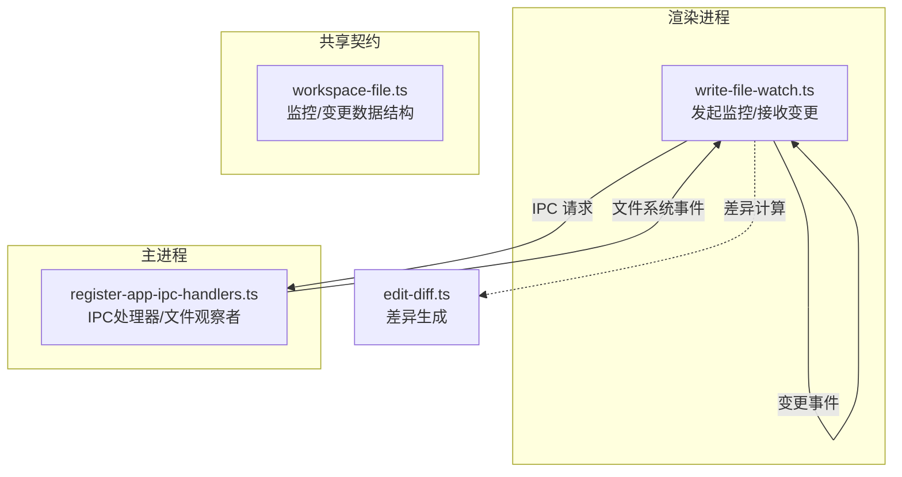
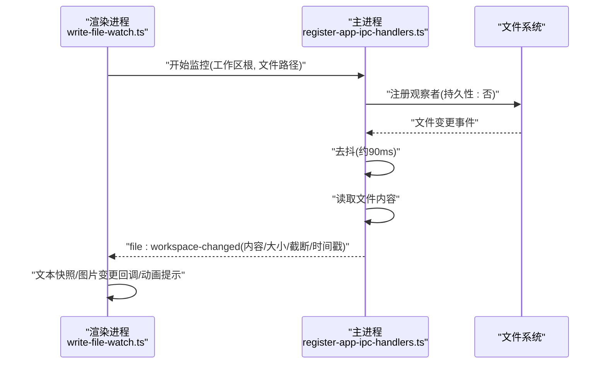
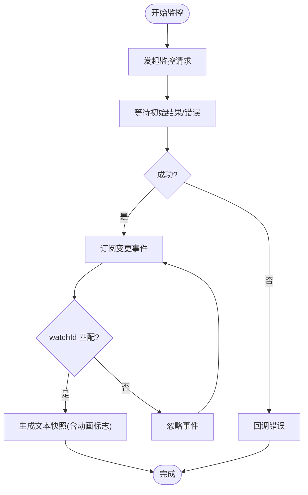
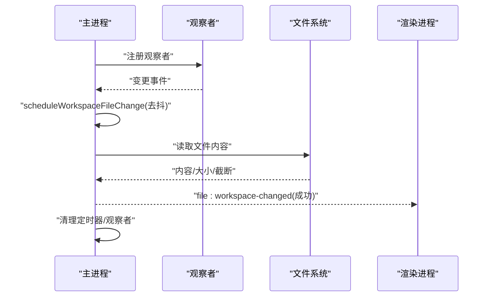
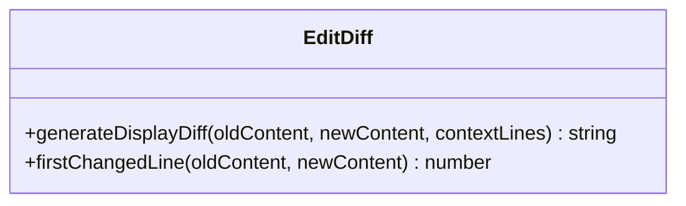
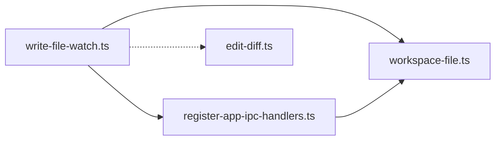

# 文件变更监控

<cite>
**本文引用的文件**
- [write-file-watch.ts](file://src/renderer/src/write/write-file-watch.ts)
- [register-app-ipc-handlers.ts](file://src/main/ipc/register-app-ipc-handlers.ts)
- [workspace-file.ts](file://src/shared/workspace-file.ts)
- [edit-diff.ts](file://kun/src/adapters/tool/edit-diff.ts)
- [builtin-file-tools.ts](file://kun/src/adapters/tool/builtin-file-tools.ts)
- [write-file-watch.test.ts](file://src/renderer/src/write/write-file-watch.test.ts)
</cite>

## 目录
1. [简介](#简介)
2. [项目结构](#项目结构)
3. [核心组件](#核心组件)
4. [架构总览](#架构总览)
5. [详细组件分析](#详细组件分析)
6. [依赖关系分析](#依赖关系分析)
7. [性能考量](#性能考量)
8. [故障排查指南](#故障排查指南)
9. [结论](#结论)
10. [附录](#附录)

## 简介
本指南围绕“文件变更监控”功能，系统讲解实时监控机制、变更检测算法、文件预览与差异显示、监控规则与忽略规则、变更通知机制、文件类型支持、大文件处理与性能优化策略，并提供多场景配置示例、变更历史查看与冲突解决方法。该能力在渲染进程侧通过监听工作区文件变化，在主进程侧基于文件系统事件调度读取与派发，最终由渲染侧进行界面更新与差异展示。

## 项目结构
文件变更监控涉及三层协作：
- 渲染进程：发起监控、接收变更、触发预览与差异展示
- 主进程：注册 IPC 处理器、管理文件系统观察者、合并抖动后读取并派发变更
- 共享契约：定义监控请求、结果与变更事件的数据结构

图表来源
- [write-file-watch.ts:1-47](file://src/renderer/src/write/write-file-watch.ts#L1-L47)
- [register-app-ipc-handlers.ts:660-701](file://src/main/ipc/register-app-ipc-handlers.ts#L660-L701)
- [workspace-file.ts:1-200](file://src/shared/workspace-file.ts#L1-L200)
- [edit-diff.ts:1-400](file://kun/src/adapters/tool/edit-diff.ts#L1-L400)

章节来源
- [write-file-watch.ts:1-47](file://src/renderer/src/write/write-file-watch.ts#L1-L47)
- [register-app-ipc-handlers.ts:660-701](file://src/main/ipc/register-app-ipc-handlers.ts#L660-L701)
- [workspace-file.ts:1-200](file://src/shared/workspace-file.ts#L1-L200)

## 核心组件
- 渲染侧监控启动器：负责向主进程发起监控请求、订阅变更事件、回调处理文本快照与图片变更、错误处理与取消清理。
- 主进程文件观察器：注册 IPC 监听、维护观察者映射、对频繁事件进行去抖合并、读取文件内容并派发变更。
- 差异生成器：在工具链中用于生成可读的差异字符串，供预览与对比展示。
- 共享数据契约：统一监控请求、初始结果与变更事件的字段与语义。

章节来源
- [write-file-watch.ts:1-47](file://src/renderer/src/write/write-file-watch.ts#L1-L47)
- [register-app-ipc-handlers.ts:257-313](file://src/main/ipc/register-app-ipc-handlers.ts#L257-L313)
- [edit-diff.ts:230-330](file://kun/src/adapters/tool/edit-diff.ts#L230-L330)
- [workspace-file.ts:1-200](file://src/shared/workspace-file.ts#L1-L200)

## 架构总览
渲染进程通过 IPC 发起“开始监控”请求；主进程启动文件系统观察者并对短时间内的多次事件进行去抖；去抖结束后从磁盘读取最新内容并通过 IPC 派发“工作区文件已变更”事件；渲染侧根据事件类型（文本/图片）更新界面或触发差异展示。

图表来源
- [write-file-watch.ts:32-70](file://src/renderer/src/write/write-file-watch.ts#L32-L70)
- [register-app-ipc-handlers.ts:660-701](file://src/main/ipc/register-app-ipc-handlers.ts#L660-L701)
- [register-app-ipc-handlers.ts:257-313](file://src/main/ipc/register-app-ipc-handlers.ts#L257-L313)

## 详细组件分析

### 渲染侧监控启动器（write-file-watch.ts）
职责与行为
- 发起监控：调用 API 的“监控工作区文件”接口，传入工作区根目录、目标路径与类型（文本/图片），返回监控句柄与初始快照。
- 订阅变更：注册“工作区文件变更”事件回调，按 watchId 过滤匹配，避免跨监控干扰。
- 快照与动画：文本变更时默认启用“动画提示”，以视觉反馈区分首次加载与后续变更。
- 错误处理：当读取失败或监控启动失败时，回调错误信息。
- 取消清理：提供释放函数，主动取消监控并清理资源。

关键流程图（订阅与过滤）

图表来源
- [write-file-watch.ts:32-70](file://src/renderer/src/write/write-file-watch.ts#L32-L70)
- [write-file-watch.ts:13-30](file://src/renderer/src/write/write-file-watch.ts#L13-L30)

章节来源
- [write-file-watch.ts:1-47](file://src/renderer/src/write/write-file-watch.ts#L1-L47)
- [write-file-watch.ts:32-70](file://src/renderer/src/write/write-file-watch.ts#L32-L70)
- [write-file-watch.test.ts:91-157](file://src/renderer/src/write/write-file-watch.test.ts#L91-L157)

### 主进程文件观察与去抖（register-app-ipc-handlers.ts）
职责与行为
- 注册 IPC：处理“开始监控”“停止监控”等 IPC 请求，维护 watchId 到观察记录的映射。
- 观察者管理：使用 Node fs.watch 创建非持久性观察者，绑定变更回调；在窗口销毁时自动清理。
- 去抖策略：同一 watchId 在短时间内重复触发时，仅保留最后一次，延时约90ms后统一读取与派发。
- 读取与派发：读取文件内容（含截断标记与大小），构造变更事件对象，发送到对应渲染进程。
- 错误兜底：读取异常或观察器失效时，发送失败消息，确保 UI 能感知错误状态。

序列图（变更派发）

图表来源
- [register-app-ipc-handlers.ts:660-701](file://src/main/ipc/register-app-ipc-handlers.ts#L660-L701)
- [register-app-ipc-handlers.ts:257-313](file://src/main/ipc/register-app-ipc-handlers.ts#L257-L313)

章节来源
- [register-app-ipc-handlers.ts:239-313](file://src/main/ipc/register-app-ipc-handlers.ts#L239-L313)
- [register-app-ipc-handlers.ts:660-701](file://src/main/ipc/register-app-ipc-handlers.ts#L660-L701)

### 差异生成与显示（edit-diff.ts）
职责与行为
- 行级差异：基于第三方 diff 库对旧内容与新内容进行行级对比，输出差异字符串。
- 上下文控制：支持上下文行数参数，平衡可读性与信息密度。
- 工具集成：在文件变更工具中生成可读差异，便于在 UI 中展示“变更摘要”。

类图（差异模块）

图表来源
- [edit-diff.ts:230-330](file://kun/src/adapters/tool/edit-diff.ts#L230-L330)

章节来源
- [edit-diff.ts:230-330](file://kun/src/adapters/tool/edit-diff.ts#L230-L330)

### 共享数据契约（workspace-file.ts）
职责与行为
- 定义监控请求体：工作区根、目标路径、类型（文本/图片）等。
- 定义初始结果：监控句柄、初始内容、大小、截断标记、启动时间。
- 定义变更事件：变更时间戳、内容、大小、截断标记、错误消息等。
- 统一字段与语义，保证渲染与主进程间的数据一致性。

章节来源
- [workspace-file.ts:1-200](file://src/shared/workspace-file.ts#L1-L200)

## 依赖关系分析
- 渲染侧依赖共享契约中的数据结构与 IPC API 接口。
- 主进程依赖 Node fs.watch 与文件读取逻辑，同时维护观察者映射与定时器。
- 差异模块独立于监控流程，但可在工具链中被调用以生成差异字符串。

图表来源
- [write-file-watch.ts:1-47](file://src/renderer/src/write/write-file-watch.ts#L1-L47)
- [register-app-ipc-handlers.ts:660-701](file://src/main/ipc/register-app-ipc-handlers.ts#L660-L701)
- [workspace-file.ts:1-200](file://src/shared/workspace-file.ts#L1-L200)
- [edit-diff.ts:230-330](file://kun/src/adapters/tool/edit-diff.ts#L230-L330)

章节来源
- [write-file-watch.ts:1-47](file://src/renderer/src/write/write-file-watch.ts#L1-L47)
- [register-app-ipc-handlers.ts:660-701](file://src/main/ipc/register-app-ipc-handlers.ts#L660-L701)
- [workspace-file.ts:1-200](file://src/shared/workspace-file.ts#L1-L200)
- [edit-diff.ts:230-330](file://kun/src/adapters/tool/edit-diff.ts#L230-L330)

## 性能考量
- 去抖合并：主进程对频繁变更事件进行约90ms去抖，减少重复读取与渲染压力。
- 非持久观察者：使用非持久观察者降低系统资源占用，适合 GUI 场景的短周期监控。
- 截断标记：对超大文件读取采用截断策略并在事件中标记，避免一次性传输过多数据。
- 并发串行化：文件写入队列确保同一物理文件的变更串行执行，避免竞态与覆盖。
- UI 动画节流：文本快照默认启用动画提示，有助于用户感知“首次加载 vs 后续变更”的区别。

章节来源
- [register-app-ipc-handlers.ts:303-313](file://src/main/ipc/register-app-ipc-handlers.ts#L303-L313)
- [register-app-ipc-handlers.ts:666-668](file://src/main/ipc/register-app-ipc-handlers.ts#L666-L668)
- [file-mutation-queue.ts:28-47](file://kun/src/adapters/tool/file-mutation-queue.ts#L28-L47)

## 故障排查指南
常见问题与定位
- 监控未生效：检查 IPC 请求是否成功返回监控句柄与初始内容；若失败，回调错误消息。
- 变更未到达：确认事件回调中按 watchId 过滤；避免跨监控事件干扰。
- 读取失败：主进程在读取异常时会发送失败事件，渲染侧应显示错误提示。
- 取消无效：确保调用释放函数并清理观察者；测试用例验证了延迟启动后取消不会应用快照。
- 图片变更：图片变更事件由渲染侧 onImageChanged 回调处理，需确保回调正确注册。

章节来源
- [write-file-watch.test.ts:73-89](file://src/renderer/src/write/write-file-watch.test.ts#L73-L89)
- [write-file-watch.test.ts:91-157](file://src/renderer/src/write/write-file-watch.test.ts#L91-L157)
- [write-file-watch.test.ts:159-188](file://src/renderer/src/write/write-file-watch.test.ts#L159-L188)
- [register-app-ipc-handlers.ts:257-301](file://src/main/ipc/register-app-ipc-handlers.ts#L257-L301)

## 结论
文件变更监控通过“渲染侧发起 + 主进程观察 + 去抖读取 + 渲染侧更新”的闭环，实现了对工作区文件的高效、低开销的实时监控。结合差异生成与截断策略，既能满足大文件场景的可用性，也能在 UI 层提供直观的变更反馈。建议在复杂场景下配合忽略规则与批量变更策略，进一步提升稳定性与性能。

## 附录

### 使用指南与最佳实践
- 配置监控规则
  - 指定工作区根与目标路径，选择类型（文本/图片）。
  - 对频繁编辑的文件启用去抖，避免 UI 抖动。
- 忽略规则
  - 对临时文件、日志文件、二进制缓存等设置忽略，减少无效变更。
  - 在渲染侧过滤不需要的 watchId，避免跨监控事件影响。
- 变更通知机制
  - 文本变更默认带动画提示，图片变更走独立回调。
  - 错误事件统一通过失败消息通道传递，便于统一处理。
- 文件类型支持
  - 文本：支持任意文本文件，读取内容并生成差异。
  - 图片：支持图片变更事件，触发预览更新。
- 大文件处理
  - 读取时采用截断策略并在事件中标注，避免内存与网络压力。
  - 对超大文件建议分段读取或延迟加载。
- 性能优化策略
  - 使用非持久观察者与去抖合并。
  - 对同一物理文件的写入进行串行化，避免并发冲突。
  - 合理设置上下文行数，平衡差异可读性与渲染成本。
- 不同开发场景示例
  - Markdown 写作：开启文本监控与差异展示，提高修改可见性。
  - 设计稿预览：开启图片监控，及时刷新预览面板。
  - 日志分析：忽略日志文件，仅关注业务文件变更。
- 变更历史查看
  - 通过变更事件的时间戳与内容对比，构建本地历史视图。
  - 对频繁变更的文件，建议开启去抖并限制历史条目数量。
- 冲突解决方法
  - 当多个工具同时修改同一文件时，采用写入队列串行化。
  - 若出现覆盖风险，优先使用差异生成器比对后再决定是否合并。