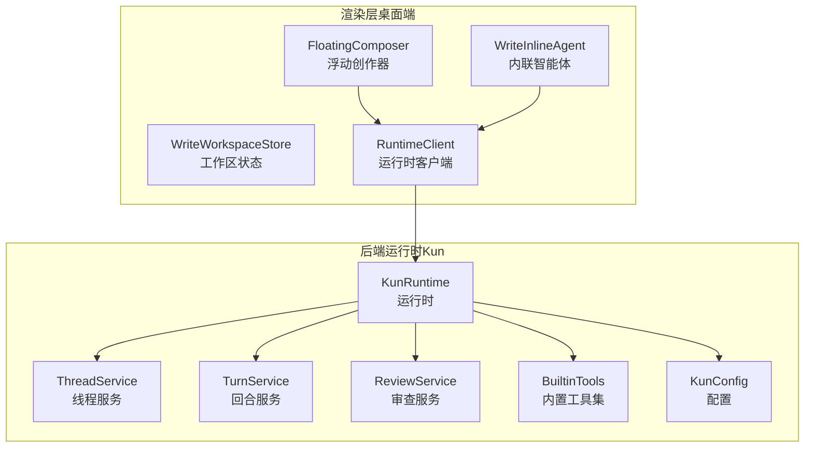
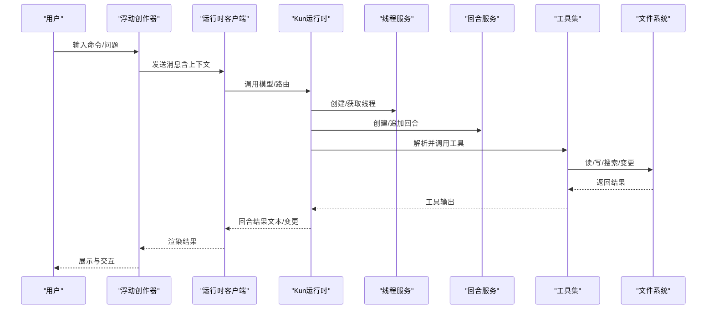
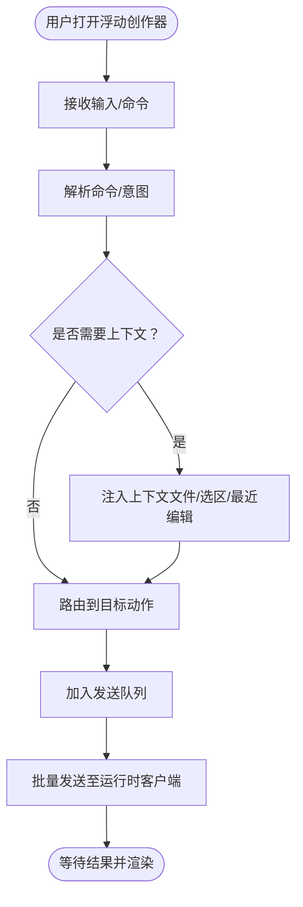
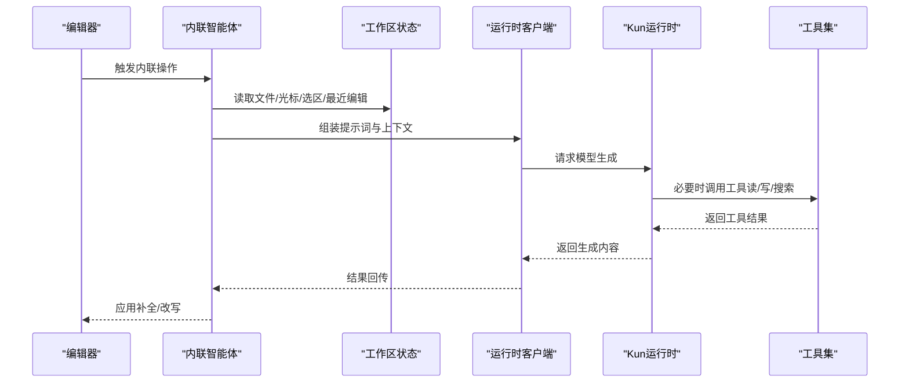
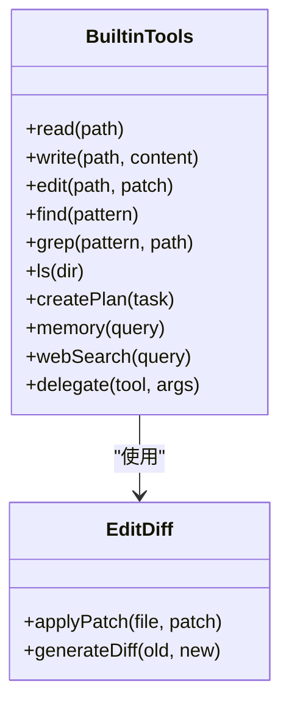
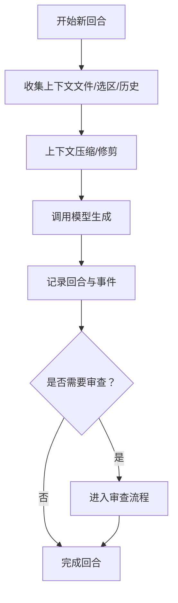
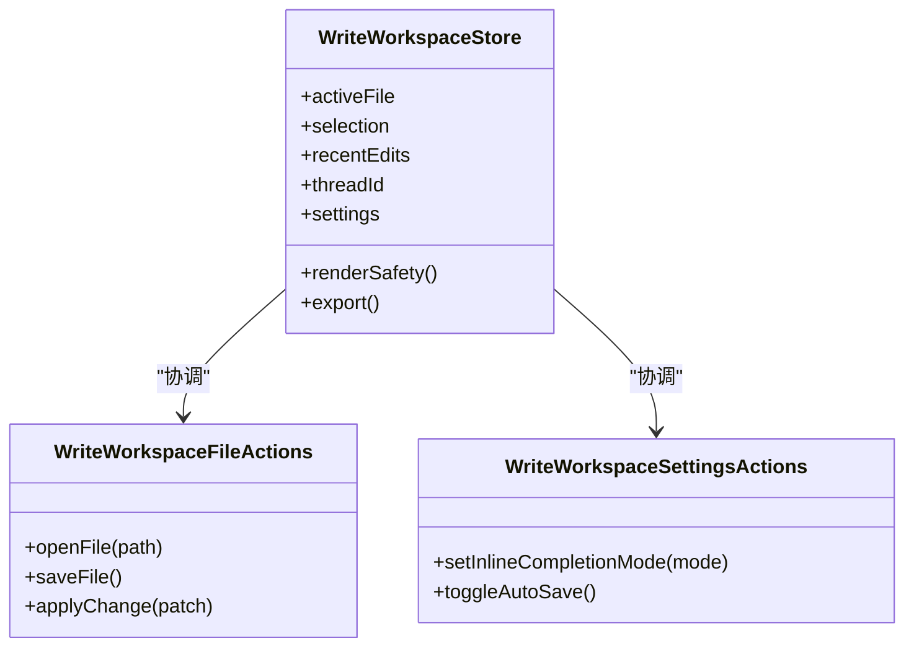
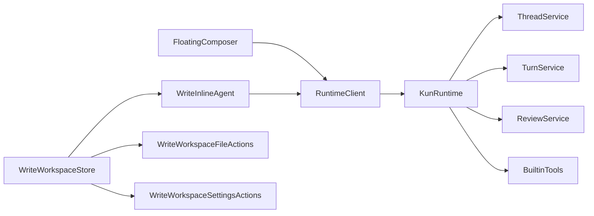

# 智能体编码交互

<cite>
**本文引用的文件**
- [README.en.md](file://README.en.md)
- [kun-runtime.ts](file://src/renderer/src/agent/kun-runtime.ts)
- [runtime-client.ts](file://src/renderer/src/agent/runtime-client.ts)
- [FloatingComposer.tsx](file://src/renderer/src/components/chat/FloatingComposer.tsx)
- [floating-composer-commands.ts](file://src/renderer/src/components/chat/floating-composer-commands.ts)
- [WriteInlineAgent.tsx](file://src/renderer/src/components/write/WriteInlineAgent.tsx)
- [write-inline-completion.ts](file://src/shared/write-inline-completion.ts)
- [write-inline-edit.ts](file://src/shared/write-inline-edit.ts)
- [write-workspace-file-actions.ts](file://src/renderer/src/write/write-workspace-file-actions.ts)
- [write-workspace-store.ts](file://src/renderer/src/write/write-workspace-store.ts)
- [write-workspace-store-helpers.ts](file://src/renderer/src/write/write-workspace-store-helpers.ts)
- [write-workspace-settings-actions.ts](file://src/renderer/src/write/write-workspace-settings-actions.ts)
- [write-workspace-view-utils.ts](file://src/renderer/src/write/write-workspace-view-utils.ts)
- [write-thread-registry.ts](file://src/renderer/src/write/write-thread-registry.ts)
- [write-render-safety.ts](file://src/renderer/src/write/write-render-safety.ts)
- [write-markdown-resource.ts](file://src/shared/write-markdown-resource.ts)
- [write-text-file.ts](file://src/shared/write-text-file.ts)
- [write-export.ts](file://src/shared/write-export.ts)
- [kun-system-prompt.ts](file://kun/src/prompt/kun-system-prompt.ts)
- [builtin-tools.ts](file://kun/src/adapters/tool/builtin-tools.ts)
- [edit.ts](file://kun/src/adapters/tool/edit.ts)
- [edit-diff.ts](file://kun/src/adapters/tool/edit-diff.ts)
- [read.ts](file://kun/src/adapters/tool/read.ts)
- [write.ts](file://kun/src/adapters/tool/write.ts)
- [find.ts](file://kun/src/adapters/tool/find.ts)
- [grep.ts](file://kun/src/adapters/tool/grep.ts)
- [ls.ts](file://kun/src/adapters/tool/ls.ts)
- [goal-tools.ts](file://kun/src/adapters/tool/goal-tools.ts)
- [todo-tools.ts](file://kun/src/adapters/tool/todo-tools.ts)
- [create-plan-tool.ts](file://kun/src/adapters/tool/create-plan-tool.ts)
- [memory-tool-provider.ts](file://kun/src/adapters/tool/memory-tool-provider.ts)
- [web-tool-provider.ts](file://kun/src/adapters/tool/web-tool-provider.ts)
- [mcp-tool-provider.ts](file://kun/src/adapters/tool/mcp-tool-provider.ts)
- [delegation-tool-provider.ts](file://kun/src/adapters/tool/delegation-tool-provider.ts)
- [thread-service.ts](file://kun/src/services/thread-service.ts)
- [turn-service.ts](file://kun/src/services/turn-service.ts)
- [review-service.ts](file://kun/src/services/review-service.ts)
- [runtime-event-recorder.ts](file://kun/src/services/runtime-event-recorder.ts)
- [kun-config.ts](file://kun/src/config/kun-config.ts)
- [kun-architecture.md](file://docs/kun-architecture.md)
- [WRITE_INLINE_COMPLETION_MODES.zh-CN.md](file://docs/WRITE_INLINE_COMPLETION_MODES.zh-CN.md)
- [WRITE_INLINE_EDIT_RAG.en.md](file://docs/WRITE_INLINE_EDIT_RAG.en.md)
- [WRITE_INLINE_EDIT_RECENT_EDITS.en.md](file://docs/WRITE_INLINE_EDIT_RECENT_EDITS.en.md)
- [WRITE_RETRIEVAL_RAG.en.md](file://docs/WRITE_RETRIEVAL_RAG.en.md)
</cite>

## 目录
1. [简介](#简介)
2. [项目结构](#项目结构)
3. [核心组件](#核心组件)
4. [架构总览](#架构总览)
5. [详细组件分析](#详细组件分析)
6. [依赖关系分析](#依赖关系分析)
7. [性能考量](#性能考量)
8. [故障排查指南](#故障排查指南)
9. [结论](#结论)
10. [附录](#附录)

## 简介
本指南面向开发者，系统讲解智能体在编码场景中的交互方式与协作流程，涵盖以下主题：
- 浮动创作器（Floating Composer）的使用与命令体系
- 智能体指令系统与工具调用机制
- 代码补全与内联编辑策略
- 多轮对话管理与上下文理解
- 不同编程场景的交互策略与最佳实践
- 代码质量保障与变更审查流程
- 与后端运行时、工具集、线程/回合服务的集成

## 项目结构
该仓库由两部分组成：桌面端渲染层（Electron + React）与后端运行时（Kun），二者通过 IPC 与 HTTP 接口协同工作。

- 渲染层（src/renderer）：负责用户界面、聊天与写作工作区、浮动创作器、内联补全与编辑、线程/存储状态管理等。
- 后端运行时（kun/src）：提供模型客户端、工具集（文件读写、搜索、计划、记忆、Web、MCP、委派）、线程/回合服务、事件记录与配置等。

图表来源
- [kun-runtime.ts](file://src/renderer/src/agent/kun-runtime.ts)
- [runtime-client.ts](file://src/renderer/src/agent/runtime-client.ts)
- [FloatingComposer.tsx](file://src/renderer/src/components/chat/FloatingComposer.tsx)
- [WriteInlineAgent.tsx](file://src/renderer/src/components/write/WriteInlineAgent.tsx)
- [thread-service.ts](file://kun/src/services/thread-service.ts)
- [turn-service.ts](file://kun/src/services/turn-service.ts)
- [review-service.ts](file://kun/src/services/review-service.ts)
- [builtin-tools.ts](file://kun/src/adapters/tool/builtin-tools.ts)
- [kun-config.ts](file://kun/src/config/kun-config.ts)

章节来源
- [README.en.md](file://README.en.md)
- [kun-architecture.md](file://docs/kun-architecture.md)

## 核心组件
- 浮动创作器（FloatingComposer）：提供快捷输入与命令入口，支持多轮对话与上下文选择。
- 内联智能体（WriteInlineAgent）：在编辑器中触发智能体执行补全、改写、解释等任务。
- 运行时客户端（RuntimeClient）：封装与后端运行时的通信，包括会话、线程、回合与事件。
- 内联补全与编辑（write-inline-completion.ts / write-inline-edit.ts）：定义内联能力的策略、提示词与上下文处理。
- 工作区状态（write-workspace-store.ts）：维护当前文件、光标位置、选区、线程与渲染安全策略。
- 工具集（builtin-tools.ts 及其子模块）：文件读写、搜索、计划、记忆、Web、MCP、委派等工具的实现与注册。
- 线程/回合服务（thread-service.ts / turn-service.ts）：管理对话历史、回合状态与上下文压缩。
- 审查服务（review-service.ts）：对变更进行审查与输出格式化。

章节来源
- [FloatingComposer.tsx](file://src/renderer/src/components/chat/FloatingComposer.tsx)
- [floating-composer-commands.ts](file://src/renderer/src/components/chat/floating-composer-commands.ts)
- [WriteInlineAgent.tsx](file://src/renderer/src/components/write/WriteInlineAgent.tsx)
- [write-inline-completion.ts](file://src/shared/write-inline-completion.ts)
- [write-inline-edit.ts](file://src/shared/write-inline-edit.ts)
- [write-workspace-store.ts](file://src/renderer/src/write/write-workspace-store.ts)
- [builtin-tools.ts](file://kun/src/adapters/tool/builtin-tools.ts)
- [thread-service.ts](file://kun/src/services/thread-service.ts)
- [turn-service.ts](file://kun/src/services/turn-service.ts)
- [review-service.ts](file://kun/src/services/review-service.ts)

## 架构总览
下图展示了从用户输入到智能体执行再到文件变更的完整链路：

图表来源
- [runtime-client.ts](file://src/renderer/src/agent/runtime-client.ts)
- [kun-runtime.ts](file://src/renderer/src/agent/kun-runtime.ts)
- [thread-service.ts](file://kun/src/services/thread-service.ts)
- [turn-service.ts](file://kun/src/services/turn-service.ts)
- [builtin-tools.ts](file://kun/src/adapters/tool/builtin-tools.ts)

## 详细组件分析

### 浮动创作器（FloatingComposer）
- 功能定位：提供快速输入、命令触发、上下文选择与多轮对话入口。
- 关键行为：
  - 命令解析与路由：将用户输入映射为具体动作或工具调用。
  - 上下文注入：根据当前文件、选区、最近编辑等自动注入上下文。
  - 队列与批处理：支持消息队列与批量发送，避免频繁请求。
- 与内联智能体的协作：在编辑器中触发时，浮动创作器可直接调用内联智能体以获得更细粒度的补全/改写。

图表来源
- [FloatingComposer.tsx](file://src/renderer/src/components/chat/FloatingComposer.tsx)
- [floating-composer-commands.ts](file://src/renderer/src/components/chat/floating-composer-commands.ts)

章节来源
- [FloatingComposer.tsx](file://src/renderer/src/components/chat/FloatingComposer.tsx)
- [floating-composer-commands.ts](file://src/renderer/src/components/chat/floating-composer-commands.ts)

### 内联智能体（WriteInlineAgent）
- 功能定位：在编辑器内触发，针对当前光标位置或选区执行补全、解释、重构、扩写等任务。
- 关键策略：
  - 补全模式：基于上下文与历史，生成连续的代码片段。
  - 编辑模式：根据指令对选区进行改写或插入。
  - RAG/近期编辑：结合检索增强与近期编辑上下文提升准确性。
- 与工作区状态联动：读取当前文件、光标/选区、最近编辑，确保生成内容与上下文一致。

图表来源
- [WriteInlineAgent.tsx](file://src/renderer/src/components/write/WriteInlineAgent.tsx)
- [write-workspace-store.ts](file://src/renderer/src/write/write-workspace-store.ts)
- [write-inline-completion.ts](file://src/shared/write-inline-completion.ts)
- [write-inline-edit.ts](file://src/shared/write-inline-edit.ts)
- [builtin-tools.ts](file://kun/src/adapters/tool/builtin-tools.ts)

章节来源
- [WriteInlineAgent.tsx](file://src/renderer/src/components/write/WriteInlineAgent.tsx)
- [write-inline-completion.ts](file://src/shared/write-inline-completion.ts)
- [write-inline-edit.ts](file://src/shared/write-inline-edit.ts)
- [write-workspace-store.ts](file://src/renderer/src/write/write-workspace-store.ts)

### 工具集与文件变更
- 文件读写工具：提供安全的读取、写入与差异应用能力，支持原子写入与冲突处理。
- 搜索与浏览：支持文件树遍历、内容匹配与路径查找。
- 计划与待办：支持创建计划任务、同步待办事项。
- 记忆与Web/MCP/委派：扩展智能体的能力边界，接入外部知识与工具生态。

图表来源
- [builtin-tools.ts](file://kun/src/adapters/tool/builtin-tools.ts)
- [edit.ts](file://kun/src/adapters/tool/edit.ts)
- [edit-diff.ts](file://kun/src/adapters/tool/edit-diff.ts)
- [read.ts](file://kun/src/adapters/tool/read.ts)
- [write.ts](file://kun/src/adapters/tool/write.ts)
- [find.ts](file://kun/src/adapters/tool/find.ts)
- [grep.ts](file://kun/src/adapters/tool/grep.ts)
- [ls.ts](file://kun/src/adapters/tool/ls.ts)
- [goal-tools.ts](file://kun/src/adapters/tool/goal-tools.ts)
- [todo-tools.ts](file://kun/src/adapters/tool/todo-tools.ts)
- [create-plan-tool.ts](file://kun/src/adapters/tool/create-plan-tool.ts)
- [memory-tool-provider.ts](file://kun/src/adapters/tool/memory-tool-provider.ts)
- [web-tool-provider.ts](file://kun/src/adapters/tool/web-tool-provider.ts)
- [mcp-tool-provider.ts](file://kun/src/adapters/tool/mcp-tool-provider.ts)
- [delegation-tool-provider.ts](file://kun/src/adapters/tool/delegation-tool-provider.ts)

章节来源
- [builtin-tools.ts](file://kun/src/adapters/tool/builtin-tools.ts)
- [edit.ts](file://kun/src/adapters/tool/edit.ts)
- [edit-diff.ts](file://kun/src/adapters/tool/edit-diff.ts)
- [read.ts](file://kun/src/adapters/tool/read.ts)
- [write.ts](file://kun/src/adapters/tool/write.ts)
- [find.ts](file://kun/src/adapters/tool/find.ts)
- [grep.ts](file://kun/src/adapters/tool/grep.ts)
- [ls.ts](file://kun/src/adapters/tool/ls.ts)
- [goal-tools.ts](file://kun/src/adapters/tool/goal-tools.ts)
- [todo-tools.ts](file://kun/src/adapters/tool/todo-tools.ts)
- [create-plan-tool.ts](file://kun/src/adapters/tool/create-plan-tool.ts)
- [memory-tool-provider.ts](file://kun/src/adapters/tool/memory-tool-provider.ts)
- [web-tool-provider.ts](file://kun/src/adapters/tool/web-tool-provider.ts)
- [mcp-tool-provider.ts](file://kun/src/adapters/tool/mcp-tool-provider.ts)
- [delegation-tool-provider.ts](file://kun/src/adapters/tool/delegation-tool-provider.ts)

### 线程/回合与上下文管理
- 线程服务：维护对话线程生命周期，支持线程创建、查询、归档与合并。
- 回合服务：管理单轮对话的输入、输出与工具调用记录，支持上下文压缩与历史清洗。
- 系统提示词：统一的系统级提示词模板，确保智能体行为一致性与安全性。

图表来源
- [thread-service.ts](file://kun/src/services/thread-service.ts)
- [turn-service.ts](file://kun/src/services/turn-service.ts)
- [kun-system-prompt.ts](file://kun/src/prompt/kun-system-prompt.ts)

章节来源
- [thread-service.ts](file://kun/src/services/thread-service.ts)
- [turn-service.ts](file://kun/src/services/turn-service.ts)
- [kun-system-prompt.ts](file://kun/src/prompt/kun-system-prompt.ts)

### 写作工作区与渲染安全
- 工作区状态：集中管理当前文件、光标/选区、最近编辑、线程与视图设置。
- 渲染安全：防止 Markdown/HTML 注入与不安全渲染，确保预览与编辑体验。
- 导出与资源：支持导出为多种格式与资源管理。

图表来源
- [write-workspace-store.ts](file://src/renderer/src/write/write-workspace-store.ts)
- [write-workspace-file-actions.ts](file://src/renderer/src/write/write-workspace-file-actions.ts)
- [write-workspace-settings-actions.ts](file://src/renderer/src/write/write-workspace-settings-actions.ts)
- [write-render-safety.ts](file://src/renderer/src/write/write-render-safety.ts)
- [write-export.ts](file://src/shared/write-export.ts)
- [write-markdown-resource.ts](file://src/shared/write-markdown-resource.ts)
- [write-text-file.ts](file://src/shared/write-text-file.ts)

章节来源
- [write-workspace-store.ts](file://src/renderer/src/write/write-workspace-store.ts)
- [write-workspace-file-actions.ts](file://src/renderer/src/write/write-workspace-file-actions.ts)
- [write-workspace-settings-actions.ts](file://src/renderer/src/write/write-workspace-settings-actions.ts)
- [write-render-safety.ts](file://src/renderer/src/write/write-render-safety.ts)
- [write-export.ts](file://src/shared/write-export.ts)
- [write-markdown-resource.ts](file://src/shared/write-markdown-resource.ts)
- [write-text-file.ts](file://src/shared/write-text-file.ts)

## 依赖关系分析
- 渲染层依赖运行时客户端与后端运行时；运行时客户端再依赖 Kun 运行时与工具集。
- 工作区状态与内联智能体紧密耦合，共同决定生成内容的上下文质量。
- 线程/回合服务为对话提供持久化与历史管理，审查服务贯穿变更流程。

图表来源
- [runtime-client.ts](file://src/renderer/src/agent/runtime-client.ts)
- [kun-runtime.ts](file://src/renderer/src/agent/kun-runtime.ts)
- [thread-service.ts](file://kun/src/services/thread-service.ts)
- [turn-service.ts](file://kun/src/services/turn-service.ts)
- [review-service.ts](file://kun/src/services/review-service.ts)
- [builtin-tools.ts](file://kun/src/adapters/tool/builtin-tools.ts)
- [write-workspace-store.ts](file://src/renderer/src/write/write-workspace-store.ts)
- [write-workspace-file-actions.ts](file://src/renderer/src/write/write-workspace-file-actions.ts)
- [write-workspace-settings-actions.ts](file://src/renderer/src/write/write-workspace-settings-actions.ts)

章节来源
- [runtime-client.ts](file://src/renderer/src/agent/runtime-client.ts)
- [kun-runtime.ts](file://src/renderer/src/agent/kun-runtime.ts)
- [thread-service.ts](file://kun/src/services/thread-service.ts)
- [turn-service.ts](file://kun/src/services/turn-service.ts)
- [review-service.ts](file://kun/src/services/review-service.ts)
- [builtin-tools.ts](file://kun/src/adapters/tool/builtin-tools.ts)
- [write-workspace-store.ts](file://src/renderer/src/write/write-workspace-store.ts)

## 性能考量
- 上下文压缩与修剪：在长对话或多文件场景中，合理裁剪历史与重复信息，降低 Token 消耗。
- 批量发送与去抖：浮动创作器的消息队列与去抖策略减少不必要的请求。
- 工具调用限流：对文件系统与网络工具设置速率限制，避免阻塞主线程。
- 内联补全策略：根据文件大小与复杂度动态调整补全长度与上下文范围。
- 缓存与预热：对常用工具结果与模型响应进行缓存，缩短延迟。

## 故障排查指南
- 无法连接运行时：检查运行时客户端的连接状态与错误日志，确认端口与鉴权配置。
- 工具调用失败：查看工具返回的错误码与参数修复建议，优先检查路径与权限。
- 上下文异常：确认工作区状态中的文件、选区与最近编辑是否正确同步。
- 审查未生效：检查审查服务的输出格式与规则配置，确保变更已应用。
- 渲染异常：启用渲染安全策略，避免注入内容导致的崩溃。

章节来源
- [runtime-client.ts](file://src/renderer/src/agent/runtime-client.ts)
- [runtime-event-recorder.ts](file://kun/src/services/runtime-event-recorder.ts)
- [write-render-safety.ts](file://src/renderer/src/write/write-render-safety.ts)

## 结论
通过浮动创作器与内联智能体的协同，开发者可以在编辑器内高效地与智能体进行多轮对话与代码生成/修改。借助完善的工具集、线程/回合与审查机制，系统在保证代码质量的同时提升了开发效率。建议在实际使用中结合场景策略与最佳实践，持续优化上下文与提示词，以获得更稳定与高质量的交互体验。

## 附录
- 内联补全模式与策略参考文档：[WRITE_INLINE_COMPLETION_MODES.zh-CN.md](file://docs/WRITE_INLINE_COMPLETION_MODES.zh-CN.md)
- 内联编辑（RAG）参考文档：[WRITE_INLINE_EDIT_RAG.en.md](file://docs/WRITE_INLINE_EDIT_RAG.en.md)
- 内联编辑（近期编辑）参考文档：[WRITE_INLINE_EDIT_RECENT_EDITS.en.md](file://docs/WRITE_INLINE_EDIT_RECENT_EDITS.en.md)
- 检索式写作（RAG）参考文档：[WRITE_RETRIEVAL_RAG.en.md](file://docs/WRITE_RETRIEVAL_RAG.en.md)
- 运行时架构概览：[kun-architecture.md](file://docs/kun-architecture.md)