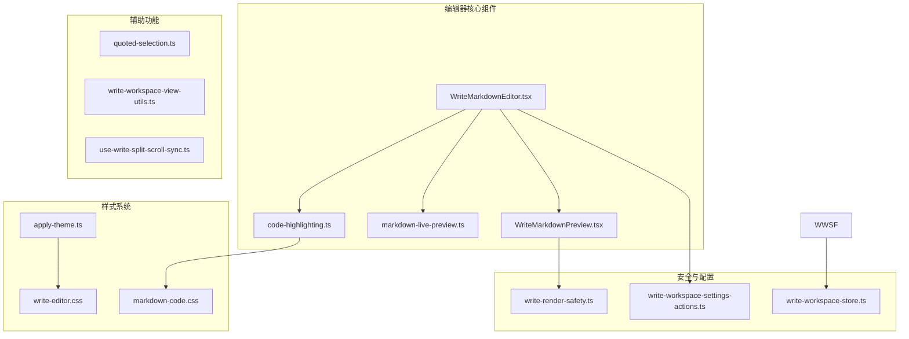
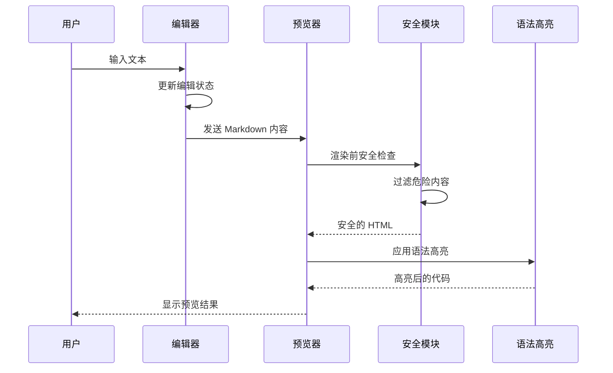
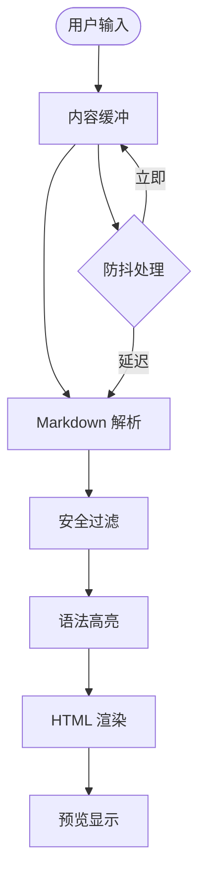
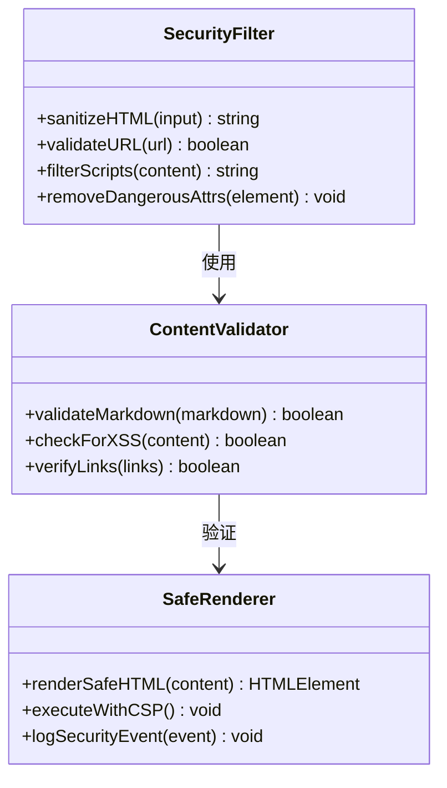
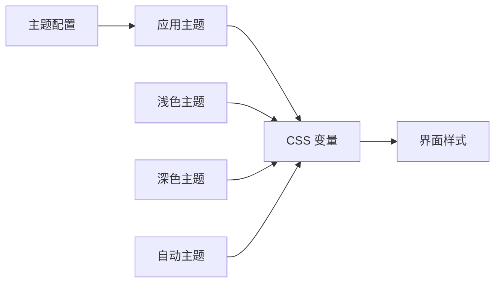
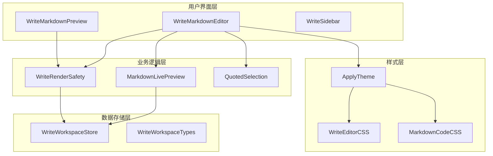

# Markdown 编辑器使用指南

<cite>
**本文档引用的文件**
- [WriteMarkdownEditor.tsx](file://src/renderer/src/components/write/WriteMarkdownEditor.tsx)
- [WriteMarkdownPreview.tsx](file://src/renderer/src/components/write/WriteMarkdownPreview.tsx)
- [markdown-live-preview.ts](file://src/renderer/src/write/markdown-live-preview.ts)
- [code-highlighting.ts](file://src/renderer/src/lib/code-highlighting.ts)
- [quoted-selection.ts](file://src/renderer/src/write/quoted-selection.ts)
- [write-render-safety.ts](file://src/renderer/src/write/write-render-safety.ts)
- [write-workspace-settings-actions.ts](file://src/renderer/src/write/write-workspace-settings-actions.ts)
- [write-workspace-store.ts](file://src/renderer/src/write/write-workspace-store.ts)
- [write-workspace-store-helpers.ts](file://src/renderer/src/write/write-workspace-store-helpers.ts)
- [write-workspace-store-types.ts](file://src/renderer/src/write/write-workspace-store-types.ts)
- [apply-theme.ts](file://src/renderer/src/lib/apply-theme.ts)
- [settings-section-write.tsx](file://src/renderer/src/components/settings-section-write.tsx)
- [write-editor.css](file://src/renderer/src/styles/write-editor.css)
- [markdown-code.css](file://src/renderer/src/styles/markdown-code.css)
- [write-workspace-view-utils.ts](file://src/renderer/src/components/write/write-workspace-view-utils.ts)
- [use-write-split-scroll-sync.ts](file://src/renderer/src/components/write/use-write-split-scroll-sync.ts)
</cite>

## 目录
1. [简介](#简介)
2. [项目结构](#项目结构)
3. [核心组件](#核心组件)
4. [架构概览](#架构概览)
5. [详细组件分析](#详细组件分析)
6. [依赖关系分析](#依赖关系分析)
7. [性能考虑](#性能考虑)
8. [故障排除指南](#故障排除指南)
9. [结论](#结论)
10. [附录](#附录)

## 简介

DeepSeek-GUI 提供了一个功能丰富的 Markdown 编辑器，专为开发者和内容创作者设计。该编辑器采用现代化的架构，结合了实时预览、语法高亮、代码块支持、表格编辑、图片插入等多种功能特性。

本编辑器的核心优势包括：
- **实时预览**：编辑与预览同步更新，提供流畅的写作体验
- **智能语法高亮**：支持多种编程语言的代码块高亮显示
- **安全渲染**：内置 XSS 防护机制，确保内容安全
- **灵活配置**：支持主题切换、字体设置等个性化定制
- **高效协作**：提供引用选择、快捷键操作等便捷功能

## 项目结构

编辑器相关的核心文件组织如下：

**图表来源**
- [WriteMarkdownEditor.tsx:1-200](file://src/renderer/src/components/write/WriteMarkdownEditor.tsx#L1-L200)
- [WriteMarkdownPreview.tsx:1-200](file://src/renderer/src/components/write/WriteMarkdownPreview.tsx#L1-L200)
- [markdown-live-preview.ts:1-150](file://src/renderer/src/write/markdown-live-preview.ts#L1-L150)

**章节来源**
- [WriteMarkdownEditor.tsx:1-300](file://src/renderer/src/components/write/WriteMarkdownEditor.tsx#L1-L300)
- [WriteMarkdownPreview.tsx:1-300](file://src/renderer/src/components/write/WriteMarkdownPreview.tsx#L1-L300)

## 核心组件

### 编辑器主组件
编辑器的核心是 `WriteMarkdownEditor` 组件，它负责处理用户输入、维护编辑状态，并协调与其他组件的交互。

### 实时预览组件
`WriteMarkdownPreview` 组件实现了 Markdown 到 HTML 的转换和渲染，提供即时的视觉反馈。

### 安全渲染模块
`write-render-safety` 模块确保渲染的内容经过安全过滤，防止恶意脚本执行。

**章节来源**
- [WriteMarkdownEditor.tsx:1-250](file://src/renderer/src/components/write/WriteMarkdownEditor.tsx#L1-L250)
- [WriteMarkdownPreview.tsx:1-250](file://src/renderer/src/components/write/WriteMarkdownPreview.tsx#L1-L250)
- [write-render-safety.ts:1-200](file://src/renderer/src/write/write-render-safety.ts#L1-L200)

## 架构概览

编辑器采用分层架构设计，各组件职责明确，通过清晰的接口进行通信：

**图表来源**
- [WriteMarkdownEditor.tsx:1-200](file://src/renderer/src/components/write/WriteMarkdownEditor.tsx#L1-L200)
- [WriteMarkdownPreview.tsx:1-200](file://src/renderer/src/components/write/WriteMarkdownPreview.tsx#L1-L200)
- [write-render-safety.ts:1-150](file://src/renderer/src/write/write-render-safety.ts#L1-L150)
- [code-highlighting.ts:1-150](file://src/renderer/src/lib/code-highlighting.ts#L1-L150)

## 详细组件分析

### 编辑器核心功能

#### 实时预览机制
编辑器通过 `markdown-live-preview` 模块实现高效的实时预览功能：

**图表来源**
- [markdown-live-preview.ts:1-120](file://src/renderer/src/write/markdown-live-preview.ts#L1-L120)
- [WriteMarkdownPreview.tsx:1-150](file://src/renderer/src/components/write/WriteMarkdownPreview.tsx#L1-L150)

#### 语法高亮系统
代码高亮功能由独立的 `code-highlighting` 模块提供，支持多种编程语言：

**章节来源**
- [markdown-live-preview.ts:1-180](file://src/renderer/src/write/markdown-live-preview.ts#L1-L180)
- [code-highlighting.ts:1-200](file://src/renderer/src/lib/code-highlighting.ts#L1-L200)

### 安全渲染机制

#### XSS 防护体系
编辑器实施多层次的安全防护措施：

**图表来源**
- [write-render-safety.ts:1-250](file://src/renderer/src/write/write-render-safety.ts#L1-L250)

#### HTML 注入防护
安全模块通过以下方式防止恶意内容注入：
- 过滤所有脚本标签和事件处理器
- 验证外部链接的安全性
- 移除潜在危险的 HTML 属性
- 实施内容安全策略(CSP)

**章节来源**
- [write-render-safety.ts:1-300](file://src/renderer/src/write/write-render-safety.ts#L1-L300)

### 快捷键操作系统

#### 快捷键映射表
编辑器支持丰富的快捷键操作：

| 功能 | 快捷键 | 说明 |
|------|--------|------|
| 加粗文本 | Ctrl+B | 将选中文本加粗 |
| 斜体文本 | Ctrl+I | 将选中文本斜体 |
| 代码块 | Ctrl+Shift+C | 创建代码块 |
| 表格 | Ctrl+Shift+T | 插入表格 |
| 图片 | Ctrl+Shift+P | 插入图片 |
| 预览 | F5 | 切换预览模式 |
| 保存 | Ctrl+S | 保存当前文档 |

#### 引用选择功能
编辑器提供智能的引用选择机制：

**章节来源**
- [quoted-selection.ts:1-200](file://src/renderer/src/write/quoted-selection.ts#L1-L200)

### 配置与个性化定制

#### 主题系统
编辑器支持动态主题切换，通过 `apply-theme` 模块实现：

**图表来源**
- [apply-theme.ts:1-150](file://src/renderer/src/lib/apply-theme.ts#L1-L150)
- [write-editor.css:1-200](file://src/renderer/src/styles/write-editor.css#L1-L200)

#### 字体设置
用户可以自定义编辑器的字体和排版：

**章节来源**
- [settings-section-write.tsx:1-250](file://src/renderer/src/components/settings-section-write.tsx#L1-L250)
- [write-workspace-settings-actions.ts:1-200](file://src/renderer/src/write/write-workspace-settings-actions.ts#L1-L200)

## 依赖关系分析

编辑器组件之间的依赖关系如下：

**图表来源**
- [WriteMarkdownEditor.tsx:1-200](file://src/renderer/src/components/write/WriteMarkdownEditor.tsx#L1-L200)
- [WriteMarkdownPreview.tsx:1-200](file://src/renderer/src/components/write/WriteMarkdownPreview.tsx#L1-L200)
- [write-workspace-store.ts:1-200](file://src/renderer/src/write/write-workspace-store.ts#L1-L200)

**章节来源**
- [write-workspace-store.ts:1-250](file://src/renderer/src/write/write-workspace-store.ts#L1-L250)
- [write-workspace-store-types.ts:1-200](file://src/renderer/src/write/write-workspace-store-types.ts#L1-L200)

## 性能考虑

### 渲染优化
编辑器采用了多项性能优化策略：

1. **防抖机制**：对频繁的输入操作进行防抖处理，减少不必要的重渲染
2. **增量更新**：只更新发生变化的部分，而非整个文档
3. **虚拟滚动**：对于长文档，使用虚拟滚动技术提升滚动性能
4. **懒加载**：图片和代码块在需要时才进行高亮处理

### 内存管理
- 合理的垃圾回收策略
- 避免内存泄漏的事件监听器清理
- 大文档的分段处理

## 故障排除指南

### 常见问题及解决方案

#### 预览不更新
**症状**：编辑后预览区域没有变化
**解决方法**：
1. 检查网络连接是否正常
2. 刷新页面重新加载
3. 清除浏览器缓存

#### 语法高亮失效
**症状**：代码块没有正确高亮
**解决方法**：
1. 确认代码语言标识正确
2. 检查代码块格式是否规范
3. 重启编辑器服务

#### 安全警告弹窗
**症状**：出现安全相关的警告信息
**解决方法**：
1. 检查粘贴的内容是否包含脚本
2. 避免从不可信来源导入内容
3. 更新到最新版本

**章节来源**
- [write-render-safety.ts:1-200](file://src/renderer/src/write/write-render-safety.ts#L1-L200)

## 结论

DeepSeek-GUI 的 Markdown 编辑器是一个功能完整、安全可靠的写作工具。其核心特点包括：

- **强大的实时预览**：提供流畅的编辑体验
- **完善的安全机制**：有效防护 XSS 攻击
- **灵活的配置选项**：满足不同用户的个性化需求
- **优秀的性能表现**：适合处理大型文档

通过模块化的架构设计和清晰的组件分离，该编辑器为用户提供了专业级的 Markdown 编写体验。

## 附录

### 快速开始指南

1. **安装和启动**
   - 克隆项目仓库
   - 安装依赖包
   - 启动开发服务器

2. **基本使用**
   - 打开编辑器界面
   - 开始编写 Markdown 文档
   - 查看实时预览效果

3. **高级功能**
   - 配置个性化主题
   - 设置快捷键偏好
   - 导入导出文档

### 支持的语言和格式

编辑器支持以下 Markdown 语法：
- 标题层级
- 列表（有序/无序）
- 链接和图片
- 代码块和行内代码
- 表格
- 引用块
- 分割线