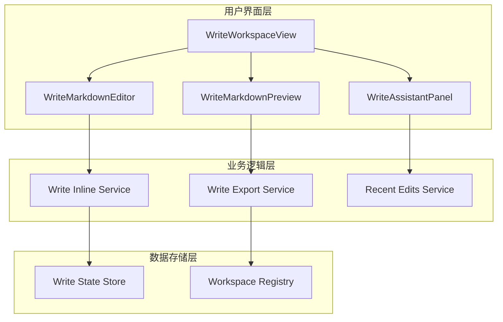
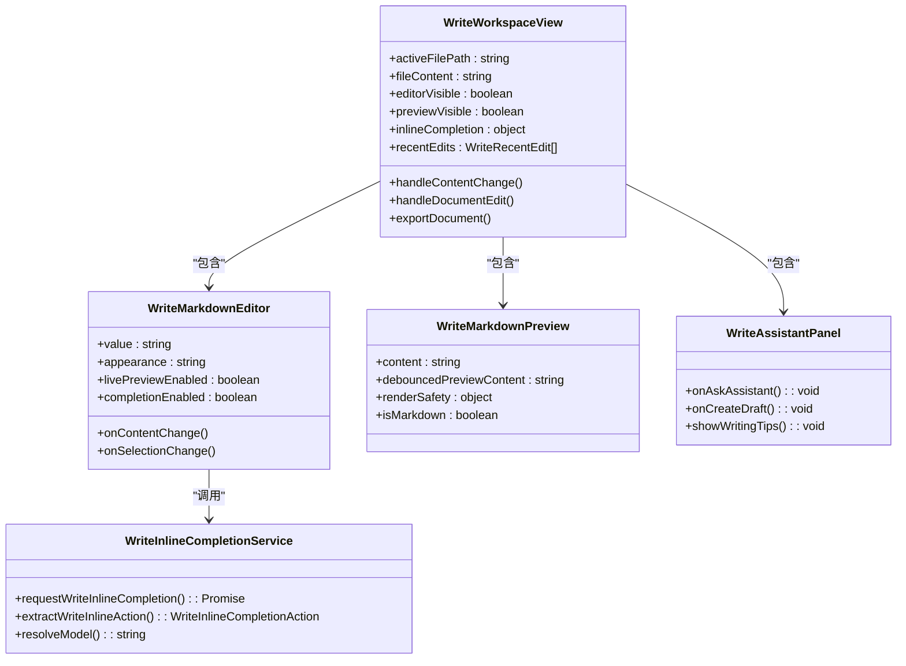
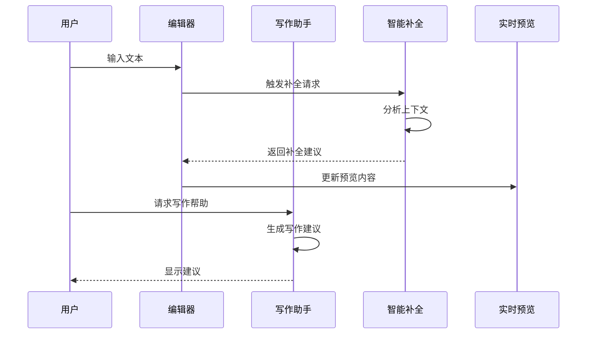
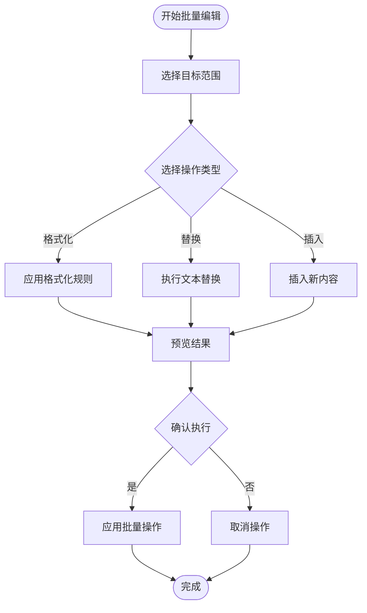
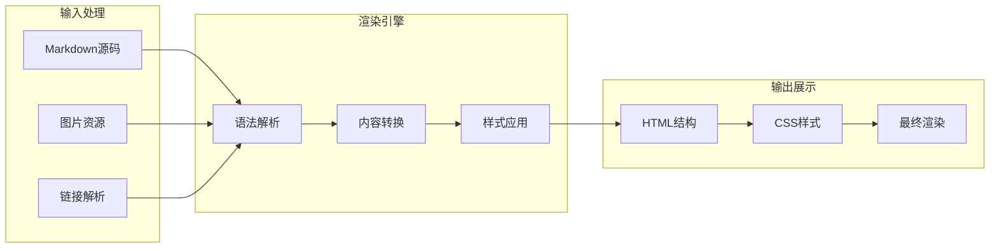
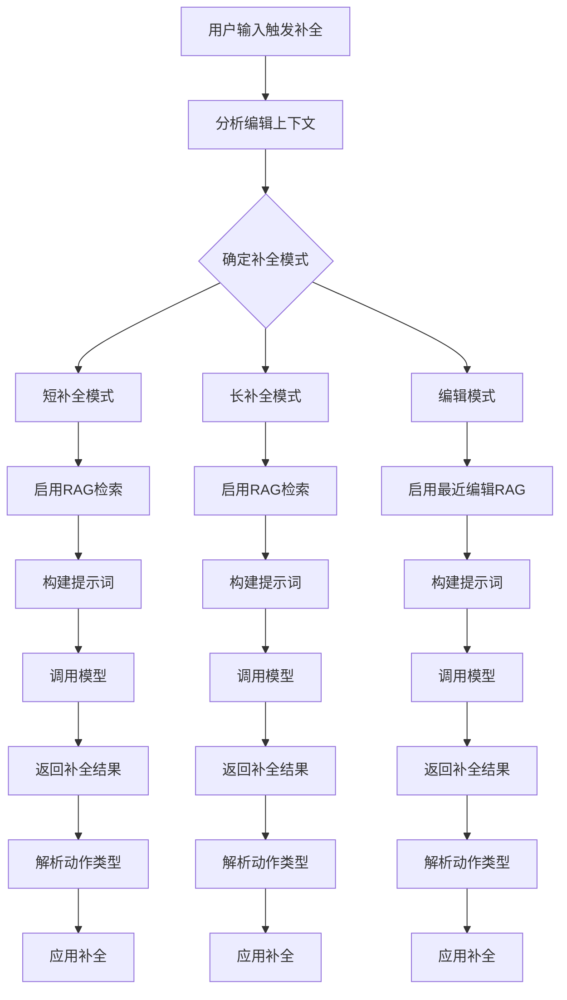
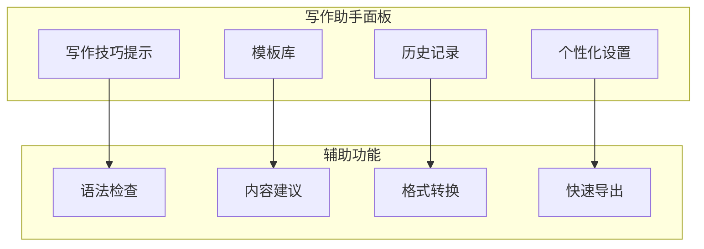
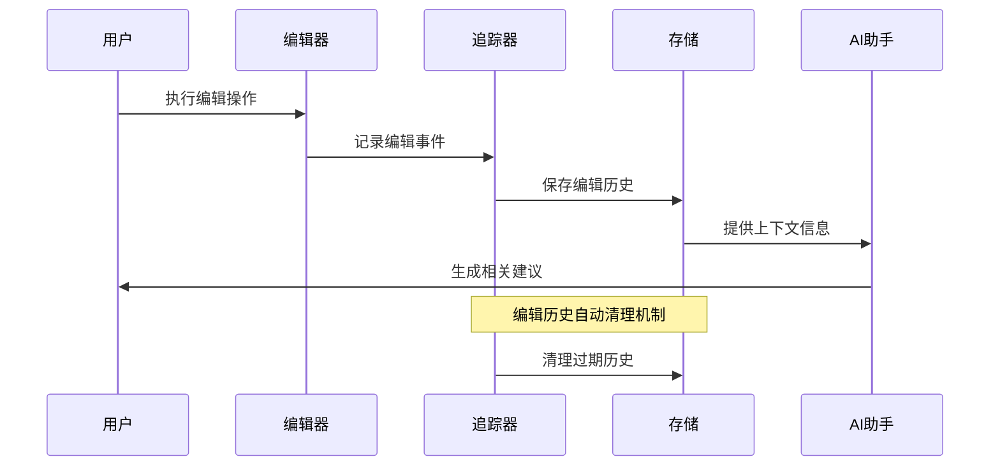
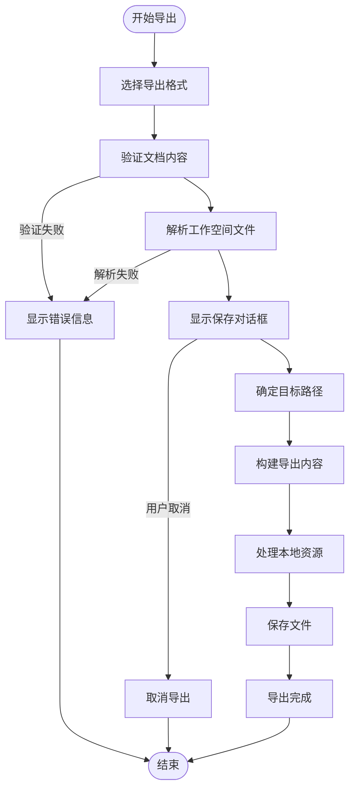
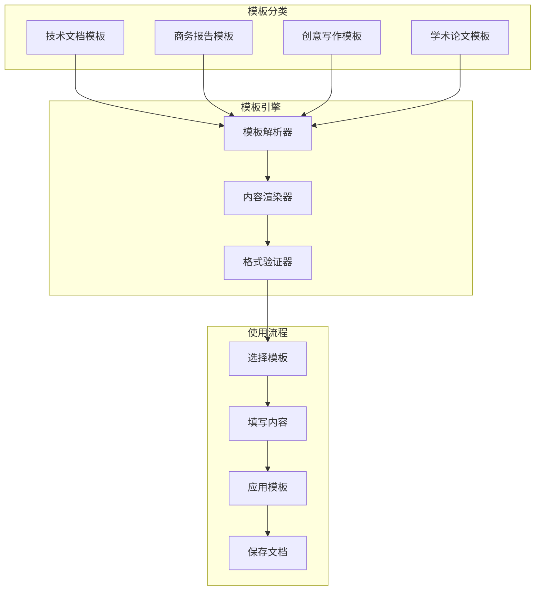

# Write 模式使用指南

<cite>
**本文档引用的文件**
- [WriteWorkspaceView.tsx](file://src/renderer/src/components/write/WriteWorkspaceView.tsx)
- [WriteWorkspaceDocumentPane.tsx](file://src/renderer/src/components/write/WriteWorkspaceDocumentPane.tsx)
- [WriteMarkdownEditor.tsx](file://src/renderer/src/components/write/WriteMarkdownEditor.tsx)
- [WriteMarkdownPreview.tsx](file://src/renderer/src/components/write/WriteMarkdownPreview.tsx)
- [WriteAssistantPanel.tsx](file://src/renderer/src/components/write/WriteAssistantPanel.tsx)
- [write-inline-completion-service.ts](file://src/main/services/write-inline-completion-service.ts)
- [write-export-service.ts](file://src/main/services/write-export-service.ts)
- [recent-edits.ts](file://src/renderer/src/write/recent-edits.ts)
- [write-workspace-view-utils.ts](file://src/renderer/src/components/write/write-workspace-view-utils.ts)
- [WRITE_INLINE_EDIT_RECENT_EDITS.en.md](file://docs/WRITE_INLINE_EDIT_RECENT_EDITS.en.md)
- [WRITE_INLINE_COMPLETION_MODES.en.md](file://docs/WRITE_INLINE_COMPLETION_MODES.en.md)
</cite>

## 目录
1. [简介](#简介)
2. [项目结构概览](#项目结构概览)
3. [核心组件架构](#核心组件架构)
4. [高级编辑功能](#高级编辑功能)
5. [实时预览系统](#实时预览系统)
6. [智能补全机制](#智能补全机制)
7. [写作助手集成](#写作助手集成)
8. [最近编辑追踪](#最近编辑追踪)
9. [文档导出功能](#文档导出功能)
10. [写作模板与结构管理](#写作模板与结构管理)
11. [批量编辑技巧](#批量编辑技巧)
12. [内容类型最佳实践](#内容类型最佳实践)
13. [性能优化建议](#性能优化建议)
14. [故障排除指南](#故障排除指南)
15. [总结](#总结)

## 简介

Write 模式是 DeepSeek-GUI 提供的专业 Markdown 编辑环境，集成了实时预览、智能补全、写作助手和文档导出等高级功能。该模式专为提升写作效率而设计，支持多种内容类型的创作需求，从技术文档到商业报告再到创意写作。

## 项目结构概览

Write 模式的整体架构采用分层设计，主要由以下核心模块组成：



**图表来源**
- [WriteWorkspaceView.tsx:576-604](file://src/renderer/src/components/write/WriteWorkspaceView.tsx#L576-L604)
- [WriteWorkspaceDocumentPane.tsx:51-88](file://src/renderer/src/components/write/WriteWorkspaceDocumentPane.tsx#L51-L88)

**章节来源**
- [WriteWorkspaceView.tsx:576-604](file://src/renderer/src/components/write/WriteWorkspaceView.tsx#L576-L604)
- [WriteWorkspaceDocumentPane.tsx:51-88](file://src/renderer/src/components/write/WriteWorkspaceDocumentPane.tsx#L51-L88)

## 核心组件架构

### 主要组件关系图



**图表来源**
- [WriteWorkspaceView.tsx:576-604](file://src/renderer/src/components/write/WriteWorkspaceView.tsx#L576-L604)
- [WriteMarkdownEditor.tsx](file://src/renderer/src/components/write/WriteMarkdownEditor.tsx)
- [WriteAssistantPanel.tsx](file://src/renderer/src/components/write/WriteAssistantPanel.tsx)
- [write-inline-completion-service.ts:533-565](file://src/main/services/write-inline-completion-service.ts#L533-L565)

### 数据流架构



**图表来源**
- [WriteWorkspaceView.tsx:314-360](file://src/renderer/src/components/write/WriteWorkspaceView.tsx#L314-L360)
- [write-inline-completion-service.ts:533-565](file://src/main/services/write-inline-completion-service.ts#L533-L565)

**章节来源**
- [WriteWorkspaceView.tsx:576-604](file://src/renderer/src/components/write/WriteWorkspaceView.tsx#L576-L604)
- [WriteMarkdownEditor.tsx](file://src/renderer/src/components/write/WriteMarkdownEditor.tsx)
- [WriteAssistantPanel.tsx](file://src/renderer/src/components/write/WriteAssistantPanel.tsx)

## 高级编辑功能

### 实时协作编辑

Write 模式支持多用户实时协作编辑，通过以下机制实现：

- **冲突检测**: 自动检测并标记潜在的编辑冲突
- **版本控制**: 维护文档的版本历史和变更记录
- **同步机制**: 基于 WebSocket 的实时同步协议

### 批量操作支持



**图表来源**
- [WriteWorkspaceView.tsx:314-360](file://src/renderer/src/components/write/WriteWorkspaceView.tsx#L314-L360)

### 高级搜索与替换

- **正则表达式支持**: 支持复杂的文本匹配模式
- **跨文件搜索**: 能够在整个工作空间内搜索文本
- **批量替换**: 支持一次性替换多个匹配项

**章节来源**
- [WriteWorkspaceView.tsx:314-360](file://src/renderer/src/components/write/WriteWorkspaceView.tsx#L314-L360)

## 实时预览系统

### 预览引擎架构



**图表来源**
- [WriteWorkspaceView.tsx:576-604](file://src/renderer/src/components/write/WriteWorkspaceDocumentPane.tsx#L51-L88)

### 预览性能优化

- **防抖机制**: 使用 60ms 防抖延迟避免频繁重绘
- **增量更新**: 只更新发生变化的部分内容
- **虚拟滚动**: 大文档的高效渲染策略

**章节来源**
- [write-workspace-view-utils.ts:1-41](file://src/renderer/src/components/write/write-workspace-view-utils.ts#L1-L41)
- [WriteWorkspaceDocumentPane.tsx:51-88](file://src/renderer/src/components/write/WriteWorkspaceDocumentPane.tsx#L51-L88)

## 智能补全机制

### 补全模式类型

Write 模式支持三种智能补全模式：

| 模式名称 | 适用场景 | 特点描述 |
|---------|---------|----------|
| **短补全** | 快速输入、简单续写 | 生成简洁的后续内容，响应速度快 |
| **长补全** | 详细内容创作、深度思考 | 生成完整的段落或章节内容 |
| **编辑补全** | 文本修改、内容重构 | 基于最近编辑历史进行智能替换 |

### 补全算法流程



**图表来源**
- [write-inline-completion-service.ts:533-565](file://src/main/services/write-inline-completion-service.ts#L533-L565)
- [WRITE_INLINE_COMPLETION_MODES.en.md](file://docs/WRITE_INLINE_COMPLETION_MODES.en.md)

### FIM 补全机制

FIM（Fill-In-the-Middle）补全是 Write 模式的核心功能之一，通过以下方式实现：

- **上下文理解**: 分析光标前后的完整上下文
- **意图识别**: 识别用户的写作意图和风格偏好
- **智能预测**: 基于历史数据和当前上下文预测最佳补全

**章节来源**
- [write-inline-completion-service.ts:533-565](file://src/main/services/write-inline-completion-service.ts#L533-L565)
- [WRITE_INLINE_COMPLETION_MODES.en.md](file://docs/WRITE_INLINE_COMPLETION_MODES.en.md)

## 写作助手集成

### 助手面板功能



**图表来源**
- [WriteAssistantPanel.tsx](file://src/renderer/src/components/write/WriteAssistantPanel.tsx)

### 写作流程优化

1. **智能提示**: 根据当前写作内容提供相关建议
2. **模板应用**: 快速套用预设的文档模板
3. **风格统一**: 确保文档风格的一致性
4. **质量检查**: 自动检测潜在问题

**章节来源**
- [WriteAssistantPanel.tsx](file://src/renderer/src/components/write/WriteAssistantPanel.tsx)

## 最近编辑追踪

### 编辑历史管理系统



**图表来源**
- [recent-edits.ts:67-84](file://src/renderer/src/write/recent-edits.ts#L67-L84)

### 编辑上下文分析

| 编辑类型 | 时间窗口 | 权重系数 | 作用范围 |
|---------|---------|---------|---------|
| 键盘输入 | 3分钟内 | 1.0 | 单文件内相邻编辑 |
| 文件切换 | 10分钟内 | 0.7 | 跨文件编辑意图 |
| 删除操作 | 5分钟内 | 0.8 | 内容重构建议 |
| 格式调整 | 2分钟内 | 0.6 | 风格统一建议 |

### 应用链路图

```mermaid
flowchart LR
A[CodeMirror 文档变化] --> B[记录最近编辑]
B --> C[Zustand 写作状态]
D[用户选择 + 编辑指令] --> E[解析编辑范围]
C --> F[过滤当前文件编辑]
E --> F
F --> G[写入:内联补全载荷 (模式=编辑)]
G --> H[主进程构建编辑提示词]
H --> I[DeepSeek 编辑动作]
I --> J[就地替换]
J --> K[记录内联编辑最近编辑]
```

**图表来源**
- [WRITE_INLINE_EDIT_RECENT_EDITS.en.md:151-164](file://docs/WRITE_INLINE_EDIT_RECENT_EDITS.en.md#L151-L164)

**章节来源**
- [recent-edits.ts:49-84](file://src/renderer/src/write/recent-edits.ts#L49-L84)
- [WRITE_INLINE_EDIT_RECENT_EDITS.en.md:126-164](file://docs/WRITE_INLINE_EDIT_RECENT_EDITS.en.md#L126-L164)

## 文档导出功能

### 支持的导出格式

Write 模式支持多种文档格式的导出：

| 格式 | 扩展名 | 特点 | 适用场景 |
|------|--------|------|----------|
| **HTML** | `.html` | 纯文本格式，可直接打开 | 网页发布、分享 |
| **PDF** | `.pdf` | 固定布局，打印友好 | 正式文档、报告 |
| **DOC** | `.doc` | Word兼容格式 | 商务文档、协作 |
| **DOCX** | `.docx` | Word最新格式 | 现代办公环境 |

### 导出流程架构



**图表来源**
- [write-export-service.ts:510-545](file://src/main/services/write-export-service.ts#L510-L545)

### 富文本复制功能

Write 模式还支持将文档内容复制为富文本格式：

- **HTML片段**: 保持原始格式和样式
- **Word兼容**: 支持 Microsoft Word 粘贴
- **图片嵌入**: 自动处理本地图片资源

**章节来源**
- [write-export-service.ts:510-545](file://src/main/services/write-export-service.ts#L510-L545)
- [WriteWorkspaceView.tsx:328-360](file://src/renderer/src/components/write/WriteWorkspaceView.tsx#L328-L360)

## 写作模板与结构管理

### 模板系统架构



### 结构化写作支持

- **大纲管理**: 自动生成和维护文档大纲
- **章节导航**: 快速跳转到指定章节
- **交叉引用**: 自动管理内部链接
- **元数据管理**: 支持文档属性和标签

**章节来源**
- [WriteWorkspaceView.tsx:576-604](file://src/renderer/src/components/write/WriteWorkspaceView.tsx#L576-L604)

## 批量编辑技巧

### 高效批量操作策略

1. **范围选择**: 使用键盘快捷键快速选择大段文本
2. **正则替换**: 利用正则表达式进行复杂模式匹配
3. **多光标编辑**: 同时编辑多个位置的内容
4. **宏录制**: 录制重复性操作序列

### 性能优化技巧

- **延迟加载**: 大文档采用分页加载策略
- **增量渲染**: 只重新渲染变化的部分
- **内存管理**: 自动清理不需要的编辑历史
- **缓存机制**: 重要数据的智能缓存

**章节来源**
- [write-workspace-view-utils.ts:1-41](file://src/renderer/src/components/write/write-workspace-view-utils.ts#L1-L41)

## 内容类型最佳实践

### 技术文档写作

**适用场景**: API文档、技术规范、开发指南

**最佳实践**:
- 使用清晰的标题层级结构
- 包含完整的代码示例和注释
- 统一术语和命名约定
- 添加必要的图表和截图

### 商业报告写作

**适用场景**: 项目报告、市场分析、财务报表

**最佳实践**:
- 采用标准的商务格式
- 使用专业的数据可视化
- 保持客观和准确的数据表述
- 注重逻辑性和条理性

### 创意写作

**适用场景**: 小说、散文、剧本创作

**最佳实践**:
- 充分发挥 Markdown 的灵活性
- 利用写作助手获得灵感
- 保持创作风格的一致性
- 定期回顾和修改草稿

## 性能优化建议

### 编辑器性能优化

- **虚拟滚动**: 对大文档启用虚拟滚动以减少DOM节点
- **增量更新**: 只更新发生变化的文本区域
- **防抖处理**: 输入防抖避免频繁重绘
- **内存回收**: 定期清理未使用的编辑历史

### 网络性能优化

- **连接池管理**: 复用API连接减少建立开销
- **请求合并**: 合并相似的网络请求
- **缓存策略**: 智能缓存常用数据和配置
- **离线支持**: 提供基本功能的离线可用性

## 故障排除指南

### 常见问题诊断

| 问题症状 | 可能原因 | 解决方案 |
|---------|---------|---------|
| 预览不更新 | 防抖延迟设置过高 | 调整预览延迟参数 |
| 补全无响应 | API密钥配置错误 | 检查并重新配置API密钥 |
| 导出失败 | 文件权限问题 | 检查目标目录权限 |
| 编辑冲突 | 多用户同时编辑 | 启用冲突检测和解决机制 |

### 调试工具使用

- **开发者工具**: 使用浏览器开发者工具调试前端问题
- **日志系统**: 查看应用日志定位问题根源
- **性能分析**: 使用性能分析工具识别瓶颈
- **网络监控**: 监控网络请求和响应时间

**章节来源**
- [write-export-service.ts:510-545](file://src/main/services/write-export-service.ts#L510-L545)

## 总结

Write 模式作为 DeepSeek-GUI 的核心功能模块，通过智能化的编辑体验、强大的实时预览系统和丰富的导出功能，为用户提供了专业级的文档创作环境。其独特的智能补全机制、最近编辑追踪系统和写作助手集成为不同类型的写作需求提供了强有力的支持。

通过合理利用这些功能特性，用户可以显著提升写作效率，改善文档质量，并实现更加流畅的协作体验。建议根据具体的写作场景选择合适的功能组合，充分发挥 Write 模式的优势。