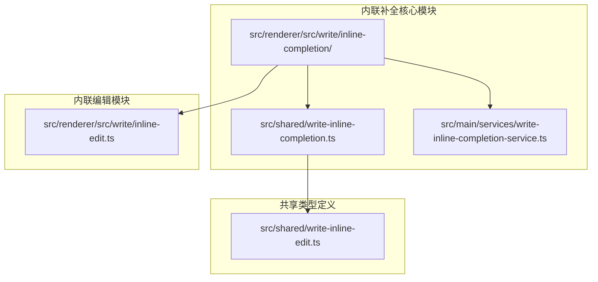
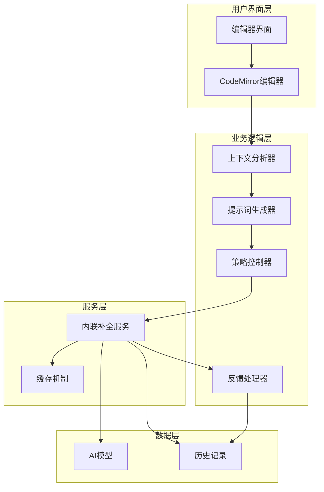
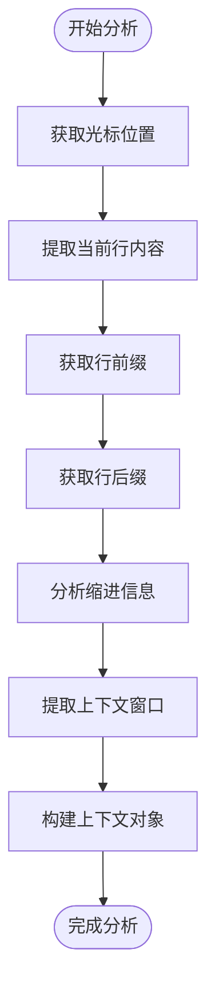
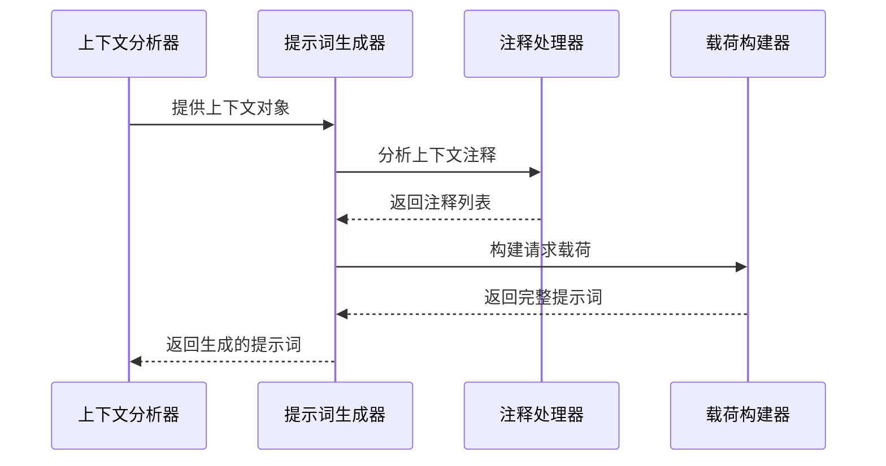
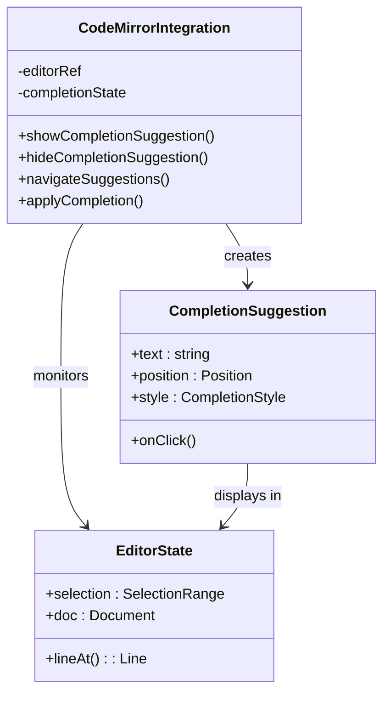
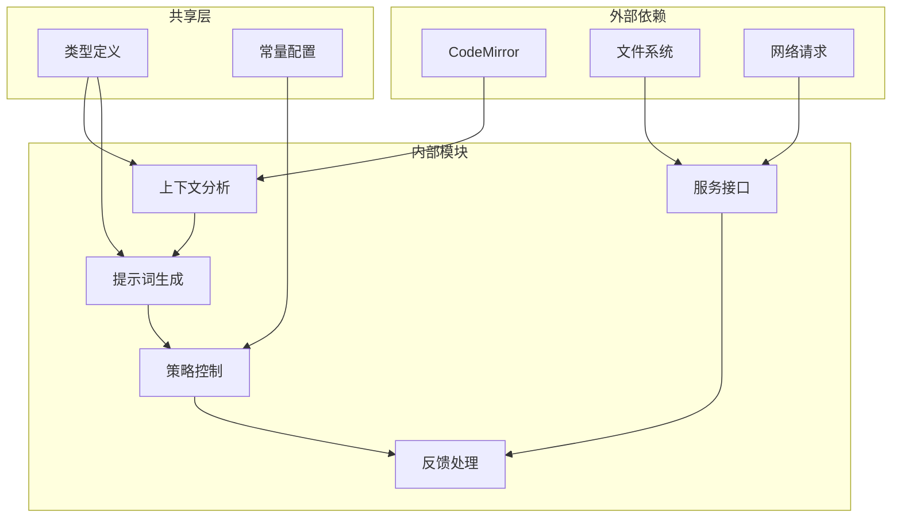

# 内联补全功能指南

<cite>
**本文档引用的文件**
- [src\renderer\src\write\inline-completion\context.ts](file://src/renderer/src/write/inline-completion/context.ts)
- [src\renderer\src\write\inline-completion\prompt.ts](file://src/renderer/src/write/inline-completion/prompt.ts)
- [src\renderer\src\write\inline-completion\codemirror.ts](file://src/renderer/src/write/inline-completion/codemirror.ts)
- [src\renderer\src\write\inline-completion\policy.ts](file://src/renderer/src/write/inline-completion/policy.ts)
- [src\renderer\src\write\inline-completion\types.ts](file://src/renderer/src/write/inline-completion/types.ts)
- [src\renderer\src\write\inline-completion\feedback.ts](file://src/renderer/src/write/inline-completion/feedback.ts)
- [src\renderer\src\write\inline-completion\constants.ts](file://src/renderer/src/write/inline-completion/constants.ts)
- [src\renderer\src\write\inline-edit.ts](file://src/renderer/src/write/inline-edit.ts)
- [src\shared\write-inline-completion.ts](file://src/shared/write-inline-completion.ts)
- [src\main\services\write-inline-completion-service.ts](file://src/main/services/write-inline-completion-service.ts)
</cite>

## 目录
1. [简介](#简介)
2. [项目结构](#项目结构)
3. [核心组件](#核心组件)
4. [架构概览](#架构概览)
5. [详细组件分析](#详细组件分析)
6. [依赖关系分析](#依赖关系分析)
7. [性能考虑](#性能考虑)
8. [故障排除指南](#故障排除指南)
9. [结论](#结论)
10. [附录](#附录)

## 简介

内联补全功能是 DeepSeek GUI 中一个强大的代码辅助工具，它基于 FIM（Fill-In-the-Middle）补全机制，为用户提供智能的上下文感知代码补全体验。该功能通过分析用户当前的编辑上下文，动态生成最合适的代码补全建议，并支持多种编程语言和编辑模式。

本指南将深入介绍内联补全的工作原理、配置选项、使用方法以及最佳实践，帮助开发者充分利用这一强大的代码辅助功能。

## 项目结构

内联补全功能主要分布在以下目录结构中：

**图表来源**
- [src\renderer\src\write\inline-completion\index.ts](file://src/renderer/src/write/inline-completion/index.ts)
- [src\shared\write-inline-completion.ts](file://src/shared/write-inline-completion.ts)

**章节来源**
- [src\renderer\src\write\inline-completion\index.ts](file://src/renderer/src/write/inline-completion/index.ts)
- [src\shared\write-inline-completion.ts](file://src/shared/write-inline-completion.ts)

## 核心组件

内联补全系统由多个相互协作的组件构成，每个组件都有特定的功能和职责：

### 上下文构建器
负责分析编辑器状态，提取当前编辑上下文信息，包括光标位置、前后文内容、缩进信息等。

### 提示词构建器
基于上下文信息生成适合模型推理的提示词，包含格式化规则、语言特定指令等。

### 编辑器集成层
与 CodeMirror 编辑器深度集成，处理补全建议的显示、选择和应用。

### 策略控制器
管理补全策略，包括触发条件、建议数量、显示模式等。

### 反馈收集器
收集用户对补全结果的反馈，用于改进未来的补全质量。

**章节来源**
- [src\renderer\src\write\inline-completion\context.ts:114-136](file://src/renderer/src/write/inline-completion/context.ts#L114-L136)
- [src\renderer\src\write\inline-completion\prompt.ts:140-168](file://src/renderer/src/write/inline-completion/prompt.ts#L140-L168)
- [src\renderer\src\write\inline-completion\codemirror.ts](file://src/renderer/src/write/inline-completion/codemirror.ts)
- [src\renderer\src\write\inline-completion\policy.ts](file://src/renderer/src/write/inline-completion/policy.ts)

## 架构概览

内联补全系统的整体架构采用分层设计，确保了功能的模块化和可维护性：

**图表来源**
- [src\renderer\src\write\inline-completion\context.ts:114-136](file://src/renderer/src/write/inline-completion/context.ts#L114-L136)
- [src\renderer\src\write\inline-completion\prompt.ts:140-168](file://src/renderer/src/write/inline-completion/prompt.ts#L140-L168)
- [src\main\services\write-inline-completion-service.ts](file://src/main/services/write-inline-completion-service.ts)

## 详细组件分析

### 上下文分析器

上下文分析器是内联补全系统的核心组件，负责从编辑器状态中提取所有必要的上下文信息。

#### 关键功能特性

1. **光标位置分析**：精确确定用户当前的编辑位置
2. **前后文提取**：获取当前行的前缀和后缀内容
3. **缩进信息处理**：分析代码缩进级别和格式
4. **上下文窗口管理**：控制分析范围，避免不必要的计算

**图表来源**
- [src\renderer\src\write\inline-completion\context.ts:114-136](file://src/renderer/src/write/inline-completion/context.ts#L114-L136)

#### 上下文对象结构

上下文分析器返回的上下文对象包含以下关键信息：

| 字段名 | 类型 | 描述 | 示例 |
|--------|------|------|------|
| `head` | number | 光标位置 | 150 |
| `line` | Line | 当前行对象 | 包含行号、文本等 |
| `prefix` | string | 光标前的内容 | "function hello(" |
| `suffix` | string | 光标后的容 | ")" |
| `currentLinePrefix` | string | 当前行前缀 | "function hello(" |
| `currentLineSuffix` | string | 当前行后缀 | ")" |
| `previousLineText` | string | 前一行文本 | "" |
| `nextLineText` | string | 后一行文本 | "" |
| `indentation` | string | 缩进字符串 | "    " |
| `isAtLineEnd` | boolean | 是否在行末 | false |

**章节来源**
- [src\renderer\src\write\inline-completion\context.ts:114-136](file://src/renderer/src/write/inline-completion/context.ts#L114-L136)

### 提示词生成器

提示词生成器负责将上下文信息转换为适合 AI 模型处理的格式化提示词。

#### 生成流程

**图表来源**
- [src\renderer\src\write\inline-completion\prompt.ts:140-168](file://src/renderer/src/write/inline-completion/prompt.ts#L140-L168)

#### 提示词构建要素

1. **上下文注释**：根据编辑环境添加适当的注释
2. **最近编辑整合**：结合用户的最近编辑历史
3. **语言特定指令**：针对不同编程语言的特殊要求
4. **格式化规则**：保持代码风格一致性

**章节来源**
- [src\renderer\src\write\inline-completion\prompt.ts:140-168](file://src/renderer/src/write/inline-completion/prompt.ts#L140-L168)

### CodeMirror 集成

内联补全功能与 CodeMirror 编辑器深度集成，提供了无缝的用户体验。

#### 集成特性

1. **实时补全**：在用户输入时动态提供补全建议
2. **智能定位**：自动调整补全建议的位置和样式
3. **键盘导航**：支持键盘快捷键进行补全选择
4. **视觉反馈**：提供清晰的视觉指示和高亮显示

**图表来源**
- [src\renderer\src\write\inline-completion\codemirror.ts](file://src/renderer/src/write/inline-completion/codemirror.ts)

**章节来源**
- [src\renderer\src\write\inline-completion\codemirror.ts](file://src/renderer/src/write/inline-completion/codemirror.ts)

### 补全策略控制器

策略控制器管理内联补全的各种行为参数和触发条件。

#### 策略配置

| 策略名称 | 默认值 | 描述 |
|----------|--------|------|
| `mode` | "short" | 补全模式：short/medium/long |
| `maxSuggestions` | 5 | 最大建议数量 |
| `triggerOnTyping` | true | 输入时是否触发 |
| `showInlinePreview` | true | 是否显示内联预览 |
| `autoAcceptTimeout` | 3000 | 自动接受超时时间(ms) |

#### 触发条件

1. **光标位置**：在代码块内部而非空白处
2. **输入延迟**：用户停止输入一段时间后
3. **上下文匹配**：符合编程语言的语法结构
4. **性能阈值**：避免在大型文档中过度触发

**章节来源**
- [src\renderer\src\write\inline-completion\policy.ts](file://src/renderer/src/write/inline-completion/policy.ts)
- [src\renderer\src\write\inline-completion\constants.ts](file://src/renderer/src/write/inline-completion/constants.ts)

### 反馈收集系统

反馈收集系统用于收集用户对补全结果的评价，以改进未来的补全质量。

#### 反馈类型

1. **正面反馈**：用户接受补全建议
2. **负面反馈**：用户拒绝补全建议
3. **部分接受**：用户只接受了部分内容
4. **无反馈**：用户忽略补全建议

#### 数据收集机制

**图表来源**
- [src\renderer\src\write\inline-completion\feedback.ts](file://src/renderer/src/write/inline-completion/feedback.ts)

**章节来源**
- [src\renderer\src\write\inline-completion\feedback.ts](file://src/renderer/src/write/inline-completion/feedback.ts)

## 依赖关系分析

内联补全系统的依赖关系相对简单，主要依赖于 CodeMirror 编辑器和 AI 模型服务。

**图表来源**
- [src\renderer\src\write\inline-completion\context.ts:114-136](file://src/renderer/src/write/inline-completion/context.ts#L114-L136)
- [src\renderer\src\write\inline-completion\prompt.ts:140-168](file://src/renderer/src/write/inline-completion/prompt.ts#L140-L168)

**章节来源**
- [src\renderer\src\write\inline-completion\types.ts](file://src/renderer/src/write/inline-completion/types.ts)
- [src\shared\write-inline-completion.ts](file://src/shared/write-inline-completion.ts)

## 性能考虑

内联补全功能在设计时充分考虑了性能优化，确保在各种环境下都能提供流畅的用户体验。

### 缓存机制

系统实现了多层次的缓存策略：

1. **上下文缓存**：缓存最近的编辑上下文
2. **补全结果缓存**：缓存相似场景下的补全结果
3. **模型响应缓存**：缓存模型的响应以减少重复计算

### 上下文窗口管理

为了优化性能，系统限制了上下文分析的范围：

- **最大字符数**：限制单次分析的最大字符数
- **行数限制**：限制前后文分析的行数
- **递归深度**：控制上下文分析的递归深度

### 异步处理

所有耗时的操作都采用异步处理方式：

- **非阻塞 UI**：确保用户界面始终响应
- **并发控制**：限制同时进行的补全请求数量
- **优先级调度**：根据重要性安排处理顺序

## 故障排除指南

### 常见问题及解决方案

#### 补全不触发

**可能原因**：
1. 光标位置不符合触发条件
2. 编辑器状态异常
3. 网络连接问题

**解决步骤**：
1. 检查光标是否位于代码区域
2. 重新加载编辑器
3. 检查网络连接状态

#### 补全建议不准确

**可能原因**：
1. 上下文分析不正确
2. 模型理解偏差
3. 语言特定规则缺失

**解决步骤**：
1. 提供更清晰的上下文
2. 调整补全策略设置
3. 检查语言支持配置

#### 性能问题

**可能原因**：
1. 文档过大导致分析缓慢
2. 缓存失效
3. 并发请求过多

**解决步骤**：
1. 分割大型文件
2. 清理缓存
3. 减少并发请求

**章节来源**
- [src\renderer\src\write\inline-completion\policy.ts](file://src/renderer/src/write/inline-completion/policy.ts)
- [src\renderer\src\write\inline-completion\feedback.ts](file://src/renderer/src/write/inline-completion/feedback.ts)

## 结论

内联补全功能通过 FIM（Fill-In-the-Middle）补全机制和上下文感知技术，为用户提供了智能化的代码辅助体验。该系统具有以下优势：

1. **智能上下文分析**：能够准确理解用户的编辑意图
2. **多语言支持**：支持多种编程语言和标记语言
3. **高性能设计**：通过缓存和异步处理确保流畅体验
4. **可定制性强**：支持多种策略配置和个性化设置

随着 AI 技术的不断发展，内联补全功能将继续演进，为开发者提供更加智能和高效的代码编写体验。

## 附录

### 支持的编程语言

系统支持以下编程语言的内联补全：

- JavaScript/TypeScript
- Python
- Java
- C/C++
- Go
- Rust
- HTML/CSS
- Markdown

### 快速开始指南

1. 打开支持的编程语言文件
2. 在代码编辑器中输入代码
3. 等待内联补全建议出现
4. 使用键盘或鼠标选择补全建议
5. 按 Enter 键确认或 Esc 键取消

### 高级配置选项

- `inlineCompletion.enabled`: 启用/禁用内联补全
- `inlineCompletion.maxSuggestions`: 设置最大建议数量
- `inlineCompletion.triggerOnTyping`: 配置触发时机
- `inlineCompletion.autoAcceptDelay`: 设置自动接受延迟