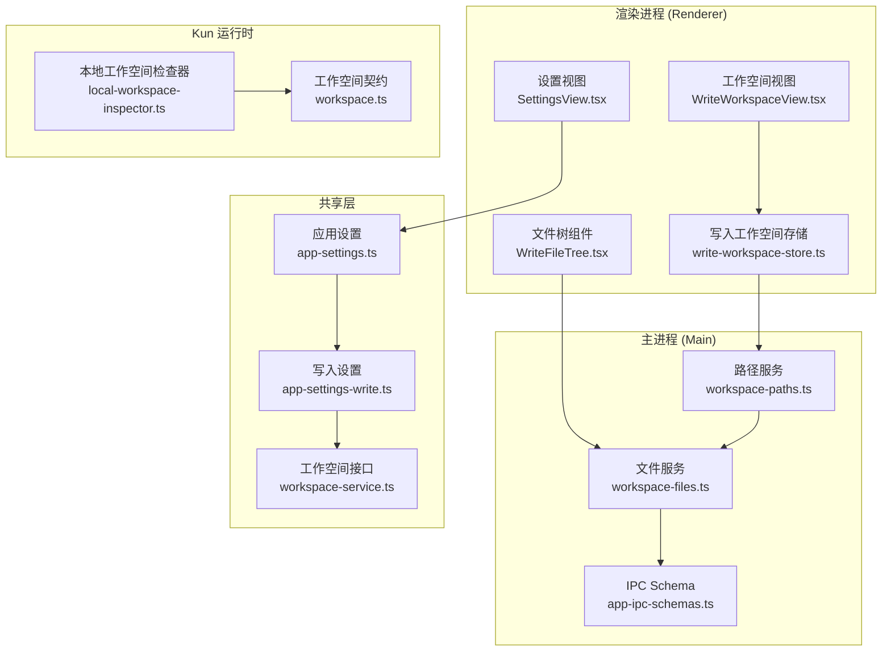
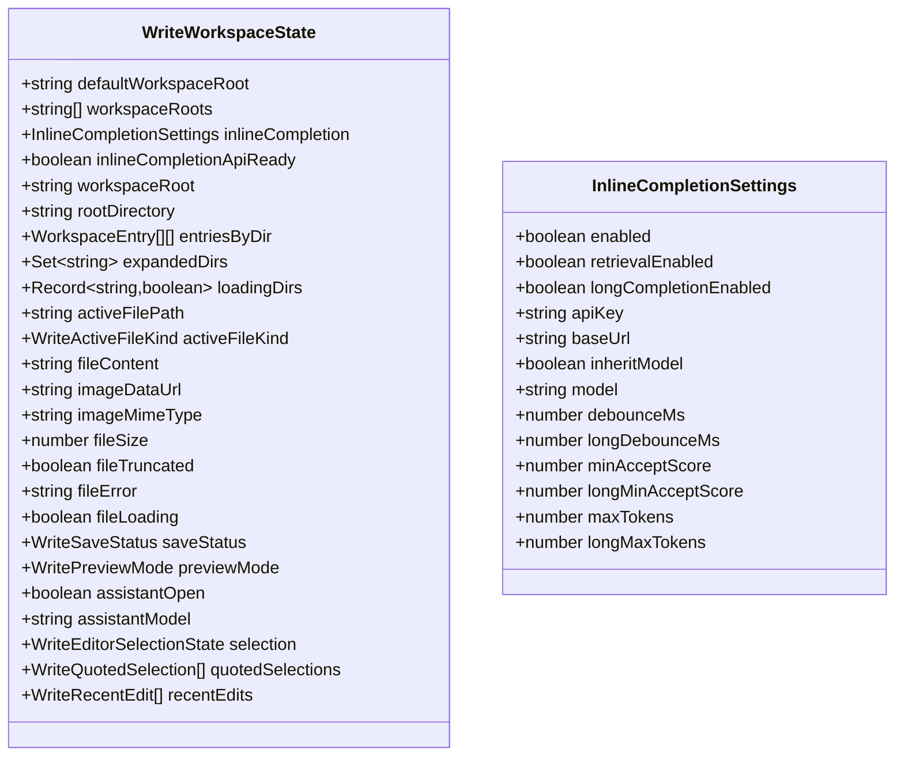
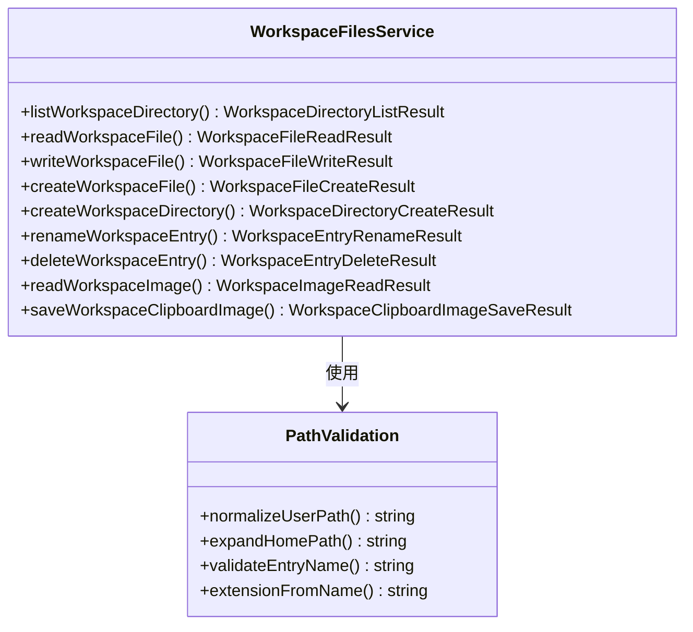
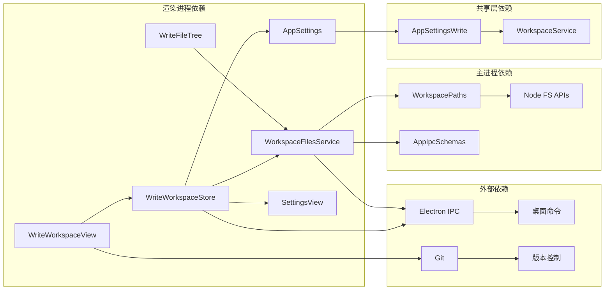

# 写作工作空间管理指南

<cite>
**本文档引用的文件**
- [write-workspace-store.ts](file://src/renderer/src/write/write-workspace-store.ts)
- [write-workspace-store-types.ts](file://src/renderer/src/write/write-workspace-store-types.ts)
- [WriteWorkspaceView.tsx](file://src/renderer/src/components/write/WriteWorkspaceView.tsx)
- [WriteFileTree.tsx](file://src/renderer/src/components/write/WriteFileTree.tsx)
- [workspace-paths.ts](file://src/main/services/workspace-paths.ts)
- [workspace-files.ts](file://src/main/services/workspace-files.ts)
- [workspace-service.ts](file://src/main/services/workspace-service.ts)
- [app-settings.ts](file://src/shared/app-settings.ts)
- [app-settings-write.ts](file://src/shared/app-settings-write.ts)
- [SettingsView.tsx](file://src/renderer/src/components/SettingsView.tsx)
- [workspace-path.ts](file://src/renderer/src/lib/workspace-path.ts)
- [workspace-label.ts](file://src/renderer/src/lib/workspace-label.ts)
- [open-workspace-path.ts](file://src/renderer/src/lib/open-workspace-path.ts)
- [app-ipc-schemas.ts](file://src/main/ipc/app-ipc-schemas.ts)
- [local-workspace-inspector.ts](file://kun/src/adapters/workspace/local-workspace-inspector.ts)
- [workspace.ts](file://kun/src/contracts/workspace.ts)
- [workspace.ts](file://kun/src/server/routes/workspace.ts)
</cite>

## 目录
1. [简介](#简介)
2. [项目结构](#项目结构)
3. [核心组件](#核心组件)
4. [架构概览](#架构概览)
5. [详细组件分析](#详细组件分析)
6. [依赖关系分析](#依赖关系分析)
7. [性能考虑](#性能考虑)
8. [故障排除指南](#故障排除指南)
9. [结论](#结论)
10. [附录](#附录)

## 简介

写作工作空间管理系统是一个基于 Electron 和 React 的现代化文档编辑平台，专为深度写作和内容创作而设计。该系统提供了完整的文件管理、实时协作、智能编辑辅助和版本控制集成功能。

本指南将详细介绍工作空间的创建、组织、配置方法，包括文件树导航、文档分类、标签管理功能，以及工作空间设置、偏好配置、快捷方式定制等高级特性。同时涵盖多项目管理、团队协作、版本控制集成的使用方法，以及工作空间备份、迁移、恢复的操作指南。

## 项目结构

该系统采用模块化架构设计，主要分为以下几个核心层次：

**图表来源**
- [write-workspace-store.ts:1-351](file://src/renderer/src/write/write-workspace-store.ts#L1-L351)
- [workspace-paths.ts:1-239](file://src/main/services/workspace-paths.ts#L1-L239)
- [workspace-files.ts:1-395](file://src/main/services/workspace-files.ts#L1-L395)

**章节来源**
- [write-workspace-store.ts:1-351](file://src/renderer/src/write/write-workspace-store.ts#L1-L351)
- [workspace-service.ts:1-4](file://src/main/services/workspace-service.ts#L1-L4)

## 核心组件

### 写作工作空间存储 (WriteWorkspaceStore)

写作工作空间存储是整个系统的核心状态管理组件，负责维护工作空间的所有状态信息和操作逻辑。

**主要功能特性：**
- 工作空间根目录管理
- 文件内容同步和保存
- 预览模式切换
- 内联编辑辅助
- 最近编辑历史记录
- 选区引用管理

**状态管理结构：**

**图表来源**
- [write-workspace-store-types.ts:11-78](file://src/renderer/src/write/write-workspace-store-types.ts#L11-L78)

**章节来源**
- [write-workspace-store.ts:52-350](file://src/renderer/src/write/write-workspace-store.ts#L52-L350)
- [write-workspace-store-types.ts:1-85](file://src/renderer/src/write/write-workspace-store-types.ts#L1-L85)

### 设置管理系统

设置管理系统提供了完整的配置管理功能，支持多种设置类型的统一管理和持久化存储。

**设置类型分布：**
- 全局设置 (General Settings)
- 写作设置 (Write Settings)  
- 代理设置 (Agents Settings)
- CLAW 设置 (Claw Settings)
- 计划设置 (Schedule Settings)

**章节来源**
- [SettingsView.tsx:68-849](file://src/renderer/src/components/SettingsView.tsx#L68-L849)
- [app-settings.ts:1-10](file://src/shared/app-settings.ts#L1-L10)

## 架构概览

系统采用分层架构设计，确保了良好的可维护性和扩展性：

**图表来源**
- [WriteWorkspaceView.tsx:266-280](file://src/renderer/src/components/write/WriteWorkspaceView.tsx#L266-L280)
- [workspace-paths.ts:217-233](file://src/main/services/workspace-paths.ts#L217-L233)

**章节来源**
- [WriteWorkspaceView.tsx:1-663](file://src/renderer/src/components/write/WriteWorkspaceView.tsx#L1-L663)
- [workspace-files.ts:1-395](file://src/main/services/workspace-files.ts#L1-L395)

## 详细组件分析

### 文件树导航组件

文件树导航组件提供了直观的文件浏览和管理功能：

**图表来源**
- [WriteFileTree.tsx:89-278](file://src/renderer/src/components/write/WriteFileTree.tsx#L89-L278)

**章节来源**
- [WriteFileTree.tsx:1-278](file://src/renderer/src/components/write/WriteFileTree.tsx#L1-L278)

### 路径解析和验证系统

路径解析系统确保了工作空间内文件访问的安全性和正确性：

**核心功能：**
- 路径规范化处理
- 安全边界检查
- 相对路径转换
- 绝对路径解析

**章节来源**
- [workspace-paths.ts:1-239](file://src/main/services/workspace-paths.ts#L1-L239)
- [workspace-path.ts:1-44](file://src/renderer/src/lib/workspace-path.ts#L1-L44)

### 文件操作服务

文件操作服务提供了完整的文件管理功能：

**图表来源**
- [workspace-files.ts:65-395](file://src/main/services/workspace-files.ts#L65-L395)

**章节来源**
- [workspace-files.ts:1-395](file://src/main/services/workspace-files.ts#L1-L395)

### 版本控制系统集成

系统集成了 Git 版本控制功能，提供工作空间状态监控：

**版本控制功能：**
- 仓库状态检查
- 分支信息获取
- 文件变更跟踪
- 提交状态监控

**章节来源**
- [local-workspace-inspector.ts:1-44](file://kun/src/adapters/workspace/local-workspace-inspector.ts#L1-L44)
- [workspace.ts:1-18](file://kun/src/contracts/workspace.ts#L1-L18)

## 依赖关系分析

系统各组件之间的依赖关系如下：

**图表来源**
- [write-workspace-store.ts:1-351](file://src/renderer/src/write/write-workspace-store.ts#L1-L351)
- [workspace-files.ts:1-395](file://src/main/services/workspace-files.ts#L1-L395)
- [app-ipc-schemas.ts:1-767](file://src/main/ipc/app-ipc-schemas.ts#L1-L767)

**章节来源**
- [app-settings.ts:1-10](file://src/shared/app-settings.ts#L1-L10)
- [app-settings-write.ts:1-182](file://src/shared/app-settings-write.ts#L1-L182)

## 性能考虑

### 文件读取优化

系统实现了多种文件读取优化策略：

- **预览大小限制**：文本文件最大预览 1.5MB，图片文件最大 12MB
- **二进制文件检测**：自动检测二进制文件避免内存溢出
- **增量同步**：大文件外部同步时的动画效果优化

### 存储和缓存策略

- **浏览器存储**：用户偏好设置本地存储
- **内存缓存**：最近编辑历史和临时数据缓存
- **文件系统缓存**：工作空间目录结构缓存

### 网络和API调用

- **请求节流**：内联编辑请求的防抖机制
- **错误重试**：网络异常时的自动重试策略
- **超时控制**：长时间操作的超时保护

## 故障排除指南

### 常见问题诊断

**工作空间无法加载：**
1. 检查工作空间路径是否有效
2. 验证文件权限设置
3. 确认磁盘空间充足

**文件保存失败：**
1. 检查目标路径是否在工作空间范围内
2. 验证文件权限和锁定状态
3. 确认磁盘空间和配额限制

**版本控制功能异常：**
1. 检查 Git 是否正确安装和配置
2. 验证工作空间是否为 Git 仓库
3. 确认 Git 凭据和认证设置

### 错误处理机制

系统提供了多层次的错误处理：

**章节来源**
- [workspace-files.ts:90-126](file://src/main/services/workspace-files.ts#L90-L126)
- [workspace-paths.ts:142-184](file://src/main/services/workspace-paths.ts#L142-L184)

## 结论

写作工作空间管理系统提供了一个功能完整、性能优异的文档编辑平台。通过模块化的架构设计和完善的错误处理机制，系统能够满足从个人写作到团队协作的各种需求。

系统的主要优势包括：
- 直观的文件树导航和管理
- 强大的设置和配置管理
- 完善的版本控制集成
- 良好的性能和稳定性
- 可扩展的插件架构

未来的发展方向包括增强团队协作功能、改进智能编辑辅助、扩展多平台支持等。

## 附录

### 快速开始指南

**创建工作空间：**
1. 在设置中选择默认工作空间路径
2. 或者在写作界面中选择现有工作空间
3. 系统会自动初始化工作空间状态

**基本操作：**
- 创建新文件：点击文件树中的创建按钮
- 编辑文档：在编辑器中直接输入
- 保存文档：使用 Ctrl+S 或点击保存按钮
- 切换预览模式：使用顶部工具栏的模式切换

**高级功能：**
- 内联编辑：选中文本后使用 AI 辅助编辑
- 文件导入：支持从剪贴板导入图片
- 导出功能：支持多种格式的文档导出

### 支持的功能列表

**文件管理：**
- 文件和文件夹创建、重命名、删除
- 图片文件的拖拽和粘贴
- 文件搜索和过滤

**编辑功能：**
- Markdown 实时预览
- 语法高亮
- 自动补全
- 智能缩进

**协作功能：**
- 多用户同时编辑
- 实时状态同步
- 变更历史追踪

**集成功能：**
- Git 版本控制
- 第三方编辑器集成
- 云存储服务支持