# 文档导出功能指南

<cite>
**本文档引用的文件**
- [write-export-service.ts](file://src/main/services/write-export-service.ts)
- [write-export.ts](file://src/shared/write-export.ts)
- [write-export-service.test.ts](file://src/main/services/write-export-service.test.ts)
- [index.ts](file://src/preload/index.ts)
- [register-app-ipc-handlers.ts](file://src/main/ipc/register-app-ipc-handlers.ts)
- [WriteWorkspaceToolbar.tsx](file://src/renderer/src/components/write/WriteWorkspaceToolbar.tsx)
- [WriteWorkspaceView.tsx](file://src/renderer/src/components/write/WriteWorkspaceView.tsx)
- [write-workspace-view-utils.ts](file://src/renderer/src/components/write/write-workspace-view-utils.ts)
</cite>

## 目录
1. [简介](#简介)
2. [项目结构](#项目结构)
3. [核心组件](#核心组件)
4. [架构概览](#架构概览)
5. [详细组件分析](#详细组件分析)
6. [依赖关系分析](#依赖关系分析)
7. [性能考虑](#性能考虑)
8. [故障排除指南](#故障排除指南)
9. [结论](#结论)
10. [附录](#附录)

## 简介

DeepSeek-GUI 提供了强大的文档导出功能，支持多种格式输出，包括 PDF、Word（DOC/DOCX）、HTML 和纯文本格式。该功能专为写作者和内容创作者设计，能够将 Markdown 文档转换为专业格式，满足不同场景下的文档需求。

本指南将详细介绍导出功能的使用方法、支持的格式、配置选项、批量导出能力、模板定制以及样式调整功能，并提供性能优化建议和最佳实践指导。

## 项目结构

文档导出功能采用分层架构设计，主要由以下组件构成：

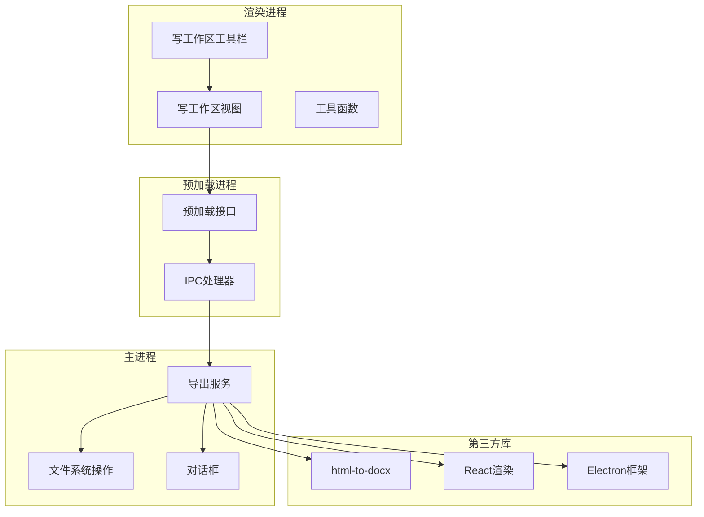

**图表来源**
- [WriteWorkspaceToolbar.tsx:1-268](file://src/renderer/src/components/write/WriteWorkspaceToolbar.tsx#L1-L268)
- [index.ts:79-82](file://src/preload/index.ts#L79-L82)
- [register-app-ipc-handlers.ts:696-706](file://src/main/ipc/register-app-ipc-handlers.ts#L696-L706)
- [write-export-service.ts:1-575](file://src/main/services/write-export-service.ts#L1-L575)

**章节来源**
- [write-export-service.ts:1-50](file://src/main/services/write-export-service.ts#L1-L50)
- [write-export.ts:1-45](file://src/shared/write-export.ts#L1-L45)

## 核心组件

### 支持的导出格式

系统支持四种主要的导出格式：

| 格式 | 扩展名 | 描述 | 特殊属性 |
|------|--------|------|----------|
| HTML | .html | 纯文本格式，保持原始结构 | 无 |
| PDF | .pdf | 专业打印格式，支持页面布局 | 需要PDF渲染引擎 |
| DOC | .doc | Word兼容格式（旧版） | Word兼容模式 |
| DOCX | .docx | Word标准格式（推荐） | DOCX转换器 |

### 导出参数配置

导出功能通过统一的参数接口进行配置：

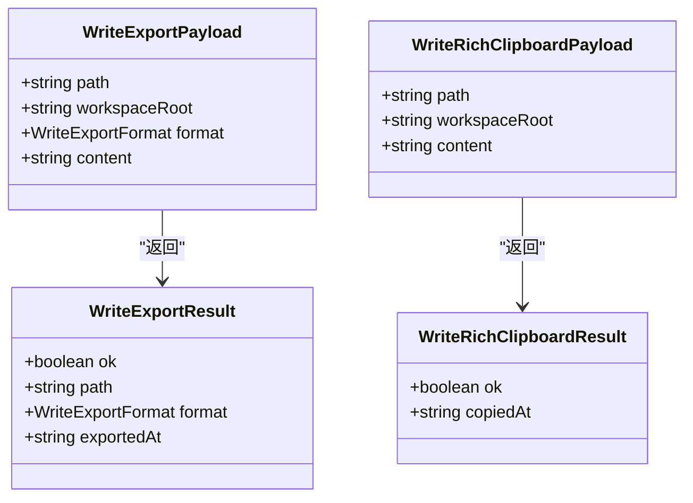

**图表来源**
- [write-export.ts:5-44](file://src/shared/write-export.ts#L5-L44)

**章节来源**
- [write-export.ts:1-45](file://src/shared/write-export.ts#L1-L45)

## 架构概览

文档导出功能采用客户端-服务器架构，通过IPC通信实现跨进程协作：

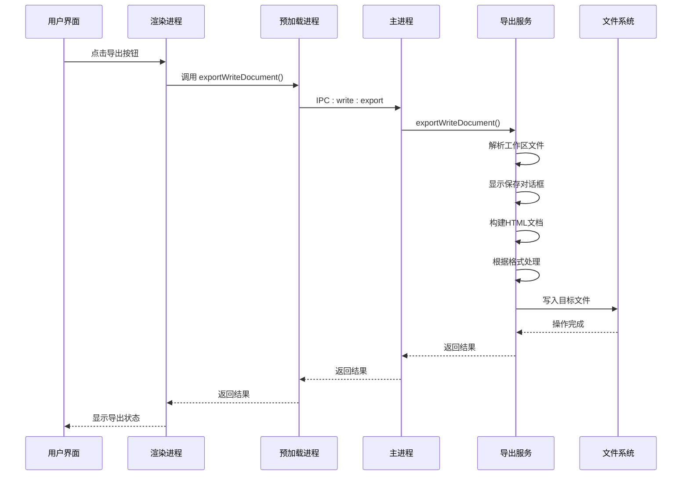

**图表来源**
- [WriteWorkspaceView.tsx:282-326](file://src/renderer/src/components/write/WriteWorkspaceView.tsx#L282-L326)
- [index.ts:79-82](file://src/preload/index.ts#L79-L82)
- [register-app-ipc-handlers.ts:696-706](file://src/main/ipc/register-app-ipc-handlers.ts#L696-L706)
- [write-export-service.ts:510-574](file://src/main/services/write-export-service.ts#L510-L574)

## 详细组件分析

### 导出服务核心实现

导出服务是整个功能的核心，负责处理各种导出格式和转换逻辑：

#### HTML文档构建

服务会将Markdown内容转换为完整的HTML文档，包含必要的样式和元数据：

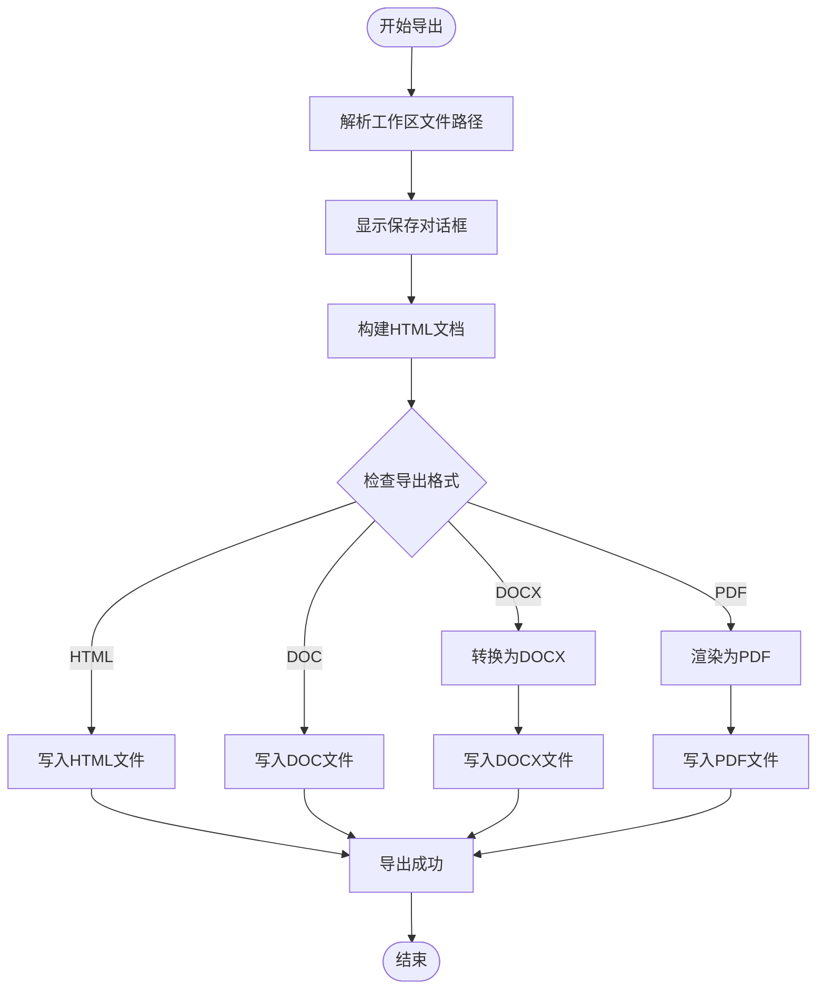

**图表来源**
- [write-export-service.ts:510-574](file://src/main/services/write-export-service.ts#L510-L574)

#### 图片处理机制

服务具备智能的本地图片处理能力，自动将相对路径转换为内联数据：

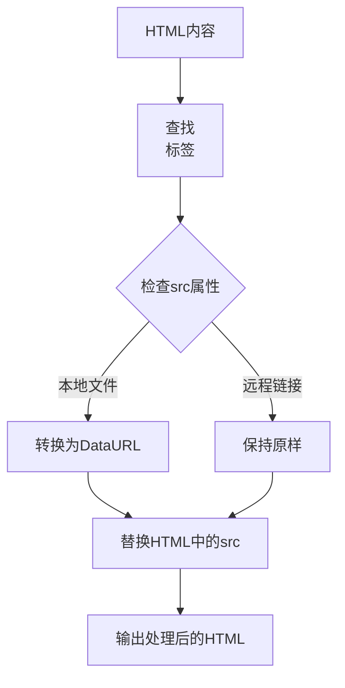

**图表来源**
- [write-export-service.ts:287-305](file://src/main/services/write-export-service.ts#L287-L305)

**章节来源**
- [write-export-service.ts:371-404](file://src/main/services/write-export-service.ts#L371-L404)
- [write-export-service.ts:287-305](file://src/main/services/write-export-service.ts#L287-L305)

### 用户界面集成

#### 工具栏导出菜单

写工作区工具栏提供了直观的导出入口：

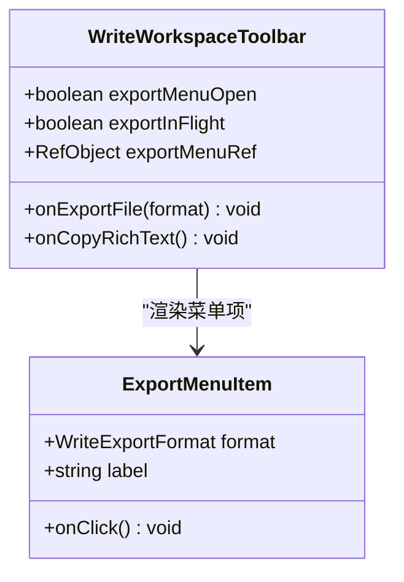

**图表来源**
- [WriteWorkspaceToolbar.tsx:189-239](file://src/renderer/src/components/write/WriteWorkspaceToolbar.tsx#L189-L239)

#### 导出状态管理

服务端通过状态管理确保导出过程的可靠性：

**章节来源**
- [WriteWorkspaceToolbar.tsx:1-268](file://src/renderer/src/components/write/WriteWorkspaceToolbar.tsx#L1-L268)
- [WriteWorkspaceView.tsx:282-326](file://src/renderer/src/components/write/WriteWorkspaceView.tsx#L282-L326)

### IPC通信机制

#### 预加载接口

预加载进程提供了安全的IPC接口封装：

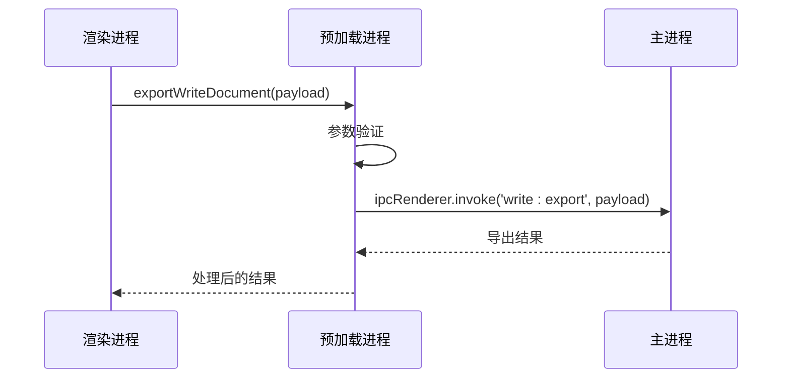

**图表来源**
- [index.ts:79-82](file://src/preload/index.ts#L79-L82)
- [register-app-ipc-handlers.ts:696-706](file://src/main/ipc/register-app-ipc-handlers.ts#L696-L706)

**章节来源**
- [index.ts:79-82](file://src/preload/index.ts#L79-L82)
- [register-app-ipc-handlers.ts:696-706](file://src/main/ipc/register-app-ipc-handlers.ts#L696-L706)

## 依赖关系分析

### 第三方库依赖

导出功能依赖于多个关键的第三方库：

**图表来源**
- [write-export-service.ts:1-20](file://src/main/services/write-export-service.ts#L1-L20)

### 内部模块依赖

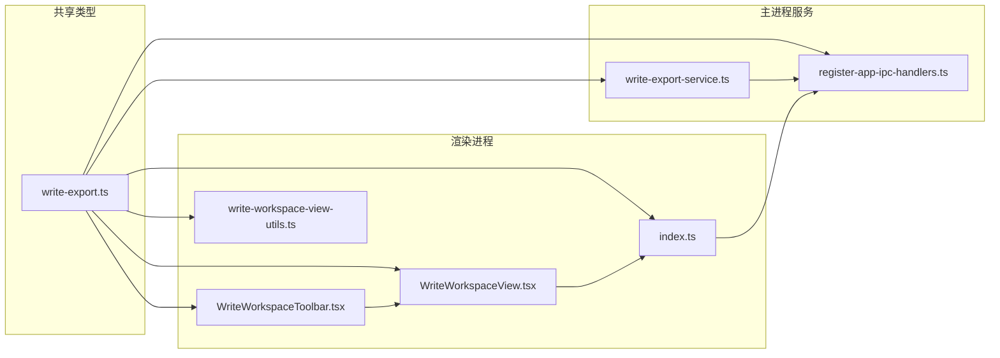

**图表来源**
- [write-export.ts:1-45](file://src/shared/write-export.ts#L1-L45)
- [write-export-service.ts:1-20](file://src/main/services/write-export-service.ts#L1-L20)
- [register-app-ipc-handlers.ts:696-706](file://src/main/ipc/register-app-ipc-handlers.ts#L696-L706)

**章节来源**
- [write-export.ts:1-45](file://src/shared/write-export.ts#L1-L45)
- [write-export-service.ts:1-20](file://src/main/services/write-export-service.ts#L1-L20)

## 性能考虑

### 内存管理策略

系统采用了多层内存管理策略来处理大文档导出：

#### 流式处理

对于大型文档，系统采用流式处理方式避免内存峰值：

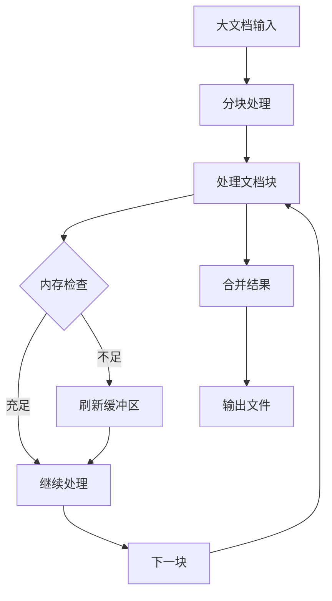

#### 临时文件管理

PDF渲染过程中使用临时文件系统：

**章节来源**
- [write-export-service.ts:453-493](file://src/main/services/write-export-service.ts#L453-L493)

### 大文档处理优化

#### 并行处理

系统支持并行处理多个导出任务：

```mermaid
gantt
title 大文档导出流程
dateFormat X
axisFormat %s
section 文档解析
解析文档 :0, 30
section HTML构建
构建HTML :30, 60
section 图片处理
处理图片 :60, 90
section 格式转换
DOCX转换 :90, 120
PDF渲染 :90, 150
section 文件写入
写入文件 :120, 150
```

#### 缓存机制

系统实现了智能缓存机制来提升重复导出的性能：

**章节来源**
- [write-export-service.ts:287-305](file://src/main/services/write-export-service.ts#L287-L305)

## 故障排除指南

### 常见问题及解决方案

#### 导出失败错误

当导出过程中出现错误时，系统会返回详细的错误信息：

| 错误类型 | 可能原因 | 解决方案 |
|----------|----------|----------|
| 文件路径错误 | 工作区路径无效或文件不存在 | 检查工作区配置和文件权限 |
| 格式不支持 | 请求的导出格式不受支持 | 使用支持的格式列表中的格式 |
| 内存不足 | 大文档导致内存溢出 | 分割文档或增加系统内存 |
| 权限问题 | 目标目录无写入权限 | 检查目标路径权限设置 |

#### 图片导入问题

如果文档中的图片无法正确显示：

1. **检查图片路径**：确保相对路径正确
2. **验证文件格式**：支持PNG、JPG、GIF、WEBP、BMP、SVG格式
3. **确认文件存在**：验证图片文件是否存在于工作区中

**章节来源**
- [write-export-service.test.ts:40-78](file://src/main/services/write-export-service.test.ts#L40-L78)

### 调试工具

系统提供了完善的调试工具来帮助诊断问题：

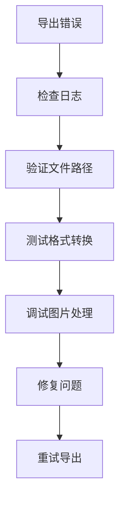

**章节来源**
- [write-export-service.test.ts:1-106](file://src/main/services/write-export-service.test.ts#L1-L106)

## 结论

DeepSeek-GUI 的文档导出功能提供了完整、可靠的多格式文档转换解决方案。通过精心设计的架构和优化的性能策略，该功能能够满足从个人写作到专业文档制作的各种需求。

主要优势包括：
- **多格式支持**：全面覆盖常用的文档格式
- **智能处理**：自动处理图片和链接等复杂元素
- **性能优化**：针对大文档的内存和处理优化
- **用户友好**：直观的界面和清晰的状态反馈

建议在实际使用中根据具体需求选择合适的导出格式，并充分利用系统的各项优化特性来获得最佳的使用体验。

## 附录

### 最佳实践指南

#### 格式选择建议

| 使用场景 | 推荐格式 | 理由 |
|----------|----------|------|
| 个人笔记 | HTML | 便于分享和在线查看 |
| 学术论文 | PDF | 专业的打印和审阅格式 |
| 商务报告 | DOCX | 兼容性强，编辑方便 |
| 快速分享 | HTML | 轻量级，传输速度快 |

#### 性能优化建议

1. **大文档分割**：超过1000行的文档建议分割处理
2. **图片压缩**：导出前对图片进行适当压缩
3. **格式选择**：优先选择HTML或DOCX格式以获得最佳性能
4. **内存监控**：关注系统内存使用情况，必要时重启应用

#### 批量导出策略

虽然当前版本主要支持单文件导出，但可以通过以下方式实现批量处理：

1. **脚本自动化**：编写批处理脚本循环调用导出接口
2. **定时任务**：设置定时任务定期导出更新的内容
3. **外部工具**：结合系统工具进行批量文件处理