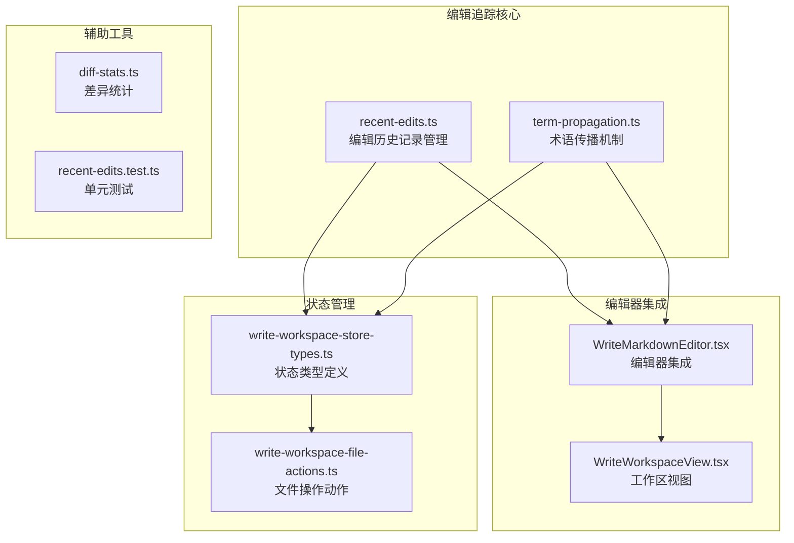
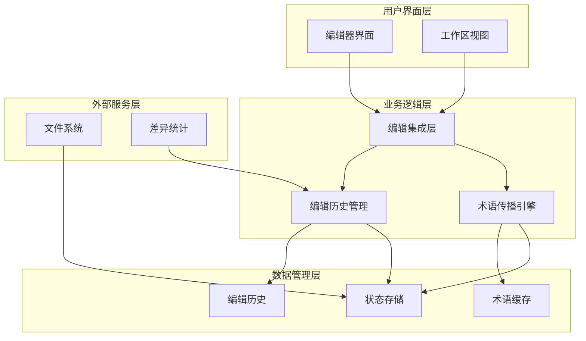
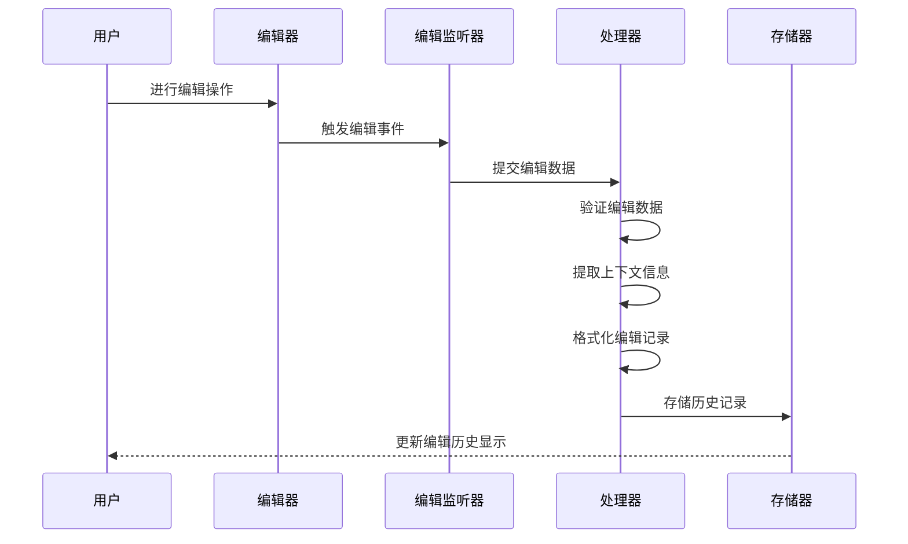
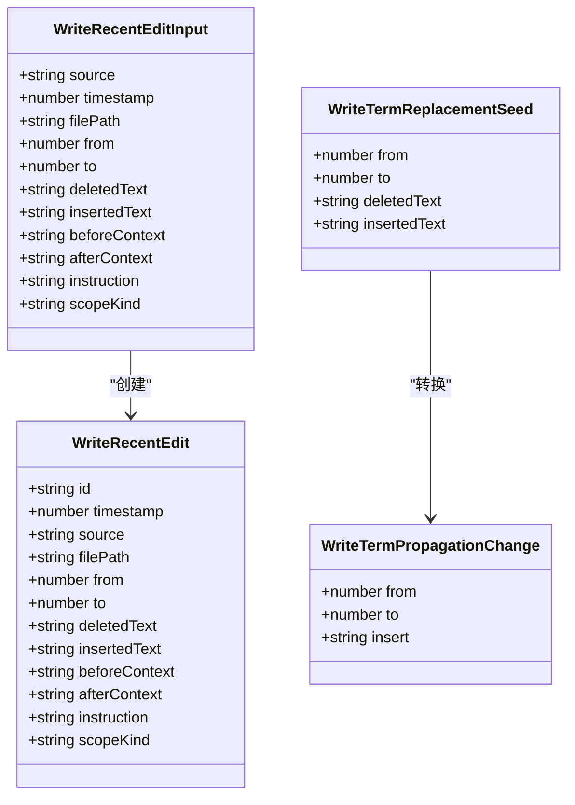
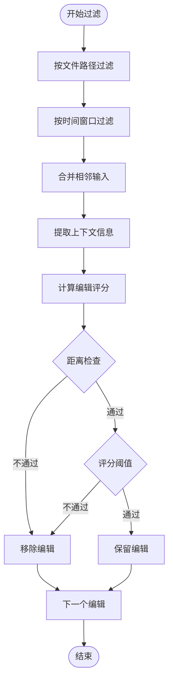
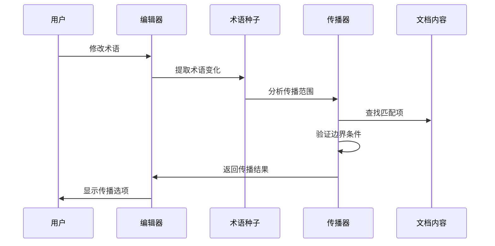
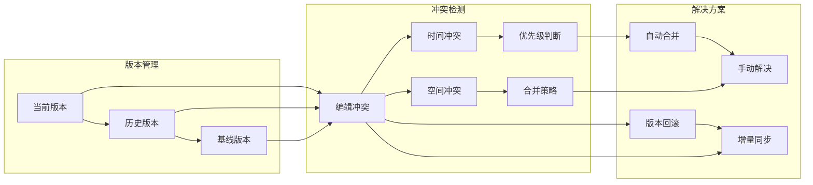
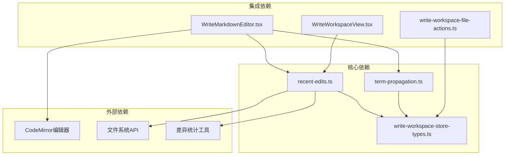

# 最近编辑追踪指南

<cite>
**本文档引用的文件**
- [recent-edits.ts](file://src/renderer/src/write/recent-edits.ts)
- [recent-edits.test.ts](file://src/renderer/src/write/recent-edits.test.ts)
- [term-propagation.ts](file://src/renderer/src/write/term-propagation.ts)
- [WriteMarkdownEditor.tsx](file://src/renderer/src/components/write/WriteMarkdownEditor.tsx)
- [write-workspace-store-types.ts](file://src/renderer/src/write/write-workspace-store-types.ts)
- [write-workspace-file-actions.ts](file://src/renderer/src/write/write-workspace-file-actions.ts)
- [WriteWorkspaceView.tsx](file://src/renderer/src/components/write/WriteWorkspaceView.tsx)
- [diff-stats.ts](file://src/renderer/src/lib/diff-stats.ts)
</cite>

## 目录
1. [简介](#简介)
2. [项目结构](#项目结构)
3. [核心组件](#核心组件)
4. [架构概览](#架构概览)
5. [详细组件分析](#详细组件分析)
6. [依赖关系分析](#依赖关系分析)
7. [性能考虑](#性能考虑)
8. [故障排除指南](#故障排除指南)
9. [结论](#结论)

## 简介

最近编辑追踪功能是 DeepSeek-GUI 中一个重要的编辑历史管理机制，它能够自动捕获和分析用户的编辑行为，为智能编辑建议、术语传播和批量编辑提供强大的数据支持。该功能通过实时监控编辑操作，构建详细的编辑历史记录，并提供多种编辑追踪机制。

本指南将详细介绍编辑历史记录的生成、变更追踪机制、编辑时间线展示，以及编辑回溯功能、版本对比、冲突解决策略。同时涵盖编辑传播机制、术语传播规则、批量编辑功能，最后提供编辑效率提升技巧和快速导航方法。

## 项目结构

最近编辑追踪功能主要分布在以下关键文件中：

**图表来源**
- [recent-edits.ts:1-189](file://src/renderer/src/write/recent-edits.ts#L1-L189)
- [term-propagation.ts:1-239](file://src/renderer/src/write/term-propagation.ts#L1-L239)
- [WriteMarkdownEditor.tsx:145-184](file://src/renderer/src/components/write/WriteMarkdownEditor.tsx#L145-L184)

**章节来源**
- [recent-edits.ts:1-189](file://src/renderer/src/write/recent-edits.ts#L1-L189)
- [term-propagation.ts:1-239](file://src/renderer/src/write/term-propagation.ts#L1-L239)
- [write-workspace-store-types.ts:1-85](file://src/renderer/src/write/write-workspace-store-types.ts#L1-L85)

## 核心组件

### 编辑历史记录管理器

编辑历史记录管理器是整个系统的核心组件，负责创建、存储和管理编辑历史记录。它提供了完整的编辑追踪生命周期管理。

**主要功能特性：**
- 实时编辑检测和记录
- 编辑历史的去重和合并
- 时间窗口管理和过期清理
- 编辑上下文提取和优化

### 术语传播引擎

术语传播引擎专门处理术语在文档中的传播和替换，确保编辑的一致性和准确性。

**核心能力：**
- 智能术语识别和验证
- 上下文感知的传播范围控制
- 边界条件检查和安全验证
- 批量传播操作支持

### 编辑器集成层

编辑器集成层负责将编辑追踪功能无缝集成到 Markdown 编辑器中，提供实时的编辑反馈和历史记录。

**集成特性：**
- 基于 CodeMirror 的编辑事件监听
- 实时编辑历史更新
- 编辑上下文自动提取
- 冲突检测和解决

**章节来源**
- [recent-edits.ts:67-90](file://src/renderer/src/write/recent-edits.ts#L67-L90)
- [term-propagation.ts:192-213](file://src/renderer/src/write/term-propagation.ts#L192-L213)
- [WriteMarkdownEditor.tsx:155-177](file://src/renderer/src/components/write/WriteMarkdownEditor.tsx#L155-L177)

## 架构概览

最近编辑追踪系统的整体架构采用分层设计，确保了功能的模块化和可维护性：

**图表来源**
- [write-workspace-store-types.ts:39-39](file://src/renderer/src/write/write-workspace-store-types.ts#L39-L39)
- [recent-edits.ts:27-33](file://src/renderer/src/write/recent-edits.ts#L27-L33)
- [term-propagation.ts:14-17](file://src/renderer/src/write/term-propagation.ts#L14-L17)

系统采用事件驱动的设计模式，当用户进行编辑操作时，编辑器会触发相应的事件，系统通过监听这些事件来捕获编辑信息并更新历史记录。

## 详细组件分析

### 编辑历史记录生成流程

编辑历史记录的生成是一个多步骤的过程，涉及编辑检测、数据提取、格式化和存储等环节：

**图表来源**
- [WriteMarkdownEditor.tsx:155-177](file://src/renderer/src/components/write/WriteMarkdownEditor.tsx#L155-L177)
- [recent-edits.ts:67-90](file://src/renderer/src/write/recent-edits.ts#L67-L90)

**章节来源**
- [WriteMarkdownEditor.tsx:155-177](file://src/renderer/src/components/write/WriteMarkdownEditor.tsx#L155-L177)
- [recent-edits.ts:67-90](file://src/renderer/src/write/recent-edits.ts#L67-L90)

### 编辑历史记录数据结构

编辑历史记录采用标准化的数据结构，确保数据的一致性和可扩展性：

**图表来源**
- [recent-edits.ts:7-11](file://src/renderer/src/write/recent-edits.ts#L7-L11)
- [recent-edits.ts:13-25](file://src/renderer/src/write/recent-edits.ts#L13-L25)
- [term-propagation.ts:1-6](file://src/renderer/src/write/term-propagation.ts#L1-L6)
- [term-propagation.ts:8-12](file://src/renderer/src/write/term-propagation.ts#L8-L12)

**章节来源**
- [recent-edits.ts:7-11](file://src/renderer/src/write/recent-edits.ts#L7-L11)
- [term-propagation.ts:1-12](file://src/renderer/src/write/term-propagation.ts#L1-L12)

### 编辑历史记录过滤和评分算法

系统实现了智能的编辑历史记录过滤和评分算法，确保只保留最相关和最有价值的编辑记录：

**图表来源**
- [recent-edits.ts:92-99](file://src/renderer/src/write/recent-edits.ts#L92-L99)
- [recent-edits.ts:155-188](file://src/renderer/src/write/recent-edits.ts#L155-L188)

**章节来源**
- [recent-edits.ts:92-188](file://src/renderer/src/write/recent-edits.ts#L92-L188)

### 术语传播机制

术语传播机制是编辑追踪功能的重要组成部分，它能够智能地识别和传播术语变化：

**图表来源**
- [term-propagation.ts:192-213](file://src/renderer/src/write/term-propagation.ts#L192-L213)
- [term-propagation.ts:215-238](file://src/renderer/src/write/term-propagation.ts#L215-L238)

**章节来源**
- [term-propagation.ts:192-238](file://src/renderer/src/write/term-propagation.ts#L192-L238)

### 版本对比和冲突解决

系统提供了强大的版本对比和冲突解决功能，帮助用户管理复杂的编辑历史：

**图表来源**
- [diff-stats.ts](file://src/renderer/src/lib/diff-stats.ts)
- [recent-edits.ts:27-33](file://src/renderer/src/write/recent-edits.ts#L27-L33)

**章节来源**
- [diff-stats.ts](file://src/renderer/src/lib/diff-stats.ts)
- [recent-edits.ts:27-33](file://src/renderer/src/write/recent-edits.ts#L27-L33)

## 依赖关系分析

最近编辑追踪功能的依赖关系相对清晰，主要依赖于编辑器集成层和状态管理系统：

**图表来源**
- [write-workspace-store-types.ts:1-5](file://src/renderer/src/write/write-workspace-store-types.ts#L1-L5)
- [WriteMarkdownEditor.tsx:1-3](file://src/renderer/src/components/write/WriteMarkdownEditor.tsx#L1-L3)

系统采用松耦合的设计，各个组件之间通过明确定义的接口进行通信，降低了组件间的依赖复杂度。

**章节来源**
- [write-workspace-store-types.ts:1-5](file://src/renderer/src/write/write-workspace-store-types.ts#L1-L5)
- [WriteMarkdownEditor.tsx:1-3](file://src/renderer/src/components/write/WriteMarkdownEditor.tsx#L1-L3)

## 性能考虑

最近编辑追踪功能在设计时充分考虑了性能优化，采用了多种策略来确保系统的高效运行：

### 内存管理优化

系统通过限制编辑历史记录的数量和大小，避免内存泄漏和性能下降：

- 最大编辑历史记录数：48条
- 单条编辑记录文本限制：900字符
- 编辑上下文限制：260字符
- 编辑提示限制：8条

### 时间窗口管理

系统实现了智能的时间窗口管理，确保只保留最近2分钟内的编辑记录：

- TTL（生存时间）：2分钟
- 合并相邻输入的时间窗口：3秒
- 同一区域的距离阈值：2400字符

### 编辑历史记录评分

系统使用评分算法来筛选最有价值的编辑记录：

- 年龄评分权重：1.4
- 距离评分权重：1.0
- 来源类型加分：0.18（来自内联编辑）

**章节来源**
- [recent-edits.ts:27-33](file://src/renderer/src/write/recent-edits.ts#L27-L33)
- [recent-edits.ts:142-153](file://src/renderer/src/write/recent-edits.ts#L142-L153)

## 故障排除指南

### 常见问题及解决方案

**编辑历史记录不更新**
- 检查编辑器是否正确初始化
- 验证编辑事件监听器是否正常工作
- 确认状态存储是否正确更新

**术语传播失败**
- 验证术语形状是否符合要求（3-80字符）
- 检查术语边界条件是否满足
- 确认传播范围是否超出限制

**性能问题**
- 检查编辑历史记录数量是否超过限制
- 验证文本截断功能是否正常工作
- 监控内存使用情况

### 调试技巧

使用浏览器开发者工具可以有效地调试编辑追踪功能：

1. 在编辑器事件监听器处设置断点
2. 监控编辑历史记录的状态变化
3. 检查编辑评分计算过程
4. 验证术语传播的执行流程

**章节来源**
- [recent-edits.test.ts:1-89](file://src/renderer/src/write/recent-edits.test.ts#L1-L89)

## 结论

最近编辑追踪功能为 DeepSeek-GUI 提供了强大而智能的编辑历史管理能力。通过实时的编辑检测、智能的历史记录管理、精确的术语传播和高效的冲突解决机制，该功能显著提升了用户的编辑体验和工作效率。

系统的设计充分考虑了性能优化和用户体验，在保证功能完整性的同时，确保了系统的响应速度和稳定性。随着功能的不断完善和优化，最近编辑追踪功能将继续为用户提供更加智能和便捷的编辑支持。

通过理解本文档介绍的各项功能和技术细节，用户可以更好地利用最近编辑追踪功能来提升编辑效率，实现更高质量的文档编写和管理工作。