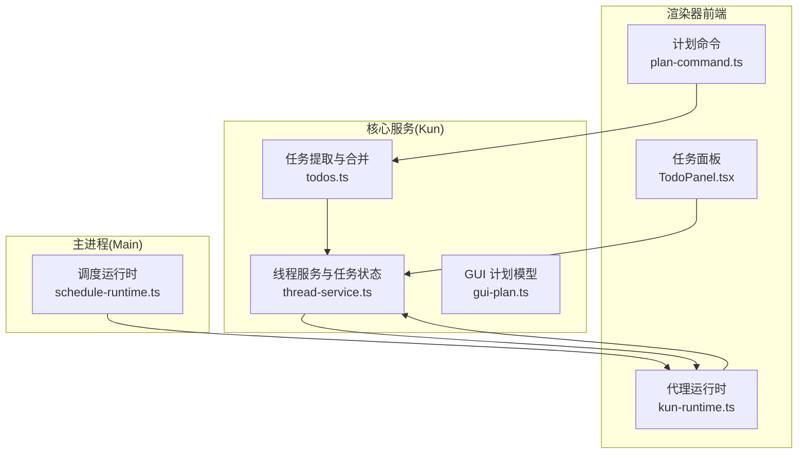
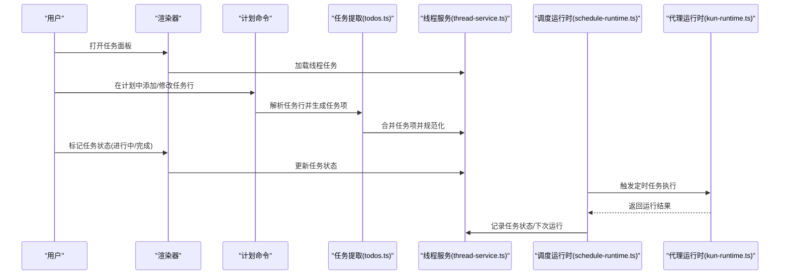
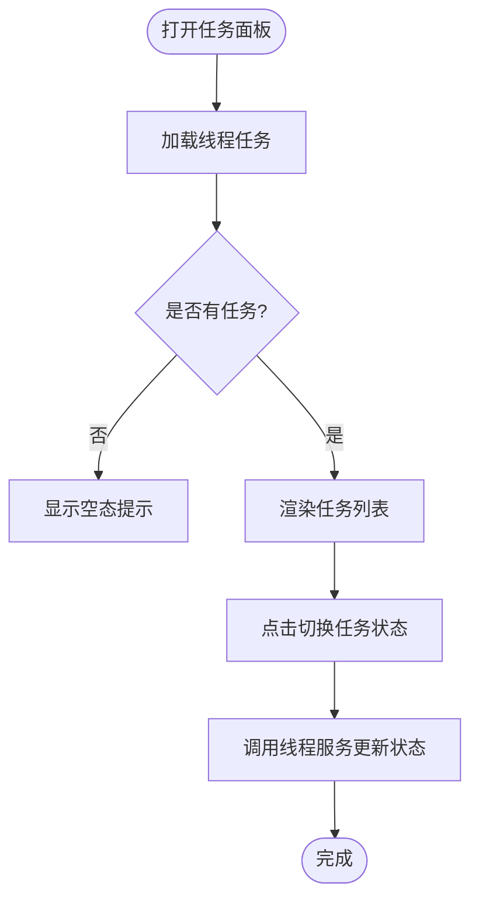
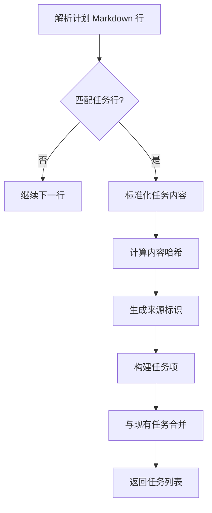
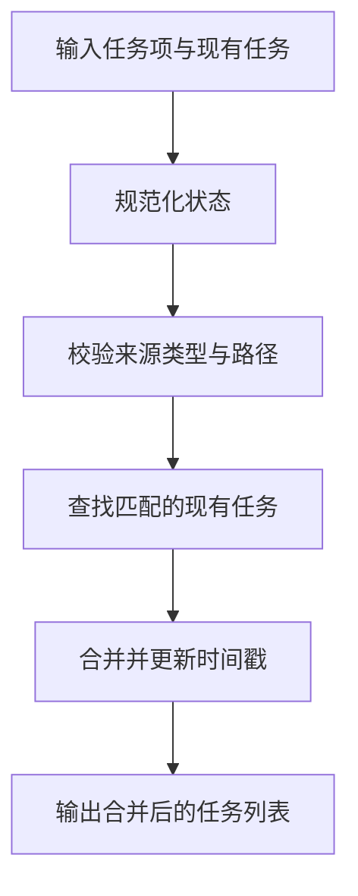
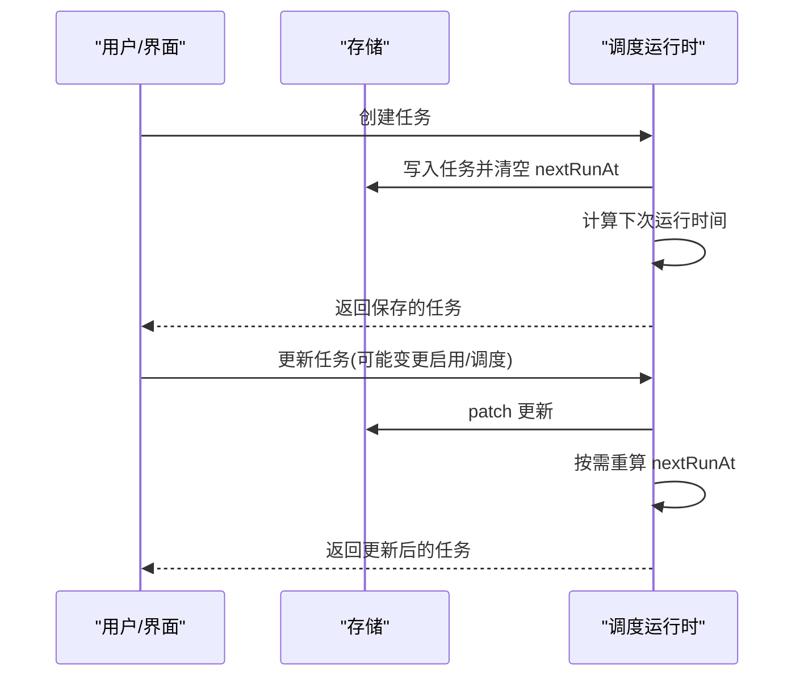
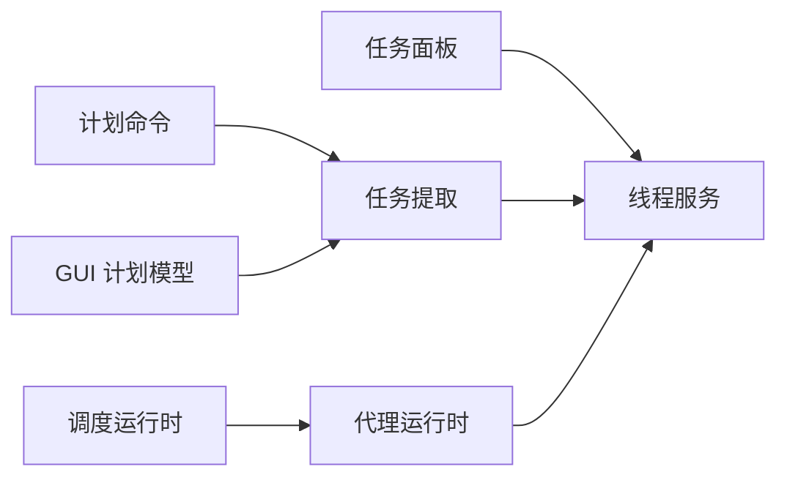

# 任务跟踪与执行

<cite>
**本文引用的文件**
- [TodoPanel.tsx](file://src/renderer/src/components/todo/TodoPanel.tsx)
- [todos.ts](file://kun/src/shared/todos.ts)
- [thread-service.ts](file://kun/src/services/thread-service.ts)
- [plan-command.ts](file://src/renderer/src/plan/plan-command.ts)
- [schedule-runtime.ts](file://src/main/schedule-runtime.ts)
- [schedule-runtime.test.ts](file://src/main/schedule-runtime.test.ts)
- [kun-system-prompt.ts](file://kun/src/prompt/kun-system-prompt.ts)
- [kun-contract.ts](file://src/renderer/src/agent/kun-contract.ts)
- [kun-mapper.ts](file://src/renderer/src/agent/kun-mapper.ts)
- [kun-runtime.ts](file://src/renderer/src/agent/kun-runtime.ts)
- [gui-plan.ts](file://src/shared/gui-plan.ts)
</cite>

## 目录
1. [简介](#简介)
2. [项目结构](#项目结构)
3. [核心组件](#核心组件)
4. [架构总览](#架构总览)
5. [详细组件分析](#详细组件分析)
6. [依赖关系分析](#依赖关系分析)
7. [性能考量](#性能考量)
8. [故障排查指南](#故障排查指南)
9. [结论](#结论)
10. [附录](#附录)

## 简介
本指南面向“任务跟踪与执行系统”的使用者与维护者，围绕以下目标展开：  
- 任务创建、分配、执行、监控的完整流程  
- 待办事项工具的使用方法  
- 任务优先级与依赖关系处理  
- 任务执行最佳实践、状态转换与完成验证  
- 不同项目管理场景（敏捷开发、瀑布模型、混合项目管理）下的任务跟踪示例  

系统以“计划（Plan）驱动的任务”为核心，通过计划中的任务清单自动生成线程级待办项，并在渲染器侧提供可视化面板进行状态管理；同时支持定时调度任务与运行时任务的统一编排。

## 项目结构
系统由三部分协同组成：  
- 渲染器前端（Renderer）：提供任务面板、计划视图、侧边栏与工作区交互  
- 核心服务（Kun）：负责计划解析、任务提取与合并、线程任务持久化与状态规范化  
- 主进程（Main）：负责定时调度任务的创建、更新、删除与运行结果监控  

图表来源
- [TodoPanel.tsx:77-102](file://src/renderer/src/components/todo/TodoPanel.tsx#L77-L102)
- [todos.ts:46-90](file://kun/src/shared/todos.ts#L46-L90)
- [thread-service.ts:527-563](file://kun/src/services/thread-service.ts#L527-L563)
- [plan-command.ts](file://src/renderer/src/plan/plan-command.ts)
- [schedule-runtime.ts:188-222](file://src/main/schedule-runtime.ts#L188-L222)
- [gui-plan.ts](file://src/shared/gui-plan.ts)

章节来源
- [TodoPanel.tsx:65-162](file://src/renderer/src/components/todo/TodoPanel.tsx#L65-L162)
- [todos.ts:46-90](file://kun/src/shared/todos.ts#L46-L90)
- [thread-service.ts:527-563](file://kun/src/services/thread-service.ts#L527-L563)
- [plan-command.ts](file://src/renderer/src/plan/plan-command.ts)
- [schedule-runtime.ts:188-222](file://src/main/schedule-runtime.ts#L188-L222)
- [gui-plan.ts](file://src/shared/gui-plan.ts)

## 核心组件
- 任务面板（TodoPanel）：展示当前线程的任务列表，支持标记完成/进行中/待办，显示统计与来源（来自计划）。  
- 计划任务提取（todos.ts）：从计划 Markdown 中解析任务行，生成带来源标识的任务项，计算内容哈希，保证去重与幂等。  
- 线程任务服务（thread-service.ts）：规范化任务状态、校验来源路径、查找已有任务并合并新旧任务，确保任务一致性。  
- 调度运行时（schedule-runtime.ts）：创建、更新、删除定时任务，记录运行状态与下次运行时间，支持一次性任务完成后自动禁用。  
- 代理运行时（kun-runtime.ts）：与后端运行时适配器交互，执行提示词、模式与推理强度配置，返回运行结果。  
- GUI 计划模型（gui-plan.ts）：定义计划相对路径、序号、内容哈希等字段，作为任务来源的唯一标识。

章节来源
- [TodoPanel.tsx:77-102](file://src/renderer/src/components/todo/TodoPanel.tsx#L77-L102)
- [todos.ts:46-90](file://kun/src/shared/todos.ts#L46-L90)
- [thread-service.ts:527-563](file://kun/src/services/thread-service.ts#L527-L563)
- [schedule-runtime.ts:188-222](file://src/main/schedule-runtime.ts#L188-L222)
- [kun-runtime.ts](file://src/renderer/src/agent/kun-runtime.ts)
- [gui-plan.ts](file://src/shared/gui-plan.ts)

## 架构总览
系统采用“计划驱动 + 线程任务 + 调度编排”的架构：  
- 计划（Plan）是任务的源头，任务行被解析为任务项并绑定到线程  
- 渲染器任务面板负责任务状态的可视化与交互  
- 核心服务负责任务的规范化、去重与持久化  
- 主进程调度器负责周期性或一次性任务的触发与结果监控  
- 代理运行时负责与后端交互，执行具体任务

图表来源
- [plan-command.ts](file://src/renderer/src/plan/plan-command.ts)
- [todos.ts:46-90](file://kun/src/shared/todos.ts#L46-L90)
- [thread-service.ts:527-563](file://kun/src/services/thread-service.ts#L527-L563)
- [schedule-runtime.ts:188-222](file://src/main/schedule-runtime.ts#L188-L222)
- [kun-runtime.ts](file://src/renderer/src/agent/kun-runtime.ts)

## 详细组件分析

### 组件A：任务面板（TodoPanel）
- 功能要点
  - 展示当前线程的任务列表，按状态分组统计（待办、进行中、完成）  
  - 支持点击切换任务状态（完成/待办），进行中状态以图标标识  
  - 若任务来源于计划，可直接跳转到计划视图定位该任务  
  - 当无任务时显示空态提示  
- 使用建议
  - 将计划中的任务行作为任务来源，便于后续追踪与合并  
  - 利用状态切换快速反馈任务进展，保持面板实时更新  

图表来源
- [TodoPanel.tsx:77-102](file://src/renderer/src/components/todo/TodoPanel.tsx#L77-L102)
- [thread-service.ts:527-563](file://kun/src/services/thread-service.ts#L527-L563)

章节来源
- [TodoPanel.tsx:65-162](file://src/renderer/src/components/todo/TodoPanel.tsx#L65-L162)

### 组件B：计划任务提取与合并（todos.ts）
- 功能要点
  - 从计划 Markdown 中逐行解析任务行，提取内容与状态标记  
  - 为每个任务生成来源标识（kind=plan），包含计划 ID、相对路径、序号、内容哈希  
  - 基于内容哈希与来源信息进行去重与幂等合并  
- 关键数据结构
  - 任务来源（ThreadTodoSource）：kind、planId、relativePath、ordinal、contentHash  
  - 任务项（ThreadTodoItem）：id、content、status、source、createdAt、updatedAt  
- 复杂度分析
  - 单次解析复杂度 O(N)，N 为计划行数  
  - 合并过程对每个新任务遍历现有任务集合，整体 O(M×N)，M 为现有任务数，N 为新任务数  

图表来源
- [todos.ts:46-90](file://kun/src/shared/todos.ts#L46-L90)

章节来源
- [todos.ts:46-90](file://kun/src/shared/todos.ts#L46-L90)

### 组件C：线程任务服务（thread-service.ts）
- 功能要点
  - 规范化任务状态（仅允许 pending/in_progress/completed）  
  - 校验任务来源类型与相对路径合法性  
  - 查找已存在任务并基于来源与哈希进行匹配，避免重复  
- 错误处理
  - 非法状态或来源类型会抛出错误，防止不一致数据进入系统  
- 性能考虑
  - 合并时使用集合记录已使用 ID，减少重复匹配成本  

图表来源
- [thread-service.ts:527-563](file://kun/src/services/thread-service.ts#L527-L563)

章节来源
- [thread-service.ts:527-563](file://kun/src/services/thread-service.ts#L527-L563)

### 组件D：调度运行时（schedule-runtime.ts）
- 功能要点
  - 创建一次性或周期性任务，记录 nextRunAt 并同步设置  
  - 更新任务时根据变更决定是否重新计算下次运行时间  
  - 删除任务后同步更新存储并刷新调度  
  - 测试覆盖：一次性任务在监控到完成后自动禁用  
- 最佳实践
  - 对于一次性任务，启用“监控完成”后自动禁用，避免重复执行  
  - 定期检查 nextRunAt 与 lastStatus，确保调度预期  

图表来源
- [schedule-runtime.ts:188-222](file://src/main/schedule-runtime.ts#L188-L222)
- [schedule-runtime.test.ts:234-279](file://src/main/schedule-runtime.test.ts#L234-L279)

章节来源
- [schedule-runtime.ts:188-222](file://src/main/schedule-runtime.ts#L188-L222)
- [schedule-runtime.test.ts:234-279](file://src/main/schedule-runtime.test.ts#L234-L279)

### 组件E：代理运行时与系统提示（kun-runtime.ts、kun-system-prompt.ts）
- 功能要点
  - 代理运行时封装与后端交互，支持指定模型、推理强度、执行模式与超时控制  
  - 系统提示用于统一上下文与行为约束，保障任务执行的一致性  
- 使用建议
  - 在调度任务或手动执行任务时，合理选择推理强度与模式，平衡速度与质量  
  - 结合系统提示，确保任务执行符合团队规范与安全策略  

章节来源
- [kun-runtime.ts](file://src/renderer/src/agent/kun-runtime.ts)
- [kun-system-prompt.ts](file://kun/src/prompt/kun-system-prompt.ts)

## 依赖关系分析
- 渲染器任务面板依赖线程服务进行任务加载与状态更新  
- 计划命令通过任务提取模块生成任务项，再由线程服务进行规范化与合并  
- 调度运行时与代理运行时协作，实现任务的触发与结果回写  
- GUI 计划模型为任务来源提供稳定标识，确保跨会话一致性  

图表来源
- [TodoPanel.tsx:77-102](file://src/renderer/src/components/todo/TodoPanel.tsx#L77-L102)
- [todos.ts:46-90](file://kun/src/shared/todos.ts#L46-L90)
- [thread-service.ts:527-563](file://kun/src/services/thread-service.ts#L527-L563)
- [schedule-runtime.ts:188-222](file://src/main/schedule-runtime.ts#L188-L222)
- [kun-runtime.ts](file://src/renderer/src/agent/kun-runtime.ts)
- [gui-plan.ts](file://src/shared/gui-plan.ts)

章节来源
- [TodoPanel.tsx:77-102](file://src/renderer/src/components/todo/TodoPanel.tsx#L77-L102)
- [todos.ts:46-90](file://kun/src/shared/todos.ts#L46-L90)
- [thread-service.ts:527-563](file://kun/src/services/thread-service.ts#L527-L563)
- [schedule-runtime.ts:188-222](file://src/main/schedule-runtime.ts#L188-L222)
- [kun-runtime.ts](file://src/renderer/src/agent/kun-runtime.ts)
- [gui-plan.ts](file://src/shared/gui-plan.ts)

## 性能考量
- 任务解析与合并
  - 采用内容哈希与来源标识进行去重，降低重复任务带来的存储与渲染压力  
  - 合并时使用集合记录已使用 ID，减少重复匹配成本  
- 调度计算
  - 更新任务时仅在必要字段变更时重算下次运行时间，避免频繁计算  
  - 一次性任务完成后自动禁用，减少无效调度  
- 渲染优化
  - 任务面板按状态分组统计，减少不必要的重绘  
  - 空态提示与懒加载结合，提升首屏体验  

## 故障排查指南
- 任务状态异常
  - 现象：任务状态无法切换或显示异常  
  - 排查：确认状态值是否为允许值（pending/in_progress/completed）；检查线程服务的状态规范化逻辑  
  - 参考：[thread-service.ts:533-536](file://kun/src/services/thread-service.ts#L533-L536)  
- 任务来源路径错误
  - 现象：任务来源路径非法导致任务无法识别  
  - 排查：确认计划相对路径是否符合 GUI 规范；检查来源类型是否为 plan  
  - 参考：[thread-service.ts:538-551](file://kun/src/services/thread-service.ts#L538-L551)  
- 任务重复或未更新
  - 现象：同一任务多次出现或状态未更新  
  - 排查：核对内容哈希与来源标识是否一致；检查合并逻辑是否正确匹配  
  - 参考：[todos.ts:46-90](file://kun/src/shared/todos.ts#L46-L90)  
- 调度任务未执行或重复执行
  - 现象：一次性任务执行后仍被调度或未执行  
  - 排查：检查任务启用状态与下次运行时间；确认测试用例覆盖的一次性任务完成后自动禁用的行为  
  - 参考：[schedule-runtime.ts:188-222](file://src/main/schedule-runtime.ts#L188-L222)、[schedule-runtime.test.ts:277-279](file://src/main/schedule-runtime.test.ts#L277-L279)  
- 代理运行时超时或失败
  - 现象：任务执行无响应或报错  
  - 排查：调整推理强度与模式；检查超时参数与网络连接；查看系统提示是否影响执行上下文  
  - 参考：[kun-runtime.ts](file://src/renderer/src/agent/kun-runtime.ts)、[kun-system-prompt.ts](file://kun/src/prompt/kun-system-prompt.ts)

章节来源
- [thread-service.ts:533-563](file://kun/src/services/thread-service.ts#L533-L563)
- [todos.ts:46-90](file://kun/src/shared/todos.ts#L46-L90)
- [schedule-runtime.ts:188-222](file://src/main/schedule-runtime.ts#L188-L222)
- [schedule-runtime.test.ts:277-279](file://src/main/schedule-runtime.test.ts#L277-L279)
- [kun-runtime.ts](file://src/renderer/src/agent/kun-runtime.ts)
- [kun-system-prompt.ts](file://kun/src/prompt/kun-system-prompt.ts)

## 结论
本系统通过“计划驱动的任务”实现了从任务创建、解析、合并到执行与监控的闭环。渲染器任务面板提供直观的状态管理，核心服务确保任务一致性与幂等，主进程调度器保障任务按时执行与结果回写。遵循本文的最佳实践与故障排查建议，可在不同项目管理场景中高效落地任务跟踪与执行。

## 附录

### 任务创建与分配（计划驱动）
- 在计划中编写任务行，系统自动解析并生成任务项  
- 任务项绑定来源（计划 ID、相对路径、序号、内容哈希），确保可追溯与去重  
- 通过任务面板分配给相关线程，便于多人协作与进度可视化  

章节来源
- [todos.ts:46-90](file://kun/src/shared/todos.ts#L46-L90)
- [gui-plan.ts](file://src/shared/gui-plan.ts)

### 任务执行与监控
- 一次性任务：执行完成后自动禁用，避免重复触发  
- 周期性任务：根据调度规则定期执行，记录上次运行状态与下次运行时间  
- 运行时任务：通过代理运行时执行，支持模式与推理强度配置，返回执行结果  

章节来源
- [schedule-runtime.ts:188-222](file://src/main/schedule-runtime.ts#L188-L222)
- [schedule-runtime.test.ts:277-279](file://src/main/schedule-runtime.test.ts#L277-L279)
- [kun-runtime.ts](file://src/renderer/src/agent/kun-runtime.ts)

### 任务状态转换与完成验证
- 允许状态：待办（pending）、进行中（in_progress）、完成（completed）  
- 转换规则：完成/待办互切；进行中状态下以图标标识  
- 完成验证：一次性任务完成后自动禁用；调度器记录 lastStatus 与 lastMessage 供监控  

章节来源
- [thread-service.ts:533-536](file://kun/src/services/thread-service.ts#L533-L536)
- [TodoPanel.tsx:131-145](file://src/renderer/src/components/todo/TodoPanel.tsx#L131-L145)
- [schedule-runtime.ts:188-222](file://src/main/schedule-runtime.ts#L188-L222)

### 优先级与依赖关系处理
- 优先级管理：通过任务来源的序号（ordinal）与计划层级进行优先级排序与展示  
- 依赖关系：当前实现以任务来源与内容哈希进行去重与合并，未内置显式依赖字段；可通过计划结构与任务顺序表达依赖关系  

章节来源
- [todos.ts:46-90](file://kun/src/shared/todos.ts#L46-L90)
- [gui-plan.ts](file://src/shared/gui-plan.ts)

### 不同项目管理场景示例

#### 敏捷开发
- 特点：迭代短、反馈快、任务细粒度  
- 实践建议
  - 将每日站会与迭代计划中的任务行直接纳入计划，系统自动生成任务项  
  - 使用“进行中/完成”状态快速反映每日进展  
  - 一次性任务用于冲刺目标达成后的回顾与总结  

章节来源
- [todos.ts:46-90](file://kun/src/shared/todos.ts#L46-L90)
- [TodoPanel.tsx:131-145](file://src/renderer/src/components/todo/TodoPanel.tsx#L131-L145)
- [schedule-runtime.test.ts:277-279](file://src/main/schedule-runtime.test.ts#L277-L279)

#### 瀑布模型
- 特点：阶段明确、文档完备、任务按阶段推进  
- 实践建议
  - 在需求、设计、实现、测试各阶段的计划中分别维护任务行  
  - 使用“待办/进行中/完成”状态贯穿各阶段，形成清晰的里程碑  
  - 通过来源路径与序号建立阶段内任务的优先级与依赖关系  

章节来源
- [todos.ts:46-90](file://kun/src/shared/todos.ts#L46-L90)
- [gui-plan.ts](file://src/shared/gui-plan.ts)

#### 混合项目管理
- 特点：结合敏捷与瀑布优势，灵活应对不确定性  
- 实践建议
  - 顶层计划采用瀑布式阶段划分，子计划采用敏捷式迭代  
  - 使用“动作在变更上”的思想，允许在实现过程中动态调整任务与计划  
  - 通过调度器监控关键里程碑，确保阶段性交付  

章节来源
- [.claude\skills\openspec-apply-change\SKILL.md:153-157](file://.claude/skills/openspec-apply-change/SKILL.md#L153-L157)
- [schedule-runtime.ts:188-222](file://src/main/schedule-runtime.ts#L188-L222)