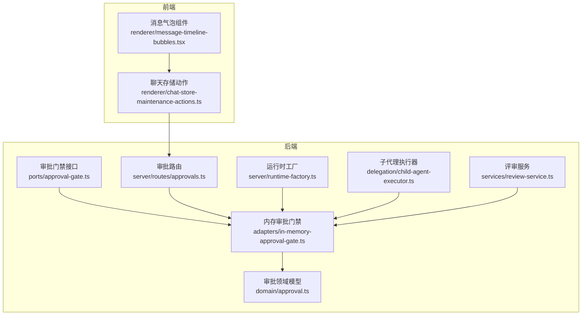
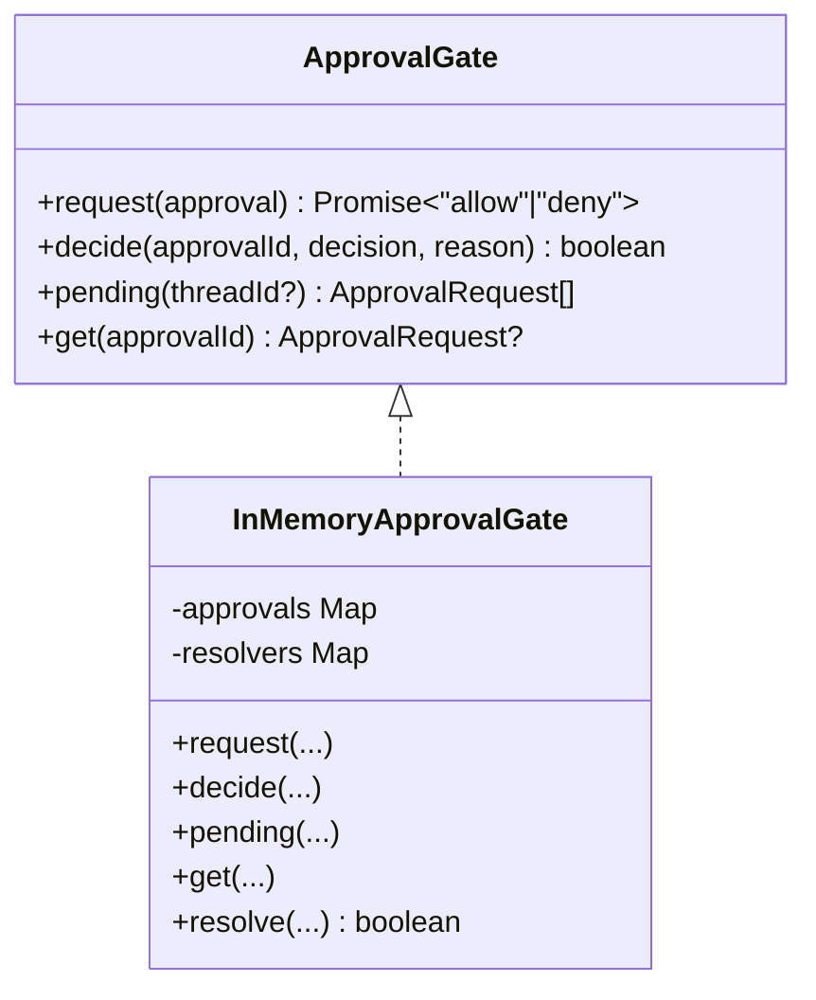
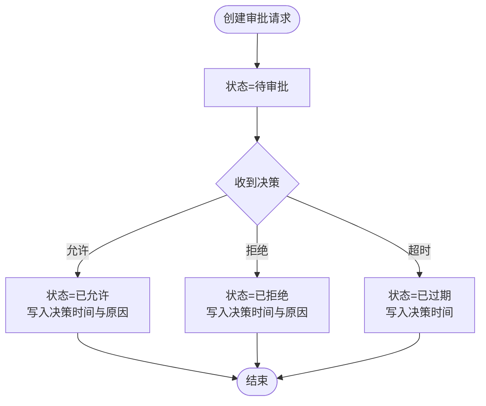
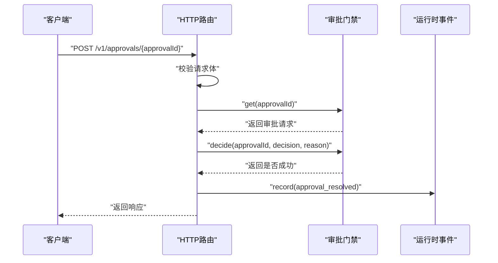
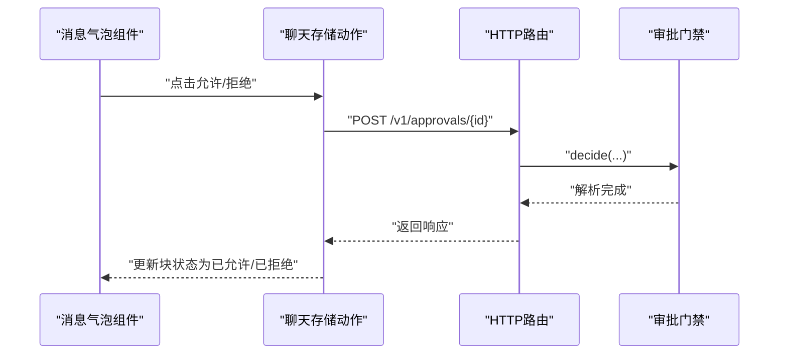
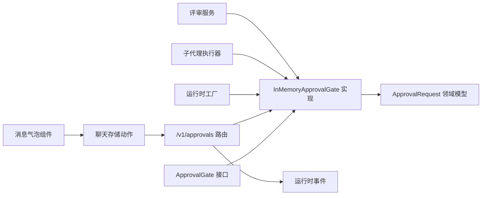

# 审批流程管理

<cite>
**本文引用的文件**
- [kun/src/adapters/in-memory-approval-gate.ts](file://kun/src/adapters/in-memory-approval-gate.ts)
- [kun/src/ports/approval-gate.ts](file://kun/src/ports/approval-gate.ts)
- [kun/src/domain/approval.ts](file://kun/src/domain/approval.ts)
- [kun/src/server/routes/approvals.ts](file://kun/src/server/routes/approvals.ts)
- [kun/src/contracts/approvals.ts](file://kun/src/contracts/approvals.ts)
- [kun/src/server/runtime-factory.ts](file://kun/src/server/runtime-factory.ts)
- [kun/src/delegation/child-agent-executor.ts](file://kun/src/delegation/child-agent-executor.ts)
- [kun/src/services/review-service.ts](file://kun/src/services/review-service.ts)
- [src/renderer/src/components/chat/message-timeline-bubbles.tsx](file://src/renderer/src/components/chat/message-timeline-bubbles.tsx)
- [src/renderer/src/store/chat-store-maintenance-actions.ts](file://src/renderer/src/store/chat-store-maintenance-actions.ts)
</cite>

## 目录
1. [简介](#简介)
2. [项目结构](#项目结构)
3. [核心组件](#核心组件)
4. [架构总览](#架构总览)
5. [详细组件分析](#详细组件分析)
6. [依赖关系分析](#依赖关系分析)
7. [性能考量](#性能考量)
8. [故障排查指南](#故障排查指南)
9. [结论](#结论)
10. [附录：审批配置示例与最佳实践](#附录审批配置示例与最佳实践)

## 简介
本指南面向审批流程管理系统使用者与维护者，系统性阐述审批流程设计、审批规则配置、审批状态管理、审批门禁（Approval Gate）的使用方法、权限控制与历史追踪机制，并提供优化策略、批量审批与紧急审批处理建议。文档同时给出在不同组织架构下的审批配置示例，包括层级审批、并行审批与条件审批等。

## 项目结构
审批能力由后端运行时与前端渲染层协同实现：
- 后端核心
  - 审批门禁接口与内存实现：定义审批请求生命周期与决策解析
  - 审批领域模型：描述审批请求的数据结构与状态转换
  - HTTP 路由：接收审批决策并记录运行时事件
  - 运行时工厂：装配审批门禁实例
- 前端交互
  - 渲染层消息气泡：展示待审批项与允许/拒绝按钮
  - 存储层动作：提交审批决策并更新界面状态



图表来源
- [kun/src/ports/approval-gate.ts:1-14](file://kun/src/ports/approval-gate.ts#L1-L14)
- [kun/src/adapters/in-memory-approval-gate.ts:1-52](file://kun/src/adapters/in-memory-approval-gate.ts#L1-L52)
- [kun/src/domain/approval.ts:1-63](file://kun/src/domain/approval.ts#L1-L63)
- [kun/src/server/routes/approvals.ts:1-51](file://kun/src/server/routes/approvals.ts#L1-L51)
- [kun/src/server/runtime-factory.ts:1-20](file://kun/src/server/runtime-factory.ts#L1-L20)
- [kun/src/delegation/child-agent-executor.ts:1-20](file://kun/src/delegation/child-agent-executor.ts#L1-L20)
- [kun/src/services/review-service.ts:1-20](file://kun/src/services/review-service.ts#L1-L20)
- [src/renderer/src/components/chat/message-timeline-bubbles.tsx:790-824](file://src/renderer/src/components/chat/message-timeline-bubbles.tsx#L790-L824)
- [src/renderer/src/store/chat-store-maintenance-actions.ts:626-660](file://src/renderer/src/store/chat-store-maintenance-actions.ts#L626-L660)

章节来源
- [kun/src/ports/approval-gate.ts:1-14](file://kun/src/ports/approval-gate.ts#L1-L14)
- [kun/src/adapters/in-memory-approval-gate.ts:1-52](file://kun/src/adapters/in-memory-approval-gate.ts#L1-L52)
- [kun/src/domain/approval.ts:1-63](file://kun/src/domain/approval.ts#L1-L63)
- [kun/src/server/routes/approvals.ts:1-51](file://kun/src/server/routes/approvals.ts#L1-L51)
- [kun/src/server/runtime-factory.ts:1-20](file://kun/src/server/runtime-factory.ts#L1-L20)
- [kun/src/delegation/child-agent-executor.ts:1-20](file://kun/src/delegation/child-agent-executor.ts#L1-L20)
- [kun/src/services/review-service.ts:1-20](file://kun/src/services/review-service.ts#L1-L20)
- [src/renderer/src/components/chat/message-timeline-bubbles.tsx:790-824](file://src/renderer/src/components/chat/message-timeline-bubbles.tsx#L790-L824)
- [src/renderer/src/store/chat-store-maintenance-actions.ts:626-660](file://src/renderer/src/store/chat-store-maintenance-actions.ts#L626-L660)

## 核心组件
- 审批门禁接口（Port）
  - 定义审批请求的注册、决策、查询与挂起列表能力
  - 关键方法：request、decide、pending、get
- 内存审批门禁（Adapter）
  - 实现审批门禁接口，维护审批请求映射与等待解析器
  - 提供请求注册、决策解析与挂起查询
- 审批领域模型（Domain）
  - 描述审批请求的字段与状态枚举
  - 提供创建与解析（允许/拒绝/过期）的函数式转换
- 审批路由（Server Route）
  - 接收前端提交的审批决策，调用门禁进行解析，并记录运行时事件
- 前端交互（Renderer）
  - 消息气泡组件展示待审批项与操作按钮
  - 存储动作负责提交决策并更新本地状态

章节来源
- [kun/src/ports/approval-gate.ts:1-14](file://kun/src/ports/approval-gate.ts#L1-L14)
- [kun/src/adapters/in-memory-approval-gate.ts:1-52](file://kun/src/adapters/in-memory-approval-gate.ts#L1-L52)
- [kun/src/domain/approval.ts:1-63](file://kun/src/domain/approval.ts#L1-L63)
- [kun/src/server/routes/approvals.ts:1-51](file://kun/src/server/routes/approvals.ts#L1-L51)
- [src/renderer/src/components/chat/message-timeline-bubbles.tsx:790-824](file://src/renderer/src/components/chat/message-timeline-bubbles.tsx#L790-L824)
- [src/renderer/src/store/chat-store-maintenance-actions.ts:626-660](file://src/renderer/src/store/chat-store-maintenance-actions.ts#L626-L660)

## 架构总览
审批从“工具调用触发”开始，进入“待审批状态”，随后由用户或系统进行“决策”，最终“解析并记录事件”。

```mermaid
sequenceDiagram
participant Tool as "工具调用方"
participant Loop as "运行循环"
participant Gate as "审批门禁"
participant UI as "前端消息气泡"
participant Store as "聊天存储动作"
participant Route as "HTTP路由"
participant Events as "运行时事件"
Tool->>Loop : "请求执行工具"
Loop->>Gate : "request(审批请求)"
Gate-->>Loop : "返回Promise(等待决策)"
Loop-->>UI : "渲染待审批消息"
UI->>Store : "点击允许/拒绝"
Store->>Route : "POST /v1/approvals/{id}"
Route->>Gate : "decide(id, decision, reason)"
Gate-->>Loop : "解析完成，继续执行"
Route->>Events : "record(approval_resolved)"
Events-->>UI : "推送事件，刷新状态"
```

图表来源
- [kun/src/adapters/in-memory-approval-gate.ts:19-35](file://kun/src/adapters/in-memory-approval-gate.ts#L19-L35)
- [kun/src/server/routes/approvals.ts:15-51](file://kun/src/server/routes/approvals.ts#L15-L51)
- [src/renderer/src/components/chat/message-timeline-bubbles.tsx:790-824](file://src/renderer/src/components/chat/message-timeline-bubbles.tsx#L790-L824)
- [src/renderer/src/store/chat-store-maintenance-actions.ts:626-660](file://src/renderer/src/store/chat-store-maintenance-actions.ts#L626-L660)

## 详细组件分析

### 组件一：审批门禁接口与内存实现
- 接口职责
  - request：注册审批请求并返回等待决策的Promise
  - decide：根据决策解析请求，返回是否成功
  - pending：按线程过滤挂起的审批请求
  - get：按ID获取审批请求
- 内存实现要点
  - 使用Map维护审批请求与等待解析器
  - 解析时更新状态、时间戳与原因，并通知等待方



图表来源
- [kun/src/ports/approval-gate.ts:9-14](file://kun/src/ports/approval-gate.ts#L9-L14)
- [kun/src/adapters/in-memory-approval-gate.ts:15-52](file://kun/src/adapters/in-memory-approval-gate.ts#L15-L52)

章节来源
- [kun/src/ports/approval-gate.ts:1-14](file://kun/src/ports/approval-gate.ts#L1-L14)
- [kun/src/adapters/in-memory-approval-gate.ts:1-52](file://kun/src/adapters/in-memory-approval-gate.ts#L1-L52)

### 组件二：审批领域模型
- 数据结构
  - 字段：id、threadId、turnId、toolName、summary、status、createdAt、decidedAt、reason
  - 状态：pending、allowed、denied、expired
- 函数式转换
  - 创建：初始化为pending
  - 解析：根据决策更新状态与时间戳
  - 过期：标记为expired



图表来源
- [kun/src/domain/approval.ts:21-63](file://kun/src/domain/approval.ts#L21-L63)

章节来源
- [kun/src/domain/approval.ts:1-63](file://kun/src/domain/approval.ts#L1-L63)

### 组件三：HTTP 审批路由
- 功能
  - 校验请求体，解析决策
  - 查询门禁获取审批请求
  - 调用门禁进行决策解析
  - 记录运行时事件，返回响应
- 错误处理
  - 非法请求体、审批不存在、重复决策等情况返回相应错误



图表来源
- [kun/src/server/routes/approvals.ts:15-51](file://kun/src/server/routes/approvals.ts#L15-L51)
- [kun/src/contracts/approvals.ts:1-15](file://kun/src/contracts/approvals.ts#L1-L15)

章节来源
- [kun/src/server/routes/approvals.ts:1-51](file://kun/src/server/routes/approvals.ts#L1-L51)
- [kun/src/contracts/approvals.ts:1-15](file://kun/src/contracts/approvals.ts#L1-L15)

### 组件四：前端交互与状态更新
- 消息气泡组件
  - 展示审批标题、工具名、摘要与状态
  - 提供允许/拒绝按钮，仅在待审批时显示
- 聊天存储动作
  - 校验并提交审批决策到后端
  - 更新本地块状态为allowed/denied
  - 处理错误并可引导至设置页



图表来源
- [src/renderer/src/components/chat/message-timeline-bubbles.tsx:790-824](file://src/renderer/src/components/chat/message-timeline-bubbles.tsx#L790-L824)
- [src/renderer/src/store/chat-store-maintenance-actions.ts:626-660](file://src/renderer/src/store/chat-store-maintenance-actions.ts#L626-L660)
- [kun/src/server/routes/approvals.ts:15-51](file://kun/src/server/routes/approvals.ts#L15-L51)

章节来源
- [src/renderer/src/components/chat/message-timeline-bubbles.tsx:790-824](file://src/renderer/src/components/chat/message-timeline-bubbles.tsx#L790-L824)
- [src/renderer/src/store/chat-store-maintenance-actions.ts:626-660](file://src/renderer/src/store/chat-store-maintenance-actions.ts#L626-L660)

## 依赖关系分析
- 组件耦合
  - 运行循环通过门禁接口与内存实现解耦
  - HTTP路由依赖门禁接口与运行时事件记录器
  - 前端通过统一的提供者接口提交决策
- 外部依赖
  - 合约定义用于请求体校验
  - 工厂与服务模块负责装配与使用门禁实例



图表来源
- [kun/src/ports/approval-gate.ts:1-14](file://kun/src/ports/approval-gate.ts#L1-L14)
- [kun/src/adapters/in-memory-approval-gate.ts:1-52](file://kun/src/adapters/in-memory-approval-gate.ts#L1-L52)
- [kun/src/domain/approval.ts:1-63](file://kun/src/domain/approval.ts#L1-L63)
- [kun/src/server/routes/approvals.ts:1-51](file://kun/src/server/routes/approvals.ts#L1-L51)
- [kun/src/server/runtime-factory.ts:1-20](file://kun/src/server/runtime-factory.ts#L1-L20)
- [kun/src/delegation/child-agent-executor.ts:1-20](file://kun/src/delegation/child-agent-executor.ts#L1-L20)
- [kun/src/services/review-service.ts:1-20](file://kun/src/services/review-service.ts#L1-L20)

章节来源
- [kun/src/server/runtime-factory.ts:1-20](file://kun/src/server/runtime-factory.ts#L1-L20)
- [kun/src/delegation/child-agent-executor.ts:1-20](file://kun/src/delegation/child-agent-executor.ts#L1-L20)
- [kun/src/services/review-service.ts:1-20](file://kun/src/services/review-service.ts#L1-L20)

## 性能考量
- 内存门禁适用场景
  - 单机/本地运行时，避免外部依赖
  - 请求量适中时，延迟主要来自网络往返与事件记录
- 可扩展性建议
  - 将门禁实现替换为远程网关，以支持分布式与持久化
  - 对挂起请求进行定期清理与过期处理，防止内存膨胀
- 并发与一致性
  - 决策解析应原子化，避免竞态
  - 事件记录需保证顺序与幂等

## 故障排查指南
- 常见问题
  - 审批不存在：路由返回“未找到”
  - 重复决策：路由返回“冲突”
  - 请求体校验失败：路由返回“验证错误”
  - 前端无法提交：检查提供者接口是否可用
- 定位步骤
  - 查看HTTP路由日志与返回码
  - 在门禁中确认审批状态与是否存在
  - 检查前端错误提示与是否跳转到设置页
- 修复建议
  - 补充或修正请求体字段
  - 清理过期挂起请求
  - 确认运行时事件记录器正常工作

章节来源
- [kun/src/server/routes/approvals.ts:23-34](file://kun/src/server/routes/approvals.ts#L23-L34)
- [src/renderer/src/store/chat-store-maintenance-actions.ts:631-660](file://src/renderer/src/store/chat-store-maintenance-actions.ts#L631-L660)

## 结论
该审批流程以“门禁接口+内存实现+HTTP路由+前端交互”的分层架构实现，具备清晰的状态流转与事件记录能力。通过替换门禁实现可扩展到远程网关；通过规范的错误处理与前端交互，可满足不同组织架构下的审批需求。

## 附录：审批配置示例与最佳实践

### 审批状态管理
- 状态枚举：待审批、已允许、已拒绝、已过期
- 状态转换：由决策解析函数驱动，写入决策时间与原因
- 过期策略：可在门禁实现中增加定时清理逻辑

章节来源
- [kun/src/domain/approval.ts:1-63](file://kun/src/domain/approval.ts#L1-L63)

### 审批门禁使用方法
- 注册审批请求：运行循环调用门禁的request方法
- 提交决策：前端通过HTTP路由提交决策
- 查询挂起：按线程过滤挂起请求，便于批量处理

章节来源
- [kun/src/adapters/in-memory-approval-gate.ts:19-42](file://kun/src/adapters/in-memory-approval-gate.ts#L19-L42)
- [kun/src/server/routes/approvals.ts:15-51](file://kun/src/server/routes/approvals.ts#L15-L51)

### 权限控制与历史追踪
- 权限控制：在路由层校验决策主体与审批对象的权限
- 历史追踪：路由记录运行时事件，前端订阅事件刷新状态
- 合规审计：可在远程门禁实现中持久化审批记录与原因

章节来源
- [kun/src/server/routes/approvals.ts:40-50](file://kun/src/server/routes/approvals.ts#L40-L50)

### 批量审批与紧急审批
- 批量审批：前端聚合多个待审批项，统一提交决策
- 紧急审批：在路由层增加快速通道，绕过部分校验但保留审计日志

章节来源
- [src/renderer/src/store/chat-store-maintenance-actions.ts:626-660](file://src/renderer/src/store/chat-store-maintenance-actions.ts#L626-L660)

### 不同组织架构下的配置示例
- 层级审批
  - 规则：按角色链路逐级审批，上一级允许后下一级可见
  - 实现：在门禁实现中引入角色链与可见性判断
- 并行审批
  - 规则：多个审批人可同时决策，任一拒绝即拒绝
  - 实现：为同一请求生成多个子请求，合并决策结果
- 条件审批
  - 规则：根据工具类型、金额阈值等条件触发审批
  - 实现：在运行循环中根据策略决定是否创建审批请求

章节来源
- [kun/src/adapters/in-memory-approval-gate.ts:19-35](file://kun/src/adapters/in-memory-approval-gate.ts#L19-L35)