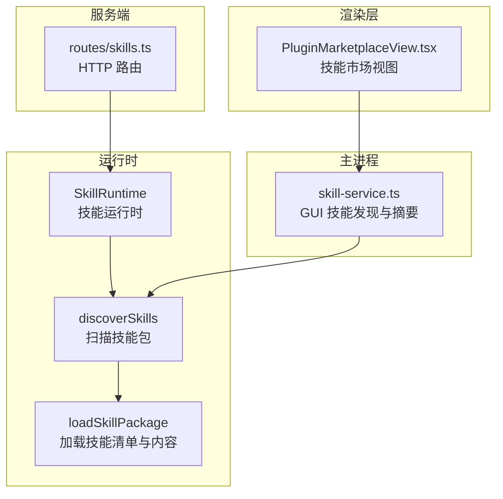
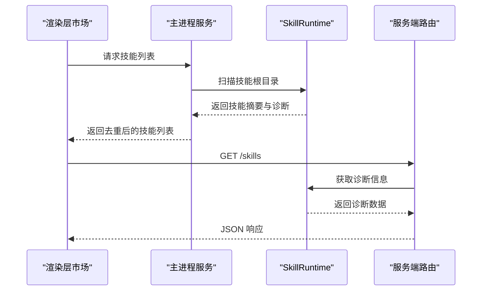
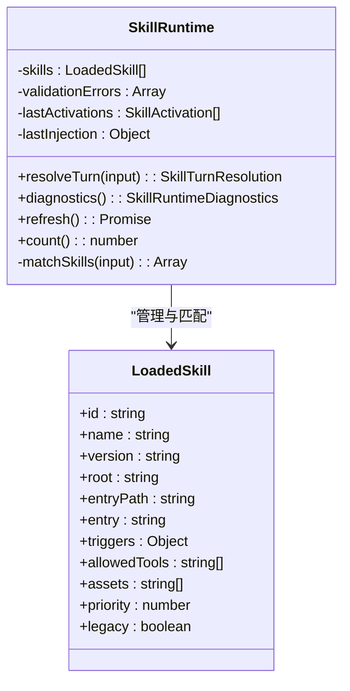
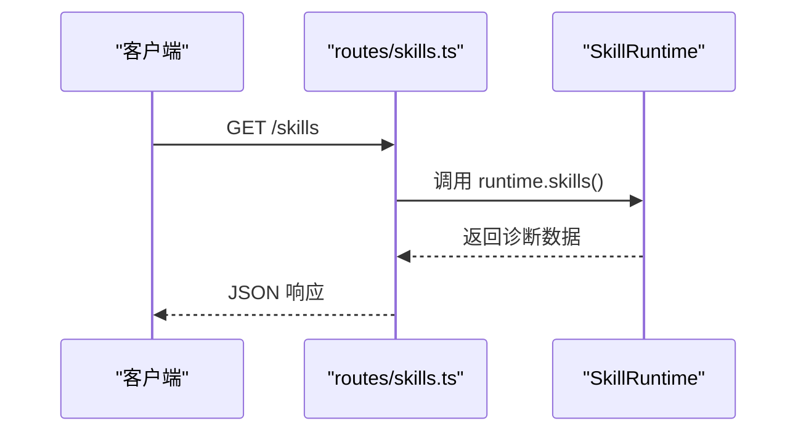
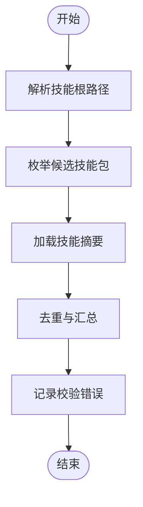
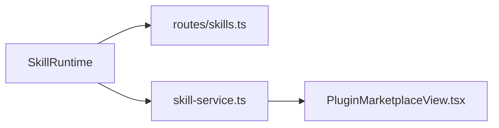

# 技能系统使用

<cite>
**本文引用的文件**
- [skill-runtime.ts](file://kun/src/skills/skill-runtime.ts)
- [skills.ts](file://kun/src/server/routes/skills.ts)
- [skill-service.ts](file://src/main/services/skill-service.ts)
- [PluginMarketplaceView.tsx](file://src/renderer/src/components/PluginMarketplaceView.tsx)
- [skill-runtime.test.ts](file://kun/tests/skill-runtime.test.ts)
- [openspec-apply-change/SKILL.md](file://.codex/skills/openspec-apply-change/SKILL.md)
- [openspec-archive-change/SKILL.md](file://.codex/skills/openspec-archive-change/SKILL.md)
- [openspec-explore/SKILL.md](file://.codex/skills/openspec-explore/SKILL.md)
- [openspec-propose/SKILL.md](file://.codex/skills/openspec-propose/SKILL.md)
</cite>

## 目录
1. [简介](#简介)
2. [项目结构](#项目结构)
3. [核心组件](#核心组件)
4. [架构总览](#架构总览)
5. [详细组件分析](#详细组件分析)
6. [依赖关系分析](#依赖关系分析)
7. [性能考量](#性能考量)
8. [故障排除指南](#故障排除指南)
9. [结论](#结论)
10. [附录](#附录)

## 简介
本指南面向使用者与开发者，系统讲解技能（Skill）的安装、配置、激活、诊断与卸载流程；说明技能提供者与技能接口规范、参数配置；给出开发基础知识、测试方法与性能监控建议；并提供常用技能示例、组合使用技巧与常见问题排查方法。同时覆盖内置技能与第三方技能在使用上的差异。

## 项目结构
技能系统主要由以下部分组成：
- 运行时：负责扫描技能包、解析清单、匹配触发条件、构建注入指令、限制工具集与字节预算，并输出诊断信息。
- 服务端路由：提供技能列表与诊断信息的 HTTP 接口。
- 主进程服务：负责 GUI 中技能根路径发现、技能摘要加载与去重。
- 渲染层市场：将技能以“个人”或“全局”来源展示，支持推荐分组与说明文案。
- 测试用例：验证技能匹配、工具注入与运行时行为。

图表来源
- [skill-runtime.ts:211-237](file://kun/src/skills/skill-runtime.ts#L211-L237)
- [skills.ts:1-20](file://kun/src/server/routes/skills.ts#L1-L20)
- [skill-service.ts:74-100](file://src/main/services/skill-service.ts#L74-L100)
- [PluginMarketplaceView.tsx:271-283](file://src/renderer/src/components/PluginMarketplaceView.tsx#L271-L283)

章节来源
- [skill-runtime.ts:1-92](file://kun/src/skills/skill-runtime.ts#L1-L92)
- [skills.ts:1-20](file://kun/src/server/routes/skills.ts#L1-L20)
- [skill-service.ts:74-100](file://src/main/services/skill-service.ts#L74-L100)
- [PluginMarketplaceView.tsx:271-283](file://src/renderer/src/components/PluginMarketplaceView.tsx#L271-L283)

## 核心组件
- 技能清单与加载
  - 支持新式 skill.json 与兼容旧式 SKILL.md 两种方式；新式清单字段包括 id、name、description、version、entry、triggers、allowedTools、assets、priority 等。
  - 加载时会解析 entry 内容作为技能指令文本，并记录允许使用的工具集合与资源列表。
- 触发机制
  - 命令前缀、正则模式、文件类型三类触发器；命中后按优先级与规则打分排序，取前 N 个激活。
- 注入策略
  - 将激活技能的指令文本拼接注入到上下文，受字节预算限制；同时汇总允许工具集合，计算被阻断的工具名。
- 诊断与刷新
  - 提供诊断接口，返回启用状态、根目录、技能清单、校验错误、最近激活与注入统计；支持运行时刷新重新扫描技能包。

章节来源
- [skill-runtime.ts:15-26](file://kun/src/skills/skill-runtime.ts#L15-L26)
- [skill-runtime.ts:256-296](file://kun/src/skills/skill-runtime.ts#L256-L296)
- [skill-runtime.ts:177-208](file://kun/src/skills/skill-runtime.ts#L177-L208)
- [skill-runtime.ts:298-334](file://kun/src/skills/skill-runtime.ts#L298-L334)
- [skill-runtime.ts:153-171](file://kun/src/skills/skill-runtime.ts#L153-L171)
- [skill-runtime.ts:115-121](file://kun/src/skills/skill-runtime.ts#L115-L121)

## 架构总览
技能系统采用“扫描—匹配—注入—诊断”的闭环流程。前端通过市场界面查看技能来源与描述，主进程负责发现技能根目录并加载摘要，服务端提供统一的技能列表与诊断接口，运行时在每次对话回合中进行触发匹配与指令注入。

图表来源
- [skill-service.ts:74-100](file://src/main/services/skill-service.ts#L74-L100)
- [skill-runtime.ts:211-237](file://kun/src/skills/skill-runtime.ts#L211-L237)
- [skills.ts:4-19](file://kun/src/server/routes/skills.ts#L4-L19)

## 详细组件分析

### 组件一：技能运行时（SkillRuntime）
职责与能力
- 创建与刷新：根据配置创建运行时实例，支持刷新以重新扫描技能包。
- 匹配回合：接收提示词、工作区与文件路径，计算匹配度并选择前 N 个激活技能。
- 指令注入：将激活技能的指令文本拼接注入上下文，受字节预算限制；汇总允许工具集合并计算阻断工具。
- 诊断输出：返回启用状态、根目录、技能清单、校验错误、最近激活与注入统计。

图表来源
- [skill-runtime.ts:85-98](file://kun/src/skills/skill-runtime.ts#L85-L98)
- [skill-runtime.ts:28-41](file://kun/src/skills/skill-runtime.ts#L28-L41)

章节来源
- [skill-runtime.ts:100-121](file://kun/src/skills/skill-runtime.ts#L100-L121)
- [skill-runtime.ts:123-151](file://kun/src/skills/skill-runtime.ts#L123-L151)
- [skill-runtime.ts:153-171](file://kun/src/skills/skill-runtime.ts#L153-L171)
- [skill-runtime.ts:177-208](file://kun/src/skills/skill-runtime.ts#L177-L208)

### 组件二：服务端技能路由（listSkills）
职责与能力
- 对外提供技能列表与诊断信息的 JSON 接口，便于前端与外部工具查询。

图表来源
- [skills.ts:4-19](file://kun/src/server/routes/skills.ts#L4-L19)

章节来源
- [skills.ts:1-20](file://kun/src/server/routes/skills.ts#L1-L20)

### 组件三：主进程技能服务（skill-service）
职责与能力
- 解析 GUI 的技能根路径，扫描候选技能包，加载技能摘要并去重，收集校验错误。
- 支持从用户设置与工作区覆盖路径中推导技能根目录。

图表来源
- [skill-service.ts:74-100](file://src/main/services/skill-service.ts#L74-L100)

章节来源
- [skill-service.ts:74-100](file://src/main/services/skill-service.ts#L74-L100)

### 组件四：渲染层技能市场（PluginMarketplaceView）
职责与能力
- 将技能按“个人/全局”来源分组展示，支持推荐分组与标题/描述文案。
- 可基于技能清单生成市场条目，标注来源标签。

章节来源
- [PluginMarketplaceView.tsx:271-283](file://src/renderer/src/components/PluginMarketplaceView.tsx#L271-L283)

## 依赖关系分析
- 运行时依赖清单解析与文件系统扫描，输出诊断与注入结果。
- 服务端路由依赖运行时提供的诊断接口。
- 主进程服务依赖运行时的扫描与加载逻辑，用于 GUI 展示。
- 渲染层依赖主进程服务提供的技能列表与来源标签。

图表来源
- [skill-runtime.ts:211-237](file://kun/src/skills/skill-runtime.ts#L211-L237)
- [skills.ts:4-19](file://kun/src/server/routes/skills.ts#L4-L19)
- [skill-service.ts:74-100](file://src/main/services/skill-service.ts#L74-L100)
- [PluginMarketplaceView.tsx:271-283](file://src/renderer/src/components/PluginMarketplaceView.tsx#L271-L283)

章节来源
- [skill-runtime.ts:211-237](file://kun/src/skills/skill-runtime.ts#L211-L237)
- [skills.ts:1-20](file://kun/src/server/routes/skills.ts#L1-L20)
- [skill-service.ts:74-100](file://src/main/services/skill-service.ts#L74-L100)
- [PluginMarketplaceView.tsx:271-283](file://src/renderer/src/components/PluginMarketplaceView.tsx#L271-L283)

## 性能考量
- 激活数量限制：默认仅激活前若干个最高分技能，避免上下文膨胀。
- 指令字节预算：对注入的指令文本进行字节累计，超过预算即停止注入，保证上下文控制。
- 工具阻断：当多个技能声明不同工具集合时，系统计算被阻断的工具集合，避免越权调用。
- 校验与重复检测：扫描阶段对重复 ID 进行去重与错误记录，减少无效匹配成本。

章节来源
- [skill-runtime.ts:6-7](file://kun/src/skills/skill-runtime.ts#L6-L7)
- [skill-runtime.ts:80-83](file://kun/src/skills/skill-runtime.ts#L80-L83)
- [skill-runtime.ts:129-132](file://kun/src/skills/skill-runtime.ts#L129-L132)
- [skill-runtime.ts:298-334](file://kun/src/skills/skill-runtime.ts#L298-L334)
- [skill-runtime.ts:336-342](file://kun/src/skills/skill-runtime.ts#L336-L342)
- [skill-runtime.ts:231-236](file://kun/src/skills/skill-runtime.ts#L231-L236)

## 故障排除指南
- 技能未显示
  - 检查技能根目录是否正确配置，确认存在 skill.json 或 SKILL.md。
  - 通过服务端 /skills 接口查看诊断信息与校验错误。
- 触发不生效
  - 确认触发器配置（命令前缀、正则模式、文件类型）是否与输入匹配。
  - 使用显式提及语法（如 $id、@name、/skill:id）可强制触发。
- 工具不可用
  - 检查技能 allowedTools 列表与当前工具注册情况，关注被阻断工具集合。
- 注入过多导致上下文超限
  - 调整 activeLimit 与 instructionBudgetBytes 参数，降低激活数量或字节预算。
- 重复 ID 冲突
  - 扫描阶段会记录重复 ID 错误，需修正技能清单中的 id 字段。

章节来源
- [skills.ts:4-19](file://kun/src/server/routes/skills.ts#L4-L19)
- [skill-runtime.ts:362-369](file://kun/src/skills/skill-runtime.ts#L362-L369)
- [skill-runtime.ts:129-132](file://kun/src/skills/skill-runtime.ts#L129-L132)
- [skill-runtime.ts:231-236](file://kun/src/skills/skill-runtime.ts#L231-L236)
- [skill-runtime.ts:336-342](file://kun/src/skills/skill-runtime.ts#L336-L342)

## 结论
技能系统通过标准化的清单格式与严格的触发、注入、诊断流程，实现了灵活而可控的技能扩展能力。对于使用者而言，合理配置根目录与触发器、关注工具权限与字节预算即可获得稳定体验；对于开发者而言，遵循清单字段与触发器规范、编写清晰的指令文本与工具声明是高质量技能的关键。

## 附录

### 技能安装与配置流程
- 安装
  - 在本地准备技能包目录，包含 skill.json 或 SKILL.md。
  - 配置技能根目录（可通过 GUI 设置或环境变量），确保运行时可扫描到该目录。
- 配置
  - 新式清单字段：id、name、description、version、entry、triggers、allowedTools、assets、priority。
  - 兼容旧式：SKILL.md 文件内容将作为指令文本加载。
- 激活
  - 运行时在每轮对话中匹配命令、正则与文件类型触发器，按分数排序并注入指令。
- 卸载
  - 移除技能包目录或从根目录配置中移除对应路径，随后刷新运行时以生效。

章节来源
- [skill-runtime.ts:256-296](file://kun/src/skills/skill-runtime.ts#L256-L296)
- [skill-runtime.ts:211-237](file://kun/src/skills/skill-runtime.ts#L211-L237)
- [skill-runtime.ts:115-121](file://kun/src/skills/skill-runtime.ts#L115-L121)

### 技能接口规范与参数
- 清单字段
  - id：技能唯一标识（可选，缺省时由名称派生）。
  - name：技能名称。
  - description：技能描述。
  - version：版本号。
  - entry：入口文件（默认 SKILL.md）。
  - triggers：触发器对象，包含 commands、promptPatterns、fileTypes。
  - allowedTools：允许使用的工具名数组。
  - assets：资源文件路径数组。
  - priority：优先级数值。
- 运行时选项
  - activeLimit：每轮激活技能数量上限。
  - instructionBudgetBytes：注入指令的字节预算。

章节来源
- [skill-runtime.ts:15-26](file://kun/src/skills/skill-runtime.ts#L15-L26)
- [skill-runtime.ts:80-83](file://kun/src/skills/skill-runtime.ts#L80-L83)

### 技能开发基础知识
- 清单编写：确保字段完整且合法，触发器表达清晰，工具声明准确。
- 指令文本：简洁明确地描述任务目标、约束与期望输出。
- 资源管理：assets 中列出必要文件，避免过大或敏感内容。
- 兼容性：若需兼容旧式技能，保留 SKILL.md 并确保内容可读。

章节来源
- [skill-runtime.ts:15-26](file://kun/src/skills/skill-runtime.ts#L15-L26)
- [skill-runtime.ts:256-296](file://kun/src/skills/skill-runtime.ts#L256-L296)

### 技能测试方法
- 行为验证：构造不同输入（命令、正则、文件类型）验证匹配与激活顺序。
- 工具注入：确认 allowedTools 与被阻断工具集合符合预期。
- 上下文注入：验证指令文本拼接与字节预算控制。
- 诊断检查：通过 /skills 接口核对诊断数据与校验错误。

章节来源
- [skill-runtime.test.ts:134-176](file://kun/tests/skill-runtime.test.ts#L134-L176)
- [skills.ts:4-19](file://kun/src/server/routes/skills.ts#L4-L19)

### 技能性能监控
- 诊断指标：启用状态、根目录、技能数量、最近激活、注入字节数与预算、阻断工具集合。
- 调优建议：根据实际对话复杂度调整 activeLimit 与 instructionBudgetBytes，平衡效果与性能。

章节来源
- [skill-runtime.ts:153-171](file://kun/src/skills/skill-runtime.ts#L153-L171)
- [skill-runtime.ts:80-83](file://kun/src/skills/skill-runtime.ts#L80-L83)

### 常用技能示例与组合技巧
- 示例技能
  - openspec-apply-change：实现来自 OpenSpec 的变更任务。
  - openspec-archive-change：归档变更。
  - openspec-explore：探索变更影响。
  - openspec-propose：提出变更方案。
- 组合使用
  - 先用 explore 识别影响范围，再用 propose 生成方案，最后用 apply-change 实施。
  - 在同一轮对话中，系统会按分数与预算自动选择最合适的技能组合。

章节来源
- [.codex/skills/openspec-apply-change/SKILL.md](file://.codex/skills/openspec-apply-change/SKILL.md)
- [.codex/skills/openspec-archive-change/SKILL.md](file://.codex/skills/openspec-archive-change/SKILL.md)
- [.codex/skills/openspec-explore/SKILL.md](file://.codex/skills/openspec-explore/SKILL.md)
- [.codex/skills/openspec-propose/SKILL.md](file://.codex/skills/openspec-propose/SKILL.md)

### 内置技能与第三方技能差异
- 来源差异
  - 内置技能通常位于特定内置目录（例如 .codex/skills），由系统默认提供。
  - 第三方技能由用户自定义根目录提供，来源标记为“项目/全局”，并在市场中分类展示。
- 行为差异
  - 两者均遵循相同清单与触发机制；区别在于来源标签与默认可见性。
- 使用差异
  - 内置技能无需额外配置根目录；第三方技能需正确配置根路径并确保清单有效。

章节来源
- [PluginMarketplaceView.tsx:271-283](file://src/renderer/src/components/PluginMarketplaceView.tsx#L271-L283)
- [skill-service.ts:108-112](file://src/main/services/skill-service.ts#L108-L112)