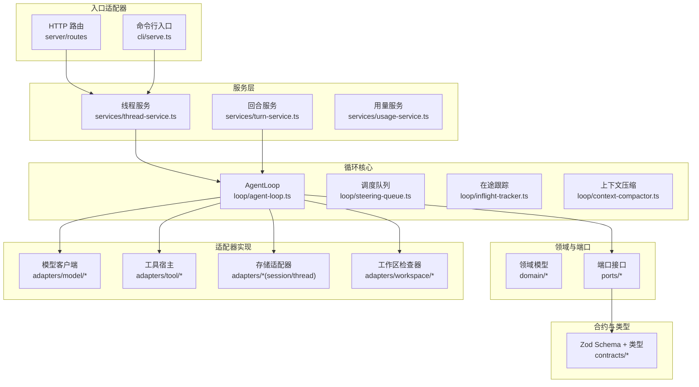
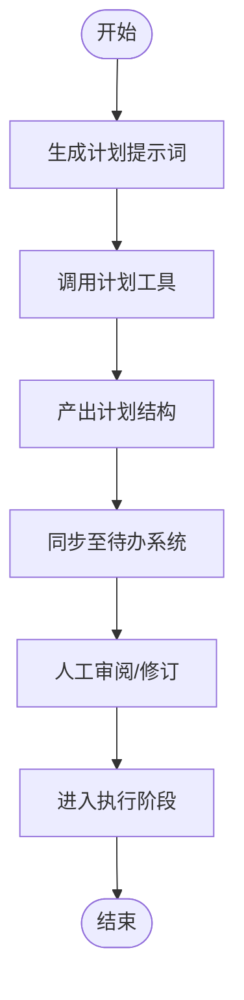
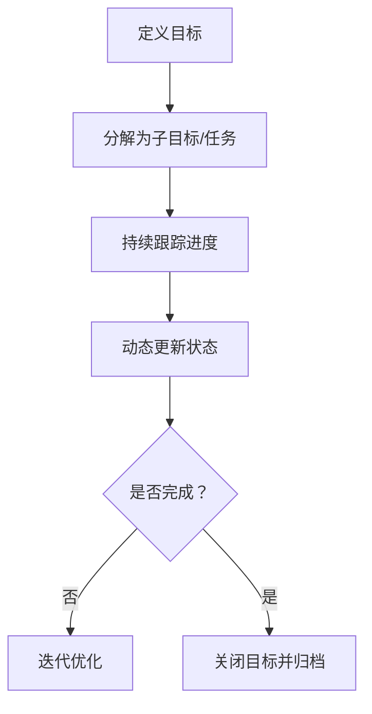
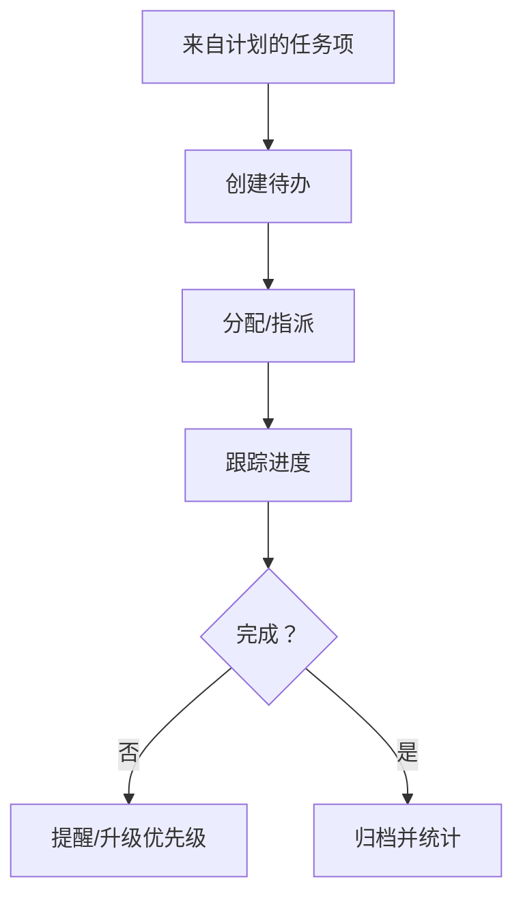
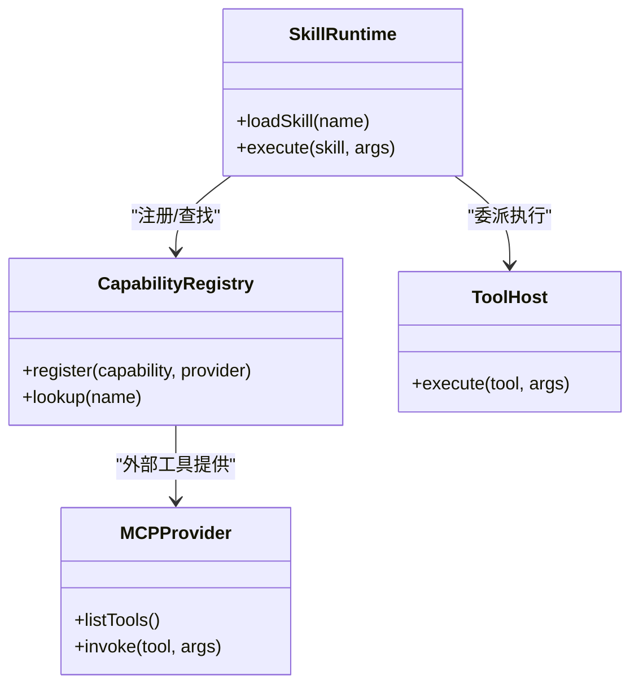
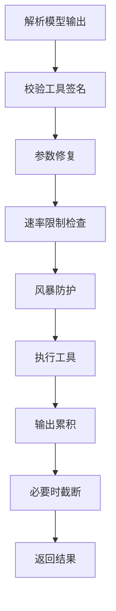
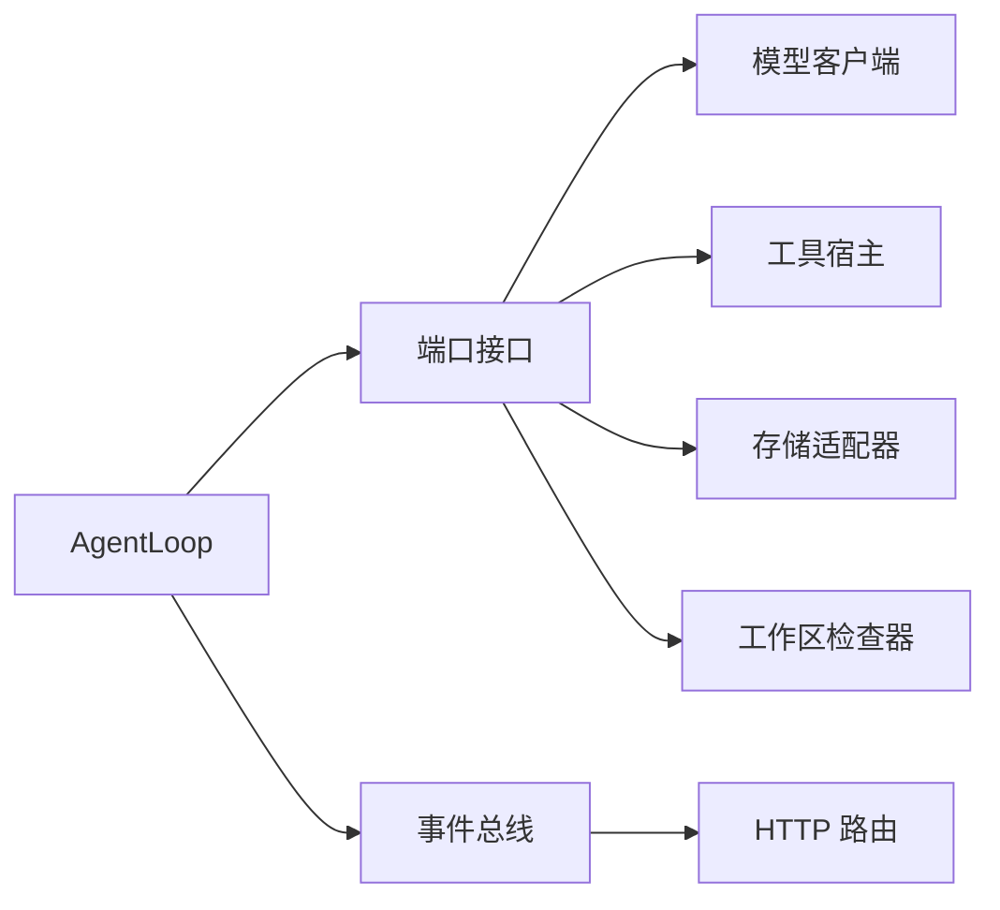

# 智能体功能使用指南

<cite>
**本文引用的文件**
- [AGENTS.zh-CN.md](file://docs/AGENTS.zh-CN.md)
- [kun-architecture.md](file://docs/kun-architecture.md)
- [kun-contributing.md](file://docs/kun-contributing.md)
- [agent-loop.ts](file://kun/src/loop/agent-loop.ts)
- [tool-host.ts](file://kun/src/ports/tool-host.ts)
- [model-client.ts](file://kun/src/adapters/model/deepseek-compat-model-client.ts)
- [builtin-tools.ts](file://kun/src/adapters/tool/builtin-tools.ts)
- [goal-tools.ts](file://kun/src/adapters/tool/goal-tools.ts)
- [todo-tools.ts](file://kun/src/adapters/tool/todo-tools.ts)
- [create-plan-tool.ts](file://kun/src/adapters/tool/create-plan-tool.ts)
- [delegation-runtime.ts](file://kun/src/delegation/delegation-runtime.ts)
- [thread-service.ts](file://kun/src/services/thread-service.ts)
- [turn-service.ts](file://kun/src/services/turn-service.ts)
- [runtime-event-recorder.ts](file://kun/src/services/runtime-event-recorder.ts)
- [in-memory-event-bus.ts](file://kun/src/adapters/in-memory-event-bus.ts)
- [in-memory-approval-gate.ts](file://kun/src/adapters/in-memory-approval-gate.ts)
- [in-memory-session-store.ts](file://kun/src/adapters/in-memory-session-store.ts)
- [in-memory-thread-store.ts](file://kun/src/adapters/in-memory-thread-store.ts)
- [workspace-inspector.ts](file://kun/src/ports/workspace-inspector.ts)
- [local-workspace-inspector.ts](file://kun/src/adapters/workspace/local-workspace-inspector.ts)
- [kun-config.ts](file://kun/src/config/kun-config.ts)
- [kun-system-prompt.ts](file://kun/src/prompt/kun-system-prompt.ts)
- [gui-plan.ts](file://src/shared/gui-plan.ts)
- [plan-command.ts](file://src/renderer/src/plan/plan-command.ts)
- [plan-tool.ts](file://src/renderer/src/plan/plan-tool.ts)
- [PlanPanel.tsx](file://src/renderer/src/components/plan/PlanPanel.tsx)
- [TodoPanel.tsx](file://src/renderer/src/components/todo/TodoPanel.tsx)
- [settings-section-agents.tsx](file://src/renderer/src/components/settings-section-agents.tsx)
- [runtime-factory.ts](file://kun/src/server/runtime-factory.ts)
- [http-server.ts](file://kun/src/server/http-server.ts)
- [router.ts](file://kun/src/server/router.ts)
- [approvals.ts](file://kun/src/server/routes/approvals.ts)
- [threads.ts](file://kun/src/server/routes/threads.ts)
- [turns.ts](file://kun/src/server/routes/turns.ts)
- [usage.ts](file://kun/src/server/routes/usage.ts)
- [events.ts](file://kun/src/server/routes/events.ts)
- [health.ts](file://kun/src/server/routes/health.ts)
- [runtime-error.ts](file://kun/src/server/routes/runtime-error.ts)
- [runtime-info.ts](file://kun/src/server/routes/runtime-info.ts)
- [kun-process.ts](file://src/main/kun-process.ts)
- [kun-adapter.ts](file://src/main/runtime/kun-adapter.ts)
- [kun-runtime.ts](file://src/renderer/src/agent/kun-runtime.ts)
- [kun-mapper.ts](file://src/renderer/src/agent/kun-mapper.ts)
- [runtime-client.ts](file://src/renderer/src/agent/runtime-client.ts)
- [kun-endpoints.ts](file://src/shared/kun-endpoints.ts)
- [kun-diag.ts](file://src/renderer/src/lib/load-kun-diagnostics.ts)
</cite>

## 目录
1. [简介](#简介)
2. [项目结构](#项目结构)
3. [核心组件](#核心组件)
4. [架构总览](#架构总览)
5. [详细组件分析](#详细组件分析)
6. [依赖关系分析](#依赖关系分析)
7. [性能考虑](#性能考虑)
8. [故障排查指南](#故障排查指南)
9. [结论](#结论)
10. [附录](#附录)

## 简介
本指南面向希望高效使用智能体功能的用户与开发者，围绕以下主题展开：计划制定流程、目标管理与任务跟踪、审批流程、技能系统、智能体循环工作原理、工具调用执行过程、配置选项、性能监控与调试技巧，并提供个人助理、团队协作、项目管理三类典型场景的最佳实践与配置建议。内容基于仓库中的技术文档与源码模块进行梳理，帮助读者从整体到细节掌握智能体的使用与扩展。

## 项目结构
智能体系统采用“六边形架构（Ports & Adapters）”组织，核心由服务层编排用例、循环层承载状态化协调逻辑、端口定义抽象能力、适配器提供具体实现，合约层约束数据结构与类型安全。下图展示关键目录与职责映射：



图表来源
- [kun-architecture.md](file://docs/kun-architecture.md)
- [agent-loop.ts](file://kun/src/loop/agent-loop.ts)
- [thread-service.ts](file://kun/src/services/thread-service.ts)
- [turn-service.ts](file://kun/src/services/turn-service.ts)
- [tool-host.ts](file://kun/src/ports/tool-host.ts)
- [model-client.ts](file://kun/src/adapters/model/deepseek-compat-model-client.ts)
- [in-memory-session-store.ts](file://kun/src/adapters/in-memory-session-store.ts)
- [in-memory-thread-store.ts](file://kun/src/adapters/in-memory-thread-store.ts)
- [workspace-inspector.ts](file://kun/src/ports/workspace-inspector.ts)

章节来源
- [kun-architecture.md](file://docs/kun-architecture.md)
- [kun-contributing.md](file://docs/kun-contributing.md)

## 核心组件
- 智能体循环（AgentLoop）：负责状态化协调、上下文压缩、工具调用与模型推理的顺序推进，是系统的核心执行引擎。
- 服务层（Services）：封装线程、回合、用量等业务用例脚本，作为对外编排入口。
- 端口与适配器（Ports & Adapters）：通过端口抽象能力边界，适配器提供具体实现（如内存/文件存储、本地工具宿主、模型客户端、工作区检查器等）。
- 合约层（Contracts）：以 Zod Schema 约束输入输出，确保事件与数据结构的一致性与可验证性。
- 审批与事件总线：在循环中通过审批门控与事件总线实现交互式控制与可观测性。

章节来源
- [agent-loop.ts](file://kun/src/loop/agent-loop.ts)
- [thread-service.ts](file://kun/src/services/thread-service.ts)
- [turn-service.ts](file://kun/src/services/turn-service.ts)
- [tool-host.ts](file://kun/src/ports/tool-host.ts)
- [in-memory-event-bus.ts](file://kun/src/adapters/in-memory-event-bus.ts)
- [in-memory-approval-gate.ts](file://kun/src/adapters/in-memory-approval-gate.ts)
- [kun-contributing.md](file://docs/kun-contributing.md)

## 架构总览
下图展示从入口到循环再到适配器的调用链路，以及事件记录与持久化的路径：

```mermaid
sequenceDiagram
participant Client as "客户端/路由"
participant Threads as "线程服务"
participant Loop as "AgentLoop"
participant Model as "模型客户端"
participant Tools as "工具宿主"
participant Bus as "事件总线"
participant Store as "会话/线程存储"
Client->>Threads : 创建/查询线程
Threads->>Loop : 初始化循环并注入依赖
Loop->>Model : 请求模型推理
Model-->>Loop : 返回响应/工具调用
Loop->>Tools : 执行工具调用
Tools-->>Loop : 返回工具结果
Loop->>Bus : 记录运行事件
Loop->>Store : 追加会话日志
Bus-->>Client : SSE/订阅事件
```

图表来源
- [http-server.ts](file://kun/src/server/http-server.ts)
- [router.ts](file://kun/src/server/router.ts)
- [thread-service.ts](file://kun/src/services/thread-service.ts)
- [agent-loop.ts](file://kun/src/loop/agent-loop.ts)
- [model-client.ts](file://kun/src/adapters/model/deepseek-compat-model-client.ts)
- [tool-host.ts](file://kun/src/ports/tool-host.ts)
- [in-memory-event-bus.ts](file://kun/src/adapters/in-memory-event-bus.ts)
- [in-memory-session-store.ts](file://kun/src/adapters/in-memory-session-store.ts)

## 详细组件分析

### 计划制定流程
- 计划工具：提供创建计划的工具函数与提示词，支持将高层目标拆解为可执行步骤。
- GUI 计划面板：提供可视化计划编辑与同步能力，便于与任务面板联动。
- 计划与待办同步：计划生成后可与待办系统联动，形成闭环的任务执行与追踪。



图表来源
- [create-plan-tool.ts](file://kun/src/adapters/tool/create-plan-tool.ts)
- [gui-plan.ts](file://src/shared/gui-plan.ts)
- [plan-command.ts](file://src/renderer/src/plan/plan-command.ts)
- [plan-tool.ts](file://src/renderer/src/plan/plan-tool.ts)
- [PlanPanel.tsx](file://src/renderer/src/components/plan/PlanPanel.tsx)
- [TodoPanel.tsx](file://src/renderer/src/components/todo/TodoPanel.tsx)

章节来源
- [AGENTS.zh-CN.md](file://docs/AGENTS.zh-CN.md)
- [create-plan-tool.ts](file://kun/src/adapters/tool/create-plan-tool.ts)
- [gui-plan.ts](file://src/shared/gui-plan.ts)
- [plan-command.ts](file://src/renderer/src/plan/plan-command.ts)
- [plan-tool.ts](file://src/renderer/src/plan/plan-tool.ts)
- [PlanPanel.tsx](file://src/renderer/src/components/plan/PlanPanel.tsx)
- [TodoPanel.tsx](file://src/renderer/src/components/todo/TodoPanel.tsx)

### 目标管理系统
- 目标工具：提供目标设定、分解、更新与完成标记等操作，支撑目标驱动的智能体行为。
- 与计划/任务联动：目标可作为计划输入，完成后自动推进相关任务状态。



图表来源
- [goal-tools.ts](file://kun/src/adapters/tool/goal-tools.ts)

章节来源
- [goal-tools.ts](file://kun/src/adapters/tool/goal-tools.ts)

### 任务跟踪机制
- 待办工具：提供待办事项的创建、查询、更新与删除，支持优先级与截止日期管理。
- 与计划/目标联动：任务来源于计划，完成情况反馈到目标与计划的健康度评估。



图表来源
- [todo-tools.ts](file://kun/src/adapters/tool/todo-tools.ts)
- [TodoPanel.tsx](file://src/renderer/src/components/todo/TodoPanel.tsx)

章节来源
- [todo-tools.ts](file://kun/src/adapters/tool/todo-tools.ts)
- [TodoPanel.tsx](file://src/renderer/src/components/todo/TodoPanel.tsx)

### 审批流程
- 审批门控：在关键动作（如批量变更、高成本工具调用）前拦截，等待人工确认。
- 审批路由：提供审批请求的创建、查询与处理接口，结合事件总线进行通知与持久化。

```mermaid
sequenceDiagram
participant Loop as "AgentLoop"
participant Gate as "审批门控"
participant Route as "审批路由"
participant Bus as "事件总线"
Loop->>Gate : 请求审批
Gate-->>Loop : 等待确认
Route-->>Gate : 审批通过/拒绝
Gate-->>Loop : 放行或终止
Loop->>Bus : 记录审批事件
```

图表来源
- [in-memory-approval-gate.ts](file://kun/src/adapters/in-memory-approval-gate.ts)
- [approvals.ts](file://kun/src/server/routes/approvals.ts)
- [runtime-event-recorder.ts](file://kun/src/services/runtime-event-recorder.ts)

章节来源
- [in-memory-approval-gate.ts](file://kun/src/adapters/in-memory-approval-gate.ts)
- [approvals.ts](file://kun/src/server/routes/approvals.ts)
- [runtime-event-recorder.ts](file://kun/src/services/runtime-event-recorder.ts)

### 技能系统
- 技能注册与运行时：通过技能运行时加载与执行内置或外部技能，支持 MCP、本地工具等多种来源。
- 技能与工具的关系：技能是对工具能力的封装与组合，便于复用与版本化。



图表来源
- [builtin-tools.ts](file://kun/src/adapters/tool/builtin-tools.ts)
- [mcp-tool-provider.ts](file://kun/src/adapters/tool/mcp-tool-provider.ts)
- [capability-registry.ts](file://kun/src/adapters/tool/capability-registry.ts)
- [local-tool-host.ts](file://kun/src/adapters/tool/local-tool-host.ts)

章节来源
- [builtin-tools.ts](file://kun/src/adapters/tool/builtin-tools.ts)
- [mcp-tool-provider.ts](file://kun/src/adapters/tool/mcp-tool-provider.ts)
- [capability-registry.ts](file://kun/src/adapters/tool/capability-registry.ts)
- [local-tool-host.ts](file://kun/src/adapters/tool/local-tool-host.ts)

### 智能体循环工作原理
- AgentLoop：状态化协调器，按回合推进，负责上下文压缩、在途跟踪、工具风暴防护与模型路由。
- 事件溯源：通过运行时事件记录器统一记录事件序列，保证一致性与可观测性。
- 依赖注入：通过构造参数注入端口，避免 IoC，提升可测试性与可维护性。

```mermaid
sequenceDiagram
participant Loop as "AgentLoop"
participant Model as "模型客户端"
participant Tools as "工具宿主"
participant Recorder as "事件记录器"
participant Stores as "存储适配器"
Loop->>Model : 推理请求
Model-->>Loop : 响应/工具调用
Loop->>Tools : 执行工具
Tools-->>Loop : 工具结果
Loop->>Recorder : 记录事件
Recorder->>Stores : 持久化
Loop-->>Loop : 更新内部状态
```

图表来源
- [agent-loop.ts](file://kun/src/loop/agent-loop.ts)
- [model-client.ts](file://kun/src/adapters/model/deepseek-compat-model-client.ts)
- [tool-host.ts](file://kun/src/ports/tool-host.ts)
- [runtime-event-recorder.ts](file://kun/src/services/runtime-event-recorder.ts)
- [in-memory-session-store.ts](file://kun/src/adapters/in-memory-session-store.ts)
- [in-memory-thread-store.ts](file://kun/src/adapters/in-memory-thread-store.ts)

章节来源
- [agent-loop.ts](file://kun/src/loop/agent-loop.ts)
- [runtime-event-recorder.ts](file://kun/src/services/runtime-event-recorder.ts)
- [kun-contributing.md](file://docs/kun-contributing.md)

### 工具调用执行过程
- 工具选择与参数修复：根据模型输出与工具签名进行参数修复与调用。
- 工具风暴防护：在高并发工具调用场景下进行节流与中断保护。
- 输出累积与截断：对工具输出进行累积与截断策略，控制上下文长度。



图表来源
- [tool-call-repair.ts](file://kun/src/loop/tool-call-repair.ts)
- [tool-storm-breaker.ts](file://kun/src/loop/tool-storm-breaker.ts)
- [output-accumulator.ts](file://kun/src/adapters/tool/output-accumulator.ts)
- [truncate.ts](file://kun/src/adapters/tool/truncate.ts)

章节来源
- [tool-call-repair.ts](file://kun/src/loop/tool-call-repair.ts)
- [tool-storm-breaker.ts](file://kun/src/loop/tool-storm-breaker.ts)
- [output-accumulator.ts](file://kun/src/adapters/tool/output-accumulator.ts)
- [truncate.ts](file://kun/src/adapters/tool/truncate.ts)

### 配置选项与系统提示
- 配置文件：集中管理运行时配置，包括模型参数、工具开关、限流策略等。
- 系统提示：通过系统提示模板影响智能体行为风格与上下文引导。

章节来源
- [kun-config.ts](file://kun/src/config/kun-config.ts)
- [kun-system-prompt.ts](file://kun/src/prompt/kun-system-prompt.ts)

### 性能监控与调试
- 用量统计：通过用量服务统计 token 使用与成本，支持按线程/模型维度聚合。
- 事件总线：通过事件总线订阅运行时事件，实现前端与后端的实时观测。
- 诊断加载：在渲染端加载运行诊断信息，辅助定位问题。

章节来源
- [usage.ts](file://kun/src/server/routes/usage.ts)
- [events.ts](file://kun/src/server/routes/events.ts)
- [kun-diag.ts](file://src/renderer/src/lib/load-kun-diagnostics.ts)

## 依赖关系分析
- 松耦合设计：通过端口隔离变化点，适配器替换不影响核心循环。
- 显式依赖注入：核心类仅通过构造参数注入依赖，便于测试与演进。
- 事件驱动：运行时事件作为“唯一真相”，统一持久化与广播。



图表来源
- [agent-loop.ts](file://kun/src/loop/agent-loop.ts)
- [tool-host.ts](file://kun/src/ports/tool-host.ts)
- [model-client.ts](file://kun/src/adapters/model/deepseek-compat-model-client.ts)
- [in-memory-event-bus.ts](file://kun/src/adapters/in-memory-event-bus.ts)
- [http-server.ts](file://kun/src/server/http-server.ts)

章节来源
- [kun-contributing.md](file://docs/kun-contributing.md)

## 性能考虑
- 上下文压缩：定期压缩历史上下文，降低 token 消耗与延迟。
- 速率限制：对工具调用进行速率限制，避免资源过载。
- 缓存与 TTL：对工具目录与查询结果进行缓存，提高重复场景性能。
- 工具风暴防护：在高频工具调用时进行中断保护，防止雪崩效应。

章节来源
- [context-compactor.ts](file://kun/src/loop/context-compactor.ts)
- [tool-rate-limit.ts](file://kun/src/adapters/tool/tool-rate-limit.ts)
- [ttl-lru-cache.ts](file://kun/src/cache/ttl-lru-cache.ts)
- [tool-storm-breaker.ts](file://kun/src/loop/tool-storm-breaker.ts)

## 故障排查指南
- 快速失败与安全失败：对运行时事件记录器与工具执行进行区分，前者快速暴露错误，后者进行静默降级。
- 事件回放：通过事件总线与会话存储回放运行轨迹，定位异常点。
- 审批阻塞：若出现审批阻塞，检查审批路由状态与事件记录。
- 运行诊断：在渲染端加载诊断信息，查看错误堆栈与事件序列。

章节来源
- [kun-contributing.md](file://docs/kun-contributing.md)
- [runtime-error.ts](file://kun/src/server/routes/runtime-error.ts)
- [kun-diag.ts](file://src/renderer/src/lib/load-kun-diagnostics.ts)

## 结论
该智能体系统以清晰的六边形架构与事件驱动设计为核心，配合可插拔的工具与技能体系、完善的审批与监控机制，既满足个人助理的轻量需求，也能支撑团队协作与项目管理的复杂场景。通过本文档的配置与使用建议，用户可在不同场景下快速落地并持续优化智能体的执行效果与稳定性。

## 附录

### 场景化配置与最佳实践

- 个人助理
  - 关注点：简洁、低等待、易上手
  - 建议
    - 使用默认系统提示风格，减少上下文噪音
    - 开启常用内置工具（如文件读写、搜索），关闭高成本工具
    - 设置合理的工具速率限制，避免频繁触发
    - 使用计划与待办联动，将日常任务结构化
  - 参考文件
    - [kun-system-prompt.ts](file://kun/src/prompt/kun-system-prompt.ts)
    - [builtin-tools.ts](file://kun/src/adapters/tool/builtin-tools.ts)
    - [create-plan-tool.ts](file://kun/src/adapters/tool/create-plan-tool.ts)
    - [todo-tools.ts](file://kun/src/adapters/tool/todo-tools.ts)

- 团队协作
  - 关注点：透明、可控、可审计
  - 建议
    - 启用审批流程，对关键操作进行人工确认
    - 通过事件总线与路由接口实现跨端协同
    - 使用工作区检查器限定访问范围，保障安全
    - 对用量进行分角色统计，控制成本
  - 参考文件
    - [in-memory-approval-gate.ts](file://kun/src/adapters/in-memory-approval-gate.ts)
    - [approvals.ts](file://kun/src/server/routes/approvals.ts)
    - [workspace-inspector.ts](file://kun/src/ports/workspace-inspector.ts)
    - [usage.ts](file://kun/src/server/routes/usage.ts)

- 项目管理
  - 关注点：计划-执行-追踪闭环
  - 建议
    - 将目标分解为计划，再拆分为可执行任务
    - 以计划面板与待办面板联动，形成可视化追踪
    - 对工具调用进行风暴防护与速率限制，保障稳定性
    - 通过事件记录与诊断信息进行持续优化
  - 参考文件
    - [create-plan-tool.ts](file://kun/src/adapters/tool/create-plan-tool.ts)
    - [PlanPanel.tsx](file://src/renderer/src/components/plan/PlanPanel.tsx)
    - [TodoPanel.tsx](file://src/renderer/src/components/todo/TodoPanel.tsx)
    - [tool-storm-breaker.ts](file://kun/src/loop/tool-storm-breaker.ts)
    - [kun-diag.ts](file://src/renderer/src/lib/load-kun-diagnostics.ts)

### 高级功能与扩展
- 子智能体委托：通过委托运行时实现多智能体协作，适合复杂任务分解与并行执行。
- MCP 工具提供：通过 MCP 协议接入外部工具生态，扩展能力边界。
- 自定义适配器：根据部署环境替换存储、模型或工作区检查器实现。

章节来源
- [delegation-runtime.ts](file://kun/src/delegation/delegation-runtime.ts)
- [mcp-tool-provider.ts](file://kun/src/adapters/tool/mcp-tool-provider.ts)
- [local-workspace-inspector.ts](file://kun/src/adapters/workspace/local-workspace-inspector.ts)