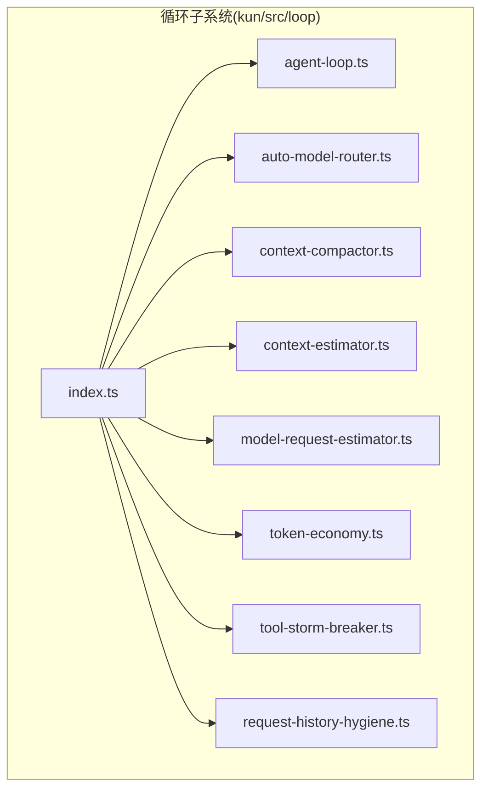
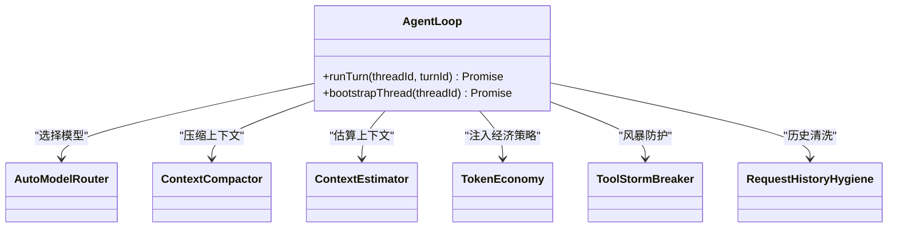
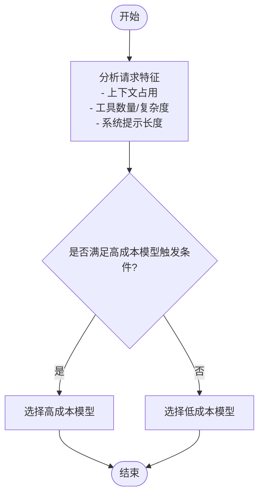
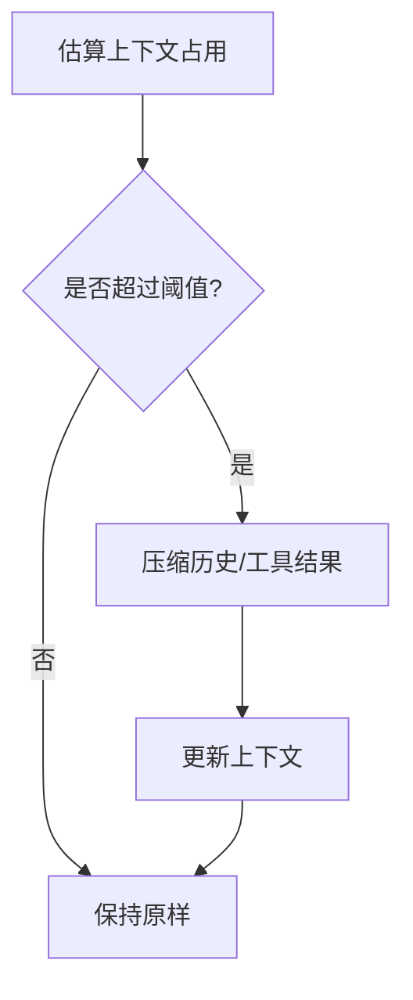
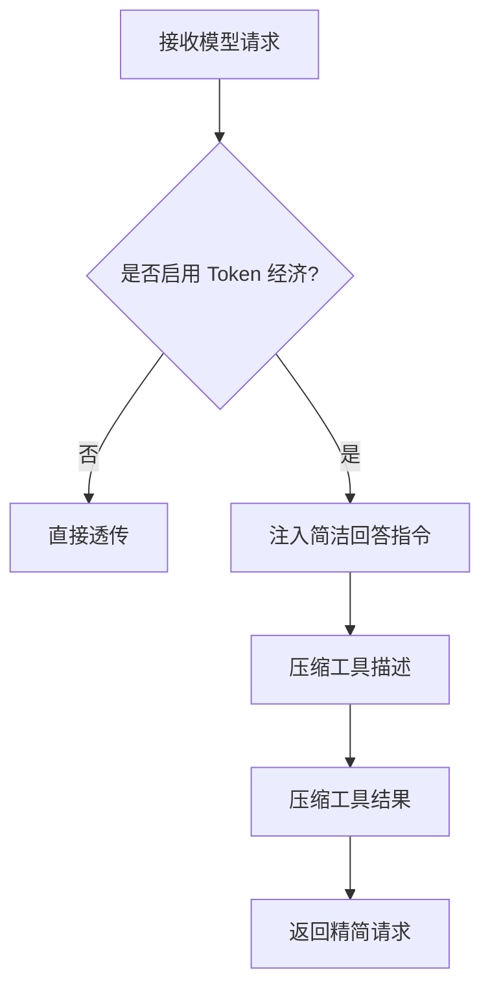
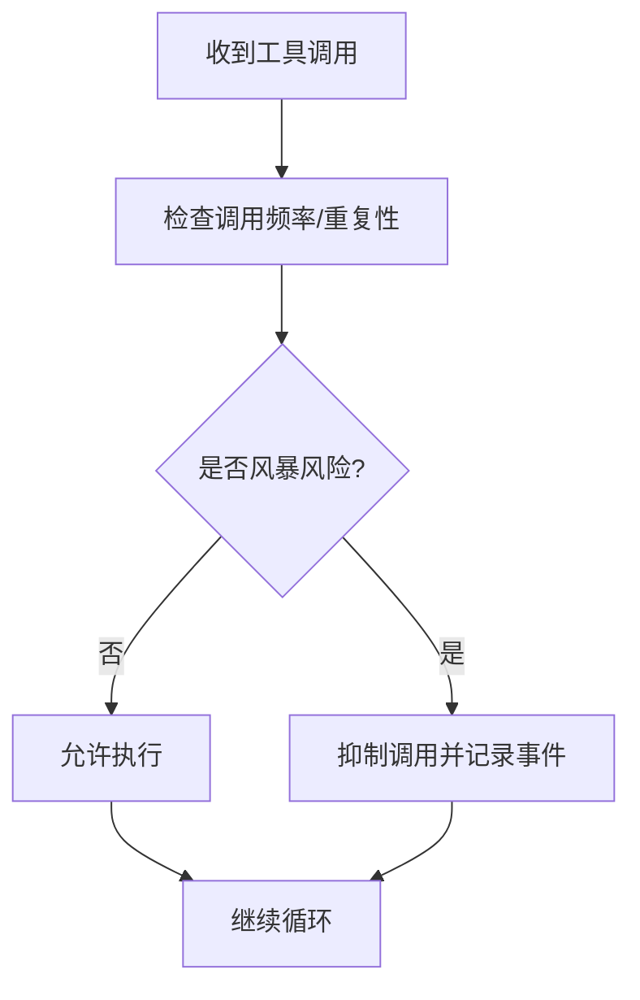
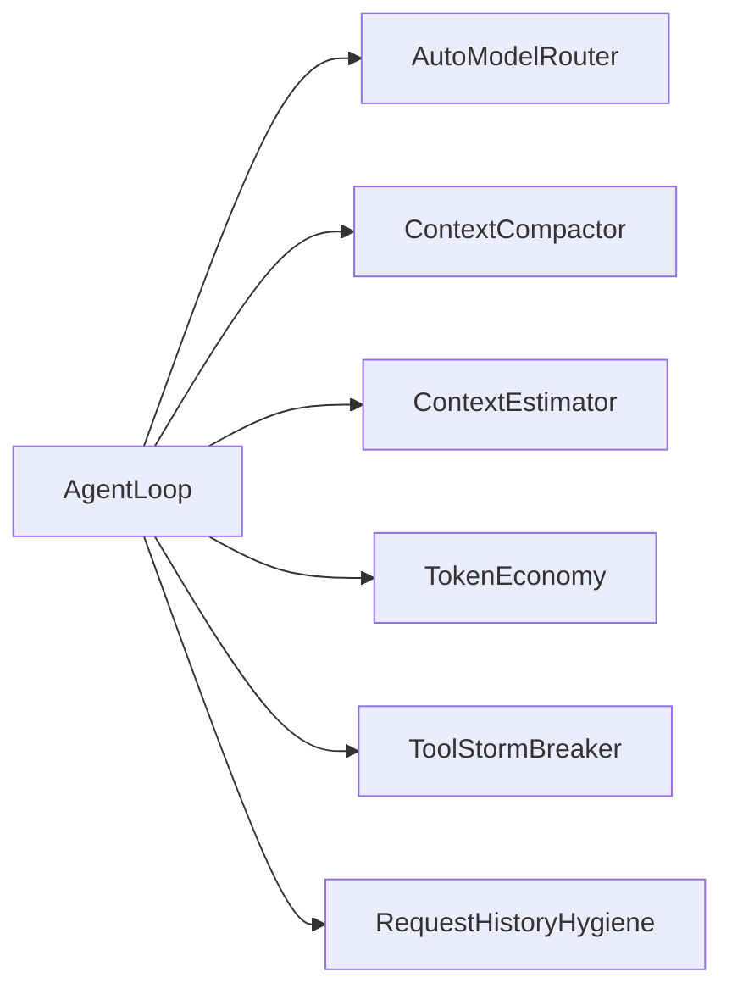

# 智能体循环操作

<cite>
**本文引用的文件**
- [agent-loop.ts](file://kun/src/loop/agent-loop.ts)
- [auto-model-router.ts](file://kun/src/loop/auto-model-router.ts)
- [context-compactor.ts](file://kun/src/loop/context-compactor.ts)
- [context-estimator.ts](file://kun/src/loop/context-estimator.ts)
- [model-request-estimator.ts](file://kun/src/loop/model-request-estimator.ts)
- [token-economy.ts](file://kun/src/loop/token-economy.ts)
- [tool-storm-breaker.ts](file://kun/src/loop/tool-storm-breaker.ts)
- [request-history-hygiene.ts](file://kun/src/loop/request-history-hygiene.ts)
- [index.ts](file://kun/src/loop/index.ts)
- [loop.test.ts](file://kun/tests/loop.test.ts)
- [auto-model-router.test.ts](file://kun/tests/auto-model-router.test.ts)
- [token-economy.test.ts](file://kun/tests/token-economy.test.ts)
- [kun-contributing.md](file://docs/kun-contributing.md)
- [settings-section-agents.tsx](file://src/renderer/src/components/settings-section-agents.tsx)
- [app-settings-kun.ts](file://src/shared/app-settings-kun.ts)
</cite>

## 目录
1. [简介](#简介)
2. [项目结构](#项目结构)
3. [核心组件](#核心组件)
4. [架构总览](#架构总览)
5. [详细组件分析](#详细组件分析)
6. [依赖关系分析](#依赖关系分析)
7. [性能考量](#性能考量)
8. [故障排查指南](#故障排查指南)
9. [结论](#结论)
10. [附录：场景化配置示例](#附录场景化配置示例)

## 简介
本指南围绕“智能体循环”展开，系统讲解循环工作原理、触发机制与状态监控；详解自动模型路由、Token 经济模型与上下文压缩策略；并提供性能优化、异常处理与日志分析建议。文档同时给出实时聊天、批量处理、长时间任务等典型场景的配置思路与注意事项。

## 项目结构
智能体循环能力集中在 kun/src/loop 目录，围绕“端口与适配器 + 函数式内核”的设计原则构建，通过显式依赖注入组装运行时所需的各组件。入口导出统一于 loop/index.ts，便于按需组合。



图表来源
- [index.ts:1-9](file://kun/src/loop/index.ts#L1-L9)

章节来源
- [index.ts:1-9](file://kun/src/loop/index.ts#L1-L9)

## 核心组件
- 循环内核与控制流：AgentLoop 负责单轮对话的完整生命周期，包括工具调用、模型推理、结果回写与状态推进。
- 自动模型路由：AutoModelRouter 基于请求特征与上下文估算，动态选择更合适的模型以平衡成本与质量。
- 上下文压缩：ContextCompactor 与 ContextEstimator 协作，对历史与工具结果进行压缩与阈值管理，避免超出上下文上限。
- Token 经济模型：TokenEconomy 将“节流指令、工具描述压缩、历史压缩”等策略注入模型请求，降低 Token 使用量。
- 工具风暴防护：ToolStormBreaker 限制重复或异常工具调用，防止循环陷入无效震荡。
- 请求历史清洗：RequestHistoryHygiene 清理冗余或过期的历史记录，维持高效上下文窗口。
- 运行时配置与可视化：前端设置页与应用设置归一化逻辑，支持用户调整循环行为（如 Token 经济开关、上下文压缩阈值、工具风暴防护等）。

章节来源
- [agent-loop.ts](file://kun/src/loop/agent-loop.ts)
- [auto-model-router.ts](file://kun/src/loop/auto-model-router.ts)
- [context-compactor.ts](file://kun/src/loop/context-compactor.ts)
- [context-estimator.ts](file://kun/src/loop/context-estimator.ts)
- [model-request-estimator.ts](file://kun/src/loop/model-request-estimator.ts)
- [token-economy.ts](file://kun/src/loop/token-economy.ts)
- [tool-storm-breaker.ts](file://kun/src/loop/tool-storm-breaker.ts)
- [request-history-hygiene.ts](file://kun/src/loop/request-history-hygiene.ts)
- [settings-section-agents.tsx:271-309](file://src/renderer/src/components/settings-section-agents.tsx#L271-L309)
- [app-settings-kun.ts:226-267](file://src/shared/app-settings-kun.ts#L226-L267)

## 架构总览
下图展示一次典型循环的端到端流程：从线程/回合状态读取，到工具执行与模型推理，再到上下文压缩与历史清洗，最终回写结果并推进状态。

```mermaid
sequenceDiagram
participant UI as "前端/调用方"
participant Loop as "AgentLoop"
participant Router as "AutoModelRouter"
participant Comp as "ContextCompactor"
participant Est as "ContextEstimator"
participant Econ as "TokenEconomy"
participant Storm as "ToolStormBreaker"
participant Hyg as "RequestHistoryHygiene"
UI->>Loop : "启动一轮对话(runTurn)"
Loop->>Est : "估算当前上下文占用"
Est-->>Loop : "返回占用评估"
Loop->>Comp : "必要时压缩历史/工具结果"
Comp-->>Loop : "返回压缩后上下文"
Loop->>Econ : "根据配置注入经济策略"
Econ-->>Loop : "返回精简后的请求"
Loop->>Router : "基于上下文与特征选择模型"
Router-->>Loop : "返回模型选择结果"
Loop->>Storm : "检查工具风暴风险"
Storm-->>Loop : "允许/抑制工具调用"
Loop->>Loop : "执行工具调用与模型推理"
Loop->>Hyg : "清理冗余历史"
Hyg-->>Loop : "返回清洗后历史"
Loop-->>UI : "返回本轮状态(完成/继续)"
```

图表来源
- [agent-loop.ts](file://kun/src/loop/agent-loop.ts)
- [auto-model-router.ts](file://kun/src/loop/auto-model-router.ts)
- [context-compactor.ts](file://kun/src/loop/context-compactor.ts)
- [context-estimator.ts](file://kun/src/loop/context-estimator.ts)
- [token-economy.ts](file://kun/src/loop/token-economy.ts)
- [tool-storm-breaker.ts](file://kun/src/loop/tool-storm-breaker.ts)
- [request-history-hygiene.ts](file://kun/src/loop/request-history-hygiene.ts)

## 详细组件分析

### AgentLoop：循环内核与控制流
- 角色定位：封装“等待模型 -> 执行工具 -> 再次等待模型”的顺序流程，负责回合状态推进与事件记录。
- 关键职责：
  - 读取线程/回合状态，生成模型请求。
  - 调用工具宿主执行工具调用项，回写工具结果。
  - 依据停止条件推进至下一步或结束。
- 依赖注入：通过构造参数注入线程存储、会话存储、审批门、模型客户端、工具宿主、用量统计、事件记录器、飞行中跟踪、引导队列、上下文压缩器等。
- 测试实践：提供轻量内存桩（InMemory*）以快速搭建测试循环，确保“一行代码即可创建完整循环”。



图表来源
- [agent-loop.ts](file://kun/src/loop/agent-loop.ts)
- [auto-model-router.ts](file://kun/src/loop/auto-model-router.ts)
- [context-compactor.ts](file://kun/src/loop/context-compactor.ts)
- [context-estimator.ts](file://kun/src/loop/context-estimator.ts)
- [token-economy.ts](file://kun/src/loop/token-economy.ts)
- [tool-storm-breaker.ts](file://kun/src/loop/tool-storm-breaker.ts)
- [request-history-hygiene.ts](file://kun/src/loop/request-history-hygiene.ts)

章节来源
- [agent-loop.ts](file://kun/src/loop/agent-loop.ts)
- [kun-contributing.md:253-291](file://docs/kun-contributing.md#L253-L291)

### 自动模型路由：基于上下文与特征的模型选择
- 功能要点：
  - 依据上下文占用、工具调用复杂度、系统提示长度等特征，动态选择更合适的基础模型或专用模型。
  - 与上下文估算器协同，避免高成本模型被用于低价值场景。
- 配置入口：可在运行时通过配置对象传入，或在前端设置页中启用/调整相关策略。
- 测试覆盖：提供独立单元测试，验证路由决策在不同上下文与工具组合下的稳定性。



图表来源
- [auto-model-router.ts](file://kun/src/loop/auto-model-router.ts)
- [auto-model-router.test.ts](file://kun/tests/auto-model-router.test.ts)

章节来源
- [auto-model-router.ts](file://kun/src/loop/auto-model-router.ts)
- [auto-model-router.test.ts](file://kun/tests/auto-model-router.test.ts)

### 上下文压缩与估算：保持高效上下文窗口
- ContextEstimator：估算当前历史与工具结果的上下文占用，为压缩与路由决策提供依据。
- ContextCompactor：在超过软/硬阈值时，对历史消息、工具输入/输出进行压缩，减少 Token 消耗。
- 阈值与模式：
  - 软阈值：开始压缩的触发点。
  - 硬阈值：必须压缩以避免溢出。
  - 压缩模式：启发式/摘要等策略，可配置超时与最大摘要长度。
- 前端配置：提供默认阈值与压缩模式设置，支持用户微调。



图表来源
- [context-estimator.ts](file://kun/src/loop/context-estimator.ts)
- [context-compactor.ts](file://kun/src/loop/context-compactor.ts)
- [settings-section-agents.tsx:300-307](file://src/renderer/src/components/settings-section-agents.tsx#L300-L307)

章节来源
- [context-estimator.ts](file://kun/src/loop/context-estimator.ts)
- [context-compactor.ts](file://kun/src/loop/context-compactor.ts)
- [settings-section-agents.tsx:300-307](file://src/renderer/src/components/settings-section-agents.tsx#L300-L307)

### Token 经济模型：降低 Token 使用的系统化策略
- 核心策略：
  - 在模型请求中注入“简洁回答”指令，减少冗长输出。
  - 压缩工具描述与工具结果，保留技术关键词与链接等关键信息。
- 归一化配置：提供默认值合并与历史清洗策略的默认配置，确保开启即用。
- 测试验证：覆盖“压缩文本保护技术片段”“仅在请求中压缩工具结果”等关键行为。



图表来源
- [token-economy.ts:74-105](file://kun/src/loop/token-economy.ts#L74-L105)
- [token-economy.test.ts:24-39](file://kun/tests/token-economy.test.ts#L24-L39)

章节来源
- [token-economy.ts:74-105](file://kun/src/loop/token-economy.ts#L74-L105)
- [token-economy.test.ts:24-39](file://kun/tests/token-economy.test.ts#L24-L39)

### 工具风暴防护：防止循环陷入无效震荡
- 目标：检测并抑制重复/异常工具调用，避免循环卡死或资源浪费。
- 行为：当检测到风暴迹象时，可选择抑制特定工具调用，并记录相关事件供后续分析。
- 测试验证：提供风暴抑制与禁用风暴防护的测试用例，确保行为可控。



图表来源
- [tool-storm-breaker.ts](file://kun/src/loop/tool-storm-breaker.ts)
- [loop.test.ts:611-643](file://kun/tests/loop.test.ts#L611-L643)

章节来源
- [tool-storm-breaker.ts](file://kun/src/loop/tool-storm-breaker.ts)
- [loop.test.ts:611-643](file://kun/tests/loop.test.ts#L611-L643)

### 请求历史清洗：维持高效上下文窗口
- 目标：定期清理冗余/过期历史，避免历史无限增长导致上下文溢出。
- 行为：根据配置策略移除过旧或低价值的历史条目，保证模型输入稳定可控。

章节来源
- [request-history-hygiene.ts](file://kun/src/loop/request-history-hygiene.ts)

## 依赖关系分析
- 组件耦合：AgentLoop 作为协调者，依赖多个子模块；各子模块之间保持松耦合，通过接口契约交互。
- 外部依赖：模型客户端、工具宿主、事件记录器、飞行中跟踪器等均通过端口注入，便于替换与测试。
- 可能的循环依赖：无直接循环导入；各模块通过 index.ts 统一导出，避免分散引用。



图表来源
- [index.ts:1-9](file://kun/src/loop/index.ts#L1-L9)
- [agent-loop.ts](file://kun/src/loop/agent-loop.ts)

章节来源
- [index.ts:1-9](file://kun/src/loop/index.ts#L1-L9)

## 性能考量
- 估算优先：先用 ContextEstimator 评估上下文占用，再决定是否压缩，避免不必要的计算。
- 分层降本：优先启用 Token 经济（简洁指令、压缩描述/结果），其次考虑切换低成本模型。
- 压缩策略：合理设置软/硬阈值与摘要超时，兼顾响应速度与信息完整性。
- 工具风暴防护：开启风暴防护可显著降低无效重试带来的资源浪费。
- 历史清洗：定期清理低价值历史，维持稳定的上下文窗口大小。

## 故障排查指南
- 循环卡住/停滞
  - 检查工具风暴防护是否误抑制了关键工具调用；必要时临时关闭风暴防护进行对比测试。
  - 查看抑制事件记录，确认是否存在重复调用或异常调用。
- 上下文溢出
  - 提升软/硬阈值或缩短摘要超时；检查压缩策略是否过度裁剪关键信息。
  - 确认历史清洗策略是否生效，避免历史无限增长。
- Token 使用异常偏高
  - 检查 Token 经济是否启用；确认“简洁回答”指令与工具描述/结果压缩是否按预期生效。
- 日志与可观测性
  - 利用事件记录器与前端日志，定位工具调用失败、风暴抑制、历史清洗等关键事件。
  - 结合测试用例中的断言思路，建立自检清单：是否出现风暴抑制事件、工具调用是否被抑制、历史是否被清洗等。

章节来源
- [loop.test.ts:611-643](file://kun/tests/loop.test.ts#L611-L643)
- [tool-storm-breaker.ts](file://kun/src/loop/tool-storm-breaker.ts)
- [request-history-hygiene.ts](file://kun/src/loop/request-history-hygiene.ts)

## 结论
智能体循环通过“估算—压缩—路由—防护—清洗”的闭环机制，在保证效果的同时有效控制成本与资源消耗。结合前端配置与测试验证，可针对不同场景灵活调优，实现从实时聊天到长时间任务的稳定运行。

## 附录：场景化配置示例
- 实时聊天
  - 开启 Token 经济（简洁回答、压缩工具描述/结果）。
  - 设置较低软阈值与适中摘要超时，提升响应速度。
  - 启用工具风暴防护，避免频繁重试。
- 批量处理
  - 适度提高软/硬阈值，减少压缩频率。
  - 使用自动模型路由，优先选择低成本模型处理中间步骤。
  - 定期执行历史清洗，避免累积历史影响后续批次。
- 长时间任务
  - 设定较长摘要超时与较大摘要上限，保留关键上下文。
  - 启用上下文压缩与历史清洗，防止长时间运行后上下文溢出。
  - 适当放宽风暴防护阈值，避免误抑制真实工具调用。

章节来源
- [settings-section-agents.tsx:271-309](file://src/renderer/src/components/settings-section-agents.tsx#L271-L309)
- [app-settings-kun.ts:226-267](file://src/shared/app-settings-kun.ts#L226-L267)