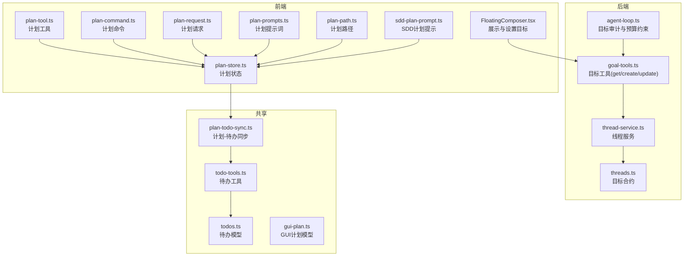
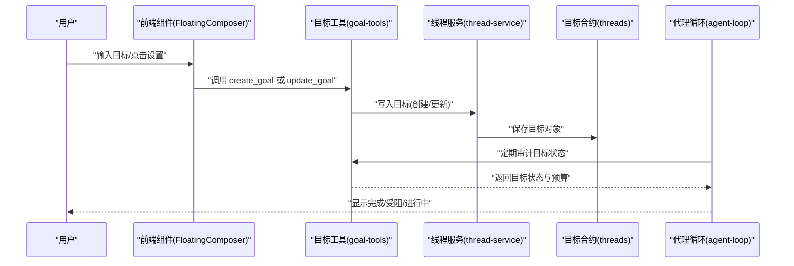
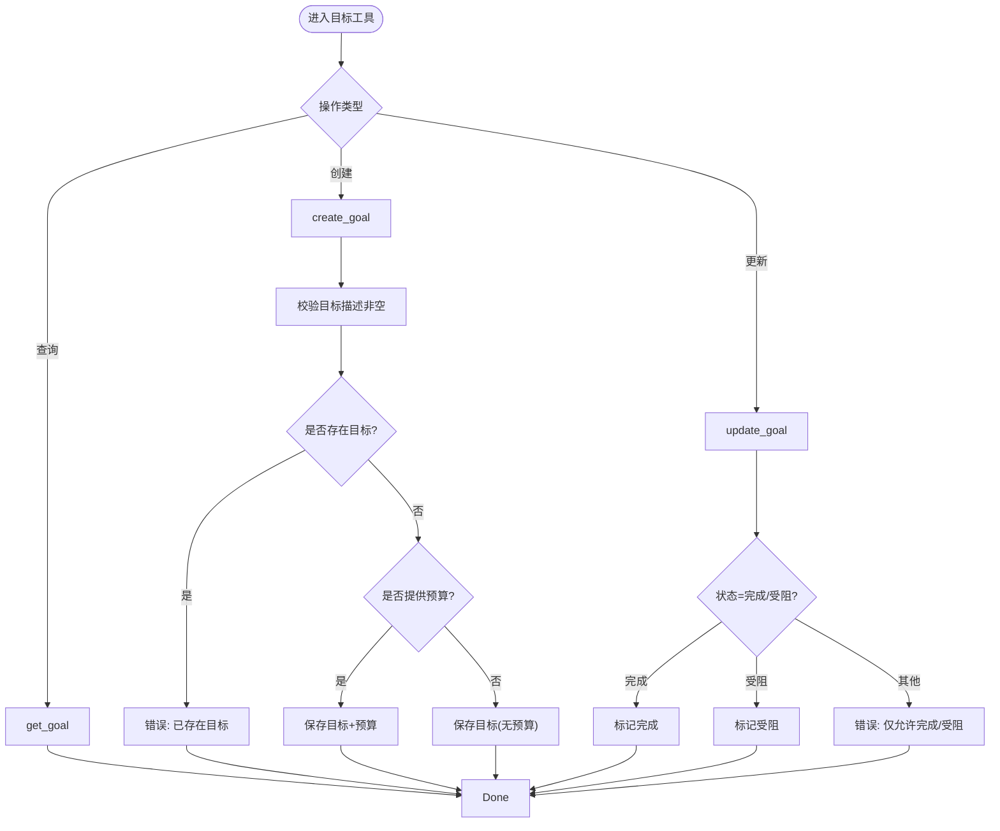
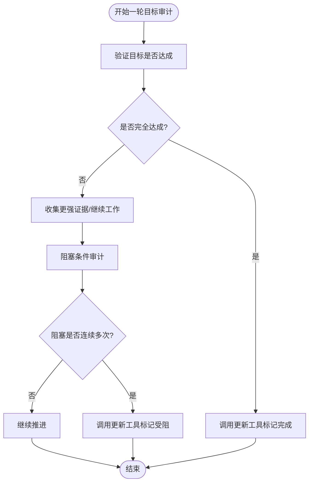
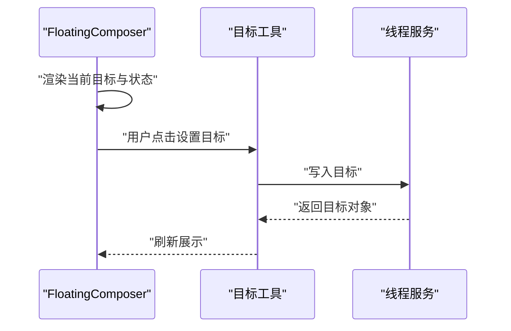
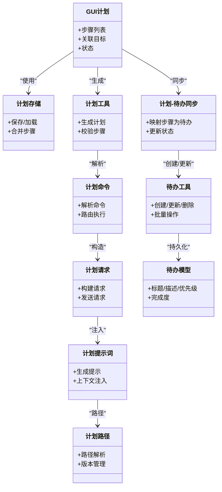
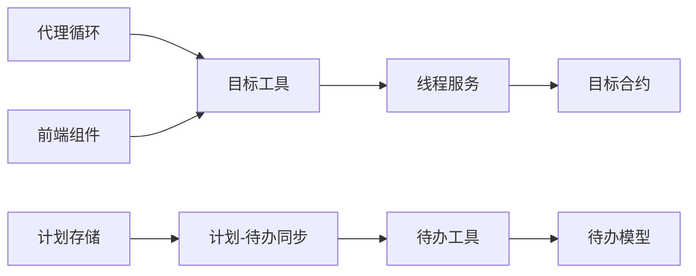

# 目标管理与跟踪

<cite>
**本文引用的文件**
- [goal-tools.ts](file://kun/src/adapters/tool/goal-tools.ts)
- [agent-loop.ts](file://kun/src/loop/agent-loop.ts)
- [FloatingComposer.tsx](file://src/renderer/src/components/chat/FloatingComposer.tsx)
- [thread-service.ts](file://kun/src/services/thread-service.ts)
- [threads.ts](file://kun/src/contracts/threads.ts)
- [plan-todo-sync.ts](file://src/renderer/src/plan/plan-todo-sync.ts)
- [todo-tools.ts](file://kun/src/adapters/tool/todo-tools.ts)
- [todos.ts](file://kun/src/shared/todos.ts)
- [gui-plan.ts](file://kun/src/shared/gui-plan.ts)
- [plan-store.ts](file://src/renderer/src/plan/plan-store.ts)
- [plan-tool.ts](file://src/renderer/src/plan/plan-tool.ts)
- [plan-command.ts](file://src/renderer/src/plan/plan-command.ts)
- [plan-request.ts](file://src/renderer/src/plan/plan-request.ts)
- [plan-prompts.ts](file://src/renderer/src/plan/plan-prompts.ts)
- [plan-path.ts](file://src/renderer/src/plan/plan-path.ts)
- [sdd-plan-prompt.ts](file://src/renderer/src/sdd/sdd-plan-prompt.ts)
</cite>

## 目录
1. [简介](#简介)
2. [项目结构](#项目结构)
3. [核心组件](#核心组件)
4. [架构总览](#架构总览)
5. [详细组件分析](#详细组件分析)
6. [依赖关系分析](#依赖关系分析)
7. [性能考量](#性能考量)
8. [故障排查指南](#故障排查指南)
9. [结论](#结论)
10. [附录](#附录)

## 简介
本指南面向目标管理系统使用者与维护者，围绕“目标设定、目标分解、进度跟踪、状态管理与完成度计算”展开，结合代码库中的目标工具链与前端交互组件，给出可操作的使用方法与最佳实践。系统支持：
- 单线程目标生命周期管理（创建、查询、更新）
- 目标状态：进行中、已完成、受阻
- 可选的令牌预算控制
- 与计划（Plan）与待办（Todo）的联动
- 前端可视化展示与快捷入口

## 项目结构
目标管理能力由后端工具定义与服务层、前端渲染组件以及计划/待办模块协同实现：
- 后端工具层：提供目标工具（查询、创建、更新），封装在本地工具宿主中
- 服务层：线程服务负责目标的持久化与读写
- 合约层：定义目标数据结构（目标对象、状态枚举等）
- 前端渲染层：聊天窗浮动输入组件展示当前目标与状态
- 计划与待办：通过计划工具与同步逻辑，将目标转化为可执行任务流

图表来源
- [goal-tools.ts](file://kun/src/adapters/tool/goal-tools.ts)
- [agent-loop.ts](file://kun/src/loop/agent-loop.ts)
- [FloatingComposer.tsx](file://src/renderer/src/components/chat/FloatingComposer.tsx)
- [thread-service.ts](file://kun/src/services/thread-service.ts)
- [threads.ts](file://kun/src/contracts/threads.ts)
- [plan-store.ts](file://src/renderer/src/plan/plan-store.ts)
- [plan-tool.ts](file://src/renderer/src/plan/plan-tool.ts)
- [plan-command.ts](file://src/renderer/src/plan/plan-command.ts)
- [plan-request.ts](file://src/renderer/src/plan/plan-request.ts)
- [plan-prompts.ts](file://src/renderer/src/plan/plan-prompts.ts)
- [plan-path.ts](file://src/renderer/src/plan/plan-path.ts)
- [sdd-plan-prompt.ts](file://src/renderer/src/sdd/sdd-plan-prompt.ts)
- [todos.ts](file://kun/src/shared/todos.ts)
- [todo-tools.ts](file://kun/src/adapters/tool/todo-tools.ts)
- [gui-plan.ts](file://kun/src/shared/gui-plan.ts)
- [plan-todo-sync.ts](file://src/renderer/src/plan/plan-todo-sync.ts)

章节来源
- [goal-tools.ts](file://kun/src/adapters/tool/goal-tools.ts)
- [agent-loop.ts](file://kun/src/loop/agent-loop.ts)
- [FloatingComposer.tsx](file://src/renderer/src/components/chat/FloatingComposer.tsx)
- [thread-service.ts](file://kun/src/services/thread-service.ts)
- [threads.ts](file://kun/src/contracts/threads.ts)
- [plan-store.ts](file://src/renderer/src/plan/plan-store.ts)
- [plan-tool.ts](file://src/renderer/src/plan/plan-tool.ts)
- [plan-command.ts](file://src/renderer/src/plan/plan-command.ts)
- [plan-request.ts](file://src/renderer/src/plan/plan-request.ts)
- [plan-prompts.ts](file://src/renderer/src/plan/plan-prompts.ts)
- [plan-path.ts](file://src/renderer/src/plan/plan-path.ts)
- [sdd-plan-prompt.ts](file://src/renderer/src/sdd/sdd-plan-prompt.ts)
- [todos.ts](file://kun/src/shared/todos.ts)
- [todo-tools.ts](file://kun/src/adapters/tool/todo-tools.ts)
- [gui-plan.ts](file://kun/src/shared/gui-plan.ts)
- [plan-todo-sync.ts](file://src/renderer/src/plan/plan-todo-sync.ts)

## 核心组件
- 目标工具集：提供查询、创建、更新目标的能力，确保仅在必要时变更状态，避免误判完成或受阻
- 线程服务：承载目标的读取与写入，是前后端交互的桥梁
- 前端目标面板：在聊天界面展示当前目标与状态，支持从输入快速设置目标
- 计划与待办：将目标拆解为可执行步骤，形成计划与待办项，支撑进度跟踪与完成度计算
- 目标合约：定义目标对象字段与状态枚举，保证跨模块一致性

章节来源
- [goal-tools.ts](file://kun/src/adapters/tool/goal-tools.ts)
- [thread-service.ts](file://kun/src/services/thread-service.ts)
- [threads.ts](file://kun/src/contracts/threads.ts)
- [FloatingComposer.tsx](file://src/renderer/src/components/chat/FloatingComposer.tsx)
- [plan-todo-sync.ts](file://src/renderer/src/plan/plan-todo-sync.ts)
- [todo-tools.ts](file://kun/src/adapters/tool/todo-tools.ts)
- [todos.ts](file://kun/src/shared/todos.ts)
- [gui-plan.ts](file://kun/src/shared/gui-plan.ts)

## 架构总览
目标管理的端到端流程如下：
- 用户在前端输入目标，触发目标创建或更新
- 后端工具解析参数，调用线程服务写入目标
- 代理循环对目标进行审计与预算约束，决定是否标记完成或受阻
- 计划与待办模块基于目标生成可执行步骤，持续跟踪进度
- 前端实时展示目标状态与进度

图表来源
- [goal-tools.ts](file://kun/src/adapters/tool/goal-tools.ts)
- [thread-service.ts](file://kun/src/services/thread-service.ts)
- [threads.ts](file://kun/src/contracts/threads.ts)
- [agent-loop.ts](file://kun/src/loop/agent-loop.ts)
- [FloatingComposer.tsx](file://src/renderer/src/components/chat/FloatingComposer.tsx)

## 详细组件分析

### 目标工具与状态管理
- 查询目标：用于获取当前线程的目标信息，包括状态、预算、使用量等
- 创建目标：要求明确的目标描述；若已存在目标则拒绝重复创建；可选设置令牌预算
- 更新目标：仅允许标记“已完成”或“受阻”，且需满足审计条件，避免误判

图表来源
- [goal-tools.ts](file://kun/src/adapters/tool/goal-tools.ts)

章节来源
- [goal-tools.ts](file://kun/src/adapters/tool/goal-tools.ts)

### 代理循环中的目标审计与预算约束
- 目标应贯穿多轮对话保持完整，不应因当前无法完成而缩小范围
- 完成判定需严格验证实际状态与显式需求，不接受弱证据
- 受阻判定需连续多次出现相同阻塞条件，且无外部变化时才标记

图表来源
- [agent-loop.ts](file://kun/src/loop/agent-loop.ts)

章节来源
- [agent-loop.ts](file://kun/src/loop/agent-loop.ts)

### 前端目标展示与设置入口
- 在聊天界面顶部展示当前目标与状态标签
- 支持从输入框一键设置当前目标，便于快速启动新目标

图表来源
- [FloatingComposer.tsx](file://src/renderer/src/components/chat/FloatingComposer.tsx)
- [goal-tools.ts](file://kun/src/adapters/tool/goal-tools.ts)
- [thread-service.ts](file://kun/src/services/thread-service.ts)

章节来源
- [FloatingComposer.tsx](file://src/renderer/src/components/chat/FloatingComposer.tsx)

### 计划与待办：目标分解与进度跟踪
- 计划模块提供计划存储、计划工具、命令、请求、提示词与路径管理
- 计划-待办同步模块将计划步骤映射为待办项，形成可追踪的任务清单
- 待办工具与待办模型支撑任务的增删改查与状态流转

图表来源
- [gui-plan.ts](file://kun/src/shared/gui-plan.ts)
- [plan-store.ts](file://src/renderer/src/plan/plan-store.ts)
- [plan-tool.ts](file://src/renderer/src/plan/plan-tool.ts)
- [plan-command.ts](file://src/renderer/src/plan/plan-command.ts)
- [plan-request.ts](file://src/renderer/src/plan/plan-request.ts)
- [plan-prompts.ts](file://src/renderer/src/plan/plan-prompts.ts)
- [plan-path.ts](file://src/renderer/src/plan/plan-path.ts)
- [plan-todo-sync.ts](file://src/renderer/src/plan/plan-todo-sync.ts)
- [todo-tools.ts](file://kun/src/adapters/tool/todo-tools.ts)
- [todos.ts](file://kun/src/shared/todos.ts)

章节来源
- [gui-plan.ts](file://kun/src/shared/gui-plan.ts)
- [plan-store.ts](file://src/renderer/src/plan/plan-store.ts)
- [plan-tool.ts](file://src/renderer/src/plan/plan-tool.ts)
- [plan-command.ts](file://src/renderer/src/plan/plan-command.ts)
- [plan-request.ts](file://src/renderer/src/plan/plan-request.ts)
- [plan-prompts.ts](file://src/renderer/src/plan/plan-prompts.ts)
- [plan-path.ts](file://src/renderer/src/plan/plan-path.ts)
- [plan-todo-sync.ts](file://src/renderer/src/plan/plan-todo-sync.ts)
- [todo-tools.ts](file://kun/src/adapters/tool/todo-tools.ts)
- [todos.ts](file://kun/src/shared/todos.ts)

## 依赖关系分析
- 目标工具依赖线程服务进行目标的读取与写入
- 代理循环依赖目标工具进行状态审计与预算检查
- 前端组件依赖目标工具与线程服务进行目标展示与设置
- 计划模块与待办模块通过计划-待办同步模块耦合，形成目标到任务的闭环
- 合约层统一目标数据结构，降低模块间耦合

图表来源
- [goal-tools.ts](file://kun/src/adapters/tool/goal-tools.ts)
- [thread-service.ts](file://kun/src/services/thread-service.ts)
- [threads.ts](file://kun/src/contracts/threads.ts)
- [agent-loop.ts](file://kun/src/loop/agent-loop.ts)
- [FloatingComposer.tsx](file://src/renderer/src/components/chat/FloatingComposer.tsx)
- [plan-store.ts](file://src/renderer/src/plan/plan-store.ts)
- [plan-todo-sync.ts](file://src/renderer/src/plan/plan-todo-sync.ts)
- [todo-tools.ts](file://kun/src/adapters/tool/todo-tools.ts)
- [todos.ts](file://kun/src/shared/todos.ts)

章节来源
- [goal-tools.ts](file://kun/src/adapters/tool/goal-tools.ts)
- [thread-service.ts](file://kun/src/services/thread-service.ts)
- [threads.ts](file://kun/src/contracts/threads.ts)
- [agent-loop.ts](file://kun/src/loop/agent-loop.ts)
- [FloatingComposer.tsx](file://src/renderer/src/components/chat/FloatingComposer.tsx)
- [plan-store.ts](file://src/renderer/src/plan/plan-store.ts)
- [plan-todo-sync.ts](file://src/renderer/src/plan/plan-todo-sync.ts)
- [todo-tools.ts](file://kun/src/adapters/tool/todo-tools.ts)
- [todos.ts](file://kun/src/shared/todos.ts)

## 性能考量
- 令牌预算控制：在目标创建时可设置预算，代理循环会据此限制每轮消耗，避免超支
- 状态审计与阻塞判断：避免频繁误判，减少无效重试与重复计算
- 计划-待办同步：批量处理与去重，降低数据库写入压力
- 前端渲染：按需刷新目标状态，避免全量重绘

## 故障排查指南
- 创建目标失败
  - 检查是否存在已有目标；若存在，请先完成或取消后再创建
  - 确认目标描述非空，预算为正整数
- 更新目标失败
  - 仅允许状态为“已完成”或“受阻”
  - 若目标不存在，先创建目标再更新
- 目标长时间未完成
  - 检查是否被标记为“受阻”，等待外部条件变化
  - 查看令牌预算是否耗尽
- 进度跟踪异常
  - 检查计划-待办同步是否正常执行
  - 确认待办工具的增删改查操作是否成功

章节来源
- [goal-tools.ts](file://kun/src/adapters/tool/goal-tools.ts)
- [agent-loop.ts](file://kun/src/loop/agent-loop.ts)
- [plan-todo-sync.ts](file://src/renderer/src/plan/plan-todo-sync.ts)
- [todo-tools.ts](file://kun/src/adapters/tool/todo-tools.ts)

## 结论
该目标管理系统以“目标工具 + 线程服务 + 代理审计 + 计划/待办同步 + 前端展示”为核心架构，实现了从目标设定到进度跟踪的闭环。通过严格的完成与受阻判定、可选的令牌预算控制以及计划-待办的自动化同步，系统既保证了目标的完整性，又提升了执行效率与可观测性。

## 附录

### 使用指南：目标设定与分解
- 设定目标
  - 在聊天界面输入目标描述，点击设置按钮创建目标
  - 如需限制成本，可在创建时设置令牌预算
- 分解目标
  - 基于目标生成计划，将大目标拆分为若干可执行步骤
  - 计划-待办同步自动将步骤映射为待办项
- 跟踪进度
  - 在前端查看目标状态与完成度
  - 通过待办项的状态变化了解子任务进展

章节来源
- [FloatingComposer.tsx](file://src/renderer/src/components/chat/FloatingComposer.tsx)
- [goal-tools.ts](file://kun/src/adapters/tool/goal-tools.ts)
- [plan-todo-sync.ts](file://src/renderer/src/plan/plan-todo-sync.ts)
- [todo-tools.ts](file://kun/src/adapters/tool/todo-tools.ts)

### 最佳实践与SMART原则
- 具体性（Specific）
  - 目标描述应清晰明确，避免模糊表述
- 可衡量（Measurable）
  - 通过完成度指标与待办项数量量化进度
- 可达成（Achievable）
  - 合理设置令牌预算与时间窗口，避免过度承诺
- 相关性（Relevant）
  - 目标与整体计划保持一致，避免偏离主线
- 时限性（Time-bound）
  - 为阶段性里程碑设置截止日期，配合代理审计及时反馈

### 不同类型目标的管理示例
- 长期目标
  - 将长期目标拆分为多个阶段计划，每个阶段设置独立的令牌预算与里程碑
- 短期目标
  - 简化计划步骤，聚焦高价值任务，快速验证与迭代
- 团队目标
  - 通过计划-待办同步将任务分派给不同成员，统一进度看板与完成度统计