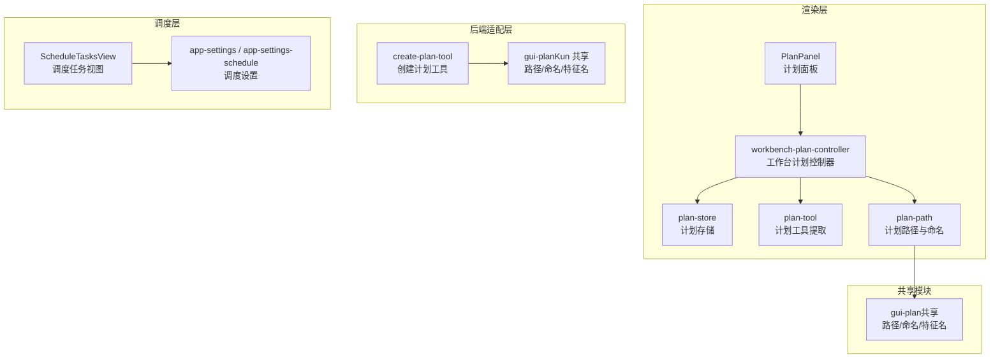
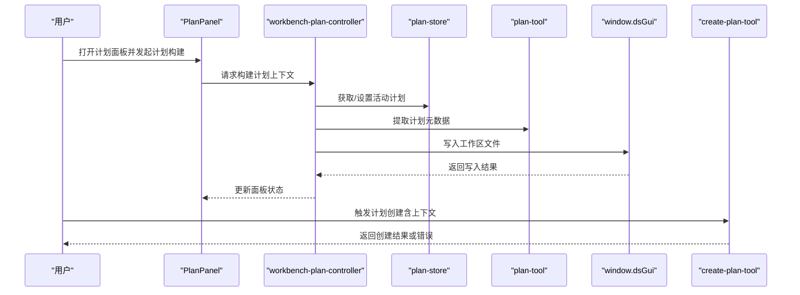
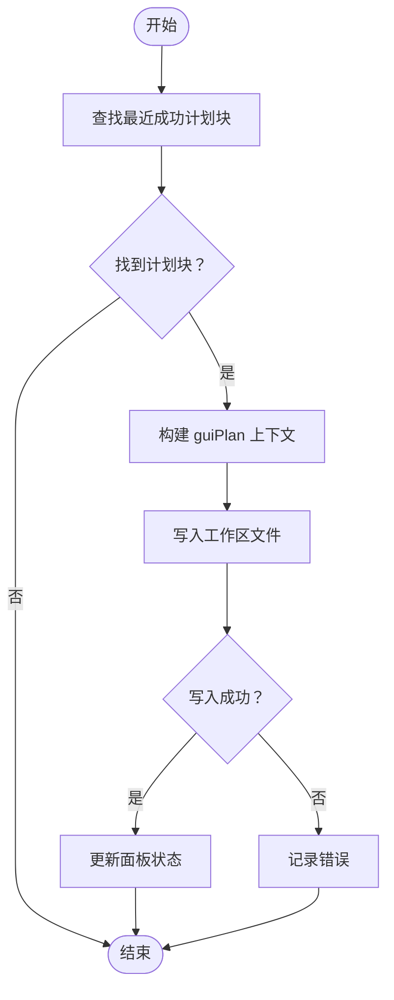
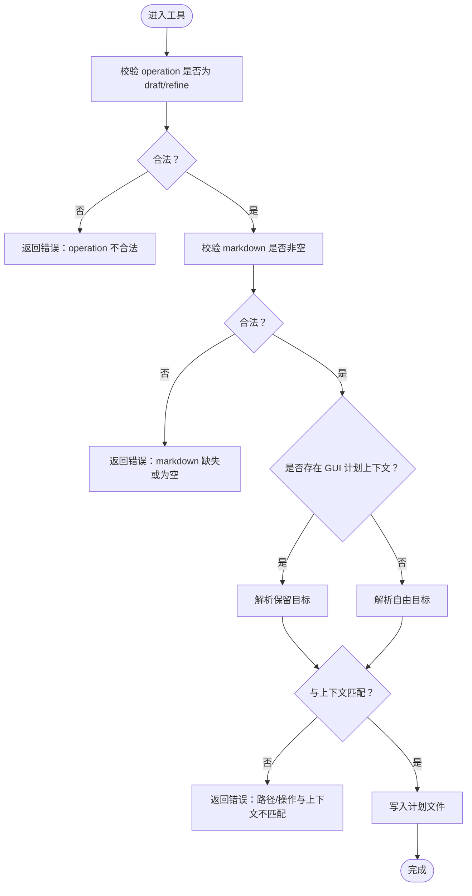
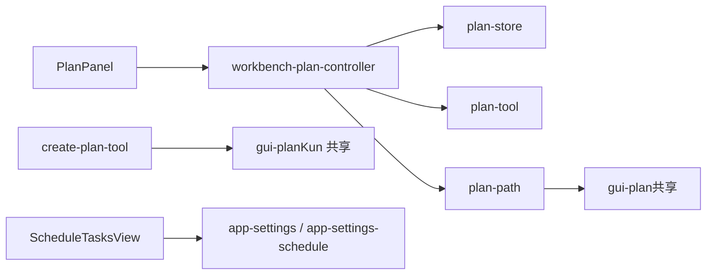

# 计划制定与管理

<cite>
**本文引用的文件**
- [PlanPanel.tsx](file://src/renderer/src/components/plan/PlanPanel.tsx)
- [workbench-plan-controller.ts](file://src/renderer/src/components/workbench-plan-controller.ts)
- [plan-store.ts](file://src/renderer/src/plan/plan-store.ts)
- [plan-tool.ts](file://src/renderer/src/plan/plan-tool.ts)
- [plan-path.ts](file://src/renderer/src/plan/plan-path.ts)
- [gui-plan.ts（共享）](file://src/shared/gui-plan.ts)
- [create-plan-tool.ts](file://kun/src/adapters/tool/create-plan-tool.ts)
- [gui-plan.ts（Kun 共享）](file://kun/src/shared/gui-plan.ts)
- [ScheduleTasksView.tsx](file://src/renderer/src/components/schedule/ScheduleTasksView.tsx)
- [app-settings.ts](file://src/shared/app-settings.ts)
- [app-settings-schedule.ts](file://src/shared/app-settings-schedule.ts)
</cite>

## 目录
1. [简介](#简介)
2. [项目结构](#项目结构)
3. [核心组件](#核心组件)
4. [架构总览](#架构总览)
5. [详细组件分析](#详细组件分析)
6. [依赖关系分析](#依赖关系分析)
7. [性能考虑](#性能考虑)
8. [故障排查指南](#故障排查指南)
9. [结论](#结论)
10. [附录：使用场景与最佳实践](#附录使用场景与最佳实践)

## 简介
本指南面向“计划制定与管理系统”的使用者与维护者，系统性介绍计划创建流程、计划模板与上下文使用、执行与监控、配置方法、状态与进度管理、最佳实践、常见问题与性能优化建议，并提供项目开发、学习与工作安排等多场景配置示例。

## 项目结构
该系统围绕“计划”在渲染层与后端适配层协同工作：
- 渲染层负责用户界面、计划面板、计划构建控制、计划存储与写盘、计划路径与命名策略、以及与调度视图的联动。
- 后端适配层负责计划工具的输入校验、目标解析（保留路径/自由形式）、与 GUI 计划上下文的匹配与约束。
- 共享模块提供跨层一致的计划相对路径、显示名、特征名等约定。

图表来源
- [PlanPanel.tsx](file://src/renderer/src/components/plan/PlanPanel.tsx)
- [workbench-plan-controller.ts](file://src/renderer/src/components/workbench-plan-controller.ts)
- [plan-store.ts](file://src/renderer/src/plan/plan-store.ts)
- [plan-tool.ts](file://src/renderer/src/plan/plan-tool.ts)
- [plan-path.ts](file://src/renderer/src/plan/plan-path.ts)
- [gui-plan.ts（共享）](file://src/shared/gui-plan.ts)
- [create-plan-tool.ts](file://kun/src/adapters/tool/create-plan-tool.ts)
- [gui-plan.ts（Kun 共享）](file://kun/src/shared/gui-plan.ts)
- [ScheduleTasksView.tsx](file://src/renderer/src/components/schedule/ScheduleTasksView.tsx)
- [app-settings.ts](file://src/shared/app-settings.ts)
- [app-settings-schedule.ts](file://src/shared/app-settings-schedule.ts)

章节来源
- [PlanPanel.tsx](file://src/renderer/src/components/plan/PlanPanel.tsx)
- [workbench-plan-controller.ts](file://src/renderer/src/components/workbench-plan-controller.ts)
- [plan-store.ts](file://src/renderer/src/plan/plan-store.ts)
- [plan-tool.ts](file://src/renderer/src/plan/plan-tool.ts)
- [plan-path.ts](file://src/renderer/src/plan/plan-path.ts)
- [gui-plan.ts（共享）](file://src/shared/gui-plan.ts)
- [create-plan-tool.ts](file://kun/src/adapters/tool/create-plan-tool.ts)
- [gui-plan.ts（Kun 共享）](file://kun/src/shared/gui-plan.ts)
- [ScheduleTasksView.tsx](file://src/renderer/src/components/schedule/ScheduleTasksView.tsx)
- [app-settings.ts](file://src/shared/app-settings.ts)
- [app-settings-schedule.ts](file://src/shared/app-settings-schedule.ts)

## 核心组件
- 计划面板与工作台控制器：负责打开计划面板、构建发送消息时的计划上下文、保存内容到工作区文件。
- 计划存储：维护当前活动计划的状态与持久化。
- 计划工具：从对话块中提取计划元数据，驱动后续流程。
- 计划路径与命名：统一相对路径、显示名、特征名生成规则。
- 创建计划工具：在后端校验输入、解析目标、与 GUI 计划上下文匹配。
- 调度视图与设置：提供任务创建、编辑、运行、预览结果、保持唤醒等能力。

章节来源
- [PlanPanel.tsx](file://src/renderer/src/components/plan/PlanPanel.tsx)
- [workbench-plan-controller.ts](file://src/renderer/src/components/workbench-plan-controller.ts)
- [plan-store.ts](file://src/renderer/src/plan/plan-store.ts)
- [plan-tool.ts](file://src/renderer/src/plan/plan-tool.ts)
- [plan-path.ts](file://src/renderer/src/plan/plan-path.ts)
- [create-plan-tool.ts](file://kun/src/adapters/tool/create-plan-tool.ts)
- [ScheduleTasksView.tsx](file://src/renderer/src/components/schedule/ScheduleTasksView.tsx)

## 架构总览
系统采用“渲染层-共享层-后端适配层-调度层”的分层协作模式：
- 渲染层通过工作台控制器与计划存储交互，调用窗口桥接接口写入工作区文件。
- 共享模块提供路径与命名的一致性保障。
- 后端适配层通过工具输入模式与上下文约束，确保计划创建的安全与一致性。
- 调度层提供任务编排与运行能力，支持与计划内容联动。

图表来源
- [PlanPanel.tsx](file://src/renderer/src/components/plan/PlanPanel.tsx)
- [workbench-plan-controller.ts](file://src/renderer/src/components/workbench-plan-controller.ts)
- [plan-store.ts](file://src/renderer/src/plan/plan-store.ts)
- [plan-tool.ts](file://src/renderer/src/plan/plan-tool.ts)
- [create-plan-tool.ts](file://kun/src/adapters/tool/create-plan-tool.ts)

## 详细组件分析

### 计划面板与工作台控制器
- 功能要点
  - 打开右侧计划面板，切换到计划模式。
  - 基于最新成功的计划工具块，构建发送消息时的计划上下文（包含操作类型、工作区根、相对路径、计划 ID、来源请求、标题等）。
  - 将计划内容写入工作区文件，处理保存状态与错误。
  - 解析工作区根路径，规范化斜杠与尾随斜杠。
- 关键流程
  - 从聊天块中提取计划元数据，定位最近一次成功的计划块。
  - 生成 guiPlan 上下文，作为消息发送的覆盖参数。
  - 调用窗口桥接接口写入文件，更新面板状态。

图表来源
- [workbench-plan-controller.ts](file://src/renderer/src/components/workbench-plan-controller.ts)
- [plan-tool.ts](file://src/renderer/src/plan/plan-tool.ts)

章节来源
- [PlanPanel.tsx](file://src/renderer/src/components/plan/PlanPanel.tsx)
- [workbench-plan-controller.ts](file://src/renderer/src/components/workbench-plan-controller.ts)

### 计划存储与写盘
- 功能要点
  - 维护活动计划的保存状态（如 saving）。
  - 通过窗口桥接接口将计划内容写入指定工作区路径。
  - 失败时返回错误信息，供上层展示与重试。
- 使用技巧
  - 在保存前设置保存状态，避免重复触发。
  - 对写入结果进行判错，必要时回滚或提示用户。

章节来源
- [plan-store.ts](file://src/renderer/src/plan/plan-store.ts)
- [workbench-plan-controller.ts](file://src/renderer/src/components/workbench-plan-controller.ts)

### 计划路径与命名策略
- 功能要点
  - 统一相对路径前缀与目录结构。
  - 自动生成下一个可用的相对路径，避免冲突。
  - 从相对路径推导显示名与特征名。
- 使用技巧
  - 以“请求摘要”生成特征名，便于归类。
  - 避免在路径中使用非法字符，确保跨平台兼容。

章节来源
- [plan-path.ts](file://src/renderer/src/plan/plan-path.ts)
- [gui-plan.ts（共享）](file://src/shared/gui-plan.ts)
- [gui-plan.ts（Kun 共享）](file://kun/src/shared/gui-plan.ts)

### 创建计划工具（后端）
- 功能要点
  - 输入模式：draft（新建）与 refine（修订），必须二选一且非空。
  - 输入校验：markdown 必填且非空；可选字段包括标题、来源请求、保留的 plan_id 与 plan_relative_path。
  - 目标解析：若存在 GUI 计划上下文，则按保留目标写入；否则按自由形式解析目标。
  - 上下文匹配：当提供保留路径或操作类型时，需与 GUI 计划上下文一致，否则拒绝。
- 错误处理
  - 操作类型不合法、markdown 缺失或为空、路径与上下文不匹配等情况均返回错误。

图表来源
- [create-plan-tool.ts](file://kun/src/adapters/tool/create-plan-tool.ts)

章节来源
- [create-plan-tool.ts](file://kun/src/adapters/tool/create-plan-tool.ts)

### 调度视图与设置
- 功能要点
  - 支持创建/编辑/删除调度任务，设置默认工作区根、模型、保持唤醒等。
  - 运行单个任务并刷新状态，展开/收起结果预览。
  - 通过窗口桥接接口读取调度状态与执行任务。
- 使用技巧
  - 在创建任务时优先指定工作区根，避免默认值导致路径偏差。
  - 使用“保持唤醒”避免系统休眠影响长时间任务。

章节来源
- [ScheduleTasksView.tsx](file://src/renderer/src/components/schedule/ScheduleTasksView.tsx)
- [app-settings.ts](file://src/shared/app-settings.ts)
- [app-settings-schedule.ts](file://src/shared/app-settings-schedule.ts)

## 依赖关系分析
- 渲染层依赖共享模块提供的路径与命名规范，保证前后端一致。
- 工作台控制器依赖计划存储与工具提取，形成“读取-构建-写盘”的闭环。
- 创建计划工具依赖 GUI 计划上下文，确保安全与一致性。
- 调度视图依赖应用设置模块，统一调度行为。

图表来源
- [PlanPanel.tsx](file://src/renderer/src/components/plan/PlanPanel.tsx)
- [workbench-plan-controller.ts](file://src/renderer/src/components/workbench-plan-controller.ts)
- [plan-store.ts](file://src/renderer/src/plan/plan-store.ts)
- [plan-tool.ts](file://src/renderer/src/plan/plan-tool.ts)
- [plan-path.ts](file://src/renderer/src/plan/plan-path.ts)
- [gui-plan.ts（共享）](file://src/shared/gui-plan.ts)
- [create-plan-tool.ts](file://kun/src/adapters/tool/create-plan-tool.ts)
- [gui-plan.ts（Kun 共享）](file://kun/src/shared/gui-plan.ts)
- [ScheduleTasksView.tsx](file://src/renderer/src/components/schedule/ScheduleTasksView.tsx)
- [app-settings.ts](file://src/shared/app-settings.ts)
- [app-settings-schedule.ts](file://src/shared/app-settings-schedule.ts)

## 性能考虑
- 减少不必要的写盘：在保存前检查内容是否变化，避免重复写入。
- 控制并发：保存状态机仅允许单次保存进行中，防止竞态。
- 路径解析与规范化：提前规范化工作区根路径，减少后续处理成本。
- 调度任务批量化：对相似任务合并执行，降低系统开销。
- 缓存与预热：对常用计划模板与路径进行缓存，提升响应速度。

## 故障排查指南
- 无法保存计划
  - 检查保存状态是否被占用，确认写盘接口返回值。
  - 核对工作区根与相对路径是否有效。
- 计划创建失败
  - 确认 operation 为 draft 或 refine，markdown 非空。
  - 若使用保留路径，请确保与 GUI 计划上下文一致。
- 调度任务无法运行
  - 检查默认工作区根与任务工作区根是否正确。
  - 确认调度状态接口可用，查看错误信息并重试。
- 显示名/特征名异常
  - 检查相对路径是否符合约定，显示名由文件名推导。

章节来源
- [workbench-plan-controller.ts](file://src/renderer/src/components/workbench-plan-controller.ts)
- [create-plan-tool.ts](file://kun/src/adapters/tool/create-plan-tool.ts)
- [ScheduleTasksView.tsx](file://src/renderer/src/components/schedule/ScheduleTasksView.tsx)

## 结论
本系统通过清晰的分层设计与共享约定，实现了从“计划创建—上下文构建—写盘落地—调度执行—结果监控”的完整闭环。遵循本文的配置方法、状态管理与最佳实践，可在多种场景下高效制定与管理计划。

## 附录：使用场景与最佳实践

### 场景一：项目开发计划
- 配置要点
  - 使用“请求摘要”生成特征名，便于按功能模块归档。
  - 在工作台控制器中设置合适的默认工作区根，确保路径稳定。
  - 通过计划面板打开计划，逐步细化任务与里程碑。
- 最佳实践
  - 将大任务拆分为可执行的小步骤，定期更新进度。
  - 使用调度视图安排高频任务，保持持续产出。

### 场景二：学习计划
- 配置要点
  - 以“学习主题”为特征名，建立独立的计划文件。
  - 在计划中加入阶段性测试与回顾节点。
- 最佳实践
  - 利用计划模板快速生成初稿，再根据进度迭代完善。
  - 通过调度视图安排每日/每周学习任务，保持节奏。

### 场景三：工作安排
- 配置要点
  - 以“日期/会议/任务类型”为特征名，便于检索。
  - 设置“保持唤醒”，确保重要任务在夜间也能执行。
- 最佳实践
  - 将紧急任务与常规任务分离，合理分配资源。
  - 定期复盘任务完成情况，优化计划与执行策略。