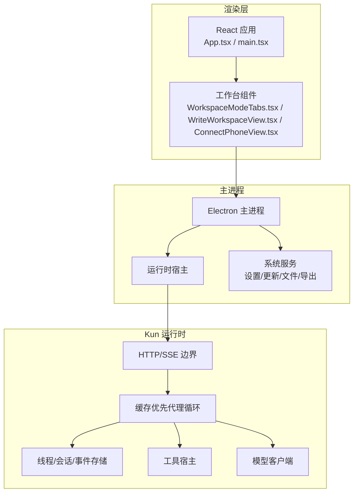
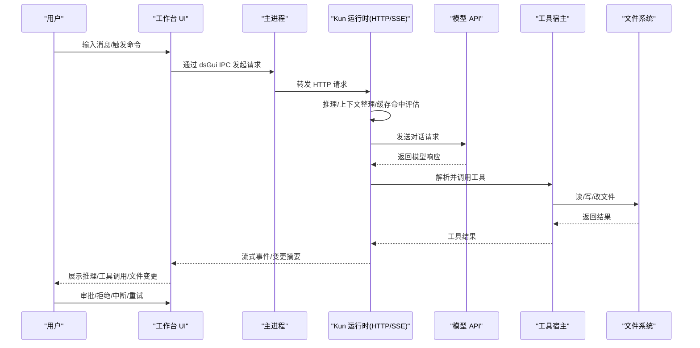
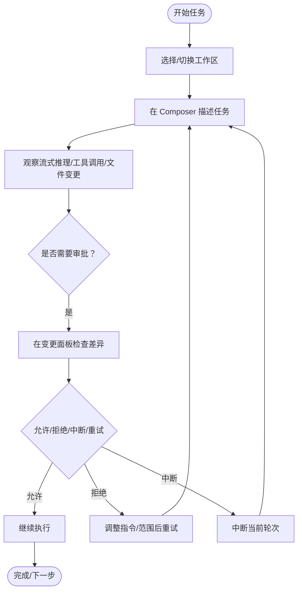
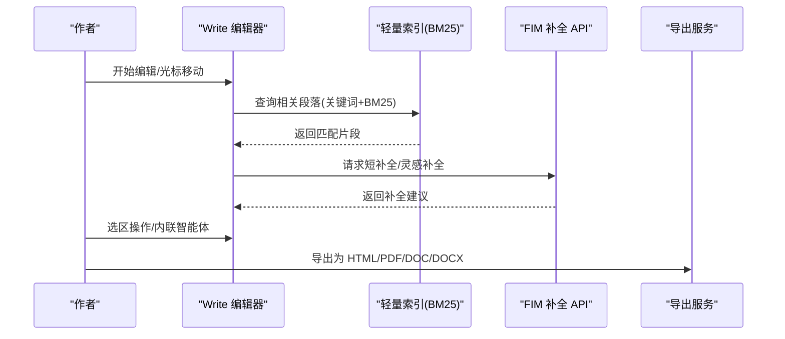
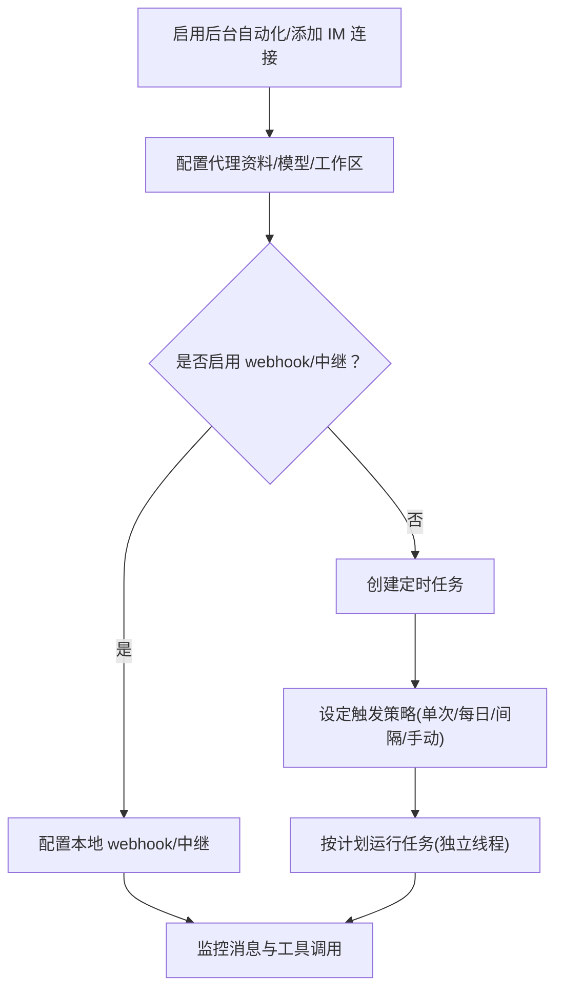
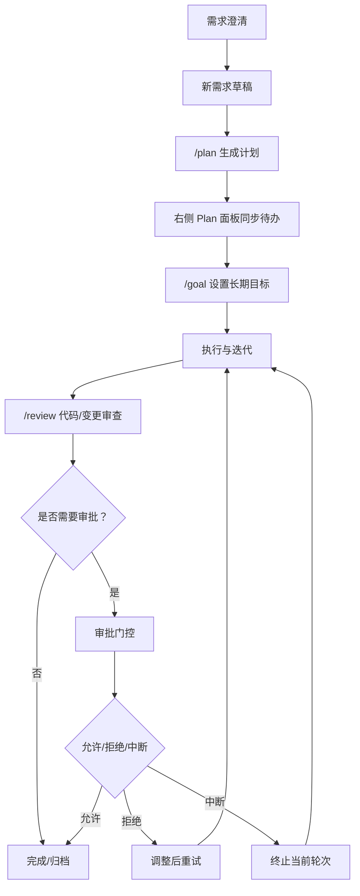
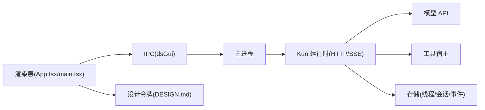

# 用户指南

<cite>
**本文引用的文件**
- [README.en.md](file://README.en.md)
- [DESIGN.md](file://DESIGN.md)
- [App.tsx](file://src/renderer/src/App.tsx)
- [main.tsx](file://src/renderer/src/main.tsx)
- [WorkspaceModeTabs.tsx](file://src/renderer/src/components/chat/WorkspaceModeTabs.tsx)
- [ConnectPhoneView.tsx](file://src/renderer/src/components/chat/ConnectPhoneView.tsx)
- [WriteWorkspaceView.tsx](file://src/renderer/src/components/write/WriteWorkspaceView.tsx)
- [plan-command.ts](file://src/renderer/src/plan/plan-command.ts)
- [kun-architecture.md](file://docs/kun-architecture.md)
- [kun-cache-optimization.md](file://docs/kun-cache-optimization.md)
- [WRITE_INLINE_COMPLETION_MODES.zh-CN.md](file://docs/WRITE_INLINE_COMPLETION_MODES.zh-CN.md)
- [WRITE_INLINE_EDIT_RAG.en.md](file://docs/WRITE_INLINE_EDIT_RAG.en.md)
- [WRITE_RETRIEVAL_RAG.en.md](file://docs/WRITE_RETRIEVAL_RAG.en.md)
</cite>

## 目录
1. [简介](#简介)
2. [项目结构](#项目结构)
3. [核心组件](#核心组件)
4. [架构总览](#架构总览)
5. [详细组件分析](#详细组件分析)
6. [依赖关系分析](#依赖关系分析)
7. [性能与体验建议](#性能与体验建议)
8. [故障排查指南](#故障排查指南)
9. [结论](#结论)
10. [附录](#附录)

## 简介
DeepSeek GUI 是一个本地桌面工作台，围绕 Kun 本地智能体运行时构建，提供三大工作台：Code（项目工作、文件变更、代码审查）、Write（Markdown 编辑、文档写作、导出）、Connect Phone（IM 自动化、定时任务）。它通过统一的 Kun 运行时与 HTTP/SSE 边界，将长会话、多工具、持续项目协作带入桌面环境，强调“本地优先、可观测、可控制”的使用体验。

- 快速入口与模式切换：在顶部栏或侧边栏选择 Code/Write/Connect Phone，进入对应工作台。
- 统一运行时：所有工作台共享同一 Kun 运行时与设置，但保持会话、工作空间与布局分离。
- 可视化可观测：每个推理步骤、工具调用、文件变更均在界面中呈现；支持中断、重发、审批与回滚。
- 权限与安全：可配置只读、工作区写入、全权限或外部沙箱模式，并对敏感动作进行审批。

章节来源
- [README.en.md: 16-101:16-101](file://README.en.md#L16-L101)
- [README.en.md: 186-234:186-234](file://README.en.md#L186-L234)
- [DESIGN.md: 366-376:366-376](file://DESIGN.md#L366-L376)

## 项目结构
应用采用 Electron + React 渲染层 + Kun 本地运行时的分层架构。渲染层负责 UI 呈现与交互，主进程负责运行时生命周期与系统服务（设置、更新、文件系统、导出等），Kun 作为单一运行时边界，承载代理循环、工具宿主、存储与模型客户端。

图表来源
- [DESIGN.md: 661-705:661-705](file://DESIGN.md#L661-L705)
- [DESIGN.md: 708-734:708-734](file://DESIGN.md#L708-L734)

章节来源
- [DESIGN.md: 661-705:661-705](file://DESIGN.md#L661-L705)
- [DESIGN.md: 708-734:708-734](file://DESIGN.md#L708-L734)

## 核心组件
- 工作台入口与导航
  - WorkspaceModeTabs：提供 Code/Write/Connect Phone 三模式切换与顶部栏控制。
  - ConnectPhoneView：连接手机工作台的入口与 IM 自动化视图。
  - WriteWorkspaceView：Write 模式的文档树、编辑器与预览视图。
- 计划与目标
  - plan-command：计划创建与同步工具，支持将计划文件与线程待办联动。
- 设计与主题
  - App.tsx/main.tsx：应用壳与懒加载启动屏，加载样式与国际化。
  - DESIGN.md：全局设计令牌与视觉系统，确保一致性与可扩展性。

章节来源
- [WorkspaceModeTabs.tsx](file://src/renderer/src/components/chat/WorkspaceModeTabs.tsx)
- [ConnectPhoneView.tsx](file://src/renderer/src/components/chat/ConnectPhoneView.tsx)
- [WriteWorkspaceView.tsx](file://src/renderer/src/components/write/WriteWorkspaceView.tsx)
- [plan-command.ts](file://src/renderer/src/plan/plan-command.ts)
- [App.tsx: 1-23:1-23](file://src/renderer/src/App.tsx#L1-L23)
- [main.tsx: 1-18:1-18](file://src/renderer/src/main.tsx#L1-L18)
- [DESIGN.md: 129-171:129-171](file://DESIGN.md#L129-L171)

## 架构总览
下图展示从用户输入到模型响应、再到工具执行与文件变更的端到端流程，以及审批与回滚的关键节点。

图表来源
- [DESIGN.md: 661-705:661-705](file://DESIGN.md#L661-L705)
- [kun-architecture.md](file://docs/kun-architecture.md)

章节来源
- [DESIGN.md: 661-705:661-705](file://DESIGN.md#L661-L705)

## 详细组件分析

### Code 模式（项目工作）
- 功能概览
  - 绑定本地项目目录，组织多会话，实时展示推理、工具调用与文件变更。
  - 支持新需求草稿、/plan、右侧 Plan 面板、线程待办、/goal 等，推动复杂工作从“澄清—规划—执行”闭环。
  - 提供 /review、/btw、线程压缩、分叉、归档与恢复，支撑长期项目对话。
  - 快速开始卡片覆盖项目映射、缺陷修复、实现规划、UI 优化等常见任务。
- 使用要点
  - 在侧边栏选择工作区，描述任务后观察流式输出与变更预览。
  - 对需要审批的动作进行确认或拒绝，必要时中断并重试。
  - 利用 Plan 面板与线程待办追踪执行进度。

图表来源
- [README.en.md: 194-207:194-207](file://README.en.md#L194-L207)

章节来源
- [README.en.md: 194-207:194-207](file://README.en.md#L194-L207)

### Write 模式（Markdown 写作与导出）
- 功能概览
  - 管理 ~/.deepseekgui/write_workspace 或自定义写作空间，支持文件树浏览。
  - 编辑器支持 Live/Source/Split/Preview 四种视图，Live 模式下活动行保持源码编辑，其余行渲染为 Markdown。
  - 支持导出当前文档为 HTML/PDF/DOC/DOCX，尽力保留标题、列表、代码块、表格与本地图片。
  - 提供 DeepSeek FIM 短补全与灵感补全、基于选区的内联智能体、右侧写作助手（摘要、提纲、润色）。
- 写作辅助与检索
  - 文本补全直接调用 DeepSeek FIM Completion API，低延迟“幽灵文本”提示。
  - 启动前构建短 TTL 轻量索引，跨文档 BM25 + 关键词检索，注入隐藏 Markdown 注释以保持术语、事实与风格一致。
- 快捷与视图
  - Live 视图：活动行可编辑，其他行渲染为 Markdown。
  - Split 视图：左右分屏，编辑与预览并行。
  - Source/Preview：纯源码或纯预览。

图表来源
- [README.en.md: 208-220:208-220](file://README.en.md#L208-L220)
- [WRITE_INLINE_COMPLETION_MODES.zh-CN.md](file://docs/WRITE_INLINE_COMPLETION_MODES.zh-CN.md)
- [WRITE_INLINE_EDIT_RAG.en.md](file://docs/WRITE_INLINE_EDIT_RAG.en.md)
- [WRITE_RETRIEVAL_RAG.en.md](file://docs/WRITE_RETRIEVAL_RAG.en.md)

章节来源
- [README.en.md: 208-220:208-220](file://README.en.md#L208-L220)
- [WRITE_INLINE_COMPLETION_MODES.zh-CN.md](file://docs/WRITE_INLINE_COMPLETION_MODES.zh-CN.md)
- [WRITE_INLINE_EDIT_RAG.en.md](file://docs/WRITE_INLINE_EDIT_RAG.en.md)
- [WRITE_RETRIEVAL_RAG.en.md](file://docs/WRITE_RETRIEVAL_RAG.en.md)

### Connect Phone 模式（IM 自动化与定时任务）
- 功能概览
  - 为飞书/企业微信/钉钉等渠道配置专用代理，每个渠道拥有独立线程，便于调试回复与工具调用。
  - 支持本地 webhook/中继，适配团队工作流与个人自动化。
  - 可创建一次性、每日、间隔或手动触发的定时任务，每项任务创建独立 Kun 线程并发送预设提示。
- 使用路径
  - 在设置中启用后台自动化，添加 IM 连接 → 配置代理资料、默认模型与工作区 → 可选开启 webhook/中继或定时任务。

图表来源
- [README.en.md: 221-233:221-233](file://README.en.md#L221-L233)

章节来源
- [README.en.md: 221-233:221-233](file://README.en.md#L221-L233)

### 智能体功能：计划、目标、任务与审批
- 计划与目标
  - /plan：生成可编辑计划文件，Plan 面板与线程待办联动，便于执行追踪。
  - /goal：为当前线程设置长期目标，支持暂停、恢复、清除、完成状态。
- 任务与待办
  - 右侧 Plan 面板同步线程待办，形成“计划—执行—核验”的闭环。
- 审批机制
  - 对敏感动作（如文件写入、命令执行）进行审批，用户可在界面确认或拒绝，必要时中断与重试。

图表来源
- [README.en.md: 84-89:84-89](file://README.en.md#L84-L89)
- [README.en.md: 188-193:188-193](file://README.en.md#L188-L193)

章节来源
- [README.en.md: 84-89:84-89](file://README.en.md#L84-L89)
- [README.en.md: 188-193:188-193](file://README.en.md#L188-L193)
- [plan-command.ts](file://src/renderer/src/plan/plan-command.ts)

## 依赖关系分析
- 渲染层与主进程
  - 渲染层通过 dsGui IPC 与主进程通信，主进程负责运行时生命周期与系统服务。
- 运行时边界
  - 所有工作台共享 Kun 的 HTTP/SSE 边界，避免重复实现代理逻辑。
- 设计一致性
  - 全局设计令牌（颜色、字体、间距、圆角、阴影、动效）由 DESIGN.md 统一约束，确保各工作台风格一致。

图表来源
- [DESIGN.md: 661-705:661-705](file://DESIGN.md#L661-L705)
- [DESIGN.md: 129-171:129-171](file://DESIGN.md#L129-L171)

章节来源
- [DESIGN.md: 661-705:661-705](file://DESIGN.md#L661-L705)
- [DESIGN.md: 129-171:129-171](file://DESIGN.md#L129-L171)

## 性能与体验建议
- 高 ROI 的上下文管理
  - Kun 通过缓存优先的代理循环、工具上下文按需加载、上下文卫生与工具输出压缩，提升 token ROI。
- 缓存与复用
  - 稳定的系统提示、工具模式与不可变前缀提高缓存命中率；长会话中建议保持稳定的工作区与工具集。
- 写作补全与检索
  - Write 模式在补全前构建短 TTL 索引，结合 BM25 + 关键词检索，减少重复信息输入，提升一致性。
- 视图与编辑节奏
  - Live/Split 视图适合快速写作与即时预览；Source/Preview 适合校对与导出前审阅。

章节来源
- [README.en.md: 54-66:54-66](file://README.en.md#L54-L66)
- [kun-cache-optimization.md](file://docs/kun-cache-optimization.md)
- [WRITE_INLINE_COMPLETION_MODES.zh-CN.md](file://docs/WRITE_INLINE_COMPLETION_MODES.zh-CN.md)

## 故障排查指南
- 首次运行与设置
  - 首次启动需设置语言、DeepSeek API Key，必要时配置兼容 Base URL。
- 运行时健康
  - 在设置中查看运行时能力与诊断状态；若功能未启用，检查配置与模型能力。
- 审批与权限
  - 对需要审批的动作进行确认；若误操作，可中断并重试。
- 日志与数据清理
  - GUI 更新与本地错误日志可在设置中查看；卸载时可清理本地数据路径，注意保留需要的会话、MCP 或技能设置。

章节来源
- [README.en.md: 275-295:275-295](file://README.en.md#L275-L295)
- [README.en.md: 353-364:353-364](file://README.en.md#L353-L364)

## 结论
DeepSeek GUI 将 Kun 的高 ROI 代理能力带入桌面，以 Code/Write/Connect Phone 三大工作台满足开发者、内容创作者与自动化用户的多样化需求。通过统一运行时、可观测的推理与工具调用、可视化的变更审查与审批机制，用户可以在真实项目中持续高效地推进任务，同时保持对敏感操作的可控与可追溯。

## 附录

### 快捷键与常用操作
- 发送消息：Enter 或 Ctrl+Enter
- 在 Composer 中换行：Shift+Enter
- 关闭面板或弹层：Esc

章节来源
- [README.en.md: 308-316:308-316](file://README.en.md#L308-L316)

### 不同角色使用场景与操作指引
- 开发者
  - 使用 Code 模式绑定项目目录，通过 /plan 与 Plan 面板管理任务，利用 /review 进行变更审查，必要时进行审批与回滚。
- 内容创作者
  - 使用 Write 模式管理写作空间，Live/Split 视图提升写作效率；借助内联智能体与写作助手进行摘要、提纲与润色；导出为多种格式用于发布。
- 自动化用户
  - 使用 Connect Phone 模式配置 IM 渠道代理与定时任务，结合 webhook/中继实现团队工作流自动化。

章节来源
- [README.en.md: 177-183:177-183](file://README.en.md#L177-L183)
- [README.en.md: 221-233:221-233](file://README.en.md#L221-L233)
- [README.en.md: 208-220:208-220](file://README.en.md#L208-L220)