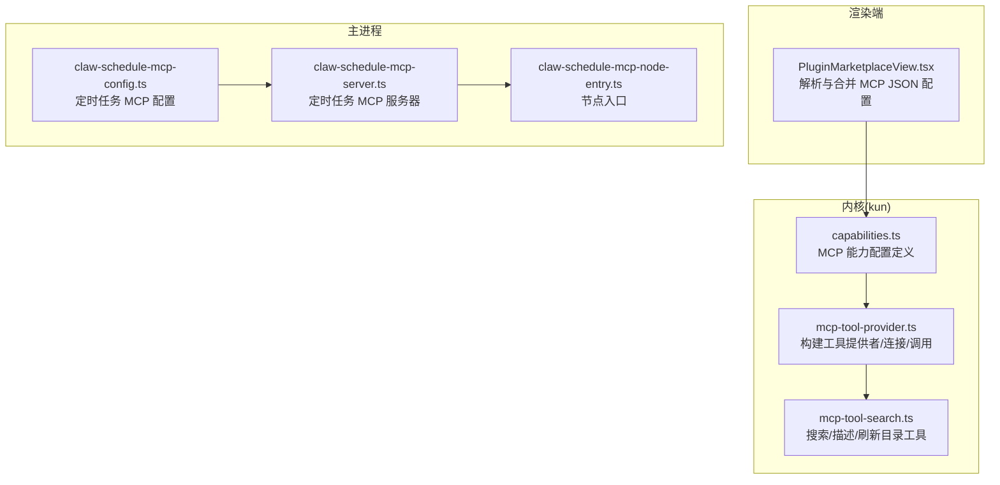
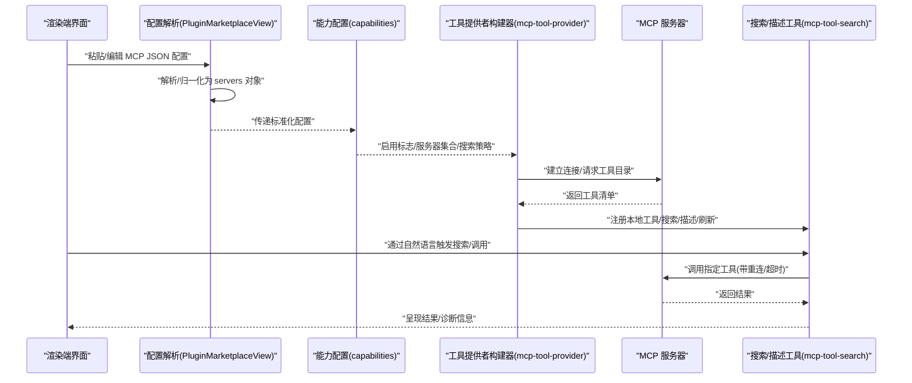
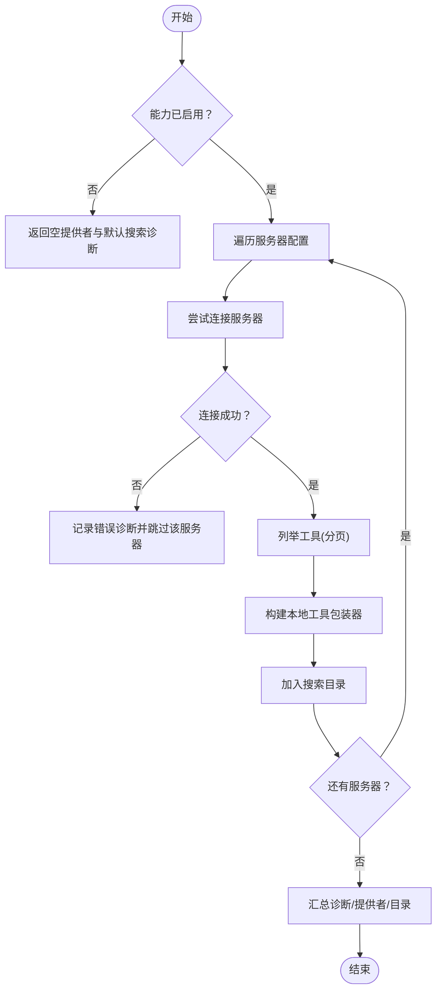
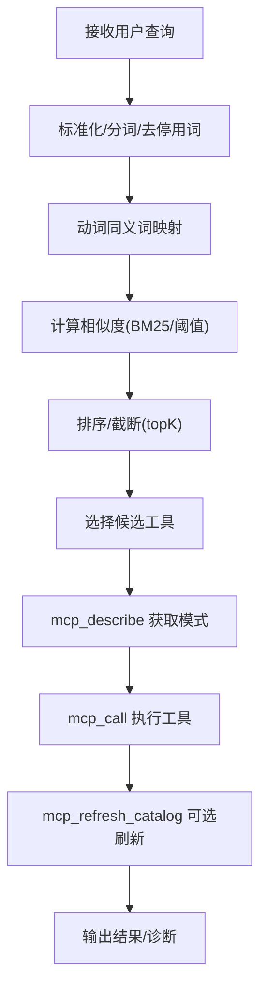
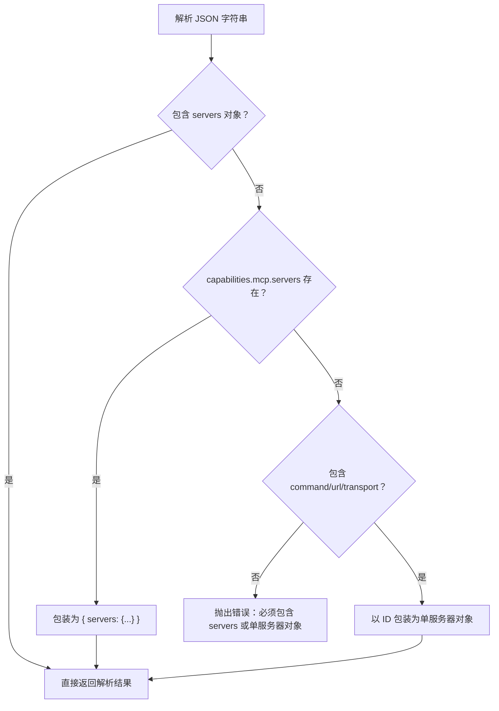
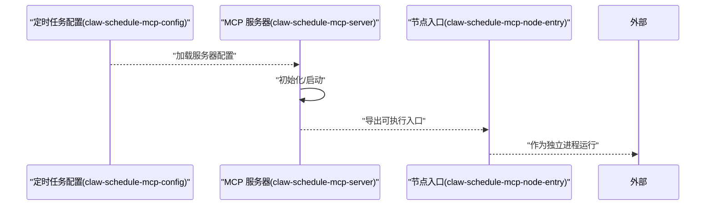
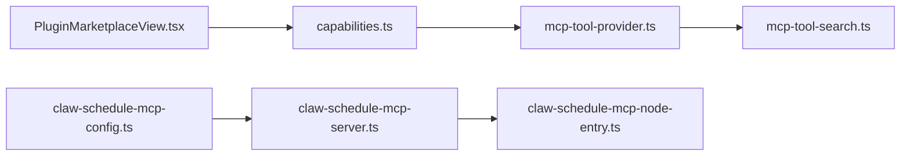

# MCP 协议集成

<cite>
**本文引用的文件**
- [kun/src/adapters/tool/mcp-tool-provider.ts](file://kun/src/adapters/tool/mcp-tool-provider.ts)
- [kun/src/adapters/tool/mcp-tool-search.ts](file://kun/src/adapters/tool/mcp-tool-search.ts)
- [kun/src/contracts/capabilities.ts](file://kun/src/contracts/capabilities.ts)
- [kun/tests/mcp-tool-provider.test.ts](file://kun/tests/mcp-tool-provider.test.ts)
- [kun/tests/mcp-config.test.ts](file://kun/tests/mcp-config.test.ts)
- [src/renderer/src/components/PluginMarketplaceView.tsx](file://src/renderer/src/components/PluginMarketplaceView.tsx)
- [src/main/claw-schedule-mcp-server.ts](file://src/main/claw-schedule-mcp-server.ts)
- [src/main/claw-schedule-mcp-config.ts](file://src/main/claw-schedule-mcp-config.ts)
- [src/main/claw-schedule-mcp-node-entry.ts](file://src/main/claw-schedule-mcp-node-entry.ts)
</cite>

## 目录
1. [引言](#引言)
2. [项目结构](#项目结构)
3. [核心组件](#核心组件)
4. [架构总览](#架构总览)
5. [详细组件分析](#详细组件分析)
6. [依赖关系分析](#依赖关系分析)
7. [性能考虑](#性能考虑)
8. [故障排查指南](#故障排查指南)
9. [结论](#结论)
10. [附录](#附录)

## 引言
本文件面向 MCP（Model Context Protocol）协议在 DeepSeek-GUI 中的集成，系统性阐述其基本概念、配置格式、连接与调用流程、在微信桥接与定时任务中的应用、性能优化与错误处理，并提供调试与排障建议。读者无需深入源码即可理解整体设计与使用方式。

## 项目结构
围绕 MCP 的实现主要分布在以下模块：
- 合规能力定义：能力开关、默认值与解析逻辑
- 工具提供者：连接 MCP 服务器、列举工具、封装本地工具、搜索与刷新目录
- 搜索与描述工具：基于关键词与语义相似度的工具发现与调用
- 渲染端配置解析：支持多种 JSON 结构，自动归一化为统一的 servers 对象
- 主进程定时任务与调度：独立运行 MCP 服务器、配置加载与节点入口

**图表来源**
- [src/renderer/src/components/PluginMarketplaceView.tsx:208-240](file://src/renderer/src/components/PluginMarketplaceView.tsx#L208-L240)
- [kun/src/contracts/capabilities.ts:180-200](file://kun/src/contracts/capabilities.ts#L180-L200)
- [kun/src/adapters/tool/mcp-tool-provider.ts:94-161](file://kun/src/adapters/tool/mcp-tool-provider.ts#L94-L161)
- [kun/src/adapters/tool/mcp-tool-search.ts:1-55](file://kun/src/adapters/tool/mcp-tool-search.ts#L1-L55)
- [src/main/claw-schedule-mcp-config.ts](file://src/main/claw-schedule-mcp-config.ts)
- [src/main/claw-schedule-mcp-server.ts](file://src/main/claw-schedule-mcp-server.ts)
- [src/main/claw-schedule-mcp-node-entry.ts](file://src/main/claw-schedule-mcp-node-entry.ts)

**章节来源**
- [src/renderer/src/components/PluginMarketplaceView.tsx:208-240](file://src/renderer/src/components/PluginMarketplaceView.tsx#L208-L240)
- [kun/src/contracts/capabilities.ts:180-200](file://kun/src/contracts/capabilities.ts#L180-L200)
- [kun/src/adapters/tool/mcp-tool-provider.ts:94-161](file://kun/src/adapters/tool/mcp-tool-provider.ts#L94-L161)
- [kun/src/adapters/tool/mcp-tool-search.ts:1-55](file://kun/src/adapters/tool/mcp-tool-search.ts#L1-L55)
- [src/main/claw-schedule-mcp-config.ts](file://src/main/claw-schedule-mcp-config.ts)
- [src/main/claw-schedule-mcp-server.ts](file://src/main/claw-schedule-mcp-server.ts)
- [src/main/claw-schedule-mcp-node-entry.ts](file://src/main/claw-schedule-mcp-node-entry.ts)

## 核心组件
- MCP 能力配置与默认值：定义启用开关、服务器集合、搜索策略等字段及默认行为，确保未显式配置时有合理缺省。
- 工具提供者构建器：遍历服务器配置，建立连接，拉取工具目录，生成本地工具包装器，支持重连与目录指纹校验。
- 搜索与描述工具：内置搜索、描述、调用、刷新目录等工具，支持关键词停用词过滤与动词同义词映射，提升自然语言到工具的召回质量。
- 渲染端配置解析：兼容多种 JSON 形态，自动提取或归一化为统一的 servers 对象，便于后续处理。
- 定时任务 MCP：独立的主进程模块，负责加载配置、启动/管理 MCP 服务器并暴露节点入口，用于后台自动化场景。

**章节来源**
- [kun/src/contracts/capabilities.ts:180-200](file://kun/src/contracts/capabilities.ts#L180-L200)
- [kun/src/adapters/tool/mcp-tool-provider.ts:94-161](file://kun/src/adapters/tool/mcp-tool-provider.ts#L94-L161)
- [kun/src/adapters/tool/mcp-tool-search.ts:1-55](file://kun/src/adapters/tool/mcp-tool-search.ts#L1-L55)
- [src/renderer/src/components/PluginMarketplaceView.tsx:208-240](file://src/renderer/src/components/PluginMarketplaceView.tsx#L208-L240)
- [src/main/claw-schedule-mcp-server.ts](file://src/main/claw-schedule-mcp-server.ts)
- [src/main/claw-schedule-mcp-config.ts](file://src/main/claw-schedule-mcp-config.ts)
- [src/main/claw-schedule-mcp-node-entry.ts](file://src/main/claw-schedule-mcp-node-entry.ts)

## 架构总览
下图展示从配置到工具可用性的端到端流程，以及渲染端与内核、主进程之间的交互。

**图表来源**
- [src/renderer/src/components/PluginMarketplaceView.tsx:208-240](file://src/renderer/src/components/PluginMarketplaceView.tsx#L208-L240)
- [kun/src/contracts/capabilities.ts:180-200](file://kun/src/contracts/capabilities.ts#L180-L200)
- [kun/src/adapters/tool/mcp-tool-provider.ts:94-161](file://kun/src/adapters/tool/mcp-tool-provider.ts#L94-L161)
- [kun/src/adapters/tool/mcp-tool-search.ts:1-55](file://kun/src/adapters/tool/mcp-tool-search.ts#L1-L55)

## 详细组件分析

### 组件一：MCP 工具提供者构建器
职责与流程
- 遍历每个服务器配置，按需创建客户端实例，记录连接状态与最后错误
- 列举所有工具并构建本地工具包装器，同时维护搜索目录
- 提供诊断信息（连接状态、工具数量、错误摘要）
- 支持工具调用的重连与超时控制

**图表来源**
- [kun/src/adapters/tool/mcp-tool-provider.ts:94-161](file://kun/src/adapters/tool/mcp-tool-provider.ts#L94-L161)
- [kun/src/adapters/tool/mcp-tool-provider.ts:310-319](file://kun/src/adapters/tool/mcp-tool-provider.ts#L310-L319)

**章节来源**
- [kun/src/adapters/tool/mcp-tool-provider.ts:94-161](file://kun/src/adapters/tool/mcp-tool-provider.ts#L94-L161)
- [kun/src/adapters/tool/mcp-tool-provider.ts:310-319](file://kun/src/adapters/tool/mcp-tool-provider.ts#L310-L319)

### 组件二：MCP 搜索与描述工具
职责与流程
- 内置搜索工具：对用户输入进行停用词过滤与动词同义词映射，结合 BM25 等策略进行工具检索
- 描述工具：返回被选中工具的完整模式与元数据
- 调用工具：转发到已连接服务器执行
- 刷新目录工具：重新拉取工具目录并重建索引

**图表来源**
- [kun/src/adapters/tool/mcp-tool-search.ts:1-55](file://kun/src/adapters/tool/mcp-tool-search.ts#L1-L55)
- [kun/src/adapters/tool/mcp-tool-search.ts:154-162](file://kun/src/adapters/tool/mcp-tool-search.ts#L154-L162)

**章节来源**
- [kun/src/adapters/tool/mcp-tool-search.ts:1-55](file://kun/src/adapters/tool/mcp-tool-search.ts#L1-L55)
- [kun/src/adapters/tool/mcp-tool-search.ts:154-162](file://kun/src/adapters/tool/mcp-tool-search.ts#L154-L162)

### 组件三：渲染端 MCP 配置解析与合并
职责与流程
- 解析多种 JSON 形态，自动提取 servers 或单个服务器对象
- 合并片段配置，避免重复 ID
- 抛出明确错误提示，保证配置合法性

**图表来源**
- [src/renderer/src/components/PluginMarketplaceView.tsx:208-240](file://src/renderer/src/components/PluginMarketplaceView.tsx#L208-L240)

**章节来源**
- [src/renderer/src/components/PluginMarketplaceView.tsx:208-240](file://src/renderer/src/components/PluginMarketplaceView.tsx#L208-L240)

### 组件四：定时任务 MCP 服务器与配置
职责与流程
- 加载定时任务相关 MCP 配置
- 启动/管理 MCP 服务器
- 暴露节点入口，供外部进程调用

**图表来源**
- [src/main/claw-schedule-mcp-config.ts](file://src/main/claw-schedule-mcp-config.ts)
- [src/main/claw-schedule-mcp-server.ts](file://src/main/claw-schedule-mcp-server.ts)
- [src/main/claw-schedule-mcp-node-entry.ts](file://src/main/claw-schedule-mcp-node-entry.ts)

**章节来源**
- [src/main/claw-schedule-mcp-config.ts](file://src/main/claw-schedule-mcp-config.ts)
- [src/main/claw-schedule-mcp-server.ts](file://src/main/claw-schedule-mcp-server.ts)
- [src/main/claw-schedule-mcp-node-entry.ts](file://src/main/claw-schedule-mcp-node-entry.ts)

## 依赖关系分析
- 渲染端依赖能力配置与工具提供者，后者再依赖 MCP 服务器
- 搜索工具依赖工具提供者的目录与本地工具包装器
- 定时任务模块与主进程其他模块解耦，通过配置与入口进行集成

**图表来源**
- [src/renderer/src/components/PluginMarketplaceView.tsx:208-240](file://src/renderer/src/components/PluginMarketplaceView.tsx#L208-L240)
- [kun/src/contracts/capabilities.ts:180-200](file://kun/src/contracts/capabilities.ts#L180-L200)
- [kun/src/adapters/tool/mcp-tool-provider.ts:94-161](file://kun/src/adapters/tool/mcp-tool-provider.ts#L94-L161)
- [kun/src/adapters/tool/mcp-tool-search.ts:1-55](file://kun/src/adapters/tool/mcp-tool-search.ts#L1-L55)
- [src/main/claw-schedule-mcp-config.ts](file://src/main/claw-schedule-mcp-config.ts)
- [src/main/claw-schedule-mcp-server.ts](file://src/main/claw-schedule-mcp-server.ts)
- [src/main/claw-schedule-mcp-node-entry.ts](file://src/main/claw-schedule-mcp-node-entry.ts)

**章节来源**
- [kun/src/contracts/capabilities.ts:180-200](file://kun/src/contracts/capabilities.ts#L180-L200)
- [kun/src/adapters/tool/mcp-tool-provider.ts:94-161](file://kun/src/adapters/tool/mcp-tool-provider.ts#L94-L161)
- [kun/src/adapters/tool/mcp-tool-search.ts:1-55](file://kun/src/adapters/tool/mcp-tool-search.ts#L1-L55)
- [src/main/claw-schedule-mcp-config.ts](file://src/main/claw-schedule-mcp-config.ts)
- [src/main/claw-schedule-mcp-server.ts](file://src/main/claw-schedule-mcp-server.ts)
- [src/main/claw-schedule-mcp-node-entry.ts](file://src/main/claw-schedule-mcp-node-entry.ts)

## 性能考虑
- 分页列举工具：避免一次性拉取大量工具导致阻塞，采用游标分页逐页获取
- 目录指纹与增量刷新：通过目录指纹检测变更，仅在必要时重建索引
- 搜索策略：合理设置 topK、最小分数与 BM25 参数，平衡召回与延迟
- 连接复用与超时：共享客户端连接，设置适中超时时间，避免长时间阻塞
- 重连策略：失败后自动重试并记录诊断，减少人工干预

[本节为通用性能建议，不直接分析具体文件]

## 故障排查指南
常见问题与定位思路
- 配置解析失败：检查 JSON 是否包含 servers 对象或单服务器对象；确认字段类型与格式
- 无法连接服务器：查看诊断信息中的错误摘要；验证服务器地址、鉴权与网络连通性
- 工具不可用：确认工具目录是否成功拉取；检查工具名称拼写与权限
- 搜索无结果：调整关键词、停用词与同义词映射；提高最小分数或增大 topK
- 定时任务异常：检查定时任务配置与节点入口；查看日志输出与进程状态

测试参考
- 工具提供者构建与诊断：参考单元测试用例，验证不同配置下的行为
- 配置解析与合并：参考单元测试用例，覆盖多种 JSON 形态与合并场景

**章节来源**
- [kun/tests/mcp-tool-provider.test.ts](file://kun/tests/mcp-tool-provider.test.ts)
- [kun/tests/mcp-config.test.ts](file://kun/tests/mcp-config.test.ts)

## 结论
MCP 协议在 DeepSeek-GUI 中通过“能力配置 + 工具提供者 + 搜索工具”的组合实现，既满足通用工具调用，又提供自然语言搜索体验。定时任务模块进一步扩展了 MCP 在后台自动化场景的应用。通过合理的配置解析、连接管理与诊断输出，系统具备良好的可维护性与可观测性。

[本节为总结性内容，不直接分析具体文件]

## 附录

### MCP 配置文件格式与参数
- 顶层字段
  - enabled：布尔，是否启用 MCP 能力
  - servers：对象，键为服务器 ID，值为服务器配置
  - search：对象，包含启用开关、模式（auto/manual）、阈值、topK、BM25 参数等
- 服务器配置字段（示例）
  - enabled：布尔，是否启用该服务器
  - command/url/transport：字符串，指定传输方式与地址
  - 其他认证/鉴权相关字段（根据实际服务器要求）

**章节来源**
- [kun/src/contracts/capabilities.ts:180-200](file://kun/src/contracts/capabilities.ts#L180-L200)
- [src/renderer/src/components/PluginMarketplaceView.tsx:208-240](file://src/renderer/src/components/PluginMarketplaceView.tsx#L208-L240)

### 安全与认证机制
- 认证方式：由具体 MCP 服务器决定（如令牌、证书、代理等），应在服务器配置中正确填写
- 权限控制：工具调用前进行信任校验，拒绝不受信任的工作区访问
- 传输安全：优先使用加密通道；在受限网络中通过代理或隧道连接

**章节来源**
- [kun/src/adapters/tool/mcp-tool-provider.ts:288-292](file://kun/src/adapters/tool/mcp-tool-provider.ts#L288-L292)

### 微信桥接与定时任务中的应用
- 微信桥接：通过 MCP 工具提供者将外部服务能力接入对话流程，实现消息转发、状态查询等功能
- 定时任务：利用独立的 MCP 服务器与节点入口，定期执行特定工具，完成周期性任务

**章节来源**
- [src/main/claw-schedule-mcp-server.ts](file://src/main/claw-schedule-mcp-server.ts)
- [src/main/claw-schedule-mcp-config.ts](file://src/main/claw-schedule-mcp-config.ts)
- [src/main/claw-schedule-mcp-node-entry.ts](file://src/main/claw-schedule-mcp-node-entry.ts)

### 调试工具与使用方法
- 配置校验：在渲染端粘贴配置后，观察解析与合并结果；若报错，依据错误提示修正 JSON
- 诊断面板：查看工具提供者的诊断信息，包括连接状态、工具数量与错误摘要
- 日志输出：关注定时任务与服务器启动日志，定位异常原因
- 单元测试：运行相关测试用例，验证配置与行为预期一致

**章节来源**
- [kun/tests/mcp-tool-provider.test.ts](file://kun/tests/mcp-tool-provider.test.ts)
- [kun/tests/mcp-config.test.ts](file://kun/tests/mcp-config.test.ts)