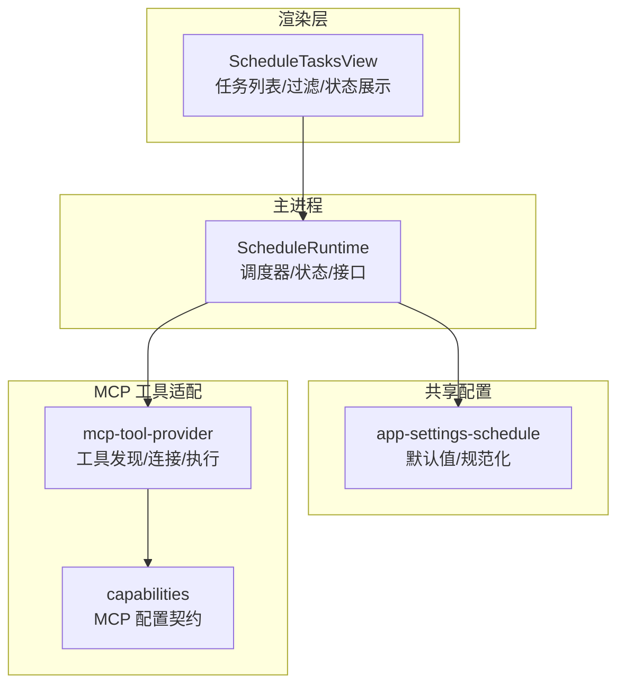
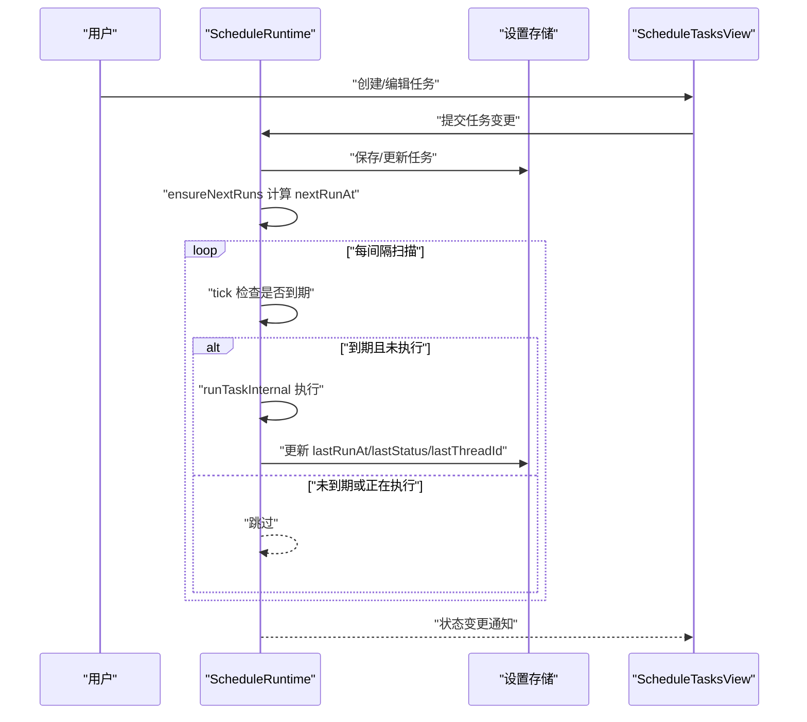
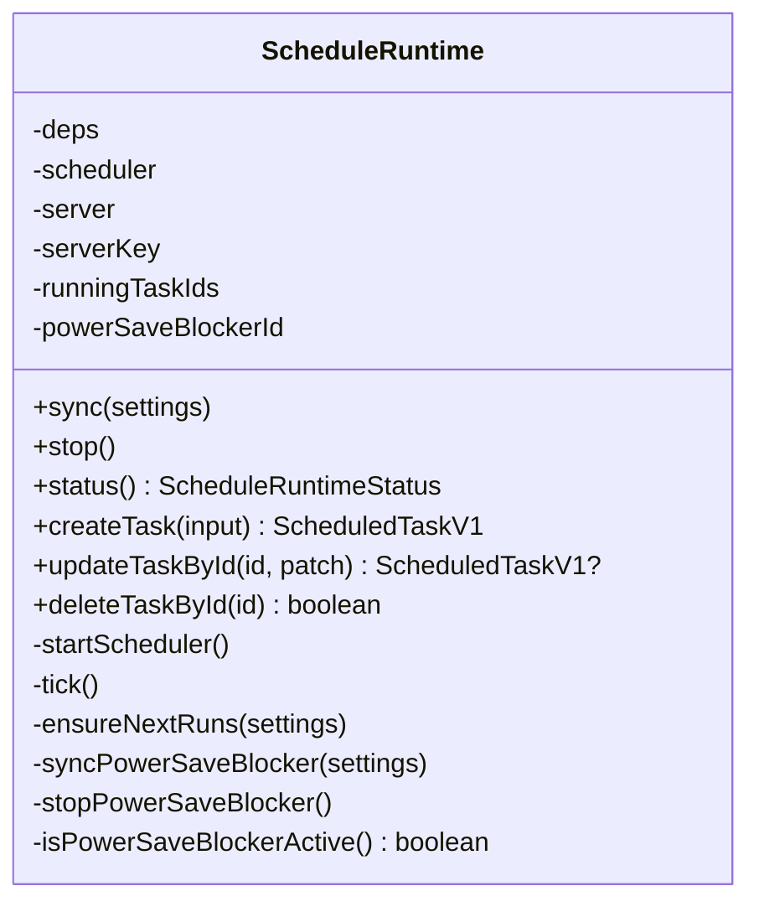
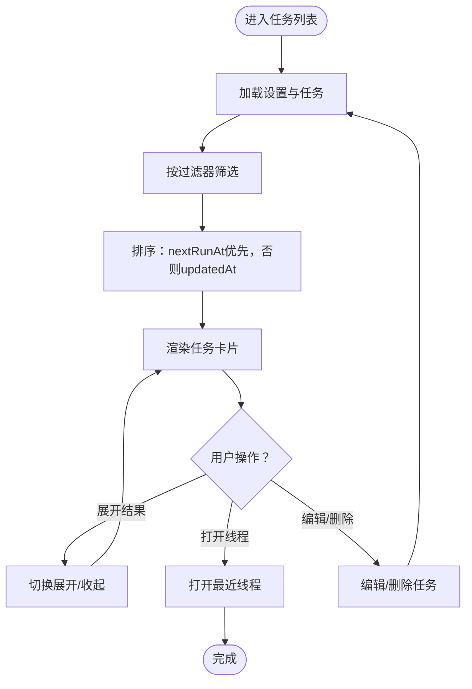
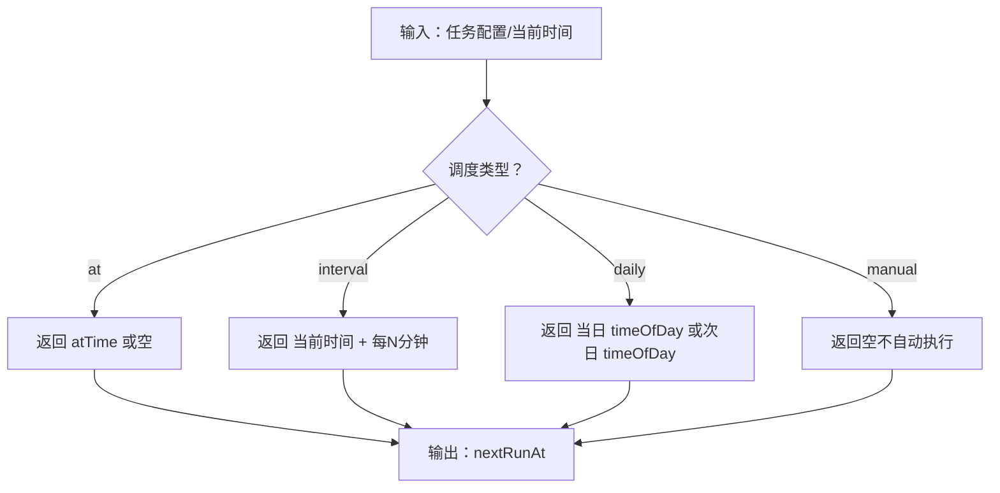
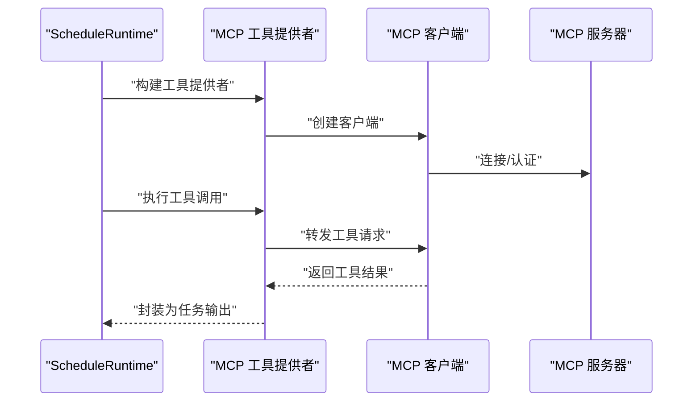
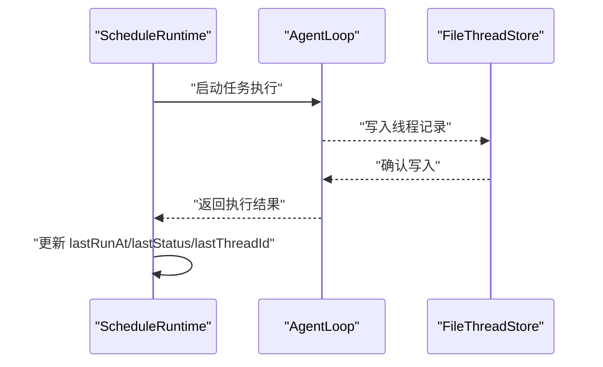
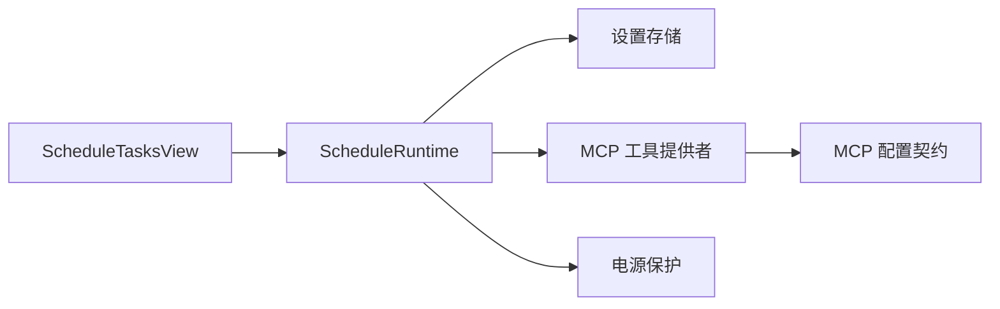

# 定时任务管理

<cite>
**本文引用的文件**
- [schedule-runtime.ts](file://src/main/schedule-runtime.ts)
- [ScheduleTasksView.tsx](file://src/renderer/src/components/schedule/ScheduleTasksView.tsx)
- [app-settings-schedule.ts](file://src/shared/app-settings-schedule.ts)
- [mcp-tool-provider.ts](file://kun/src/adapters/tool/mcp-tool-provider.ts)
- [capabilities.ts](file://kun/src/contracts/capabilities.ts)
- [mcp-tool-provider.test.ts](file://kun/tests/mcp-tool-provider.test.ts)
- [schedule-runtime.test.ts](file://src/main/schedule-runtime.test.ts)
- [ScheduleTasksView.test.ts](file://src/renderer/src/components/schedule/ScheduleTasksView.test.ts)
- [file-thread-store.ts](file://kun/src/adapters/file/file-thread-store.ts)
- [agent-loop.ts](file://kun/src/loop/agent-loop.ts)
- [inflight-tracker.ts](file://kun/src/loop/inflight-tracker.ts)
</cite>

## 目录
1. [简介](#简介)
2. [项目结构](#项目结构)
3. [核心组件](#核心组件)
4. [架构总览](#架构总览)
5. [详细组件分析](#详细组件分析)
6. [依赖关系分析](#依赖关系分析)
7. [性能与并发控制](#性能与并发控制)
8. [故障排查指南](#故障排查指南)
9. [结论](#结论)
10. [附录：实际配置示例与最佳实践](#附录实际配置示例与最佳实践)

## 简介
本指南面向“定时任务管理系统”的使用者与维护者，围绕以下目标展开：如何创建、编辑、删除与监控定时任务；任务调度算法与执行时间设置、重复模式配置；MCP 协议在定时任务中的应用；任务优先级与并发控制；日志与执行状态监控；性能优化建议；以及三类典型任务（数据同步、报告生成、系统维护）的配置示例与最佳实践。

## 项目结构
定时任务功能由主进程运行时、渲染层 UI、共享配置与 MCP 工具适配器共同组成：
- 主进程运行时负责任务调度、状态持久化、内部 HTTP 接口与电源保护策略
- 渲染层 UI 提供任务列表、过滤、详情与操作入口
- 共享配置模块负责默认值、规范化与序列化
- MCP 工具适配器用于连接外部工具服务，扩展任务能力

图表来源
- [schedule-runtime.ts:55-91](file://src/main/schedule-runtime.ts#L55-L91)
- [ScheduleTasksView.tsx:205-220](file://src/renderer/src/components/schedule/ScheduleTasksView.tsx#L205-L220)
- [app-settings-schedule.ts:51-75](file://src/shared/app-settings-schedule.ts#L51-L75)
- [mcp-tool-provider.ts:94-121](file://kun/src/adapters/tool/mcp-tool-provider.ts#L94-L121)
- [capabilities.ts:44-75](file://kun/src/contracts/capabilities.ts#L44-L75)

章节来源
- [schedule-runtime.ts:55-91](file://src/main/schedule-runtime.ts#L55-L91)
- [ScheduleTasksView.tsx:205-220](file://src/renderer/src/components/schedule/ScheduleTasksView.tsx#L205-L220)
- [app-settings-schedule.ts:51-75](file://src/shared/app-settings-schedule.ts#L51-L75)
- [mcp-tool-provider.ts:94-121](file://kun/src/adapters/tool/mcp-tool-provider.ts#L94-L121)
- [capabilities.ts:44-75](file://kun/src/contracts/capabilities.ts#L44-L75)

## 核心组件
- 调度运行时（ScheduleRuntime）
  - 负责启动/停止调度器、计算下次运行时间、执行任务、更新状态、内部 HTTP 接口、电源保护
  - 关键方法：创建/更新/删除任务、启动/停止调度器、tick 扫描、确保下次运行时间、电源保护开关
- 渲染视图（ScheduleTasksView）
  - 展示任务列表、过滤、状态高亮、结果预览、打开最近线程等
  - 关键逻辑：任务摘要格式化、排序、过滤、结果可展开检测
- 共享配置（app-settings-schedule）
  - 默认设置、规范化输入、任务字段标准化
- MCP 工具适配（mcp-tool-provider）
  - 构建工具提供者、连接 MCP 服务器、搜索与目录管理、诊断信息
- 任务持久化（file-thread-store）
  - 以文件形式存储线程记录，支持读取、写入、索引与删除

章节来源
- [schedule-runtime.ts:55-91](file://src/main/schedule-runtime.ts#L55-L91)
- [ScheduleTasksView.tsx:115-204](file://src/renderer/src/components/schedule/ScheduleTasksView.tsx#L115-L204)
- [app-settings-schedule.ts:36-75](file://src/shared/app-settings-schedule.ts#L36-L75)
- [mcp-tool-provider.ts:94-121](file://kun/src/adapters/tool/mcp-tool-provider.ts#L94-L121)
- [file-thread-store.ts:31-73](file://kun/src/adapters/file/file-thread-store.ts#L31-L73)

## 架构总览
定时任务从“用户在 UI 中创建/编辑任务”开始，主进程运行时将其持久化到设置中，并根据调度规则计算下一次运行时间。调度器周期性扫描，当到达运行时间且未在执行时触发任务执行。执行过程通过代理循环与工具链路完成，最终将结果写入线程记录以便回溯。

图表来源
- [schedule-runtime.ts:232-254](file://src/main/schedule-runtime.ts#L232-L254)
- [schedule-runtime.ts:256-294](file://src/main/schedule-runtime.ts#L256-L294)
- [ScheduleTasksView.tsx:483-578](file://src/renderer/src/components/schedule/ScheduleTasksView.tsx#L483-L578)

章节来源
- [schedule-runtime.ts:232-254](file://src/main/schedule-runtime.ts#L232-L254)
- [schedule-runtime.ts:256-294](file://src/main/schedule-runtime.ts#L256-L294)
- [ScheduleTasksView.tsx:483-578](file://src/renderer/src/components/schedule/ScheduleTasksView.tsx#L483-L578)

## 详细组件分析

### 组件一：调度运行时（ScheduleRuntime）
- 职责
  - 启动/停止内部调度器与电源保护
  - 计算任务下次运行时间（基于不同调度类型）
  - 触发任务执行、更新任务状态与结果
  - 对一次性任务在完成后自动禁用
- 关键点
  - 使用定时器周期扫描，避免阻塞主线程
  - 通过集合跟踪正在执行的任务 ID，防止并发重复执行
  - 在恢复场景中识别被中断的任务并标记错误
  - 只在启用且有任务时激活电源保护

图表来源
- [schedule-runtime.ts:55-91](file://src/main/schedule-runtime.ts#L55-L91)
- [schedule-runtime.ts:232-254](file://src/main/schedule-runtime.ts#L232-L254)
- [schedule-runtime.ts:256-294](file://src/main/schedule-runtime.ts#L256-L294)

章节来源
- [schedule-runtime.ts:55-91](file://src/main/schedule-runtime.ts#L55-L91)
- [schedule-runtime.ts:232-254](file://src/main/schedule-runtime.ts#L232-L254)
- [schedule-runtime.ts:256-294](file://src/main/schedule-runtime.ts#L256-L294)

### 组件二：渲染视图（ScheduleTasksView）
- 职责
  - 列表展示任务、按状态/时间过滤与排序
  - 显示任务摘要（一次性/间隔/每日）、下次/上次运行时间
  - 支持展开/收起结果、打开最近线程
- 关键点
  - 任务摘要函数根据调度类型返回本地化文案
  - 过滤器支持“全部/启用/运行中/已完成”
  - 排序依据“下次运行时间优先，其次更新时间”

图表来源
- [ScheduleTasksView.tsx:115-178](file://src/renderer/src/components/schedule/ScheduleTasksView.tsx#L115-L178)
- [ScheduleTasksView.tsx:483-578](file://src/renderer/src/components/schedule/ScheduleTasksView.tsx#L483-L578)

章节来源
- [ScheduleTasksView.tsx:115-178](file://src/renderer/src/components/schedule/ScheduleTasksView.tsx#L115-L178)
- [ScheduleTasksView.tsx:483-578](file://src/renderer/src/components/schedule/ScheduleTasksView.tsx#L483-L578)

### 组件三：调度算法与重复模式
- 支持的调度类型
  - 一次性（at）：指定绝对时间点
  - 间隔（interval）：每 N 分钟执行
  - 每日（daily）：每天固定时间执行
- 下次运行时间计算
  - 基于当前时间与任务配置推导
  - 若任务处于运行中或手动模式则跳过
- 测试覆盖
  - 验证不同类型的 nextRunAt 推导
  - 验证一次性任务完成后自动禁用

图表来源
- [schedule-runtime.test.ts:105-120](file://src/main/schedule-runtime.test.ts#L105-L120)

章节来源
- [schedule-runtime.test.ts:105-120](file://src/main/schedule-runtime.test.ts#L105-L120)

### 组件四：MCP 协议在定时任务中的应用
- 作用
  - 将外部工具能力注入到定时任务执行过程中，实现“工具即服务”的扩展
- 关键流程
  - 构建 MCP 工具提供者（支持直接/搜索/自动三种发现模式）
  - 连接服务器、建立客户端、缓存目录指纹与诊断信息
  - 在任务执行中调用工具，支持超时与错误处理
- 配置要点
  - 传输方式（stdio/streamable-http/SSE）
  - 信任范围（用户/工作区），工作区信任需满足根路径约束
  - 搜索模式与阈值、BM25 参数、TopK 上下界

图表来源
- [mcp-tool-provider.ts:94-121](file://kun/src/adapters/tool/mcp-tool-provider.ts#L94-L121)
- [capabilities.ts:44-75](file://kun/src/contracts/capabilities.ts#L44-L75)
- [mcp-tool-provider.test.ts:80-87](file://kun/tests/mcp-tool-provider.test.ts#L80-L87)

章节来源
- [mcp-tool-provider.ts:94-121](file://kun/src/adapters/tool/mcp-tool-provider.ts#L94-L121)
- [capabilities.ts:44-75](file://kun/src/contracts/capabilities.ts#L44-L75)
- [mcp-tool-provider.test.ts:80-87](file://kun/tests/mcp-tool-provider.test.ts#L80-L87)

### 组件五：任务执行与线程持久化
- 执行链路
  - 任务触发后，运行时更新状态为“运行中”，随后通过代理循环与工具链路执行
  - 执行完成后，将结果写入线程记录，便于后续查看与回溯
- 线程存储
  - 文件式线程存储，支持读取、写入、索引与删除
  - 列表时按更新时间倒序排列

图表来源
- [agent-loop.ts:1118-1158](file://kun/src/loop/agent-loop.ts#L1118-L1158)
- [file-thread-store.ts:31-73](file://kun/src/adapters/file/file-thread-store.ts#L31-L73)

章节来源
- [agent-loop.ts:1118-1158](file://kun/src/loop/agent-loop.ts#L1118-L1158)
- [file-thread-store.ts:31-73](file://kun/src/adapters/file/file-thread-store.ts#L31-L73)

## 依赖关系分析
- 组件耦合
  - ScheduleRuntime 依赖设置存储与内部 HTTP 接口，同时与 UI 通过状态同步交互
  - 渲染视图依赖任务摘要与过滤/排序逻辑
  - MCP 工具适配器独立于调度器，但可被任务执行流程调用
- 外部依赖
  - Electron 的电源保护 API（仅在启用 keepAwake 且存在启用任务时生效）

图表来源
- [schedule-runtime.ts:67-91](file://src/main/schedule-runtime.ts#L67-L91)
- [ScheduleTasksView.tsx:205-220](file://src/renderer/src/components/schedule/ScheduleTasksView.tsx#L205-L220)
- [mcp-tool-provider.ts:94-121](file://kun/src/adapters/tool/mcp-tool-provider.ts#L94-L121)
- [capabilities.ts:44-75](file://kun/src/contracts/capabilities.ts#L44-L75)

章节来源
- [schedule-runtime.ts:67-91](file://src/main/schedule-runtime.ts#L67-L91)
- [ScheduleTasksView.tsx:205-220](file://src/renderer/src/components/schedule/ScheduleTasksView.tsx#L205-L220)
- [mcp-tool-provider.ts:94-121](file://kun/src/adapters/tool/mcp-tool-provider.ts#L94-L121)
- [capabilities.ts:44-75](file://kun/src/contracts/capabilities.ts#L44-L75)

## 性能与并发控制
- 并发控制
  - 使用集合跟踪正在执行的任务 ID，避免同一任务并发执行
  - 在恢复场景中若检测到“运行中但未在执行集合”的任务，标记为错误并重算下次运行
- 电源保护
  - 仅在启用定时任务且开启 keepAwake 时激活，减少不必要的系统唤醒
- 调度频率
  - 定时器周期扫描，避免高频阻塞；对未到期或已在执行的任务跳过
- 工具调用
  - MCP 工具调用具备超时与错误处理，避免阻塞主流程

章节来源
- [schedule-runtime.ts:241-254](file://src/main/schedule-runtime.ts#L241-L254)
- [schedule-runtime.ts:264-294](file://src/main/schedule-runtime.ts#L264-L294)
- [schedule-runtime.ts:640-678](file://src/main/schedule-runtime.ts#L640-L678)
- [inflight-tracker.ts:41-73](file://kun/src/loop/inflight-tracker.ts#L41-L73)

## 故障排查指南
- 任务未运行
  - 检查任务是否启用、调度类型是否为 manual
  - 查看 nextRunAt 是否已到达；若被中断，状态可能为 error 并提示“未完整完成”
- 一次性任务未再次执行
  - 一次性任务在完成后会自动禁用；如需再次执行，请重新创建
- 结果无法展开
  - 结果长度超过阈值或行数较多时才显示展开按钮
- 线程未生成或为空
  - 确认任务执行成功，检查线程存储目录是否存在对应线程文件
- MCP 工具不可用
  - 检查 MCP 服务器连接状态、传输方式、信任范围与超时设置

章节来源
- [schedule-runtime.test.ts:277-333](file://src/main/schedule-runtime.test.ts#L277-L333)
- [ScheduleTasksView.tsx:184-204](file://src/renderer/src/components/schedule/ScheduleTasksView.tsx#L184-L204)
- [file-thread-store.ts:31-73](file://kun/src/adapters/file/file-thread-store.ts#L31-L73)
- [mcp-tool-provider.ts:94-121](file://kun/src/adapters/tool/mcp-tool-provider.ts#L94-L121)

## 结论
定时任务管理通过“运行时调度 + 渲染视图 + 共享配置 + MCP 工具适配”的组合，实现了稳定、可扩展、可观测的任务体系。其调度算法简洁可靠，UI 提供清晰的状态与操作入口，MCP 能力使任务具备强大的外部工具扩展性。遵循本文的最佳实践与排障建议，可有效提升任务的可靠性与性能。

## 附录：实际配置示例与最佳实践

- 数据同步（增量/定时拉取）
  - 调度类型：interval（例如每 10 分钟）
  - 执行模式：agent + MCP 工具（如远程数据库查询/文件同步）
  - 最佳实践：设置合理的响应超时；启用 keepAwake；关注失败重试与幂等设计
- 报告生成（每日/每周汇总）
  - 调度类型：daily（例如每天 09:00）
  - 执行模式：agent + MCP 工具（如统计/报表导出）
  - 最佳实践：在任务标题中体现业务含义；使用线程记录归档输出；必要时限制并发
- 系统维护（巡检/清理）
  - 调度类型：at（一次性，如某时刻执行）
  - 执行模式：agent + MCP 工具（如健康检查/磁盘清理）
  - 最佳实践：一次性任务完成后自动禁用；保留错误日志便于回溯

章节来源
- [schedule-runtime.ts:158-195](file://src/main/schedule-runtime.ts#L158-L195)
- [app-settings-schedule.ts:36-75](file://src/shared/app-settings-schedule.ts#L36-L75)
- [mcp-tool-provider.ts:94-121](file://kun/src/adapters/tool/mcp-tool-provider.ts#L94-L121)
- [ScheduleTasksView.tsx:115-178](file://src/renderer/src/components/schedule/ScheduleTasksView.tsx#L115-L178)