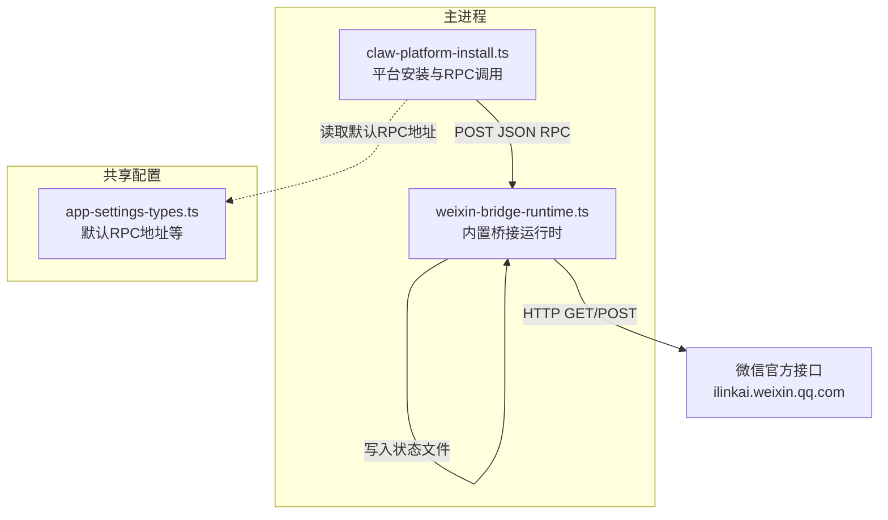
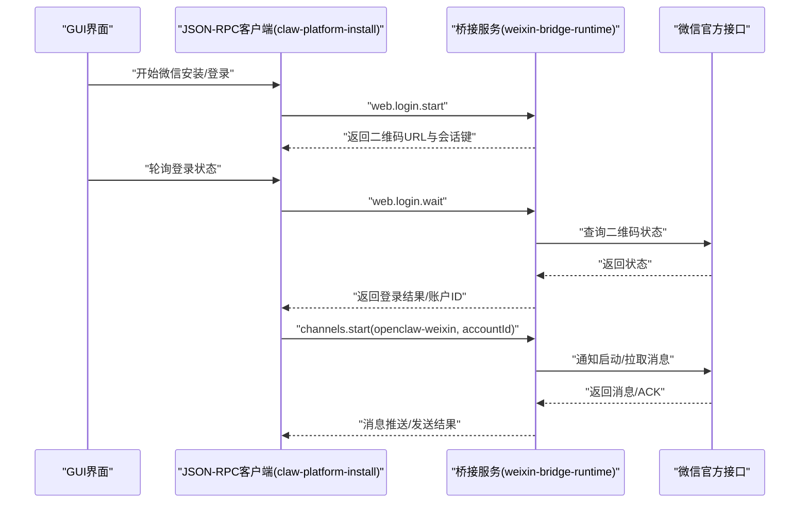
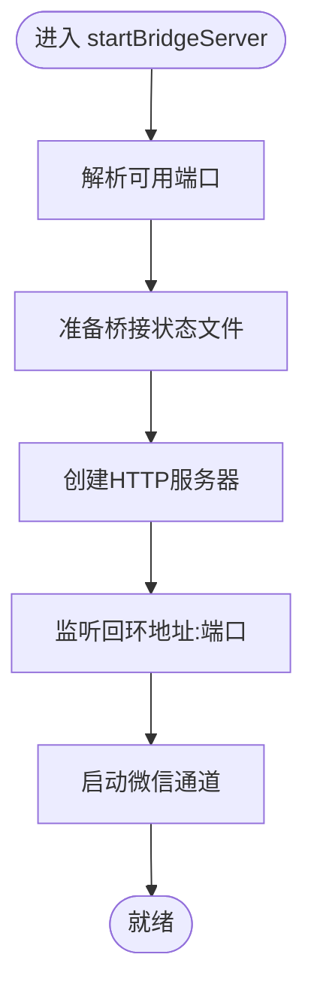
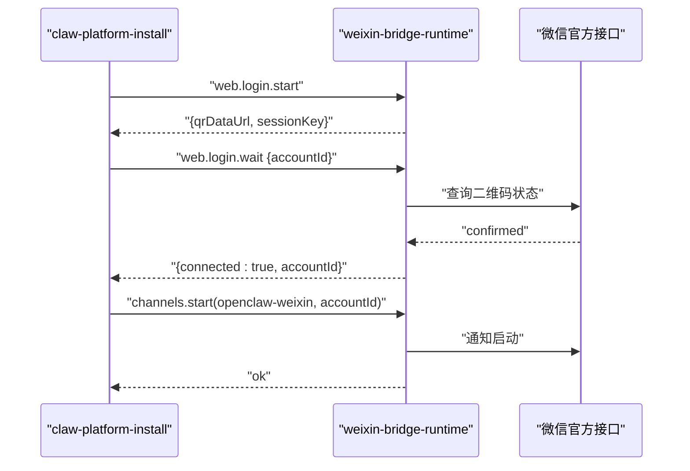
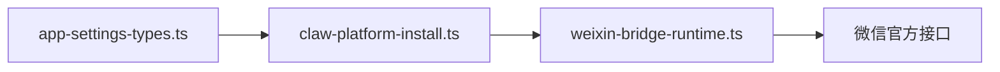

# 微信桥接配置

<cite>
**本文引用的文件**
- [weixin-bridge-runtime.ts](file://src/main/weixin-bridge-runtime.ts)
- [claw-platform-install.ts](file://src/main/claw-platform-install.ts)
- [app-settings-types.ts](file://src/shared/app-settings-types.ts)
- [weixin-bridge-runtime.test.ts](file://src/main/weixin-bridge-runtime.test.ts)
- [claw-platform-install.test.ts](file://src/main/claw-platform-install.test.ts)
</cite>

## 目录
1. [简介](#简介)
2. [项目结构](#项目结构)
3. [核心组件](#核心组件)
4. [架构总览](#架构总览)
5. [详细组件分析](#详细组件分析)
6. [依赖分析](#依赖分析)
7. [性能考虑](#性能考虑)
8. [故障排查指南](#故障排查指南)
9. [结论](#结论)
10. [附录](#附录)

## 简介
本指南面向需要在本地运行 DeepSeek GUI 的用户，提供“微信桥接”的完整配置与运维指南。内容涵盖安装与初始化流程、平台配置要求、认证机制、公众号/企业微信对接要点、回调地址与消息收发机制、SSL 证书与防火墙设置、网络连通性测试，以及常见问题排查与解决方案。目标是帮助读者快速、稳定地建立微信桥接连接。

## 项目结构
微信桥接相关的核心代码位于主进程模块中，主要由以下文件构成：
- weixin-bridge-runtime.ts：内置微信桥接运行时，负责启动本地 HTTP 服务、管理账户状态、处理二维码登录、消息轮询与发送、上下文令牌持久化等。
- claw-platform-install.ts：平台安装流程（含微信）的客户端侧 RPC 调用封装，负责向桥接服务发起登录、轮询结果、启动通道等。
- app-settings-types.ts：应用默认设置常量，包括微信桥接 RPC 默认地址等。
- 测试文件：验证桥接运行时行为与默认配置。

图表来源
- [weixin-bridge-runtime.ts:1-120](file://src/main/weixin-bridge-runtime.ts#L1-L120)
- [claw-platform-install.ts:131-140](file://src/main/claw-platform-install.ts#L131-L140)
- [app-settings-types.ts:43](file://src/shared/app-settings-types.ts#L43)

章节来源
- [weixin-bridge-runtime.ts:1-120](file://src/main/weixin-bridge-runtime.ts#L1-L120)
- [claw-platform-install.ts:131-140](file://src/main/claw-platform-install.ts#L131-L140)
- [app-settings-types.ts:43](file://src/shared/app-settings-types.ts#L43)

## 核心组件
- 内置桥接运行时
  - 启动本地 HTTP 服务器，监听回环地址，提供 JSON-RPC 接口。
  - 维护账户状态、上下文令牌、同步缓冲区等。
  - 提供二维码登录、轮询状态、消息拉取与发送、通知启动/停止等能力。
- 平台安装客户端
  - 通过 JSON-RPC 调用桥接服务，发起微信登录、轮询结果、启动通道。
  - 支持从环境变量或外部解析器覆盖桥接地址。
- 默认配置
  - 提供默认的桥接 RPC 地址，便于本地开发与调试。

章节来源
- [weixin-bridge-runtime.ts:104-137](file://src/main/weixin-bridge-runtime.ts#L104-L137)
- [claw-platform-install.ts:125-140](file://src/main/claw-platform-install.ts#L125-L140)
- [app-settings-types.ts:43](file://src/shared/app-settings-types.ts#L43)

## 架构总览
微信桥接采用“本地桥接 + 外部平台”的架构：
- GUI 主进程启动内置桥接服务，监听本地端口。
- 客户端通过 JSON-RPC 调用桥接服务，完成微信登录与通道启动。
- 桥接服务与微信官方 ilink 接口交互，实现消息收发与状态管理。

图表来源
- [claw-platform-install.ts:292-350](file://src/main/claw-platform-install.ts#L292-L350)
- [weixin-bridge-runtime.ts:509-642](file://src/main/weixin-bridge-runtime.ts#L509-L642)

## 详细组件分析

### 组件A：内置桥接运行时（weixin-bridge-runtime）
职责与关键点：
- 本地 HTTP 服务
  - 仅绑定回环地址，避免外网暴露。
  - 自动选择可用端口，启动后持久化网关配置。
- 账户与状态管理
  - 账户数据、上下文令牌、同步缓冲区均落盘，支持重启恢复。
  - 账户 ID 规范化与兼容旧格式。
- 二维码登录
  - 生成二维码、轮询状态、处理过期/验证码等异常路径。
  - 支持多实例登录会话清理。
- 消息收发
  - 发送文本消息，自动构建消息体与上下文令牌。
  - 拉取消息时对超时进行容错处理。
- 上下文令牌与同步
  - 按账户维度持久化上下文令牌，减少重复握手成本。
  - 保存/恢复同步缓冲区，保证消息连续性。

图表来源
- [weixin-bridge-runtime.ts:1052-1064](file://src/main/weixin-bridge-runtime.ts#L1052-L1064)
- [weixin-bridge-runtime.ts:466-486](file://src/main/weixin-bridge-runtime.ts#L466-L486)

章节来源
- [weixin-bridge-runtime.ts:104-137](file://src/main/weixin-bridge-runtime.ts#L104-L137)
- [weixin-bridge-runtime.ts:466-486](file://src/main/weixin-bridge-runtime.ts#L466-L486)
- [weixin-bridge-runtime.ts:509-642](file://src/main/weixin-bridge-runtime.ts#L509-L642)
- [weixin-bridge-runtime.ts:648-709](file://src/main/weixin-bridge-runtime.ts#L648-L709)
- [weixin-bridge-runtime.ts:738-768](file://src/main/weixin-bridge-runtime.ts#L738-L768)

### 组件B：平台安装与 RPC 调用（claw-platform-install）
职责与关键点：
- RPC 解析与调用
  - 优先使用显式传入的桥接地址；否则按环境变量顺序解析；最后回落到默认地址。
  - 对 404 或“未找到”进行特殊处理，提示桥接不可用。
- 微信登录流程
  - 发起登录：返回二维码 URL 与会话键。
  - 轮询登录：等待用户扫码确认，返回账户 ID。
  - 启动通道：在登录完成后启动微信通道。
- 错误处理
  - 对 RPC 返回的错误字段进行统一提取与抛出。
  - 对非 2xx 响应构造可读错误信息。

图表来源
- [claw-platform-install.ts:292-350](file://src/main/claw-platform-install.ts#L292-L350)
- [claw-platform-install.ts:151-195](file://src/main/claw-platform-install.ts#L151-L195)

章节来源
- [claw-platform-install.ts:125-140](file://src/main/claw-platform-install.ts#L125-L140)
- [claw-platform-install.ts:151-195](file://src/main/claw-platform-install.ts#L151-L195)
- [claw-platform-install.ts:292-350](file://src/main/claw-platform-install.ts#L292-L350)

### 组件C：默认配置与常量（app-settings-types）
- 默认桥接 RPC 地址：用于本地开发与调试。
- 应用设置类型定义：包含 IM 通道、凭证、会话等类型，便于在 GUI 中进行配置与持久化。

章节来源
- [app-settings-types.ts:43](file://src/shared/app-settings-types.ts#L43)
- [app-settings-types.ts:260-271](file://src/shared/app-settings-types.ts#L260-L271)

## 依赖分析
- 组件耦合
  - claw-platform-install 依赖 app-settings-types 提供的默认 RPC 地址。
  - weixin-bridge-runtime 依赖内置微信插件包信息，用于请求头注入。
- 外部依赖
  - 微信官方 ilink 接口：二维码生成、状态查询、消息收发、通知启动/停止。
- 可能的循环依赖
  - 当前模块间为单向依赖（RPC 调用 -> 桥接服务），无明显循环。

图表来源
- [claw-platform-install.ts:131-140](file://src/main/claw-platform-install.ts#L131-L140)
- [weixin-bridge-runtime.ts:147-166](file://src/main/weixin-bridge-runtime.ts#L147-L166)

章节来源
- [claw-platform-install.ts:131-140](file://src/main/claw-platform-install.ts#L131-L140)
- [weixin-bridge-runtime.ts:147-166](file://src/main/weixin-bridge-runtime.ts#L147-L166)

## 性能考虑
- 轮询策略
  - 二维码轮询与消息拉取均设置合理超时，避免长时间阻塞。
- 超时与重试
  - API 请求带超时控制；消息拉取超时返回空结果，降低失败影响。
- 端口与绑定
  - 仅监听回环地址，减少资源占用与安全风险。
- 状态持久化
  - 账户、上下文令牌、同步缓冲区落盘，避免频繁握手与重复拉取。

章节来源
- [weixin-bridge-runtime.ts:518-533](file://src/main/weixin-bridge-runtime.ts#L518-L533)
- [weixin-bridge-runtime.ts:711-732](file://src/main/weixin-bridge-runtime.ts#L711-L732)
- [weixin-bridge-runtime.ts:466-486](file://src/main/weixin-bridge-runtime.ts#L466-L486)

## 故障排查指南
- 桥接服务不可用
  - 现象：RPC 返回 404 或“未找到”，或提示桥接不可用。
  - 排查：确认 GUI 已启动内置桥接服务；检查桥接地址是否正确；确认端口未被占用。
  - 参考
    - [claw-platform-install.ts:170-174](file://src/main/claw-platform-install.ts#L170-L174)
    - [claw-platform-install.ts:24-25](file://src/main/claw-platform-install.ts#L24-L25)
- 二维码登录失败
  - 现象：二维码过期、需要验证码、重复绑定等。
  - 排查：重新生成二维码；若出现验证码提示，需在微信端完成验证；避免重复绑定同一用户。
  - 参考
    - [weixin-bridge-runtime.ts:590-614](file://src/main/weixin-bridge-runtime.ts#L590-L614)
    - [weixin-bridge-runtime.ts:595-600](file://src/main/weixin-bridge-runtime.ts#L595-L600)
- 登录超时
  - 现象：超过最大等待时间仍未扫码确认。
  - 排查：检查网络连通性；适当延长轮询超时；确认微信端已扫码。
  - 参考
    - [weixin-bridge-runtime.ts:582-642](file://src/main/weixin-bridge-runtime.ts#L582-L642)
- 消息发送失败
  - 现象：发送接口返回错误或超时。
  - 排查：检查账户令牌有效性；确认目标用户 ID 正确；查看超时与重试策略。
  - 参考
    - [weixin-bridge-runtime.ts:738-768](file://src/main/weixin-bridge-runtime.ts#L738-L768)
- 环境变量覆盖
  - 现象：桥接地址未按预期生效。
  - 排查：确认环境变量名与优先级顺序；确保值有效且可访问。
  - 参考
    - [claw-platform-install.ts:19-23](file://src/main/claw-platform-install.ts#L19-L23)
    - [claw-platform-install.ts:131-140](file://src/main/claw-platform-install.ts#L131-L140)

章节来源
- [claw-platform-install.ts:170-174](file://src/main/claw-platform-install.ts#L170-L174)
- [claw-platform-install.ts:24-25](file://src/main/claw-platform-install.ts#L24-L25)
- [weixin-bridge-runtime.ts:590-614](file://src/main/weixin-bridge-runtime.ts#L590-L614)
- [weixin-bridge-runtime.ts:595-600](file://src/main/weixin-bridge-runtime.ts#L595-L600)
- [weixin-bridge-runtime.ts:582-642](file://src/main/weixin-bridge-runtime.ts#L582-L642)
- [weixin-bridge-runtime.ts:738-768](file://src/main/weixin-bridge-runtime.ts#L738-L768)
- [claw-platform-install.ts:19-23](file://src/main/claw-platform-install.ts#L19-L23)
- [claw-platform-install.ts:131-140](file://src/main/claw-platform-install.ts#L131-L140)

## 结论
通过内置桥接运行时与平台安装 RPC 调用的协同，DeepSeek GUI 能够在本地稳定地完成微信登录、通道启动与消息收发。遵循本文的安装与配置流程、网络与安全设置、以及故障排查建议，可显著提升微信桥接的稳定性与成功率。

## 附录

### A. 安装与初始化步骤
- 启动 GUI，内置桥接服务自动准备并监听本地端口。
- 在 GUI 中触发微信安装流程，系统将调用桥接服务发起登录。
- 扫码确认后，桥接服务保存账户信息并启动微信通道。
- 参考
  - [weixin-bridge-runtime.ts:1052-1064](file://src/main/weixin-bridge-runtime.ts#L1052-L1064)
  - [claw-platform-install.ts:292-350](file://src/main/claw-platform-install.ts#L292-L350)

章节来源
- [weixin-bridge-runtime.ts:1052-1064](file://src/main/weixin-bridge-runtime.ts#L1052-L1064)
- [claw-platform-install.ts:292-350](file://src/main/claw-platform-install.ts#L292-L350)

### B. 平台配置要求与认证机制
- 平台要求
  - 需要可用的网络访问微信官方 ilink 接口。
  - 本地桥接服务仅监听回环地址，避免外网暴露。
- 认证机制
  - 使用账户令牌进行 API 调用；桥接服务在请求头注入必要的标识。
  - 参考
    - [weixin-bridge-runtime.ts:197-205](file://src/main/weixin-bridge-runtime.ts#L197-L205)
    - [weixin-bridge-runtime.ts:442-449](file://src/main/weixin-bridge-runtime.ts#L442-L449)

章节来源
- [weixin-bridge-runtime.ts:197-205](file://src/main/weixin-bridge-runtime.ts#L197-L205)
- [weixin-bridge-runtime.ts:442-449](file://src/main/weixin-bridge-runtime.ts#L442-L449)

### C. 公众号/企业微信配置要点
- 本仓库实现基于内置微信插件包信息与 ilink 接口，具体公众号或企业微信的差异由微信官方接口处理。
- 若需自定义基础 URL 或令牌，可在账户数据中配置，并由桥接服务加载。
- 参考
  - [weixin-bridge-runtime.ts:442-449](file://src/main/weixin-bridge-runtime.ts#L442-L449)
  - [weixin-bridge-runtime.ts:152-166](file://src/main/weixin-bridge-runtime.ts#L152-L166)

章节来源
- [weixin-bridge-runtime.ts:442-449](file://src/main/weixin-bridge-runtime.ts#L442-L449)
- [weixin-bridge-runtime.ts:152-166](file://src/main/weixin-bridge-runtime.ts#L152-L166)

### D. 回调地址与消息收发机制
- 回调地址
  - GUI 侧 IM 设置包含回调地址、密钥与通道 ID 等字段，用于与桥接服务对接。
- 消息收发
  - 发送：桥接服务调用微信接口发送文本消息，返回消息 ID。
  - 接收：桥接服务轮询消息，解析文本内容并转换为统一消息结构。
- 参考
  - [app-settings-types.ts:260-271](file://src/shared/app-settings-types.ts#L260-L271)
  - [weixin-bridge-runtime.ts:738-768](file://src/main/weixin-bridge-runtime.ts#L738-L768)
  - [weixin-bridge-runtime.ts:786-800](file://src/main/weixin-bridge-runtime.ts#L786-L800)

章节来源
- [app-settings-types.ts:260-271](file://src/shared/app-settings-types.ts#L260-L271)
- [weixin-bridge-runtime.ts:738-768](file://src/main/weixin-bridge-runtime.ts#L738-L768)
- [weixin-bridge-runtime.ts:786-800](file://src/main/weixin-bridge-runtime.ts#L786-L800)

### E. SSL 证书与防火墙设置
- SSL 证书
  - 本地桥接服务默认使用 HTTP；如需 HTTPS，应在上层代理或反向代理处启用 TLS。
- 防火墙
  - 确保本地回环地址与桥接端口未被拦截；仅监听 127.0.0.1，避免外网访问。
- 参考
  - [weixin-bridge-runtime.ts:104-137](file://src/main/weixin-bridge-runtime.ts#L104-L137)
  - [weixin-bridge-runtime.ts:1036-1050](file://src/main/weixin-bridge-runtime.ts#L1036-L1050)

章节来源
- [weixin-bridge-runtime.ts:104-137](file://src/main/weixin-bridge-runtime.ts#L104-L137)
- [weixin-bridge-runtime.ts:1036-1050](file://src/main/weixin-bridge-runtime.ts#L1036-L1050)

### F. 网络连通性测试
- 测试步骤
  - 使用浏览器或 curl 访问默认 RPC 地址，确认可连通。
  - 在 GUI 中尝试发起微信登录，观察二维码生成与轮询结果。
- 参考
  - [app-settings-types.ts:43](file://src/shared/app-settings-types.ts#L43)
  - [claw-platform-install.ts:131-140](file://src/main/claw-platform-install.ts#L131-L140)

章节来源
- [app-settings-types.ts:43](file://src/shared/app-settings-types.ts#L43)
- [claw-platform-install.ts:131-140](file://src/main/claw-platform-install.ts#L131-L140)

### G. 测试与验证
- 单元测试
  - 验证桥接运行时构建 base_info 的正确性。
  - 验证账户 ID 规范化逻辑与兼容性。
- 参考
  - [weixin-bridge-runtime.test.ts:16-26](file://src/main/weixin-bridge-runtime.test.ts#L16-L26)
  - [weixin-bridge-runtime.test.ts:28-35](file://src/main/weixin-bridge-runtime.test.ts#L28-L35)
  - [claw-platform-install.test.ts:92-116](file://src/main/claw-platform-install.test.ts#L92-L116)
  - [claw-platform-install.test.ts:123-131](file://src/main/claw-platform-install.test.ts#L123-L131)
  - [claw-platform-install.test.ts:147-171](file://src/main/claw-platform-install.test.ts#L147-L171)

章节来源
- [weixin-bridge-runtime.test.ts:16-26](file://src/main/weixin-bridge-runtime.test.ts#L16-L26)
- [weixin-bridge-runtime.test.ts:28-35](file://src/main/weixin-bridge-runtime.test.ts#L28-L35)
- [claw-platform-install.test.ts:92-116](file://src/main/claw-platform-install.test.ts#L92-L116)
- [claw-platform-install.test.ts:123-131](file://src/main/claw-platform-install.test.ts#L123-L131)
- [claw-platform-install.test.ts:147-171](file://src/main/claw-platform-install.test.ts#L147-L171)