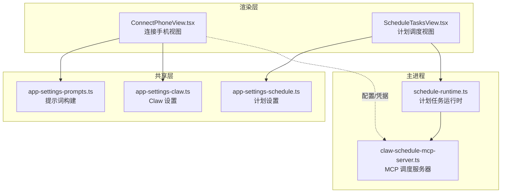
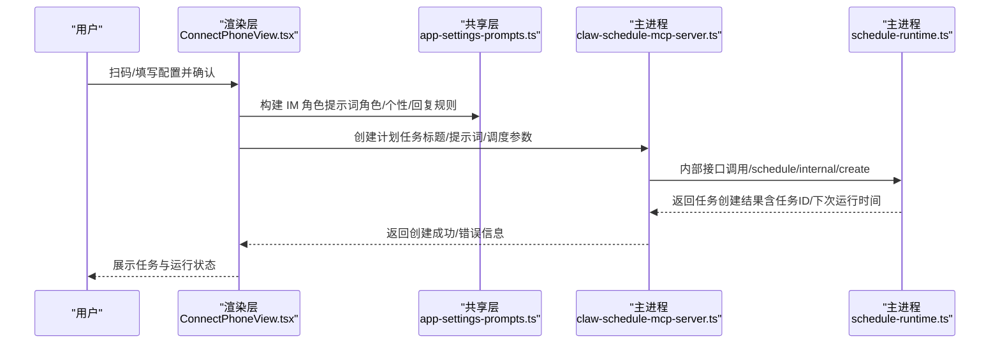
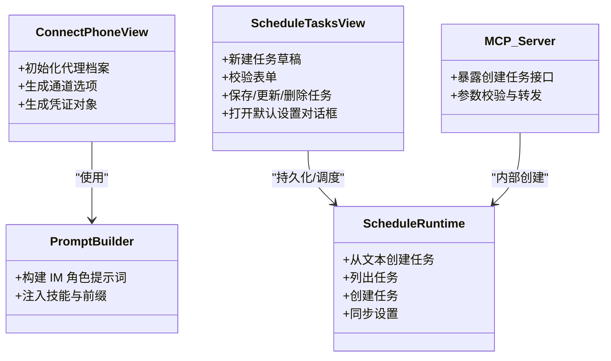
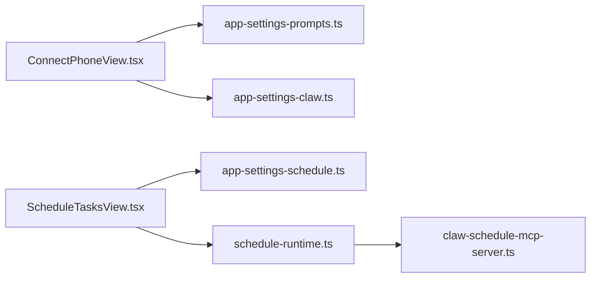

# 自动化场景应用

<cite>
**本文引用的文件**
- [ConnectPhoneView.tsx](file://src/renderer/src/components/chat/ConnectPhoneView.tsx)
- [ConnectPhoneView.test.ts](file://src/renderer/src/components/chat/ConnectPhoneView.test.ts)
- [app-settings-prompts.ts](file://src/shared/app-settings-prompts.ts)
- [app-settings-claw.ts](file://src/shared/app-settings-claw.ts)
- [app-settings-schedule.ts](file://src/shared/app-settings-schedule.ts)
- [claw-schedule-mcp-server.ts](file://src/main/claw-schedule-mcp-server.ts)
- [schedule-runtime.ts](file://src/main/schedule-runtime.ts)
- [ScheduleTasksView.tsx](file://src/renderer/src/components/schedule/ScheduleTasksView.tsx)
- [app-ipc-schemas.test.ts](file://src/main/ipc/app-ipc-schemas.test.ts)
</cite>

## 目录
1. [简介](#简介)
2. [项目结构](#项目结构)
3. [核心组件](#核心组件)
4. [架构总览](#架构总览)
5. [详细组件分析](#详细组件分析)
6. [依赖关系分析](#依赖关系分析)
7. [性能考虑](#性能考虑)
8. [故障排查指南](#故障排查指南)
9. [结论](#结论)
10. [附录](#附录)

## 简介
本指南面向“连接手机模式”的自动化场景应用，围绕三大业务场景提供可落地的配置方案与实施方法：  
- 客户服务自动化：自动回复、工单分配  
- 项目管理自动化：进度提醒、任务通知  
- 个人助理自动化：日程管理、信息收集  

文档将从系统架构、组件职责、数据流与处理逻辑入手，结合代码级可视化图示，给出命令定义、触发条件、配置步骤、最佳实践与性能优化建议，并覆盖多场景组合与复杂流程设计思路。

## 项目结构
本项目在渲染层提供“连接手机视图”与“计划调度视图”，在主进程侧提供运行时与 MCP 服务器，共享层负责应用设置与提示词构建。下图展示与自动化场景相关的模块关系：

图表来源
- [ConnectPhoneView.tsx](file://src/renderer/src/components/chat/ConnectPhoneView.tsx)
- [ScheduleTasksView.tsx](file://src/renderer/src/components/schedule/ScheduleTasksView.tsx)
- [schedule-runtime.ts](file://src/main/schedule-runtime.ts)
- [claw-schedule-mcp-server.ts](file://src/main/claw-schedule-mcp-server.ts)
- [app-settings-prompts.ts](file://src/shared/app-settings-prompts.ts)
- [app-settings-claw.ts](file://src/shared/app-settings-claw.ts)
- [app-settings-schedule.ts](file://src/shared/app-settings-schedule.ts)

章节来源
- [ConnectPhoneView.tsx](file://src/renderer/src/components/chat/ConnectPhoneView.tsx)
- [ScheduleTasksView.tsx](file://src/renderer/src/components/schedule/ScheduleTasksView.tsx)
- [schedule-runtime.ts](file://src/main/schedule-runtime.ts)
- [claw-schedule-mcp-server.ts](file://src/main/claw-schedule-mcp-server.ts)
- [app-settings-prompts.ts](file://src/shared/app-settings-prompts.ts)
- [app-settings-claw.ts](file://src/shared/app-settings-claw.ts)
- [app-settings-schedule.ts](file://src/shared/app-settings-schedule.ts)

## 核心组件
- 连接手机视图（IM 渠道）：用于初始化“手机助手”角色、设定个性与回复规则、选择即时通讯提供商（飞书/微信），并生成默认通道参数与凭证模板。  
- 计划任务运行时：负责解析用户输入文本创建计划任务、持久化任务列表、计算下次执行时间、记录运行状态与线程 ID。  
- MCP 调度服务器：对外暴露创建计划任务的接口，接收标题、提示词、调度类型与时序参数，转发到主进程运行时进行创建与同步。  
- 提示词构建器：将角色、个性、用户上下文、回复规则等注入到运行时提示词中，形成统一的“受管指令”前缀。  
- 应用设置（Claw/Schedule）：规范化并持久化自动化策略、技能目录、默认模型、推理强度、任务列表等。

章节来源
- [ConnectPhoneView.tsx](file://src/renderer/src/components/chat/ConnectPhoneView.tsx)
- [schedule-runtime.ts](file://src/main/schedule-runtime.ts)
- [claw-schedule-mcp-server.ts](file://src/main/claw-schedule-mcp-server.ts)
- [app-settings-prompts.ts](file://src/shared/app-settings-prompts.ts)
- [app-settings-claw.ts](file://src/shared/app-settings-claw.ts)
- [app-settings-schedule.ts](file://src/shared/app-settings-schedule.ts)

## 架构总览
下图展示从“连接手机视图”到“MCP 调度服务器”再到“计划任务运行时”的端到端流程，以及提示词构建对运行时的影响。

图表来源
- [ConnectPhoneView.tsx](file://src/renderer/src/components/chat/ConnectPhoneView.tsx)
- [app-settings-prompts.ts](file://src/shared/app-settings-prompts.ts)
- [claw-schedule-mcp-server.ts](file://src/main/claw-schedule-mcp-server.ts)
- [schedule-runtime.ts](file://src/main/schedule-runtime.ts)

## 详细组件分析

### 客户服务自动化（自动回复、工单分配）
目标：基于 IM 渠道的“手机助手”角色，实现自动回复与工单派发；支持按用户上下文与回复规则生成一致风格的响应。

- 角色与回复规则注入
  - 使用提示词构建器将“角色身份、个性、用户上下文、回复规则”注入到运行时提示词中，确保每次对话风格一致。  
  - 参考：[app-settings-prompts.ts](file://src/shared/app-settings-prompts.ts)

- 连接手机视图配置
  - 初始化默认通道参数（模型、启用开关、IM 提供商），并生成默认代理档案（名称、描述、身份、个性、用户上下文、回复规则）。  
  - 参考：[ConnectPhoneView.tsx](file://src/renderer/src/components/chat/ConnectPhoneView.tsx)

- 工单分配与派发
  - 建议通过“计划任务运行时”在特定时间点扫描未处理消息，根据关键词或规则提取工单字段，调用外部系统接口完成派发。  
  - 参考：[schedule-runtime.ts](file://src/main/schedule-runtime.ts)

- 触发条件建议
  - 新消息到达（IM 事件）→ 触发自动回复与规则匹配  
  - 定时扫描（每日/间隔）→ 检查未处理工单并派发

- 最佳实践
  - 将“回复规则”与“工单字段映射”沉淀为可编辑的模板，便于快速迭代  
  - 对高并发场景开启“保持唤醒”以减少冷启动延迟  
  - 对敏感字段进行脱敏与审计日志记录

章节来源
- [app-settings-prompts.ts](file://src/shared/app-settings-prompts.ts)
- [ConnectPhoneView.tsx](file://src/renderer/src/components/chat/ConnectPhoneView.tsx)
- [schedule-runtime.ts](file://src/main/schedule-runtime.ts)

### 项目管理自动化（进度提醒、任务通知）
目标：通过计划任务运行时定期执行“进度检查/任务通知”提示词，向指定渠道推送提醒。

- 任务创建与调度
  - 支持从文本解析创建任务（如“明天上午提醒评审”），并支持多种调度类型：每日、定点、间隔、手动。  
  - 参考：[schedule-runtime.ts](file://src/main/schedule-runtime.ts)，[ScheduleTasksView.tsx](file://src/renderer/src/components/schedule/ScheduleTasksView.tsx)

- MCP 接口对接
  - 外部系统可通过 MCP 服务器提供的接口提交任务请求，内部转交运行时创建并返回结果。  
  - 参考：[claw-schedule-mcp-server.ts](file://src/main/claw-schedule-mcp-server.ts)

- 触发条件与命令定义
  - 文本解析命令：例如“在每天 09:00 提醒评审” → daily 类型，timeOfDay=09:00  
  - 定时命令：例如“每 30 分钟检查一次” → interval 类型，everyMinutes=30  
  - 即时命令：例如“立即执行评审检查” → manual 类型

- 最佳实践
  - 合理设置推理强度（reasoning_effort）与模型（model），平衡准确性与成本  
  - 对任务进行分组与优先级标记，避免通知风暴  
  - 结合 IM 渠道将提醒推送到对应群组或个人

章节来源
- [schedule-runtime.ts](file://src/main/schedule-runtime.ts)
- [ScheduleTasksView.tsx](file://src/renderer/src/components/schedule/ScheduleTasksView.tsx)
- [claw-schedule-mcp-server.ts](file://src/main/claw-schedule-mcp-server.ts)

### 个人助理自动化（日程管理、信息收集）
目标：基于计划任务运行时与提示词构建器，实现日程提醒与信息收集的自动化闭环。

- 日程管理
  - 使用“每日/定点/间隔”调度类型，结合 IM 渠道推送日程提醒  
  - 参考：[ScheduleTasksView.tsx](file://src/renderer/src/components/schedule/ScheduleTasksView.tsx)，[schedule-runtime.ts](file://src/main/schedule-runtime.ts)

- 信息收集
  - 在提示词中定义“收集模板”（如“今日已完成事项/待办事项/阻塞问题”），运行时自动汇总并发送  
  - 参考：[app-settings-prompts.ts](file://src/shared/app-settings-prompts.ts)

- 触发条件
  - 固定时间（如 09:00）→ 发送“今日待办清单”  
  - 间隔周期（如每 1 小时）→ 汇总“最近进展”  
  - 用户触发（如“导出周报”）→ 生成并发送报告

- 最佳实践
  - 将“信息收集模板”标准化，便于跨周/月/季复用  
  - 对输出进行格式化与摘要化，提升可读性  
  - 与工作空间集成，自动读取/写入相关文件

章节来源
- [ScheduleTasksView.tsx](file://src/renderer/src/components/schedule/ScheduleTasksView.tsx)
- [schedule-runtime.ts](file://src/main/schedule-runtime.ts)
- [app-settings-prompts.ts](file://src/shared/app-settings-prompts.ts)

### 组件类图（代码级）

图表来源
- [ConnectPhoneView.tsx](file://src/renderer/src/components/chat/ConnectPhoneView.tsx)
- [ScheduleTasksView.tsx](file://src/renderer/src/components/schedule/ScheduleTasksView.tsx)
- [schedule-runtime.ts](file://src/main/schedule-runtime.ts)
- [claw-schedule-mcp-server.ts](file://src/main/claw-schedule-mcp-server.ts)
- [app-settings-prompts.ts](file://src/shared/app-settings-prompts.ts)

## 依赖关系分析
- 渲染层组件依赖共享层的提示词构建与应用设置，保证运行时行为一致  
- 计划任务运行时依赖主进程存储与同步机制，确保任务持久化与状态追踪  
- MCP 服务器作为外部入口，将请求路由至运行时，形成“外部触发—内部执行”的解耦架构

图表来源
- [ConnectPhoneView.tsx](file://src/renderer/src/components/chat/ConnectPhoneView.tsx)
- [ScheduleTasksView.tsx](file://src/renderer/src/components/schedule/ScheduleTasksView.tsx)
- [schedule-runtime.ts](file://src/main/schedule-runtime.ts)
- [claw-schedule-mcp-server.ts](file://src/main/claw-schedule-mcp-server.ts)
- [app-settings-prompts.ts](file://src/shared/app-settings-prompts.ts)
- [app-settings-claw.ts](file://src/shared/app-settings-claw.ts)
- [app-settings-schedule.ts](file://src/shared/app-settings-schedule.ts)

章节来源
- [ConnectPhoneView.tsx](file://src/renderer/src/components/chat/ConnectPhoneView.tsx)
- [ScheduleTasksView.tsx](file://src/renderer/src/components/schedule/ScheduleTasksView.tsx)
- [schedule-runtime.ts](file://src/main/schedule-runtime.ts)
- [claw-schedule-mcp-server.ts](file://src/main/claw-schedule-mcp-server.ts)
- [app-settings-prompts.ts](file://src/shared/app-settings-prompts.ts)
- [app-settings-claw.ts](file://src/shared/app-settings-claw.ts)
- [app-settings-schedule.ts](file://src/shared/app-settings-schedule.ts)

## 性能考虑
- 合理设置推理强度与模型：在保证质量的前提下降低成本与延迟  
- 保持系统常驻（保持唤醒）：减少冷启动带来的首包延迟  
- 任务批量化与去重：合并相似任务，避免重复执行  
- 输出摘要化：对长文本进行摘要与分段，提升阅读效率  
- 缓存与预热：对常用工具与检索结果进行缓存，缩短响应时间

## 故障排查指南
- 无法创建计划任务
  - 检查输入参数是否符合约束（标题/提示词必填、间隔分钟范围、时间格式等）  
  - 参考：[app-ipc-schemas.test.ts](file://src/main/ipc/app-ipc-schemas.test.ts)，[ScheduleTasksView.tsx](file://src/renderer/src/components/schedule/ScheduleTasksView.tsx)

- 任务未按时执行
  - 核对任务状态、下次运行时间与调度类型（daily/at/interval/manual）  
  - 参考：[schedule-runtime.ts](file://src/main/schedule-runtime.ts)

- IM 渠道未生效
  - 确认通道启用、提供商配置正确、凭证已创建并过期时间合理  
  - 参考：[ConnectPhoneView.tsx](file://src/renderer/src/components/chat/ConnectPhoneView.tsx)

- 提示词未生效
  - 检查角色/个性/回复规则是否注入到运行时提示词中  
  - 参考：[app-settings-prompts.ts](file://src/shared/app-settings-prompts.ts)

章节来源
- [app-ipc-schemas.test.ts](file://src/main/ipc/app-ipc-schemas.test.ts)
- [ScheduleTasksView.tsx](file://src/renderer/src/components/schedule/ScheduleTasksView.tsx)
- [schedule-runtime.ts](file://src/main/schedule-runtime.ts)
- [ConnectPhoneView.tsx](file://src/renderer/src/components/chat/ConnectPhoneView.tsx)
- [app-settings-prompts.ts](file://src/shared/app-settings-prompts.ts)

## 结论
通过“连接手机视图 + 计划任务运行时 + MCP 服务器 + 提示词构建”的协同，本项目为客服、项目管理与个人助理三大场景提供了可扩展、可配置、可观测的自动化能力。建议在实际部署中结合业务需求，将“规则模板化、任务结构化、输出摘要化”，并持续优化调度策略与推理配置，以获得更稳定高效的自动化体验。

## 附录
- 场景间组合使用建议
  - 客服自动回复 + 项目进度提醒：在客服回复后，自动派发工单并在固定时间推送进度  
  - 个人助理 + 项目管理：在日程提醒中嵌入“今日待办/阻塞问题”，并在下班前汇总当日进展  
- 复杂流程设计思路
  - 以“计划任务运行时”为核心编排器，串联多个子任务与外部系统调用  
  - 通过“提示词构建器”统一风格与上下文，确保跨场景一致性  
  - 使用“MCP 服务器”对外暴露接口，便于第三方系统接入与扩展