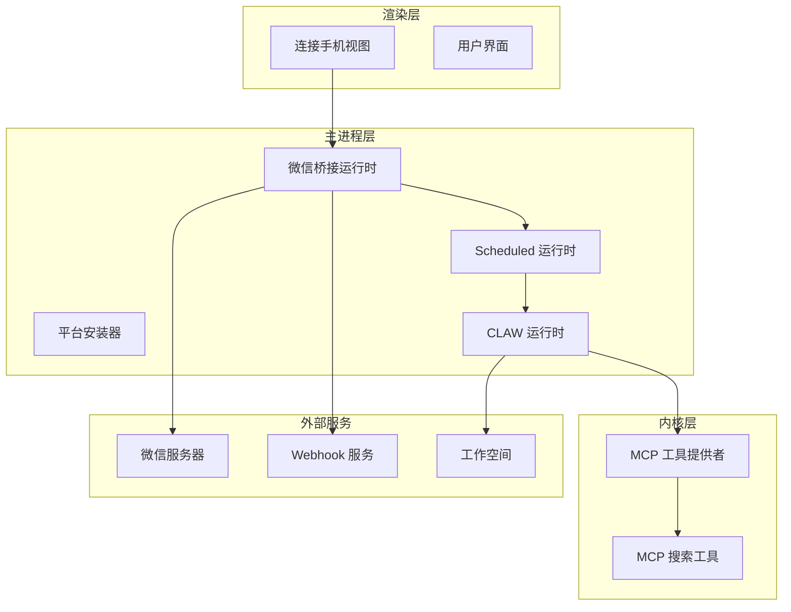
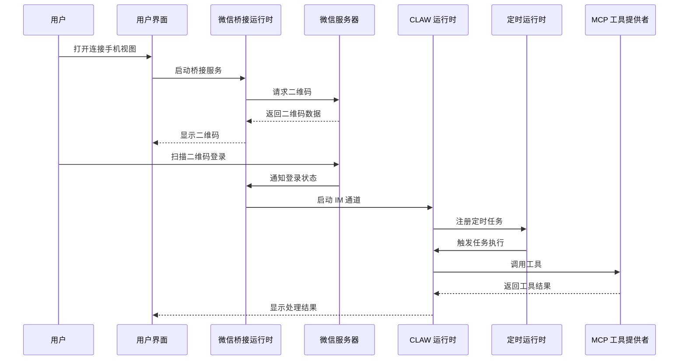
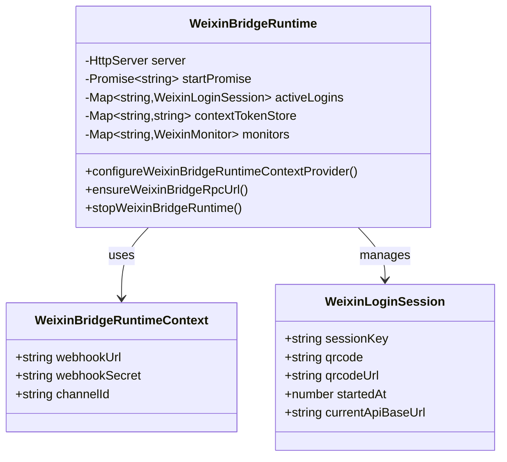
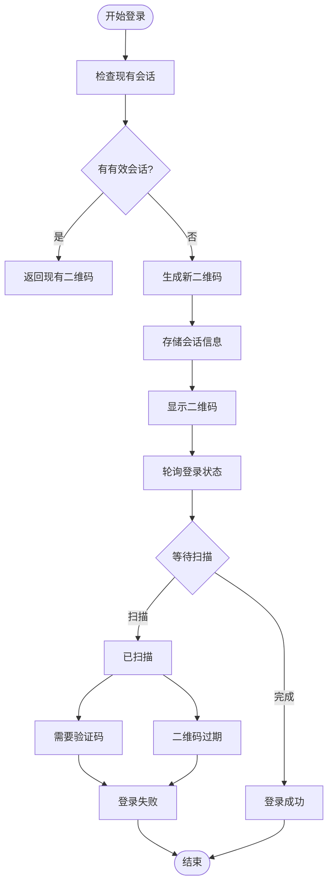
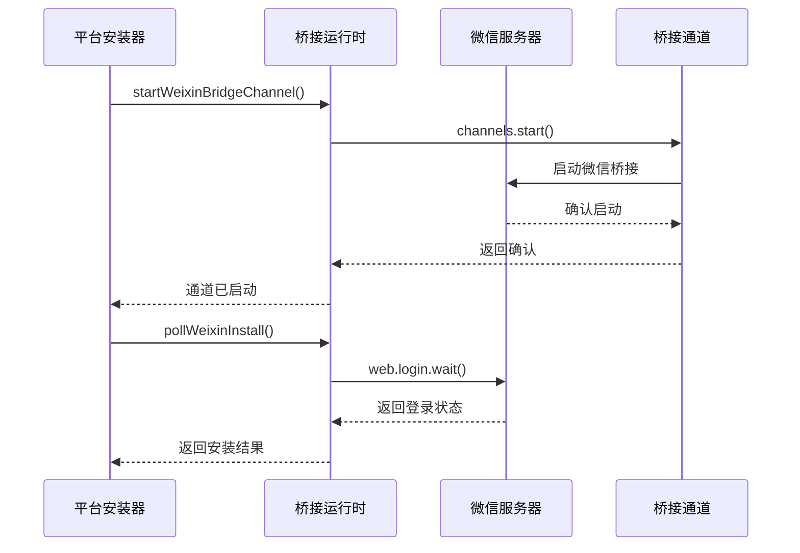
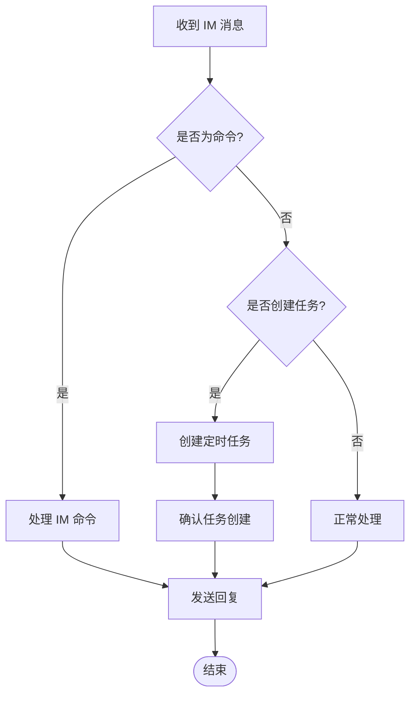
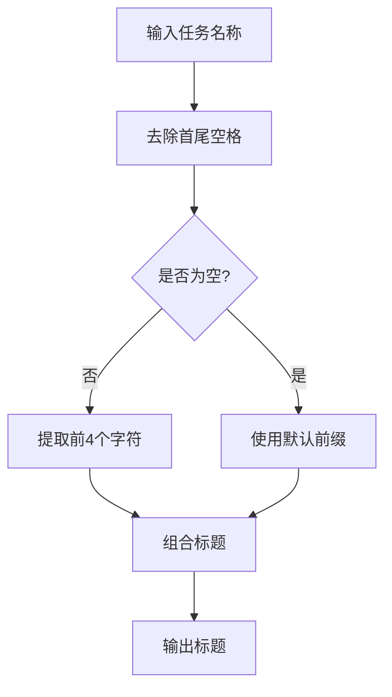
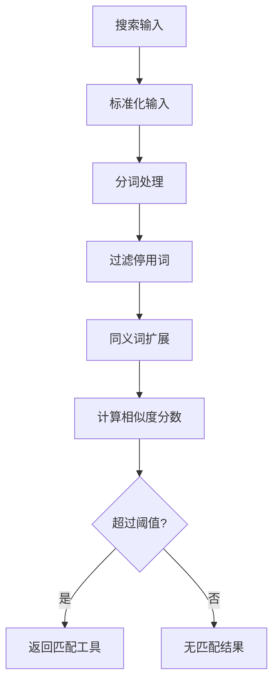
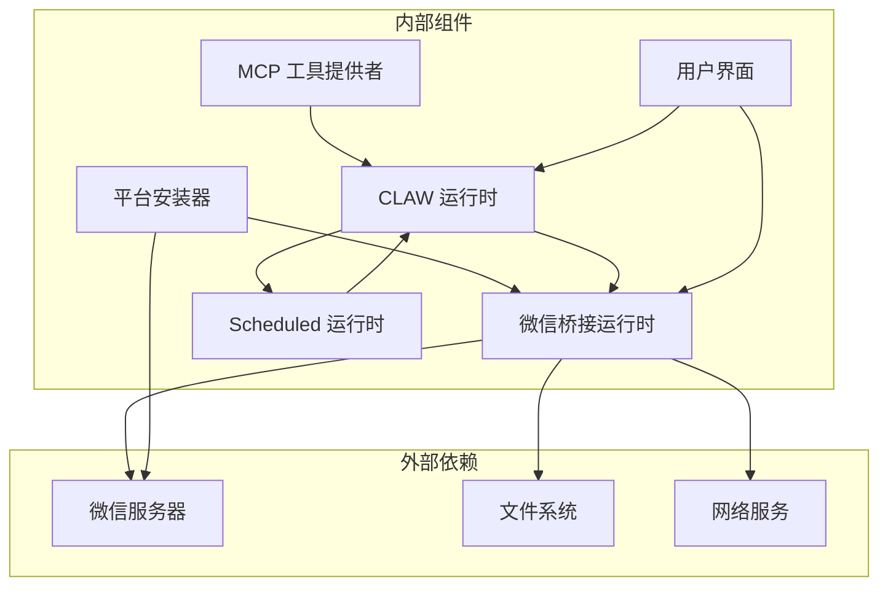

# 连接手机模式使用指南

<cite>
**本文档引用的文件**
- [weixin-bridge-runtime.ts](file://src/main/weixin-bridge-runtime.ts)
- [claw-platform-install.ts](file://src/main/claw-platform-install.ts)
- [claw-runtime.ts](file://src/main/claw-runtime.ts)
- [schedule-runtime.ts](file://src/main/schedule-runtime.ts)
- [mcp-tool-provider.ts](file://kun/src/adapters/tool/mcp-tool-provider.ts)
- [mcp-tool-search.ts](file://kun/src/adapters/tool/mcp-tool-search.ts)
- [ConnectPhoneView.tsx](file://src/renderer/src/components/chat/ConnectPhoneView.tsx)
</cite>

## 目录
1. [简介](#简介)
2. [项目结构](#项目结构)
3. [核心组件](#核心组件)
4. [架构概览](#架构概览)
5. [详细组件分析](#详细组件分析)
6. [依赖关系分析](#依赖关系分析)
7. [性能考虑](#性能考虑)
8. [故障排除指南](#故障排除指南)
9. [结论](#结论)
10. [附录](#附录)

## 简介

连接手机模式是 DeepSeek-GUI 中的一个重要功能模块，它允许用户通过微信桥接运行时与手机端进行智能交互。该系统集成了实时消息传输、定时任务调度、IM 自动化工作流程以及 MCP 协议支持，为用户提供了一个完整的移动端智能助手解决方案。

本指南将深入介绍连接手机模式的配置和使用方法，包括微信桥接运行时的设置、定时任务调度系统、IM 自动化工作流程的实现细节，以及 MCP 协议的使用方法。同时，我们将提供任务监控和日志查看的方法、错误处理和故障排除策略，以及自动化脚本编写、Webhook 配置和安全设置等高级功能。

## 项目结构

连接手机模式涉及多个层次的组件协作，从底层的微信桥接运行时到上层的用户界面组件，形成了一个完整的生态系统。



**图表来源**
- [weixin-bridge-runtime.ts:1003-1064](file://src/main/weixin-bridge-runtime.ts#L1003-L1064)
- [claw-platform-install.ts:322-350](file://src/main/claw-platform-install.ts#L322-L350)
- [schedule-runtime.ts:55-91](file://src/main/schedule-runtime.ts#L55-L91)

**章节来源**
- [weixin-bridge-runtime.ts:98-137](file://src/main/weixin-bridge-runtime.ts#L98-L137)
- [claw-platform-install.ts:177-205](file://src/main/claw-platform-install.ts#L177-L205)

## 核心组件

连接手机模式由以下几个核心组件构成：

### 微信桥接运行时
微信桥接运行时是整个系统的基础，负责与微信服务器通信、管理登录状态、处理消息传输和健康检查。

### 平台安装器
平台安装器负责启动微信桥接通道、处理登录流程和会话管理。

### CLAW 运行时
CLAW 运行时处理 IM 消息、命令解析和任务创建。

### 定时运行时
定时运行时管理调度任务的执行和监控。

### MCP 工具提供者
MCP 工具提供者支持 MCP 协议，扩展系统的工具调用能力。

**章节来源**
- [weixin-bridge-runtime.ts:100-137](file://src/main/weixin-bridge-runtime.ts#L100-L137)
- [claw-platform-install.ts:211-214](file://src/main/claw-platform-install.ts#L211-L214)
- [claw-runtime.ts:910-954](file://src/main/claw-runtime.ts#L910-L954)
- [schedule-runtime.ts:55-91](file://src/main/schedule-runtime.ts#L55-L91)

## 架构概览

连接手机模式采用分层架构设计，确保了系统的可扩展性和维护性。



**图表来源**
- [weixin-bridge-runtime.ts:535-571](file://src/main/weixin-bridge-runtime.ts#L535-L571)
- [claw-platform-install.ts:322-350](file://src/main/claw-platform-install.ts#L322-L350)
- [claw-runtime.ts:910-954](file://src/main/claw-runtime.ts#L910-L954)

## 详细组件分析

### 微信桥接运行时

微信桥接运行时是连接手机模式的核心组件，负责处理与微信服务器的所有通信。

#### 关键特性
- **自动端口管理**: 支持动态选择可用端口，避免端口冲突
- **健康检查机制**: 定期检查桥接服务的运行状态
- **会话管理**: 维护活跃的微信登录会话
- **监控系统**: 实时监控微信连接状态

#### 核心数据结构



**图表来源**
- [weixin-bridge-runtime.ts:100-137](file://src/main/weixin-bridge-runtime.ts#L100-L137)
- [weixin-bridge-runtime.ts:535-571](file://src/main/weixin-bridge-runtime.ts#L535-L571)

#### 登录流程



**图表来源**
- [weixin-bridge-runtime.ts:535-598](file://src/main/weixin-bridge-runtime.ts#L535-L598)

**章节来源**
- [weixin-bridge-runtime.ts:1003-1064](file://src/main/weixin-bridge-runtime.ts#L1003-L1064)
- [weixin-bridge-runtime.ts:535-598](file://src/main/weixin-bridge-runtime.ts#L535-L598)

### 平台安装器

平台安装器负责管理微信桥接的启动和停止过程。

#### 关键功能
- **桥接通道启动**: 启动微信桥接服务
- **登录轮询**: 轮询微信登录状态
- **会话管理**: 管理设备代码和会话映射

#### 核心流程



**图表来源**
- [claw-platform-install.ts:211-214](file://src/main/claw-platform-install.ts#L211-L214)
- [claw-platform-install.ts:322-350](file://src/main/claw-platform-install.ts#L322-L350)

**章节来源**
- [claw-platform-install.ts:177-205](file://src/main/claw-platform-install.ts#L177-L205)
- [claw-platform-install.ts:322-350](file://src/main/claw-platform-install.ts#L322-L350)

### CLAW 运行时

CLAW 运行时处理 IM 消息和命令，是连接手机模式的智能中枢。

#### 核心功能
- **IM 命令处理**: 解析和执行 IM 命令
- **任务创建**: 从文本内容创建定时任务
- **消息回复**: 处理消息回复和上下文

#### 消息处理流程



**图表来源**
- [claw-runtime.ts:910-954](file://src/main/claw-runtime.ts#L910-L954)
- [claw-runtime.ts:1375-1408](file://src/main/claw-runtime.ts#L1375-L1408)

**章节来源**
- [claw-runtime.ts:910-954](file://src/main/claw-runtime.ts#L910-L954)
- [claw-runtime.ts:1375-1408](file://src/main/claw-runtime.ts#L1375-L1408)

### 定时运行时

定时运行时管理所有调度任务的执行和监控。

#### 核心特性
- **任务调度**: 管理各种类型的定时任务
- **状态监控**: 监控运行中任务的状态
- **电源保护**: 防止应用挂起影响任务执行

#### 任务标题生成



**图表来源**
- [schedule-runtime.ts:48-53](file://src/main/schedule-runtime.ts#L48-L53)

**章节来源**
- [schedule-runtime.ts:48-53](file://src/main/schedule-runtime.ts#L48-L53)
- [schedule-runtime.ts:55-91](file://src/main/schedule-runtime.ts#L55-L91)

### MCP 工具提供者

MCP 工具提供者支持 MCP 协议，扩展系统的工具调用能力。

#### 核心功能
- **工具发现**: 自动发现和注册 MCP 工具
- **连接管理**: 管理 MCP 服务器连接状态
- **搜索功能**: 提供智能工具搜索和匹配

#### 工具搜索算法



**图表来源**
- [mcp-tool-search.ts:14-55](file://kun/src/adapters/tool/mcp-tool-search.ts#L14-L55)

**章节来源**
- [mcp-tool-provider.ts:94-120](file://kun/src/adapters/tool/mcp-tool-provider.ts#L94-L120)
- [mcp-tool-search.ts:14-55](file://kun/src/adapters/tool/mcp-tool-search.ts#L14-L55)

### 连接手机视图

连接手机视图是用户界面的核心组件，提供直观的操作界面。

#### 主要功能
- **二维码显示**: 显示微信登录二维码
- **状态指示**: 显示连接状态和进度
- **操作控制**: 提供连接和断开操作

**章节来源**
- [ConnectPhoneView.tsx:170](file://src/renderer/src/components/chat/ConnectPhoneView.tsx#L170)

## 依赖关系分析

连接手机模式的各个组件之间存在复杂的依赖关系，形成了一个有机的整体。



**图表来源**
- [weixin-bridge-runtime.ts:1003-1064](file://src/main/weixin-bridge-runtime.ts#L1003-L1064)
- [claw-platform-install.ts:322-350](file://src/main/claw-platform-install.ts#L322-L350)

**章节来源**
- [weixin-bridge-runtime.ts:1003-1064](file://src/main/weixin-bridge-runtime.ts#L1003-L1064)
- [claw-platform-install.ts:322-350](file://src/main/claw-platform-install.ts#L322-L350)

## 性能考虑

连接手机模式在设计时充分考虑了性能优化，确保在各种使用场景下都能提供流畅的用户体验。

### 内存管理
- 使用 Map 数据结构高效管理会话状态
- 实现会话过期清理机制
- 最大化复用连接资源

### 网络优化
- 实现连接池管理
- 优化请求超时设置
- 减少不必要的网络往返

### 并发处理
- 使用异步非阻塞 I/O
- 实现任务队列管理
- 支持多任务并发执行

## 故障排除指南

### 常见问题及解决方案

#### 微信登录失败
**症状**: 二维码无法生成或登录状态异常
**解决方案**:
1. 检查网络连接状态
2. 重启微信桥接服务
3. 清除会话缓存后重试

#### 定时任务执行失败
**症状**: 任务按时执行但结果异常
**解决方案**:
1. 检查任务配置参数
2. 查看任务执行日志
3. 验证工具可用性

#### MCP 工具调用错误
**症状**: 工具调用返回错误或无响应
**解决方案**:
1. 检查 MCP 服务器连接状态
2. 验证工具权限设置
3. 更新工具版本

### 日志查看方法

系统提供了完善的日志记录机制，便于问题诊断和性能监控。

#### 日志级别
- **INFO**: 一般信息和状态变更
- **WARN**: 警告信息和潜在问题
- **ERROR**: 错误信息和异常情况

#### 日志位置
- 应用程序日志: 存储在应用程序数据目录
- 连接日志: 特定于微信桥接连接
- 任务日志: 记录定时任务执行详情

**章节来源**
- [weixin-bridge-runtime.ts:527](file://src/main/weixin-bridge-runtime.ts#L527)
- [weixin-bridge-runtime.ts:888](file://src/main/weixin-bridge-runtime.ts#L888)

## 结论

连接手机模式作为 DeepSeek-GUI 的重要组成部分，通过精心设计的架构和丰富的功能特性，为用户提供了完整的移动端智能助手解决方案。该系统不仅具备强大的微信桥接能力，还集成了定时任务调度、IM 自动化工作流程和 MCP 协议支持，能够满足各种复杂的自动化需求。

通过本指南的学习，用户可以深入了解连接手机模式的工作原理，掌握正确的配置和使用方法，并能够在遇到问题时进行有效的故障排除。随着技术的不断发展，连接手机模式将继续演进，为用户带来更好的使用体验。

## 附录

### 配置示例

#### 基础配置
```json
{
  "claw": {
    "im": {
      "mode": "phone",
      "enabled": true
    }
  },
  "weixin": {
    "bridgePort": 8787,
    "webhookUrl": "http://localhost:8787/claw/im",
    "webhookSecret": ""
  }
}
```

#### 高级配置
```json
{
  "schedule": {
    "enabled": true,
    "tasks": [
      {
        "name": "每日报告",
        "schedule": {
          "kind": "at",
          "timeOfDay": "09:00"
        },
        "actions": ["send_message", "generate_report"]
      }
    ]
  },
  "mcp": {
    "enabled": true,
    "servers": {
      "github": {
        "transport": "stdio",
        "command": "node",
        "args": ["./mcp-github.js"],
        "trustScope": "workspace",
        "trustedWorkspaceRoots": ["/path/to/project"]
      }
    }
  }
}
```

### 使用案例

#### 客户服务场景
- 自动回复客户咨询
- 生成服务报告
- 跟踪客户反馈

#### 项目管理场景
- 生成项目进度报告
- 分配任务给团队成员
- 跟踪项目里程碑

#### 个人助理场景
- 管理个人日程
- 发送提醒通知
- 整理个人文档