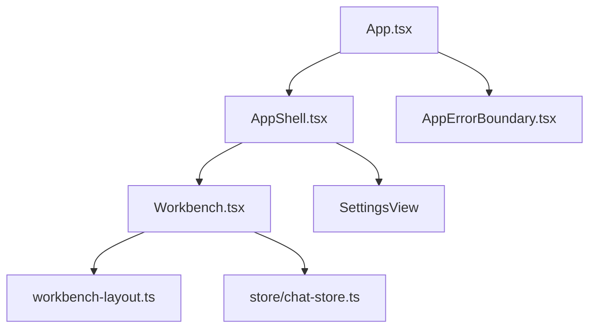
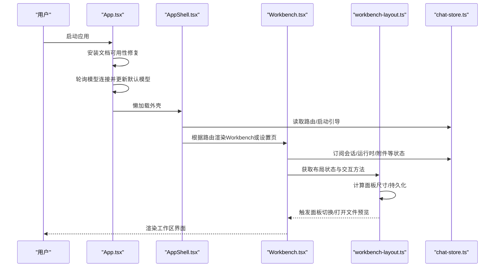
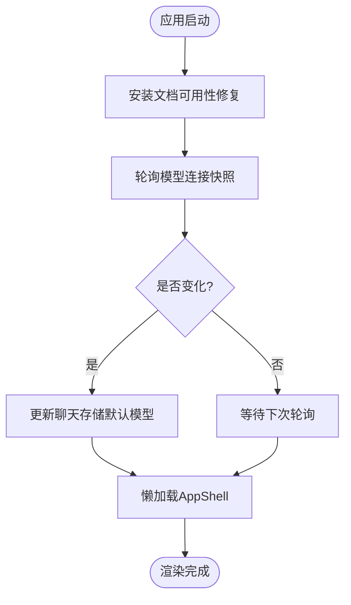
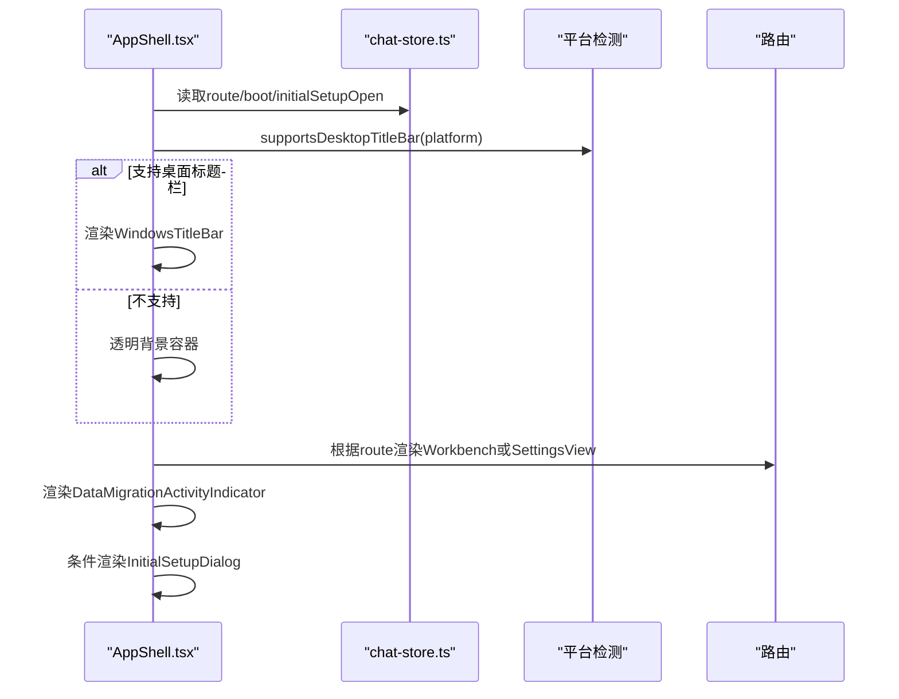
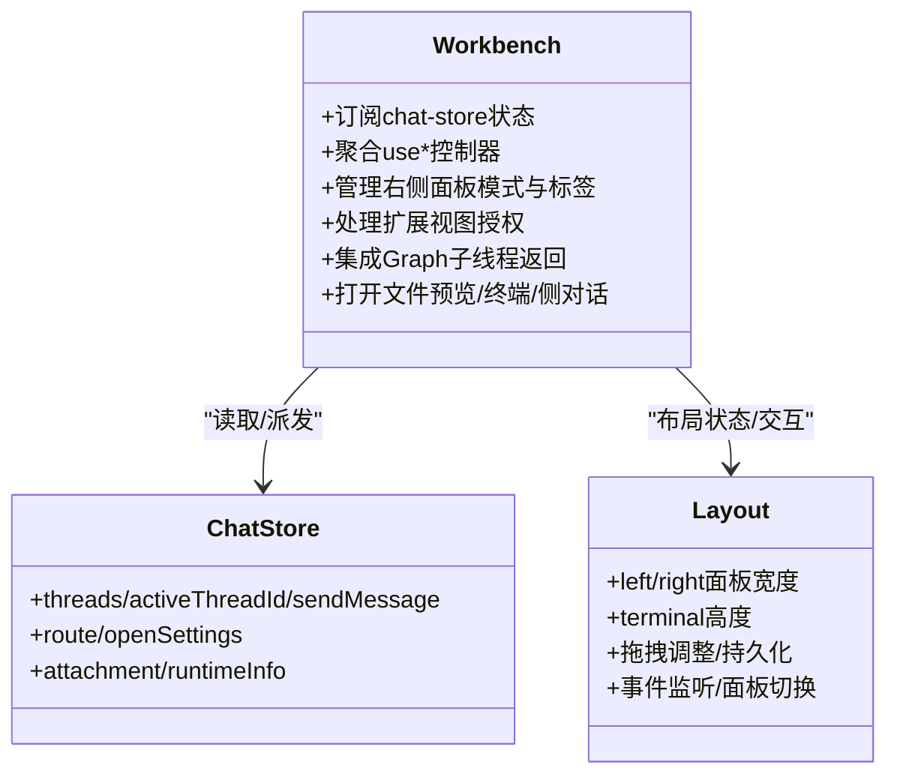
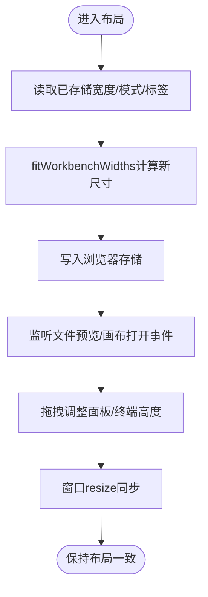
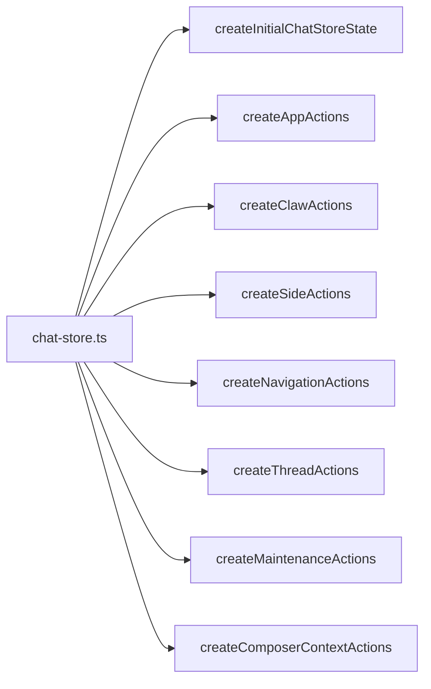
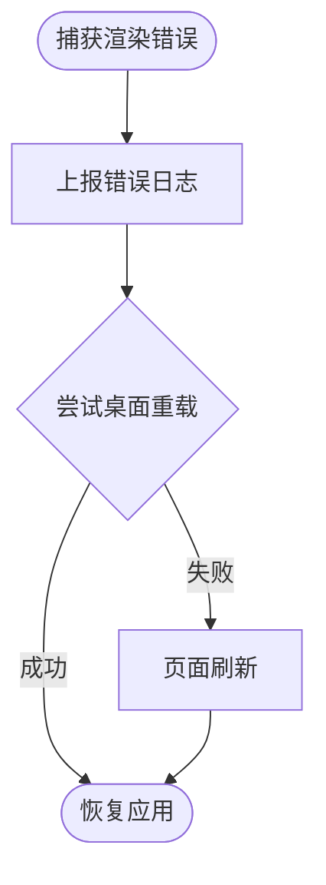
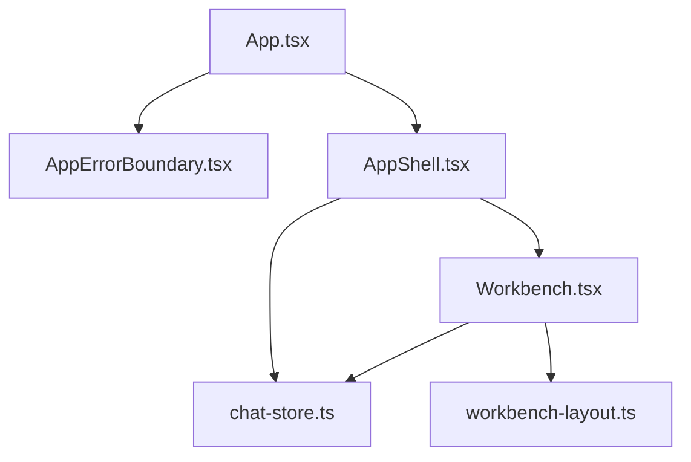

# GUI界面架构

<cite>
**本文引用的文件**
- [App.tsx](file://src/renderer/src/App.tsx)
- [AppShell.tsx](file://src/renderer/src/AppShell.tsx)
- [Workbench.tsx](file://src/renderer/src/components/Workbench.tsx)
- [workbench-layout.ts](file://src/renderer/src/components/workbench-layout.ts)
- [chat-store.ts](file://src/renderer/src/store/chat-store.ts)
- [AppErrorBoundary.tsx](file://src/renderer/src/components/AppErrorBoundary.tsx)
</cite>

## 目录
1. [简介](#简介)
2. [项目结构](#项目结构)
3. [核心组件](#核心组件)
4. [架构总览](#架构总览)
5. [详细组件分析](#详细组件分析)
6. [依赖关系分析](#依赖关系分析)
7. [性能考虑](#性能考虑)
8. [故障排查指南](#故障排查指南)
9. [结论](#结论)
10. [附录](#附录)

## 简介
本文件面向DeepSeek-GUI的GUI界面架构，聚焦React组件层次、工作区布局系统、组件通信机制与状态管理。重点说明根组件App.tsx的组织方式、工作区(Workbench)的核心功能（会话管理、文件浏览器、设置面板、工具栏）、响应式布局设计（窗口大小适配、多显示器与跨平台兼容），以及基于Zustand的状态管理模式、组件间数据传递与事件系统。同时提供组件开发最佳实践、性能优化建议与错误边界处理方案，并给出具体代码示例路径与使用模式。

## 项目结构
渲染进程入口采用“根组件 + Shell + Workbench”的分层组织：
- App.tsx：应用启动、全局生命周期、错误边界与懒加载外壳。
- AppShell.tsx：路由选择（Workbench/SettingsView）、平台标题栏、扩展服务上下文、初始设置对话框。
- components/Workbench.tsx：工作区编排中心，聚合大量use*控制器，驱动左右侧边栏、右侧面板、终端、计划面板、写作助手与设计助手等。
- components/workbench-layout.ts：工作区布局与尺寸计算、拖拽调整、持久化存储、事件监听与面板切换逻辑。
- store/chat-store.ts：基于Zustand的全局状态与动作集合，贯穿会话、导航、运行时、附件、模型选择等。

图表来源
- [App.tsx:1-113](file://src/renderer/src/App.tsx#L1-L113)
- [AppShell.tsx:1-103](file://src/renderer/src/AppShell.tsx#L1-L103)
- [Workbench.tsx:1-120](file://src/renderer/src/components/Workbench.tsx#L1-L120)
- [workbench-layout.ts:1-120](file://src/renderer/src/components/workbench-layout.ts#L1-L120)
- [chat-store.ts:1-201](file://src/renderer/src/store/chat-store.ts#L1-L201)
- [AppErrorBoundary.tsx:1-81](file://src/renderer/src/components/AppErrorBoundary.tsx#L1-L81)

章节来源
- [App.tsx:1-113](file://src/renderer/src/App.tsx#L1-L113)
- [AppShell.tsx:1-103](file://src/renderer/src/AppShell.tsx#L1-L103)
- [Workbench.tsx:1-120](file://src/renderer/src/components/Workbench.tsx#L1-L120)
- [workbench-layout.ts:1-120](file://src/renderer/src/components/workbench-layout.ts#L1-L120)
- [chat-store.ts:1-201](file://src/renderer/src/store/chat-store.ts#L1-L201)
- [AppErrorBoundary.tsx:1-81](file://src/renderer/src/components/AppErrorBoundary.tsx#L1-L81)

## 核心组件
- App.tsx
  - 职责：挂载错误边界、初始化文档可用性修复、同步共享模型连接、懒加载AppShell并提供启动占位。
  - 关键点：通过window.kunGui.runtimeRequest轮询模型连接变更，更新聊天存储中的默认模型与提供者；Suspense包裹主壳以延迟加载。
- AppShell.tsx
  - 职责：根据路由决定显示Workbench或SettingsView；注入扩展设置服务上下文；处理桌面标题栏与迁移进度指示器；打开初始设置对话框。
  - 关键点：支持Windows桌面标题栏；按平台与环境动态设置窗口标题；懒加载Workbench与SettingsView。
- Workbench.tsx
  - 职责：工作区编排中枢，聚合多个use*控制器，协调会话、文件树、SDD线程、提交、导航、设计/写作助手、运行时元数据、执行设置、键盘快捷键、附件、计划面板、扩展贡献等。
  - 关键点：集中订阅chat-store派生状态；统一管理右侧面板模式与标签；处理扩展视图授权与权限；集成Graph子线程返回目标；维护开发预览自动打开。
- workbench-layout.ts
  - 职责：工作区布局状态机与尺寸计算；左右侧边栏宽度与折叠状态；右侧面板模式与标签；终端高度；拖拽调整；本地存储持久化；窗口resize自适应。
  - 关键点：fitWorkbenchWidths算法保证主区域最小宽度与两侧面板约束；按工作区作用域隔离右侧面板标签与宽度；事件总线驱动文件预览与画布打开。
- chat-store.ts
  - 职责：基于Zustand创建全局状态与动作集合；组合应用、Claw、侧边、导航、线程、维护、Composer上下文等动作模块；初始化主题、字体、工作区等。
  - 关键点：统一派发与副作用调度；与运行时客户端交互；持久化与恢复用户偏好；SSE高水位去重与流式块刷新。
- AppErrorBoundary.tsx
  - 职责：捕获渲染期未捕获异常，上报错误日志，提供重载按钮；在桌面环境中优先调用桌面命令重载，否则回退到页面刷新。

章节来源
- [App.tsx:1-113](file://src/renderer/src/App.tsx#L1-L113)
- [AppShell.tsx:1-103](file://src/renderer/src/AppShell.tsx#L1-L103)
- [Workbench.tsx:1-120](file://src/renderer/src/components/Workbench.tsx#L1-L120)
- [workbench-layout.ts:1-120](file://src/renderer/src/components/workbench-layout.ts#L1-L120)
- [chat-store.ts:1-201](file://src/renderer/src/store/chat-store.ts#L1-L201)
- [AppErrorBoundary.tsx:1-81](file://src/renderer/src/components/AppErrorBoundary.tsx#L1-L81)

## 架构总览
整体采用“分层+组合”的React架构：
- 顶层：App错误边界与生命周期，确保稳定性与资源同步。
- 外壳：AppShell负责路由、平台特性、扩展服务上下文与初始设置。
- 工作区：Workbench作为编排中心，组合多个领域控制器（会话、文件、设计、写作、计划、附件、运行时等）。
- 布局：workbench-layout提供统一的布局状态与交互能力，并通过事件系统与外部模块解耦。
- 状态：chat-store基于Zustand提供单一可信源，所有控制器通过hooks读取与派发。

图表来源
- [App.tsx:1-113](file://src/renderer/src/App.tsx#L1-L113)
- [AppShell.tsx:1-103](file://src/renderer/src/AppShell.tsx#L1-L103)
- [Workbench.tsx:1-120](file://src/renderer/src/components/Workbench.tsx#L1-L120)
- [workbench-layout.ts:1-120](file://src/renderer/src/components/workbench-layout.ts#L1-L120)
- [chat-store.ts:1-201](file://src/renderer/src/store/chat-store.ts#L1-L201)

## 详细组件分析

### 根组件App.tsx：启动与生命周期
- 错误边界：包裹整个应用，捕获渲染错误并提示重载。
- 文档可用性修复：在挂载时安装必要的文档可用性补丁。
- 模型连接同步：通过window.kunGui.runtimeRequest轮询模型连接快照，更新聊天存储中的默认模型与提供者；若当前无活动线程且存在默认值则设置composer模型。
- 懒加载外壳：Suspense包裹AppShell，提供启动占位。

图表来源
- [App.tsx:1-113](file://src/renderer/src/App.tsx#L1-L113)

章节来源
- [App.tsx:1-113](file://src/renderer/src/App.tsx#L1-L113)

### 外壳AppShell.tsx：路由与平台适配
- 路由选择：根据chat-store中的route字段决定渲染Workbench或SettingsView。
- 平台标题栏：检测平台是否支持桌面标题栏，必要时渲染WindowsTitleBar。
- 扩展设置服务：注入RuntimeExtensionSettingsService到上下文。
- 初始设置对话框：当initialSetupOpen为真时，安全地渲染初始设置对话框。
- 迁移指示器：显示数据迁移进度。

图表来源
- [AppShell.tsx:1-103](file://src/renderer/src/AppShell.tsx#L1-L103)

章节来源
- [AppShell.tsx:1-103](file://src/renderer/src/AppShell.tsx#L1-L103)

### 工作区Workbench.tsx：编排与控制器聚合
- 会话管理：订阅threads、activeThreadId、sendMessage、createThread等，结合side conversations与Graph子线程返回目标。
- 文件浏览器：通过useWorkbenchFileTreeController管理文件树与预览目标，联动右侧面板标签。
- 设置面板：由AppShell路由控制，Workbench中不直接渲染，但可通过openSettings触发。
- 工具栏：顶部操作与消息操作来自扩展贡献；右侧面板包含文件、计划、终端、侧对话、画布等内置与扩展视图。
- 设计与写作助手：分别通过useWorkbenchDesignRuntime与useWorkbenchWriteAssistantRuntime管理模型、打开状态与上下文。
- 运行时元数据与执行设置：从runtimeConnection与settings中解析技能、执行参数与探针。
- 附件与能力：根据模型能力与运行时信息启用附件上传、粘贴图片、Web访问等。
- 计划面板：通过useWorkbenchPlanController构建与发送计划任务，并与SDD草稿关联。
- 扩展贡献：加载左侧/右侧/辅助/编辑器/全页视图，处理权限授权与视图打开。

图表来源
- [Workbench.tsx:1-120](file://src/renderer/src/components/Workbench.tsx#L1-L120)
- [chat-store.ts:1-201](file://src/renderer/src/store/chat-store.ts#L1-L201)
- [workbench-layout.ts:1-120](file://src/renderer/src/components/workbench-layout.ts#L1-L120)

章节来源
- [Workbench.tsx:1-120](file://src/renderer/src/components/Workbench.tsx#L1-L120)

### 布局workbench-layout.ts：响应式与持久化
- 尺寸计算：fitWorkbenchWidths根据容器宽度、可见面板与约束计算左右面板宽度，保证主区域最小宽度与两侧硬下限。
- 持久化：将左/右侧面板宽度、折叠状态、右侧面板模式、终端高度与工作区作用域的标签与宽度保存到浏览器存储。
- 事件系统：监听WORKSPACE_FILE_PREVIEW_EVENT与CODE_CANVAS_OPEN_REQUEST_EVENT，自动打开文件预览与画布面板。
- 拖拽调整：beginLeftResize/beginRightResize/beginTerminalResize实现指针捕获与实时尺寸更新，结束时释放并清理事件。
- 工作区作用域：按workspaceRootScopeKey隔离不同工作区的右侧面板标签与宽度，避免互相干扰。

图表来源
- [workbench-layout.ts:1-120](file://src/renderer/src/components/workbench-layout.ts#L1-L120)
- [workbench-layout.ts:209-289](file://src/renderer/src/components/workbench-layout.ts#L209-L289)
- [workbench-layout.ts:291-719](file://src/renderer/src/components/workbench-layout.ts#L291-L719)

章节来源
- [workbench-layout.ts:1-120](file://src/renderer/src/components/workbench-layout.ts#L1-L120)
- [workbench-layout.ts:209-289](file://src/renderer/src/components/workbench-layout.ts#L209-L289)
- [workbench-layout.ts:291-719](file://src/renderer/src/components/workbench-layout.ts#L291-L719)

### 状态管理chat-store.ts：Zustand全局状态
- 状态组织：通过create创建ChatState，合并初始状态与各动作模块（应用、Claw、侧边、导航、线程、维护、Composer上下文）。
- 主题与字体：应用主题、字体缩放、内容最大宽度、光标聚光灯、写作排版等。
- 工作区与会话：工作区路径规范化、线程过滤、标题推导、分叉注册与持久化。
- 运行时交互：与rendererRuntimeClient交互，处理SSE高水位去重、流式块刷新、忙态监控与恢复。
- 模型选择：持久化composer模型、推理强度、快速模式，合并模型列表与回退策略。

图表来源
- [chat-store.ts:1-201](file://src/renderer/src/store/chat-store.ts#L1-L201)

章节来源
- [chat-store.ts:1-201](file://src/renderer/src/store/chat-store.ts#L1-L201)

### 错误边界AppErrorBoundary.tsx：容错与恢复
- 捕获渲染错误：记录错误信息与组件堆栈，上报至桌面环境日志。
- 重载策略：优先调用桌面命令reload，失败则回退到页面刷新。
- 用户提示：展示错误标题与消息，提供一键重载按钮。

图表来源
- [AppErrorBoundary.tsx:1-81](file://src/renderer/src/components/AppErrorBoundary.tsx#L1-L81)

章节来源
- [AppErrorBoundary.tsx:1-81](file://src/renderer/src/components/AppErrorBoundary.tsx#L1-L81)

## 依赖关系分析
- App.tsx依赖AppErrorBoundary与AppShell，并通过window.kunGui进行运行时通信。
- AppShell依赖chat-store路由与平台检测，注入扩展设置服务上下文。
- Workbench依赖chat-store派生状态与多个use*控制器，协调布局与扩展贡献。
- workbench-layout依赖浏览器存储与事件系统，提供布局状态与交互方法。
- chat-store依赖运行时客户端、i18n、主题与工具函数，组合各动作模块。

图表来源
- [App.tsx:1-113](file://src/renderer/src/App.tsx#L1-L113)
- [AppShell.tsx:1-103](file://src/renderer/src/AppShell.tsx#L1-L103)
- [Workbench.tsx:1-120](file://src/renderer/src/components/Workbench.tsx#L1-L120)
- [workbench-layout.ts:1-120](file://src/renderer/src/components/workbench-layout.ts#L1-L120)
- [chat-store.ts:1-201](file://src/renderer/src/store/chat-store.ts#L1-L201)

章节来源
- [App.tsx:1-113](file://src/renderer/src/App.tsx#L1-L113)
- [AppShell.tsx:1-103](file://src/renderer/src/AppShell.tsx#L1-L103)
- [Workbench.tsx:1-120](file://src/renderer/src/components/Workbench.tsx#L1-L120)
- [workbench-layout.ts:1-120](file://src/renderer/src/components/workbench-layout.ts#L1-L120)
- [chat-store.ts:1-201](file://src/renderer/src/store/chat-store.ts#L1-L201)

## 性能考虑
- 懒加载：AppShell与Workbench、SettingsView均使用lazy与Suspense，减少首屏体积。
- 状态订阅：Workbench通过useWorkbenchChatStoreState与use*控制器细粒度订阅，避免不必要重渲染。
- 布局计算：fitWorkbenchWidths在useLayoutEffect中同步计算，配合窗口resize事件与拖拽指针捕获，保证流畅体验。
- 持久化：布局相关状态写入浏览器存储，避免重复计算与用户偏好丢失。
- SSE与流式：chat-store维护高水位去重与流式块刷新，降低重复文本与卡顿风险。
- 扩展贡献：按需加载与权限授权，避免一次性加载全部视图。

[本节为通用指导，无需特定文件引用]

## 故障排查指南
- 渲染错误：查看AppErrorBoundary捕获的错误信息与组件堆栈，尝试重载应用。
- 模型连接同步失败：检查App.tsx中轮询逻辑与window.kunGui.runtimeRequest返回值，确认网络与运行时健康。
- 布局异常：检查workbench-layout.ts中的fitWorkbenchWidths与持久化键值，确认浏览器存储可读可写。
- 扩展视图无法打开：确认权限授权流程与贡献快照是否就绪，必要时刷新贡献快照。
- 会话与附件问题：检查chat-store中的附件能力与运行时信息，确认模型是否支持图像输入。

章节来源
- [AppErrorBoundary.tsx:1-81](file://src/renderer/src/components/AppErrorBoundary.tsx#L1-L81)
- [App.tsx:1-113](file://src/renderer/src/App.tsx#L1-L113)
- [workbench-layout.ts:209-289](file://src/renderer/src/components/workbench-layout.ts#L209-L289)
- [Workbench.tsx:1-120](file://src/renderer/src/components/Workbench.tsx#L1-L120)
- [chat-store.ts:1-201](file://src/renderer/src/store/chat-store.ts#L1-L201)

## 结论
DeepSeek-GUI的GUI界面采用清晰的React分层架构与Zustand全局状态管理，Workbench作为编排中心整合会话、文件、设计、写作、计划与扩展贡献，workbench-layout提供稳健的响应式布局与持久化。通过错误边界、懒加载与细粒度状态订阅，系统在复杂场景下仍保持良好性能与可维护性。遵循本文档的最佳实践与故障排查指南，可有效提升开发与调试效率。

[本节为总结，无需特定文件引用]

## 附录
- 组件开发最佳实践
  - 使用use*控制器封装领域逻辑，保持Workbench轻量与可组合。
  - 通过chat-store集中管理状态，避免分散的useState导致不一致。
  - 使用workbench-layout提供的布局API，确保尺寸计算与持久化一致性。
  - 对扩展贡献进行权限校验与快照刷新，避免未授权视图打开。
- 性能优化建议
  - 合理使用lazy与Suspense，拆分大模块。
  - 使用useMemo/useCallback缓存昂贵计算与回调。
  - 避免在高频事件中创建对象，复用引用。
- 错误边界处理
  - 在关键组件外层包裹错误边界，捕获并上报错误。
  - 提供用户友好的重载入口，优先调用桌面命令。

[本节为通用指导，无需特定文件引用]