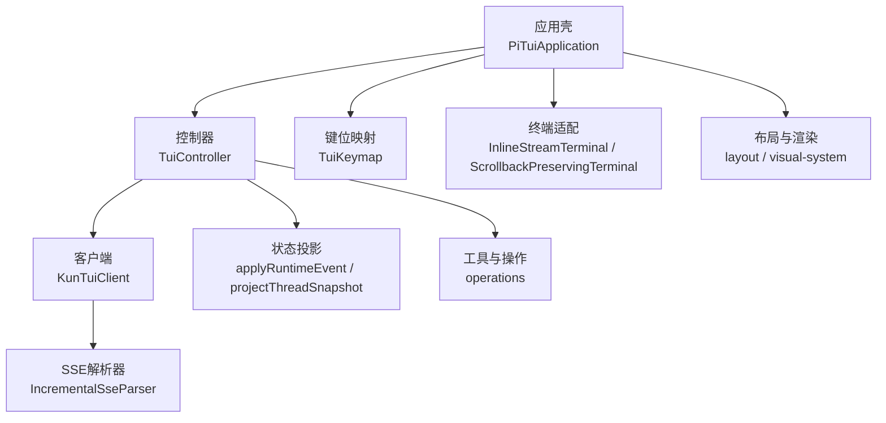
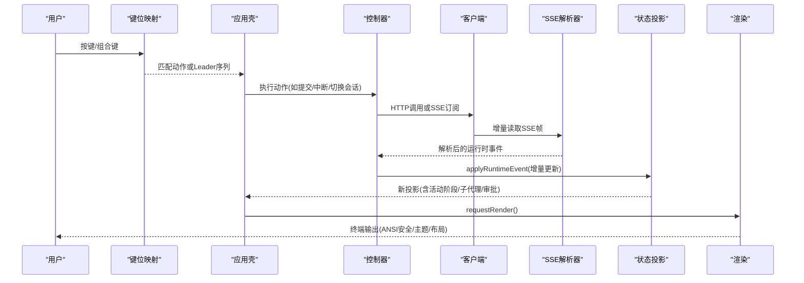
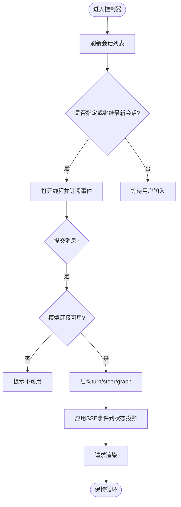
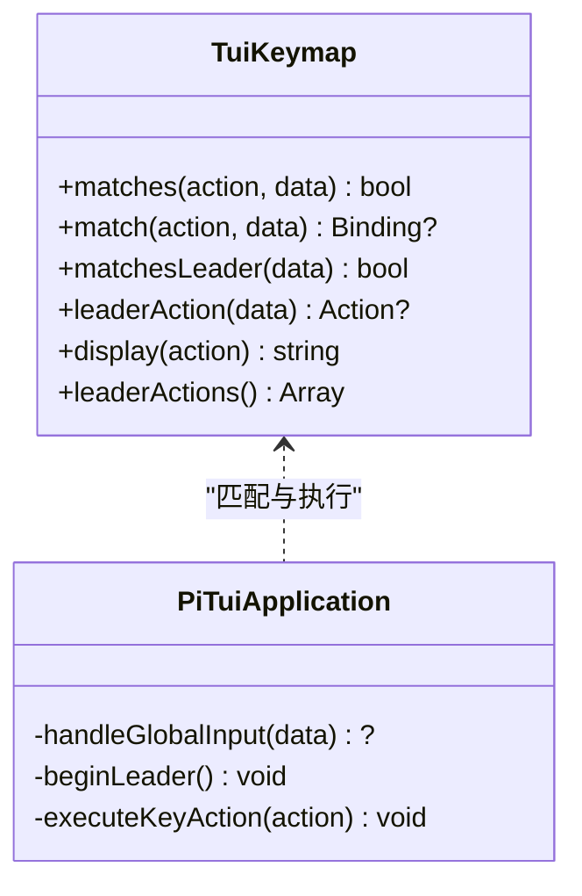
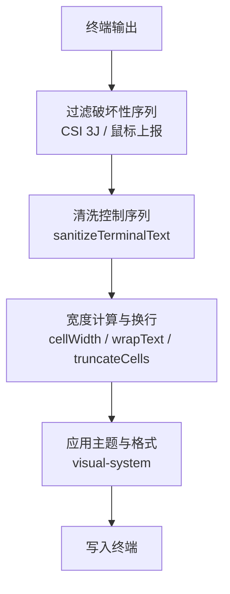
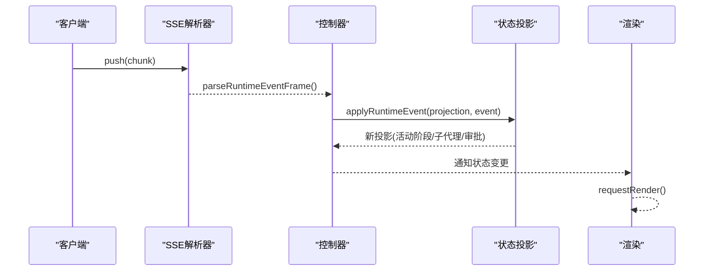
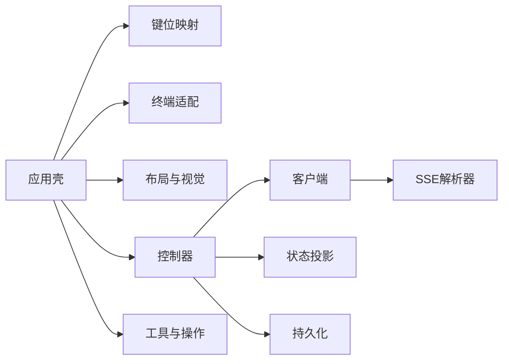

# TUI终端界面

<cite>
**本文引用的文件**
- [kun-tui.md](file://docs/kun-tui.md)
- [controller.ts](file://kun/src/tui/controller.ts)
- [keymap.ts](file://kun/src/tui/keymap.ts)
- [layout.ts](file://kun/src/tui/layout.ts)
- [visual-system.ts](file://kun/src/tui/visual-system.ts)
- [pi-terminal.ts](file://kun/src/tui/pi-terminal.ts)
- [client.ts](file://kun/src/tui/client.ts)
- [sse.ts](file://kun/src/tui/sse.ts)
- [state.ts](file://kun/src/tui/state.ts)
- [operations.ts](file://kun/src/tui/operations.ts)
- [pi-app.ts](file://kun/src/tui/pi-app.ts)
</cite>

## 目录
1. [简介](#简介)
2. [项目结构](#项目结构)
3. [核心组件](#核心组件)
4. [架构总览](#架构总览)
5. [详细组件分析](#详细组件分析)
6. [依赖关系分析](#依赖关系分析)
7. [性能考量](#性能考量)
8. [故障排查指南](#故障排查指南)
9. [结论](#结论)
10. [附录：使用示例与配置选项](#附录使用示例与配置选项)

## 简介
本文件为 DeepSeek-GUI 的 TUI（终端用户界面）提供系统化文档。TUI 基于 Node.js，运行在真实终端中，采用内联会话模式，不切换备用屏幕，从而保留终端原生滚动历史。它通过本机 HTTP/SSE 连接共享 Kun 运行时，支持多客户端并发、断线重连、流式输出、进度显示与状态同步。本文覆盖控制器架构、布局系统、视觉渲染引擎、键盘导航机制、命令模式、终端适配层、实时数据更新机制，以及自定义视图、插件扩展与调试技巧等开发指南。

## 项目结构
TUI 位于仓库的 kun/src/tui 目录，围绕“控制器-客户端-状态-渲染-输入”的分层组织：
- 控制器：协调会话、模型连接、事件订阅与业务操作
- 客户端：封装与运行时的 HTTP/SSE 通信
- 状态机：将运行时事件投影为可渲染的线程视图
- 渲染与布局：ANSI 安全文本处理、宽度计算、主题与页面框架
- 终端适配：跨平台终端能力封装与 scrollback 保护
- 应用壳：pi-tui 集成、全局输入路由、模态与覆盖层管理
- 键位映射：可配置的快捷键与 Leader 序列
- 工具与操作：导出、剪贴板、外部编辑器、官方 CLI 调用等

**图表来源**
- [pi-app.ts:271-395](file://kun/src/tui/pi-app.ts#L271-L395)
- [controller.ts:112-171](file://kun/src/tui/controller.ts#L112-L171)
- [client.ts:561-582](file://kun/src/tui/client.ts#L561-L582)
- [sse.ts:9-40](file://kun/src/tui/sse.ts#L9-L40)
- [state.ts:107-150](file://kun/src/tui/state.ts#L107-L150)
- [keymap.ts:177-229](file://kun/src/tui/keymap.ts#L177-L229)
- [pi-terminal.ts:26-79](file://kun/src/tui/pi-terminal.ts#L26-L79)
- [layout.ts:14-89](file://kun/src/tui/layout.ts#L14-L89)
- [visual-system.ts:22-42](file://kun/src/tui/visual-system.ts#L22-L42)

**章节来源**
- [pi-app.ts:271-395](file://kun/src/tui/pi-app.ts#L271-L395)
- [controller.ts:112-171](file://kun/src/tui/controller.ts#L112-L171)
- [client.ts:561-582](file://kun/src/tui/client.ts#L561-L582)
- [sse.ts:9-40](file://kun/src/tui/sse.ts#L9-L40)
- [state.ts:107-150](file://kun/src/tui/state.ts#L107-L150)
- [keymap.ts:177-229](file://kun/src/tui/keymap.ts#L177-L229)
- [pi-terminal.ts:26-79](file://kun/src/tui/pi-terminal.ts#L26-L79)
- [layout.ts:14-89](file://kun/src/tui/layout.ts#L14-L89)
- [visual-system.ts:22-42](file://kun/src/tui/visual-system.ts#L22-L42)

## 核心组件
- 控制器（TuiController）：维护会话列表、当前线程投影、连接状态、模型连接快照、待发送附件、主题与退出请求；负责启动、刷新线程、打开线程、创建线程、提交消息、中断、压缩、重命名、归档、分支、撤销/重做、导航会话关系、子代理管理等。
- 客户端（KunTuiClient）：统一封装对运行时的 HTTP 调用与 SSE 订阅，包含模型连接传输、技能、MCP、扩展、附件、内存、图运行等接口；连接解析支持显式 URL、发现文件或自动拉起共享运行时。
- 状态投影（state.ts）：将运行时事件增量应用到线程投影，维护活动阶段、子代理、审批与用户输入等待、上下文快照匹配、可见错误注入等。
- 终端适配（pi-terminal.ts）：提供流式终端包装与 scrollback 保护，屏蔽破坏性清屏和鼠标上报启用，确保内联模式体验。
- 布局与视觉（layout.ts, visual-system.ts）：安全的 ANSI 清理、单元格宽度计算、截断与换行、主题调色板、面包屑、节标题、选择行、页框、状态图标等。
- 键位映射（keymap.ts）：默认绑定与配置文件加载、Leader 序列、事件类型、防重复与透传策略。
- 应用壳（pi-app.ts）：pi-tui 集成、全局输入路由、覆盖层管理、动画与鼠标追踪同步、粘贴图片、外部编辑器、分享与导出等。
- 工具与操作（operations.ts）：Markdown 导出、系统剪贴板写入、OSC52 剪贴板序列、外部编辑器调用、官方提供商 CLI 交互等。

**章节来源**
- [controller.ts:112-171](file://kun/src/tui/controller.ts#L112-L171)
- [controller.ts:256-284](file://kun/src/tui/controller.ts#L256-L284)
- [controller.ts:368-489](file://kun/src/tui/controller.ts#L368-L489)
- [controller.ts:543-651](file://kun/src/tui/controller.ts#L543-L651)
- [client.ts:413-513](file://kun/src/tui/client.ts#L413-L513)
- [client.ts:561-582](file://kun/src/tui/client.ts#L561-L582)
- [state.ts:107-150](file://kun/src/tui/state.ts#L107-L150)
- [state.ts:190-605](file://kun/src/tui/state.ts#L190-L605)
- [pi-terminal.ts:26-79](file://kun/src/tui/pi-terminal.ts#L26-L79)
- [layout.ts:14-89](file://kun/src/tui/layout.ts#L14-L89)
- [visual-system.ts:22-42](file://kun/src/tui/visual-system.ts#L22-L42)
- [keymap.ts:177-229](file://kun/src/tui/keymap.ts#L177-L229)
- [pi-app.ts:271-395](file://kun/src/tui/pi-app.ts#L271-L395)
- [operations.ts:21-49](file://kun/src/tui/operations.ts#L21-L49)
- [operations.ts:53-84](file://kun/src/tui/operations.ts#L53-L84)
- [operations.ts:86-134](file://kun/src/tui/operations.ts#L86-L134)

## 架构总览
TUI 以控制器为中心，驱动视图与状态；客户端负责与运行时的通信；SSE 增量事件驱动状态投影更新；应用壳负责输入路由、覆盖层与渲染调度；终端适配保证跨平台兼容性与 scrollback 安全。

**图表来源**
- [keymap.ts:177-229](file://kun/src/tui/keymap.ts#L177-L229)
- [pi-app.ts:492-695](file://kun/src/tui/pi-app.ts#L492-L695)
- [controller.ts:543-651](file://kun/src/tui/controller.ts#L543-L651)
- [client.ts:561-582](file://kun/src/tui/client.ts#L561-L582)
- [sse.ts:9-40](file://kun/src/tui/sse.ts#L9-L40)
- [state.ts:190-605](file://kun/src/tui/state.ts#L190-L605)
- [visual-system.ts:22-42](file://kun/src/tui/visual-system.ts#L22-L42)

## 详细组件分析

### 控制器架构与会话生命周期
- 会话列表与搜索：刷新线程列表并排序，支持活跃/归档模式。
- 打开线程：获取线程详情、委派诊断、图运行列表，构建投影并订阅事件流；处理旧 GUI 兼容的连接状态。
- 创建与提交：校验模型连接可用性，启动 turn 或 steer 运行中的 turn，或 steering Graph 运行；附带附件与推理强度。
- 中断与压缩：中断 turn、压缩上下文、重命名、归档、分支、撤销/重做、导航父子/兄弟会话。
- 模型连接：初始化与监听模型连接快照，应用默认模型与推理强度，记录最近模型。

**图表来源**
- [controller.ts:286-307](file://kun/src/tui/controller.ts#L286-L307)
- [controller.ts:368-489](file://kun/src/tui/controller.ts#L368-L489)
- [controller.ts:543-651](file://kun/src/tui/controller.ts#L543-L651)
- [state.ts:190-605](file://kun/src/tui/state.ts#L190-L605)

**章节来源**
- [controller.ts:286-307](file://kun/src/tui/controller.ts#L286-L307)
- [controller.ts:368-489](file://kun/src/tui/controller.ts#L368-L489)
- [controller.ts:543-651](file://kun/src/tui/controller.ts#L543-L651)

### 键盘导航机制与命令模式
- 默认键位：Leader（Ctrl+X）、命令面板（Ctrl+P）、新建/切换会话、模型切换、推理强度循环、指针模式、工具详情、外部编辑器、粘贴图片、换行、清空、中止、退出等。
- 配置文件：~/.kun/tui.json 支持 leader_timeout、keybinds、高级对象（event、preventDefault、fallthrough），无效配置不会阻止启动并给出警告。
- 事件类型：press/repeat/release，支持组合键与平台差异（macOS/Windows/Linux）。
- 应用壳路由：优先处理覆盖层与主路由，再处理 Leader、全局动作、编辑器行为与快捷方式。

**图表来源**
- [keymap.ts:177-229](file://kun/src/tui/keymap.ts#L177-L229)
- [pi-app.ts:492-695](file://kun/src/tui/pi-app.ts#L492-L695)

**章节来源**
- [keymap.ts:96-161](file://kun/src/tui/keymap.ts#L96-L161)
- [keymap.ts:231-287](file://kun/src/tui/keymap.ts#L231-L287)
- [keymap.ts:289-343](file://kun/src/tui/keymap.ts#L289-L343)
- [pi-app.ts:492-695](file://kun/src/tui/pi-app.ts#L492-L695)

### 终端适配层与ANSI转义序列支持
- 流式终端：InlineStreamTerminal 包装 stdin/stdout，设置原始模式、UTF-8 编码、bracketed paste、resize 事件。
- Scrollback 保护：ScrollbackPreservingTerminal 过滤破坏性清屏（CSI 3 J）与鼠标上报启用序列，避免影响终端原生滚动历史。
- 文本清洗：sanitizeTerminalText 去除控制序列与控制字符，stripAnsi 移除 ANSI 颜色码，cellWidth/wrapText/truncateCells 保证宽度和换行正确。
- 主题与密度：visual-system 提供主题、色调、面包屑、节标题、选择行、页框、状态图标与密度判断。

**图表来源**
- [pi-terminal.ts:88-126](file://kun/src/tui/pi-terminal.ts#L88-L126)
- [layout.ts:14-89](file://kun/src/tui/layout.ts#L14-L89)
- [visual-system.ts:22-42](file://kun/src/tui/visual-system.ts#L22-L42)

**章节来源**
- [pi-terminal.ts:26-79](file://kun/src/tui/pi-terminal.ts#L26-L79)
- [pi-terminal.ts:88-126](file://kun/src/tui/pi-terminal.ts#L88-L126)
- [layout.ts:14-89](file://kun/src/tui/layout.ts#L14-L89)
- [visual-system.ts:22-42](file://kun/src/tui/visual-system.ts#L22-L42)

### 实时数据更新机制（流式输出、进度显示、状态同步）
- SSE 增量解析：IncrementalSseParser 按块解析 id/event/data，支持流式拼接与 flush。
- 事件应用：applyRuntimeEvent 根据事件类型更新活动阶段、子代理、审批与用户输入等待、上下文快照、可见错误等。
- 活动阶段：starting/thinking/responding/tool/retrying/compacting/waiting，结合时间戳与标签展示进度。
- 状态同步：断线后重新验证 discovery、退避重连并补拉事件；重复或倒序事件不会再次应用。

**图表来源**
- [sse.ts:9-40](file://kun/src/tui/sse.ts#L9-L40)
- [sse.ts:42-63](file://kun/src/tui/sse.ts#L42-L63)
- [state.ts:190-605](file://kun/src/tui/state.ts#L190-L605)
- [controller.ts:418-482](file://kun/src/tui/controller.ts#L418-L482)

**章节来源**
- [sse.ts:9-40](file://kun/src/tui/sse.ts#L9-L40)
- [sse.ts:42-63](file://kun/src/tui/sse.ts#L42-L63)
- [state.ts:190-605](file://kun/src/tui/state.ts#L190-L605)
- [controller.ts:418-482](file://kun/src/tui/controller.ts#L418-L482)

### 自定义视图、插件扩展与调试技巧
- 自定义视图：通过 pi-tui 的 Component、Overlay、SelectList、Editor、Markdown 等构建独占页面与覆盖层；控制器暴露回调用于打开连接向导、模型选择、用量报告、配额、变体、目标、权限、时间线、子代理、技能、外部编辑器、复制与导出等。
- 插件扩展：通过运行时扩展 API 管理扩展安装、版本选择、启用/禁用、权限、重试与诊断；TUI 提供扩展列表、检查、安装、回滚、重载等接口。
- 调试技巧：
  - 使用 kun runtime status/restart/stop 管理服务。
  - 使用 --no-start 仅连接不改变服务状态。
  - 使用 /help、/status、/context、/queue、/mcp、/skills、/extensions 等命令查看状态。
  - 使用 Ctrl+L 强制重绘；使用 Ctrl+O 展开/折叠工具详情。
  - 使用 /editor 编辑草稿；使用 OSC52 或系统剪贴板写入文本。

**章节来源**
- [pi-app.ts:271-395](file://kun/src/tui/pi-app.ts#L271-L395)
- [pi-app.ts:492-695](file://kun/src/tui/pi-app.ts#L492-L695)
- [client.ts:744-800](file://kun/src/tui/client.ts#L744-L800)
- [operations.ts:21-49](file://kun/src/tui/operations.ts#L21-L49)
- [operations.ts:53-84](file://kun/src/tui/operations.ts#L53-L84)
- [operations.ts:86-134](file://kun/src/tui/operations.ts#L86-L134)

## 依赖关系分析
- 控制器依赖客户端进行运行时通信，依赖状态投影进行事件应用，依赖持久化保存最近模型与 redo 目标。
- 应用壳依赖键位映射进行输入路由，依赖终端适配进行输出与输入处理，依赖布局与视觉系统进行渲染。
- 客户端依赖 SSE 解析器进行增量事件解析，依赖运行时发现与服务管理器进行连接与启动。
- 工具与操作依赖系统命令与环境变量进行剪贴板、编辑器与 CLI 交互。

**图表来源**
- [pi-app.ts:271-395](file://kun/src/tui/pi-app.ts#L271-L395)
- [controller.ts:112-171](file://kun/src/tui/controller.ts#L112-L171)
- [client.ts:413-513](file://kun/src/tui/client.ts#L413-L513)
- [sse.ts:9-40](file://kun/src/tui/sse.ts#L9-L40)
- [state.ts:107-150](file://kun/src/tui/state.ts#L107-L150)
- [operations.ts:21-49](file://kun/src/tui/operations.ts#L21-L49)

**章节来源**
- [pi-app.ts:271-395](file://kun/src/tui/pi-app.ts#L271-L395)
- [controller.ts:112-171](file://kun/src/tui/controller.ts#L112-L171)
- [client.ts:413-513](file://kun/src/tui/client.ts#L413-L513)
- [sse.ts:9-40](file://kun/src/tui/sse.ts#L9-L40)
- [state.ts:107-150](file://kun/src/tui/state.ts#L107-L150)
- [operations.ts:21-49](file://kun/src/tui/operations.ts#L21-L49)

## 性能考量
- 增量 SSE 解析减少内存占用与重复处理，按块解析并 flush 不完整帧。
- 状态投影按稳定 item ID 追加与校正，避免重复文本与乱序问题。
- 布局函数使用 Intl.Segmenter 进行字素分割，确保复杂字符宽度计算准确。
- 动画定时器仅在活动时开启，空闲时关闭，降低 CPU 占用。
- 终端输出过滤破坏性序列，避免不必要的重绘与滚动历史丢失。

[本节为通用性能讨论，无需具体文件分析]

## 故障排查指南
- 连接问题：检查 runtime status，确认 data-dir 与发现文件一致；若发现过期或不匹配，重启服务或移除 --no-start。
- 模型连接：使用 /connect 添加供应商，/model 切换默认模型；若只显示单一模型，检查 GUI 设置与共享 registry。
- 权限与安全：data-dir 权限 0700，discovery/token 文件 POSIX 上 0600；API Key/OAuth token 不进入日志或普通设置。
- 终端兼容性：确保终端支持 bracketed paste 与 SGR mouse（可选）；Pointer 模式下可点击 Thinking 或 Subagent 块。
- 导出与剪贴板：使用 /export 导出 Markdown；使用系统剪贴板或 OSC52 写入文本；外部编辑器由 VISUAL/EDITOR 决定。

**章节来源**
- [kun-tui.md:39-75](file://docs/kun-tui.md#L39-L75)
- [kun-tui.md:123-168](file://docs/kun-tui.md#L123-L168)
- [kun-tui.md:306-321](file://docs/kun-tui.md#L306-L321)
- [operations.ts:53-84](file://kun/src/tui/operations.ts#L53-L84)
- [operations.ts:86-134](file://kun/src/tui/operations.ts#L86-L134)

## 结论
TUI 提供了高效、安全、跨平台的终端用户界面，通过控制器-客户端-状态-渲染的分层架构，实现了流式输出、进度显示与状态同步。键位映射与命令模式提升了操作效率，终端适配层确保了不同操作系统下的兼容性。开发者可通过自定义视图与插件扩展增强功能，利用调试技巧快速定位问题。整体设计兼顾性能与用户体验，适合在服务器与开发机环境中使用。

[本节为总结，无需具体文件分析]

## 附录：使用示例与配置选项
- 启动与后台运行时：
  - 自动使用 GUI 配置的 data-dir；等价别名 kun tui；常用参数 --workspace、--continue、--thread。
  - 只连接不启动：--no-start；管理后台服务：runtime status/restart/stop。
- 模型连接：
  - /connect 打开共享连接向导；/model 切换共享默认模型；支持 OAuth、CLI Auth、Agent SDK。
- 操作与命令：
  - 会话与内容：/sessions、/new、/open、/rename、/archive、/fork、/undo、/redo、/timeline、/jump、/subagents、/copy、/export、/details、/thinking、/paste、/attach、/mouse、/variants、/compact。
  - 运行与项目：/status、/context、/queue、/permission、/plan、/goal、/tasks、/mcp、/skills、/skill:<name>、/init、/add-dir、/editor、/btw、/connect、/model、/update、/help、/quit。
- 自定义键位：
  - ~/.kun/tui.json 支持 leader_timeout、keybinds、数组与对象配置；无效配置不会阻止启动并提示。
- 调试技巧：
  - 使用 /help、/status、/context、/queue、/mcp、/skills、/extensions 查看状态。
  - 使用 Ctrl+L 强制重绘；Ctrl+O 展开/折叠工具详情；/editor 编辑草稿；OSC52 或系统剪贴板写入文本。

**章节来源**
- [kun-tui.md:39-75](file://docs/kun-tui.md#L39-L75)
- [kun-tui.md:123-168](file://docs/kun-tui.md#L123-L168)
- [kun-tui.md:170-259](file://docs/kun-tui.md#L170-L259)
- [kun-tui.md:285-305](file://docs/kun-tui.md#L285-L305)
- [operations.ts:21-49](file://kun/src/tui/operations.ts#L21-L49)
- [operations.ts:53-84](file://kun/src/tui/operations.ts#L53-L84)
- [operations.ts:86-134](file://kun/src/tui/operations.ts#L86-L134)