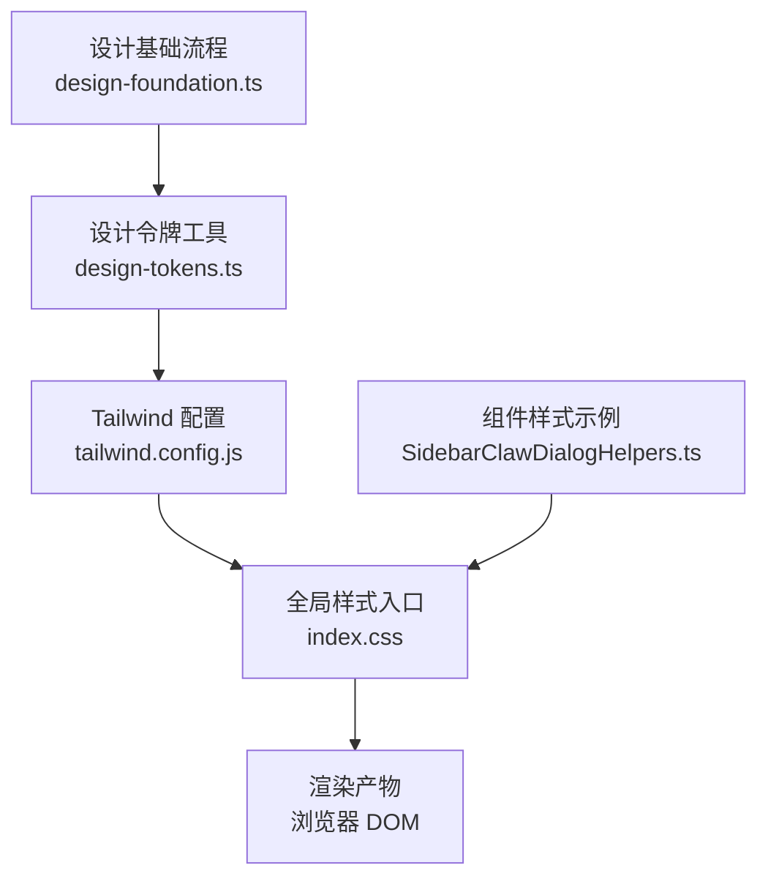
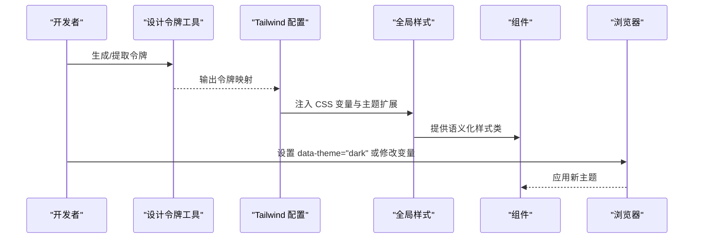
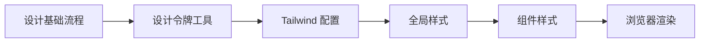

# 主题与样式

<cite>
**本文引用的文件**
- [tailwind.config.js](file://tailwind.config.js)
- [index.css](file://src/renderer/src/index.css)
- [design-tokens.ts](file://src/renderer/src/design/design-tokens.ts)
- [design-foundation.ts](file://src/renderer/src/design/design-foundation.ts)
- [SidebarClawDialogHelpers.ts](file://src/renderer/src/components/chat/SidebarClawDialogHelpers.ts)
</cite>

## 目录
1. [简介](#简介)
2. [项目结构](#项目结构)
3. [核心组件](#核心组件)
4. [架构总览](#架构总览)
5. [详细组件分析](#详细组件分析)
6. [依赖关系分析](#依赖关系分析)
7. [性能考量](#性能考量)
8. [故障排查指南](#故障排查指南)
9. [结论](#结论)
10. [附录](#附录)

## 简介
本文件系统化说明 DeepSeek-GUI 的主题与样式体系，围绕基于 Tailwind CSS 的设计系统展开，涵盖颜色方案、字体规范、间距标准、主题切换机制（明暗主题、自定义主题、运行时切换）、CSS-in-JS 集成策略（styled-components 使用方式与样式隔离）、响应式设计（断点管理、移动端适配、触摸交互优化），以及主题定制指南（品牌色配置、组件样式覆盖、最佳实践）和主题预览/调试技巧。

## 项目结构
DeepSeek-GUI 的样式体系由以下关键部分构成：
- 设计令牌与调色板工具：用于从现有样式中抽取并生成色阶、类型比例等设计令牌。
- Tailwind 配置：集中定义主题扩展、颜色语义、阴影、圆角等，并通过 CSS 变量绑定到设计令牌。
- 全局样式与基础组件类：统一入口样式、通用按钮与输入控件样式、焦点环等。
- 设计工作流与规范：设计稿生成流程中的“基础”阶段，确保后续页面遵循统一的视觉与布局约定。
- 组件级样式示例：在业务组件中以 Tailwind 原子类组合实现主题化外观。

图表来源
- [tailwind.config.js:1-77](file://tailwind.config.js#L1-L77)
- [index.css:1-37](file://src/renderer/src/index.css#L1-L37)
- [design-tokens.ts:1-230](file://src/renderer/src/design/design-tokens.ts#L1-L230)
- [design-foundation.ts:1-221](file://src/renderer/src/design/design-foundation.ts#L1-L221)
- [SidebarClawDialogHelpers.ts:81-118](file://src/renderer/src/components/chat/SidebarClawDialogHelpers.ts#L81-L118)

章节来源
- [tailwind.config.js:1-77](file://tailwind.config.js#L1-L77)
- [index.css:1-37](file://src/renderer/src/index.css#L1-L37)
- [design-tokens.ts:1-230](file://src/renderer/src/design/design-tokens.ts#L1-L230)
- [design-foundation.ts:1-221](file://src/renderer/src/design/design-foundation.ts#L1-L221)
- [SidebarClawDialogHelpers.ts:81-118](file://src/renderer/src/components/chat/SidebarClawDialogHelpers.ts#L81-L118)

## 核心组件
- 设计令牌与调色板工具
  - 提供颜色转换、色阶生成、角色推断、类型比例整理等能力，支持从零开始构建或从现有样式中提取令牌。
  - 通过固定明度阶梯生成 50–900 的色阶，保证品牌色的感知均匀性。
- Tailwind 主题扩展
  - 将语义化颜色映射到 CSS 变量（如 --ds-*），使主题可通过变量动态切换。
  - 扩展阴影、圆角等设计维度，形成一致的设计语言。
- 全局样式与基础组件
  - 统一按钮、输入框等基础控件样式，聚焦可访问性与一致性。
  - 使用 focus-visible 与 color-mix 实现一致的焦点环效果。
- 设计基础流程
  - 在设计工作流中先产出“设计基础”，包括概念、受众、视觉方向、信息架构、状态与响应式规划等，作为后续页面生成的约束与依据。

章节来源
- [design-tokens.ts:1-230](file://src/renderer/src/design/design-tokens.ts#L1-L230)
- [tailwind.config.js:1-77](file://tailwind.config.js#L1-L77)
- [index.css:1-37](file://src/renderer/src/index.css#L1-L37)
- [design-foundation.ts:1-221](file://src/renderer/src/design/design-foundation.ts#L1-L221)

## 架构总览
主题系统的运行路径如下：
- 设计令牌工具负责解析/生成颜色、字体、间距等令牌。
- Tailwind 配置将这些令牌以 CSS 变量的形式暴露给组件层。
- 全局样式与组件样式通过 Tailwind 原子类引用这些语义化 token。
- 运行时通过切换 data-theme 属性或修改 CSS 变量值完成主题切换。

图表来源
- [design-tokens.ts:1-230](file://src/renderer/src/design/design-tokens.ts#L1-L230)
- [tailwind.config.js:1-77](file://tailwind.config.js#L1-L77)
- [index.css:1-37](file://src/renderer/src/index.css#L1-L37)

## 详细组件分析

### 颜色方案与语义化主题
- 语义化颜色
  - 通过 Tailwind 扩展将 accent、control、background、foreground、border、muted、sidebar、primary、ds.* 等语义色映射到 CSS 变量（如 --ds-accent、--ds-bg-canvas、--ds-text）。
  - 优势：组件无需关心具体颜色值，只需使用语义类名；主题切换时仅需更新变量。
- 明暗主题
  - 使用 selector 模式 darkMode: ['selector', '[data-theme="dark"]']，通过在根节点添加 data-theme 属性切换明暗。
  - 组件中使用 Tailwind 的 dark: 前缀类名实现明暗差异。
- 品牌色与中性色
  - 品牌色通过 accent/primary 等语义色表达；中性色通过 ds.ink/ds.muted/ds.faint 等表达文本与边框层次。
  - 辅助色（success、danger、skill 等）通过 ds.* 命名空间统一管理。

章节来源
- [tailwind.config.js:1-77](file://tailwind.config.js#L1-L77)
- [SidebarClawDialogHelpers.ts:81-118](file://src/renderer/src/components/chat/SidebarClawDialogHelpers.ts#L81-L118)

### 字体规范与排版
- 类型比例
  - 设计令牌工具提供类型比例整理，根据字号、字重、行高、字体族自动归类为 Display/H1/H2/H3/Body/Caption 等层级。
  - 建议在全局样式中定义基础字体栈，并在组件中通过 Tailwind 的 text-* 与 font-* 类进行排版。
- 字体缩放与可读性
  - 结合 focus-visible 与合适的字号层级，确保在不同设备上的可读性。

章节来源
- [design-tokens.ts:186-230](file://src/renderer/src/design/design-tokens.ts#L186-L230)

### 间距与圆角、阴影
- 圆角
  - 通过 borderRadius 扩展 control/card/pill/xl/2xl/3xl 等语义化圆角，统一 UI 元素的外观。
- 阴影
  - 通过 boxShadow 扩展 composer/shell/panel 等语义化阴影，区分不同层级的悬浮与容器。
- 间距
  - 建议使用 Tailwind 内置 spacing 与 ds.* 语义色配合，避免硬编码像素值。

章节来源
- [tailwind.config.js:60-72](file://tailwind.config.js#L60-L72)

### 主题切换机制
- 明暗主题
  - 通过 data-theme="dark" 选择器启用深色模式，组件内使用 dark: 前缀类名控制明暗差异。
- 自定义主题
  - 通过调整 CSS 变量（--ds-*）即可实现自定义主题，无需改动组件代码。
- 运行时切换
  - 在运行时动态设置 data-theme 或修改 CSS 变量，即可即时切换主题。
- 组件级主题
  - 组件可使用 Tailwind 的 dark: 与语义类名组合，确保在不同主题下保持一致的视觉层次。

章节来源
- [tailwind.config.js:1-10](file://tailwind.config.js#L1-L10)
- [index.css:18-36](file://src/renderer/src/index.css#L18-L36)

### CSS-in-JS 集成与样式隔离
- styled-components 使用策略
  - 在 React 组件中，优先使用 Tailwind 原子类进行样式编排；对于需要动态样式的场景，可使用 styled-components 包裹并继承 Tailwind 提供的语义类。
  - 通过 CSS 变量与 Tailwind 语义类解耦具体颜色与尺寸，降低样式耦合。
- 样式隔离
  - 使用 scoped 样式与 CSS Modules 或 Tailwind 的 @layer components 组织样式，避免全局污染。
  - 对复杂交互组件，可在 styled-components 中仅处理必要动态样式，其余样式交由 Tailwind 管理。

章节来源
- [index.css:18-36](file://src/renderer/src/index.css#L18-L36)

### 响应式设计
- 断点管理
  - 使用 Tailwind 内置断点（sm/md/lg/xl/2xl）进行布局适配；结合 ds.* 语义色与圆角、阴影保持视觉一致性。
- 移动端适配
  - 针对移动端优化触控目标大小与间距；使用 focus-visible 提升键盘导航体验。
- 触摸交互优化
  - 在按钮与输入框上增加合适的点击区域与反馈；避免过小控件影响可用性。

章节来源
- [index.css:18-36](file://src/renderer/src/index.css#L18-L36)

### 主题定制指南
- 品牌色配置
  - 通过调整 accent/primary 对应的 CSS 变量实现品牌色替换；确保对比度符合可访问性要求。
- 组件样式覆盖
  - 优先使用 Tailwind 的语义类覆盖；必要时在 @layer components 中定义组件级样式。
- 主题开发最佳实践
  - 所有颜色、圆角、阴影均通过 CSS 变量暴露；组件只引用语义类，不直接写死颜色值。
  - 新增主题时，仅需维护一组 CSS 变量与必要的 dark: 变体。

章节来源
- [tailwind.config.js:10-59](file://tailwind.config.js#L10-L59)
- [index.css:18-36](file://src/renderer/src/index.css#L18-L36)

### 主题预览与调试技巧
- 预览工具
  - 使用设计令牌工具从现有样式中抽取颜色、字体、间距等令牌，快速生成色阶与类型比例，便于在预览面板中验证。
- 调试技巧
  - 在浏览器开发者工具中检查 data-theme 属性与 CSS 变量值；使用 Tailwind 的 dark: 类名验证明暗切换。
  - 对组件样式问题，优先检查是否使用了正确的语义类与变量。

章节来源
- [design-tokens.ts:1-230](file://src/renderer/src/design/design-tokens.ts#L1-L230)

## 依赖关系分析
- 设计令牌工具依赖颜色转换与类型比例算法，输出可用于 Tailwind 配置的语义映射。
- Tailwind 配置依赖 CSS 变量，将语义色与主题扩展注入到全局样式。
- 组件样式依赖 Tailwind 原子类与语义类，间接依赖设计令牌与主题变量。
- 设计基础流程为页面生成提供约束，确保后续页面遵循统一的设计系统。

图表来源
- [design-tokens.ts:1-230](file://src/renderer/src/design/design-tokens.ts#L1-L230)
- [tailwind.config.js:1-77](file://tailwind.config.js#L1-L77)
- [index.css:1-37](file://src/renderer/src/index.css#L1-L37)
- [design-foundation.ts:1-221](file://src/renderer/src/design/design-foundation.ts#L1-L221)

章节来源
- [design-tokens.ts:1-230](file://src/renderer/src/design/design-tokens.ts#L1-L230)
- [tailwind.config.js:1-77](file://tailwind.config.js#L1-L77)
- [index.css:1-37](file://src/renderer/src/index.css#L1-L37)
- [design-foundation.ts:1-221](file://src/renderer/src/design/design-foundation.ts#L1-L221)

## 性能考量
- 减少重复样式：通过语义类与 CSS 变量复用样式，避免硬编码导致的冗余。
- 按需加载：Tailwind 通过 content 配置仅包含需要的类，减小打包体积。
- 主题切换开销：使用 CSS 变量切换主题，避免重新计算大量样式。
- 组件样式隔离：使用 @layer components 与 scoped 样式，降低样式冲突与维护成本。

## 故障排查指南
- 主题未生效
  - 检查根节点是否正确设置 data-theme="dark"。
  - 确认 CSS 变量已正确注入且未被覆盖。
- 颜色不一致
  - 检查组件是否使用了语义类而非硬编码颜色。
  - 核对 Tailwind 配置中的语义色映射是否正确。
- 焦点环不可见
  - 检查 focus-visible 样式是否被覆盖；确认 color-mix 与变量值有效。
- 类型比例错乱
  - 使用设计令牌工具重新生成类型比例，确保字号、字重、行高一致。

章节来源
- [tailwind.config.js:1-10](file://tailwind.config.js#L1-L10)
- [index.css:18-36](file://src/renderer/src/index.css#L18-L36)
- [design-tokens.ts:186-230](file://src/renderer/src/design/design-tokens.ts#L186-L230)

## 结论
DeepSeek-GUI 的主题与样式系统以 Tailwind CSS 为核心，通过 CSS 变量与设计令牌工具实现高度可定制的主题能力。明暗主题、自定义主题与运行时切换均以最小侵入的方式实现，组件层仅依赖语义类，确保一致性与可维护性。设计基础流程为页面生成提供约束，保障整体视觉与交互的一致性。

## 附录
- 推荐实践
  - 始终使用语义类与 CSS 变量，避免硬编码颜色与尺寸。
  - 在新增组件时，优先复用已有语义类与令牌。
  - 定期使用设计令牌工具校验与更新令牌，确保设计系统与实际实现同步。
- 参考文件
  - 颜色与主题：[tailwind.config.js](file://tailwind.config.js)
  - 全局样式与基础组件：[index.css](file://src/renderer/src/index.css)
  - 设计令牌与类型比例：[design-tokens.ts](file://src/renderer/src/design/design-tokens.ts)
  - 设计基础流程：[design-foundation.ts](file://src/renderer/src/design/design-foundation.ts)
  - 组件样式示例：[SidebarClawDialogHelpers.ts](file://src/renderer/src/components/chat/SidebarClawDialogHelpers.ts)