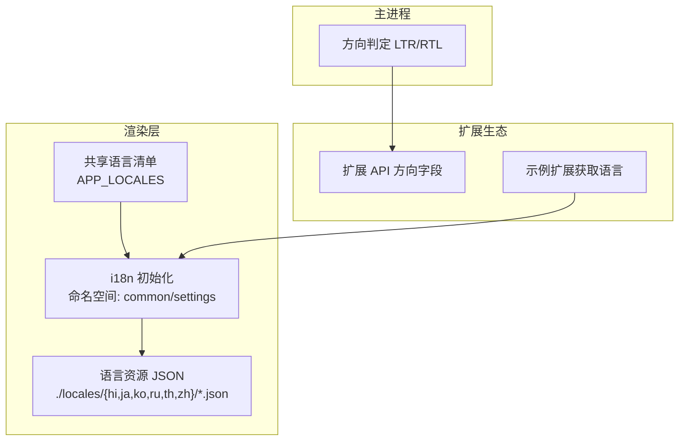
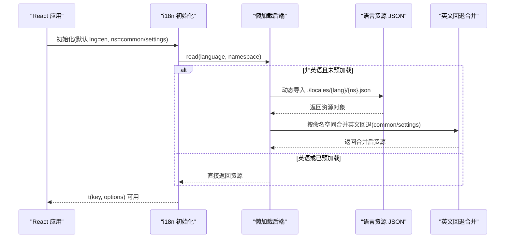
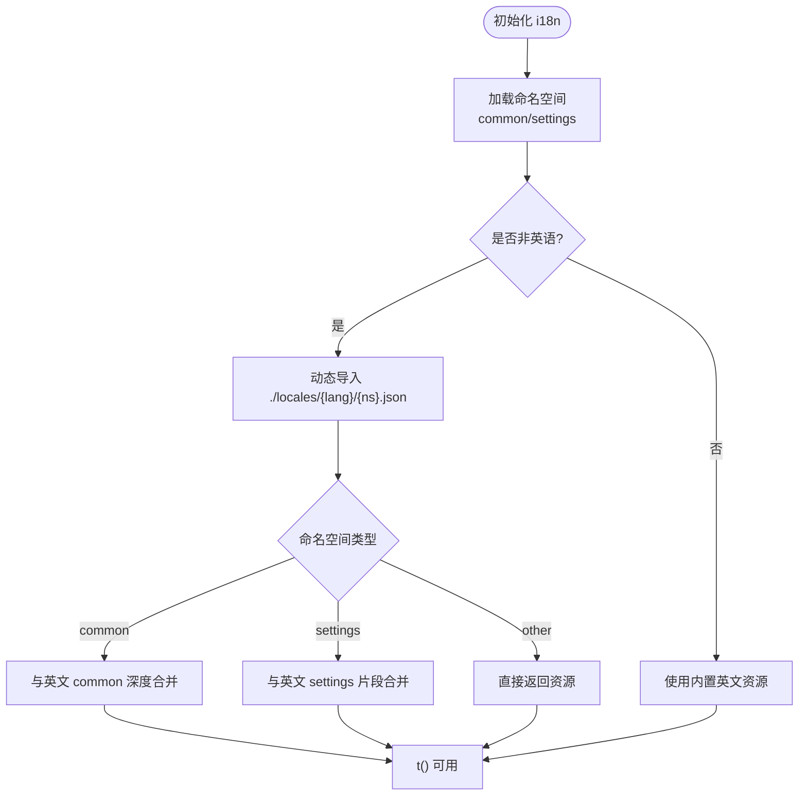
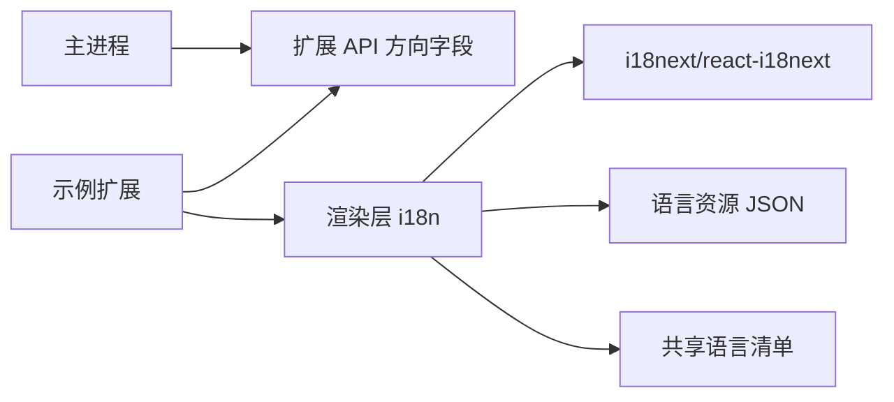

# 国际化支持

<cite>
**本文引用的文件**
- [src/renderer/src/i18n.ts](file://src/renderer/src/i18n.ts)
- [src/shared/app-locales.ts](file://src/shared/app-locales.ts)
- [src/main/extensions/extension-workbench-environment.ts](file://src/main/extensions/extension-workbench-environment.ts)
- [packages/extension-api/src/services.ts](file://packages/extension-api/src/services.ts)
- [examples/extensions/hello-sidebar/src/webview/main.ts](file://examples/extensions/hello-sidebar/src/webview/main.ts)
- [examples/extensions/kun-video-editor/src/engine/advanced-render.ts](file://examples/extensions/kun-video-editor/src/engine/advanced-render.ts)
- [src/renderer/src/components/chat/SidebarClawDialogHelpers.ts](file://src/renderer/src/components/chat/SidebarClawDialogHelpers.ts)
</cite>

## 目录
1. [简介](#简介)
2. [项目结构](#项目结构)
3. [核心组件](#核心组件)
4. [架构总览](#架构总览)
5. [详细组件分析](#详细组件分析)
6. [依赖关系分析](#依赖关系分析)
7. [性能考虑](#性能考虑)
8. [故障排查指南](#故障排查指南)
9. [结论](#结论)
10. [附录](#附录)

## 简介
本文件面向 DeepSeek-GUI 的国际化（i18n）系统，系统性说明多语言支持架构、语言包管理、动态语言切换机制、翻译资源组织与命名约定、文本替换能力（变量插值、复数处理、日期时间格式化）、RTL 语言支持与字体适配、翻译工作流程（提取、审核、版本管理），以及新增语言与质量检查的实践建议。文档以仓库现有实现为依据，并给出可操作的流程图与时序图，帮助开发者与维护者高效推进本地化工作。

## 项目结构
DeepSeek-GUI 的国际化由前端渲染层 i18n 初始化、共享语言清单、主进程方向判定与扩展 API 共同构成：
- 渲染层 i18n 初始化与懒加载：负责初始化 i18next、注册命名空间、配置回退策略与懒加载后端。
- 共享语言清单：集中声明应用支持的语言代码与显示名称映射。
- 主进程方向判定：根据当前语言自动推断界面方向（LTR/RTL）。
- 扩展侧语言获取：扩展可通过宿主提供的接口获取当前语言。
- 示例工程：展示如何在扩展中使用 i18n 与语言信息。

图表来源
- [src/renderer/src/i18n.ts:80-124](file://src/renderer/src/i18n.ts#L80-L124)
- [src/shared/app-locales.ts:1-26](file://src/shared/app-locales.ts#L1-L26)
- [src/main/extensions/extension-workbench-environment.ts:89-89](file://src/main/extensions/extension-workbench-environment.ts#L89-L89)
- [packages/extension-api/src/services.ts:187-187](file://packages/extension-api/src/services.ts#L187-L187)
- [examples/extensions/hello-sidebar/src/webview/main.ts:36-37](file://examples/extensions/hello-sidebar/src/webview/main.ts#L36-L37)

章节来源
- [src/renderer/src/i18n.ts:1-127](file://src/renderer/src/i18n.ts#L1-L127)
- [src/shared/app-locales.ts:1-26](file://src/shared/app-locales.ts#L1-L26)
- [src/main/extensions/extension-workbench-environment.ts:89-89](file://src/main/extensions/extension-workbench-environment.ts#L89-L89)
- [packages/extension-api/src/services.ts:187-187](file://packages/extension-api/src/services.ts#L187-L187)
- [examples/extensions/hello-sidebar/src/webview/main.ts:36-37](file://examples/extensions/hello-sidebar/src/webview/main.ts#L36-L37)

## 核心组件
- i18n 初始化与懒加载后端
  - 使用 i18next + react-i18next，默认命名空间为 common，同时启用 settings 命名空间。
  - 通过 import.meta.glob 对非英语语言进行按需懒加载，减少首屏体积。
  - 提供英文回退策略：当其他语言资源不完整时，合并英文 common 或 settings 片段，避免显示原始键名。
- 共享语言清单
  - APP_LOCALES 定义受支持的语言代码集合，用于 supportedLngs 校验。
  - 提供语言选项与文档语言映射，便于 UI 下拉选择与文档生成。
- 主进程 RTL 判定
  - 基于语言前缀（如 ar/fa/he/ur）判断界面方向为 rtl，否则 ltr。
- 扩展 API 方向字段
  - 暴露 direction 枚举（ltr/rtl），供扩展消费以调整布局。
- 示例扩展语言获取
  - 通过宿主 API 获取当前语言，并在 UI 中展示。

章节来源
- [src/renderer/src/i18n.ts:1-127](file://src/renderer/src/i18n.ts#L1-L127)
- [src/shared/app-locales.ts:1-26](file://src/shared/app-locales.ts#L1-L26)
- [src/main/extensions/extension-workbench-environment.ts:89-89](file://src/main/extensions/extension-workbench-environment.ts#L89-L89)
- [packages/extension-api/src/services.ts:187-187](file://packages/extension-api/src/services.ts#L187-L187)
- [examples/extensions/hello-sidebar/src/webview/main.ts:36-37](file://examples/extensions/hello-sidebar/src/webview/main.ts#L36-L37)

## 架构总览
下图展示了从语言选择到文本渲染的关键流程，包括懒加载、回退合并与 React 集成。

图表来源
- [src/renderer/src/i18n.ts:80-124](file://src/renderer/src/i18n.ts#L80-L124)

章节来源
- [src/renderer/src/i18n.ts:1-127](file://src/renderer/src/i18n.ts#L1-L127)

## 详细组件分析

### i18n 初始化与懒加载后端
- 命名空间与默认值
  - 默认命名空间为 common，同时启用 settings 命名空间。
  - 默认语言与回退语言均为 en，确保始终有文案可用。
- 懒加载策略
  - 使用 import.meta.glob 扫描非英语语言资源路径，按需加载，降低初始包体。
  - 读取失败时抛出错误，便于定位缺失资源。
- 英文回退合并
  - common 命名空间：将当前语言与完整英文 common 深度合并，保证控件文案不裸露键名。
  - settings 命名空间：仅合并 settings 相关键，避免污染其他命名空间。
- 插值配置
  - 关闭 HTML 转义（escapeValue: false），由调用方控制安全输出。

图表来源
- [src/renderer/src/i18n.ts:17-76](file://src/renderer/src/i18n.ts#L17-L76)
- [src/renderer/src/i18n.ts:80-124](file://src/renderer/src/i18n.ts#L80-L124)

章节来源
- [src/renderer/src/i18n.ts:1-127](file://src/renderer/src/i18n.ts#L1-L127)

### 共享语言清单与语言选项
- 支持语言代码集合：APP_LOCALES 用于限制 supportedLngs。
- 语言选项：value 为内部语言代码，label 为用户可见名称，documentLanguage 用于文档语言标识。
- 工具函数：isAppLocale 校验合法语言；documentLanguageForAppLocale 映射文档语言。

章节来源
- [src/shared/app-locales.ts:1-26](file://src/shared/app-locales.ts#L1-L26)

### 主进程 RTL 判定与扩展 API
- 主进程根据语言前缀（ar/fa/he/ur）设置 direction 为 rtl，否则 ltr。
- 扩展 API 暴露 direction 字段，供扩展在渲染时适配布局方向。

章节来源
- [src/main/extensions/extension-workbench-environment.ts:89-89](file://src/main/extensions/extension-workbench-environment.ts#L89-L89)
- [packages/extension-api/src/services.ts:187-187](file://packages/extension-api/src/services.ts#L187-L187)

### 示例扩展中的语言获取与使用
- 示例扩展通过宿主 API 获取当前语言，并在 UI 中展示。
- 该模式可作为其他扩展接入 i18n 的参考。

章节来源
- [examples/extensions/hello-sidebar/src/webview/main.ts:36-37](file://examples/extensions/hello-sidebar/src/webview/main.ts#L36-L37)

### 文本替换机制与最佳实践
- 变量插值
  - i18next 原生支持插值，结合 escapeValue: false 的配置，可在模板中插入变量。
  - 建议在业务层对敏感内容进行转义或使用安全的渲染方式。
- 复数处理
  - 仓库未发现专门的复数规则配置；如需复杂复数，可在资源层维护多条键或使用 i18next 的复数命名空间约定。
- 日期时间格式化
  - 未发现全局日期时间格式化器；建议在业务层统一封装格式化逻辑，并通过 i18n 键引用格式模板。

章节来源
- [src/renderer/src/i18n.ts:111-124](file://src/renderer/src/i18n.ts#L111-L124)

### RTL 语言支持与字体适配
- 方向判定
  - 主进程依据语言前缀自动设置方向，扩展可通过 API 获取方向以调整布局。
- 字体适配
  - 仓库未发现统一的字体切换逻辑；建议在样式层根据 direction 与语言选择合适字体族，或在主题中提供多语言字体配置。

章节来源
- [src/main/extensions/extension-workbench-environment.ts:89-89](file://src/main/extensions/extension-workbench-environment.ts#L89-L89)
- [packages/extension-api/src/services.ts:187-187](file://packages/extension-api/src/services.ts#L187-L187)

### 翻译资源组织与命名约定
- 资源位置
  - 非英语资源位于 src/renderer/src/locales/{hi,ja,ko,ru,th,zh}/*.json，按命名空间拆分（如 common.json、settings.json）。
- 命名约定
  - 键名建议使用语义化前缀与层级，例如 clawAddIm* 系列键用于 IM 相关功能。
  - 保持跨语言键一致，便于维护与审计。
- 示例键集
  - 见 SidebarClawDialogHelpers 中多处使用 clawAddIm* 键，体现模块化命名风格。

章节来源
- [src/renderer/src/i18n.ts:80-124](file://src/renderer/src/i18n.ts#L80-L124)
- [src/renderer/src/components/chat/SidebarClawDialogHelpers.ts:81-178](file://src/renderer/src/components/chat/SidebarClawDialogHelpers.ts#L81-L178)

### 动态语言切换机制
- 切换入口
  - 通过修改 i18n 实例的 lng 即可触发语言切换；supportedLngs 会校验合法性。
- 资源加载
  - 切换至新语言时，懒加载后端会按需加载对应命名空间资源。
- 回退保障
  - 若目标语言资源不完整，将通过英文回退合并保证界面可用性。

章节来源
- [src/renderer/src/i18n.ts:111-124](file://src/renderer/src/i18n.ts#L111-L124)

### 翻译工作流程（提取、审核、版本管理）
- 提取
  - 建议在构建阶段扫描源码中的 t('...') 调用，收集所有键并生成待翻译清单。
  - 对照现有资源文件（common/settings）补齐缺失键。
- 审核
  - 建立双语对照表，逐条核对术语一致性、上下文准确性与长度适配。
  - 对关键用户路径（安装、连接、设置）优先审核。
- 版本管理
  - 将语言资源纳入版本控制，变更需提交 PR 并附带影响范围说明。
  - 发布前执行完整性检查，确保所有键均有对应翻译或回退。

[本节为通用流程建议，不直接分析具体文件]

### 新增语言指南
- 步骤
  - 在 APP_LOCALES 中添加新语言代码。
  - 在 locales 下创建对应语言目录，复制基础资源（建议从英文开始）。
  - 按需实现 common/settings 等命名空间资源。
  - 验证懒加载与回退行为，确保无裸露键。
- 注意事项
  - 保持键名一致，避免破坏已有引用。
  - 对 RTL 语言进行布局与字体适配测试。

章节来源
- [src/shared/app-locales.ts:1-26](file://src/shared/app-locales.ts#L1-L26)
- [src/renderer/src/i18n.ts:80-124](file://src/renderer/src/i18n.ts#L80-L124)

### 翻译质量检查工具使用方法
- 建议工具
  - 使用脚本扫描 t('...') 调用，生成键清单并与资源文件比对，报告缺失或冗余键。
  - 对长文案进行宽度与换行测试，确保 UI 不受影响。
- 自动化
  - 在 CI 中加入质量检查步骤，阻止不合格的资源提交。
- 示例参考
  - 视频编辑器扩展中对 locale 的使用可作为参考，确保扩展侧语言一致性。

章节来源
- [examples/extensions/kun-video-editor/src/engine/advanced-render.ts:244-269](file://examples/extensions/kun-video-editor/src/engine/advanced-render.ts#L244-L269)

## 依赖关系分析
- 渲染层 i18n 依赖
  - i18next 与 react-i18next：提供国际化能力与 React 集成。
  - 语言资源 JSON：按命名空间组织，支持懒加载。
  - 共享语言清单：约束 supportedLngs。
- 主进程与扩展
  - 主进程提供方向信息，扩展 API 暴露方向字段，扩展据此调整布局。
  - 示例扩展演示如何获取并使用语言信息。

图表来源
- [src/renderer/src/i18n.ts:1-127](file://src/renderer/src/i18n.ts#L1-L127)
- [src/shared/app-locales.ts:1-26](file://src/shared/app-locales.ts#L1-L26)
- [src/main/extensions/extension-workbench-environment.ts:89-89](file://src/main/extensions/extension-workbench-environment.ts#L89-L89)
- [packages/extension-api/src/services.ts:187-187](file://packages/extension-api/src/services.ts#L187-L187)
- [examples/extensions/hello-sidebar/src/webview/main.ts:36-37](file://examples/extensions/hello-sidebar/src/webview/main.ts#L36-L37)

章节来源
- [src/renderer/src/i18n.ts:1-127](file://src/renderer/src/i18n.ts#L1-L127)
- [src/shared/app-locales.ts:1-26](file://src/shared/app-locales.ts#L1-L26)
- [src/main/extensions/extension-workbench-environment.ts:89-89](file://src/main/extensions/extension-workbench-environment.ts#L89-L89)
- [packages/extension-api/src/services.ts:187-187](file://packages/extension-api/src/services.ts#L187-L187)
- [examples/extensions/hello-sidebar/src/webview/main.ts:36-37](file://examples/extensions/hello-sidebar/src/webview/main.ts#L36-L37)

## 性能考虑
- 懒加载资源：非英语资源按需加载，减少首屏体积。
- 回退合并：仅在必要时合并英文资源，避免重复计算。
- 命名空间隔离：common 与 settings 分离，降低冲突风险。
- 建议：对高频使用的文案可考虑预加载，平衡首次渲染与后续切换性能。

[本节提供一般性指导，不直接分析具体文件]

## 故障排查指南
- 语言资源缺失
  - 现象：界面显示原始键名或报错。
  - 排查：检查懒加载路径是否正确，确认资源文件存在且命名空间匹配。
- 回退异常
  - 现象：部分文案未显示或显示英文。
  - 排查：确认 mergedWithEnglishFallback 逻辑是否覆盖到对应键。
- RTL 布局错乱
  - 现象：界面元素方向不正确。
  - 排查：确认主进程方向判定与扩展 API 方向字段是否生效。
- 示例参考
  - 查看示例扩展中语言获取与使用方式，对比差异。

章节来源
- [src/renderer/src/i18n.ts:80-124](file://src/renderer/src/i18n.ts#L80-L124)
- [src/main/extensions/extension-workbench-environment.ts:89-89](file://src/main/extensions/extension-workbench-environment.ts#L89-L89)
- [packages/extension-api/src/services.ts:187-187](file://packages/extension-api/src/services.ts#L187-L187)
- [examples/extensions/hello-sidebar/src/webview/main.ts:36-37](file://examples/extensions/hello-sidebar/src/webview/main.ts#L36-L37)

## 结论
DeepSeek-GUI 的国际化系统以 i18next 为核心，采用懒加载与英文回退策略，确保多语言体验的一致性与健壮性。通过共享语言清单与主进程方向判定，系统实现了从语言选择到界面方向的完整闭环。配合规范的资源组织与命名约定，开发团队可高效扩展新语言并保障质量。建议在生产环境中引入自动化提取与质量检查流程，进一步提升本地化效率与稳定性。

[本节为总结性内容，不直接分析具体文件]

## 附录
- 常用键示例
  - clawAddIm* 系列键用于 IM 相关功能的文案，体现模块化命名风格。
- 参考实现
  - 示例扩展中语言获取与展示，可作为接入模板。

章节来源
- [src/renderer/src/components/chat/SidebarClawDialogHelpers.ts:81-178](file://src/renderer/src/components/chat/SidebarClawDialogHelpers.ts#L81-L178)
- [examples/extensions/hello-sidebar/src/webview/main.ts:36-37](file://examples/extensions/hello-sidebar/src/webview/main.ts#L36-L37)